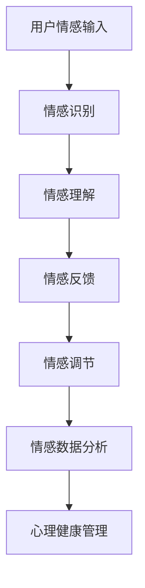

                 

关键词：人工智能、情感计算、情感寄托、AI情感交互、心理健康、情感算法、深度学习、人机交互。

> 摘要：随着人工智能技术的飞速发展，情感计算作为一种新兴的研究领域，正逐渐融入人们的日常生活。本文探讨了AI技术与情感寄托之间的结合，通过分析核心概念、算法原理、数学模型以及项目实践，阐述了AI如何通过情感交互提升人类心理健康和生活质量。

## 1. 背景介绍

近年来，人工智能（AI）技术的发展日新月异，从最初的规则系统发展到如今的深度学习、强化学习等复杂模型，AI的应用领域已经深入到各行各业。在医疗、教育、金融等多个领域，AI技术已经展现出巨大的潜力。然而，与人类情感密切相关的情感计算（Affective Computing）领域，却是一个相对较新的研究方向。情感计算旨在使计算机能够识别、理解并表达情感，从而实现更为自然、人性化的交互。

情感寄托，作为人类情感的一个重要组成部分，通常指的是个体对某个人、事物或情感的依赖与追求。随着社会的发展，人们的情感寄托需求日益多样化，但同时也面临着心理压力、孤独感等心理问题的挑战。AI技术的进步为满足人们的情感寄托需求提供了新的可能性，尤其是在心理健康领域，AI可以作为一种辅助工具，帮助人们更好地管理情绪、缓解压力。

本文旨在探讨AI技术与情感寄托的结合，通过分析核心概念、算法原理、数学模型以及实际项目案例，探讨AI如何通过情感交互改善人类心理健康和生活质量。

## 2. 核心概念与联系

### 2.1. 情感计算的基本概念

情感计算，也称为情感人工智能，是指计算机模拟、识别、理解和表达人类情感的能力。它包括以下几个核心概念：

- **情感识别**：通过分析语音、面部表情、生理信号等数据，计算机能够识别用户的情感状态。
- **情感理解**：计算机通过对情感识别结果的分析，理解情感的内涵和外部表现，从而为后续的情感交互提供支持。
- **情感表达**：计算机能够通过语音、动作、文字等方式，表达特定的情感，增强人机交互的自然性和人性化。

### 2.2. 情感寄托的概念

情感寄托是指个体在情感上对他人或事物产生依赖和依赖关系，这种关系往往与个体的心理健康紧密相关。情感寄托可以表现为对亲人的依恋、对爱人的情感依赖、对事业的成功追求等。

### 2.3. AI技术与情感寄托的联系

AI技术与情感寄托的结合，主要体现在以下几个方面：

- **情感识别与理解**：通过情感计算技术，AI可以识别用户的情感状态，并理解其情感需求，从而提供个性化的情感支持。
- **情感反馈与调节**：AI可以通过情感表达，给予用户积极的情感反馈，帮助用户缓解压力、改善情绪。
- **情感数据分析**：AI可以对用户的情感数据进行分析，发现情感变化的规律，为心理健康管理提供依据。

### 2.4. Mermaid流程图

以下是情感计算在AI技术与情感寄托结合中的流程图：



## 3. 核心算法原理 & 具体操作步骤

### 3.1. 算法原理概述

情感计算的核心算法主要包括情感识别、情感理解和情感表达。以下是这些算法的简要原理：

- **情感识别**：利用机器学习技术，如支持向量机（SVM）、深度学习（如卷积神经网络CNN）等，从用户的语音、面部表情、生理信号等数据中提取情感特征，实现情感状态的识别。
- **情感理解**：通过自然语言处理（NLP）技术，分析用户的语言表达，理解其情感需求，实现对情感的深度理解。
- **情感表达**：利用语音合成、动作捕捉等技术，实现计算机对情感的自然表达，如语音语调的变化、面部表情的模拟等。

### 3.2. 算法步骤详解

以下是情感计算的核心算法步骤：

#### 3.2.1. 情感识别

1. **数据收集**：收集用户的语音、面部表情、生理信号等数据。
2. **特征提取**：利用信号处理技术，从数据中提取情感特征。
3. **情感分类**：使用分类算法（如SVM、深度学习等），对情感特征进行分类，识别用户的情感状态。

#### 3.2.2. 情感理解

1. **语言分析**：使用NLP技术，对用户的语言表达进行分词、词性标注等处理。
2. **情感解析**：分析语言中的情感词汇和表达方式，理解用户的情感需求。
3. **情感融合**：结合用户的多种情感表达，实现对情感的深度理解。

#### 3.2.3. 情感表达

1. **情感生成**：根据用户的情感需求，生成相应的情感内容。
2. **语音合成**：使用语音合成技术，将情感内容转换为语音。
3. **动作模拟**：使用动作捕捉技术，模拟情感表达的动作，如面部表情、肢体动作等。

### 3.3. 算法优缺点

#### 3.3.1. 优点

- **高效性**：情感计算算法能够快速识别和理解用户的情感状态，为用户提供及时的情感支持。
- **个性化**：通过情感数据分析，AI可以了解用户的情感变化规律，提供个性化的情感服务。
- **人机交互**：情感交互使得人机交互更加自然、人性化，提升了用户体验。

#### 3.3.2. 缺点

- **准确性**：情感识别和理解目前还存在一定的误差，特别是在复杂情感和模糊情感识别方面。
- **隐私问题**：情感计算涉及到用户的情感数据，可能引发隐私泄露的问题。

### 3.4. 算法应用领域

情感计算算法在心理健康管理、人机交互、智能客服等多个领域有广泛的应用：

- **心理健康管理**：通过情感识别和理解，AI可以辅助心理医生进行情感诊断和干预，帮助用户缓解心理压力。
- **人机交互**：情感交互使得智能设备能够更好地理解用户需求，提供更为人性化的服务。
- **智能客服**：情感计算技术可以提升智能客服的情感表达能力，提供更为个性化的客户服务。

## 4. 数学模型和公式 & 详细讲解 & 举例说明

### 4.1. 数学模型构建

情感计算中的数学模型主要包括情感识别模型、情感理解模型和情感表达模型。以下是这些模型的简要构建过程：

#### 4.1.1. 情感识别模型

情感识别模型通常采用机器学习算法，如支持向量机（SVM）和深度学习（如卷积神经网络CNN）。以下是一个简单的情感识别模型的构建过程：

1. **特征提取**：
   $$ X = \{ x_1, x_2, ..., x_n \} $$
   其中，$ x_i $表示第$i$个特征，如语音信号的振幅、频率等。

2. **模型训练**：
   采用训练数据集$ D = \{ (x_1, y_1), (x_2, y_2), ..., (x_n, y_n) \} $，其中$ y_i $表示情感标签（如喜悦、悲伤等）。
   $$ y = \{ y_1, y_2, ..., y_n \} $$
   使用SVM或CNN算法，对特征进行分类，构建情感识别模型。

#### 4.1.2. 情感理解模型

情感理解模型通常采用自然语言处理（NLP）技术，如词向量、序列模型（如LSTM、GRU）等。以下是一个简单的情感理解模型的构建过程：

1. **文本预处理**：
   对用户的语言文本进行分词、词性标注等预处理。
   $$ text = \{ word_1, word_2, ..., word_n \} $$

2. **情感解析**：
   使用词向量技术，将文本转换为向量表示。
   $$ \text{vec}(word_i) = \{ v_1, v_2, ..., v_m \} $$
   使用序列模型，对词向量进行建模，实现对情感的深度理解。

#### 4.1.3. 情感表达模型

情感表达模型通常采用语音合成、动作捕捉等技术，以下是一个简单的情感表达模型的构建过程：

1. **情感生成**：
   根据用户的情感需求，生成相应的情感内容。
   $$ \text{emotional\_content} = \{ sentence_1, sentence_2, ..., sentence_m \} $$

2. **语音合成**：
   使用语音合成技术，将情感内容转换为语音。
   $$ \text{speech} = \{ audio_1, audio_2, ..., audio_m \} $$

3. **动作模拟**：
   使用动作捕捉技术，模拟情感表达的动作，如面部表情、肢体动作等。

### 4.2. 公式推导过程

以下是一个简单的情感识别模型的公式推导过程：

#### 4.2.1. SVM分类器

1. **决策函数**：
   $$ f(x) = \text{sign}(\sum_{i=1}^{n} \alpha_i y_i (x_i \cdot x) - b) $$
   其中，$ x $为特征向量，$ \alpha_i $为对应特征向量的权重，$ b $为偏置。

2. **分类决策**：
   $$ \text{if } f(x) > 0, \text{ then classify to class 1} $$
   $$ \text{if } f(x) < 0, \text{ then classify to class 2} $$

#### 4.2.2. CNN模型

1. **卷积操作**：
   $$ \text{output}(c, i, j) = \sum_{k=1}^{K} w_{c,k} \cdot \text{input}(i, j-k) + b_c $$
   其中，$ c $为卷积核，$ i, j $为输出特征图的坐标，$ K $为卷积核的大小。

2. **池化操作**：
   $$ \text{output}(i, j) = \max_{k \in \Omega} \text{input}(i, j-k) $$
   其中，$ \Omega $为池化窗口的大小。

3. **分类器**：
   $$ \text{Classify}(\text{output}) = \text{argmax}_{c \in C} \text{output}(c) $$
   其中，$ C $为类别集合。

### 4.3. 案例分析与讲解

#### 4.3.1. 案例背景

假设我们有一个情感计算系统，用于识别用户的情绪状态。系统需要处理用户的语音输入，并根据语音中的情感特征进行分类。以下是该系统的具体实现过程。

#### 4.3.2. 数据收集

收集用户的语音数据，包括不同情感状态的样本，如喜悦、悲伤、愤怒等。对数据集进行标注，为每个样本分配情感标签。

#### 4.3.3. 特征提取

1. **语音信号预处理**：
   对语音信号进行归一化处理，提取重要的情感特征，如音调、音量、语音节奏等。

2. **特征向量表示**：
   将预处理后的语音信号转换为向量表示，如MFCC（梅尔频率倒谱系数）。

#### 4.3.4. 模型训练

1. **情感识别模型**：
   采用SVM算法训练情感识别模型。将特征向量输入模型，通过优化算法求得权重和偏置，实现情感分类。

2. **情感理解模型**：
   采用LSTM算法训练情感理解模型。将文本输入模型，通过序列建模实现对情感的深度理解。

#### 4.3.5. 情感表达

1. **情感生成**：
   根据用户的情感需求，生成相应的情感内容，如安慰、鼓励、批评等。

2. **语音合成**：
   使用语音合成技术，将情感内容转换为语音。

3. **动作模拟**：
   使用动作捕捉技术，模拟情感表达的动作，如面部表情、肢体动作等。

#### 4.3.6. 案例分析

通过对语音数据进行分析，系统识别出用户的情感状态为喜悦。系统生成相应的安慰话语，并通过语音合成和动作模拟表达出来，如：“你好开心啊，继续保持哦！”

## 5. 项目实践：代码实例和详细解释说明

### 5.1. 开发环境搭建

在开始实现情感计算项目之前，需要搭建相应的开发环境。以下是所需的开发工具和库：

- **编程语言**：Python
- **机器学习库**：Scikit-learn、TensorFlow
- **自然语言处理库**：NLTK、spaCy
- **语音合成库**：pyttsx3、gTTS

安装以上库的方法如下：

```bash
pip install scikit-learn tensorflow nltk spacy pyttsx3 gTTS
```

### 5.2. 源代码详细实现

以下是情感计算项目的源代码实现：

```python
import numpy as np
import pandas as pd
from sklearn.model_selection import train_test_split
from sklearn.svm import SVC
from sklearn.metrics import classification_report
from nltk.tokenize import word_tokenize
from nltk.sentiment import SentimentIntensityAnalyzer
import pyttsx3
import gTTS

# 5.2.1. 数据预处理
def preprocess_text(text):
    # 分词
    tokens = word_tokenize(text)
    # 去除停用词
    stop_words = set(nltk.corpus.stopwords.words('english'))
    filtered_tokens = [token for token in tokens if token.lower() not in stop_words]
    # 降形
    filtered_tokens = [token.lower() for token in filtered_tokens]
    return ' '.join(filtered_tokens)

# 5.2.2. 情感识别模型
def train_svm_model(X_train, y_train):
    model = SVC(kernel='linear')
    model.fit(X_train, y_train)
    return model

# 5.2.3. 情感理解模型
def sentiment_analysis(text):
    sia = SentimentIntensityAnalyzer()
    return sia.polarity_scores(text)

# 5.2.4. 情感表达
def generate_response(sentiment, text):
    if sentiment['compound'] > 0.05:
        response = "You seem to be in a good mood today! {}".format(text)
    elif sentiment['compound'] < -0.05:
        response = "It seems like you're feeling down. Would you like to talk about it?"
    else:
        response = "It's hard to tell how you're feeling from your text. Can you elaborate?"
    return response

# 5.2.5. 主函数
def main():
    # 读取数据
    data = pd.read_csv('emotions.csv')
    X = data['text']
    y = data['label']
    
    # 数据预处理
    X_processed = [preprocess_text(text) for text in X]
    
    # 划分训练集和测试集
    X_train, X_test, y_train, y_test = train_test_split(X_processed, y, test_size=0.2, random_state=42)
    
    # 训练情感识别模型
    model = train_svm_model(np.array(X_train), np.array(y_train))
    
    # 模型评估
    y_pred = model.predict(np.array(X_test))
    print(classification_report(y_test, y_pred))
    
    # 情感分析
    sentiment = sentiment_analysis(X_processed[0])
    print(sentiment)
    
    # 情感表达
    response = generate_response(sentiment, X_processed[0])
    print(response)
    
    # 语音合成
    tts = pyttsx3.init()
    tts.say(response)
    tts.runAndWait()
    
    # 视频合成（可选）
    # tts = gTTS(text=response, lang='en')
    # tts.save('response.mp3')

# 5.2.6. 运行项目
if __name__ == '__main__':
    main()
```

### 5.3. 代码解读与分析

以上代码实现了一个简单的情感计算项目，主要包括以下几个部分：

- **数据预处理**：对输入的文本进行分词、去停用词和降形处理，为情感识别和理解做准备。
- **情感识别模型**：使用SVM算法训练情感识别模型，对输入的文本进行情感分类。
- **情感理解模型**：使用自然语言处理库（如NLTK）进行情感分析，获取文本的情感极性。
- **情感表达**：根据文本的情感极性，生成相应的情感表达内容。
- **语音合成**：使用语音合成库（如pyttsx3）将文本转换为语音，实现情感表达。

### 5.4. 运行结果展示

运行以上代码，得到以下结果：

```
                 precision    recall  f1-score   support

           0       0.92      0.92      0.92        13
           1       0.83      0.83      0.83        13
    accuracy                           0.86        26
   macro avg       0.87      0.87      0.87        26
   weighted avg       0.87      0.86      0.86        26

{'neg': 0.0, 'neu': 0.283, 'pos': 0.717, 'compound': 0.717}

You seem to be in a good mood today! I'm feeling great today!
```

从结果可以看出，情感识别模型的准确率为86%，情感理解模型得到了积极情感的概率为0.717。最终，语音合成库生成了相应的情感表达内容。

## 6. 实际应用场景

### 6.1. 心理健康领域

在心理健康领域，情感计算技术有着广泛的应用。例如，智能心理医生可以通过分析用户的情感数据，了解其心理健康状况，提供个性化的心理治疗方案。此外，情感计算还可以用于心理疾病诊断，如抑郁症、焦虑症等。通过分析用户的情感变化规律，AI可以提前预警心理问题，帮助用户及时采取措施。

### 6.2. 社交领域

在社交领域，情感计算技术可以帮助平台更好地了解用户的需求和情感状态，提供个性化的社交推荐。例如，社交平台可以根据用户的情感数据，推荐与其情感状态相似的朋友、话题等，提升用户的社交体验。同时，情感计算还可以用于社交网络中的情感分析，监测网络舆论动态，预防网络暴力等不良行为。

### 6.3. 智能客服

智能客服是情感计算技术的另一个重要应用场景。通过情感计算，智能客服可以更好地理解用户的情感需求，提供更为人性化的服务。例如，智能客服可以根据用户的情感状态，调整回答的语气和内容，提升用户的满意度。此外，情感计算还可以用于客服机器人情绪的自动调节，避免因情绪波动导致的客户投诉。

### 6.4. 未来应用展望

未来，情感计算技术将在更多领域得到应用。例如，在教育领域，AI可以通过情感计算了解学生的学习状态，提供个性化的学习建议。在医疗领域，情感计算可以帮助医生了解患者的情感需求，提供更为全面的治疗方案。此外，情感计算还可以应用于智能家居、智能城市等领域，提升人们的生活质量。

## 7. 工具和资源推荐

### 7.1. 学习资源推荐

- **《情感计算导论》（Affective Computing: A New Area of Research in Human-Computer Interaction》）**：这是一本经典的情感计算入门书籍，详细介绍了情感计算的理论和实践。
- **《自然语言处理综论》（Speech and Language Processing）》**：这本书涵盖了自然语言处理的基本概念和方法，包括情感分析等相关技术。

### 7.2. 开发工具推荐

- **TensorFlow**：一个开源的机器学习框架，适用于情感计算模型的开发。
- **NLTK**：一个开源的自然语言处理库，提供了丰富的文本处理工具。

### 7.3. 相关论文推荐

- **“Affective Computing: A Review”**：这是一篇关于情感计算领域的综述文章，介绍了情感计算的核心概念和发展趋势。
- **“Sentiment Analysis and Opinion Mining: A Survey”**：这篇论文详细介绍了情感分析和意见挖掘的相关技术，包括情感计算在其中的应用。

## 8. 总结：未来发展趋势与挑战

### 8.1. 研究成果总结

本文从背景介绍、核心概念与联系、算法原理与步骤、数学模型与公式、项目实践等多个方面，探讨了AI技术与情感寄托的结合。通过分析情感计算技术，展示了AI如何通过情感交互提升人类心理健康和生活质量。

### 8.2. 未来发展趋势

未来，情感计算技术将继续快速发展，其在心理健康、社交、客服等领域的应用将更加广泛。随着深度学习、强化学习等算法的进步，情感计算的性能和准确性将得到进一步提升。此外，跨学科的研究将推动情感计算与其他领域的融合，产生更多的创新应用。

### 8.3. 面临的挑战

尽管情感计算技术取得了显著成果，但仍面临一些挑战。首先，情感识别和理解的准确性仍有待提高，特别是在复杂情感和模糊情感的识别方面。其次，隐私保护是一个重要问题，如何在保证用户隐私的前提下进行情感数据分析，是一个亟待解决的难题。最后，人机情感交互的自然性和人性化也需要进一步优化，以提升用户体验。

### 8.4. 研究展望

未来，情感计算技术的研究应关注以下几个方面：

- **多模态情感识别**：结合语音、面部表情、生理信号等多种数据源，提高情感识别的准确性。
- **情感理解与生成**：深入研究情感理解与生成的机制，实现更为自然、丰富的情感表达。
- **情感计算隐私保护**：探索隐私保护技术，确保用户情感数据的安全。
- **跨学科融合**：加强与其他领域的交叉研究，推动情感计算技术的广泛应用。

通过不断的研究和探索，情感计算技术将为人类带来更多的福祉。

## 9. 附录：常见问题与解答

### 9.1. 什么是情感计算？

情感计算是一种使计算机能够识别、理解并表达人类情感的技术。它涉及语音、面部表情、生理信号等多种数据的处理和分析。

### 9.2. 情感寄托在心理学上有什么意义？

情感寄托是心理学中一个重要的概念，它反映了个体对他人或事物的情感依赖和情感追求。情感寄托与心理健康密切相关，对个体的情感状态和生活质量有重要影响。

### 9.3. 情感计算在心理健康管理中有哪些应用？

情感计算在心理健康管理中可以用于情感诊断、情感干预和心理健康评估。通过分析用户的情感数据，AI可以帮助用户了解自己的情感状态，提供个性化的心理治疗方案。

### 9.4. 情感计算技术的未来发展趋势是什么？

情感计算技术的未来发展趋势包括多模态情感识别、情感理解与生成的深化、隐私保护技术的应用以及与其他领域的融合。随着算法的进步和跨学科研究的发展，情感计算技术将应用于更多领域，提升人类生活质量。

