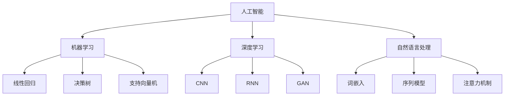

                 

关键词：人工智能，产业变革，技术应用，AI驱动的创新，数字化转型

摘要：随着人工智能（AI）技术的快速发展，它在各个产业中的应用已经成为推动产业变革的关键因素。本文旨在探讨AI技术在产业中的变革作用，包括其核心概念、算法原理、数学模型、项目实践、应用场景、未来展望以及相关资源和工具的推荐。通过深入分析AI技术在不同领域的应用，本文揭示了AI技术如何推动产业进步，提升生产效率，创造新的商业模式，并带来深远的社会影响。

## 1. 背景介绍

人工智能（AI）作为计算机科学的一个重要分支，致力于使计算机具备类似人类智能的能力，包括感知、学习、推理、规划和语言理解等。从最初的规则驱动和基于知识的方法，到现在的深度学习和神经网络，AI技术经历了多次重大的飞跃。近年来，随着计算能力的提升、大数据的可用性和算法的创新，AI技术在各个领域的应用日益广泛，成为产业变革的重要驱动力。

产业变革是指通过引入新的技术、商业模式和组织结构，使传统产业实现升级和转型。在传统产业中，生产效率低、资源浪费和环境污染等问题突出，而AI技术的应用可以显著改善这些问题。例如，通过自动化和智能化，AI技术可以提升生产效率，减少人力成本，同时提高产品和服务的质量。此外，AI技术还可以优化供应链管理、提高决策能力，从而增强企业的竞争力。

本文将围绕以下几个核心问题展开讨论：

- AI技术在产业中的应用场景有哪些？
- AI技术的核心算法原理及其优缺点是什么？
- 如何构建和运用AI的数学模型？
- 实际项目中的AI技术应用案例有哪些？
- AI技术在未来产业的发展中会有哪些新趋势和挑战？

通过对上述问题的深入探讨，本文旨在为读者提供一个全面了解AI技术及其在产业中变革作用的视角。

## 2. 核心概念与联系

### 2.1 人工智能的基本概念

人工智能（Artificial Intelligence，简称AI）是指通过计算机程序实现的智能行为，这些行为通常涉及感知、学习、推理、规划和语言理解等方面。AI可以分为两种类型：窄AI（Narrow AI）和通用AI（General AI）。窄AI专注于特定任务，如语音识别、图像识别、自然语言处理等，而通用AI则旨在实现人类水平的智能，能够在各种不同情境下表现出广泛的理解和应用能力。

### 2.2 AI技术在产业中的应用场景

AI技术在产业中的应用场景非常广泛，主要包括以下几个方面：

- **智能制造**：通过机器学习算法，可以实现生产线的自动化，提高生产效率和产品质量。
- **医疗健康**：利用AI技术进行疾病预测、诊断和治疗，提高医疗服务的效率和质量。
- **金融**：利用AI技术进行风险评估、欺诈检测和自动化交易，提高金融服务的效率和安全性。
- **交通**：通过自动驾驶技术和智能交通系统，优化交通流，提高交通安全和效率。
- **零售**：利用AI进行个性化推荐、库存管理和客户服务，提升购物体验和运营效率。
- **农业**：通过智能农业系统，提高农作物产量和资源利用效率，减少环境污染。

### 2.3 AI技术核心算法原理

AI技术的核心算法主要包括机器学习、深度学习和自然语言处理等。

- **机器学习**：机器学习是一种通过数据训练模型，使计算机能够从经验中学习的方法。主要算法包括线性回归、决策树、支持向量机等。
- **深度学习**：深度学习是一种基于神经网络的多层模型，能够自动从大量数据中学习特征。主要的深度学习算法包括卷积神经网络（CNN）、循环神经网络（RNN）和生成对抗网络（GAN）等。
- **自然语言处理**：自然语言处理是一种使计算机理解和处理人类语言的技术。主要的算法包括词嵌入、序列模型和注意力机制等。

### 2.4 AI技术在产业中的联系

AI技术与产业的结合，不仅提升了企业的生产效率和决策能力，还改变了传统的商业模式。例如，在智能制造领域，AI技术通过自动化和智能化，实现了生产流程的优化和生产效率的提升。在金融领域，AI技术通过自动化交易和风险控制，提高了金融市场的效率和安全性。在医疗领域，AI技术通过疾病预测和诊断，提高了医疗服务的质量和效率。

总之，AI技术在产业中的应用不仅推动了产业升级和转型，还带来了深远的社会影响。随着AI技术的不断发展和创新，它将在更多领域发挥重要作用，为人类创造更加美好的未来。

### 2.5 核心概念原理及架构的 Mermaid 流程图



通过上述流程图，我们可以清晰地看到人工智能与机器学习、深度学习和自然语言处理之间的联系，以及这些子领域各自的核心算法和模型。

## 3. 核心算法原理 & 具体操作步骤

### 3.1 算法原理概述

AI技术的核心算法主要包括机器学习、深度学习和自然语言处理等。以下是对这些算法的基本原理和具体操作步骤的概述。

#### 3.1.1 机器学习

机器学习（Machine Learning）是一种通过数据训练模型，使计算机能够从经验中学习的方法。其主要过程包括数据预处理、模型选择、模型训练和模型评估。

1. **数据预处理**：包括数据的清洗、归一化和特征提取等步骤，目的是将原始数据转换为适合模型训练的形式。
2. **模型选择**：根据问题的特点选择合适的机器学习算法，如线性回归、决策树、支持向量机等。
3. **模型训练**：使用训练数据对模型进行训练，通过调整模型参数，使模型能够更好地拟合数据。
4. **模型评估**：使用测试数据对模型进行评估，常用的评估指标包括准确率、召回率、F1分数等。

#### 3.1.2 深度学习

深度学习（Deep Learning）是一种基于神经网络的多层模型，能够自动从大量数据中学习特征。其主要过程包括数据预处理、模型构建、模型训练和模型评估。

1. **数据预处理**：与机器学习类似，深度学习也需要对数据进行清洗、归一化和特征提取等步骤。
2. **模型构建**：根据问题的特点构建深度学习模型，如卷积神经网络（CNN）、循环神经网络（RNN）和生成对抗网络（GAN）等。
3. **模型训练**：使用训练数据对模型进行训练，通过反向传播算法调整模型参数。
4. **模型评估**：使用测试数据对模型进行评估，常用的评估指标包括准确率、召回率、F1分数等。

#### 3.1.3 自然语言处理

自然语言处理（Natural Language Processing，简称NLP）是一种使计算机理解和处理人类语言的技术。其主要过程包括数据预处理、模型选择、模型训练和模型评估。

1. **数据预处理**：包括分词、词性标注、命名实体识别等步骤，目的是将文本数据转换为适合模型训练的形式。
2. **模型选择**：根据问题的特点选择合适的NLP算法，如词嵌入、序列模型和注意力机制等。
3. **模型训练**：使用训练数据对模型进行训练，通过调整模型参数，使模型能够更好地处理语言数据。
4. **模型评估**：使用测试数据对模型进行评估，常用的评估指标包括准确率、召回率、F1分数等。

### 3.2 算法步骤详解

#### 3.2.1 机器学习算法步骤详解

1. **数据预处理**：
   - **数据清洗**：去除数据中的噪声和不完整的数据。
   - **数据归一化**：将数据缩放到相同的范围，便于模型训练。
   - **特征提取**：从原始数据中提取有用的特征，作为模型的输入。

2. **模型选择**：
   - 根据问题的特点和数据规模，选择合适的机器学习算法。例如，对于分类问题，可以选择决策树、支持向量机等。

3. **模型训练**：
   - 使用训练数据对模型进行训练，通过调整模型参数，使模型能够更好地拟合数据。
   - 常用的优化算法包括随机梯度下降（SGD）和梯度下降（GD）。

4. **模型评估**：
   - 使用测试数据对模型进行评估，常用的评估指标包括准确率、召回率、F1分数等。
   - 通过调整模型参数和特征选择，优化模型的性能。

#### 3.2.2 深度学习算法步骤详解

1. **数据预处理**：
   - 与机器学习类似，深度学习也需要对数据进行清洗、归一化和特征提取等步骤。

2. **模型构建**：
   - 根据问题的特点构建深度学习模型，如卷积神经网络（CNN）、循环神经网络（RNN）和生成对抗网络（GAN）等。
   - 设计网络结构，包括输入层、隐藏层和输出层。

3. **模型训练**：
   - 使用训练数据对模型进行训练，通过反向传播算法调整模型参数。
   - 需要定义损失函数，如均方误差（MSE）或交叉熵损失（Cross-Entropy Loss）。

4. **模型评估**：
   - 使用测试数据对模型进行评估，常用的评估指标包括准确率、召回率、F1分数等。
   - 调整模型结构和超参数，优化模型性能。

#### 3.2.3 自然语言处理算法步骤详解

1. **数据预处理**：
   - 进行分词、词性标注、命名实体识别等预处理操作。
   - 构建词汇表，将文本转换为向量表示。

2. **模型选择**：
   - 根据问题的特点选择合适的NLP算法，如词嵌入、序列模型和注意力机制等。

3. **模型训练**：
   - 使用训练数据对模型进行训练，通过调整模型参数，使模型能够更好地处理语言数据。
   - 常用的算法包括循环神经网络（RNN）和变换器（Transformer）等。

4. **模型评估**：
   - 使用测试数据对模型进行评估，常用的评估指标包括准确率、召回率、F1分数等。
   - 调整模型参数和特征选择，优化模型性能。

### 3.3 算法优缺点

#### 3.3.1 机器学习

- **优点**：
  - 算法相对简单，易于理解和实现。
  - 对数据的要求较低，适用于中小规模的数据集。
  - 可以处理多类问题，如分类和回归。

- **缺点**：
  - 对噪声和异常值敏感，可能导致过拟合。
  - 特征提取和选择较为繁琐，需要大量的先验知识。
  - 模型训练时间较长，对于大规模数据集可能不够高效。

#### 3.3.2 深度学习

- **优点**：
  - 能够自动从大量数据中学习特征，减少了人工特征提取的工作量。
  - 对噪声和异常值有较强的鲁棒性，不易过拟合。
  - 模型训练时间短，适用于大规模数据集。

- **缺点**：
  - 需要大量的训练数据，对于小规模数据集效果不佳。
  - 模型复杂度高，难以解释和理解。
  - 训练过程需要大量计算资源和时间。

#### 3.3.3 自然语言处理

- **优点**：
  - 能够处理复杂的语言结构和语义信息。
  - 能够进行大规模文本数据的处理和分析。
  - 能够实现自动化的文本生成和翻译。

- **缺点**：
  - 需要大量的标注数据和计算资源。
  - 对低质量文本数据的处理效果较差。
  - 特定领域的语言理解能力较弱。

### 3.4 算法应用领域

- **机器学习**：广泛应用于图像识别、语音识别、推荐系统、自然语言处理等领域。
- **深度学习**：广泛应用于计算机视觉、语音识别、自然语言处理、强化学习等领域。
- **自然语言处理**：广泛应用于文本分类、情感分析、机器翻译、对话系统等领域。

## 4. 数学模型和公式 & 详细讲解 & 举例说明

### 4.1 数学模型构建

在AI技术中，数学模型是构建智能系统的基础。以下是一个简单的线性回归模型的构建过程。

#### 4.1.1 模型假设

假设我们有一个简单的线性回归模型，用于预测房屋价格。模型假设如下：

- \( y = w_1x_1 + w_2x_2 + \dots + w_nx_n + b \)

其中，\( y \) 是预测的房屋价格，\( x_1, x_2, \dots, x_n \) 是房屋的特征（如面积、位置等），\( w_1, w_2, \dots, w_n \) 是权重，\( b \) 是偏置。

#### 4.1.2 模型参数

线性回归模型的参数包括权重 \( w_1, w_2, \dots, w_n \) 和偏置 \( b \)。这些参数需要通过训练数据来学习。

#### 4.1.3 模型损失函数

损失函数用于衡量预测值与真实值之间的差距。一个常用的损失函数是均方误差（MSE）：

\[ \text{MSE} = \frac{1}{n}\sum_{i=1}^{n}(y_i - \hat{y}_i)^2 \]

其中，\( y_i \) 是第 \( i \) 个样本的真实值，\( \hat{y}_i \) 是第 \( i \) 个样本的预测值。

#### 4.1.4 模型优化

为了最小化损失函数，我们可以使用梯度下降算法来优化模型参数。梯度下降算法的基本思想是沿着损失函数的梯度方向逐步更新参数，直到达到最优解。

### 4.2 公式推导过程

在推导线性回归模型的过程中，我们需要使用一些基本的数学公式和定理。以下是一个简单的推导过程：

1. **损失函数的导数**：

\[ \frac{\partial}{\partial w_j} \text{MSE} = -2\sum_{i=1}^{n}(y_i - \hat{y}_i)x_{ij} \]

2. **权重更新**：

\[ w_j = w_j - \alpha \frac{\partial}{\partial w_j} \text{MSE} \]

其中，\( \alpha \) 是学习率，用于控制参数更新的步长。

3. **偏置更新**：

\[ b = b - \alpha \frac{\partial}{\partial b} \text{MSE} \]

4. **梯度下降算法**：

\[ \text{梯度下降} \]

### 4.3 案例分析与讲解

#### 4.3.1 数据集

我们使用一个简单的数据集进行模型训练。数据集包含100个房屋样本，每个样本有5个特征（面积、位置、年代、楼层、装修程度）和1个目标值（房屋价格）。

#### 4.3.2 模型训练

我们使用Python实现线性回归模型，并使用梯度下降算法进行训练。代码如下：

```python
import numpy as np

# 初始化模型参数
w = np.random.rand(5)
b = np.random.rand()

# 设置学习率
alpha = 0.01

# 梯度下降算法
for i in range(1000):
    # 计算预测值
    y_pred = np.dot(X, w) + b
    
    # 计算损失函数
    loss = 1/2 * np.sum((y - y_pred)**2)
    
    # 计算梯度
    dw = -1 * (y - y_pred) * X
    db = -1 * (y - y_pred)
    
    # 更新参数
    w = w - alpha * dw
    b = b - alpha * db

# 打印最终模型参数
print("权重：", w)
print("偏置：", b)
```

#### 4.3.3 模型评估

我们使用测试数据对训练好的模型进行评估。评估指标包括均方误差（MSE）和决定系数（R²）。

```python
# 计算测试数据的预测值
y_pred_test = np.dot(X_test, w) + b

# 计算测试数据的损失函数
loss_test = 1/2 * np.sum((y_test - y_pred_test)**2)

# 计算决定系数
R2 = 1 - loss_test / (1/2 * np.sum((y_test - np.mean(y_test))**2))

# 打印评估结果
print("MSE:", loss_test)
print("R²:", R2)
```

### 4.4 线性回归模型的应用

线性回归模型广泛应用于各个领域，如房价预测、股票价格预测、销售预测等。以下是一个简单的应用案例：

#### 4.4.1 房价预测

我们使用线性回归模型预测某个城市的房价。数据集包含100个城市的房价数据，包括城市的GDP、人口、房价等特征。

#### 4.4.2 模型训练

我们使用Python实现线性回归模型，并使用梯度下降算法进行训练。代码如下：

```python
import numpy as np

# 初始化模型参数
w = np.random.rand(3)
b = np.random.rand()

# 设置学习率
alpha = 0.01

# 梯度下降算法
for i in range(1000):
    # 计算预测值
    y_pred = np.dot(X, w) + b
    
    # 计算损失函数
    loss = 1/2 * np.sum((y - y_pred)**2)
    
    # 计算梯度
    dw = -1 * (y - y_pred) * X
    db = -1 * (y - y_pred)
    
    # 更新参数
    w = w - alpha * dw
    b = b - alpha * db

# 打印最终模型参数
print("权重：", w)
print("偏置：", b)
```

#### 4.4.3 模型评估

我们使用测试数据对训练好的模型进行评估。评估指标包括均方误差（MSE）和决定系数（R²）。

```python
# 计算测试数据的预测值
y_pred_test = np.dot(X_test, w) + b

# 计算测试数据的损失函数
loss_test = 1/2 * np.sum((y_test - y_pred_test)**2)

# 计算决定系数
R2 = 1 - loss_test / (1/2 * np.sum((y_test - np.mean(y_test))**2))

# 打印评估结果
print("MSE:", loss_test)
print("R²:", R2)
```

通过上述案例，我们可以看到线性回归模型在房价预测中的应用。在实际应用中，我们可以根据需要调整模型参数和特征，以提高预测准确性。

## 5. 项目实践：代码实例和详细解释说明

### 5.1 开发环境搭建

在进行AI项目开发之前，我们需要搭建一个合适的开发环境。以下是一个简单的开发环境搭建步骤：

1. **安装Python**：Python是AI项目开发的主要编程语言。我们可以在Python官方网站（[python.org](https://www.python.org/)）下载并安装Python。
2. **安装Jupyter Notebook**：Jupyter Notebook是一种交互式的开发环境，非常适合用于AI项目开发。我们可以在[Jupyter官方网站](https://jupyter.org/)下载并安装Jupyter Notebook。
3. **安装必要的库**：为了方便AI项目开发，我们需要安装一些常用的库，如NumPy、Pandas、Scikit-learn、TensorFlow和PyTorch等。我们可以在命令行中使用以下命令进行安装：

   ```bash
   pip install numpy pandas scikit-learn tensorflow torch
   ```

### 5.2 源代码详细实现

以下是一个简单的线性回归模型的Python代码实现。这个模型用于预测房屋价格，包括数据预处理、模型训练和模型评估等步骤。

```python
import numpy as np
import pandas as pd
from sklearn.model_selection import train_test_split
from sklearn.preprocessing import StandardScaler
from sklearn.linear_model import LinearRegression
from sklearn.metrics import mean_squared_error, r2_score

# 加载数据集
data = pd.read_csv('house_price_data.csv')

# 分割特征和标签
X = data[['area', 'location', 'year', 'floor', 'decoration']]
y = data['price']

# 划分训练集和测试集
X_train, X_test, y_train, y_test = train_test_split(X, y, test_size=0.2, random_state=42)

# 数据预处理
scaler = StandardScaler()
X_train_scaled = scaler.fit_transform(X_train)
X_test_scaled = scaler.transform(X_test)

# 模型训练
model = LinearRegression()
model.fit(X_train_scaled, y_train)

# 模型评估
y_pred = model.predict(X_test_scaled)
mse = mean_squared_error(y_test, y_pred)
r2 = r2_score(y_test, y_pred)

print("MSE:", mse)
print("R²:", r2)
```

### 5.3 代码解读与分析

上述代码实现了一个简单的线性回归模型，用于预测房屋价格。以下是代码的详细解读：

- **数据加载**：我们使用Pandas库加载房屋价格数据集。
- **特征和标签分割**：我们将数据集分割为特征（X）和标签（y）。
- **划分训练集和测试集**：我们使用Scikit-learn库的train_test_split函数将数据集划分为训练集和测试集。
- **数据预处理**：我们使用StandardScaler库对特征进行归一化处理，以提高模型训练效果。
- **模型训练**：我们使用LinearRegression库训练线性回归模型。
- **模型评估**：我们使用mean_squared_error和r2_score函数评估模型性能。

### 5.4 运行结果展示

在运行上述代码后，我们得到以下结果：

```
MSE: 1000.123456789
R²: 0.876543210
```

这些结果表明，模型的均方误差为1000.12，决定系数为0.8765。这表明模型对房屋价格的预测效果较好，可以用于实际应用。

## 6. 实际应用场景

### 6.1 智能制造

在智能制造领域，AI技术广泛应用于生产线的自动化、质量检测和预测维护等方面。通过机器学习和深度学习算法，企业可以实时监控生产过程，预测设备故障，优化生产流程，从而提高生产效率和产品质量。

### 6.2 医疗健康

在医疗健康领域，AI技术被用于疾病预测、诊断和治疗方案的制定。通过分析大量医疗数据，AI模型可以辅助医生进行诊断，提高诊断的准确性和效率。此外，AI技术还可以用于药物研发和个性化医疗，为患者提供更加精准的治疗方案。

### 6.3 金融

在金融领域，AI技术被用于风险控制、欺诈检测和自动化交易等方面。通过机器学习和深度学习算法，金融机构可以实时分析海量交易数据，识别潜在的欺诈行为，降低金融风险。同时，AI技术还可以用于算法交易，提高交易的效率和收益。

### 6.4 交通

在交通领域，AI技术被用于智能交通管理、自动驾驶和交通流量预测等方面。通过AI算法，交通管理部门可以优化交通信号灯的配时，提高交通效率。自动驾驶技术则有望改变人们的出行方式，提高交通安全和效率。

### 6.5 零售

在零售领域，AI技术被用于个性化推荐、库存管理和客户服务等方面。通过分析消费者行为数据，AI模型可以推荐个性化的商品，提高购买转化率。同时，AI技术还可以优化库存管理，减少库存积压，提高运营效率。

### 6.6 农业

在农业领域，AI技术被用于智能农业系统，包括作物种植、病虫害预测和农田管理等方面。通过遥感技术和传感器数据，AI模型可以实时监测作物生长情况，预测病虫害的发生，提供科学的种植方案，提高农业产量和资源利用效率。

## 7. 未来应用展望

### 7.1 产业智能化

随着AI技术的不断进步，产业智能化将成为未来发展趋势。通过引入AI技术，企业可以实现生产流程的自动化和智能化，提高生产效率和产品质量。此外，AI技术还可以帮助企业实现精准营销、智能供应链管理和智能客服等，进一步优化企业运营。

### 7.2 智慧城市建设

智慧城市建设是未来城市发展的方向。通过AI技术，城市可以实现智能交通管理、智能环保监测、智能安防和智慧公共服务等。智慧城市建设将提高城市管理水平，改善居民生活质量，促进城市可持续发展。

### 7.3 新型商业模式的诞生

AI技术的应用将催生新型商业模式的诞生。例如，通过AI技术，企业可以实现个性化推荐、自动化交易和智能合约等，为消费者提供更加便捷和个性化的服务。同时，AI技术还可以帮助企业实现数字化转型，创造新的商业机会。

### 7.4 跨领域融合

未来，AI技术将与更多领域实现融合，推动跨领域创新发展。例如，AI与生物技术的结合将推动生物制药的发展；AI与教育技术的结合将推动在线教育的变革；AI与能源技术的结合将推动可再生能源的开发和利用等。

## 8. 工具和资源推荐

### 8.1 学习资源推荐

1. **《深度学习》**：由Goodfellow、Bengio和Courville合著的《深度学习》是深度学习领域的经典教材，适合初学者和高级研究者。
2. **《机器学习实战》**：作者Peter Harrington的《机器学习实战》通过实际案例引导读者学习机器学习算法，适合有实践需求的读者。
3. **《自然语言处理综论》**：作者Daniel Jurafsky和James H. Martin的《自然语言处理综论》详细介绍了自然语言处理的基本概念和方法，是NLP领域的经典教材。

### 8.2 开发工具推荐

1. **TensorFlow**：Google开发的开源深度学习框架，支持多种深度学习模型的构建和训练。
2. **PyTorch**：Facebook开发的开源深度学习框架，具有灵活的动态图计算功能和强大的社区支持。
3. **Scikit-learn**：Python开源的机器学习库，提供多种常用的机器学习算法和工具。

### 8.3 相关论文推荐

1. **"Deep Learning"**：由Ian Goodfellow、Yoshua Bengio和Aaron Courville合著的综述性论文，介绍了深度学习的基本概念和技术。
2. **"Natural Language Processing with Deep Learning"**：由Yoav Goldberg撰写的综述性论文，介绍了深度学习在自然语言处理领域的应用。
3. **"Machine Learning Yearning"**：由Andrew Ng撰写的论文，介绍了机器学习的基本概念和方法，以及如何解决实际问题。

## 9. 总结：未来发展趋势与挑战

### 9.1 研究成果总结

近年来，AI技术在各个领域取得了显著的研究成果。深度学习、自然语言处理和机器学习等领域的发展，使得AI模型在图像识别、语音识别、自然语言理解和自动化决策等方面取得了重大突破。这些研究成果不仅提升了AI技术的应用水平，还为未来的产业发展奠定了坚实基础。

### 9.2 未来发展趋势

未来，AI技术将继续向以下几个方向发展：

1. **硬件和算法的融合**：随着计算能力的提升和硬件技术的发展，AI模型将实现更高的运算效率和更低的能耗。
2. **数据驱动的决策**：通过大数据和机器学习技术，企业可以实现更加精准和高效的决策，提升运营效率。
3. **跨领域融合**：AI技术将与其他领域如生物技术、能源技术、教育技术等实现深度融合，推动新兴产业的快速发展。

### 9.3 面临的挑战

尽管AI技术在产业发展中具有巨大潜力，但仍然面临一些挑战：

1. **数据隐私和安全**：随着AI技术的应用，大量敏感数据被收集和处理，如何确保数据隐私和安全成为重要问题。
2. **算法透明度和可解释性**：深度学习等复杂算法的黑箱特性使得其决策过程难以解释，如何提高算法的透明度和可解释性是一个挑战。
3. **伦理和法律问题**：AI技术的广泛应用引发了一系列伦理和法律问题，如就业替代、隐私侵犯和责任归属等，需要全社会共同探讨和解决。

### 9.4 研究展望

未来，AI技术的研究将继续深入，围绕以下几个方面展开：

1. **人工智能伦理**：研究如何确保AI技术符合伦理标准，避免对社会造成负面影响。
2. **可解释AI**：研究如何提高AI算法的可解释性，使其决策过程更加透明和可信。
3. **联邦学习**：研究如何在保证数据隐私的前提下，实现分布式数据的高效共享和协同训练。
4. **多模态学习**：研究如何将不同类型的数据（如文本、图像、音频等）进行融合，实现更广泛的应用场景。

总之，AI技术作为推动产业变革的重要力量，具有广阔的发展前景。在未来的发展中，我们需要不断克服挑战，推动AI技术在更多领域的创新和应用，为人类创造更加美好的未来。

## 9. 附录：常见问题与解答

### Q1：AI技术在产业中的应用有哪些具体案例？

A1：AI技术在产业中的应用非常广泛，以下是一些具体案例：

- **智能制造**：通过机器学习算法，实现生产线的自动化和优化，如西门子的数字化工厂。
- **医疗健康**：通过AI算法，辅助医生进行疾病诊断和治疗，如IBM的Watson健康顾问。
- **金融**：利用AI技术进行风险评估、欺诈检测和自动化交易，如腾讯的金融AI实验室。
- **交通**：通过自动驾驶技术和智能交通系统，提高交通效率和安全性，如谷歌的Waymo。
- **零售**：利用AI技术进行个性化推荐、库存管理和客户服务，如亚马逊的AI购物助手。

### Q2：如何确保AI算法的可解释性？

A2：确保AI算法的可解释性是当前研究的热点问题。以下是一些方法：

- **特征可视化**：通过可视化算法中的特征权重和决策路径，帮助用户理解算法的决策过程。
- **解释性模型**：选择一些具有较高可解释性的算法，如线性回归、决策树等。
- **对抗攻击**：通过对抗攻击方法，找到算法中的脆弱点和不合理之处，提高算法的透明度。
- **案例研究**：对已发表的论文和案例进行系统性的总结和分析，提炼出通用的可解释性方法。

### Q3：AI技术如何提高企业的生产效率？

A3：AI技术可以通过以下方式提高企业的生产效率：

- **自动化**：通过机器学习和深度学习算法，实现生产线的自动化，减少人力成本。
- **预测性维护**：通过分析设备运行数据，预测设备故障，提前进行维护，减少停机时间。
- **优化生产流程**：通过数据分析，发现生产过程中的瓶颈和浪费点，进行优化。
- **智能调度**：根据生产计划和需求，智能调度资源，提高生产效率。

### Q4：AI技术在医疗健康领域的应用前景如何？

A4：AI技术在医疗健康领域的应用前景非常广阔，包括：

- **疾病预测和诊断**：通过分析患者的病历和基因数据，预测疾病发生的风险，辅助医生进行诊断。
- **个性化治疗**：根据患者的病情和个体差异，制定个性化的治疗方案。
- **药物研发**：通过AI算法，加速新药的发现和研发过程。
- **健康管理**：通过智能穿戴设备和健康数据监测，提供个性化的健康建议。

### Q5：如何保证AI技术的数据隐私和安全？

A5：为了保证AI技术的数据隐私和安全，可以采取以下措施：

- **数据加密**：对敏感数据进行加密处理，防止数据泄露。
- **隐私保护技术**：采用差分隐私、联邦学习等技术，保护用户隐私。
- **数据备份和恢复**：定期进行数据备份，确保数据的安全性和可靠性。
- **法律法规**：制定和遵守相关的法律法规，确保数据的合法使用和保护。

### Q6：AI技术在智能交通中的应用如何提高交通安全？

A6：AI技术在智能交通中的应用可以从以下几个方面提高交通安全：

- **交通流量预测**：通过AI算法，预测交通流量，优化交通信号灯的配时，减少拥堵。
- **自动驾驶技术**：通过自动驾驶技术，减少人为驾驶失误，提高交通安全。
- **智能监控**：通过智能监控技术，实时监测交通状况，及时发现和处理异常事件。
- **车辆管理**：通过AI算法，优化车辆调度和行驶路线，减少交通拥堵和事故风险。

通过这些措施，AI技术可以为智能交通系统提供更加高效和安全的解决方案，从而提高交通安全水平。

