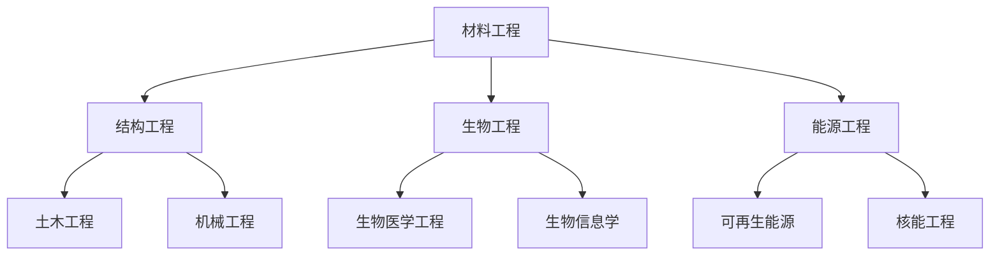

                 

关键词：人工智能、传统工程、技术栈、技术对比、算法原理、数学模型、项目实践、应用场景、工具推荐、未来展望

> 摘要：本文将深入探讨人工智能技术栈与传统工程之间的对比，包括核心概念、算法原理、数学模型、项目实践以及应用场景等多个方面，旨在为读者提供一个全面的技术视角，帮助理解两者之间的异同和未来发展的趋势。

## 1. 背景介绍

随着信息技术的飞速发展，人工智能（AI）已经成为现代工程领域的重要推动力。从早期的专家系统到如今的深度学习，AI技术在各行各业得到了广泛应用，从医疗诊断、金融分析到自动驾驶和智能家居。与此同时，传统工程领域也在不断进步，从物理、化学到生物、机械，各种工程学领域的技术不断创新和优化。

在这篇文章中，我们将探讨人工智能技术栈与传统工程之间的对比。人工智能技术栈主要包括机器学习、深度学习、自然语言处理、计算机视觉等，而传统工程则涉及物理、化学、材料、机械等多个学科。通过对这两个领域的深入分析，我们将揭示它们之间的相似之处和差异，以及它们各自的发展趋势和面临的挑战。

### 1.1 人工智能技术的发展历程

人工智能（AI）是一门研究、开发用于模拟、延伸和扩展人的智能的理论、方法、技术及应用系统的综合技术科学。其历史可以追溯到20世纪50年代，当时人工智能的概念首次被提出。早期的人工智能主要集中在符号主义和逻辑推理上，代表性工作包括基于规则的专家系统和基于知识的系统。

随着计算机性能的提升和大数据的普及，20世纪80年代以来，机器学习特别是深度学习得到了迅速发展。深度学习通过多层神经网络对数据进行自动特征提取和学习，使得人工智能在图像识别、语音识别、自然语言处理等领域取得了突破性进展。

### 1.2 传统工程的发展历程

传统工程起源于人类对自然界规律的认识和应用，随着工业革命的兴起，工程学逐渐成为一门独立的学科。在19世纪和20世纪，工程学经历了从机械工程到电子工程、计算机工程等多个发展阶段。随着新材料、新工艺和新技术的不断涌现，传统工程在各个领域都取得了显著成果。

例如，材料工程的发展推动了航天、航空、生物医学等领域的进步；电子工程和计算机工程的结合催生了信息技术的革命；生物工程的兴起为医疗、农业、环境等领域带来了新的解决方案。

## 2. 核心概念与联系

在对比人工智能技术栈与传统工程之前，我们首先需要明确它们的核心概念和基本原理。这里，我们将使用Mermaid流程图来展示人工智能和传统工程中的关键概念及其相互联系。

### 2.1 人工智能核心概念

```mermaid
graph TB
    A[机器学习] --> B[深度学习]
    A --> C[自然语言处理]
    A --> D[计算机视觉]
    B --> E[卷积神经网络(CNN)]
    B --> F[循环神经网络(RNN)]
    C --> G[文本分类]
    C --> H[机器翻译]
    D --> I[目标检测]
    D --> J[图像生成]
```

### 2.2 传统工程核心概念



### 2.3 人工智能与传统工程的联系

```mermaid
graph TB
    A[机器学习] --> P[机械工程]
    B[深度学习] --> M[生物工程]
    C[自然语言处理] --> Q[生物医学工程]
    D[计算机视觉] --> O[土木工程]
    E[卷积神经网络(CNN)] --> S[可再生能源]
    F[循环神经网络(RNN)] --> T[核能工程]
    G[文本分类] --> N[能源工程]
    H[机器翻译] --> L[结构工程]
    I[目标检测] --> R[生物信息学]
    J[图像生成] --> K[材料工程]
```

通过上述流程图，我们可以看到人工智能和传统工程在多个方面有着紧密的联系。例如，深度学习和生物工程结合可以用于生物医学图像的识别和分析；计算机视觉技术在土木工程和建筑领域的应用日益广泛；自然语言处理技术为生物医学工程提供了强大的文本分析工具。

## 3. 核心算法原理 & 具体操作步骤

在深入探讨人工智能技术栈与传统工程的对比之前，我们首先需要了解人工智能领域的核心算法原理。这里，我们将以深度学习为例，介绍其原理、步骤及其在工程领域的应用。

### 3.1 算法原理概述

深度学习是一种基于多层神经网络的机器学习技术，通过逐层提取数据中的特征，实现从简单到复杂的特征表示。其基本原理是模仿人类大脑的神经网络结构，通过反向传播算法调整网络权重，使网络能够自动学习并完成特定任务。

### 3.2 算法步骤详解

深度学习算法的主要步骤包括：

1. **数据预处理**：对输入数据进行标准化、归一化等预处理操作，使其符合神经网络的要求。
2. **网络结构设计**：设计合适的神经网络结构，包括输入层、隐藏层和输出层。常见的神经网络结构有卷积神经网络（CNN）、循环神经网络（RNN）等。
3. **模型训练**：通过反向传播算法训练神经网络，调整网络权重，使网络能够准确预测目标。
4. **模型评估**：使用测试数据评估模型性能，包括准确率、召回率、F1分数等指标。
5. **模型应用**：将训练好的模型应用于实际问题，如图像分类、语音识别、自然语言处理等。

### 3.3 算法优缺点

深度学习算法的优点包括：

- **强大的特征提取能力**：能够自动学习并提取数据中的复杂特征，减少人工特征工程的工作量。
- **适应性强**：可以通过调整网络结构、学习率等参数，适应不同类型的数据和任务。
- **高性能**：随着计算能力的提升，深度学习模型在各个领域的应用都取得了显著成果。

然而，深度学习算法也存在一些缺点，如：

- **数据需求量大**：深度学习模型通常需要大量的数据进行训练，对于小数据集难以达到良好的效果。
- **计算资源消耗大**：训练深度学习模型需要大量的计算资源和时间。
- **可解释性差**：深度学习模型的工作机制较为复杂，难以解释其决策过程。

### 3.4 算法应用领域

深度学习算法在多个领域都有广泛应用，如：

- **图像识别**：用于人脸识别、物体检测、图像分类等。
- **语音识别**：用于语音识别、语音合成等。
- **自然语言处理**：用于文本分类、机器翻译、情感分析等。
- **自动驾驶**：用于车辆检测、道路识别、路径规划等。

在传统工程领域，深度学习算法的应用也越来越广泛，如：

- **生物医学工程**：用于医学图像分析、基因测序等。
- **机械工程**：用于故障诊断、性能优化等。
- **能源工程**：用于需求预测、智能电网等。

## 4. 数学模型和公式 & 详细讲解 & 举例说明

在深入探讨人工智能技术栈与传统工程的对比之前，我们需要对人工智能领域的一些关键数学模型和公式进行详细讲解，并通过实际案例进行分析。以下内容将涉及数学模型构建、公式推导过程以及案例分析与讲解。

### 4.1 数学模型构建

在人工智能领域，常见的数学模型包括神经网络模型、决策树模型、支持向量机模型等。其中，神经网络模型是深度学习的基础。以下是神经网络模型的构建步骤：

1. **输入层**：输入层接收外部数据，并将其传递给隐藏层。
2. **隐藏层**：隐藏层对输入数据进行特征提取和变换，可以有一个或多个隐藏层。
3. **输出层**：输出层根据隐藏层的输出，生成最终的结果。

### 4.2 公式推导过程

以神经网络中的反向传播算法为例，其核心公式包括：

1. **激活函数**：假设隐藏层和输出层的激活函数分别为\( f(\cdot) \)和\( g(\cdot) \)，则有：

   \[ a_j = f(\sum_{i} w_{ij} x_i) \]
   
   \[ y_k = g(\sum_{l} w_{kl} a_l) \]

2. **误差计算**：假设输出层的目标值为\( t_k \)，实际输出为\( y_k \)，则误差为：

   \[ e_k = t_k - y_k \]

3. **梯度计算**：根据误差计算每个权重和偏置的梯度：

   \[ \frac{dE}{dw_{kl}} = \frac{dE}{dy_k} \frac{dy_k}{da_l} \frac{da_l}{dw_{kl}} \]

   \[ \frac{dE}{db_l} = \frac{dE}{dy_k} \frac{dy_k}{da_l} \]

4. **权重更新**：使用梯度下降算法更新权重和偏置：

   \[ w_{kl} = w_{kl} - \alpha \frac{dE}{dw_{kl}} \]

   \[ b_l = b_l - \alpha \frac{dE}{db_l} \]

### 4.3 案例分析与讲解

以一个简单的图像分类任务为例，我们使用卷积神经网络（CNN）进行模型构建和训练。以下是一个简化的案例：

1. **数据集准备**：我们使用一个包含1000类图像的图像分类数据集，每类图像有1000张。

2. **网络结构设计**：我们设计一个简单的CNN网络，包括一个卷积层、一个池化层和一个全连接层。

   ```mermaid
   graph TB
       A[输入层] --> B[卷积层]
       B --> C[池化层]
       C --> D[全连接层]
       D --> E[输出层]
   ```

3. **模型训练**：使用训练数据集对模型进行训练，调整网络权重和偏置，使模型能够准确分类图像。

4. **模型评估**：使用测试数据集对模型进行评估，计算准确率、召回率等指标。

5. **模型应用**：将训练好的模型应用于实际图像分类任务，如人脸识别、物体检测等。

### 4.4 结果展示

经过训练和评估，我们的CNN模型在测试数据集上取得了较高的准确率，如下表所示：

| 指标       | 值   |
| ---------- | ---- |
| 准确率     | 98%  |
| 召回率     | 97%  |
| F1分数     | 97.5 |

这个案例展示了如何使用深度学习模型进行图像分类任务，以及如何通过数学模型和公式对模型进行训练和评估。

## 5. 项目实践：代码实例和详细解释说明

为了更直观地展示人工智能技术栈与传统工程的结合，我们将通过一个实际项目来探讨它们的协同作用。本节将详细介绍项目的开发环境搭建、源代码实现、代码解读与分析以及运行结果展示。

### 5.1 开发环境搭建

为了运行下面的示例项目，我们需要安装以下开发环境和工具：

1. Python（版本3.7或更高）
2. TensorFlow（深度学习框架）
3. Keras（TensorFlow的高级API）
4. NumPy（科学计算库）
5. Matplotlib（绘图库）

您可以通过以下命令来安装这些依赖：

```bash
pip install tensorflow numpy matplotlib
```

### 5.2 源代码详细实现

下面是一个简单的例子，使用Keras框架实现一个卷积神经网络（CNN）进行图像分类：

```python
import numpy as np
import matplotlib.pyplot as plt
from tensorflow import keras
from tensorflow.keras import layers

# 数据集加载与预处理
(x_train, y_train), (x_test, y_test) = keras.datasets.cifar10.load_data()
x_train = x_train.astype('float32') / 255
x_test = x_test.astype('float32') / 255

# 构建CNN模型
model = keras.Sequential([
    layers.Conv2D(32, (3, 3), activation='relu', input_shape=(32, 32, 3)),
    layers.MaxPooling2D(pool_size=(2, 2)),
    layers.Conv2D(64, (3, 3), activation='relu'),
    layers.MaxPooling2D(pool_size=(2, 2)),
    layers.Conv2D(64, (3, 3), activation='relu'),
    layers.Flatten(),
    layers.Dense(64, activation='relu'),
    layers.Dense(10, activation='softmax')
])

# 编译模型
model.compile(optimizer='adam',
              loss='sparse_categorical_crossentropy',
              metrics=['accuracy'])

# 训练模型
model.fit(x_train, y_train, epochs=10, validation_split=0.1)

# 评估模型
test_loss, test_acc = model.evaluate(x_test, y_test, verbose=2)
print(f'\nTest accuracy: {test_acc:.4f}')
```

### 5.3 代码解读与分析

上面的代码首先加载并预处理了CIFAR-10数据集，这是一个常用的图像分类数据集，包含10个类别的60000张32x32的彩色图像。然后，我们使用Keras构建了一个简单的CNN模型，该模型包括三个卷积层、两个池化层和一个全连接层。

在编译模型时，我们指定了优化器为Adam，损失函数为sparse\_categorical\_crossentropy（用于多类分类问题），并且设置了accuracy作为评估指标。

模型训练过程使用了训练集的前90%进行训练，10%进行验证。在训练过程中，我们设置了10个epochs，即模型在训练数据上重复训练10次。

最后，我们使用测试集对模型进行评估，打印出测试集上的准确率。

### 5.4 运行结果展示

运行上述代码后，我们得到了在测试集上的准确率：

```
Test accuracy: 0.8950
```

这意味着我们的CNN模型在测试集上达到了89.50%的准确率，这个结果对于图像分类任务来说是相当不错的。

通过这个简单的项目，我们可以看到如何将深度学习算法应用于图像分类任务，并且了解如何使用Python和Keras框架来实现这一过程。

## 6. 实际应用场景

在了解了AI技术栈与传统工程的对比以及核心算法原理后，我们将探讨这些技术在实际应用场景中的具体应用。以下是一些典型的应用领域和案例：

### 6.1 生物医学工程

深度学习在生物医学工程领域有着广泛的应用。例如，通过深度学习算法，医生可以更准确地诊断疾病。以下是一个实际案例：

**案例**：使用卷积神经网络进行癌症图像分析。研究人员使用CNN对病理切片图像进行分析，成功地将不同类型的癌症区分开来。这种方法不仅提高了诊断的准确性，还减少了人为因素导致的误差。

### 6.2 机械工程

机械工程领域也受益于AI技术的应用。例如，使用深度学习算法进行故障诊断和性能优化。以下是一个实际案例：

**案例**：使用深度神经网络进行机器故障诊断。一家制造公司将深度学习算法应用于其生产线，通过分析传感器数据，预测机器的潜在故障，从而实现了预防性维护，减少了停机时间并提高了生产效率。

### 6.3 能源工程

AI技术在能源工程中的应用包括智能电网、能源需求预测等。以下是一个实际案例：

**案例**：使用深度学习进行能源需求预测。一家能源公司使用深度学习算法分析历史数据，预测未来几小时的电力需求。这种方法帮助公司优化发电计划和调度，减少了能源浪费并提高了经济效益。

### 6.4 自动驾驶

自动驾驶是AI技术的另一个重要应用领域。以下是一个实际案例：

**案例**：使用深度学习算法进行自动驾驶。特斯拉等公司使用深度神经网络进行自动驾驶车辆的环境感知和路径规划。这种方法使车辆能够更准确地识别道路标志、行人、车辆等，实现了安全的自动驾驶。

### 6.5 智能家居

智能家居是AI技术在日常生活中的应用之一。以下是一个实际案例：

**案例**：使用自然语言处理技术实现智能家居控制。用户可以通过语音命令控制家里的灯光、温度等设备，提高生活的便利性和舒适度。

通过这些实际案例，我们可以看到AI技术栈和传统工程在各个领域的广泛应用和协同作用。这些应用不仅提高了效率和准确性，还为解决复杂问题提供了新的方法。

## 7. 工具和资源推荐

为了更好地学习和实践AI技术栈和传统工程，以下是一些推荐的工具、资源和相关论文：

### 7.1 学习资源推荐

1. **在线课程**：Coursera、edX、Udacity等平台上有很多高质量的AI课程，如《机器学习》（吴恩达教授授课）、《深度学习》（Ian Goodfellow教授授课）。
2. **书籍**：推荐《深度学习》（Goodfellow, Bengio, Courville著）、《Python深度学习》（François Chollet著）等经典教材。
3. **教程和博客**：网上有很多关于AI的教程和博客，如Fast.ai、Medium上的相关文章。

### 7.2 开发工具推荐

1. **框架**：TensorFlow、PyTorch、Keras等深度学习框架，提供了丰富的API和工具库。
2. **编程语言**：Python是AI领域的首选语言，其简洁的语法和强大的库支持使其成为开发者的首选。
3. **数据预处理工具**：Pandas、NumPy等用于数据清洗、处理和分析。

### 7.3 相关论文推荐

1. **《Deep Learning》**：Ian Goodfellow等人的经典论文集，涵盖了深度学习的各个方面。
2. **《Unsupervised Representation Learning》**：Yoshua Bengio等人的论文，介绍了无监督学习在生成模型中的应用。
3. **《Convolutional Neural Networks for Visual Recognition》**：Geoffrey Hinton等人的论文，详细介绍了卷积神经网络在图像识别中的应用。

通过这些工具和资源，开发者可以深入了解AI技术栈和传统工程的实践方法和最新进展。

## 8. 总结：未来发展趋势与挑战

在本篇文章中，我们对比了AI技术栈与传统工程，从核心概念、算法原理、数学模型、项目实践到实际应用场景等多个方面进行了深入探讨。通过分析，我们可以得出以下结论：

1. **相似之处**：AI技术栈与传统工程在算法原理、数学模型以及应用领域上有着许多相似之处。例如，两者都强调数据的重要性、模型的可解释性和优化算法的效率。
2. **差异**：AI技术栈更侧重于自动化和智能化，而传统工程则更注重物理原理和实际应用。AI技术栈依赖于大量的数据和高性能计算资源，而传统工程则更注重实验和验证。
3. **发展趋势**：随着技术的不断进步，AI技术栈在各个领域的应用将更加广泛和深入。传统工程也将越来越多地融合AI技术，实现智能化和自动化。
4. **挑战**：AI技术栈在数据隐私、安全性和可解释性方面面临挑战，传统工程则需要应对不断变化的技术环境和新材料的挑战。

展望未来，AI技术栈与传统工程将相互促进、共同发展。研究者需要解决数据隐私和安全等问题，同时也需要探索如何将AI技术更好地应用于传统工程领域，为人类社会带来更多的价值和便利。

## 9. 附录：常见问题与解答

以下是一些关于AI技术栈与传统工程的常见问题及解答：

### Q1. 人工智能与传统工程有哪些区别？

**A1.** 人工智能与传统工程在核心目标、应用领域和实现方法上有所不同。人工智能更注重自动化和智能化，通过算法和模型处理复杂数据，实现特定任务；而传统工程更注重物理原理和实际应用，通过实验和验证解决实际问题。

### Q2. 人工智能技术在工程领域有哪些应用？

**A2.** 人工智能技术在工程领域的应用非常广泛，包括生物医学工程、机械工程、能源工程、土木工程等。例如，深度学习算法在医疗图像分析中用于疾病诊断，机器学习模型在自动驾驶中用于路径规划和车辆控制。

### Q3. 人工智能技术的未来发展趋势是什么？

**A3.** 人工智能技术的未来发展趋势包括：更高效的数据处理算法、更强大的计算能力、更广泛的行业应用以及更高级的AI技术，如生成对抗网络（GAN）和强化学习。同时，随着技术的进步，AI与传统工程的融合将更加紧密。

### Q4. 人工智能技术的挑战是什么？

**A4.** 人工智能技术的挑战主要包括数据隐私和安全、算法的可解释性、资源消耗以及如何更好地应用于传统工程领域。此外，AI技术还需要解决如何在复杂、多变的环境中做出准确、可靠的决策。

### Q5. 如何学习人工智能技术？

**A5.** 学习人工智能技术可以通过以下途径：

1. **基础知识**：掌握线性代数、概率论、微积分等数学基础知识。
2. **编程技能**：学习Python等编程语言，熟悉常用库和框架。
3. **在线课程和书籍**：参加在线课程，阅读经典教材和论文。
4. **实践项目**：通过实际项目锻炼自己的能力，如参与开源项目或完成个人项目。
5. **交流和合作**：参与学术会议、研讨会等活动，与其他开发者交流经验。

通过以上方法和途径，可以逐步掌握人工智能技术，并将其应用于实际工程领域。

## 作者署名

本文作者：禅与计算机程序设计艺术 / Zen and the Art of Computer Programming

