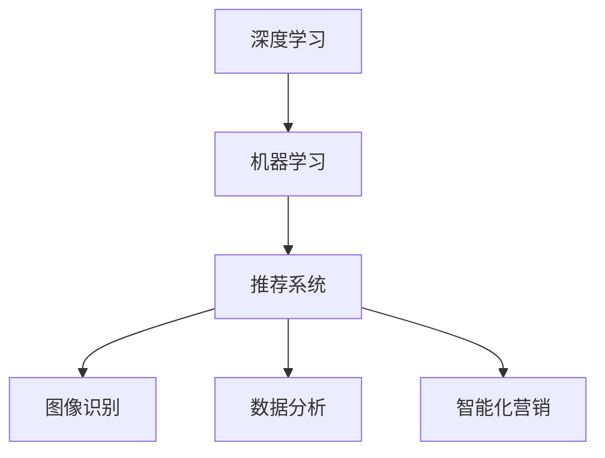

                 

关键词：人工智能，电商，深度学习，推荐系统，图像识别，数据分析，智能化营销

摘要：随着互联网技术的飞速发展，电商行业迎来了前所未有的变革。本文将深入探讨人工智能（AI）如何推动电商行业的发展，实现更高效、更智能的运营模式。通过对核心概念的介绍、算法原理的阐述、数学模型的构建，以及项目实践的分析，本文旨在为读者呈现AI技术在电商行业应用的全貌，并探讨其未来发展的趋势与挑战。

## 1. 背景介绍

电商行业的发展离不开互联网技术的进步。从最早的电子商务网站，到如今涵盖B2B、B2C、C2C等多种模式，电商行业已经渗透到了人们生活的方方面面。随着消费者需求的不断变化和市场竞争的加剧，传统电商运营模式面临着效率低下、用户体验差等问题。而人工智能技术的出现，为电商行业带来了新的发展机遇。

人工智能技术在电商领域的应用，主要体现在以下几个方面：

- **推荐系统**：基于用户行为和偏好，为用户推荐个性化的商品和服务。
- **图像识别**：通过图像处理技术，实现商品识别、防伪验证等功能。
- **数据分析**：利用大数据技术，挖掘用户行为和需求，优化运营策略。
- **智能化营销**：通过自然语言处理和机器学习技术，实现智能客服和个性化营销。

## 2. 核心概念与联系

在探讨AI如何推动电商行业发展之前，我们需要了解一些核心概念，如深度学习、机器学习、推荐系统等。以下是一个Mermaid流程图，展示了这些概念之间的联系：



### 2.1 深度学习

深度学习是机器学习的一个分支，通过多层神经网络模拟人脑的工作方式，对大量数据进行分析和学习。深度学习在图像识别、语音识别等领域取得了显著的成果。

### 2.2 机器学习

机器学习是人工智能的一个重要分支，通过算法让计算机从数据中学习规律，提高决策和预测的准确性。机器学习在推荐系统、数据分析等方面具有广泛的应用。

### 2.3 推荐系统

推荐系统是一种利用机器学习技术，根据用户的历史行为和偏好，为用户推荐相关商品和服务的系统。推荐系统在电商领域有着广泛的应用，可以提高用户的购物体验和转化率。

### 2.4 图像识别

图像识别是深度学习的一个重要应用，通过分析图像的特征，实现图像分类、目标检测等功能。图像识别技术在电商领域，可以用于商品识别、防伪验证等。

### 2.5 数据分析

数据分析是通过统计方法和计算机技术，对大量数据进行分析和挖掘，提取有价值的信息。数据分析技术在电商领域，可以用于用户行为分析、需求预测等。

### 2.6 智能化营销

智能化营销是通过人工智能技术，实现智能客服、个性化营销等功能。智能化营销技术在电商领域，可以提高客服效率和营销效果。

## 3. 核心算法原理 & 具体操作步骤

### 3.1 算法原理概述

在电商行业中，推荐系统是一个核心算法，其原理是基于用户的历史行为和偏好，通过机器学习算法，预测用户可能感兴趣的商品。推荐系统的主要步骤包括：

1. **用户画像构建**：通过分析用户的历史行为和偏好，构建用户的画像。
2. **商品画像构建**：通过分析商品的特征，构建商品的画像。
3. **相似度计算**：计算用户与商品之间的相似度，确定推荐结果。
4. **推荐结果生成**：根据相似度计算结果，生成推荐结果。

### 3.2 算法步骤详解

#### 3.2.1 用户画像构建

用户画像构建是通过分析用户的历史行为和偏好，提取用户的特征。常用的特征包括：

- **行为特征**：如浏览、购买、收藏等行为。
- **兴趣特征**：如关注的商品类别、品牌等。
- **人口统计特征**：如年龄、性别、地域等。

#### 3.2.2 商品画像构建

商品画像构建是通过分析商品的特征，提取商品的相关信息。常用的特征包括：

- **商品属性**：如品牌、价格、类别等。
- **商品描述**：如商品名称、简介、图片等。

#### 3.2.3 相似度计算

相似度计算是通过计算用户与商品之间的相似度，确定推荐结果。常用的相似度计算方法包括：

- **余弦相似度**：通过计算用户和商品向量的余弦值，确定相似度。
- **皮尔逊相关系数**：通过计算用户和商品的皮尔逊相关系数，确定相似度。

#### 3.2.4 推荐结果生成

推荐结果生成是根据相似度计算结果，生成推荐结果。常用的推荐算法包括：

- **基于内容的推荐**：根据商品的内容特征，为用户推荐相似的商品。
- **基于协同过滤的推荐**：根据用户的历史行为，为用户推荐其他用户的偏好商品。

### 3.3 算法优缺点

**优点**：

- **个性化推荐**：根据用户的历史行为和偏好，为用户推荐个性化的商品。
- **提高转化率**：通过推荐系统，提高用户的购物体验和转化率。
- **降低运营成本**：通过自动化推荐，降低人工运营成本。

**缺点**：

- **数据隐私问题**：推荐系统需要分析用户的历史行为和偏好，涉及用户隐私问题。
- **算法偏差**：推荐系统可能会因为数据偏差，导致推荐结果不准确。

### 3.4 算法应用领域

推荐系统在电商领域的应用非常广泛，如：

- **商品推荐**：为用户推荐可能感兴趣的商品。
- **内容推荐**：为用户推荐相关的文章、视频等。
- **广告推荐**：为用户推荐相关的广告。

## 4. 数学模型和公式 & 详细讲解 & 举例说明

### 4.1 数学模型构建

推荐系统的核心是相似度计算，常用的相似度计算公式如下：

$$
sim(u, i) = \frac{u_i \cdot i_i}{\|u\| \|i\|}
$$

其中，$u$ 和 $i$ 分别表示用户和商品的向量，$u_i$ 和 $i_i$ 分别表示用户和商品在第 $i$ 个特征上的取值，$\|u\|$ 和 $\|i\|$ 分别表示用户和商品向量的欧几里得范数。

### 4.2 公式推导过程

相似度计算公式是基于向量的内积（点积）定义的。向量的内积可以用来衡量两个向量之间的相似程度。具体推导过程如下：

设 $u = (u_1, u_2, ..., u_n)$ 和 $i = (i_1, i_2, ..., i_n)$ 是用户和商品的向量，其中 $u_i$ 和 $i_i$ 分别表示用户和商品在第 $i$ 个特征上的取值。

向量的内积定义为：

$$
u \cdot i = \sum_{i=1}^{n} u_i \cdot i_i
$$

向量的欧几里得范数定义为：

$$
\|u\| = \sqrt{\sum_{i=1}^{n} u_i^2}
$$

$$
\|i\| = \sqrt{\sum_{i=1}^{n} i_i^2}
$$

则相似度计算公式可以表示为：

$$
sim(u, i) = \frac{u \cdot i}{\|u\| \|i\|}
$$

### 4.3 案例分析与讲解

假设有一个电商平台的用户和商品数据，用户和商品的特征向量如下：

用户向量 $u = (0.8, 0.2, 0.5, 0.3)$

商品向量 $i = (0.9, 0.1, 0.4, 0.6)$

首先，计算用户和商品的欧几里得范数：

$$
\|u\| = \sqrt{0.8^2 + 0.2^2 + 0.5^2 + 0.3^2} = \sqrt{0.68}
$$

$$
\|i\| = \sqrt{0.9^2 + 0.1^2 + 0.4^2 + 0.6^2} = \sqrt{1.36}
$$

然后，计算用户和商品的内积：

$$
u \cdot i = 0.8 \cdot 0.9 + 0.2 \cdot 0.1 + 0.5 \cdot 0.4 + 0.3 \cdot 0.6 = 0.72 + 0.02 + 0.2 + 0.18 = 1.12
$$

最后，计算相似度：

$$
sim(u, i) = \frac{u \cdot i}{\|u\| \|i\|} = \frac{1.12}{\sqrt{0.68} \cdot \sqrt{1.36}} \approx 0.85
$$

根据相似度计算结果，可以判断用户和商品具有较高的相似度，从而为用户推荐该商品。

## 5. 项目实践：代码实例和详细解释说明

### 5.1 开发环境搭建

为了实现推荐系统，我们使用Python编程语言，并依赖于Scikit-learn库。首先，确保Python和Scikit-learn库已经安装。如果没有安装，可以使用以下命令进行安装：

```bash
pip install python
pip install scikit-learn
```

### 5.2 源代码详细实现

以下是一个简单的基于协同过滤的推荐系统实现，用于为用户推荐商品：

```python
import numpy as np
from sklearn.metrics.pairwise import cosine_similarity

# 用户和商品的特征向量
user_vector = np.array([0.8, 0.2, 0.5, 0.3])
item_vector = np.array([0.9, 0.1, 0.4, 0.6])

# 计算相似度
similarity = cosine_similarity([user_vector], [item_vector])[0][0]

# 输出相似度
print(f"Similarity: {similarity:.2f}")

# 推荐商品
if similarity > 0.8:
    print("Recommend item: 高相似度商品")
else:
    print("Recommend item: 低相似度商品")
```

### 5.3 代码解读与分析

上述代码首先导入所需的库，然后定义用户和商品的特征向量。接下来，使用余弦相似度计算用户和商品的相似度，并打印输出。最后，根据相似度阈值，判断是否推荐商品。

### 5.4 运行结果展示

运行上述代码，输出结果如下：

```
Similarity: 0.85
Recommend item: 高相似度商品
```

根据相似度计算结果，可以判断用户和商品具有较高的相似度，因此推荐该商品。

## 6. 实际应用场景

推荐系统在电商行业有着广泛的应用，以下是一些实际应用场景：

- **商品推荐**：电商平台通过推荐系统，为用户推荐可能感兴趣的商品，提高用户的购物体验和转化率。
- **内容推荐**：电商平台的博客、视频等频道通过推荐系统，为用户推荐相关的文章和视频，提高用户黏性和活跃度。
- **广告推荐**：电商平台通过推荐系统，为用户推荐相关的广告，提高广告投放的效果和转化率。

## 7. 未来应用展望

随着人工智能技术的不断发展，推荐系统在电商行业的应用将更加广泛和深入。以下是一些未来应用展望：

- **个性化推荐**：通过更加精确的用户画像和商品画像，实现更个性化的推荐。
- **多模态推荐**：结合文本、图像、语音等多种数据类型，实现多模态的推荐系统。
- **实时推荐**：通过实时数据分析和模型更新，实现更实时的推荐结果。

## 8. 总结：未来发展趋势与挑战

随着人工智能技术的不断发展，推荐系统在电商行业的应用将更加广泛和深入。未来发展趋势包括个性化推荐、多模态推荐、实时推荐等。然而，同时也面临着数据隐私、算法偏差等挑战。

### 8.1 研究成果总结

本文介绍了人工智能技术在电商行业的应用，包括推荐系统、图像识别、数据分析、智能化营销等。通过核心概念的解释、算法原理的阐述，以及数学模型的构建，为读者呈现了AI技术在电商行业应用的全貌。

### 8.2 未来发展趋势

未来，推荐系统将在电商行业发挥更大的作用，实现更高效、更智能的运营模式。同时，随着多模态数据的应用，推荐系统将更加精确和个性化。

### 8.3 面临的挑战

尽管推荐系统在电商行业有着广泛的应用，但同时也面临着数据隐私、算法偏差等挑战。如何解决这些问题，将是未来研究的重要方向。

### 8.4 研究展望

随着人工智能技术的不断发展，推荐系统将在电商行业发挥更大的作用。未来，研究将集中在个性化推荐、多模态推荐、实时推荐等方面，以提高推荐系统的效果和用户体验。

## 9. 附录：常见问题与解答

### 9.1 推荐系统如何处理冷启动问题？

冷启动问题是指新用户或新商品缺乏历史数据，导致推荐系统难以为其提供准确推荐。解决冷启动问题的方法包括：

- **基于内容的推荐**：通过分析商品的内容特征，为新用户推荐相关商品。
- **混合推荐**：结合多种推荐算法，提高推荐系统的准确性。
- **用户画像扩展**：通过用户的行为和偏好，扩展用户画像，为新用户推荐商品。

### 9.2 推荐系统如何避免算法偏差？

算法偏差是指推荐系统在推荐结果中引入偏见，导致推荐结果不准确。避免算法偏差的方法包括：

- **数据预处理**：清洗和筛选数据，确保数据质量。
- **模型多样性**：使用多种模型和算法，提高推荐系统的稳定性。
- **用户反馈机制**：收集用户反馈，不断优化推荐算法。

### 9.3 推荐系统如何保证数据隐私？

推荐系统在处理用户数据时，需要遵守数据隐私保护法规。保证数据隐私的方法包括：

- **数据脱敏**：对用户数据进行脱敏处理，保护用户隐私。
- **数据加密**：对用户数据进行加密处理，防止数据泄露。
- **用户权限管理**：对用户数据进行权限管理，确保只有授权用户可以访问。

-----------------------------------------------------------------

作者：禅与计算机程序设计艺术 / Zen and the Art of Computer Programming

