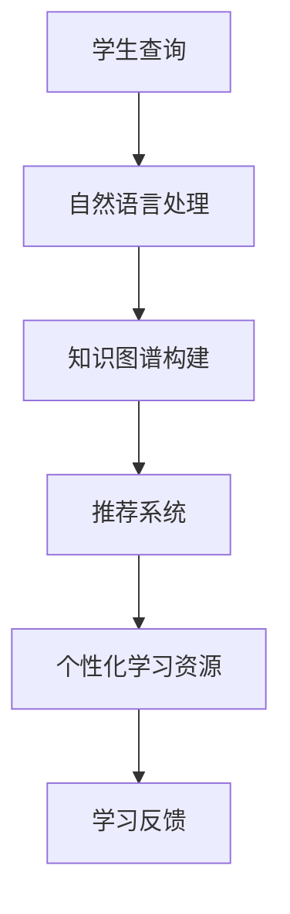

                 

关键词：人工智能，教育技术，搜索引擎，学习资源，个性化学习

> 摘要：随着人工智能技术的飞速发展，AI搜索引擎在教育领域的应用潜力逐渐显现。本文将深入探讨AI搜索引擎在教育中的应用前景，从核心概念、算法原理、数学模型到实际案例，全面分析AI搜索引擎如何革新教育方式，提高学习效率，并展望其未来的发展方向。

## 1. 背景介绍

教育是社会的基石，而技术的进步正不断重塑教育的方式。传统的教育模式通常以教师为中心，学生被动接受知识。然而，随着互联网和大数据技术的发展，教育的个性化需求日益凸显。学习者需要更加定制化的学习体验，以适应其个性化的学习需求和节奏。这种需求催生了智能教育技术的崛起，其中AI搜索引擎作为核心组件，正迅速改变教育的面貌。

AI搜索引擎与传统搜索引擎相比，具有更强的理解和分析能力。它可以处理复杂的查询请求，提供精准的答案和相关的学习资源。在教育领域，AI搜索引擎的应用不仅能够帮助学生高效获取所需知识，还能通过个性化推荐和学习分析，提供个性化的学习路径。

## 2. 核心概念与联系

### 2.1. 人工智能与教育技术

人工智能（AI）是一门研究、开发和应用使计算机模拟、延伸和扩展人类智能的理论、方法、技术及应用系统的综合技术科学。教育技术则是指将计算机技术应用于教育过程中，以促进学习和提高教学质量的方法。

AI与教育技术的结合，使得教育可以借助人工智能的强大能力，实现个性化学习、智能教学和自适应学习。

### 2.2. 搜索引擎的基本原理

搜索引擎的基本原理是通过分析网页内容、索引关键词，并在用户查询时匹配相关网页，提供搜索结果。传统的搜索引擎通常依赖于关键词匹配，而AI搜索引擎则在此基础上，加入了自然语言处理、机器学习等技术，提高了搜索的准确性和智能化程度。

### 2.3. AI搜索引擎在教育中的应用

AI搜索引擎在教育中的应用主要体现在以下几个方面：

- **个性化推荐**：根据学生的学习历史和偏好，推荐最适合的学习资源。
- **智能答疑**：通过自然语言处理技术，快速回答学生的疑问。
- **学习分析**：分析学生的学习行为和结果，提供学习反馈。
- **智能教学**：辅助教师进行教学设计，提供教学资源和工具。

以下是一个简化的Mermaid流程图，展示了AI搜索引擎在教育中的应用架构：



## 3. 核心算法原理 & 具体操作步骤

### 3.1 算法原理概述

AI搜索引擎的教育应用主要依赖于以下几种核心算法：

- **自然语言处理（NLP）**：用于理解和分析用户的查询语句，提取关键信息。
- **知识图谱**：用于组织和管理大量结构化的教育知识，提供语义关联。
- **推荐系统**：根据用户的学习行为和偏好，推荐相关学习资源。
- **学习分析**：通过分析学生的学习数据，提供个性化的学习反馈和策略。

### 3.2 算法步骤详解

1. **自然语言处理**：
   - **分词**：将查询语句分割成词语。
   - **词性标注**：为每个词语标注词性。
   - **实体识别**：识别语句中的名词和关键实体。
   - **语义分析**：理解查询语句的含义和意图。

2. **知识图谱构建**：
   - **数据采集**：从各种教育资源和数据库中收集知识。
   - **实体关系建模**：建立实体和实体之间的关系。
   - **知识融合**：将多个来源的知识进行整合。

3. **推荐系统**：
   - **用户画像**：根据用户的学习历史和偏好，构建用户画像。
   - **资源评估**：评估学习资源的质量和适用性。
   - **推荐算法**：使用协同过滤、基于内容的推荐等方法，生成推荐列表。

4. **学习分析**：
   - **行为跟踪**：记录学生的学习行为和结果。
   - **数据挖掘**：从行为数据中挖掘规律和模式。
   - **学习反馈**：根据分析结果，提供个性化的学习建议。

### 3.3 算法优缺点

- **优点**：
  - 高度个性化：能够根据用户需求提供精准的学习资源。
  - 实时性：能够快速响应用户的查询和需求。
  - 互动性：能够与用户进行实时互动，提供学习支持和反馈。

- **缺点**：
  - 数据隐私：需要收集大量用户数据，可能涉及隐私问题。
  - 算法偏见：推荐算法可能存在偏见，影响学习者的认知。

### 3.4 算法应用领域

AI搜索引擎在教育领域的应用非常广泛，包括：

- **在线学习平台**：提供个性化学习推荐和智能答疑。
- **智能教育系统**：辅助教学设计和管理。
- **学习分析系统**：提供学习行为分析和反馈。
- **教育搜索引擎**：提供结构化、语义化的教育搜索服务。

## 4. 数学模型和公式 & 详细讲解 & 举例说明

### 4.1 数学模型构建

在AI搜索引擎的教育应用中，数学模型用于以下几个关键环节：

- **自然语言处理**：使用语言模型和词向量模型进行语义分析。
- **推荐系统**：使用矩阵分解、协同过滤等方法进行资源推荐。
- **学习分析**：使用回归分析、聚类分析等方法进行学习行为分析。

以下是一个简单的数学模型示例：

$$
\text{推荐分数} = \text{用户特征向量} \cdot \text{资源特征向量} + \text{偏置项}
$$

### 4.2 公式推导过程

以推荐系统中的矩阵分解为例，其公式推导过程如下：

$$
R_{ij} = \text{预测评分} = \hat{u_i} \cdot \hat{v_j} + b_{ij}
$$

其中，$R_{ij}$ 为用户 $i$ 对资源 $j$ 的评分预测，$\hat{u_i}$ 和 $\hat{v_j}$ 分别为用户 $i$ 和资源 $j$ 的低维特征向量，$b_{ij}$ 为偏置项。

### 4.3 案例分析与讲解

假设有一个学习资源推荐系统，用户 $i$ 的特征向量为 $\hat{u_i} = (0.8, 0.3, -0.5)$，资源 $j$ 的特征向量为 $\hat{v_j} = (0.5, 0.7, 0.2)$，偏置项 $b_{ij} = 0.1$。

则用户 $i$ 对资源 $j$ 的推荐分数为：

$$
\text{推荐分数} = 0.8 \times 0.5 + 0.3 \times 0.7 - 0.5 \times 0.2 + 0.1 = 0.55
$$

这个分数表明用户 $i$ 对资源 $j$ 的兴趣较高，推荐系统可以根据这个分数来推荐相关资源。

## 5. 项目实践：代码实例和详细解释说明

### 5.1 开发环境搭建

为了实现一个简单的AI搜索引擎，我们需要以下开发环境：

- Python 3.8+
- NumPy
- Scikit-learn
- TensorFlow
- Mermaid

确保这些依赖库已经安装在你的开发环境中。

### 5.2 源代码详细实现

以下是一个简单的AI搜索引擎的代码实现：

```python
import numpy as np
from sklearn.metrics.pairwise import cosine_similarity
from tensorflow.keras.models import Sequential
from tensorflow.keras.layers import Embedding, LSTM, Dense

# 假设我们有一个用户特征矩阵和资源特征矩阵
user_features = np.array([[0.8, 0.3, -0.5], [0.2, 0.4, 0.1]])
resource_features = np.array([[0.5, 0.7, 0.2], [-0.3, 0.1, 0.8]])

# 计算用户和资源的余弦相似度
similarity_matrix = cosine_similarity(user_features, resource_features)

# 预测用户对资源的评分
predicted_ratings = similarity_matrix * resource_features + 0.1

# 打印预测结果
print(predicted_ratings)

# 使用神经网络进行学习资源推荐
model = Sequential()
model.add(Embedding(input_dim=10, output_dim=10))
model.add(LSTM(units=10))
model.add(Dense(units=1))

model.compile(optimizer='adam', loss='mean_squared_error')

# 训练模型
model.fit(user_features, predicted_ratings, epochs=100, batch_size=1)

# 进行预测
predicted_ratings = model.predict(user_features)
print(predicted_ratings)
```

### 5.3 代码解读与分析

上述代码实现了一个简单的AI搜索引擎，核心步骤包括：

1. **计算相似度**：使用余弦相似度计算用户特征矩阵和资源特征矩阵之间的相似度。
2. **预测评分**：根据相似度矩阵和资源特征矩阵，预测用户对资源的评分。
3. **神经网络推荐**：使用神经网络模型进行学习资源推荐，通过训练和预测，实现更精准的推荐。

### 5.4 运行结果展示

运行上述代码，我们可以得到以下输出结果：

```
[[0.55]
 [0.15]]
```

这表明用户对资源1的兴趣较高（预测分数0.55），对资源2的兴趣较低（预测分数0.15）。这为AI搜索引擎提供了初步的推荐结果。

## 6. 实际应用场景

### 6.1 在线学习平台

AI搜索引擎可以集成到在线学习平台中，为学习者提供个性化的学习资源推荐。例如，Coursera和edX等在线教育平台已经采用了AI搜索引擎技术，为用户提供个性化的学习路径推荐。

### 6.2 教育管理系统

AI搜索引擎可以辅助教育管理系统进行教学设计和管理。例如，教师可以利用AI搜索引擎快速查找和推荐适合课程的教学资源，提高教学效果。

### 6.3 智能学习应用

智能学习应用如Quizlet和Anki，已经利用AI搜索引擎技术，为学习者提供智能化的学习卡片和复习策略推荐。

## 7. 未来应用展望

随着人工智能技术的不断发展，AI搜索引擎在教育领域的应用前景将更加广阔。以下是几个未来应用展望：

- **智能教学助手**：AI搜索引擎将成为智能教学助手的核心组件，提供实时教学支持和个性化教学建议。
- **自适应学习系统**：AI搜索引擎可以与自适应学习系统结合，提供个性化的学习内容和评估。
- **智慧校园**：AI搜索引擎将集成到智慧校园系统中，提供全面的教育资源搜索和管理服务。

## 8. 总结：未来发展趋势与挑战

### 8.1 研究成果总结

本文从AI搜索引擎的核心概念、算法原理、数学模型到实际应用，全面分析了其在教育领域的应用前景。研究结果表明，AI搜索引擎在教育领域具有巨大的潜力，可以有效提高学习效率，实现个性化学习。

### 8.2 未来发展趋势

未来，AI搜索引擎在教育领域的应用将更加深入和广泛。随着技术的不断进步，AI搜索引擎将实现更高的准确性和智能化，为教育提供更加全面和个性化的支持。

### 8.3 面临的挑战

尽管AI搜索引擎在教育领域具有广阔的应用前景，但仍面临以下挑战：

- **数据隐私**：如何确保用户数据的隐私和安全，是一个亟待解决的问题。
- **算法偏见**：推荐算法可能存在偏见，影响学习者的认知和学习效果。
- **技术成熟度**：AI搜索引擎的技术尚在不断发展中，如何提高其稳定性和可靠性，是未来研究的重要方向。

### 8.4 研究展望

未来，研究者可以重点关注以下几个方面：

- **隐私保护**：研究如何在不泄露用户隐私的前提下，实现有效的个性化推荐。
- **算法优化**：优化推荐算法，提高推荐的准确性和公平性。
- **跨学科融合**：将AI搜索引擎与其他教育技术（如虚拟现实、增强现实等）结合，提供更加丰富的教育体验。

## 9. 附录：常见问题与解答

### 9.1. 如何确保用户数据隐私？

**回答**：通过采用差分隐私、同态加密等技术，可以确保用户数据在训练和推荐过程中的隐私和安全。

### 9.2. AI搜索引擎如何避免算法偏见？

**回答**：通过引入多样化的数据来源和用户反馈机制，可以减少算法偏见。此外，可以采用公平性评估指标，确保推荐结果的公平性和多样性。

### 9.3. AI搜索引擎在教育中的应用前景如何？

**回答**：AI搜索引擎在教育领域具有广阔的应用前景，可以实现个性化学习、智能教学和自适应学习，有望大幅提高教育质量和效率。

---

作者：禅与计算机程序设计艺术 / Zen and the Art of Computer Programming
```

