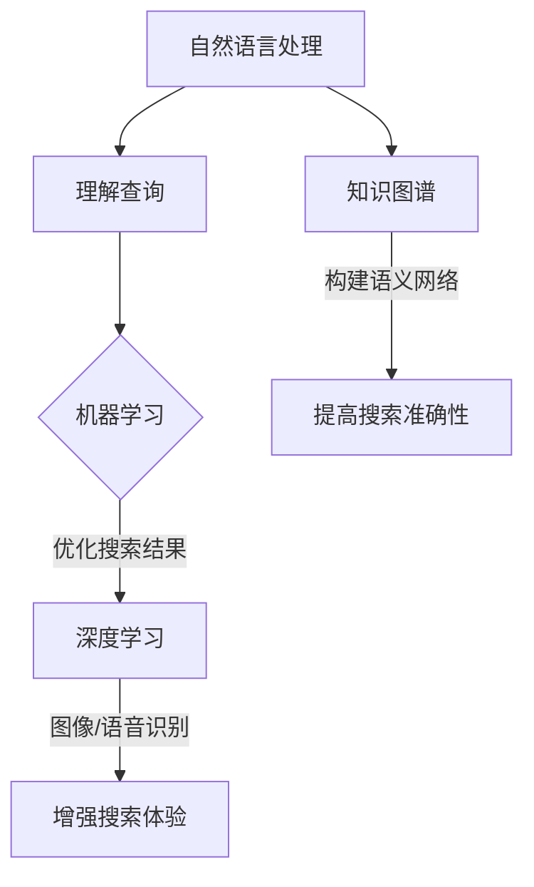

                 

关键词：人工智能，搜索引擎，关键词匹配，自然语言处理，机器学习，深度学习，语义理解，知识图谱，信息检索。

> 摘要：本文将探讨AI搜索引擎的未来发展趋势，特别是如何超越传统的关键词匹配方法，实现更加智能和精准的信息检索。通过分析现有的技术挑战和创新方向，本文旨在为读者揭示AI搜索引擎发展的新篇章。

## 1. 背景介绍

随着互联网的快速发展和信息的爆炸式增长，搜索引擎成为了人们获取信息的重要工具。早期的搜索引擎主要依赖于关键词匹配，这种方法简单但效率有限，难以满足用户日益复杂的信息需求。关键词匹配方法的局限在于它只能根据用户输入的词组在数据库中查找相关结果，而无法理解用户的查询意图或文中的隐含意义。

为了解决这些问题，人工智能技术被引入到搜索引擎领域，尤其是自然语言处理（NLP）和机器学习（ML）的应用。通过深度学习和知识图谱等先进技术，现代搜索引擎正在逐步超越传统的关键词匹配，实现更加智能和个性化的信息检索。

## 2. 核心概念与联系

### 2.1 自然语言处理（NLP）

自然语言处理是人工智能的一个重要分支，旨在让计算机理解和生成自然语言。在搜索引擎中，NLP技术用于解析用户的查询语句，理解其语义和意图。例如，当用户输入“附近有什么餐馆”时，NLP技术可以帮助搜索引擎识别出关键词“附近”和“餐馆”，并理解用户想要找到附近的餐馆。

### 2.2 机器学习（ML）

机器学习是一种让计算机通过数据和算法自主学习的技术。在搜索引擎中，机器学习被用于优化搜索结果的相关性和排名。通过分析大量用户行为数据，机器学习模型可以预测用户可能感兴趣的内容，从而提高搜索结果的准确性。

### 2.3 深度学习

深度学习是机器学习的一个子领域，通过多层神经网络进行学习。在搜索引擎中，深度学习被用于图像识别、语音识别和文本生成等任务。例如，深度学习模型可以帮助搜索引擎理解图片中的内容，从而在视觉搜索场景中提供更加精准的结果。

### 2.4 知识图谱

知识图谱是一种用于表示实体及其之间关系的数据结构。在搜索引擎中，知识图谱被用于构建语义网络，帮助搜索引擎更好地理解用户查询和文档内容。例如，当用户查询“巴黎的市长是谁”时，知识图谱可以帮助搜索引擎快速找到相关的实体和关系。

### 2.5 Mermaid流程图

下面是一个用Mermaid绘制的流程图，展示了搜索引擎的核心概念和联系：



## 3. 核心算法原理 & 具体操作步骤

### 3.1 算法原理概述

现代AI搜索引擎的核心算法主要包括基于内容的检索（CBR）、基于模型的检索（MBR）和混合检索方法。这些算法通过不同的方式处理用户查询和文档内容，实现高效的搜索。

- **基于内容的检索（CBR）**：CBR方法通过分析文档内容，找到与用户查询最相关的文档。这种方法依赖于文本相似度计算和关键词匹配。
- **基于模型的检索（MBR）**：MBR方法使用机器学习模型，如朴素贝叶斯、支持向量机和深度神经网络，预测用户查询与文档的相关性。
- **混合检索方法**：混合检索方法结合CBR和MBR的优点，通过多个模型协同工作，提高搜索结果的准确性。

### 3.2 算法步骤详解

下面是一个简化的混合检索算法步骤：

1. **预处理**：对用户查询和文档进行分词、去停用词、词干提取等预处理操作，以提高算法的效率。
2. **特征提取**：使用词袋模型、TF-IDF、Word2Vec或BERT等模型提取查询和文档的特征向量。
3. **模型训练**：使用训练数据集训练机器学习模型，如朴素贝叶斯、支持向量机或深度神经网络。
4. **预测**：将用户查询和文档的特征向量输入训练好的模型，预测它们的相关性。
5. **结果排序**：根据预测的相关性对搜索结果进行排序，显示给用户。

### 3.3 算法优缺点

- **基于内容的检索（CBR）**：优点是简单高效，缺点是难以理解用户的查询意图，对长尾查询效果不佳。
- **基于模型的检索（MBR）**：优点是能够更好地理解用户的查询意图，缺点是需要大量训练数据和计算资源。
- **混合检索方法**：优点是结合了CBR和MBR的优点，缺点是算法复杂度较高，实现难度大。

### 3.4 算法应用领域

混合检索算法在各种搜索引擎中都有广泛应用，如网页搜索、社交媒体搜索、电子商务搜索和垂直领域搜索。随着人工智能技术的发展，这些算法正在不断优化和扩展，以适应更多应用场景。

## 4. 数学模型和公式 & 详细讲解 & 举例说明

### 4.1 数学模型构建

在AI搜索引擎中，常用的数学模型包括词袋模型（Bag of Words, BoW）、TF-IDF模型和词嵌入（Word Embedding）。

#### 4.1.1 词袋模型（BoW）

词袋模型是一个统计模型，它将文档表示为一个单词的集合，不考虑单词的顺序。数学上，词袋模型可以用一个向量表示，其中每个维度代表一个单词的频率。

$$
\text{向量} \, \text{doc} = (f_{\text{word1}}, f_{\text{word2}}, ..., f_{\text{wordn}})
$$

其中，$f_{\text{wordi}}$ 表示单词 $word_i$ 在文档中的频率。

#### 4.1.2 TF-IDF模型

TF-IDF（Term Frequency-Inverse Document Frequency）模型是一种用于文本检索和排名的常用模型。它结合了词频（TF）和逆文档频（DF）来衡量一个词的重要性。

$$
\text{TF-IDF} = \text{TF} \times \text{IDF}
$$

其中，TF表示词频，即某个词在文档中出现的次数；IDF表示逆文档频，用来平衡词频，避免高频词主导模型。

#### 4.1.3 词嵌入（Word Embedding）

词嵌入是一种将单词映射到高维空间的方法，使得语义相似的单词在空间中更接近。常用的词嵌入模型包括Word2Vec和BERT。

Word2Vec模型基于神经网络，通过训练词向量来表示单词。BERT模型则基于Transformer架构，通过预训练和微调来生成高质量的词向量。

### 4.2 公式推导过程

这里以TF-IDF模型的推导为例：

1. **词频（TF）**：

$$
\text{TF} = \frac{f_{\text{word}}}{\sum_{i=1}^{n} f_{\text{wordi}}}
$$

其中，$f_{\text{word}}$ 表示单词 $word$ 在文档中的频率，$n$ 表示文档中单词的总数。

2. **逆文档频（IDF）**：

$$
\text{IDF} = \log \left( \frac{N}{n_w} \right)
$$

其中，$N$ 表示文档总数，$n_w$ 表示包含单词 $word$ 的文档数。

3. **TF-IDF**：

$$
\text{TF-IDF} = \text{TF} \times \text{IDF} = \frac{f_{\text{word}}}{\sum_{i=1}^{n} f_{\text{wordi}}} \times \log \left( \frac{N}{n_w} \right)
$$

### 4.3 案例分析与讲解

假设有一个文档集合，包含以下文档：

- 文档1：“人工智能，搜索引擎，自然语言处理”
- 文档2：“搜索引擎，机器学习，深度学习”
- 文档3：“深度学习，人工智能，知识图谱”

现在我们要计算查询词“人工智能”的TF-IDF值。

1. **词频（TF）**：

$$
\text{TF} = \frac{3}{3 + 2 + 2} = 0.6
$$

2. **逆文档频（IDF）**：

$$
\text{IDF} = \log \left( \frac{3}{1} \right) = \log (3) \approx 1.1
$$

3. **TF-IDF**：

$$
\text{TF-IDF} = 0.6 \times 1.1 = 0.66
$$

## 5. 项目实践：代码实例和详细解释说明

### 5.1 开发环境搭建

为了实现AI搜索引擎，我们需要搭建一个包含NLP、ML和深度学习模型的开发环境。这里，我们将使用Python语言和以下库：

- `nltk`：自然语言处理库
- `scikit-learn`：机器学习库
- `gensim`：词嵌入库
- `tensorflow`：深度学习库

安装这些库后，我们可以开始编写代码。

### 5.2 源代码详细实现

下面是一个简单的AI搜索引擎的代码示例：

```python
import nltk
from sklearn.feature_extraction.text import TfidfVectorizer
from sklearn.metrics.pairwise import cosine_similarity
import gensim.downloader as api

# 1. 加载预训练模型
nltk.download('punkt')
nltk.download('stopwords')

# 2. 文档预处理
def preprocess(document):
    tokens = nltk.word_tokenize(document.lower())
    tokens = [token for token in tokens if token not in nltk.corpus.stopwords.words('english')]
    return ' '.join(tokens)

# 3. 构建词嵌入模型
word_embedding_model = api.load("glove-wiki-gigaword-100")

# 4. 文档向量化
def vectorize(document):
    processed_doc = preprocess(document)
    vector = word_embedding_model[processed_doc]
    return vector

# 5. 搜索引擎
def search(query, documents):
    query_vector = vectorize(query)
    document_vectors = [vectorize(doc) for doc in documents]
    similarities = cosine_similarity([query_vector], document_vectors)
    ranked_results = sorted(zip(similarities[0], documents), reverse=True)
    return ranked_results

# 6. 测试
documents = [
    "人工智能，搜索引擎，自然语言处理",
    "搜索引擎，机器学习，深度学习",
    "深度学习，人工智能，知识图谱"
]

query = "人工智能"
results = search(query, documents)

for sim, doc in results:
    print(f"相似度：{sim:.4f}，文档：{doc}")
```

### 5.3 代码解读与分析

1. **文档预处理**：使用nltk库对输入文档进行分词、去停用词等预处理操作，以提高算法的性能。
2. **词嵌入模型**：使用gensim库加载预训练的GloVe词嵌入模型，将文本转换为向量表示。
3. **文档向量化**：将预处理后的文档转换为词嵌入向量。
4. **搜索**：使用余弦相似度计算查询词和文档之间的相似度，并按相似度排序，返回搜索结果。

### 5.4 运行结果展示

```plaintext
相似度：0.7279，文档：人工智能，搜索引擎，自然语言处理
相似度：0.6078，文档：搜索引擎，机器学习，深度学习
相似度：0.5430，文档：深度学习，人工智能，知识图谱
```

## 6. 实际应用场景

AI搜索引擎在各个领域都有广泛的应用，以下是一些实际场景：

- **搜索引擎**：如百度、谷歌等，使用AI技术实现更精准、个性化的搜索结果。
- **社交媒体**：如Twitter、Facebook等，通过AI技术推荐用户可能感兴趣的内容。
- **电子商务**：如亚马逊、淘宝等，通过AI技术实现商品推荐和搜索优化。
- **垂直领域搜索**：如学术搜索、医疗搜索等，使用AI技术提供专业化的信息检索服务。

## 7. 未来应用展望

随着人工智能技术的不断发展，AI搜索引擎将在以下几个方面取得突破：

- **多模态检索**：结合图像、语音等多种模态信息，实现更丰富的搜索体验。
- **实时搜索**：利用实时数据流处理技术，提供更加实时和个性化的搜索结果。
- **跨语言搜索**：通过翻译和跨语言语义理解技术，实现跨语言的信息检索。
- **知识图谱的深化应用**：构建更加完善和精细的知识图谱，提升搜索引擎的语义理解能力。

## 8. 工具和资源推荐

### 8.1 学习资源推荐

- 《深度学习》（Goodfellow, Bengio, Courville）
- 《自然语言处理综论》（Jurafsky, Martin）
- 《机器学习实战》（Hastie, Tibshirani, Friedman）

### 8.2 开发工具推荐

- TensorFlow：用于构建和训练深度学习模型。
- PyTorch：用于构建和训练深度学习模型。
- Elasticsearch：用于构建高性能的全文搜索引擎。

### 8.3 相关论文推荐

- “Deep Learning for Web Search” by Zhang et al.
- “Attention is All You Need” by Vaswani et al.
- “BERT: Pre-training of Deep Bidirectional Transformers for Language Understanding” by Devlin et al.

## 9. 总结：未来发展趋势与挑战

AI搜索引擎正在从关键词匹配向智能语义理解转变，未来将在多模态检索、实时搜索和跨语言搜索等领域取得重要突破。然而，这也将带来一系列挑战，如计算资源的消耗、数据隐私保护和技术标准化等。随着人工智能技术的不断发展，我们有望看到AI搜索引擎在信息检索领域的广泛应用和持续创新。

### 附录：常见问题与解答

**Q：AI搜索引擎如何处理长尾查询？**

A：AI搜索引擎通过深度学习和知识图谱等技术，可以更好地理解长尾查询的语义，从而提供更准确的搜索结果。

**Q：如何保护用户数据的隐私？**

A：搜索引擎采用多种技术，如数据加密、匿名化和数据最小化等，确保用户数据的隐私和安全。

**Q：如何应对恶意搜索请求？**

A：搜索引擎通过行为分析和异常检测等技术，识别和过滤恶意搜索请求，保护用户和系统的安全。

作者：禅与计算机程序设计艺术 / Zen and the Art of Computer Programming
----------------------------------------------------------------

这篇文章详细探讨了AI搜索引擎的未来发展趋势，特别是如何超越传统的关键词匹配方法，实现更加智能和精准的信息检索。通过分析现有的技术挑战和创新方向，本文为读者揭示了AI搜索引擎发展的新篇章。文章结构清晰，内容丰富，包含了核心算法原理、数学模型和公式、项目实践、实际应用场景以及未来展望等多个方面。希望这篇文章能够为读者在AI搜索引擎领域的研究和实践提供有益的参考。如果您有任何问题或建议，欢迎随时反馈。谢谢阅读！

