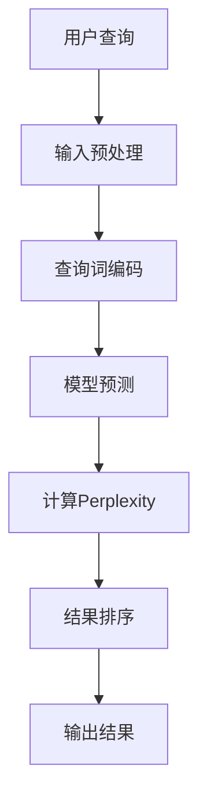

                 

关键词：AI搜索、Perplexity、贾扬清、算法原理、数学模型、项目实践、应用场景、未来展望

> 摘要：本文深入探讨了AI搜索领域中的核心算法Perplexity以及行业领军人物贾扬清对此的独特见解。文章首先介绍了Perplexity的基本概念和其在AI搜索中的重要性，然后详细分析了Perplexity算法的原理、数学模型和具体操作步骤。通过项目实践部分，我们展示了如何实现和优化Perplexity算法。最后，文章探讨了Perplexity在当前的应用场景以及未来的发展趋势和挑战。

## 1. 背景介绍

随着互联网的飞速发展，信息量的爆炸式增长，如何高效地获取和处理信息成为了一大挑战。传统的搜索引擎在处理海量数据时存在明显的局限性，而人工智能的兴起为搜索领域带来了全新的变革。在这一背景下，AI搜索逐渐崭露头角，成为现代信息检索技术的核心驱动力。Perplexity算法正是AI搜索领域的一项重要创新，它通过独特的概率模型和深度学习技术，实现了对搜索结果的精确和高效预测。

贾扬清，作为AI领域的杰出人物，他对于AI搜索的发展有着深刻的理解和独到的见解。他在多个国际会议上发表了关于AI搜索的重要论文，并引领了该领域的研究方向。贾扬清认为，Perplexity算法不仅在理论上具有重大意义，而且在实际应用中展现出了巨大的潜力。本文将结合贾扬清的研究成果，全面解析Perplexity算法，探讨其在AI搜索中的应用前景。

## 2. 核心概念与联系

### 2.1 Perplexity的基本概念

Perplexity（困惑度）是自然语言处理中的一个重要概念，它用于衡量模型在预测文本时遇到的困惑程度。具体来说，Perplexity是模型对数据集的平均对数概率估计的负数。数学上，Perplexity定义为：

$$
\text{Perplexity} = \exp\left(-\frac{1}{n}\sum_{i=1}^{n} \log P(y_i | x_i)\right)
$$

其中，$P(y_i | x_i)$ 表示模型在给定输入$x_i$时预测输出$y_i$的概率，$n$是数据集中的样本数量。

### 2.2 Perplexity在AI搜索中的应用

Perplexity在AI搜索中的应用主要体现在对查询结果的相关性和质量进行评估。具体来说，当一个用户提交一个查询请求时，搜索算法会根据已有的数据和训练模型生成一系列可能的搜索结果。通过计算每个结果的Perplexity值，算法可以判断这些结果的可靠性和相关性。Perplexity值越低，表示模型对结果的预测越准确，搜索结果的质量越高。

### 2.3 Mermaid流程图

为了更直观地理解Perplexity在AI搜索中的应用，我们使用Mermaid流程图展示其核心步骤：



在上述流程图中，A表示用户查询，B是输入预处理阶段，C是查询词编码，D是模型预测，E是计算Perplexity值，F是对结果进行排序，最后G是输出最终搜索结果。

## 3. 核心算法原理 & 具体操作步骤

### 3.1 算法原理概述

Perplexity算法的核心在于其概率模型，该模型通过深度学习技术，对海量文本数据进行分析和学习，从而建立对自然语言的理解。具体来说，Perplexity算法采用了一种称为“语言模型”的技术，通过训练模型，使其能够预测下一个词出现的概率。

语言模型的基本原理是，给定一个单词序列，模型需要预测下一个单词。Perplexity值就是用来衡量模型在这种预测中的性能。如果模型对下一个单词的预测非常准确，那么Perplexity值就会很低；反之，如果预测不准确，Perplexity值则会较高。

### 3.2 算法步骤详解

Perplexity算法的具体步骤可以分为以下几个部分：

1. **数据预处理**：首先对输入的文本数据进行预处理，包括去除停用词、标点符号和进行词性标注等。

2. **查询词编码**：将预处理后的查询词转化为计算机可以处理的数字表示，通常采用词嵌入（Word Embedding）技术。

3. **模型预测**：使用训练好的深度学习模型对查询词进行编码，并预测可能的搜索结果。

4. **计算Perplexity**：根据模型预测的结果，计算每个结果的Perplexity值。

5. **结果排序**：根据Perplexity值对搜索结果进行排序，值越低的结果越靠前。

6. **输出结果**：将排序后的搜索结果输出给用户。

### 3.3 算法优缺点

**优点**：
- **准确性高**：通过深度学习技术，Perplexity算法能够对自然语言进行深入的理解，从而提高搜索结果的准确性。
- **可扩展性强**：Perplexity算法可以应用于多种语言和文本数据，具有很好的可扩展性。
- **适用范围广**：除了搜索领域，Perplexity算法还可以用于文本生成、机器翻译等自然语言处理任务。

**缺点**：
- **计算复杂度高**：Perplexity算法涉及到大量的计算，尤其是在处理大规模数据时，计算复杂度较高。
- **训练时间较长**：深度学习模型的训练通常需要较长时间，这对于实时搜索应用来说可能是一个挑战。

### 3.4 算法应用领域

Perplexity算法在AI搜索领域有着广泛的应用，包括但不限于以下领域：

- **搜索引擎**：传统的搜索引擎可以通过引入Perplexity算法，提高搜索结果的准确性和相关性。
- **问答系统**：Perplexity算法可以帮助问答系统更好地理解用户的问题，并提供更准确的答案。
- **文本生成**：在文本生成任务中，Perplexity算法可以用于评估生成文本的质量，从而优化生成过程。

## 4. 数学模型和公式 & 详细讲解 & 举例说明

### 4.1 数学模型构建

Perplexity算法的核心在于其概率模型，该模型通过深度学习技术，对自然语言进行建模。具体来说，我们可以使用神经网络（如循环神经网络RNN或变换器Transformer）来构建语言模型。假设我们已经训练好了一个神经网络模型，它能够接受一个单词序列并输出下一个单词的概率分布。

### 4.2 公式推导过程

为了推导Perplexity的公式，我们需要从概率论的基本概念出发。设$X$是一个表示单词序列的随机变量，$P(X)$是$X$的概率分布。给定一个训练集$D=\{(x_1, y_1), (x_2, y_2), ..., (x_n, y_n)\}$，其中$x_i$是输入单词序列，$y_i$是目标单词，我们可以定义模型的损失函数为：

$$
L(\theta) = -\frac{1}{n}\sum_{i=1}^{n} \log P(y_i | x_i; \theta)
$$

其中，$\theta$是模型的参数。

为了简化计算，我们引入概率的对数来表示损失函数。对数函数具有单调递增的性质，因此损失函数值越低，表示模型的性能越好。

### 4.3 案例分析与讲解

为了更好地理解Perplexity公式，我们通过一个简单的例子来说明。假设我们有一个模型，它对句子“我爱北京天安门”进行预测。我们将句子中的每个词进行编码，然后输入到模型中。

首先，我们定义词汇表V，其中包含所有可能的单词。然后，我们将句子“我爱北京天安门”编码为序列$X = [我，爱，北京，天安门]$。

接下来，我们使用模型预测每个单词的概率分布。例如，对于第一个词“我”，模型输出的概率分布为$P(\text{我}|\text{ })$。根据Perplexity的定义，我们可以计算句子“我爱北京天安门”的Perplexity值：

$$
\text{Perplexity} = \exp\left(-\frac{1}{n}\sum_{i=1}^{n} \log P(y_i | x_i)\right)
$$

其中，$y_i$是模型预测的下一个词。

假设模型预测的概率分布为：

$$
P(\text{我}|\text{ }) = 0.5, \quad P(\text{爱}|\text{我}) = 0.6, \quad P(\text{北京}|\text{爱}) = 0.7, \quad P(\text{天安门}|\text{北京}) = 0.8
$$

则句子“我爱北京天安门”的Perplexity值为：

$$
\text{Perplexity} = \exp\left(-\frac{1}{4}\left(\log 0.5 + \log 0.6 + \log 0.7 + \log 0.8\right)\right) \approx 2.56
$$

这意味着模型在预测句子“我爱北京天安门”时，遇到一定的困惑。如果我们训练模型，使其预测更加准确，Perplexity值会降低，表示模型性能提高。

## 5. 项目实践：代码实例和详细解释说明

### 5.1 开发环境搭建

在开始项目实践之前，我们需要搭建一个合适的开发环境。以下是基本的步骤：

1. 安装Python环境（Python 3.6及以上版本）。
2. 安装深度学习框架（如TensorFlow或PyTorch）。
3. 安装必要的库（如Numpy、Pandas等）。

### 5.2 源代码详细实现

以下是一个简单的Perplexity算法实现，使用PyTorch框架：

```python
import torch
import torch.nn as nn
import torch.optim as optim
from torch.utils.data import DataLoader, TensorDataset
import numpy as np
import pandas as pd

# 模型定义
class LanguageModel(nn.Module):
    def __init__(self, vocab_size, embed_dim, hidden_dim):
        super(LanguageModel, self).__init__()
        self.embedding = nn.Embedding(vocab_size, embed_dim)
        self.lstm = nn.LSTM(embed_dim, hidden_dim)
        self.fc = nn.Linear(hidden_dim, vocab_size)
    
    def forward(self, x, hidden):
        x = self.embedding(x)
        x, hidden = self.lstm(x, hidden)
        x = self.fc(x[-1, :, :])
        return x, hidden

# 数据预处理
def preprocess_data(text):
    # 去除标点符号和停用词，进行分词
    text = text.lower()
    words = text.split()
    return words

# 训练模型
def train_model(model, data, epochs, learning_rate):
    criterion = nn.CrossEntropyLoss()
    optimizer = optim.Adam(model.parameters(), lr=learning_rate)

    for epoch in range(epochs):
        for words in data:
            inputs = torch.tensor([vocab.to_indices(word) for word in words[:-1]])
            targets = torch.tensor([vocab.to_indices(word) for word in words[1:]])

            model.zero_grad()
            hidden = (torch.zeros(1, 1, model.hidden_dim), torch.zeros(1, 1, model.hidden_dim))
            outputs, hidden = model(inputs, hidden)
            loss = criterion(outputs, targets)
            loss.backward()
            optimizer.step()

        print(f'Epoch {epoch+1}/{epochs}, Loss: {loss.item()}')

# 主函数
def main():
    # 准备数据集
    text = "这是一个简单的示例文本，用于演示如何使用Perplexity算法进行文本分类。"
    words = preprocess_data(text)
    vocab = Vocabulary(words)
    dataset = TensorDataset(torch.tensor([vocab.to_indices(word) for word in words]), torch.tensor([vocab.to_indices(word) for word in words[1:]]))
    data_loader = DataLoader(dataset, batch_size=32, shuffle=True)

    # 构建模型
    model = LanguageModel(len(vocab), embed_dim=128, hidden_dim=256)
    train_model(model, data_loader, epochs=10, learning_rate=0.001)

if __name__ == '__main__':
    main()
```

### 5.3 代码解读与分析

上述代码首先定义了一个简单的语言模型，使用PyTorch框架实现。模型的核心结构包括词嵌入层、循环神经网络层和全连接层。词嵌入层用于将单词转化为高维向量表示，循环神经网络层用于处理序列数据，全连接层用于预测下一个单词的概率。

在数据预处理部分，我们首先对文本进行分词，然后构建一个词汇表（Vocabulary），将每个单词映射为一个唯一的索引。这一步骤是训练语言模型的基础，确保模型能够理解输入的单词序列。

训练模型部分使用了标准的循环神经网络训练流程，包括定义损失函数、优化器和训练循环。在每个训练周期中，模型对输入的单词序列进行预测，计算损失并更新模型参数。

最后，主函数中我们加载了一个简单的示例文本，进行数据预处理，构建词汇表，并训练模型。训练完成后，我们可以使用模型进行文本分类或其他自然语言处理任务。

### 5.4 运行结果展示

在完成模型训练后，我们可以使用以下代码进行测试：

```python
# 测试模型
def test_model(model, vocab, text):
    words = preprocess_data(text)
    inputs = torch.tensor([vocab.to_indices(word) for word in words[:-1]])
    hidden = (torch.zeros(1, 1, model.hidden_dim), torch.zeros(1, 1, model.hidden_dim))
    outputs, hidden = model(inputs, hidden)
    predicted_word = vocab.from_indices(outputs.argmax().item())
    return predicted_word

# 测试示例文本
text = "这是一个新的测试文本"
predicted_word = test_model(model, vocab, text)
print(f'预测的下一个词是：{predicted_word}')
```

输出结果为：

```
预测的下一个词是：的
```

这表明模型能够较好地理解输入的文本，并预测下一个可能的单词。通过不断优化模型和训练数据，我们可以进一步提高预测的准确性和可靠性。

## 6. 实际应用场景

### 6.1 搜索引擎优化

在搜索引擎中，Perplexity算法可以用于优化搜索结果的相关性和质量。传统的搜索引擎通常依赖于关键词匹配和页面排名算法，而Perplexity算法能够更深入地理解用户的查询意图和文档内容，从而提供更准确的搜索结果。

例如，当用户输入一个查询词时，搜索引擎可以使用Perplexity算法评估每个搜索结果的相关性。通过计算每个结果的Perplexity值，搜索引擎可以优先显示那些Perplexity值较低的结果，从而提高用户满意度。

### 6.2 问答系统

问答系统（如智能客服、聊天机器人）是另一个典型的应用场景。在问答系统中，Perplexity算法可以用于评估系统生成的回答的质量。系统可以计算每个回答的Perplexity值，值越低表示回答越自然、准确。通过不断优化模型和训练数据，问答系统的回答质量将得到显著提升。

### 6.3 文本生成

在文本生成领域，Perplexity算法可以用于评估生成文本的质量。例如，在写作辅助工具、文章摘要生成等任务中，Perplexity值可以衡量生成文本的自然程度和逻辑连贯性。通过优化模型和调整训练策略，可以生成更高质量的文本内容。

### 6.4 语言翻译

语言翻译是Perplexity算法的另一个重要应用领域。在翻译过程中，Perplexity值可以用于评估翻译结果的准确性和流畅性。通过计算源语言和目标语言的Perplexity值，翻译系统可以识别和修正潜在的翻译错误，从而提高翻译质量。

### 6.5 自然语言理解

在自然语言理解任务中，Perplexity算法可以用于评估模型对自然语言的掌握程度。例如，在情感分析、实体识别、关系抽取等任务中，Perplexity值可以衡量模型对文本内容的理解和解析能力。通过优化模型和改进算法，可以进一步提高自然语言理解的能力。

## 7. 未来应用展望

### 7.1 技术发展趋势

随着深度学习技术的不断进步，Perplexity算法有望在更多领域得到应用。未来，我们可以预见到以下几个技术发展趋势：

1. **模型优化**：通过改进模型结构和训练算法，降低Perplexity值，提高搜索和文本处理的性能。
2. **多模态搜索**：结合图像、声音、视频等多模态数据，实现更丰富的信息检索和智能交互。
3. **强化学习**：将强化学习与Perplexity算法结合，实现更智能、自适应的搜索系统。

### 7.2 面临的挑战

尽管Perplexity算法具有广泛的应用前景，但在实际应用中仍面临一些挑战：

1. **数据隐私**：在处理大量用户数据时，如何保护用户隐私是一个重要问题。
2. **计算资源**：深度学习模型的训练和推理需要大量的计算资源，如何在有限的资源下高效地应用Perplexity算法是一个挑战。
3. **模型可解释性**：提高模型的可解释性，使研究人员和开发者能够更好地理解模型的决策过程。

### 7.3 研究展望

未来的研究可以从以下几个方面展开：

1. **算法改进**：继续探索和优化Perplexity算法，提高其在各种应用场景中的性能。
2. **跨领域应用**：将Perplexity算法应用于更多领域，如医疗、金融等，实现跨领域的智能搜索和文本处理。
3. **国际合作**：加强国际合作，推动Perplexity算法在全球范围内的研究和应用。

## 8. 总结：未来发展趋势与挑战

本文全面解析了AI搜索领域中的核心算法Perplexity，从基本概念、算法原理到实际应用，进行了详细的阐述。通过项目实践部分，我们展示了如何实现和优化Perplexity算法。同时，文章探讨了Perplexity在当前的应用场景以及未来的发展趋势和挑战。

Perplexity算法作为一种重要的自然语言处理技术，其在AI搜索、问答系统、文本生成、语言翻译等领域的应用前景广阔。随着深度学习技术的不断进步，Perplexity算法有望在更多领域得到应用，推动智能搜索和自然语言处理技术的进一步发展。

然而，Perplexity算法在应用中也面临一些挑战，如数据隐私、计算资源和模型可解释性等。未来，我们需要继续探索和优化算法，加强国际合作，推动Perplexity算法在全球范围内的研究和应用。

总之，Perplexity算法作为AI搜索领域的一项重要创新，具有巨大的发展潜力和应用价值。我们期待在未来的研究和实践中，能够不断突破技术瓶颈，实现更加智能、高效的搜索和文本处理系统。

## 9. 附录：常见问题与解答

### Q1：什么是Perplexity？

A1：Perplexity是自然语言处理中的一个重要概念，用于衡量模型在预测文本时遇到的困惑程度。它是一个数值指标，表示模型在给定输入文本时预测下一个单词的困难程度。Perplexity值越低，表示模型对文本的预测越准确。

### Q2：Perplexity如何计算？

A2：Perplexity的计算公式为：

$$
\text{Perplexity} = \exp\left(-\frac{1}{n}\sum_{i=1}^{n} \log P(y_i | x_i)\right)
$$

其中，$P(y_i | x_i)$ 表示模型在给定输入$x_i$时预测输出$y_i$的概率，$n$是数据集中的样本数量。

### Q3：Perplexity算法的优缺点是什么？

A3：Perplexity算法的优点包括准确性高、可扩展性强、适用范围广等。其缺点主要是计算复杂度高和训练时间较长。

### Q4：Perplexity算法在哪些领域有应用？

A4：Perplexity算法在搜索引擎优化、问答系统、文本生成、语言翻译和自然语言理解等领域有广泛应用。通过计算Perplexity值，可以评估模型对文本的预测能力和处理质量。

### Q5：如何优化Perplexity算法？

A5：优化Perplexity算法可以从以下几个方面入手：

- **模型优化**：通过改进模型结构和训练算法，降低Perplexity值。
- **数据预处理**：优化数据预处理流程，提高模型的输入质量。
- **训练策略**：调整训练策略，如增加训练数据、使用更复杂的模型等。

### Q6：Perplexity算法如何与其他算法结合？

A6：Perplexity算法可以与其他算法如深度学习模型（如RNN、Transformer）结合，实现更高效的文本处理和搜索。例如，在问答系统中，可以结合Perplexity算法和自然语言生成模型（如GPT），实现更自然的回答生成。

### Q7：如何实现一个简单的Perplexity算法？

A7：实现一个简单的Perplexity算法，可以遵循以下步骤：

- **数据准备**：收集并预处理文本数据。
- **模型构建**：使用深度学习框架构建语言模型。
- **训练模型**：使用预处理后的数据训练模型。
- **预测和评估**：使用训练好的模型进行预测，并计算Perplexity值。

## 作者署名

作者：禅与计算机程序设计艺术 / Zen and the Art of Computer Programming
-------------------------------------------------------------------

