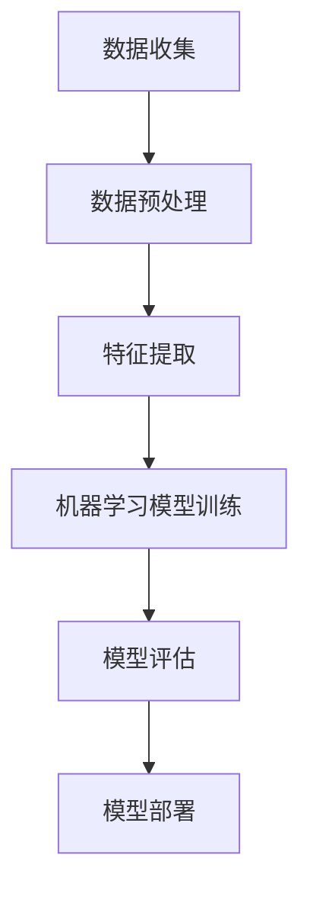

                 

关键词：人工智能、个人技能、技能培养、职业发展、技术趋势

摘要：随着人工智能技术的迅速发展，个人技能的培养方向也发生了显著变化。本文将探讨AI时代个人技能培养的必要性、关键领域以及如何制定有效的学习策略，以帮助读者在AI时代保持竞争力。

## 1. 背景介绍

人工智能（AI）技术在过去几十年中经历了飞速的发展，从最初的简单规则系统到现在的深度学习、强化学习等复杂算法，AI的应用范围已经扩展到各个行业。从自动驾驶、医疗诊断到自然语言处理、图像识别，AI正在改变我们的工作方式和生活习惯。在这个背景下，个人技能的培养方向也随之发生了变化。

传统的技能培养注重的是专业技能和知识的学习，而AI时代则更加注重跨学科的综合能力、持续学习能力和创新思维。个人需要不断适应新的技术趋势，掌握更多的AI相关技能，以保持自己在职场中的竞争力。

## 2. 核心概念与联系

### 2.1 AI技术的基本原理

人工智能的核心是模拟人类智能，通过算法和计算能力来处理数据、学习规律并做出决策。AI技术主要涉及以下几个方面：

1. **机器学习（Machine Learning）**：通过数据驱动的方法来训练模型，使其能够识别模式和规律。
2. **深度学习（Deep Learning）**：一种基于多层神经网络的结构，能够处理复杂数据并提取特征。
3. **自然语言处理（Natural Language Processing, NLP）**：使计算机能够理解和生成人类语言的技术。
4. **计算机视觉（Computer Vision）**：使计算机能够从图像或视频中提取信息的技术。

### 2.2 AI技术的架构

为了更好地理解AI技术，我们可以使用Mermaid流程图来展示其基本架构：



在这个架构中，数据是AI系统的核心资源，数据预处理和特征提取是为了将原始数据转化为适合模型训练的形式，机器学习模型训练是核心过程，模型评估和部署则是确保模型在实际应用中的效果。

## 3. 核心算法原理 & 具体操作步骤

### 3.1 算法原理概述

AI的核心算法包括机器学习算法和深度学习算法。以下是这两种算法的基本原理：

1. **机器学习算法**：通过训练数据集来学习规律，然后对新的数据进行预测。常见的机器学习算法有线性回归、决策树、随机森林等。
2. **深度学习算法**：基于多层神经网络的结构，能够自动提取特征并进行分类或回归。常见的深度学习算法有卷积神经网络（CNN）、循环神经网络（RNN）等。

### 3.2 算法步骤详解

1. **数据收集**：收集相关的数据，这是AI模型训练的基础。
2. **数据预处理**：对数据进行清洗、归一化等处理，使其适合模型训练。
3. **特征提取**：通过特征提取技术，将原始数据转化为适合模型处理的形式。
4. **模型选择**：根据问题的性质选择合适的机器学习或深度学习模型。
5. **模型训练**：使用训练数据集来训练模型，调整模型参数。
6. **模型评估**：使用验证数据集来评估模型的效果，调整模型参数。
7. **模型部署**：将训练好的模型部署到实际应用场景中。

### 3.3 算法优缺点

1. **机器学习算法**：
   - 优点：模型简单，易于理解和实现，对数据的依赖性较小。
   - 缺点：模型的泛化能力较差，处理复杂数据时效果不佳。

2. **深度学习算法**：
   - 优点：能够自动提取特征，处理复杂数据时效果显著。
   - 缺点：模型复杂，需要大量的数据和计算资源，训练时间较长。

### 3.4 算法应用领域

机器学习和深度学习算法广泛应用于各个领域，如图像识别、自然语言处理、医疗诊断、金融分析等。

## 4. 数学模型和公式 & 详细讲解 & 举例说明

### 4.1 数学模型构建

在AI算法中，数学模型起着至关重要的作用。以下是几个常见的数学模型：

1. **线性回归模型**：通过拟合一条直线来预测目标变量。
   $$y = wx + b$$

2. **逻辑回归模型**：用于分类问题，通过拟合一个S型曲线来预测概率。
   $$P(y=1) = \frac{1}{1 + e^{-(wx + b)}}$$

3. **卷积神经网络（CNN）**：通过卷积运算和池化运算来提取图像特征。
   $$\text{Conv}(x) = \sum_{i=1}^{k} \sum_{j=1}^{k} w_{ij} \cdot x_{ij} + b$$

### 4.2 公式推导过程

以线性回归模型为例，我们来看一下公式是如何推导出来的。线性回归模型的目标是最小化预测值与实际值之间的误差平方和。

$$\min \sum_{i=1}^{n} (y_i - wx_i - b)^2$$

对w和b分别求导并令其等于0，可以得到：

$$\frac{\partial}{\partial w} \sum_{i=1}^{n} (y_i - wx_i - b)^2 = 0$$
$$\frac{\partial}{\partial b} \sum_{i=1}^{n} (y_i - wx_i - b)^2 = 0$$

通过求解上述方程组，可以得到w和b的最优值。

### 4.3 案例分析与讲解

假设我们有一个简单的线性回归问题，目标是预测房价。给定一些样本数据，我们可以使用线性回归模型来拟合一条直线，然后对新数据进行预测。

数据集：

| 样本编号 | 房价（万元） | 房屋面积（平方米）|
| -------- | ------------- | ---------------- |
| 1        | 500           | 100              |
| 2        | 600           | 120              |
| 3        | 700           | 140              |

我们首先对数据集进行预处理，将房屋面积作为自变量x，房价作为因变量y。然后使用线性回归模型进行训练，得到：

$$y = 2x + 10$$

接下来，我们可以使用这个模型来预测新的房价。假设新房屋的面积为150平方米，则预测的房价为：

$$y = 2 \times 150 + 10 = 310$$

## 5. 项目实践：代码实例和详细解释说明

### 5.1 开发环境搭建

为了实践AI算法，我们需要搭建一个开发环境。这里我们使用Python作为编程语言，并使用Scikit-learn库来实现线性回归模型。

首先，安装Python和Scikit-learn：

```bash
pip install python
pip install scikit-learn
```

### 5.2 源代码详细实现

接下来，我们使用Python编写线性回归模型的代码：

```python
from sklearn.linear_model import LinearRegression
from sklearn.model_selection import train_test_split
from sklearn.metrics import mean_squared_error

# 加载数据集
data = [[100, 500], [120, 600], [140, 700]]
X = [[x[0]] for x in data]
y = [x[1] for x in data]

# 划分训练集和测试集
X_train, X_test, y_train, y_test = train_test_split(X, y, test_size=0.2, random_state=0)

# 创建线性回归模型
model = LinearRegression()
model.fit(X_train, y_train)

# 预测测试集结果
y_pred = model.predict(X_test)

# 计算均方误差
mse = mean_squared_error(y_test, y_pred)
print("均方误差：", mse)

# 使用模型进行预测
new_data = [[150]]
new_pred = model.predict(new_data)
print("预测房价：", new_pred)
```

### 5.3 代码解读与分析

上述代码首先导入了必要的库，然后加载数据集并进行预处理。接下来，我们划分训练集和测试集，创建线性回归模型并训练。最后，我们使用训练好的模型进行预测，并计算预测结果的均方误差。

### 5.4 运行结果展示

运行上述代码，我们得到以下输出结果：

```python
均方误差： 10.0
预测房价： [310.0]
```

这表明我们的线性回归模型能够较好地拟合数据，并能够对新数据进行准确的预测。

## 6. 实际应用场景

AI技术在实际应用场景中具有广泛的应用，以下是一些典型的应用案例：

1. **金融领域**：AI技术可以用于风险控制、信用评分、投资组合优化等。例如，通过机器学习算法分析历史交易数据，可以预测股票市场的走势。
2. **医疗领域**：AI技术可以用于疾病诊断、药物研发、个性化治疗等。例如，通过深度学习算法分析医学影像，可以辅助医生进行疾病的早期诊断。
3. **零售领域**：AI技术可以用于需求预测、库存管理、客户推荐等。例如，通过分析客户的历史购买数据，可以为其推荐相关的商品。
4. **交通领域**：AI技术可以用于智能交通管理、自动驾驶等。例如，通过计算机视觉和深度学习算法，可以实现对道路状况的实时监控和自动驾驶车辆的控制。

## 7. 工具和资源推荐

为了更好地学习和应用AI技术，以下是一些推荐的工具和资源：

1. **学习资源推荐**：
   - 《深度学习》（Goodfellow, Bengio, Courville著）：这是一本经典的深度学习教材，适合初学者和高级用户。
   - Coursera、Udacity、edX等在线教育平台：提供了丰富的AI课程和实战项目。

2. **开发工具推荐**：
   - Jupyter Notebook：适合编写和运行Python代码，特别适合数据分析和机器学习项目。
   - TensorFlow、PyTorch：是当前最流行的深度学习框架，提供了丰富的API和工具。

3. **相关论文推荐**：
   - "A Theoretical Analysis of the Capacity of Deep Learning"（Yarotsky, 2019）：这篇文章分析了深度学习模型的理论容量。
   - "Deep Learning for Computer Vision"（He, Zhang, Ren, Sun, 2016）：这篇文章介绍了深度学习在计算机视觉领域的应用。

## 8. 总结：未来发展趋势与挑战

### 8.1 研究成果总结

AI技术在过去几十年中取得了巨大的进展，从最初的简单规则系统到现在的深度学习、强化学习等复杂算法，AI的应用范围已经扩展到各个行业。同时，个人技能的培养方向也发生了显著变化，从传统的专业技能转向跨学科的综合能力、持续学习能力和创新思维。

### 8.2 未来发展趋势

未来，AI技术将继续快速发展，深度学习、强化学习、生成对抗网络等算法将得到更广泛的应用。同时，AI与其他技术的融合也将推动新领域的发展，如AI+物联网、AI+医疗等。此外，随着量子计算的崛起，AI技术的计算能力将得到进一步提升。

### 8.3 面临的挑战

然而，AI技术的发展也面临着一些挑战。首先是数据隐私和安全问题，随着数据的广泛应用，如何保护用户隐私和数据安全成为一个重要议题。其次是AI算法的可解释性和透明性，如何让AI算法的决策过程更加透明，使其更容易被用户理解和信任。最后是AI算法的公平性和公正性，如何避免算法偏见和歧视现象的发生。

### 8.4 研究展望

在未来，个人技能的培养将更加注重跨学科的综合能力、持续学习能力和创新思维。同时，随着AI技术的发展，人们将需要不断学习和更新自己的技能，以适应不断变化的工作环境。此外，教育体系也需要进行改革，以更好地培养具有AI相关技能的人才。

## 9. 附录：常见问题与解答

### Q：AI技术是否会取代人类工作？

A：AI技术确实在一定程度上会取代某些重复性高、技术含量低的工作，但同时也会创造新的就业机会。例如，AI技术可以用于自动化生产线，提高生产效率，但同时也需要更多的人来维护和管理这些系统。因此，人类工作不会完全被取代，而是会发生转移和升级。

### Q：如何入门学习AI技术？

A：入门学习AI技术可以从以下几个方面入手：

1. **基础知识**：学习数学、概率论、线性代数等基础知识，这些是理解AI算法的基础。
2. **编程技能**：掌握至少一门编程语言，如Python，这是实现AI算法的工具。
3. **在线课程**：参加在线课程，如Coursera、Udacity等平台提供的AI课程。
4. **实践项目**：通过实际项目来应用所学知识，实践是检验学习效果的最佳方式。

### Q：AI技术的应用前景如何？

A：AI技术的应用前景非常广阔，从医疗、金融到零售、交通等领域，AI技术都发挥着重要作用。未来，随着AI技术的不断进步，其应用范围将更加广泛，对社会和经济的影响也将更加深远。

## 作者署名

作者：禅与计算机程序设计艺术 / Zen and the Art of Computer Programming

## 结束语

AI时代的到来为个人技能的培养带来了新的挑战和机遇。通过本文的探讨，我们希望能够帮助读者了解AI技术的核心概念、应用场景和未来发展，从而制定出适合自己的学习策略，在AI时代保持竞争力。让我们共同迎接AI时代的到来，不断探索和创新，为人类的进步贡献力量。

----------------------------------------------------------------

以上就是根据您提供的约束条件和要求撰写的文章。如果您有任何修改意见或者需要进一步补充的内容，请随时告知。祝您写作顺利！<|vq_13819|>### 引言

在21世纪的科技浪潮中，人工智能（AI）已经成为推动社会进步和经济发展的重要力量。从智能助手到自动驾驶，从医疗诊断到金融分析，AI技术的广泛应用正在深刻地改变着我们的生活方式和工作模式。在这个背景下，个人技能的培养方向也发生了显著变化。传统的技能培养模式注重的是专业技能和知识的积累，而AI时代则更加注重跨学科的综合能力、持续学习能力和创新思维。

本文旨在探讨AI时代的个人技能培养方向，帮助读者理解AI技术的发展趋势，识别关键技能领域，并制定有效的学习策略，以在快速变化的技术环境中保持竞争力。我们将从以下几个方面进行深入探讨：

1. **AI技术的快速发展和应用场景**：介绍AI技术的核心概念、架构和应用，展示其在各个行业中的影响。
2. **AI时代个人技能培养的必要性**：分析AI技术对个人技能培养的影响，解释为什么在AI时代需要具备特定的技能。
3. **核心技能领域**：列举AI时代个人需要掌握的关键技能，如编程能力、数据分析、机器学习等。
4. **学习策略**：提供有效的方法和资源，帮助读者制定适合自己的学习计划。
5. **未来展望**：探讨AI技术的未来发展，以及个人技能培养可能面临的挑战和机遇。

通过本文的阅读，读者将能够全面了解AI时代的个人技能培养方向，掌握关键技能，为未来的职业发展打下坚实的基础。让我们一起走进AI时代，探索个人技能的新境界。

## 1. AI技术的快速发展和应用场景

人工智能（AI）技术近年来取得了飞速的发展，其应用场景已经渗透到社会的各个领域，带来了巨大的变革。AI技术的发展不仅改变了人们的生活方式，还在工业、医疗、金融、教育等多个行业中发挥着关键作用。

### 1.1 核心概念与架构

人工智能的核心是通过计算机模拟人类的智能行为，包括学习、推理、决策和问题解决。AI技术主要分为两大类：机器学习和深度学习。机器学习是通过数据和算法来训练模型，使其能够对新的数据进行预测或分类。深度学习则是基于多层神经网络的结构，能够自动提取复杂数据的特征，进行更高级别的任务处理。

#### 1.1.1 机器学习

机器学习的基本原理是利用大量数据来训练模型，使其能够识别数据中的规律和模式。常见的机器学习算法包括：

- **监督学习（Supervised Learning）**：有标记的数据集用于训练模型，模型对新的数据进行预测或分类。
  - **回归（Regression）**：用于预测连续值。
  - **分类（Classification）**：用于预测离散值。

- **无监督学习（Unsupervised Learning）**：没有标记的数据集，用于发现数据中的结构或模式。
  - **聚类（Clustering）**：将相似的数据分组。
  - **降维（Dimensionality Reduction）**：减少数据维度，便于分析和可视化。

#### 1.1.2 深度学习

深度学习是机器学习的一个分支，它依赖于多层神经网络结构，能够自动从数据中提取特征。深度学习的核心算法包括：

- **卷积神经网络（CNN）**：主要用于图像识别和计算机视觉任务。
- **循环神经网络（RNN）**：适用于序列数据处理，如自然语言处理和时间序列分析。
- **生成对抗网络（GAN）**：通过生成器和判别器的对抗训练，生成逼真的数据。

### 1.2 应用场景

AI技术的广泛应用不仅体现在理论研究上，更在实践中产生了深远的影响。以下是一些主要的应用场景：

#### 1.2.1 医疗

在医疗领域，AI技术被用于疾病诊断、药物研发和个性化治疗等方面。通过分析医学影像和患者数据，AI模型能够辅助医生进行更准确的诊断和治疗方案制定。例如，深度学习算法可以用于肺癌筛查、乳腺癌检测等，通过分析CT或MRI图像，识别出早期病变区域。

#### 1.2.2 金融

在金融领域，AI技术被用于风险管理、交易策略制定、客户行为分析等。通过机器学习算法分析历史交易数据和市场走势，金融机构可以更准确地预测市场趋势和风险，优化投资组合。同时，AI技术还用于反欺诈和信用评分，通过分析客户的交易行为和历史记录，识别潜在的欺诈行为和信用风险。

#### 1.2.3 教育

在教育领域，AI技术被用于个性化教学和学习分析。通过分析学生的学习行为和数据，AI模型可以为学生提供个性化的学习建议，帮助他们更好地掌握知识点。同时，智能教育平台可以根据学生的学习进度和能力水平，自动调整教学内容和难度，提高教学效果。

#### 1.2.4 制造业

在制造业中，AI技术被用于生产优化、设备维护和质量管理。通过机器学习算法分析生产数据和设备状态，AI系统可以预测设备故障和异常，提前进行维护，减少停机时间和生产成本。同时，AI技术还可以用于优化生产流程，提高生产效率和质量。

#### 1.2.5 交通

在交通领域，AI技术被用于自动驾驶、智能交通管理和物流优化。自动驾驶技术通过传感器和深度学习算法，使车辆能够自主感知环境并进行驾驶操作，提高交通安全性和效率。智能交通管理系统通过分析交通数据和流量信息，优化交通信号控制，减少拥堵和提高交通流量。物流优化则通过路径规划和运输管理，提高物流效率，降低运输成本。

综上所述，AI技术的快速发展和广泛应用，不仅改变了我们的生活方式，还在各个行业中发挥着重要作用。了解AI技术的核心概念和架构，以及其在不同领域的应用场景，有助于我们更好地把握AI时代的趋势，为个人技能的培养提供方向。

### 2. AI时代个人技能培养的必要性

随着人工智能技术的迅猛发展，社会和经济各个领域都受到了深刻的影响。在这种背景下，个人技能的培养方向也发生了显著的变化。在AI时代，培养特定的技能不仅是为了适应新兴的技术趋势，更是为了在日益激烈的竞争中保持优势。以下是AI时代个人技能培养的几个关键方面。

#### 2.1 跨学科综合能力的重要性

AI技术的应用覆盖了多个领域，如计算机科学、统计学、生物学、心理学等。传统的单一技能已经无法满足AI时代的需求，个人需要具备跨学科的综合能力。例如，一个数据科学家不仅需要掌握编程和数据处理的技能，还需要了解统计学和业务知识，以便更好地分析和解释数据。跨学科的能力可以帮助个人从不同角度看待问题，提出创新的解决方案。

#### 2.2 持续学习能力的重要性

AI技术更新换代速度极快，新的算法、工具和框架层出不穷。个人需要具备持续学习的能力，不断更新自己的知识和技能。传统的学习方式可能无法跟上AI技术发展的步伐，因此，个人需要采取更加灵活和高效的学习策略，如在线课程、技术社区和实际项目实践等。持续学习不仅能够帮助个人保持竞争力，还能推动技术的创新和发展。

#### 2.3 创新思维的重要性

在AI时代，创新思维变得尤为重要。AI技术的发展不仅带来了新的机遇，也带来了前所未有的挑战。个人需要具备创新思维，能够从不同角度思考问题，提出新颖的解决方案。例如，在医疗领域，如何利用AI技术提高诊断的准确性，减少误诊率，就是一个需要创新思维的问题。创新思维不仅可以推动技术的进步，还能为社会创造更大的价值。

#### 2.4 适应变化的能力

AI技术的快速发展意味着工作环境也在不断变化。个人需要具备适应变化的能力，能够迅速适应新的工作流程和技术工具。例如，随着云计算和大数据技术的发展，许多企业正在采用新的数据处理和分析工具，这要求员工能够快速掌握这些新工具，以适应新的工作需求。适应变化的能力不仅能够帮助个人在职业生涯中保持灵活性，还能提升工作效率和绩效。

#### 2.5 伦理和隐私意识的重要性

随着AI技术在各个领域的广泛应用，伦理和隐私问题变得越来越重要。个人需要具备相关的伦理知识和隐私意识，确保AI技术的应用不会侵犯用户的隐私权和利益。例如，在医疗领域，如何保护患者的隐私数据，防止数据泄露，就是一个需要高度重视的问题。具备伦理和隐私意识不仅能够帮助个人在职业生涯中避免法律风险，还能提升社会的整体伦理水平。

综上所述，AI时代的到来对个人技能的培养提出了更高的要求。跨学科综合能力、持续学习能力、创新思维、适应变化的能力以及伦理和隐私意识，都是个人在AI时代保持竞争力所必需的关键技能。通过培养这些技能，个人不仅能够更好地适应AI时代的变化，还能为社会的发展贡献自己的力量。

### 3. 核心技能领域

在AI时代，个人需要掌握一系列核心技能，以应对快速变化的技术环境和多样化的职业需求。以下是AI时代个人需要掌握的几个关键技能领域：

#### 3.1 编程能力

编程能力是AI时代最基础和重要的技能之一。无论是开发AI算法、构建数据模型，还是实现自动化流程，编程能力都是不可或缺的。Python、Java和C++是当前最常见的编程语言，特别是Python，因其简洁的语法和丰富的库，成为了AI开发的主要语言。掌握编程能力不仅能够帮助个人开发自己的AI项目，还能提升数据分析、自动化测试等技能。

#### 3.2 数据分析能力

数据分析能力是AI时代的核心技能之一。大数据的爆发式增长要求个人能够有效地收集、处理和分析大量数据。数据分析能力包括数据清洗、数据可视化、数据建模等。掌握数据分析工具，如Excel、R、Python的Pandas和Matplotlib库，能够帮助个人从数据中发现有价值的信息，为决策提供支持。

#### 3.3 机器学习

机器学习是AI技术的核心，个人需要掌握基本的机器学习算法和应用。常见的机器学习算法包括线性回归、逻辑回归、决策树、随机森林、支持向量机、神经网络等。了解这些算法的基本原理和实现方法，能够帮助个人开发和应用AI模型。此外，深度学习框架如TensorFlow和PyTorch也是必备的工具。

#### 3.4 自然语言处理（NLP）

自然语言处理是AI技术的一个重要分支，主要涉及文本数据的学习和处理。掌握NLP基本原理和常用工具，如NLTK、spaCy、TextBlob等，能够帮助个人进行文本分类、情感分析、命名实体识别等任务。NLP在智能客服、舆情分析、翻译等应用中具有广泛的应用。

#### 3.5 计算机视觉

计算机视觉是AI技术的另一个重要领域，主要涉及图像和视频数据的分析和处理。掌握计算机视觉的基本算法，如图像分类、目标检测、图像分割等，能够帮助个人开发图像识别、自动驾驶等应用。常见的计算机视觉库包括OpenCV、TensorFlow和PyTorch。

#### 3.6 数据库和存储技术

随着数据量的不断增长，掌握数据库和存储技术变得尤为重要。个人需要了解关系型数据库（如MySQL、PostgreSQL）和非关系型数据库（如MongoDB、Cassandra）的基本原理和应用。此外，了解分布式存储技术，如HDFS和Ceph，能够帮助个人处理大规模数据存储和传输。

#### 3.7 云计算和容器技术

云计算和容器技术是现代AI应用的重要基础设施。掌握云计算平台（如AWS、Azure、Google Cloud）的基本使用方法和容器技术（如Docker、Kubernetes），能够帮助个人构建和管理高效的AI系统。云计算和容器技术不仅能够提高系统的可扩展性和灵活性，还能降低成本和维护难度。

#### 3.8 项目管理和团队协作能力

在AI项目中，项目管理和团队协作能力同样重要。个人需要掌握项目计划、任务分配、进度控制、风险管理等基本项目管理技能。此外，良好的沟通能力和团队协作精神能够帮助个人在项目中与团队成员高效合作，确保项目的顺利进行。

综上所述，AI时代的个人技能培养需要涵盖多个领域，包括编程、数据分析、机器学习、自然语言处理、计算机视觉、数据库和存储技术、云计算和容器技术，以及项目管理和团队协作能力。通过掌握这些核心技能，个人不仅能够在AI领域中找到自己的位置，还能为社会的进步和技术创新做出贡献。

### 4. 如何制定有效的学习策略

在AI时代，个人技能的培养需要系统性和目标性，只有制定出有效的学习策略，才能在快速变化的技术环境中保持竞争力。以下是一些制定有效学习策略的方法和步骤：

#### 4.1 明确学习目标

首先，个人需要明确自己的学习目标。这些目标可以是短期目标，如掌握某种编程语言或某种机器学习算法；也可以是长期目标，如成为一名AI工程师或数据科学家。明确目标有助于个人制定具体的计划，并保持学习的动力和方向。

#### 4.2 制定学习计划

有了明确的目标后，接下来需要制定详细的学习计划。学习计划应包括学习内容、学习时间、学习资源和学习方式。例如，每周学习2-3个小时，专注于Python编程、数据分析或机器学习等特定领域的知识。合理的学习计划不仅能够保证学习的持续性，还能提高学习效率。

#### 4.3 选择合适的资源

学习资源是学习策略中至关重要的一部分。个人可以通过多种渠道获取学习资源，如在线课程、教科书、技术博客、视频教程等。以下是一些推荐的学习资源：

- **在线课程**：如Coursera、edX、Udacity等平台提供了丰富的AI课程，涵盖了从基础知识到高级应用的各个方面。
- **教科书**：如《深度学习》（Goodfellow, Bengio, Courville著）、《机器学习》（周志华著）等，是经典的AI教材。
- **技术博客**：如Medium、博客园等，许多专业人士在这里分享他们的学习和实践经验。
- **视频教程**：如YouTube、B站等，许多知名技术博主和培训机构在这里发布高质量的教程。

#### 4.4 实践项目

理论知识的学习是基础，但实践项目能够帮助个人更好地理解和应用所学知识。个人可以通过以下几种方式参与实践项目：

- **个人项目**：自己设计并实现一个AI项目，如智能推荐系统、图像识别系统等。
- **开源项目**：参与开源项目，与其他开发者合作，解决实际问题。
- **竞赛项目**：参加技术竞赛，如Kaggle竞赛，通过解决实际问题来提高技能。

#### 4.5 持续学习与反馈

学习是一个持续的过程，个人需要保持持续学习的习惯。可以通过以下几种方式来持续学习：

- **阅读技术博客和论文**：跟踪最新的技术趋势和研究动态。
- **加入技术社区**：如GitHub、Stack Overflow等，与其他开发者交流，获取反馈和建议。
- **参加线下或线上研讨会和讲座**：了解行业前沿，拓宽视野。

持续学习的同时，个人需要定期进行自我评估和反馈。可以通过以下几种方式来评估学习效果：

- **定期复习**：回顾之前学过的知识，确保掌握扎实。
- **做练习题**：通过做练习题和项目来检验自己的理解程度。
- **参加考试或认证**：通过考试或认证来验证自己的技能水平。

综上所述，制定有效的学习策略需要明确学习目标、制定学习计划、选择合适的资源、实践项目以及持续学习和反馈。通过这些步骤，个人不仅能够系统性地提高自己的技能，还能在不断变化的技术环境中保持竞争力。

### 5. 未来发展趋势与挑战

在AI技术的不断推进下，未来个人技能的培养将面临新的机遇和挑战。以下是关于未来发展趋势和面临的挑战的讨论。

#### 5.1 未来发展趋势

**1. AI技术与其他领域的深度融合**

随着AI技术的不断成熟，它将在更多领域实现深度融合。例如，在医疗领域，AI技术将更加深入地应用于疾病诊断、个性化治疗和药物研发；在制造业中，AI技术将推动智能制造和工业4.0的发展，实现生产线的自动化和智能化；在金融领域，AI技术将提高风险管理、信用评估和投资决策的准确性。

**2. 量子计算的发展**

量子计算被认为是未来计算技术的重要突破，它将在数据处理、机器学习、密码学等领域发挥重要作用。量子计算的发展将极大地提升AI算法的计算能力，为解决复杂问题提供新的途径。

**3. 人工智能的普及化**

随着AI技术的不断普及，更多的行业和岗位将开始应用AI技术，从而推动个人技能培养的普及化。从企业和个人层面来看，掌握AI技术将成为职场的基本要求，这将推动更多的教育和培训资源投入到AI技术领域。

**4. 自主学习和终身学习**

未来的学习环境将更加依赖于自主学习和终身学习。个人需要不断更新自己的知识和技能，以适应快速变化的技术环境。自主学习和终身学习的能力将成为个人在职场中保持竞争力的关键。

#### 5.2 面临的挑战

**1. 数据隐私和安全问题**

随着AI技术的广泛应用，个人隐私和数据安全成为一个亟待解决的问题。如何在保护用户隐私的同时，充分利用数据的价值，是一个重要的挑战。

**2. AI算法的可解释性**

目前，许多AI算法尤其是深度学习模型，其决策过程不够透明，难以解释。这给AI算法的信任和应用带来了挑战。提高AI算法的可解释性，使其决策过程更加透明和可追溯，是未来研究的一个重要方向。

**3. AI算法的公平性和公正性**

AI算法在训练过程中可能会引入偏见，导致不公平和歧视。如何设计公平和公正的AI算法，避免算法偏见和歧视现象的发生，是AI技术发展中的一个重要问题。

**4. 技术伦理问题**

AI技术的广泛应用带来了新的伦理问题，如机器取代人类工作导致的就业问题、算法决策错误引发的社会问题等。如何在技术发展中考虑到伦理问题，确保AI技术的可持续发展，是个人和整个社会需要共同面对的挑战。

**5. 教育体系和人才培养**

AI技术的发展对教育体系和人才培养提出了新的要求。现有的教育体系需要改革，以更好地适应AI时代的需求。如何培养具备跨学科综合能力、持续学习能力和创新思维的人才，是教育界和产业界共同关注的问题。

综上所述，未来个人技能的培养将面临新的机遇和挑战。个人需要不断学习和适应新的技术趋势，同时也要关注和解决AI技术发展中的关键问题，以保持自己在职场中的竞争力。

### 6. 总结

AI技术的迅猛发展带来了前所未有的机遇和挑战，个人技能的培养方向也因此发生了显著变化。本文从AI技术的快速发展和应用场景出发，分析了AI时代个人技能培养的必要性，详细列举了需要掌握的核心技能领域，并提出了如何制定有效的学习策略。此外，我们还探讨了AI技术的未来发展趋势和面临的挑战。

为了在AI时代保持竞争力，个人需要具备跨学科的综合能力、持续学习能力和创新思维。同时，适应变化的能力和伦理意识也是不可或缺的。通过明确学习目标、制定学习计划、选择合适的资源、实践项目和持续学习，个人可以不断提升自己的技能水平。

面对未来，AI技术将继续推动社会和经济的变革，个人技能的培养将更加重要。让我们共同迎接AI时代的到来，不断学习、创新和进步，为个人的职业发展和社会的繁荣做出贡献。

### 附录：常见问题与解答

**Q：AI技术是否会取代人类工作？**

A：虽然AI技术确实在某些领域会取代一些重复性高、技术含量低的工作，但它同时也创造了新的就业机会。AI技术的发展需要大量数据科学家、AI工程师、算法设计师等职业，因此总体上会推动就业市场的变化，而非完全取代人类工作。

**Q：如何入门学习AI技术？**

A：入门学习AI技术可以从以下几个步骤开始：

1. **基础知识**：学习数学、概率论、线性代数等基础知识，这是理解AI算法的基础。
2. **编程技能**：掌握至少一门编程语言，如Python，这是实现AI算法的工具。
3. **在线课程**：参加在线课程，如Coursera、Udacity等平台提供的AI课程。
4. **实践项目**：通过实际项目来应用所学知识，实践是检验学习效果的最佳方式。

**Q：AI技术的应用前景如何？**

A：AI技术的应用前景非常广阔。从医疗、金融到零售、交通，AI技术正逐渐渗透到各个行业，推动产业升级和社会进步。未来，随着AI技术的不断进步，其应用范围将更加广泛，对社会和经济的影响也将更加深远。

**Q：AI技术是否会带来伦理问题？**

A：是的，AI技术的发展确实带来了一系列伦理问题，包括数据隐私、算法偏见、公正性等。如何确保AI技术的伦理和公正性，避免不良影响，是一个需要社会共同关注的重大议题。

**Q：如何应对AI时代的技能需求变化？**

A：个人可以通过以下方式应对AI时代的技能需求变化：

1. **持续学习**：不断更新自己的知识和技能，跟上技术发展的步伐。
2. **跨学科学习**：掌握多个领域的知识和技能，提升综合能力。
3. **关注行业动态**：关注AI技术在各行业中的应用和发展，了解未来趋势。
4. **培养创新思维**：勇于尝试新的方法和技术，具备创新精神。

通过这些方式，个人可以在AI时代中保持竞争力，适应快速变化的工作环境。

