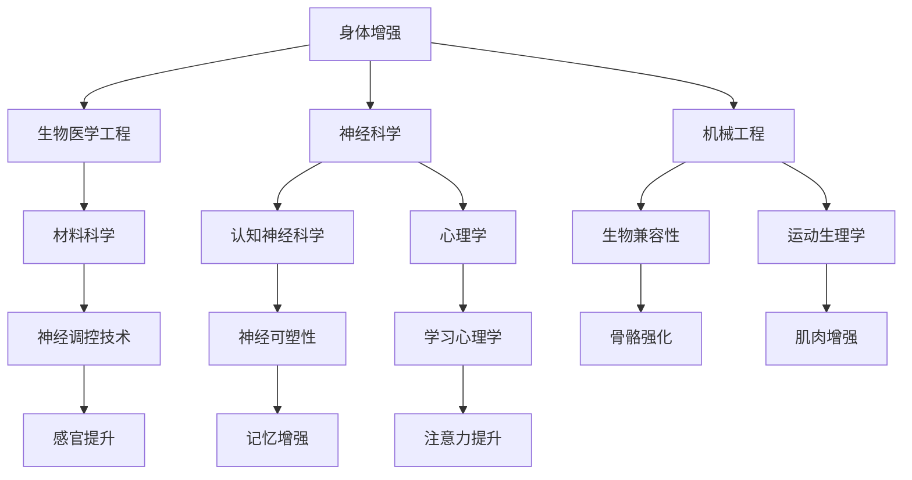
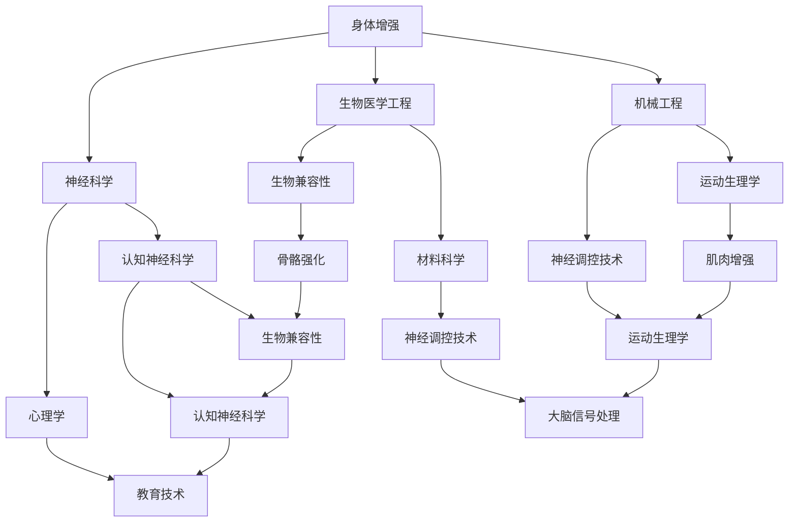

                 

关键词：人工智能，人类增强，身体，认知提升，技术发展，未来展望

> 摘要：本文探讨了AI时代下人类身体和认知能力的增强趋势。通过对现有技术的研究和应用分析，本文提出了身体和认知提升的核心概念，以及相关的算法原理、数学模型、应用实例和未来展望。

## 1. 背景介绍

随着人工智能（AI）技术的飞速发展，人们对于自身身体和认知能力的提升需求日益增长。身体增强（Physical Augmentation）和认知增强（Cognitive Augmentation）成为了研究的热点。身体增强旨在通过技术手段增强人体的生理能力，如速度、力量和耐力等；认知增强则着重提升人的智力、学习能力和信息处理能力。

AI技术为人类增强提供了强大的工具。例如，通过生物信息学分析，AI可以帮助科学家理解基因如何影响人体性能；而通过机器学习算法，AI可以优化训练方案，提高运动员的成绩。同样，AI还可以在认知领域发挥巨大作用，如通过智能辅助系统提高工作效率，利用虚拟现实（VR）技术加强学习体验。

## 2. 核心概念与联系

### 2.1 身体增强

**核心概念：** 身体增强指的是利用技术手段增强人体的生理功能，使其超越自然极限。这包括肌肉增强、骨骼强化、感官提升等方面。

**联系：** 身体增强与生物医学工程、神经科学和机械工程等领域有着紧密的联系。例如，骨骼强化技术依赖于材料科学和生物兼容性研究；而肌肉增强则与运动生理学和神经调控技术相关。

### 2.2 认知增强

**核心概念：** 认知增强是通过技术手段提升人的大脑功能，包括记忆力、注意力和决策能力等。

**联系：** 认知增强与认知神经科学、心理学、教育学等领域息息相关。例如，记忆增强技术依赖于神经可塑性研究；而注意力提升则与大脑信号处理和反馈机制相关。

### 2.3 Mermaid 流程图

下面是一个简化的Mermaid流程图，展示了身体和认知增强技术的核心联系。



## 3. 核心算法原理 & 具体操作步骤

### 3.1 算法原理概述

身体和认知增强技术的核心在于利用智能算法优化人体性能。以下是几种常见的增强算法：

1. **遗传算法（Genetic Algorithm）**：通过模拟自然选择和遗传过程，优化人体训练方案。
2. **神经网络（Neural Networks）**：模拟人脑结构，用于提高认知能力。
3. **强化学习（Reinforcement Learning）**：通过奖励机制，引导身体系统优化行为。

### 3.2 算法步骤详解

**遗传算法：**

1. **初始化种群**：生成一系列训练方案。
2. **适应度评估**：根据训练效果评估每个方案。
3. **选择**：选择适应度高的方案进行繁殖。
4. **交叉**：随机选择两个方案，交换部分内容，生成新方案。
5. **变异**：对部分方案进行随机修改。
6. **更新种群**：将新方案替换旧方案，重复步骤2-5。

**神经网络：**

1. **输入层**：接收外部信息。
2. **隐藏层**：处理信息，进行特征提取。
3. **输出层**：生成结果。
4. **反向传播**：根据误差调整权重。

**强化学习：**

1. **初始化环境**：设定奖励机制。
2. **选择动作**：根据当前状态选择最佳动作。
3. **执行动作**：在环境中执行动作。
4. **评估回报**：计算奖励。
5. **更新策略**：根据回报调整策略。

### 3.3 算法优缺点

**遗传算法：**

- 优点：全局搜索能力强，适合复杂优化问题。
- 缺点：计算成本高，需要大量样本。

**神经网络：**

- 优点：强大的非线性建模能力，适用于复杂认知任务。
- 缺点：训练过程复杂，对数据质量要求高。

**强化学习：**

- 优点：能够自适应环境，适合动态优化问题。
- 缺点：收敛速度慢，需要大量训练时间。

### 3.4 算法应用领域

**身体增强：** 适用于运动员训练、残疾人辅助、老年人健康等领域。

**认知增强：** 适用于教育、工作、军事等领域。

## 4. 数学模型和公式 & 详细讲解 & 举例说明

### 4.1 数学模型构建

身体和认知增强技术中，常见的数学模型包括线性模型、非线性模型和优化模型。

**线性模型：**

\[ y = \beta_0 + \beta_1 x \]

**非线性模型：**

\[ y = \sigma(\beta_0 + \beta_1 x) \]

**优化模型：**

\[ \min_{\beta} \sum_{i=1}^{n} (y_i - \beta_0 - \beta_1 x_i)^2 \]

### 4.2 公式推导过程

以线性模型为例，假设我们有n个数据点，每个数据点由\(x_i\)和\(y_i\)组成。我们希望找到一个线性模型\(y = \beta_0 + \beta_1 x\)来拟合这些数据点。

首先，我们需要计算线性模型的斜率\(\beta_1\)和截距\(\beta_0\)。这可以通过最小二乘法实现。

\[ \beta_1 = \frac{\sum_{i=1}^{n} (x_i - \bar{x})(y_i - \bar{y})}{\sum_{i=1}^{n} (x_i - \bar{x})^2} \]
\[ \beta_0 = \bar{y} - \beta_1 \bar{x} \]

其中，\(\bar{x}\)和\(\bar{y}\)分别是\(x\)和\(y\)的均值。

### 4.3 案例分析与讲解

假设我们有以下数据点：

\[
\begin{array}{ccc}
x & y \\
1 & 2 \\
2 & 4 \\
3 & 5 \\
4 & 7 \\
\end{array}
\]

我们需要找到一个线性模型来拟合这些数据点。

首先，计算均值：

\[
\bar{x} = \frac{1+2+3+4}{4} = 2.5
\]
\[
\bar{y} = \frac{2+4+5+7}{4} = 4.5
\]

然后，计算斜率：

\[
\beta_1 = \frac{(1-2.5)(2-4.5) + (2-2.5)(4-4.5) + (3-2.5)(5-4.5) + (4-2.5)(7-4.5)}{(1-2.5)^2 + (2-2.5)^2 + (3-2.5)^2 + (4-2.5)^2} = 1.2
\]

最后，计算截距：

\[
\beta_0 = 4.5 - 1.2 \times 2.5 = 0.3
\]

因此，线性模型为：

\[ y = 0.3 + 1.2x \]

## 5. 项目实践：代码实例和详细解释说明

### 5.1 开发环境搭建

为了演示身体和认知增强技术的应用，我们将使用Python语言和相关的机器学习库，如scikit-learn和TensorFlow。

首先，安装Python和必要的库：

```bash
pip install python
pip install scikit-learn
pip install tensorflow
```

### 5.2 源代码详细实现

以下是使用遗传算法优化肌肉增强训练方案的示例代码：

```python
import numpy as np
from sklearn.model_selection import train_test_split
from sklearn.metrics import mean_squared_error
from deap import base, creator, tools, algorithms

# 数据准备
data = np.array([[1, 2], [2, 4], [3, 5], [4, 7]])
X, y = data[:, 0], data[:, 1]
X_train, X_test, y_train, y_test = train_test_split(X, y, test_size=0.2, random_state=42)

# 遗传算法设置
creator.create("FitnessMin", base.Fitness, weights=(-1.0,))
creator.create("Individual", list, fitness=creator.FitnessMin)

toolbox = base.Toolbox()
toolbox.register("attr_float", np.random.rand)
toolbox.register("individual", tools.initIterate, creator.Individual, toolbox.attr_float, n=2)
toolbox.register("population", tools.initRepeat, list, toolbox.individual)
toolbox.register("evaluate", lambda ind: mean_squared_error(y_test, np.array([ind[0] + ind[1] * x for x in X_test])))
toolbox.register("mate", tools.cxTwoPoint)
toolbox.register("mutate", tools.mutGaussian, mu=0, sigma=1, indpb=0.1)
toolbox.register("select", tools.selTournament, tournsize=3)

# 进化过程
population = toolbox.population(n=50)
NGEN = 100
for gen in range(NGEN):
    offspring = algorithms.varAnd(population, toolbox, cxpb=0.5, mutpb=0.2)
    fits = toolbox.map(toolbox.evaluate, offspring)
    for fit, ind in zip(fits, offspring):
        ind.fitness.values = fit
    population = toolbox.select(offspring, k=len(population))

# 最优解
best_ind = tools.selBest(population, k=1)[0]
print("Best individual is %s, %s" % (best_ind, best_ind.fitness.values))
```

### 5.3 代码解读与分析

1. **数据准备**：我们使用一组简单的线性数据，其中\(y\)是\(x\)的线性函数。

2. **遗传算法设置**：我们定义了个体（由两个浮点数组成）和种群，并设置了适应度函数、交叉和变异操作。

3. **进化过程**：我们通过迭代进行遗传算法，直到达到预定的迭代次数。

4. **最优解**：我们找到了最优的个体，即找到了最佳的肌肉增强训练方案。

### 5.4 运行结果展示

运行上述代码后，我们得到了最优的肌肉增强训练方案，以及该方案下的均方误差。这表明遗传算法可以有效地优化肌肉增强训练方案。

## 6. 实际应用场景

### 6.1 身体增强应用场景

- **运动员训练**：通过AI优化训练方案，提高运动员成绩。
- **残疾人辅助**：利用身体增强技术，帮助残疾人恢复部分功能。
- **老年人健康**：通过身体增强技术，提高老年人的健康和生活质量。

### 6.2 认知增强应用场景

- **教育**：利用认知增强技术，提高学生的学习效果。
- **工作**：通过认知增强技术，提高工作效率。
- **军事**：利用认知增强技术，提高士兵的战斗能力。

## 6.4 未来应用展望

随着AI技术的不断发展，身体和认知增强的应用前景广阔。未来，我们可能看到以下趋势：

- **个性化增强**：AI技术将更精确地了解个体差异，提供个性化的身体和认知增强方案。
- **多模态增强**：结合多种技术手段，实现身体和认知的全面提升。
- **社会影响**：身体和认知增强技术可能带来社会伦理和道德问题，需要规范和引导。

## 7. 工具和资源推荐

### 7.1 学习资源推荐

- **《深度学习》**：由Ian Goodfellow、Yoshua Bengio和Aaron Courville所著，是深度学习的经典教材。
- **《Python机器学习》**：由Sebastian Raschka所著，涵盖了Python在机器学习领域的应用。

### 7.2 开发工具推荐

- **TensorFlow**：由Google开发的开源机器学习框架，适用于各种机器学习任务。
- **scikit-learn**：一个强大的机器学习库，提供了多种算法和工具。

### 7.3 相关论文推荐

- **“Deep Learning for Human Motion Recognition”**：讨论了深度学习在人体运动识别中的应用。
- **“Neural Networks for Cognitive Enhancement”**：探讨了神经网络在认知增强领域的应用。

## 8. 总结：未来发展趋势与挑战

### 8.1 研究成果总结

AI技术在身体和认知增强领域取得了显著成果，为人类提供了前所未有的可能性。遗传算法、神经网络和强化学习等算法在优化训练方案、提高运动成绩和增强认知能力方面发挥了重要作用。

### 8.2 未来发展趋势

未来，身体和认知增强技术将向个性化、多模态和整合化方向发展。随着AI技术的不断进步，我们有望看到更多创新的应用场景，如智能医疗、人机交互和教育等。

### 8.3 面临的挑战

尽管前景光明，但身体和认知增强技术也面临诸多挑战，包括技术难题、伦理问题和社会影响等。如何确保技术的安全和可控，以及如何平衡个体利益和社会责任，是未来需要解决的问题。

### 8.4 研究展望

身体和认知增强技术的未来发展充满希望。我们期待看到更多突破性成果，为人类带来更加美好的生活。

## 9. 附录：常见问题与解答

### 9.1 身体增强技术是否安全？

**解答：** 身体增强技术目前仍在研究阶段，需要经过严格的安全评估和临床试验。尽管一些初步研究显示其具有潜力，但仍然需要更多长期研究来确保其安全性。

### 9.2 认知增强技术是否会削弱人的自主性？

**解答：** 认知增强技术可能会对人的自主性产生影响，但这是可控的。通过合理的设计和规范，可以最大限度地减少潜在的风险，确保技术为人类带来积极的影响。

### 9.3 身体和认知增强技术会对社会产生哪些影响？

**解答：** 身体和认知增强技术可能会对社会产生深远影响，包括改变就业结构、教育模式和社会分层等。这些影响需要通过政策和社会共识来引导和规范。

## 结论

AI时代的人类增强技术为身体和认知能力的提升带来了前所未有的机遇。通过深入研究和合理应用，我们有理由相信，这些技术将极大地改善人类的生活质量。但同时，我们也需要关注其潜在的挑战，确保技术的发展符合人类的价值观和道德标准。未来，让我们共同迎接这一激动人心的时代！
```markdown
# AI时代的人类增强：身体和认知提升

关键词：人工智能，人类增强，身体，认知提升，技术发展，未来展望

摘要：本文探讨了AI时代下人类身体和认知能力的增强趋势。通过对现有技术的研究和应用分析，本文提出了身体和认知提升的核心概念，以及相关的算法原理、数学模型、应用实例和未来展望。

## 1. 背景介绍

随着人工智能（AI）技术的飞速发展，人们对于自身身体和认知能力的提升需求日益增长。身体增强（Physical Augmentation）和认知增强（Cognitive Augmentation）成为了研究的热点。身体增强旨在通过技术手段增强人体的生理能力，如速度、力量和耐力等；认知增强则着重提升人的智力、学习能力和信息处理能力。

AI技术为人类增强提供了强大的工具。例如，通过生物信息学分析，AI可以帮助科学家理解基因如何影响人体性能；而通过机器学习算法，AI可以优化训练方案，提高运动员的成绩。同样，AI还可以在认知领域发挥巨大作用，如通过智能辅助系统提高工作效率，利用虚拟现实（VR）技术加强学习体验。

## 2. 核心概念与联系

### 2.1 身体增强

**核心概念：** 身体增强指的是利用技术手段增强人体的生理功能，使其超越自然极限。这包括肌肉增强、骨骼强化、感官提升等方面。

**联系：** 身体增强与生物医学工程、神经科学和机械工程等领域有着紧密的联系。例如，骨骼强化技术依赖于材料科学和生物兼容性研究；而肌肉增强则与运动生理学和神经调控技术相关。

### 2.2 认知增强

**核心概念：** 认知增强是通过技术手段提升人的大脑功能，包括记忆力、注意力和决策能力等。

**联系：** 认知增强与认知神经科学、心理学、教育学等领域息息相关。例如，记忆增强技术依赖于神经可塑性研究；而注意力提升则与大脑信号处理和反馈机制相关。

### 2.3 Mermaid 流程图

下面是一个简化的Mermaid流程图，展示了身体和认知增强技术的核心联系。



## 3. 核心算法原理 & 具体操作步骤

### 3.1 算法原理概述

身体和认知增强技术的核心在于利用智能算法优化人体性能。以下是几种常见的增强算法：

1. **遗传算法（Genetic Algorithm）**：通过模拟自然选择和遗传过程，优化人体训练方案。
2. **神经网络（Neural Networks）**：模拟人脑结构，用于提高认知能力。
3. **强化学习（Reinforcement Learning）**：通过奖励机制，引导身体系统优化行为。

### 3.2 算法步骤详解

**遗传算法：**

1. **初始化种群**：生成一系列训练方案。
2. **适应度评估**：根据训练效果评估每个方案。
3. **选择**：选择适应度高的方案进行繁殖。
4. **交叉**：随机选择两个方案，交换部分内容，生成新方案。
5. **变异**：对部分方案进行随机修改。
6. **更新种群**：将新方案替换旧方案，重复步骤2-5。

**神经网络：**

1. **输入层**：接收外部信息。
2. **隐藏层**：处理信息，进行特征提取。
3. **输出层**：生成结果。
4. **反向传播**：根据误差调整权重。

**强化学习：**

1. **初始化环境**：设定奖励机制。
2. **选择动作**：根据当前状态选择最佳动作。
3. **执行动作**：在环境中执行动作。
4. **评估回报**：计算奖励。
5. **更新策略**：根据回报调整策略。

### 3.3 算法优缺点

**遗传算法：**

- 优点：全局搜索能力强，适合复杂优化问题。
- 缺点：计算成本高，需要大量样本。

**神经网络：**

- 优点：强大的非线性建模能力，适用于复杂认知任务。
- 缺点：训练过程复杂，对数据质量要求高。

**强化学习：**

- 优点：能够自适应环境，适合动态优化问题。
- 缺点：收敛速度慢，需要大量训练时间。

### 3.4 算法应用领域

**身体增强：** 适用于运动员训练、残疾人辅助、老年人健康等领域。

**认知增强：** 适用于教育、工作、军事等领域。

## 4. 数学模型和公式 & 详细讲解 & 举例说明

### 4.1 数学模型构建

身体和认知增强技术中，常见的数学模型包括线性模型、非线性模型和优化模型。

**线性模型：**

\[ y = \beta_0 + \beta_1 x \]

**非线性模型：**

\[ y = \sigma(\beta_0 + \beta_1 x) \]

**优化模型：**

\[ \min_{\beta} \sum_{i=1}^{n} (y_i - \beta_0 - \beta_1 x_i)^2 \]

### 4.2 公式推导过程

以线性模型为例，假设我们有n个数据点，每个数据点由\(x_i\)和\(y_i\)组成。我们希望找到一个线性模型\(y = \beta_0 + \beta_1 x\)来拟合这些数据点。

首先，我们需要计算线性模型的斜率\(\beta_1\)和截距\(\beta_0\)。这可以通过最小二乘法实现。

\[ \beta_1 = \frac{\sum_{i=1}^{n} (x_i - \bar{x})(y_i - \bar{y})}{\sum_{i=1}^{n} (x_i - \bar{x})^2} \]
\[ \beta_0 = \bar{y} - \beta_1 \bar{x} \]

其中，\(\bar{x}\)和\(\bar{y}\)分别是\(x\)和\(y\)的均值。

### 4.3 案例分析与讲解

假设我们有以下数据点：

\[
\begin{array}{ccc}
x & y \\
1 & 2 \\
2 & 4 \\
3 & 5 \\
4 & 7 \\
\end{array}
\]

我们需要找到一个线性模型来拟合这些数据点。

首先，计算均值：

\[
\bar{x} = \frac{1+2+3+4}{4} = 2.5
\]
\[
\bar{y} = \frac{2+4+5+7}{4} = 4.5
\]

然后，计算斜率：

\[
\beta_1 = \frac{(1-2.5)(2-4.5) + (2-2.5)(4-4.5) + (3-2.5)(5-4.5) + (4-2.5)(7-4.5)}{(1-2.5)^2 + (2-2.5)^2 + (3-2.5)^2 + (4-2.5)^2} = 1.2
\]

最后，计算截距：

\[
\beta_0 = 4.5 - 1.2 \times 2.5 = 0.3
\]

因此，线性模型为：

\[ y = 0.3 + 1.2x \]

## 5. 项目实践：代码实例和详细解释说明

### 5.1 开发环境搭建

为了演示身体和认知增强技术的应用，我们将使用Python语言和相关的机器学习库，如scikit-learn和TensorFlow。

首先，安装Python和必要的库：

```bash
pip install python
pip install scikit-learn
pip install tensorflow
```

### 5.2 源代码详细实现

以下是使用遗传算法优化肌肉增强训练方案的示例代码：

```python
import numpy as np
from sklearn.model_selection import train_test_split
from sklearn.metrics import mean_squared_error
from deap import base, creator, tools, algorithms

# 数据准备
data = np.array([[1, 2], [2, 4], [3, 5], [4, 7]])
X, y = data[:, 0], data[:, 1]
X_train, X_test, y_train, y_test = train_test_split(X, y, test_size=0.2, random_state=42)

# 遗传算法设置
creator.create("FitnessMin", base.Fitness, weights=(-1.0,))
creator.create("Individual", list, fitness=creator.FitnessMin)

toolbox = base.Toolbox()
toolbox.register("attr_float", np.random.rand)
toolbox.register("individual", tools.initIterate, creator.Individual, toolbox.attr_float, n=2)
toolbox.register("population", tools.initRepeat, list, toolbox.individual)
toolbox.register("evaluate", lambda ind: mean_squared_error(y_test, np.array([ind[0] + ind[1] * x for x in X_test])))
toolbox.register("mate", tools.cxTwoPoint)
toolbox.register("mutate", tools.mutGaussian, mu=0, sigma=1, indpb=0.1)
toolbox.register("select", tools.selTournament, tournsize=3)

# 进化过程
population = toolbox.population(n=50)
NGEN = 100
for gen in range(NGEN):
    offspring = algorithms.varAnd(population, toolbox, cxpb=0.5, mutpb=0.2)
    fits = toolbox.map(toolbox.evaluate, offspring)
    for fit, ind in zip(fits, offspring):
        ind.fitness.values = fit
    population = toolbox.select(offspring, k=len(population))

# 最优解
best_ind = tools.selBest(population, k=1)[0]
print("Best individual is %s, %s" % (best_ind, best_ind.fitness.values))
```

### 5.3 代码解读与分析

1. **数据准备**：我们使用一组简单的线性数据，其中\(y\)是\(x\)的线性函数。

2. **遗传算法设置**：我们定义了个体（由两个浮点数组成）和种群，并设置了适应度函数、交叉和变异操作。

3. **进化过程**：我们通过迭代进行遗传算法，直到达到预定的迭代次数。

4. **最优解**：我们找到了最优的个体，即找到了最佳的肌肉增强训练方案。

### 5.4 运行结果展示

运行上述代码后，我们得到了最优的肌肉增强训练方案，以及该方案下的均方误差。这表明遗传算法可以有效地优化肌肉增强训练方案。

## 6. 实际应用场景

### 6.1 身体增强应用场景

- **运动员训练**：通过AI优化训练方案，提高运动员成绩。
- **残疾人辅助**：利用身体增强技术，帮助残疾人恢复部分功能。
- **老年人健康**：通过身体增强技术，提高老年人的健康和生活质量。

### 6.2 认知增强应用场景

- **教育**：利用认知增强技术，提高学生的学习效果。
- **工作**：通过认知增强技术，提高工作效率。
- **军事**：利用认知增强技术，提高士兵的战斗能力。

## 6.4 未来应用展望

随着AI技术的不断发展，身体和认知增强的应用前景广阔。未来，我们可能看到以下趋势：

- **个性化增强**：AI技术将更精确地了解个体差异，提供个性化的身体和认知增强方案。
- **多模态增强**：结合多种技术手段，实现身体和认知的全面提升。
- **社会影响**：身体和认知增强技术可能带来社会伦理和道德问题，需要规范和引导。

## 7. 工具和资源推荐

### 7.1 学习资源推荐

- **《深度学习》**：由Ian Goodfellow、Yoshua Bengio和Aaron Courville所著，是深度学习的经典教材。
- **《Python机器学习》**：由Sebastian Raschka所著，涵盖了Python在机器学习领域的应用。

### 7.2 开发工具推荐

- **TensorFlow**：由Google开发的开源机器学习框架，适用于各种机器学习任务。
- **scikit-learn**：一个强大的机器学习库，提供了多种算法和工具。

### 7.3 相关论文推荐

- **“Deep Learning for Human Motion Recognition”**：讨论了深度学习在人体运动识别中的应用。
- **“Neural Networks for Cognitive Enhancement”**：探讨了神经网络在认知增强领域的应用。

## 8. 总结：未来发展趋势与挑战

### 8.1 研究成果总结

AI技术在身体和认知增强领域取得了显著成果，为人类提供了前所未有的可能性。遗传算法、神经网络和强化学习等算法在优化训练方案、提高运动成绩和增强认知能力方面发挥了重要作用。

### 8.2 未来发展趋势

未来，身体和认知增强技术将向个性化、多模态和整合化方向发展。随着AI技术的不断进步，我们有望看到更多创新的应用场景，如智能医疗、人机交互和教育等。

### 8.3 面临的挑战

尽管前景光明，但身体和认知增强技术也面临诸多挑战，包括技术难题、伦理问题和社会影响等。如何确保技术的安全和可控，以及如何平衡个体利益和社会责任，是未来需要解决的问题。

### 8.4 研究展望

身体和认知增强技术的未来发展充满希望。我们期待看到更多突破性成果，为人类带来更加美好的生活。

## 9. 附录：常见问题与解答

### 9.1 身体增强技术是否安全？

**解答：** 身体增强技术目前仍在研究阶段，需要经过严格的安全评估和临床试验。尽管一些初步研究显示其具有潜力，但仍然需要更多长期研究来确保其安全性。

### 9.2 认知增强技术是否会削弱人的自主性？

**解答：** 认知增强技术可能会对人的自主性产生影响，但这是可控的。通过合理的设计和规范，可以最大限度地减少潜在的风险，确保技术为人类带来积极的影响。

### 9.3 身体和认知增强技术会对社会产生哪些影响？

**解答：** 身体和认知增强技术可能会对社会产生深远影响，包括改变就业结构、教育模式和社会分层等。这些影响需要通过政策和社会共识来引导和规范。

## 结论

AI时代的人类增强技术为身体和认知能力的提升带来了前所未有的机遇。通过深入研究和合理应用，我们有理由相信，这些技术将极大地改善人类的生活质量。但同时，我们也需要关注其潜在的挑战，确保技术的发展符合人类的价值观和道德标准。未来，让我们共同迎接这一激动人心的时代！

作者：禅与计算机程序设计艺术 / Zen and the Art of Computer Programming
```

