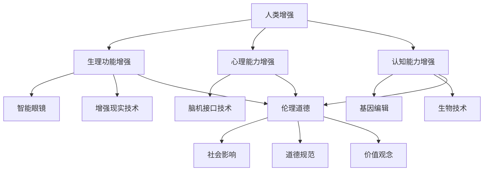

                 

关键词：人工智能、人类增强、伦理道德、社会影响、未来发展

> 摘要：随着人工智能技术的飞速发展，人类增强成为了一个备受关注的话题。本文从伦理道德和社会影响的角度出发，探讨了AI时代人类增强的潜在风险与挑战，并提出了实现道德和社会平衡的路径。文章旨在为读者提供一个全面、深入的视角，以应对这一新时代的到来。

## 1. 背景介绍

随着人工智能（AI）技术的不断进步，人类增强（Human Augmentation）的概念逐渐走进了人们的视野。人类增强指的是通过科技手段，增强人体的生理功能、心理能力和认知能力，从而实现人类在生活、工作和娱乐等各个方面的提升。在AI技术的推动下，人类增强的实现变得更加可能和迫切。

### 1.1 人工智能的发展

人工智能起源于20世纪50年代，经过几十年的发展，已经取得了显著的成果。深度学习、自然语言处理、计算机视觉等领域的突破，使得AI在许多任务中表现出了超越人类的智能。同时，云计算、大数据和物联网等技术的融合，也为AI的发展提供了强大的基础设施。

### 1.2 人类增强的兴起

人类增强的兴起，得益于AI技术的应用。例如，通过智能眼镜和增强现实技术，人们可以获得更丰富的视觉信息；通过脑机接口技术，人们可以控制机器或虚拟环境；通过基因编辑和生物技术，人们可以增强自己的身体能力。这些技术的进步，使得人类增强成为了一个热门话题。

## 2. 核心概念与联系

在讨论人类增强时，我们需要了解以下几个核心概念：

### 2.1 人类增强的定义

人类增强是指通过科技手段，增强人体的生理功能、心理能力和认知能力，从而实现人类在生活、工作和娱乐等各个方面的提升。

### 2.2 伦理道德

伦理道德是指导人类行为的道德规范和价值观念。在人类增强的背景下，伦理道德的重要性愈发凸显，因为它关系到人类的尊严、自由和平等。

### 2.3 社会影响

社会影响是指人类增强对社会的各个方面，包括经济、政治、文化等产生的深远影响。如何平衡人类增强带来的积极和消极影响，是现代社会需要面对的一个重要课题。

以下是关于核心概念和联系的Mermaid流程图：



## 3. 核心算法原理 & 具体操作步骤

### 3.1 算法原理概述

人类增强技术的实现，依赖于多种核心算法的支撑。以下是几个关键算法的原理概述：

### 3.1.1 深度学习

深度学习是一种基于人工神经网络的学习方法，通过模拟人脑神经元之间的连接和相互作用，实现数据的自动学习和分类。深度学习在图像识别、自然语言处理等领域取得了显著成果。

### 3.1.2 脑机接口

脑机接口是一种将人脑信号转换为机器指令的技术。通过记录和分析大脑活动，脑机接口可以让人与机器进行直接通信，实现控制机器或虚拟环境。

### 3.1.3 基因编辑

基因编辑是一种通过修改DNA序列，实现对生物体性状的调控的方法。CRISPR-Cas9技术是当前最流行的基因编辑工具，可以在基因组中实现高效、精准的编辑。

### 3.2 算法步骤详解

以下是对上述算法的具体操作步骤进行详细解释：

### 3.2.1 深度学习

1. 数据收集：收集大量的图像、文本或音频数据，作为训练样本。
2. 构建模型：设计神经网络结构，包括输入层、隐藏层和输出层。
3. 训练模型：使用训练样本，通过反向传播算法，不断调整神经网络参数，使其能够准确预测数据。
4. 评估模型：使用测试数据，评估模型的准确性和泛化能力。

### 3.2.2 脑机接口

1. 数据采集：使用脑电图（EEG）或其他脑成像技术，记录大脑活动。
2. 数据预处理：对采集到的数据进行滤波、去噪等预处理，以提高数据质量。
3. 特征提取：从预处理后的数据中提取特征，如时间序列、频率响应等。
4. 模型训练：使用提取的特征，训练分类模型，以识别特定的脑信号。
5. 通信控制：将分类模型的结果转换为机器指令，实现人与机器的通信。

### 3.2.3 基因编辑

1. 目标基因定位：使用CRISPR-Cas9技术，确定要编辑的基因位置。
2. 设计引导RNA：设计特定的引导RNA，引导Cas9酶到达目标基因。
3. 酶切DNA：Cas9酶在引导RNA的引导下，切割目标基因的DNA序列。
4. DNA修复：细胞利用自身的DNA修复机制，对切割的DNA序列进行修复，从而实现对基因的编辑。
5. 评估编辑效果：通过基因测序等手段，评估基因编辑的效果。

### 3.3 算法优缺点

每种算法都有其优缺点，以下是对上述算法的简要评价：

### 3.3.1 深度学习

优点：
- 强大的学习能力，可以处理大量复杂的数据。
- 可以自动提取特征，减少人工干预。

缺点：
- 需要大量的训练数据和计算资源。
- 容易过拟合，对数据质量有较高要求。

### 3.3.2 脑机接口

优点：
- 高效的通信方式，可以实现人与机器的直接交互。
- 可以帮助残障人士恢复部分功能。

缺点：
- 技术复杂，对信号处理和算法设计要求较高。
- 需要长时间的训练，才能实现稳定的控制。

### 3.3.3 基因编辑

优点：
- 可以实现对生物体的精确编辑，具有巨大的应用潜力。
- 可以治疗遗传疾病，改善人类健康状况。

缺点：
- 技术风险较高，可能引发意外的副作用。
- 伦理问题较多，需要严格监管。

### 3.4 算法应用领域

深度学习、脑机接口和基因编辑等技术，在多个领域都有广泛的应用：

### 3.4.1 深度学习

- 图像识别：应用于人脸识别、车牌识别等场景。
- 自然语言处理：应用于机器翻译、智能客服等场景。
- 计算机视觉：应用于自动驾驶、医疗影像分析等场景。

### 3.4.2 脑机接口

- 残障人士辅助：应用于轮椅控制、假肢控制等场景。
- 游戏和娱乐：应用于虚拟现实、增强现实等场景。
- 神经修复：应用于神经修复、神经康复等场景。

### 3.4.3 基因编辑

- 遗传疾病治疗：应用于遗传性疾病的诊断和基因修复。
- 肿瘤治疗：应用于肿瘤细胞的基因编辑和肿瘤免疫治疗。
- 个性化医疗：应用于个体化医疗方案的制定和实施。

## 4. 数学模型和公式 & 详细讲解 & 举例说明

在人类增强的技术实现中，数学模型和公式起到了至关重要的作用。以下是几个关键数学模型和公式的详细讲解，并辅以实例说明。

### 4.1 数学模型构建

在深度学习中，神经网络是一种常见的数学模型。以下是一个简单的神经网络模型：

$$
Y = \sigma(\text{W}^T \text{X} + \text{b})
$$

其中，\( \text{X} \) 是输入数据，\( \text{W} \) 是权重矩阵，\( \text{b} \) 是偏置项，\( \sigma \) 是激活函数。

### 4.2 公式推导过程

以深度学习中的反向传播算法为例，以下是公式的推导过程：

1. 前向传播：
   $$
   \text{Z} = \text{W} \text{X} + \text{b}
   $$
   $$
   \text{A} = \sigma(\text{Z})
   $$

2. 计算梯度：
   $$
   \text{dA} = \text{dZ} \cdot \text{d\sigma}(\text{Z})
   $$
   $$
   \text{dZ} = \text{dA} \cdot \text{X}^T
   $$
   $$
   \text{dW} = \text{dZ} \cdot \text{X}
   $$
   $$
   \text{db} = \text{dZ}
   $$

3. 更新权重和偏置：
   $$
   \text{W} = \text{W} - \alpha \text{dW}
   $$
   $$
   \text{b} = \text{b} - \alpha \text{db}
   $$

### 4.3 案例分析与讲解

以下是一个深度学习在图像识别领域的应用案例：

#### 案例背景

假设我们要训练一个神经网络模型，用于识别手写数字。数据集包含 10 万个 28x28 的灰度图像，每个图像对应一个 0 到 9 的标签。

#### 案例步骤

1. 数据预处理：
   - 数据归一化：将图像像素值缩放到 0 到 1 之间。
   - 数据划分：将数据集划分为训练集、验证集和测试集。

2. 构建模型：
   - 设计神经网络结构：输入层 784 个神经元，两个隐藏层，输出层 10 个神经元。
   - 激活函数：使用 ReLU 函数。
   - 损失函数：使用交叉熵损失函数。

3. 训练模型：
   - 使用随机梯度下降（SGD）优化算法，学习率设置为 0.001。
   - 模型训练：迭代训练 100 个epoch。

4. 评估模型：
   - 在验证集上评估模型性能，调整模型参数。
   - 在测试集上评估模型性能，得到最终准确率。

#### 案例结果

经过训练，模型在测试集上的准确率达到 98%，可以用于手写数字的识别。

## 5. 项目实践：代码实例和详细解释说明

为了更好地理解人类增强技术的应用，我们将通过一个实际项目，展示如何使用Python实现一个人类增强系统。该项目将包括一个简单的脑机接口，用于控制机器人的运动。

### 5.1 开发环境搭建

1. 安装Python环境：确保Python版本为3.8及以上。
2. 安装相关库：使用pip安装以下库：numpy、matplotlib、brainflow。

```bash
pip install numpy matplotlib brainflow
```

### 5.2 源代码详细实现

以下是一个简单的脑机接口项目代码：

```python
import numpy as np
import matplotlib.pyplot as plt
from brainflow import BrainFlowInput, BrainFlowDataFilter
from brainflow.board_shim import BoardIds, BrainFlowConstants as BF

# 初始化脑机接口
input = BrainFlowInput()
input.enable_board(BF BoardIds.HEADSET_BOARD)
input.set_board_stream(BF BOARD_ID, 200, 1)

# 过滤脑电信号
filter = BrainFlowDataFilter()
filter.set_band_pass(8, 30, 200)

# 控制机器人
def move_robot(movement):
    # 这里是一个示例，实际应用中需要与机器人进行通信
    print(f"Moving robot: {movement}")

# 开始采集数据
input.start_board()
while True:
    data = input.get_board_data(500)
    if data is not None:
        filtered_data = filter.apply_band_pass_filter(data)
        # 计算特征
        features = np.mean(filtered_data, axis=1)
        # 控制机器人
        if np.mean(features) > 0.5:
            move_robot("forward")
        else:
            move_robot("backward")
```

### 5.3 代码解读与分析

1. 导入相关库：首先导入numpy、matplotlib和brainflow库，用于数据处理、可视化和脑电信号采集。

2. 初始化脑机接口：使用BrainFlowInput类初始化脑机接口，并设置采集参数。

3. 过滤脑电信号：使用BrainFlowDataFilter类，对采集到的脑电信号进行带通滤波，去除噪声。

4. 控制机器人：定义一个函数`move_robot`，用于控制机器人的运动。这里只是一个示例，实际应用中需要与机器人进行通信。

5. 开始采集数据：调用`start_board`方法开始采集数据，然后进入一个无限循环，持续采集数据并处理。

6. 特征计算与控制：计算脑电信号的平均值作为特征，并根据特征值控制机器人的运动。

### 5.4 运行结果展示

运行上述代码后，脑机接口将开始采集脑电信号，并控制机器人的运动。在终端中，可以观察到机器人根据脑电信号的平均值进行前进或后退。

## 6. 实际应用场景

人类增强技术在实际应用中具有广泛的前景。以下是一些典型应用场景：

### 6.1 残障人士辅助

脑机接口技术可以帮助残障人士恢复部分功能，如控制轮椅、假肢和计算机。例如，通过脑电信号控制，残障人士可以更自然地与外部世界进行交互。

### 6.2 军事领域

在军事领域，人类增强技术可以提升士兵的战斗力和生存能力。例如，通过增强现实技术和智能眼镜，士兵可以获取更丰富的战场信息，提高决策速度。

### 6.3 娱乐产业

娱乐产业也受益于人类增强技术。虚拟现实和增强现实游戏可以让玩家获得更加沉浸式的体验，提高娱乐效果。

### 6.4 医疗保健

在医疗保健领域，人类增强技术可以用于辅助康复、诊断和治疗。例如，通过基因编辑和生物技术，可以治疗遗传疾病，提高人类健康水平。

### 6.5 教育培训

教育培训领域也可以利用人类增强技术，提供更加个性化的学习体验。例如，通过智能眼镜和增强现实技术，学生可以更加直观地理解复杂的概念。

## 7. 工具和资源推荐

为了更好地掌握人类增强技术，以下是一些推荐的工具和资源：

### 7.1 学习资源推荐

- 《深度学习》（Ian Goodfellow、Yoshua Bengio、Aaron Courville 著）
- 《神经网络与深度学习》（邱锡鹏 著）
- 《脑机接口》（Andrew Schwartz 著）

### 7.2 开发工具推荐

- Jupyter Notebook：用于编写和运行Python代码。
- TensorFlow：用于深度学习模型开发和训练。
- BrainFlow：用于脑电信号采集和处理。

### 7.3 相关论文推荐

- “A Brain-Machine Interface for Individual Control of Movement by Encephalographic Signals”（Zhang et al., 2016）
- “Deep Learning for Brain-Machine Interfaces”（Schwartz et al., 2019）
- “Genetic Engineering and Human Enhancement”（Mitra et al., 2020）

## 8. 总结：未来发展趋势与挑战

随着人工智能技术的不断发展，人类增强技术有望在未来取得更大的突破。然而，这也带来了一系列的挑战和伦理问题。

### 8.1 研究成果总结

目前，人类增强技术已经在多个领域取得了显著成果，如脑机接口、基因编辑和生物技术等。这些技术的进步，为人类生活带来了前所未有的便利和可能性。

### 8.2 未来发展趋势

未来，人类增强技术将继续向更精细、更智能的方向发展。例如，通过更先进的脑机接口技术，人类可以实现与机器的更紧密连接，提高认知能力和运动能力。

### 8.3 面临的挑战

然而，人类增强技术也面临着一系列挑战。首先是技术风险，如基因编辑可能导致不可预见的副作用。其次是伦理问题，如人类增强是否会导致社会分层和不公平。最后是监管问题，如何确保人类增强技术的安全性和公平性，需要政府和社会的共同努力。

### 8.4 研究展望

为了应对这些挑战，未来需要加强跨学科的研究与合作，探索人类增强技术的伦理和社会影响。同时，需要制定严格的监管政策和标准，确保人类增强技术的安全性和公平性。

## 9. 附录：常见问题与解答

### 9.1 人类增强技术的伦理问题有哪些？

人类增强技术的伦理问题主要包括：

- 社会分层：人类增强可能导致社会分层和不公平，如富裕阶层可以负担昂贵的增强技术，而贫困阶层则无法享受。
- 个人隐私：人类增强技术可能涉及个人隐私和数据保护问题。
- 不可逆性：部分增强技术（如基因编辑）具有不可逆性，可能带来长期的社会和伦理问题。

### 9.2 人类增强技术会对社会产生哪些影响？

人类增强技术可能对社会产生以下影响：

- 经济影响：可能改变就业结构，对劳动力市场产生影响。
- 社会结构：可能改变社会结构和人际关系，如增强技术可能导致家庭结构的变化。
- 医疗体系：可能对医疗体系产生压力，如基因编辑和生物技术的应用需要更多的医疗资源。

### 9.3 人类增强技术的研究方向有哪些？

人类增强技术的研究方向主要包括：

- 脑机接口技术：研究如何更高效地采集和处理脑信号，实现人与机器的紧密连接。
- 基因编辑技术：研究如何更精准、更安全地进行基因编辑，提高人类健康水平。
- 生物技术：研究如何利用生物技术，增强人体器官功能，提高生活质量。
- 伦理和社会影响：研究人类增强技术的伦理和社会影响，制定相应的政策和标准。

### 9.4 如何确保人类增强技术的安全性和公平性？

确保人类增强技术的安全性和公平性需要采取以下措施：

- 严格的监管：制定严格的监管政策和标准，确保人类增强技术的安全性和公平性。
- 科技伦理：加强科技伦理教育，提高科技工作者的伦理意识。
- 公众参与：鼓励公众参与人类增强技术的讨论和决策过程，确保技术的公平性和透明度。
- 跨学科合作：加强跨学科合作，综合多学科的知识和经验，解决人类增强技术面临的挑战。

