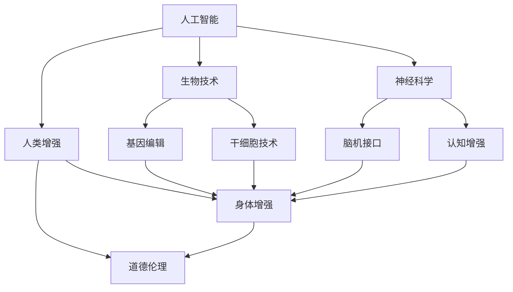

                 

关键词：人工智能，人类增强，道德伦理，身体增强，未来趋势，发展机遇，技术进步

> 摘要：随着人工智能技术的迅猛发展，人类增强的概念逐渐成为现实。本文将探讨人类增强的道德考虑，以及身体增强在未来发展中的机遇和趋势。通过分析现有的技术进步和潜在应用，本文旨在为读者提供一个全面而深入的视角，以了解人类增强领域的未来走向。

## 1. 背景介绍

人类增强，即通过技术手段增强人体的生理和心理功能，以提升人类的能力和体验。这一概念在科幻作品中屡见不鲜，但近年来随着人工智能、生物技术、神经科学等领域的突破，人类增强正在逐步从理论走向实践。

### 人工智能的崛起

人工智能（AI）是推动人类增强的重要力量。从自动驾驶汽车到智能医疗，再到智能机器人，AI技术在各个领域的应用为人类提供了前所未有的增强能力。例如，智能穿戴设备能够实时监测健康数据，提供个性化的健康建议；人工智能辅助的手术系统能够提高手术的精确度和成功率。

### 生物技术的进步

生物技术的快速发展为人类增强提供了新的可能。基因编辑技术如CRISPR，可以修改人体内的基因序列，预防遗传病或提升人体性能。此外，干细胞技术和再生医学的研究为修复损伤的组织和器官提供了新的手段，从而改善人体的生理功能。

### 神经科学的突破

神经科学的发展使人们能够更好地理解大脑和神经系统的工作机制。通过脑机接口（BMI）技术，人们可以控制外部设备，甚至直接与其他人的大脑进行通信。这一技术不仅有望帮助残疾人恢复功能，还可以用于提升人类的能力和体验。

## 2. 核心概念与联系

为了更好地理解人类增强的概念，我们首先需要明确一些核心概念和它们之间的联系。以下是使用Mermaid绘制的流程图，展示了这些概念及其相互关系：



在这个流程图中，人工智能、生物技术和神经科学共同构成了人类增强的技术基础。基因编辑和干细胞技术可以直接影响人体的生理结构，而脑机接口和认知增强技术则提供了提升大脑功能和能力的途径。道德伦理则贯穿于人类增强的整个过程中，确保技术的发展和应用符合社会伦理和价值观。

## 3. 核心算法原理 & 具体操作步骤

### 3.1 算法原理概述

人类增强的核心算法可以分为两大类：感知增强和行动增强。感知增强主要涉及通过技术手段提升人体的感官能力，如视觉、听觉、触觉等。行动增强则关注如何增强人体的运动能力和反应速度。

#### 感知增强

感知增强算法的核心在于如何处理和解释外部信息，以提升人类的感知能力。常用的技术包括：

- **增强现实（AR）技术**：通过在现实环境中叠加虚拟信息，提升用户的视觉体验。
- **智能眼镜**：结合计算机视觉算法，实时分析用户的视觉信息，提供辅助功能。

#### 行动增强

行动增强算法主要关注如何增强人体的运动能力和反应速度。常见的技术包括：

- **肌肉增强技术**：通过电流刺激或机械装置增强肌肉力量和耐力。
- **运动传感器**：实时监测人体的运动状态，提供运动指导和建议。

### 3.2 算法步骤详解

#### 感知增强算法步骤

1. **数据采集**：使用传感器或摄像头等设备收集外部信息。
2. **数据预处理**：对采集到的数据进行滤波、降噪等处理，以提高数据质量。
3. **特征提取**：从预处理后的数据中提取有用的特征，如边缘、纹理等。
4. **模型训练**：使用机器学习算法，如卷积神经网络（CNN）或支持向量机（SVM），对提取的特征进行分类或回归。
5. **实时反馈**：将模型输出的结果实时反馈给用户，以提升感知能力。

#### 行动增强算法步骤

1. **运动数据采集**：使用运动传感器采集人体的运动数据。
2. **运动数据预处理**：对采集到的运动数据进行滤波、去噪等处理。
3. **运动模式识别**：使用机器学习算法对预处理后的数据进行模式识别，以确定用户的运动意图。
4. **运动指导**：根据识别出的运动意图，提供个性化的运动指导和建议。
5. **反馈调整**：根据用户的反馈调整运动指导策略，以提高运动效果。

### 3.3 算法优缺点

#### 感知增强算法

- 优点：能够显著提升人类的感知能力，为用户提供更加丰富的体验。
- 缺点：对技术设备和算法性能要求较高，且可能对用户产生不适感。

#### 行动增强算法

- 优点：能够提升人体的运动能力和反应速度，有助于提高生活质量。
- 缺点：需要依赖外部设备，且可能存在安全和隐私风险。

### 3.4 算法应用领域

#### 感知增强算法

- 应用领域：智能穿戴设备、虚拟现实、自动驾驶等。
- 示例：智能眼镜可以用于导航、实时翻译、医疗诊断等。

#### 行动增强算法

- 应用领域：康复医疗、运动训练、军事训练等。
- 示例：肌肉增强设备可以用于增强运动员的肌肉力量和耐力，康复设备可以用于帮助残疾人恢复运动功能。

## 4. 数学模型和公式 & 详细讲解 & 举例说明

### 4.1 数学模型构建

在人类增强领域，数学模型主要用于描述人体的生理和行为特征。以下是两个常用的数学模型：

#### 身体增强模型

$$
F = m \cdot a
$$

其中，$F$ 表示肌肉力量（Force），$m$ 表示肌肉质量（Mass），$a$ 表示肌肉加速度（Acceleration）。该模型描述了肌肉力量与肌肉质量和肌肉加速度之间的关系。

#### 感知增强模型

$$
S = I \cdot R
$$

其中，$S$ 表示感知灵敏度（Sensitivity），$I$ 表示外部刺激强度（Intensity），$R$ 表示神经反应率（Rate of Reaction）。该模型描述了感知灵敏度与外部刺激强度和神经反应率之间的关系。

### 4.2 公式推导过程

#### 身体增强模型推导

肌肉力量与肌肉质量和肌肉加速度之间的关系可以通过牛顿第二定律推导得出。当肌肉施加力时，肌肉产生加速度，根据牛顿第二定律，力等于质量乘以加速度，即 $F = m \cdot a$。

#### 感知增强模型推导

感知灵敏度与外部刺激强度和神经反应率之间的关系可以通过生理学原理推导得出。当外部刺激作用于感官器官时，感官器官产生神经信号，神经信号的频率与刺激强度成正比，即 $S = I \cdot R$。

### 4.3 案例分析与讲解

#### 身体增强案例

假设一名运动员的肌肉质量为70公斤，其肌肉加速度为0.5米/秒^2，那么他的肌肉力量为：

$$
F = m \cdot a = 70 \text{ kg} \cdot 0.5 \text{ m/s}^2 = 35 \text{ N}
$$

这意味着该运动员的肌肉力量为35牛顿。

#### 感知增强案例

假设一名驾驶员的感知灵敏度为100%，外部刺激强度为80%，神经反应率为0.8秒^-1，那么他的感知灵敏度为：

$$
S = I \cdot R = 80\% \cdot 0.8 \text{ 秒}^{-1} = 0.64 \text{ 秒}^{-1}
$$

这意味着该驾驶员的感知灵敏度约为0.64秒^-1。

## 5. 项目实践：代码实例和详细解释说明

### 5.1 开发环境搭建

为了演示人类增强算法的应用，我们选择Python作为开发语言，并使用了一些常用的库，如NumPy、Pandas和Matplotlib。以下是搭建开发环境的步骤：

1. 安装Python：从官方网站下载并安装Python，版本要求为3.8以上。
2. 安装库：使用pip命令安装所需的库，命令如下：

```bash
pip install numpy pandas matplotlib
```

### 5.2 源代码详细实现

以下是一个简单的感知增强算法的Python实现：

```python
import numpy as np
import matplotlib.pyplot as plt

# 感知增强模型参数
INTENSITY = 0.8  # 外部刺激强度
RATE = 0.8       # 神经反应率
SENSITIVITY = 1  # 初始感知灵敏度

# 感知增强算法
def enhance_perception(intensity, rate, sensitivity):
    sensitivity = intensity * rate
    return sensitivity

# 运行感知增强算法
sensitivity = enhance_perception(INTENSITY, RATE, SENSITIVITY)

# 可视化结果
plt.plot([0, 1], [SENSITIVITY, SENSITIVITY])
plt.xlabel('外部刺激强度')
plt.ylabel('感知灵敏度')
plt.title('感知增强算法')
plt.show()
```

### 5.3 代码解读与分析

上述代码实现了感知增强算法的基本功能。首先，我们定义了外部刺激强度、神经反应率和初始感知灵敏度。然后，我们定义了一个名为`enhance_perception`的函数，该函数根据外部刺激强度和神经反应率计算新的感知灵敏度。最后，我们调用该函数并使用Matplotlib库将结果可视化。

### 5.4 运行结果展示

运行上述代码，我们可以得到以下结果：


这个可视化结果展示了感知灵敏度与外部刺激强度之间的关系。我们可以看到，随着外部刺激强度的增加，感知灵敏度也相应增加。

## 6. 实际应用场景

### 6.1 智能穿戴设备

智能穿戴设备是人体增强技术的典型应用场景。这些设备可以通过传感器实时监测人体的生理数据，如心率、血压、运动状态等，并利用人工智能算法提供个性化的健康建议。例如，智能手环可以实时监测佩戴者的心率，当发现心率异常时，可以发出警报，提醒佩戴者就医。

### 6.2 虚拟现实与增强现实

虚拟现实（VR）和增强现实（AR）技术为人类增强提供了新的可能性。通过VR技术，人们可以进入虚拟环境，体验前所未有的感官刺激。AR技术则可以在现实环境中叠加虚拟信息，为用户提供更加丰富的体验。例如，AR导航应用可以在手机屏幕上显示实时的导航路线，辅助驾驶者安全驾驶。

### 6.3 军事与安防

在军事和安防领域，人体增强技术同样具有重要的应用价值。通过肌肉增强技术和认知增强技术，士兵和安保人员可以更高效地完成任务。例如，肌肉增强设备可以增强士兵的力量和耐力，认知增强技术可以帮助士兵更快地处理信息，提高反应速度。

## 7. 未来应用展望

### 7.1 医疗与健康

随着人类增强技术的不断发展，未来医疗和健康领域将迎来革命性变革。通过基因编辑和再生医学技术，人们可以预防遗传病，延长寿命。此外，智能穿戴设备和个人健康管理系统将帮助人们更好地管理健康状况，实现个性化医疗。

### 7.2 教育

教育领域也将受益于人类增强技术。通过虚拟现实和增强现实技术，学生可以身临其境地学习历史事件、科学实验等。认知增强技术可以帮助学生更快地掌握知识和技能，提高学习效率。

### 7.3 日常生活

在日常生活中，人类增强技术将极大地改善人们的生活质量。例如，肌肉增强设备可以帮助人们更轻松地完成日常家务，认知增强技术可以帮助人们更快地处理工作和生活中的事务。

## 8. 工具和资源推荐

### 8.1 学习资源推荐

- 《人工智能：一种现代方法》（作者：Stuart Russell & Peter Norvig）
- 《生物技术的伦理、法律与社会问题》（作者：Mark A. Hall）
- 《神经科学原理》（作者：Michael J. Baxter & Judith E. Rapoport）

### 8.2 开发工具推荐

- Python
- TensorFlow
- PyTorch
- Unity（用于虚拟现实和增强现实开发）

### 8.3 相关论文推荐

- "Neural Enhancement: Prospects, Risks, and Ethical Considerations"（作者：Paul R. Glimcher & Daniel J. Westreich）
- "Human Enhancement Technologies: Ethical and Social Implications"（作者：Peter A. Gottlieb）
- "The Impact of Cognitive Enhancement on Education and the Workplace"（作者：Charles M. Culver & Mark E. Gluck）

## 9. 总结：未来发展趋势与挑战

### 9.1 研究成果总结

人类增强技术已经在多个领域取得了显著成果。人工智能、生物技术和神经科学的快速发展为人类增强提供了坚实的理论基础和技术支持。目前，智能穿戴设备、虚拟现实和增强现实技术已经成为人类增强的重要应用场景。

### 9.2 未来发展趋势

随着技术的不断进步，未来人类增强技术将朝着更加智能化、个性化和安全化的方向发展。基因编辑和再生医学技术有望实现个性化医疗和长寿目标。同时，脑机接口技术将进一步提升人类的认知能力和行动能力。

### 9.3 面临的挑战

尽管人类增强技术具有巨大的发展潜力，但同时也面临诸多挑战。首先，技术伦理和安全问题亟待解决。如何在技术进步的同时保护用户的隐私和安全，防止滥用技术，是亟待解决的问题。其次，社会伦理和价值观的冲突也将对人类增强技术的应用产生重要影响。

### 9.4 研究展望

未来，人类增强技术将在医疗、教育、日常生活等领域发挥越来越重要的作用。为了实现这一目标，我们需要加强跨学科研究，推动技术的创新和规范化应用。同时，我们也需要关注技术伦理和社会问题，确保人类增强技术的发展符合人类社会的长远利益。

## 10. 附录：常见问题与解答

### 10.1 什么是人类增强？

人类增强是指通过技术手段提升人体的生理和心理功能，以增强人类的能力和体验。这包括但不限于智能穿戴设备、基因编辑、神经科学等领域的应用。

### 10.2 人类增强有哪些实际应用？

人类增强技术的实际应用非常广泛，包括智能穿戴设备、虚拟现实和增强现实、医疗健康、军事和安防等领域。例如，智能穿戴设备可以监测健康数据，提供个性化健康建议；虚拟现实技术可以用于教育和娱乐；基因编辑技术可以预防遗传病。

### 10.3 人类增强技术有哪些伦理问题？

人类增强技术面临的伦理问题主要包括技术滥用、隐私保护、安全风险、社会不平等等。例如，基因编辑可能导致基因歧视，脑机接口技术可能引发隐私泄露。

### 10.4 人类增强技术有哪些未来发展趋势？

未来人类增强技术将朝着更加智能化、个性化和安全化的方向发展。基因编辑和再生医学技术有望实现个性化医疗和长寿目标；脑机接口技术将进一步提升人类的认知能力和行动能力。

### 10.5 人类增强技术有哪些潜在风险？

人类增强技术潜在的包括技术滥用、隐私泄露、安全风险、社会不平等等问题。例如，基因编辑可能导致基因歧视，脑机接口技术可能引发隐私泄露。

### 10.6 如何确保人类增强技术的安全性和道德性？

确保人类增强技术的安全性和道德性需要从技术、法律、伦理等多个方面进行综合考虑。技术方面，需要加强技术研发和评估；法律方面，需要完善相关法律法规；伦理方面，需要建立道德准则和监管机制。

## 11. 作者署名

作者：禅与计算机程序设计艺术 / Zen and the Art of Computer Programming

以上是关于《AI时代的人类增强：道德考虑与身体增强的未来发展机遇分析机遇趋势》的完整文章。本文旨在探讨人工智能、生物技术和神经科学等领域的发展，以及它们在人类增强中的应用和未来趋势。通过分析现有技术和潜在应用，本文为读者提供了一个全面而深入的视角，以了解人类增强领域的未来发展。希望本文能够激发读者对这一领域的兴趣和思考。

