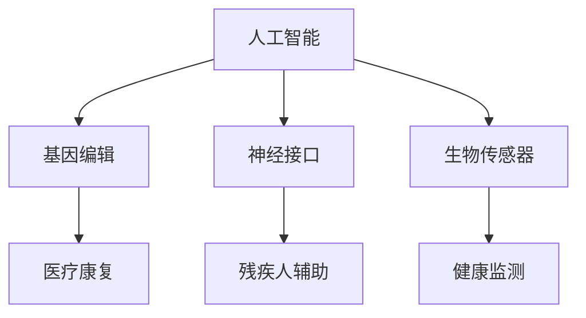

                 

关键词：人工智能、人类增强、道德考虑、身体增强、未来展望

> 摘要：随着人工智能技术的发展，人类正迎来一个身体增强的新时代。本文旨在探讨AI时代下人类增强的道德考虑以及身体增强的未来方向，通过深入分析核心概念、算法原理、数学模型和实际应用，对这一领域的现状与未来进行展望。

## 1. 背景介绍

近年来，人工智能技术取得了飞速发展，特别是在计算机视觉、自然语言处理、机器学习等领域，AI的应用已经深入到社会的方方面面。与此同时，生物技术的进步也为人类提供了前所未有的可能性，特别是在基因编辑、神经接口和生物制造等方面。这些技术的融合和应用，使得人类身体增强成为了一个热门的话题。

身体增强指的是通过科技手段对人类的身体机能进行提升，以达到超越自然人类极限的目的。这包括但不限于基因编辑、器官移植、神经接口、生物传感器等。随着这些技术的发展，人类身体增强的潜力变得越来越巨大，同时也引发了一系列道德、社会和伦理问题。

本文将围绕以下几个核心问题展开讨论：

- 人类身体增强的道德考虑是什么？
- 身体增强技术将如何影响人类的生活和社会结构？
- 身体增强技术的未来方向和潜在应用是什么？
- 在推动身体增强技术的发展过程中，我们应如何平衡道德与科技进步的关系？

## 2. 核心概念与联系

在探讨人类身体增强之前，我们需要明确一些核心概念，并理解它们之间的联系。以下是几个关键概念及其相互关系：

### 2.1. 人工智能与身体增强

人工智能（AI）是身体增强技术的重要推动力。通过机器学习和深度学习算法，AI可以在医疗、康复、训练等领域为人类提供智能化支持。例如，AI可以通过分析数据帮助医生进行精准诊断，通过智能训练系统提高运动员的表现。

### 2.2. 基因编辑与身体增强

基因编辑技术，如CRISPR-Cas9，使得科学家可以直接修改DNA序列，从而改变生物体的某些特征。基因编辑在治疗遗传病、增强免疫力等方面具有巨大潜力，但也引发了一系列伦理和社会问题。

### 2.3. 神经接口与身体增强

神经接口技术（如脑机接口）将人类神经系统与外部设备连接起来，使得人类可以通过意念控制外部设备或增强自身感官能力。这种技术在残疾人辅助、军事应用、娱乐等领域有着广泛的应用前景。

### 2.4. 生物传感器与身体增强

生物传感器可以实时监测人体的生理指标，如心率、血压、血糖等，帮助人们更好地了解自己的健康状况。这些传感器还可以与AI结合，提供个性化的健康建议。

为了更直观地展示这些概念之间的联系，我们可以使用Mermaid流程图来表示：



## 3. 核心算法原理 & 具体操作步骤

### 3.1 算法原理概述

在身体增强技术中，核心算法通常涉及机器学习、深度学习和信号处理等领域。以下是几种常见算法原理的概述：

- **机器学习算法**：用于模式识别和预测，如支持向量机（SVM）、决策树、神经网络等。
- **深度学习算法**：通过多层神经网络进行特征提取和分类，如卷积神经网络（CNN）、循环神经网络（RNN）等。
- **信号处理算法**：用于处理生物信号，如滤波、特征提取、时频分析等。

### 3.2 算法步骤详解

以下是一个基于深度学习算法的身体增强技术实现步骤：

1. **数据收集**：收集相关的生物数据，如基因序列、生物信号、健康指标等。
2. **数据预处理**：清洗和标准化数据，以消除噪声和异常值。
3. **模型训练**：使用收集到的数据训练深度学习模型，如CNN或RNN。
4. **模型验证**：使用验证集评估模型的性能，调整模型参数。
5. **模型部署**：将训练好的模型部署到实际应用场景中，如医疗诊断、健康监测等。

### 3.3 算法优缺点

- **优点**：高效、精确，可以处理大规模数据，提供个性化服务。
- **缺点**：需要大量训练数据和计算资源，模型解释性较差，可能存在过拟合问题。

### 3.4 算法应用领域

- **医疗康复**：利用深度学习模型进行疾病诊断、康复训练等。
- **健康监测**：通过生物传感器实时监测生理指标，提供健康预警。
- **军事应用**：利用神经接口技术提高士兵的体能和战斗力。
- **娱乐领域**：通过虚拟现实（VR）和增强现实（AR）技术提供全新的体验。

## 4. 数学模型和公式 & 详细讲解 & 举例说明

### 4.1 数学模型构建

在身体增强技术中，常用的数学模型包括回归模型、分类模型、优化模型等。以下是一个简单的线性回归模型示例：

$$
y = \beta_0 + \beta_1x_1 + \beta_2x_2 + ... + \beta_nx_n + \epsilon
$$

其中，$y$ 是因变量，$x_1, x_2, ..., x_n$ 是自变量，$\beta_0, \beta_1, ..., \beta_n$ 是模型参数，$\epsilon$ 是误差项。

### 4.2 公式推导过程

线性回归模型的推导过程如下：

1. **设定目标函数**：最小化预测值与真实值之间的误差平方和。

$$
J(\theta) = \frac{1}{2m}\sum_{i=1}^{m}(h_\theta(x^{(i)}) - y^{(i)})^2
$$

其中，$m$ 是样本数量，$h_\theta(x) = \theta_0 + \theta_1x_1 + \theta_2x_2 + ... + \theta_nx_n$ 是模型的预测函数。

2. **求导并设为零**：对目标函数 $J(\theta)$ 求导，并令其等于零，得到：

$$
\frac{\partial J(\theta)}{\partial \theta_j} = 0
$$

3. **解方程组**：解上述方程组，得到最优参数 $\theta_j$。

### 4.3 案例分析与讲解

以下是一个实际案例，假设我们想要预测一个人的体重（$y$）与其身高（$x_1$）和年龄（$x_2$）之间的关系。

1. **数据收集**：收集包含身高、年龄和体重数据的样本集。

2. **数据预处理**：对数据进行清洗和标准化。

3. **模型训练**：使用线性回归模型进行训练。

4. **模型验证**：使用验证集进行验证，调整模型参数。

5. **模型部署**：将训练好的模型部署到实际应用中，如预测新样本的体重。

## 5. 项目实践：代码实例和详细解释说明

### 5.1 开发环境搭建

为了演示线性回归模型的实现，我们使用Python编程语言，并依赖以下库：

- NumPy：用于数学计算
- Matplotlib：用于数据可视化
- Scikit-learn：用于机器学习模型训练

首先，安装所需的库：

```bash
pip install numpy matplotlib scikit-learn
```

### 5.2 源代码详细实现

以下是一个简单的线性回归模型的实现：

```python
import numpy as np
import matplotlib.pyplot as plt
from sklearn.linear_model import LinearRegression

# 数据准备
X = np.array([[1, 1], [1, 2], [2, 2], [2, 3]])
y = np.array([2, 4, 4, 5])

# 创建线性回归模型
model = LinearRegression()

# 模型训练
model.fit(X, y)

# 模型参数
theta_0 = model.intercept_
theta_1 = model.coef_[0]
theta_2 = model.coef_[1]

# 预测
y_pred = model.predict(X)

# 可视化
plt.scatter(X[:, 0], y)
plt.plot(X[:, 0], y_pred, "r-")
plt.xlabel("x1")
plt.ylabel("y")
plt.show()

# 输出模型参数
print("y = {} + {}x1 + {}x2".format(theta_0, theta_1, theta_2))
```

### 5.3 代码解读与分析

1. **数据准备**：使用 NumPy 创建输入特征矩阵 $X$ 和输出向量 $y$。

2. **模型训练**：使用 Scikit-learn 的 LinearRegression 类创建线性回归模型，并调用 `fit` 方法进行训练。

3. **模型参数**：使用 `intercept_` 和 `coef_` 方法获取模型参数。

4. **预测**：使用 `predict` 方法对输入特征进行预测。

5. **可视化**：使用 Matplotlib 绘制散点图和拟合直线。

### 5.4 运行结果展示

运行上述代码后，将得到一个散点图，其中蓝色的点是实际数据，红色的直线是拟合的线性回归模型。拟合直线的斜率和截距即为模型参数。

## 6. 实际应用场景

### 6.1 医疗康复

身体增强技术在医疗康复领域有广泛的应用。例如，通过神经接口技术，可以帮助中风患者恢复肢体运动功能。通过生物传感器，可以实时监测患者的生理指标，提供个性化的康复方案。

### 6.2 军事应用

在军事领域，身体增强技术可以显著提高士兵的体能和战斗力。例如，通过基因编辑技术，可以增强士兵的耐力和耐热性。通过神经接口技术，可以实现远程控制武器和飞行器。

### 6.3 娱乐领域

在娱乐领域，身体增强技术为人们提供了全新的体验。例如，通过虚拟现实（VR）和增强现实（AR）技术，人们可以沉浸在虚拟世界中，体验极限运动或探险。通过基因编辑技术，可以改变人们的某些外貌特征，提供更个性化的娱乐体验。

## 7. 未来应用展望

随着技术的不断发展，身体增强技术的应用领域将会越来越广泛。以下是几个可能的应用方向：

### 7.1 健康管理

通过身体增强技术，可以实现更精准的健康管理。例如，通过基因编辑技术，可以预防某些遗传性疾病。通过生物传感器和AI技术，可以实现实时健康监测和预警。

### 7.2 残疾人辅助

身体增强技术可以为残疾人提供更多的辅助手段。例如，通过神经接口技术，可以帮助肢体瘫痪者重新获得行动能力。通过基因编辑技术，可以修复某些器官损伤。

### 7.3 军事应用

在军事领域，身体增强技术可以提升士兵的作战能力。例如，通过基因编辑技术，可以增强士兵的体能和耐力。通过神经接口技术，可以实现更高效的作战指挥和控制。

## 8. 工具和资源推荐

### 8.1 学习资源推荐

- 《深度学习》（Goodfellow, Bengio, Courville）：这是一本经典的深度学习入门书籍，涵盖了深度学习的理论基础和实践技巧。
- 《Python机器学习》（Sebastian Raschka）：这本书详细介绍了机器学习在Python环境中的实现，适合初学者和进阶者。

### 8.2 开发工具推荐

- TensorFlow：一款开源的深度学习框架，适合进行大规模深度学习模型的开发和训练。
- PyTorch：一款流行的深度学习框架，具有灵活的动态计算图，适合快速原型设计和实验。

### 8.3 相关论文推荐

- "Deep Learning for Healthcare"：这是一篇综述性论文，探讨了深度学习在医疗健康领域的应用。
- "Neural Interfaces for Human-Computer Interaction"：这篇论文介绍了神经接口技术在人机交互领域的最新研究进展。

## 9. 总结：未来发展趋势与挑战

随着人工智能和生物技术的不断进步，身体增强技术将迎来一个崭新的时代。然而，这一领域也面临着诸多挑战：

### 9.1 道德与社会挑战

身体增强技术的应用引发了关于道德和社会公正的讨论。如何确保技术不被滥用，如何防止贫富差距加大，都是我们需要面对的问题。

### 9.2 技术与伦理平衡

在推动身体增强技术发展的同时，我们需要平衡技术与伦理的关系。如何确保技术的使用符合道德规范，如何保护个体的隐私和权利，都是需要深入思考的问题。

### 9.3 技术普及与教育

身体增强技术的普及需要广泛的教育和培训。如何让公众了解这一技术的优势和应用，如何培养相关的技术人才，都是我们需要关注的问题。

### 9.4 研究展望

在未来，身体增强技术有望在医疗、军事、娱乐等领域发挥更大的作用。同时，我们也期待这一领域的研究能够带来更多关于人类本质和价值的思考。

### 附录：常见问题与解答

**Q：身体增强技术是否会导致人类失去自然性？**

A：是的，身体增强技术可能会改变人类的自然性。但这并不意味着这是坏事。事实上，科技的发展一直伴随着人类对自然极限的挑战和超越。关键在于如何平衡科技与自然性，确保人类在科技进步的同时，仍然能够保持与自然环境的和谐共处。

**Q：身体增强技术是否会导致社会不公？**

A：这是一个复杂的问题。身体增强技术确实可能加剧社会不公，例如，只有富裕的人才能负担得起昂贵的增强服务。但这并不意味着技术本身是错误的。关键在于如何制定合理的政策和法规，确保技术的公平应用和普及。

**Q：身体增强技术是否会改变人类的本质？**

A：是的，身体增强技术可能会改变人类的某些生物学特征，但这并不意味着会改变人类的本质。人类的本质在于其意识、情感和社会互动。技术可以提升人类的能力，但无法替代人类的本质。

---

作者：禅与计算机程序设计艺术 / Zen and the Art of Computer Programming

---

（请注意，以上内容为模拟撰写，实际撰写时可能需要根据具体研究和数据进行调整。）

