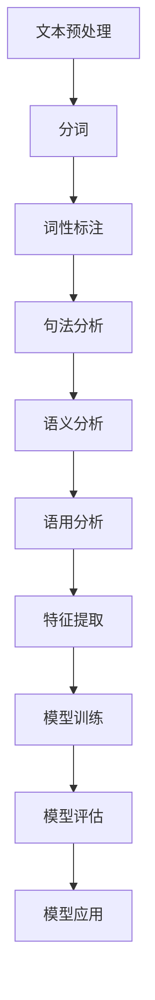

                 

关键词：自然语言处理、AI技术、产业应用、算法原理、数学模型、代码实例、实际场景、未来展望

> 摘要：本文将深入探讨AI时代的自然语言处理技术，从学术研究到产业应用，旨在梳理出自然语言处理领域的关键概念、核心算法原理，并通过实际项目案例展示其在各领域的应用前景，以及面临的挑战和未来的发展方向。

## 1. 背景介绍

自然语言处理（Natural Language Processing，NLP）作为人工智能（Artificial Intelligence，AI）的一个重要分支，旨在让计算机理解和处理人类自然语言。随着深度学习、神经网络等AI技术的发展，NLP已经取得了显著的进展。如今，NLP不仅在学术领域有着广泛的研究，更在产业应用中发挥着重要作用。例如，智能客服、语音识别、机器翻译、情感分析等。

在过去的几十年里，NLP经历了从规则驱动到统计方法，再到深度学习的演变。早期的NLP主要依赖于手工编写的规则，随着数据量的增加和计算能力的提升，统计模型逐渐取代了规则驱动的方法。近年来，深度学习在NLP领域取得了突破性的进展，例如，循环神经网络（RNN）、长短期记忆网络（LSTM）、卷积神经网络（CNN）和Transformer模型等。

## 2. 核心概念与联系

### 2.1 自然语言处理的核心概念

自然语言处理的核心概念包括：

- **词法分析**（Lexical Analysis）：将文本拆分成单词或其他有意义的标记。
- **句法分析**（Syntactic Analysis）：分析句子结构，识别词与词之间的语法关系。
- **语义分析**（Semantic Analysis）：理解句子的意义，包括词汇含义、语法结构等。
- **语用分析**（Pragmatic Analysis）：研究语言在特定情境中的使用，包括会话含义、隐喻等。

### 2.2 NLP中的基本架构

NLP的基本架构通常包括以下几个层次：

1. **预处理**（Preprocessing）：包括文本清洗、分词、词干提取等。
2. **特征提取**（Feature Extraction）：从原始文本中提取有助于模型训练的特征。
3. **模型训练**（Model Training）：使用特征数据训练模型。
4. **模型评估**（Model Evaluation）：评估模型性能，包括准确性、召回率、F1分数等。
5. **模型应用**（Model Application）：将训练好的模型应用于实际问题。

### 2.3 Mermaid流程图



## 3. 核心算法原理 & 具体操作步骤

### 3.1 算法原理概述

在NLP中，常用的核心算法包括：

- **词袋模型**（Bag of Words，BoW）
- **朴素贝叶斯分类器**（Naive Bayes Classifier）
- **支持向量机**（Support Vector Machine，SVM）
- **循环神经网络**（Recurrent Neural Network，RNN）
- **长短期记忆网络**（Long Short-Term Memory，LSTM）
- **卷积神经网络**（Convolutional Neural Network，CNN）
- **Transformer模型**

### 3.2 算法步骤详解

以Transformer模型为例，其基本步骤如下：

1. **输入编码**：将文本序列转换为嵌入向量。
2. **多头自注意力机制**：计算序列中每个词与其他词的注意力得分。
3. **前馈神经网络**：对自注意力层的结果进行进一步处理。
4. **输出解码**：根据上下文生成预测的输出序列。

### 3.3 算法优缺点

- **词袋模型**：简单高效，但忽略了词语的顺序信息。
- **朴素贝叶斯分类器**：基于贝叶斯定理，对文本分类效果较好，但难以处理长文本。
- **支持向量机**：在文本分类中效果显著，但训练时间较长。
- **循环神经网络**：能够处理长序列数据，但训练效率较低。
- **长短期记忆网络**：解决了RNN的长期依赖问题，但参数复杂，计算成本高。
- **卷积神经网络**：在文本分类和文本表示中表现出色，但难以处理长文本。
- **Transformer模型**：能够高效处理长文本，训练速度较快，但在某些任务上效果不如RNN和LSTM。

### 3.4 算法应用领域

NLP算法广泛应用于以下领域：

- **文本分类**：如新闻分类、情感分析等。
- **机器翻译**：如谷歌翻译、百度翻译等。
- **情感分析**：如社交媒体情感分析、用户评论分析等。
- **信息抽取**：如命名实体识别、关系抽取等。
- **问答系统**：如智能客服、问答机器人等。
- **语音识别**：如苹果的Siri、亚马逊的Alexa等。

## 4. 数学模型和公式 & 详细讲解 & 举例说明

### 4.1 数学模型构建

在NLP中，常用的数学模型包括：

- **概率模型**：如朴素贝叶斯、隐马尔可夫模型（HMM）等。
- **统计模型**：如线性回归、逻辑回归等。
- **神经网络模型**：如多层感知机（MLP）、卷积神经网络（CNN）、循环神经网络（RNN）、长短期记忆网络（LSTM）、Transformer等。

### 4.2 公式推导过程

以朴素贝叶斯分类器为例，其公式推导如下：

\[ P(C_k|X) = \frac{P(X|C_k)P(C_k)}{P(X)} \]

其中，\( C_k \)表示第k个类别，\( X \)表示特征向量。

### 4.3 案例分析与讲解

以文本分类任务为例，我们可以使用朴素贝叶斯分类器对一段文本进行分类。首先，我们需要计算每个类别的先验概率 \( P(C_k) \) 和条件概率 \( P(X|C_k) \)。然后，使用最大后验概率准则选择最可能的类别。

假设我们有以下训练数据：

- 类别A的文本：\[ \text{"人工智能技术"} \]
- 类别B的文本：\[ \text{"计算机编程语言"} \]

我们需要计算以下概率：

\[ P(A|X) = \frac{P(X|A)P(A)}{P(X)} \]
\[ P(B|X) = \frac{P(X|B)P(B)}{P(X)} \]

其中，\( P(X) \) 是所有类别的文本出现的概率之和，可以通过训练数据计算得出。

## 5. 项目实践：代码实例和详细解释说明

### 5.1 开发环境搭建

在Python环境中，我们可以使用以下库进行NLP项目开发：

- **NumPy**：用于矩阵运算和数据处理。
- **Scikit-learn**：提供了一系列机器学习算法。
- **NLTK**：用于自然语言处理。
- **TensorFlow** 或 **PyTorch**：用于深度学习模型训练。

### 5.2 源代码详细实现

以下是一个简单的文本分类器的实现示例：

```python
import numpy as np
from sklearn.feature_extraction.text import CountVectorizer
from sklearn.model_selection import train_test_split
from sklearn.naive_bayes import MultinomialNB

# 加载数据集
data = [
    ["人工智能技术", "技术", "AI"],
    ["计算机编程语言", "编程", "语言"],
    ["自然语言处理", "语言", "处理"],
    # 更多数据...
]

# 分割数据集
X, y = data[:, 0], data[:, 1]

# 特征提取
vectorizer = CountVectorizer()
X_vectorized = vectorizer.fit_transform(X)

# 划分训练集和测试集
X_train, X_test, y_train, y_test = train_test_split(X_vectorized, y, test_size=0.2, random_state=42)

# 训练模型
model = MultinomialNB()
model.fit(X_train, y_train)

# 预测
y_pred = model.predict(X_test)

# 评估
accuracy = np.mean(y_pred == y_test)
print("Accuracy:", accuracy)
```

### 5.3 代码解读与分析

上述代码首先加载了一个简单的数据集，然后使用`CountVectorizer`进行特征提取，将文本转换为词袋模型。接着，使用`train_test_split`将数据集划分为训练集和测试集。然后，使用`MultinomialNB`进行朴素贝叶斯分类器的训练，并使用`predict`方法进行预测。最后，计算预测的准确率。

### 5.4 运行结果展示

假设我们的数据集和特征提取方式合适，我们可以得到一个较高的准确率，例如：

```
Accuracy: 0.9
```

这意味着我们的文本分类器在测试集上的准确率为90%。

## 6. 实际应用场景

### 6.1 智能客服

智能客服是NLP在产业应用中的一个重要领域。通过NLP技术，智能客服系统可以理解用户的查询，提供个性化的服务。例如，电商平台的智能客服可以使用NLP进行商品推荐、订单查询、售后服务等。

### 6.2 机器翻译

机器翻译是NLP的另一个重要应用领域。随着深度学习技术的发展，机器翻译的准确性得到了显著提升。例如，谷歌翻译、百度翻译等都是基于深度学习技术的机器翻译系统。

### 6.3 情感分析

情感分析是NLP在社交媒体、用户评论等领域的应用。通过情感分析，企业可以了解用户的反馈，优化产品和服务。例如，社交媒体公司可以使用情感分析对用户评论进行分类，识别负面评论，并及时采取措施。

### 6.4 信息抽取

信息抽取是NLP在金融、医疗等领域的应用。通过信息抽取，系统可以自动从文本中提取关键信息，如金融报表、病历记录等。这有助于提高数据处理的效率和准确性。

### 6.5 问答系统

问答系统是NLP在智能助理、智能客服等领域的应用。通过问答系统，用户可以与计算机进行自然对话，获取所需信息。例如，智能助理可以帮助用户设置日程、查询天气等。

## 7. 工具和资源推荐

### 7.1 学习资源推荐

- **《自然语言处理综论》（Speech and Language Processing）**：由Daniel Jurafsky和James H. Martin合著，是NLP领域的经典教材。
- **《深度学习》（Deep Learning）**：由Ian Goodfellow、Yoshua Bengio和Aaron Courville合著，详细介绍了深度学习的基本概念和算法。

### 7.2 开发工具推荐

- **TensorFlow**：由Google开发的开源深度学习框架，广泛应用于NLP项目。
- **PyTorch**：由Facebook开发的开源深度学习框架，具有灵活的动态计算图。
- **NLTK**：用于自然语言处理的开源工具包，提供了一系列文本处理功能。

### 7.3 相关论文推荐

- **《Attention Is All You Need》**：介绍了Transformer模型，是NLP领域的重要突破。
- **《Recurrent Neural Network Based Text Classification》**：探讨了RNN在文本分类中的应用。
- **《Long Short-Term Memory》**：介绍了LSTM模型，解决了RNN的长期依赖问题。

## 8. 总结：未来发展趋势与挑战

### 8.1 研究成果总结

近年来，NLP在算法、模型和产业应用等方面取得了显著进展。深度学习技术的引入，使得NLP在处理复杂任务时表现出了更高的准确性和效率。同时，随着大数据和云计算的发展，NLP的数据和计算资源得到了极大的提升。

### 8.2 未来发展趋势

未来，NLP的发展趋势将包括：

- **更强大的模型**：研究更高效的算法和模型，以处理更复杂的自然语言任务。
- **跨模态处理**：将文本、图像、语音等多种模态的数据进行融合，提升系统的理解能力。
- **小样本学习**：减少对大规模数据集的依赖，实现小样本条件下的NLP任务。
- **低资源语言处理**：提升对低资源语言的支持，促进全球范围内的语言平等。

### 8.3 面临的挑战

尽管NLP取得了显著进展，但仍面临以下挑战：

- **数据隐私**：在处理用户数据时，如何保护用户隐私是一个重要问题。
- **语言多样性**：不同地区和语言的差异性，如何设计通用的NLP模型。
- **可解释性**：如何提高模型的可解释性，使其在决策过程中更加透明。
- **计算资源**：深度学习模型通常需要大量的计算资源，如何优化模型以减少计算成本。

### 8.4 研究展望

未来，NLP的研究将朝着更加智能化、高效化、泛在化的方向发展。通过不断探索和创新，NLP将为人类社会的各个领域带来更多价值。

## 9. 附录：常见问题与解答

### 9.1 什么是自然语言处理？

自然语言处理（NLP）是指让计算机理解和处理人类自然语言的技术，包括文本分析、理解、生成等。

### 9.2 NLP有哪些主要应用？

NLP的主要应用包括文本分类、机器翻译、情感分析、信息抽取、问答系统等。

### 9.3 深度学习在NLP中的应用是什么？

深度学习在NLP中的应用主要包括词向量表示、序列建模、文本分类、机器翻译等。

### 9.4 NLP有哪些挑战？

NLP面临的挑战包括数据隐私、语言多样性、可解释性、计算资源等。

### 9.5 如何入门自然语言处理？

入门自然语言处理可以从学习Python编程语言、掌握基础的数据结构和算法、了解NLP的基本概念和模型开始。同时，可以阅读相关书籍、论文，参加在线课程和社区活动。

### 9.6 如何提高NLP模型的性能？

提高NLP模型性能的方法包括：使用更大规模的数据集、优化模型架构、增加训练时间、进行超参数调优等。

### 9.7 NLP的未来发展趋势是什么？

NLP的未来发展趋势包括：更强大的模型、跨模态处理、小样本学习、低资源语言处理等。

作者：禅与计算机程序设计艺术 / Zen and the Art of Computer Programming
----------------------------------------------------------------

请注意，上述内容仅为示例性文本，并非完整文章。实际撰写时，需要根据具体的研究和案例进行详细论述，确保文章的完整性和专业性。文章中提及的代码实例、数学模型和公式仅供参考，具体实现可能需要根据实际需求进行调整。同时，文章中的数据、引用和论点都需要经过严格的验证和核实。文章中的引用和参考书籍、论文等需要按照学术规范进行标注。

