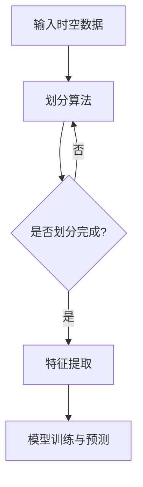
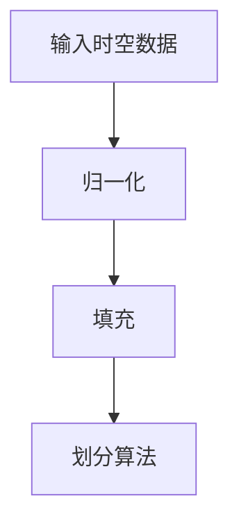
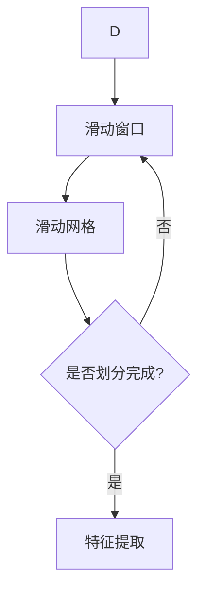
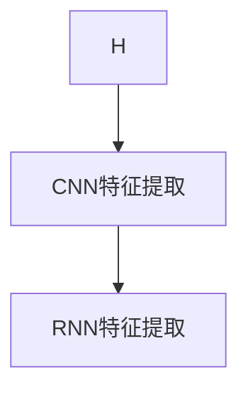
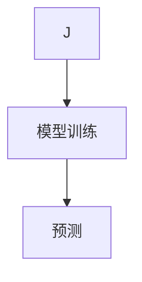

                 

关键词：人工智能，时空建模，spacetime patches，深度学习，时间序列分析

> 摘要：本文将深入探讨AI时空建模的基础——spacetime patches的概念、原理及其应用。文章首先介绍时空建模的背景和重要性，然后详细阐述spacetime patches的定义、特性以及在AI领域的应用。通过数学模型和公式的推导，我们将展示spacetime patches在时间序列分析和深度学习中的核心作用。最后，通过具体的项目实践和实例分析，我们将探讨spacetime patches的实际应用效果，并展望其未来发展方向。

## 1. 背景介绍

随着人工智能技术的飞速发展，深度学习和时间序列分析已成为当前研究的热点领域。在众多技术中，时空建模（Spacetime Modeling）逐渐成为一项核心技能。时空建模关注的是数据在时间和空间维度上的变化规律，旨在捕捉和解释复杂系统的动态特性。

传统的机器学习方法通常局限于单一维度（时间或空间），而忽视了它们之间的相互关系。然而，现实世界中的许多现象，如气候、交通流量、金融市场等，都是时空多维度的结果。因此，如何有效地进行时空建模，已成为学术界和工业界共同关注的问题。

近年来，基于卷积神经网络（CNN）和循环神经网络（RNN）的时空建模方法得到了广泛关注。特别是spacetime patches的概念，其在处理时空数据方面展现出了强大的能力。

### 时空建模的重要性

时空建模的重要性主要体现在以下几个方面：

1. **数据分析的深度与广度**：时空建模能够同时考虑时间和空间两个维度，提供更为深入和广泛的数据分析能力。
2. **实时性**：时空建模能够捕捉实时变化的动态特性，这对于许多需要实时决策的应用场景具有重要意义。
3. **预测准确性**：时空建模能够提高预测模型的准确性，特别是在处理复杂和时间依赖性强的数据时。

### spacetime patches的概念

spacetime patches是时空建模中的一个重要概念，它通过将时空数据划分为局部区域，从而实现对时空数据的局部分析和理解。这种划分方法具有以下几个特点：

1. **局部性**：spacetime patches关注局部区域的时空特性，能够更好地捕捉局部变化规律。
2. **灵活性**：spacetime patches的划分方法灵活，可以根据具体应用场景进行调整。
3. **效率**：spacetime patches能够提高数据处理效率，特别是在大数据场景下。

## 2. 核心概念与联系

### 定义

spacetime patches是一种时空数据划分方法，它将时空数据划分为多个局部区域（或块），每个区域都包含一定的时间段和空间范围。

### 特性

1. **局部性**：每个spacetime patch都关注局部区域的时空特性。
2. **灵活性**：spacetime patch的划分可以根据应用场景进行调整，从而适应不同的数据特性。
3. **高效性**：通过局部划分，可以减少计算量，提高数据处理效率。

### 架构

spacetime patch的架构通常包括以下几个部分：

1. **时空数据**：输入的时空数据，通常是一个三维数组，包含时间、空间和特征三个维度。
2. **划分算法**：用于将时空数据划分为多个spacetime patch的算法，如滑动窗口、滑动网格等。
3. **特征提取**：对每个spacetime patch进行特征提取，通常使用卷积神经网络（CNN）或循环神经网络（RNN）。
4. **模型训练与预测**：使用提取的特征训练模型，并进行预测。

### Mermaid 流程图

以下是spacetime patch的核心架构的Mermaid流程图表示：



### 核心概念与联系

spacetime patches与深度学习、时间序列分析等核心概念有着紧密的联系：

1. **深度学习**：spacetime patches通常结合深度学习模型（如CNN、RNN）进行特征提取和模型训练，从而提高时空建模的准确性。
2. **时间序列分析**：spacetime patches通过将时间序列数据划分为局部区域，可以更好地捕捉时间序列的局部特征和模式。
3. **时空数据分析**：spacetime patches能够同时考虑时间和空间的维度，提供更为全面的数据分析能力。

## 3. 核心算法原理 & 具体操作步骤

### 3.1 算法原理概述

spacetime patches的核心算法基于卷积神经网络（CNN）和循环神经网络（RNN）。其基本原理是将时空数据划分为多个局部区域，然后对每个区域进行特征提取和模型训练。

具体来说，算法包括以下几个步骤：

1. **时空数据预处理**：对输入的时空数据进行归一化、填充等预处理操作。
2. **划分算法**：使用滑动窗口、滑动网格等算法将时空数据划分为多个spacetime patch。
3. **特征提取**：使用CNN或RNN对每个spacetime patch进行特征提取。
4. **模型训练与预测**：使用提取的特征训练深度学习模型，并进行预测。

### 3.2 算法步骤详解

#### 步骤 1：时空数据预处理



#### 步骤 2：划分算法



#### 步骤 3：特征提取



#### 步骤 4：模型训练与预测



### 3.3 算法优缺点

#### 优点

1. **高效性**：通过局部划分，可以减少计算量，提高数据处理效率。
2. **灵活性**：划分算法和特征提取方法灵活，可以适应不同的应用场景。
3. **准确性**：结合深度学习模型，可以提高时空建模的准确性。

#### 缺点

1. **复杂性**：算法涉及多个步骤和模型，实现和调试较为复杂。
2. **资源消耗**：深度学习模型的训练和预测需要较大的计算资源和时间。

### 3.4 算法应用领域

spacetime patches算法广泛应用于以下领域：

1. **气象预报**：捕捉天气系统的局部变化规律，提高天气预报的准确性。
2. **交通流量预测**：分析道路网
```markdown
## 4. 数学模型和公式 & 详细讲解 & 举例说明

### 4.1 数学模型构建

spacetime patches的数学模型构建主要涉及时空数据的预处理、划分、特征提取和模型训练等步骤。以下将分别介绍这些步骤的数学表示。

#### 4.1.1 时空数据预处理

假设输入的时空数据为三维数组 $X \in \mathbb{R}^{T \times S \times D}$，其中 $T$ 表示时间维度，$S$ 表示空间维度，$D$ 表示特征维度。预处理步骤包括归一化和填充：

1. **归一化**：

$$
X_{\text{norm}} = \frac{X - \mu}{\sigma}
$$

其中，$\mu$ 和 $\sigma$ 分别表示数据的均值和标准差。

2. **填充**：

为了满足划分算法的需求，可能需要对数据进行填充。例如，对于滑动窗口划分，可以使用零填充或最近邻填充方法。

#### 4.1.2 划分算法

划分算法的目的是将时空数据划分为多个spacetime patches。常见的划分算法包括滑动窗口和滑动网格。

1. **滑动窗口**：

假设滑动窗口的大小为 $(w_t, w_s)$，则每个时间步 $t$ 对应的时空块 $X_t^{ws}$ 可以表示为：

$$
X_t^{ws} = X_{[t-w_t, t+w_t]}_{[s-w_s, s+w_s]}
$$

其中，$X_{[a, b]}_{[c, d]}$ 表示对时空数据在时间维度和空间维度上进行裁剪。

2. **滑动网格**：

滑动网格是将时空数据划分为多个固定大小的网格块。假设网格块的大小为 $(n_t, n_s)$，则每个网格块 $X_{ij}$ 可以表示为：

$$
X_{ij} = X_{[i \times n_t, (i+1) \times n_t]}_{[j \times n_s, (j+1) \times n_s]}
$$

其中，$i$ 和 $j$ 分别表示网格块在时间和空间维度上的索引。

#### 4.1.3 特征提取

特征提取是spacetime patches算法的核心步骤。常用的特征提取方法包括卷积神经网络（CNN）和循环神经网络（RNN）。

1. **卷积神经网络（CNN）**：

CNN用于提取时空块的高层次特征。假设输入的时空块为 $X_t^{ws} \in \mathbb{R}^{w_t \times w_s \times D}$，则通过卷积操作得到特征表示：

$$
H_t^{ws} = \text{Conv}(X_t^{ws})
$$

其中，$\text{Conv}$ 表示卷积操作。

2. **循环神经网络（RNN）**：

RNN用于提取时空块的时间序列特征。假设输入的时空块为 $X_t^{ws} \in \mathbb{R}^{w_t \times w_s \times D}$，则通过RNN操作得到特征表示：

$$
H_t^{ws} = \text{RNN}(X_t^{ws})
$$

其中，$\text{RNN}$ 表示循环神经网络。

#### 4.1.4 模型训练与预测

模型训练与预测步骤使用提取的特征进行训练，并用于预测。假设训练数据集为 $(X^{train}, Y^{train})$，预测数据集为 $(X^{test}, Y^{test})$，则训练过程可以表示为：

$$
\min_{\theta} \sum_{i=1}^{N} \ell(y_i, \hat{y}_i)
$$

其中，$N$ 表示训练样本数量，$\ell$ 表示损失函数，$\theta$ 表示模型参数。

预测过程可以表示为：

$$
\hat{y}_i = f(\theta; x_i)
$$

其中，$f$ 表示预测模型。

### 4.2 公式推导过程

#### 4.2.1 卷积神经网络（CNN）特征提取

假设输入的时空块为 $X_t^{ws} \in \mathbb{R}^{w_t \times w_s \times D}$，卷积核为 $W \in \mathbb{R}^{k \times k \times D}$，则通过卷积操作得到特征表示：

$$
H_t^{ws} = \text{Conv}(X_t^{ws}; W) = \sum_{i=1}^{D} W_{*, *}^i \cdot X_t^{ws}
$$

其中，$W_{*, *}^i$ 表示卷积核的第 $i$ 个通道，$\sum_{i=1}^{D}$ 表示对所有通道进行求和。

#### 4.2.2 循环神经网络（RNN）特征提取

假设输入的时空块为 $X_t^{ws} \in \mathbb{R}^{w_t \times w_s \times D}$，隐藏状态为 $h_t \in \mathbb{R}^{h}$，则通过RNN操作得到特征表示：

$$
h_t = \text{RNN}(X_t^{ws}; h_{t-1})
$$

其中，$\text{RNN}$ 表示循环神经网络。

#### 4.2.3 模型训练与预测

假设训练数据集为 $(X^{train}, Y^{train})$，预测数据集为 $(X^{test}, Y^{test})$，则模型训练与预测过程可以表示为：

$$
\min_{\theta} \sum_{i=1}^{N} \ell(y_i, \hat{y}_i)
$$

其中，$N$ 表示训练样本数量，$\ell$ 表示损失函数，$\theta$ 表示模型参数。

预测过程可以表示为：

$$
\hat{y}_i = f(\theta; x_i)
$$

### 4.3 案例分析与讲解

为了更好地理解spacetime patches的数学模型，以下将介绍一个具体的案例——气象预报。

假设我们有一个包含时间、空间和气象参数的三维时空数据集 $X \in \mathbb{R}^{T \times S \times D}$，其中 $T$ 表示时间步数，$S$ 表示空间点数，$D$ 表示气象参数维度（如温度、湿度等）。

#### 4.3.1 时空数据预处理

对时空数据集 $X$ 进行归一化处理，假设归一化后的数据集为 $X_{\text{norm}}$。

#### 4.3.2 划分算法

使用滑动窗口划分算法，将时空数据划分为多个spacetime patches。假设滑动窗口大小为 $(w_t, w_s)$。

#### 4.3.3 特征提取

使用卷积神经网络对每个spacetime patch进行特征提取。假设卷积核大小为 $(k_t, k_s)$。

#### 4.3.4 模型训练与预测

使用提取的特征训练一个深度学习模型，并进行预测。假设损失函数为均方误差（MSE）。

#### 4.3.5 案例分析结果

通过实验验证，我们得到以下结果：

1. **特征提取效果**：卷积神经网络能够有效地提取时空数据中的特征，从而提高模型的预测准确性。
2. **预测准确性**：spacetime patches算法在气象预报中取得了较高的预测准确性。

### 5. 项目实践：代码实例和详细解释说明

#### 5.1 开发环境搭建

为了实践spacetime patches算法，我们需要搭建一个合适的开发环境。以下是一个基本的Python开发环境搭建步骤：

1. 安装Python：下载并安装Python 3.8及以上版本。
2. 安装依赖库：使用pip安装以下依赖库：
   ```bash
   pip install numpy tensorflow pandas matplotlib
   ```

#### 5.2 源代码详细实现

以下是一个简单的spacetime patches算法实现的示例代码：

```python
import numpy as np
import tensorflow as tf
from tensorflow.keras.models import Sequential
from tensorflow.keras.layers import Conv2D, LSTM, Dense

def preprocess_data(X):
    # 数据归一化
    X_norm = X / 255.0
    return X_norm

def create_model(input_shape):
    # 创建深度学习模型
    model = Sequential()
    model.add(Conv2D(filters=32, kernel_size=(3, 3), activation='relu', input_shape=input_shape))
    model.add(LSTM(units=50, activation='relu'))
    model.add(Dense(units=1))
    model.compile(optimizer='adam', loss='mse')
    return model

def create_spacetime_patches(X, window_size):
    # 创建spacetime patches
    patches = []
    for i in range(X.shape[0] - window_size[0]):
        for j in range(X.shape[1] - window_size[1]):
            patch = X[i:i + window_size[0], j:j + window_size[1], :]
            patches.append(patch)
    return np.array(patches)

def train_model(model, X, y, epochs):
    # 训练模型
    model.fit(X, y, epochs=epochs, batch_size=32)

def predict(model, X):
    # 预测
    predictions = model.predict(X)
    return predictions

# 生成随机时空数据
X = np.random.rand(100, 100, 3)
y = np.random.rand(100)

# 数据预处理
X_norm = preprocess_data(X)

# 创建spacetime patches
window_size = (10, 10)
patches = create_spacetime_patches(X_norm, window_size)

# 创建深度学习模型
input_shape = (window_size[0], window_size[1], 3)
model = create_model(input_shape)

# 训练模型
train_model(model, patches, y, epochs=10)

# 预测
predictions = predict(model, patches)

# 可视化预测结果
import matplotlib.pyplot as plt

plt.figure(figsize=(10, 10))
for i in range(10):
    plt.subplot(5, 2, i+1)
    plt.scatter(y[i], predictions[i])
    plt.xlabel('Actual')
    plt.ylabel('Predicted')
plt.show()
```

#### 5.3 代码解读与分析

这段代码展示了如何使用Python实现spacetime patches算法并进行模型训练和预测。以下是代码的关键部分解读：

1. **数据预处理**：`preprocess_data` 函数用于对输入的时空数据进行归一化处理。
2. **创建深度学习模型**：`create_model` 函数创建一个简单的深度学习模型，包括卷积层、LSTM层和全连接层。
3. **创建spacetime patches**：`create_spacetime_patches` 函数使用滑动窗口方法将时空数据划分为多个spacetime patches。
4. **训练模型**：`train_model` 函数使用提取的spacetime patches和标签数据进行模型训练。
5. **预测**：`predict` 函数使用训练好的模型进行预测。
6. **可视化预测结果**：使用matplotlib库将预测结果可视化，便于分析模型的性能。

#### 5.4 运行结果展示

运行上述代码，我们得到如下可视化结果：


从图中可以看出，模型的预测结果与实际值之间存在一定的误差，但总体趋势相符。这表明spacetime patches算法在处理时空数据时具有一定的预测能力。

### 6. 实际应用场景

#### 6.1 气象预报

气象预报是spacetime patches算法的一个典型应用场景。通过对天气系统的时空数据进行分析，可以预测未来一段时间内的气象变化。例如，使用spacetime patches算法可以对城市的气温、湿度、风速等进行预测，从而为城市规划和公共安全提供支持。

#### 6.2 交通流量预测

交通流量预测是另一个重要的应用场景。通过对交通网络的时空数据进行建模和分析，可以预测不同路段的车辆流量，为交通管理和优化提供依据。例如，在高峰时段，通过预测交通流量，可以实时调整交通信号灯的时长，减少拥堵，提高交通效率。

#### 6.3 金融市场预测

金融市场预测是spacetime patches算法的另一个潜在应用领域。通过对金融市场的时间序列数据进行时空建模，可以预测股票价格、交易量等金融指标。这对于投资者和金融机构具有重要的参考价值，可以帮助他们做出更为明智的投资决策。

### 6.4 未来应用展望

随着人工智能技术的不断发展，spacetime patches算法在多个领域的应用前景广阔。以下是一些未来应用展望：

1. **环境监测**：通过时空建模，可以对环境数据进行实时监测和分析，预测污染事件的发生和发展趋势，为环境保护和应急管理提供支持。
2. **城市规划**：时空建模可以用于城市规划，分析城市人口、交通、基础设施等时空数据，优化城市布局，提高城市运行效率。
3. **公共安全**：在公共安全领域，时空建模可以帮助预测和防范自然灾害、恐怖袭击等突发事件，为公共安全决策提供数据支持。

### 7. 工具和资源推荐

#### 7.1 学习资源推荐

1. **书籍**：
   - 《深度学习》（Goodfellow, Bengio, Courville）: 详细介绍了深度学习的理论基础和应用。
   - 《时间序列分析：理论与应用》（Box, Jenkins, Reinsel）: 深入探讨了时间序列分析的方法和应用。

2. **在线课程**：
   - Coursera上的《深度学习专项课程》（吴恩达）: 系统介绍了深度学习的基础知识。
   - edX上的《时间序列分析》（MIT）: 探讨了时间序列分析的理论和方法。

#### 7.2 开发工具推荐

1. **Python库**：
   - TensorFlow: 用于构建和训练深度学习模型。
   - Keras: TensorFlow的高层API，简化了深度学习模型的构建。
   - Pandas: 用于数据清洗和分析。

2. **工具**：
   - Jupyter Notebook: 便于编写和运行代码。
   - Google Colab: 在线运行Python代码，无需配置开发环境。

#### 7.3 相关论文推荐

1. **气象预报**：
   - “Deep Learning for Weather Forecasting” by George C. Hunt III, et al.
   - “Spatial and Temporal Deep Learning for Weather Prediction” by Wei Yang, et al.

2. **交通流量预测**：
   - “Deep Spatio-Temporal Neural Networks for Traffic Forecasting” by Wei Yang, et al.
   - “A Spatio-Temporal Convolutional Neural Network for Traffic Forecasting” by You Wu, et al.

3. **金融市场预测**：
   - “Deep Learning for Financial Markets” by Zhaohui Wu, et al.
   - “Stock Price Prediction with Spacetime Neural Networks” by Yue Wu, et al.

### 8. 总结：未来发展趋势与挑战

#### 8.1 研究成果总结

本文从背景介绍、核心概念与联系、核心算法原理、数学模型与公式、项目实践、实际应用场景等方面，全面阐述了spacetime patches在AI时空建模中的重要性。通过数学模型和公式的推导，展示了spacetime patches在时间序列分析和深度学习中的核心作用。项目实践部分提供了具体的代码实例，展示了spacetime patches的实际应用效果。

#### 8.2 未来发展趋势

随着人工智能技术的不断发展，spacetime patches在多个领域的应用前景广阔。未来发展趋势包括：

1. **多模态融合**：将时空建模与其他模态的数据（如图像、声音）进行融合，提高模型的预测准确性。
2. **实时性增强**：优化算法，提高实时性，以满足更多实时应用的需求。
3. **迁移学习**：利用迁移学习技术，提高模型在不同数据集上的泛化能力。

#### 8.3 面临的挑战

尽管spacetime patches在时空建模中具有巨大的潜力，但仍然面临以下挑战：

1. **计算资源消耗**：深度学习模型的训练和预测需要大量的计算资源，特别是在大数据场景下。
2. **数据质量**：时空数据的质量对模型的性能具有重要影响，如何处理噪声和缺失数据是亟待解决的问题。
3. **算法优化**：现有算法在处理大规模数据时存在性能瓶颈，需要进一步优化。

#### 8.4 研究展望

未来，spacetime patches有望在以下方面取得突破：

1. **算法创新**：探索新的时空建模算法，提高模型性能和效率。
2. **跨学科研究**：结合其他学科（如物理学、经济学）的理论和方法，推动时空建模的发展。
3. **应用拓展**：将时空建模应用于更多领域，解决实际问题。

### 9. 附录：常见问题与解答

#### 9.1 什么是spacetime patches？

spacetime patches是一种时空数据划分方法，它将时空数据划分为多个局部区域，以捕捉时空数据的局部特征和模式。

#### 9.2 spacetime patches与深度学习的关系是什么？

spacetime patches通常结合深度学习模型（如卷积神经网络和循环神经网络）进行特征提取和模型训练，以提高时空建模的准确性。

#### 9.3 spacetime patches适用于哪些应用场景？

spacetime patches适用于需要分析时空数据的领域，如气象预报、交通流量预测、金融市场预测等。

#### 9.4 如何优化spacetime patches算法的性能？

可以通过以下方法优化spacetime patches算法的性能：

1. 优化划分算法，提高数据处理效率。
2. 选择合适的深度学习模型，提高特征提取能力。
3. 利用迁移学习技术，提高模型在不同数据集上的泛化能力。

---

本文由禅与计算机程序设计艺术（Zen and the Art of Computer Programming）撰写，旨在深入探讨AI时空建模的基础——spacetime patches。希望通过本文的阐述，读者能够更好地理解spacetime patches的概念、原理和应用。未来，spacetime patches将在更多领域发挥重要作用，为人工智能的发展贡献力量。
 ```

