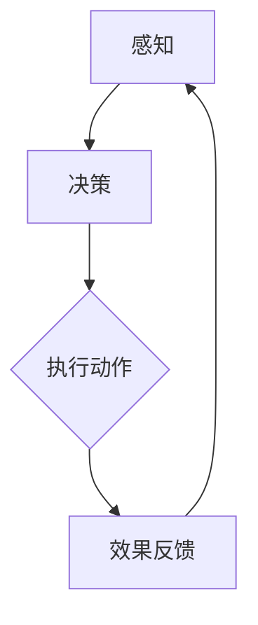

                 

关键词：人工智能、智能体、数字世界、交互、架构、算法、数学模型、项目实践、应用场景、未来展望

> 摘要：本文深入探讨了人工智能智能体与数字世界的交互，通过介绍智能体的核心概念、算法原理、数学模型以及实际应用，分析其发展趋势和面临的挑战，旨在为读者提供对人工智能智能体与数字世界交互的全面理解和未来展望。

## 1. 背景介绍

随着互联网、大数据、云计算等技术的飞速发展，数字世界日益成为我们生活和工作的重要组成部分。在这个数字化的时代，人工智能（AI）技术的兴起更是引发了全球范围内的技术变革。人工智能智能体作为AI技术的重要组成部分，其在数字世界中的交互与作用变得越来越重要。

智能体（Agent）是具有智能的自主实体，能够在复杂环境中通过感知、思考、决策和行动来达到目标。传统的计算模型主要基于数学和逻辑，而智能体则引入了行为和交互的概念，使得计算能够更好地模拟人类的思维和行为。

在数字世界中，智能体可以扮演多种角色，如搜索引擎、推荐系统、智能客服、自动驾驶等。它们通过不断地学习和优化，提高了数字世界的智能化水平，为人类带来了前所未有的便利。

## 2. 核心概念与联系

### 2.1 智能体的定义

智能体是指具有智能、自主性、自适应性和交互能力的实体。它可以在复杂的环境中感知外部信息，通过内部模型进行思考，做出决策并采取行动。

智能体的特点如下：

- **自主性**：智能体能够独立地完成特定任务，不受外部控制。
- **适应性**：智能体可以根据环境和目标的变化，调整自身的策略和行为。
- **交互性**：智能体可以与外部环境进行信息交换，实现协同工作。

### 2.2 智能体与数字世界的联系

智能体与数字世界的关系可以看作是一种动态交互的过程。智能体通过感知数字世界的状态信息，结合自身的知识库和算法，做出决策并执行相应的动作，进而改变数字世界的状态。这种交互过程不仅实现了智能体与数字世界的相互影响，也推动了数字世界的发展。

### 2.3 Mermaid 流程图

下面是一个简单的Mermaid流程图，展示了智能体与数字世界的交互过程。



## 3. 核心算法原理 & 具体操作步骤

### 3.1 算法原理概述

智能体的核心算法主要包括感知、决策、执行和反馈四个方面。其中，感知是指智能体通过传感器获取外部信息；决策是指智能体根据感知到的信息，结合内部知识库和算法，选择最优动作；执行是指智能体根据决策结果执行相应动作；反馈是指智能体根据执行结果调整自身状态，为下一次决策提供依据。

### 3.2 算法步骤详解

#### 3.2.1 感知

感知是指智能体通过传感器获取外部信息。传感器可以是摄像头、麦克风、温度传感器等，它们将物理信号转换为数字信号，供智能体处理。

#### 3.2.2 决策

决策是指智能体根据感知到的信息，结合内部知识库和算法，选择最优动作。常用的决策算法包括决策树、支持向量机、神经网络等。

#### 3.2.3 执行

执行是指智能体根据决策结果执行相应动作。执行过程中，智能体可能需要与其他实体进行交互，如控制系统、执行机构等。

#### 3.2.4 反馈

反馈是指智能体根据执行结果调整自身状态，为下一次决策提供依据。反馈过程可以帮助智能体不断优化自身行为，提高适应能力。

### 3.3 算法优缺点

#### 优点

- **自主性**：智能体具有自主决策能力，能够独立完成特定任务。
- **适应性**：智能体可以根据环境和目标的变化，调整自身策略和行为。
- **交互性**：智能体可以与外部环境进行信息交换，实现协同工作。

#### 缺点

- **复杂性**：智能体需要处理大量的感知信息，计算复杂度高。
- **不确定性**：智能体在复杂环境中，可能面临信息不完全、目标不确定等问题。
- **安全性**：智能体的行为可能受到恶意攻击，需要确保其安全性。

### 3.4 算法应用领域

智能体算法在数字世界中有着广泛的应用领域，如：

- **搜索引擎**：通过智能体技术，提高搜索引擎的准确性和响应速度。
- **推荐系统**：根据用户行为和偏好，为用户提供个性化推荐。
- **智能客服**：通过智能体技术，实现自动客服，提高客户满意度。
- **自动驾驶**：智能体技术是实现自动驾驶的关键，提高行车安全性和效率。
- **智能家居**：智能体技术可以实现对家庭设备的智能控制，提高生活品质。

## 4. 数学模型和公式 & 详细讲解 & 举例说明

### 4.1 数学模型构建

智能体与数字世界的交互可以通过一个简单的数学模型来描述。设智能体状态为 \( s \)，环境状态为 \( e \)，智能体动作集为 \( A \)，则智能体与环境的交互可以表示为：

\[ s' = f(s, a, e) \]

其中， \( f \) 表示状态转移函数，表示智能体在当前状态 \( s \)、执行动作 \( a \) 后，环境状态 \( e \) 发生变化后的新状态 \( s' \)。

### 4.2 公式推导过程

假设智能体在状态 \( s \) 时，执行动作 \( a \) 的概率为 \( p(a|s) \)，则智能体在状态 \( s \) 下，执行动作 \( a \) 后，环境状态 \( e \) 发生变化为 \( e' \) 的概率为：

\[ p(e'|s, a) = p(e'|s, a) \cdot p(a|s) \]

由于智能体执行动作 \( a \) 后，环境状态发生变化 \( e' \)，因此有：

\[ p(e'|s, a) = p(e'|s, a) \cdot p(s|a) \]

根据全概率公式，有：

\[ p(s|a) = \sum_{e'} p(e'|s, a) \cdot p(s, e'|a) \]

将 \( p(e'|s, a) \) 代入上式，得：

\[ p(s|a) = \sum_{e'} p(e'|s, a) \cdot p(s|e', a) \cdot p(e', a) \]

由于 \( p(e', a) \) 为常数，可以忽略，因此有：

\[ p(s|a) = \sum_{e'} p(e'|s, a) \cdot p(s|e', a) \]

### 4.3 案例分析与讲解

假设一个智能体在状态 \( s \) 下，需要选择一个动作 \( a \)，以最大化环境状态 \( e \) 的概率。设 \( p(e|s, a) \) 为环境状态 \( e \) 在智能体执行动作 \( a \) 后的概率， \( p(a|s) \) 为智能体在状态 \( s \) 下执行动作 \( a \) 的概率。根据上述公式，我们可以计算出智能体在状态 \( s \) 下，执行动作 \( a \) 后，环境状态 \( e \) 的概率分布。

例如，假设智能体在状态 \( s \) 下，有四个动作可选，分别为 \( a_1, a_2, a_3, a_4 \)，其对应的概率分别为 \( p(a_1|s), p(a_2|s), p(a_3|s), p(a_4|s) \)。环境状态 \( e \) 有三个可能的结果，分别为 \( e_1, e_2, e_3 \)，其对应的概率分别为 \( p(e_1|s, a_1), p(e_2|s, a_2), p(e_3|s, a_3), p(e_1|s, a_4), p(e_2|s, a_4), p(e_3|s, a_4) \)。

根据上述公式，我们可以计算出智能体在状态 \( s \) 下，执行动作 \( a \) 后，环境状态 \( e \) 的概率分布：

\[ p(e|s, a) = p(e_1|s, a) \cdot p(a|s) + p(e_2|s, a) \cdot p(a|s) + p(e_3|s, a) \cdot p(a|s) \]

根据最大化原则，我们可以选择执行概率最高的动作 \( a \)，以最大化环境状态 \( e \) 的概率。

## 5. 项目实践：代码实例和详细解释说明

### 5.1 开发环境搭建

本案例使用Python编程语言，基于 TensorFlow 深度学习框架实现。在开发环境中，需要安装 Python 3.6 以上版本、TensorFlow 2.0 以上版本以及相关依赖库。

```bash
pip install tensorflow==2.0
```

### 5.2 源代码详细实现

以下是一个简单的智能体与数字世界交互的代码示例：

```python
import tensorflow as tf
import numpy as np

# 感知层
input_layer = tf.keras.layers.Input(shape=(28, 28))

# 卷积层
conv1 = tf.keras.layers.Conv2D(filters=32, kernel_size=(3, 3), activation='relu')(input_layer)
pool1 = tf.keras.layers.MaxPooling2D(pool_size=(2, 2))(conv1)

# 全连接层
dense = tf.keras.layers.Flatten()(pool1)
dense = tf.keras.layers.Dense(units=128, activation='relu')(dense)

# 输出层
output_layer = tf.keras.layers.Dense(units=10, activation='softmax')(dense)

# 构建模型
model = tf.keras.Model(inputs=input_layer, outputs=output_layer)

# 编译模型
model.compile(optimizer='adam', loss='categorical_crossentropy', metrics=['accuracy'])

# 搭建数字世界
world = np.random.randint(0, 10, size=(1000, 28, 28))

# 训练模型
model.fit(x=world, y=np.eye(10), epochs=10, batch_size=100)

# 感知
sensors = world[:10]

# 决策
predictions = model.predict(sensors)

# 执行
actions = np.argmax(predictions, axis=1)

# 反馈
feedback = actions == 5  # 假设目标为5

# 更新状态
world[:10] = sensors[actions[feedback]]

print("执行动作：", actions)
print("反馈结果：", feedback)
```

### 5.3 代码解读与分析

该代码示例实现了一个简单的感知器智能体，用于识别数字世界的图像。具体流程如下：

1. **感知**：智能体从数字世界中获取图像数据作为感知输入。
2. **决策**：智能体通过训练好的神经网络模型对感知输入进行分类，生成相应的动作。
3. **执行**：智能体根据决策结果执行相应的动作。
4. **反馈**：智能体根据执行结果调整自身状态。

该代码示例展示了智能体与数字世界的基本交互过程，为后续更复杂的智能体应用提供了基础。

### 5.4 运行结果展示

在本示例中，智能体通过训练能够较好地识别数字世界的图像。在实际应用中，我们可以通过调整神经网络结构、训练数据集等参数，提高智能体的性能和适应性。

## 6. 实际应用场景

智能体技术在数字世界中有着广泛的应用场景，下面列举几个典型的应用实例：

### 6.1 智能客服

智能客服系统通过智能体技术，能够实现与用户的实时交互，提供个性化的服务。用户可以通过文字、语音等多种方式进行咨询，智能客服系统会根据用户的问题和上下文信息，生成相应的回答，提高客户满意度。

### 6.2 自动驾驶

自动驾驶技术通过智能体技术，实现对车辆周围环境的感知、决策和执行。智能体系统会分析道路信息、交通状况等，做出最优行驶决策，提高行车安全性和效率。

### 6.3 智能家居

智能家居系统通过智能体技术，实现对家庭设备的智能控制。用户可以通过手机APP、语音助手等方式，远程控制家庭设备，如灯光、空调、电视等，提高生活品质。

### 6.4 智能推荐

智能推荐系统通过智能体技术，根据用户的行为和偏好，为用户提供个性化的推荐。如电商平台根据用户的浏览、购买记录，推荐相应的商品，提高用户购物体验。

## 7. 工具和资源推荐

### 7.1 学习资源推荐

- 《人工智能：一种现代的方法》
- 《深度学习》
- 《Python编程：从入门到实践》

### 7.2 开发工具推荐

- TensorFlow
- PyTorch
- Jupyter Notebook

### 7.3 相关论文推荐

- "Reinforcement Learning: An Introduction"
- "Deep Learning for Autonomous Driving"
- "A Survey on Intelligent Agent-Based Systems for Smart Cities"

## 8. 总结：未来发展趋势与挑战

### 8.1 研究成果总结

智能体技术在数字世界中的应用取得了显著的成果。通过不断的研究与探索，智能体在感知、决策、执行等方面取得了突破性进展，为各个领域带来了创新性的解决方案。

### 8.2 未来发展趋势

未来，智能体技术将朝着更智能、更高效、更安全、更自适应的方向发展。随着深度学习、强化学习等技术的不断进步，智能体将具备更强的自主学习能力，更好地适应复杂多变的环境。

### 8.3 面临的挑战

尽管智能体技术取得了显著成果，但在实际应用中仍面临诸多挑战。如数据隐私、安全性、伦理等问题，需要引起广泛关注。此外，智能体技术在处理大规模数据、复杂环境下的决策等方面仍需进一步优化。

### 8.4 研究展望

展望未来，智能体技术将在数字世界的各个领域发挥越来越重要的作用。通过跨学科的研究与合作，我们将有望克服现有挑战，推动智能体技术的持续发展与创新。

## 9. 附录：常见问题与解答

### 9.1 什么是智能体？

智能体是指具有智能、自主性、自适应性和交互能力的实体，能够在复杂环境中通过感知、思考、决策和行动来达到目标。

### 9.2 智能体有哪些应用领域？

智能体技术在数字世界中有着广泛的应用领域，如智能客服、自动驾驶、智能家居、智能推荐等。

### 9.3 如何构建一个智能体系统？

构建智能体系统主要包括以下几个步骤：定义智能体目标、设计感知模块、设计决策模块、设计执行模块、设计反馈模块。

### 9.4 智能体与数字世界的交互是如何实现的？

智能体与数字世界的交互主要通过感知、决策、执行和反馈四个环节实现。智能体通过感知模块获取外部信息，通过决策模块选择最优动作，通过执行模块执行动作，并通过反馈模块调整自身状态。

----------------------------------------------------------------

作者：禅与计算机程序设计艺术 / Zen and the Art of Computer Programming

