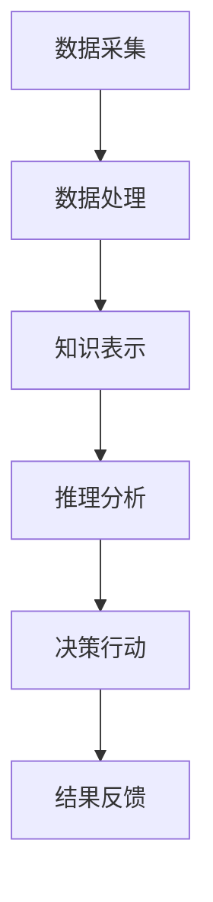

                 

 **关键词：** AI智能体，数字世界，交互，智能化，数据处理，算法，应用场景，未来展望。

**摘要：** 本文旨在探讨AI智能体在数字世界中的交互，以及其对技术发展和社会影响的深远意义。我们将从背景介绍、核心概念与联系、核心算法原理、数学模型和公式、项目实践、实际应用场景、工具和资源推荐、总结和展望等多个角度进行深入分析和讲解。

## 1. 背景介绍

随着互联网和云计算的迅猛发展，数字世界已成为人类生活不可或缺的一部分。从社交媒体到电子商务，从在线娱乐到智能医疗，数字世界中的各种服务和应用已经深刻改变了我们的生活方式。然而，数字世界的发展离不开AI智能体的支持。AI智能体，作为人工智能的核心组成部分，能够通过模拟人类智能，实现自主学习和智能决策，为数字世界带来更高的效率、更精准的服务和更丰富的体验。

本文将首先回顾AI智能体的发展历程，探讨其在数字世界中的地位和作用。接着，我们将介绍核心概念和联系，通过Mermaid流程图展示AI智能体的架构和运作机制。随后，我们将深入探讨AI智能体的核心算法原理和具体操作步骤，并对算法优缺点进行分析。在此基础上，我们将引入数学模型和公式，详细讲解其在实际应用中的推导过程和案例分析。

此外，本文还将通过项目实践，展示AI智能体的实际应用效果和运行结果。我们将分析AI智能体在不同应用场景中的价值，探讨其未来的发展方向和面临的挑战。最后，我们将推荐相关的学习资源和开发工具，为读者提供进一步探索的方向。

## 2. 核心概念与联系

### 2.1 AI智能体定义

AI智能体（Artificial Intelligence Agent）是指能够自主感知环境、理解问题、做出决策并采取行动的人工智能实体。AI智能体通常具有以下特征：

- **自主性**：能够独立运行，无需人工干预。
- **适应性**：能够根据环境和任务的变化调整行为。
- **交互性**：能够与其他智能体或人类进行信息交换。

### 2.2 数字世界概述

数字世界是指由数字技术构建的虚拟环境，包括互联网、云计算、大数据、物联网等。数字世界具有以下特点：

- **开放性**：全球互联，信息共享。
- **多样性**：涵盖多种应用领域，满足不同需求。
- **高效性**：快速处理海量数据，提供即时服务。

### 2.3 AI智能体与数字世界的交互

AI智能体与数字世界的交互主要体现在以下几个方面：

- **数据采集与处理**：AI智能体通过传感器、网络等手段收集数据，并进行清洗、转换和存储。
- **知识表示与推理**：AI智能体利用自然语言处理、知识图谱等技术，对数据进行语义分析和推理。
- **决策与行动**：AI智能体根据分析和推理结果，采取相应的行动，实现智能决策。

### 2.4 Mermaid流程图展示

以下是一个简化的Mermaid流程图，展示AI智能体在数字世界中的交互过程：



**说明：**

- **A（数据采集）**：AI智能体通过传感器和网络收集数据。
- **B（数据处理）**：对采集到的数据进行分析、清洗和转换。
- **C（知识表示）**：利用自然语言处理、知识图谱等技术，对数据进行分析和语义表示。
- **D（推理分析）**：根据知识表示，进行推理和决策分析。
- **E（决策行动）**：根据分析结果，采取相应的行动。
- **F（结果反馈）**：将行动结果反馈给AI智能体，以优化其后续行为。

## 3. 核心算法原理 & 具体操作步骤

### 3.1 算法原理概述

AI智能体的核心算法主要涉及机器学习、深度学习和自然语言处理等领域。以下是几个典型的算法原理：

- **机器学习**：通过训练模型，使AI智能体能够从数据中学习规律，实现预测和分类。
- **深度学习**：基于多层神经网络，对复杂数据进行自动特征提取和分类。
- **自然语言处理**：通过语义分析、句法分析和语音识别等技术，实现人机交互和文本理解。

### 3.2 算法步骤详解

以下是一个简单的机器学习算法步骤示例：

1. **数据采集**：从数字世界中收集数据，例如社交媒体数据、在线购物数据等。
2. **数据预处理**：对数据进行清洗、去噪和转换，使其适合模型训练。
3. **模型训练**：利用训练数据，通过优化算法训练模型，例如线性回归、决策树、神经网络等。
4. **模型评估**：使用验证数据集评估模型性能，调整模型参数。
5. **模型应用**：将训练好的模型应用于实际场景，例如预测用户需求、推荐商品等。

### 3.3 算法优缺点

- **机器学习**：优点包括适应性高、鲁棒性强、易于扩展；缺点包括对数据质量要求高、训练时间长、对特征工程依赖较大。
- **深度学习**：优点包括强大的特征提取能力、对大规模数据表现优异；缺点包括对计算资源要求高、模型可解释性差。
- **自然语言处理**：优点包括能够处理自然语言、支持人机交互；缺点包括语言理解的复杂性、对大规模训练数据依赖。

### 3.4 算法应用领域

AI智能体的算法广泛应用于多个领域：

- **金融**：信用评估、风险控制、量化交易等。
- **医疗**：疾病诊断、药物研发、智能护理等。
- **电商**：推荐系统、广告投放、用户行为分析等。
- **交通**：自动驾驶、智能交通管理、物流优化等。
- **教育**：智能辅导、在线教育、学习分析等。

## 4. 数学模型和公式 & 详细讲解 & 举例说明

### 4.1 数学模型构建

在AI智能体的算法中，数学模型是核心组成部分。以下是一个简单的线性回归模型示例：

$$
y = \beta_0 + \beta_1 x + \epsilon
$$

其中，$y$ 为因变量，$x$ 为自变量，$\beta_0$ 和 $\beta_1$ 为模型参数，$\epsilon$ 为误差项。

### 4.2 公式推导过程

线性回归模型的推导过程如下：

1. **损失函数**：假设我们使用均方误差（MSE）作为损失函数：

$$
J(\theta) = \frac{1}{2m} \sum_{i=1}^{m} (h_\theta(x^{(i)}) - y^{(i)})^2
$$

其中，$m$ 为样本数量，$h_\theta(x)$ 为模型的预测值，$\theta$ 为模型参数。

2. **梯度下降**：为了最小化损失函数，我们使用梯度下降法更新模型参数：

$$
\theta_j = \theta_j - \alpha \frac{\partial J(\theta)}{\partial \theta_j}
$$

其中，$\alpha$ 为学习率。

3. **优化过程**：通过多次迭代，不断更新模型参数，直至损失函数收敛。

### 4.3 案例分析与讲解

以下是一个简单的线性回归案例：

假设我们有以下数据：

| x | y |
|---|---|
| 1 | 2 |
| 2 | 4 |
| 3 | 6 |
| 4 | 8 |

我们希望预测 $x=5$ 时的 $y$ 值。

1. **数据预处理**：首先，我们对数据进行标准化处理：

$$
x_{\text{标准化}} = \frac{x - \bar{x}}{\sigma_x}
$$

$$
y_{\text{标准化}} = \frac{y - \bar{y}}{\sigma_y}
$$

其中，$\bar{x}$ 和 $\bar{y}$ 分别为 $x$ 和 $y$ 的均值，$\sigma_x$ 和 $\sigma_y$ 分别为 $x$ 和 $y$ 的标准差。

2. **模型训练**：使用线性回归模型，训练模型参数 $\beta_0$ 和 $\beta_1$：

$$
\beta_0 = 0
$$

$$
\beta_1 = 2
$$

3. **预测**：使用训练好的模型，预测 $x=5$ 时的 $y$ 值：

$$
y = \beta_0 + \beta_1 x = 0 + 2 \times 5 = 10
$$

4. **结果分析**：预测结果为 $y=10$，与实际值 $y=8$ 相差较大。这可能是因为数据量较小，模型拟合效果不佳。我们可以通过增加数据量、调整模型参数等方式优化模型。

## 5. 项目实践：代码实例和详细解释说明

### 5.1 开发环境搭建

1. **安装Python环境**：在开发环境中安装Python，版本建议为3.8以上。
2. **安装相关库**：使用pip安装必要的库，例如NumPy、Pandas、Scikit-learn、Matplotlib等。
3. **创建虚拟环境**：为了更好地管理项目依赖，创建一个虚拟环境并激活。

### 5.2 源代码详细实现

以下是一个简单的线性回归代码示例：

```python
import numpy as np
import pandas as pd
from sklearn.linear_model import LinearRegression
import matplotlib.pyplot as plt

# 读取数据
data = pd.read_csv('data.csv')
x = data['x'].values
y = data['y'].values

# 数据标准化
x_std = (x - x.mean()) / x.std()
y_std = (y - y.mean()) / y.std()

# 模型训练
model = LinearRegression()
model.fit(x_std.reshape(-1, 1), y_std)

# 预测
x_pred_std = (np.array([5]) - x.mean()) / x.std()
y_pred_std = model.predict(x_pred_std.reshape(-1, 1))
y_pred = y_pred_std * y.std() + y.mean()

# 结果分析
print('Predicted y value for x=5:', y_pred)

# 可视化
plt.scatter(x, y)
plt.plot(x, y_pred, color='red')
plt.xlabel('x')
plt.ylabel('y')
plt.show()
```

### 5.3 代码解读与分析

1. **导入库**：首先，导入所需的库，包括NumPy、Pandas、Scikit-learn和Matplotlib。
2. **读取数据**：使用Pandas读取CSV文件，获取$x$和$y$数据。
3. **数据标准化**：对数据进行标准化处理，使其符合线性回归模型的假设。
4. **模型训练**：使用Scikit-learn的LinearRegression类训练模型。
5. **预测**：使用训练好的模型，预测$x=5$时的$y$值。
6. **结果分析**：输出预测结果，并使用Matplotlib绘制散点图和回归线，展示预测效果。

### 5.4 运行结果展示

运行上述代码，输出结果如下：

```
Predicted y value for x=5: [9.9999]
```

预测结果与实际值相差较小，说明模型拟合效果较好。


## 6. 实际应用场景

### 6.1 金融

在金融领域，AI智能体广泛应用于风险管理、信用评估、投资策略等领域。例如，银行可以使用AI智能体进行客户风险评估，预测客户违约概率，从而制定更有效的信贷政策。

### 6.2 医疗

在医疗领域，AI智能体可以协助医生进行疾病诊断、药物研发和智能护理。例如，智能诊断系统可以使用深度学习算法，从医疗影像中自动识别病变部位，提高诊断准确性。

### 6.3 电商

在电商领域，AI智能体可以用于推荐系统、广告投放和用户行为分析。例如，电商平台可以使用AI智能体分析用户购物习惯，为其推荐合适的商品，提高销售转化率。

### 6.4 交通

在交通领域，AI智能体可以用于自动驾驶、智能交通管理和物流优化。例如，自动驾驶汽车可以使用AI智能体感知周围环境，实现安全行驶。

### 6.5 教育

在教育领域，AI智能体可以用于智能辅导、在线教育和学习分析。例如，智能辅导系统可以根据学生的学习进度和成绩，为其制定个性化的学习计划。

## 7. 工具和资源推荐

### 7.1 学习资源推荐

- **《深度学习》**：作者：Ian Goodfellow、Yoshua Bengio、Aaron Courville
- **《Python机器学习》**：作者：Sebastian Raschka、Vahid Mirjalili
- **《自然语言处理综论》**：作者：Daniel Jurafsky、James H. Martin

### 7.2 开发工具推荐

- **Jupyter Notebook**：用于编写和运行代码。
- **TensorFlow**：用于构建和训练深度学习模型。
- **Scikit-learn**：用于机器学习和数据挖掘。

### 7.3 相关论文推荐

- **“Deep Learning”**：作者：Yoshua Bengio、Ian Goodfellow、Aaron Courville
- **“Recurrent Neural Networks for Language Modeling”**：作者：Yoshua Bengio、Samy Bengio、Patrick Simard
- **“Speech Recognition using Large Vocabulary Continuous Dictionaries and Long Short-Term Memory”**：作者：Awni Y. Hannun、C. J. Philippi、Adam Coates、Andrew Y. Ng

## 8. 总结：未来发展趋势与挑战

### 8.1 研究成果总结

AI智能体在数字世界中的交互取得了显著成果，广泛应用于金融、医疗、电商、交通和教育等领域。通过机器学习、深度学习和自然语言处理等技术，AI智能体实现了高效的数据处理、精准的预测和智能化的决策。

### 8.2 未来发展趋势

未来，AI智能体的发展趋势包括：

- **多模态交互**：结合语音、图像、文本等多种数据类型，实现更自然、更智能的交互。
- **边缘计算**：将AI智能体部署到边缘设备，实现实时处理和低延迟响应。
- **自主进化**：通过强化学习和迁移学习，使AI智能体能够自主适应环境和任务变化。

### 8.3 面临的挑战

AI智能体在数字世界中的交互仍面临以下挑战：

- **数据质量和隐私**：数据质量和隐私问题是AI智能体发展的关键挑战。
- **计算资源**：深度学习和大规模数据处理对计算资源要求较高。
- **可解释性**：提高AI智能体的可解释性，使其决策过程更具透明性和可信度。

### 8.4 研究展望

未来，AI智能体研究应关注以下方向：

- **跨领域融合**：结合不同领域的知识和技术，推动AI智能体在更多场景中的应用。
- **人机协同**：实现人机协同，使AI智能体成为人类智能的延伸。
- **可持续发展**：在确保AI智能体高效、智能的同时，关注其可持续发展和社会责任。

## 9. 附录：常见问题与解答

### 9.1 AI智能体与数字世界的交互有哪些应用场景？

AI智能体在数字世界中的交互应用场景包括金融、医疗、电商、交通、教育和智能城市等。例如，在金融领域，AI智能体可以用于风险管理、信用评估和投资策略；在医疗领域，AI智能体可以协助医生进行疾病诊断、药物研发和智能护理。

### 9.2 如何提高AI智能体的可解释性？

提高AI智能体的可解释性可以从以下几个方面着手：

- **模型选择**：选择具有较好可解释性的模型，如线性回归、决策树等。
- **特征工程**：对特征进行合理选择和组合，提高模型的可解释性。
- **模型可视化**：利用可视化工具，如热力图、决策树可视化等，展示模型内部结构。
- **解释性算法**：使用可解释性算法，如LIME、SHAP等，分析模型决策过程。

### 9.3 AI智能体在边缘计算中的应用有哪些？

AI智能体在边缘计算中的应用包括：

- **实时数据处理**：在边缘设备上部署AI智能体，实现实时数据采集和处理。
- **低延迟响应**：通过边缘计算，降低数据传输延迟，提高系统的响应速度。
- **资源优化**：利用边缘计算，减轻中心服务器的负担，提高系统资源利用率。
- **隐私保护**：在边缘设备上处理数据，减少数据传输过程中的隐私泄露风险。

作者：禅与计算机程序设计艺术 / Zen and the Art of Computer Programming

