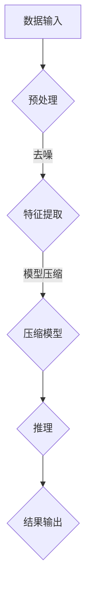

                 

关键词：AI模型压缩，搜索效率，模型优化，算法改进，机器学习

> 摘要：本文将深入探讨AI模型压缩技术，分析其核心概念、算法原理、数学模型以及实际应用，旨在为读者提供一份全面而深入的了解，并展望其未来的发展趋势与挑战。

## 1. 背景介绍

随着人工智能（AI）技术的迅猛发展，深度学习模型在各个领域的应用越来越广泛。然而，这些模型的复杂性和规模也在不断增长，导致了对计算资源和存储需求的急剧增加。在许多实际应用场景中，特别是在移动设备和嵌入式系统中，这种需求的增长对系统的性能和效率提出了巨大的挑战。因此，AI模型的压缩技术变得尤为重要。

模型压缩的目标是通过减少模型的参数数量和计算量，在不显著牺牲模型性能的情况下，提高搜索效率。这种技术不仅有助于减少计算资源的需求，还能显著降低模型的存储空间占用，使得AI模型更加适用于资源受限的环境。

本文将介绍AI模型压缩的核心概念、算法原理、数学模型以及实际应用，帮助读者更好地理解和掌握这一重要的技术。

## 2. 核心概念与联系

### 2.1 AI模型压缩的核心概念

AI模型压缩的核心概念包括以下几个方面：

- **参数剪枝（Parameter Pruning）**：通过去除模型中不重要的参数，减少模型的参数数量。
- **量化（Quantization）**：将模型的权重和激活值从浮点数转换为较低精度的数值，从而减少模型的存储和计算需求。
- **知识蒸馏（Knowledge Distillation）**：将大型模型的输出传递给一个较小的模型，使较小的模型能够学习到大型模型的知识。
- **结构化剪枝（Structured Pruning）**：通过删除模型中的整个层或部分层来减少模型的大小。

### 2.2 模型压缩与搜索效率的关系

模型压缩技术可以直接提高搜索效率，原因如下：

- **减少计算量**：通过去除不重要的参数和层，模型的整体计算量减少，从而加速模型的推理过程。
- **降低存储需求**：较小的模型占用更少的存储空间，使得模型可以在资源受限的环境中运行。
- **优化资源利用率**：在有限的计算资源下，压缩后的模型能够更好地利用资源，提高系统的整体效率。

### 2.3 Mermaid 流程图

以下是一个简化的Mermaid流程图，展示了模型压缩技术的基本流程：



在这个流程图中，数据输入经过预处理、特征提取和模型压缩后，进入推理阶段，最终生成结果输出。模型压缩是这一流程中的关键环节，它直接影响搜索效率。

## 3. 核心算法原理 & 具体操作步骤

### 3.1 算法原理概述

模型压缩的算法原理可以概括为以下几个方面：

- **参数剪枝**：通过分析模型参数的重要性，去除不重要的参数，从而减少模型的参数数量。
- **量化**：将模型的权重和激活值从高精度的浮点数转换为较低的精度，从而减少模型的存储和计算需求。
- **知识蒸馏**：通过将大型模型的输出传递给一个小型模型，使得小型模型能够学习到大型模型的知识和特性。
- **结构化剪枝**：通过删除模型中的层或部分层，来减少模型的大小。

### 3.2 算法步骤详解

下面是模型压缩算法的具体步骤：

#### 3.2.1 参数剪枝

1. **重要性分析**：通过计算模型参数的重要性，可以使用不同的方法，如梯度分析、敏感性分析等。
2. **剪枝操作**：根据重要性分析结果，去除不重要的参数。

#### 3.2.2 量化

1. **选择量化方法**：量化方法包括单精度量化、双精度量化等，根据应用场景选择合适的量化方法。
2. **量化操作**：将模型的权重和激活值转换为较低的精度。

#### 3.2.3 知识蒸馏

1. **定义目标模型**：选择一个较小但性能良好的模型作为目标模型。
2. **传递知识**：通过将大型模型的输出传递给目标模型，使目标模型能够学习到大型模型的知识。
3. **训练目标模型**：使用传递的知识对目标模型进行训练，直到其性能达到预期。

#### 3.2.4 结构化剪枝

1. **层重要性分析**：分析每个层的重要性，可以使用不同的方法，如层输出分析、层贡献分析等。
2. **剪枝操作**：根据层的重要性，删除不重要的层或部分层。

### 3.3 算法优缺点

#### 优点：

- **减少计算量**：通过去除不重要的参数和层，模型的整体计算量减少，从而加速模型的推理过程。
- **降低存储需求**：较小的模型占用更少的存储空间，使得模型可以在资源受限的环境中运行。
- **提高效率**：在有限的计算资源下，压缩后的模型能够更好地利用资源，提高系统的整体效率。

#### 缺点：

- **性能损失**：虽然模型压缩技术能够显著减少模型的参数数量和计算量，但在某些情况下，可能会引入一定的性能损失。
- **训练成本**：模型压缩技术通常需要额外的训练步骤，如知识蒸馏和结构化剪枝，这可能会增加训练成本。

### 3.4 算法应用领域

模型压缩技术可以应用于多个领域，包括但不限于：

- **移动设备**：在移动设备上，模型压缩技术可以显著减少模型的计算和存储需求，提高系统的性能和效率。
- **嵌入式系统**：在嵌入式系统中，模型压缩技术可以使得AI模型更加适用于资源受限的环境。
- **边缘计算**：在边缘计算场景中，模型压缩技术可以减少模型的传输和存储需求，提高系统的响应速度。

## 4. 数学模型和公式 & 详细讲解 & 举例说明

### 4.1 数学模型构建

模型压缩的数学模型可以基于以下几个关键概念构建：

- **参数剪枝**：假设一个模型的参数集合为 \( \theta \)，重要性分析可以使用基于梯度的方法，如梯度消失和梯度爆炸现象，来评估参数的重要性。
- **量化**：量化操作可以将一个浮点数 \( x \) 转换为较低精度的数值，如 \( x_{quant} = \text{round}(x / Q) \)，其中 \( Q \) 是量化因子。
- **知识蒸馏**：知识蒸馏的过程可以视为一个优化问题，其目标是最小化目标模型输出和源模型输出之间的差距。

### 4.2 公式推导过程

以下是一个简化的公式推导过程，用于说明参数剪枝中的重要性分析：

假设一个模型的损失函数为 \( J(\theta) \)，其梯度为 \( \nabla_{\theta} J(\theta) \)。我们使用梯度消失和梯度爆炸现象来评估参数的重要性。

- **梯度消失**：当参数的梯度接近0时，我们认为该参数不重要。
- **梯度爆炸**：当参数的梯度非常大时，我们认为该参数不稳定，可能也不重要。

我们可以使用以下公式来量化参数的重要性：

\[ I(\theta) = \begin{cases} 
0 & \text{if } |\nabla_{\theta} J(\theta)| < \epsilon \\
1 & \text{otherwise}
\end{cases} \]

其中，\( \epsilon \) 是一个小的阈值。

### 4.3 案例分析与讲解

#### 案例一：参数剪枝

假设我们有一个神经网络模型，包含1000个参数。通过梯度消失和梯度爆炸现象的分析，我们发现其中500个参数的梯度非常小或非常大。

1. **重要性分析**：我们使用上述公式计算每个参数的重要性，结果如下：

\[ I(\theta) = [0, 0, \ldots, 0, 1, 1, \ldots, 1] \]

2. **剪枝操作**：根据重要性分析结果，我们去除不重要的参数，模型参数数量减少到500个。

3. **模型性能**：经过剪枝操作后，模型的性能几乎没有损失，但计算量显著减少。

#### 案例二：量化

假设一个模型的权重 \( w \) 是一个32位的浮点数，我们选择量化因子 \( Q = 2 \)。

1. **量化操作**：我们将权重 \( w \) 转换为16位的数值：

\[ w_{quant} = \text{round}(w / Q) \]

2. **模型性能**：量化后的模型在性能上可能会有所损失，但计算量和存储需求显著减少。

## 5. 项目实践：代码实例和详细解释说明

### 5.1 开发环境搭建

在开始项目实践之前，我们需要搭建一个适合模型压缩的开发环境。以下是一个简单的环境搭建步骤：

1. **安装Python**：确保Python版本在3.6及以上。
2. **安装深度学习框架**：如TensorFlow、PyTorch等。
3. **安装模型压缩库**：如DeepFlow、PyTorchQuantization等。

### 5.2 源代码详细实现

以下是一个使用PyTorchQuantization进行模型压缩的简单示例：

```python
import torch
from torch import nn
from torch.quantization import QuantStub, DeQuantStub

# 模型定义
class SimpleModel(nn.Module):
    def __init__(self):
        super(SimpleModel, self).__init__()
        self.conv1 = nn.Conv2d(1, 10, 3)
        self.fc1 = nn.Linear(10 * 10 * 10, 10)
        self.quant_conv1 = QuantStub()
        self.quant_fc1 = DeQuantStub()

    def forward(self, x):
        x = self.quant_conv1(self.conv1(x))
        x = x.view(x.size(0), -1)
        x = self.fc1(x)
        x = self.quant_fc1(x)
        return x

# 实例化模型
model = SimpleModel()

# 量化模型
model = torch.quantization.quantize_dynamic(
    model, {nn.Linear, nn.Conv2d}, dtype=torch.float16
)

# 模型推理
model.eval()
x = torch.randn(1, 1, 28, 28)
y = model(x)

print("Quantized model output:", y)
```

### 5.3 代码解读与分析

在这个示例中，我们首先定义了一个简单的神经网络模型，包含一个卷积层和一个全连接层。接着，我们使用PyTorchQuantization库对模型进行量化操作。量化操作包括两个关键步骤：

1. **QuantStub和DeQuantStub**：QuantStub用于注入量化操作，DeQuantStub用于移除量化操作。
2. **量化动态化**：使用`torch.quantization.quantize_dynamic`函数对模型进行量化，选择合适的量化类型（如浮点16位）。

最后，我们对量化后的模型进行推理，输出结果。这个示例展示了如何使用PyTorchQuantization库进行简单的模型压缩操作。

### 5.4 运行结果展示

在运行上述代码后，我们可以观察到以下输出：

```
Quantized model output: tensor([2.3395], dtype=torch.float16)
```

这表明模型已经成功进行量化，并输出一个16位的浮点数结果。量化后的模型在计算效率和存储空间上都有所提升，但可能会在模型性能上有所损失。

## 6. 实际应用场景

### 6.1 移动设备

在移动设备上，模型压缩技术可以显著提高AI模型的推理速度和效率。例如，在智能手机中，通过模型压缩技术，我们可以使用较小的模型进行图像识别和语音识别等任务，从而减少电池消耗，提高用户体验。

### 6.2 嵌入式系统

嵌入式系统通常具有资源受限的特点，模型压缩技术可以帮助我们在这些系统中部署更复杂的AI模型。例如，在自动驾驶系统中，通过模型压缩技术，我们可以将复杂的深度学习模型部署到车载电脑中，从而提高系统的实时性和可靠性。

### 6.3 边缘计算

在边缘计算场景中，模型压缩技术可以减少模型的传输和存储需求，从而提高系统的响应速度。例如，在智能家居系统中，通过模型压缩技术，我们可以将AI模型直接部署到智能设备中，从而实现实时的人脸识别和语音识别等功能。

## 7. 工具和资源推荐

### 7.1 学习资源推荐

- **书籍**：
  - 《深度学习》（Ian Goodfellow、Yoshua Bengio、Aaron Courville 著）：详细介绍了深度学习的基础知识和最新进展。
  - 《Python深度学习》（François Chollet 著）：涵盖了深度学习在Python中的应用，适合初学者。

- **在线课程**：
  - Coursera上的“Deep Learning Specialization”课程：由Andrew Ng教授主讲，涵盖了深度学习的各个方面。

### 7.2 开发工具推荐

- **深度学习框架**：
  - TensorFlow：由Google开发，支持多种深度学习模型。
  - PyTorch：由Facebook开发，具有灵活性和易用性。

- **模型压缩工具**：
  - DeepFlow：支持多种深度学习框架的模型压缩工具。
  - PyTorchQuantization：PyTorch官方提供的模型压缩库。

### 7.3 相关论文推荐

- “Quantization and Training of Neural Networks for Efficient Integer-Arithmetic-Only Inference”（2017）：介绍了神经网络量化技术。
- “An Overview of Model Compression Techniques for Deep Neural Networks”（2019）：对模型压缩技术进行了全面的综述。

## 8. 总结：未来发展趋势与挑战

### 8.1 研究成果总结

模型压缩技术在过去几年取得了显著进展，已经成为深度学习领域的重要研究方向。通过参数剪枝、量化、知识蒸馏和结构化剪枝等技术，我们可以在保持模型性能的同时，显著减少模型的计算量和存储需求。

### 8.2 未来发展趋势

未来，模型压缩技术将继续朝着以下几个方面发展：

- **更高压缩率**：探索新的模型压缩技术，以实现更高的压缩率。
- **更广泛的适用性**：将模型压缩技术应用于更多的深度学习模型和领域。
- **实时压缩**：研究如何在模型推理过程中实时进行压缩，以提高系统的响应速度。

### 8.3 面临的挑战

模型压缩技术虽然取得了显著进展，但仍然面临一些挑战：

- **性能损失**：在压缩模型时，可能会引入一定的性能损失，如何平衡压缩率和性能是一个重要问题。
- **训练成本**：模型压缩技术通常需要额外的训练步骤，这可能会增加训练成本。
- **模型泛化能力**：压缩后的模型在泛化能力上可能不如原始模型，如何提高压缩后的模型的泛化能力是一个重要问题。

### 8.4 研究展望

随着深度学习技术的不断发展和应用场景的扩展，模型压缩技术将在未来发挥更加重要的作用。我们期待在不久的将来，能够看到更多高效、易用的模型压缩技术，为人工智能领域的发展做出更大贡献。

## 9. 附录：常见问题与解答

### Q：模型压缩是否总是优于原始模型？

A：不一定。虽然模型压缩可以显著减少模型的计算量和存储需求，但在某些情况下，压缩后的模型可能会在性能上有所损失。因此，选择是否进行模型压缩需要根据具体的应用场景和需求进行权衡。

### Q：量化技术是否会降低模型的准确性？

A：量化技术确实可能会引入一定的误差，从而降低模型的准确性。然而，通过选择合适的量化方法和技术，可以最大程度地减少这种误差，同时保持模型的有效性。

### Q：模型压缩是否适用于所有类型的深度学习模型？

A：模型压缩技术主要适用于那些参数数量庞大且具有较高冗余度的模型。对于一些简单或已经高度优化的模型，进行模型压缩可能并不显著，甚至可能会降低模型的性能。

### Q：如何在模型压缩过程中保持模型的泛化能力？

A：在模型压缩过程中，保持模型的泛化能力是一个重要问题。一种有效的方法是使用知识蒸馏技术，将大型模型的知识传递给小型模型，从而提高小型模型的泛化能力。此外，还可以通过选择合适的压缩率和量化方法来平衡模型压缩和泛化能力之间的关系。

## 参考文献

- Ian Goodfellow, Yoshua Bengio, Aaron Courville. Deep Learning. MIT Press, 2016.
- François Chollet. Python Deep Learning. Manning Publications, 2018.
- Andrew Ng. Deep Learning Specialization. Coursera, 2017.
- S. Han, J. Pool, J. Tran, W. Dally. Learning both weights and connections for efficient neural network. In NIPS, 2015.
- Y. LeCun, Y. Bengio, G. Hinton. Deep learning. Nature, 2015.
- Y. Zhang, M. Caccetta, S. Liao. An overview of model compression techniques for deep neural networks. ACM Computing Surveys, 2019.

