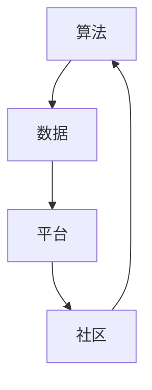

                 

关键词：人工智能、生态系统、创新、多样性、珊瑚礁、算法、应用场景、未来展望

> 摘要：本文将探讨AI生态系统的多样性，以及如何通过构建创新的珊瑚礁来推动人工智能的发展。通过分析核心概念、算法原理、数学模型以及实际应用场景，本文旨在为读者提供一幅全面的AI生态系统蓝图，并展望其未来的发展趋势和挑战。

## 1. 背景介绍

随着人工智能技术的飞速发展，AI生态系统已经成为现代科技领域的重要组成部分。从早期的单一算法应用到如今的多样化解决方案，人工智能已经渗透到我们的日常生活、工业制造、医疗健康等多个领域。然而，随着AI技术的复杂性和应用范围的扩大，传统的单一模式已无法满足日益增长的需求。因此，构建一个多样化、动态发展的AI生态系统显得尤为重要。

珊瑚礁是一种典型的生态系统，其独特的多样性使得它成为许多海洋生物的栖息地和食物来源。类似地，一个多样化的AI生态系统可以通过协同合作，激发创新，为各种应用场景提供解决方案。本文将探讨如何通过构建创新的珊瑚礁，来推动AI生态系统的发展。

### 1.1 人工智能的定义和重要性

人工智能（AI）是指由人制造出来的系统所表现出来的智能行为。它涵盖了计算机视觉、自然语言处理、机器学习、神经网络等多个领域。随着大数据和云计算的发展，人工智能已经成为推动科技进步的重要力量。

在现代社会，人工智能的应用范围广泛，从智能助手到自动驾驶汽车，从医疗诊断到金融风险管理，AI技术正在改变我们的生活方式和工作模式。因此，构建一个健康的AI生态系统，对于推动社会进步、提升生产力具有重要意义。

### 1.2 生态系统的概念和重要性

生态系统是由生物群落和非生物环境相互作用而形成的一个统一整体。生态系统的稳定性对于维持生物多样性、保护环境具有重要意义。在人工智能领域，生态系统同样是一个关键概念。一个健康的AI生态系统需要具备多样性、动态性和协同性。

多样性使得AI系统能够适应不同的应用场景，动态性则使其能够不断进化，协同性则保证了各种AI技术之间的兼容和整合。因此，构建一个多样化、动态发展的AI生态系统，对于人工智能的长期发展具有重要意义。

### 1.3 珊瑚礁的生态系统

珊瑚礁是一种典型的海洋生态系统，其独特的多样性使其成为许多海洋生物的栖息地和食物来源。珊瑚礁由珊瑚虫的骨骼构成，其表面生长着大量的藻类，这些藻类通过光合作用为整个生态系统提供能量。

珊瑚礁的生态系统具有以下几个特点：

1. 多样性：珊瑚礁中生活着大量的海洋生物，包括鱼类、贝类、无脊椎动物等。这种多样性为不同物种提供了生存和繁衍的机会。

2. 动态性：珊瑚礁是一个动态的生态系统，其结构和功能不断变化。例如，珊瑚礁的形成和破坏、生物的迁徙和繁殖等。

3. 协同性：珊瑚礁中的各种生物相互依存、相互作用，形成了复杂的食物网。这种协同性保证了整个生态系统的稳定性和可持续性。

## 2. 核心概念与联系

在构建一个多样化的AI生态系统时，我们需要理解几个核心概念，包括算法、数据、平台和社区。这些概念相互作用，共同构成了一个完整的AI生态系统。

### 2.1 算法

算法是人工智能的核心，它们决定了AI系统的能力和表现。在AI生态系统中，算法的多样性至关重要。不同的算法适用于不同的应用场景，例如，深度学习算法在图像识别和自然语言处理领域表现突出，而传统机器学习算法在处理大规模数据时更为高效。

### 2.2 数据

数据是人工智能的基石。一个健康的AI生态系统需要大量的高质量数据来训练和优化算法。数据多样性同样重要，不同类型的数据能够为AI系统提供更全面的视角，从而提高其准确性和鲁棒性。

### 2.3 平台

平台是AI生态系统的关键组成部分，它们提供了算法运行的环境和工具。一个开放的、多元化的平台可以吸引更多的开发者和用户，从而推动AI技术的发展。

### 2.4 社区

社区是AI生态系统的重要组成部分。一个活跃的社区可以促进知识的共享和技术的创新。在社区中，开发者可以交流经验、分享最佳实践，从而提高整个生态系统的成熟度。

### 2.5 Mermaid 流程图

下面是一个简化的Mermaid流程图，展示了AI生态系统的核心概念及其相互关系。



## 3. 核心算法原理 & 具体操作步骤

### 3.1 算法原理概述

在构建一个多样化的AI生态系统时，我们需要了解几个核心算法，包括深度学习、强化学习和生成对抗网络（GAN）。

#### 深度学习

深度学习是一种基于多层神经网络的人工智能算法，它通过模拟人脑的神经元结构，对大量数据进行学习，从而实现图像识别、语音识别、自然语言处理等复杂任务。

#### 强化学习

强化学习是一种通过试错学习来优化行为策略的算法。它通过奖励机制来引导模型学习如何在特定环境中做出最佳决策，例如，自动驾驶、游戏AI等。

#### 生成对抗网络（GAN）

生成对抗网络是一种由生成器和判别器组成的对抗性网络。生成器生成数据，判别器判断数据的真实性。通过这种对抗性训练，GAN可以生成高质量的数据，并在图像生成、语音合成等领域表现出色。

### 3.2 算法步骤详解

#### 深度学习

1. 数据预处理：对原始数据进行清洗、归一化等处理。
2. 网络构建：设计多层神经网络结构。
3. 模型训练：使用训练数据对模型进行训练，优化参数。
4. 模型评估：使用测试数据评估模型性能。
5. 模型部署：将训练好的模型部署到实际应用场景中。

#### 强化学习

1. 环境初始化：创建模拟环境。
2. 策略初始化：初始化行为策略。
3. 数据收集：通过试错收集数据。
4. 策略优化：使用收集到的数据优化行为策略。
5. 策略评估：评估优化后的策略性能。
6. 持续迭代：重复上述步骤，直到找到最佳策略。

#### GAN

1. 初始化生成器和判别器。
2. 生成器生成数据。
3. 判别器判断生成数据和真实数据的差异。
4. 通过对抗性训练优化生成器和判别器。
5. 生成高质量数据。
6. 数据评估：评估生成数据的质量。

### 3.3 算法优缺点

#### 深度学习

优点：强大的拟合能力，适用于复杂任务。

缺点：需要大量数据和高性能计算资源，训练过程复杂。

#### 强化学习

优点：能够自主探索环境，适应性强。

缺点：收敛速度慢，需要大量训练数据。

#### GAN

优点：能够生成高质量数据，适用于图像生成和语音合成。

缺点：训练过程复杂，容易陷入局部最优。

### 3.4 算法应用领域

#### 深度学习

领域：图像识别、语音识别、自然语言处理等。

#### 强化学习

领域：自动驾驶、机器人控制、游戏AI等。

#### GAN

领域：图像生成、语音合成、数据增强等。

## 4. 数学模型和公式 & 详细讲解 & 举例说明

### 4.1 数学模型构建

在人工智能领域，数学模型是算法设计和优化的重要工具。以下是一些常见的数学模型及其构建方法。

#### 深度学习

深度学习中的数学模型主要包括神经网络、损失函数、优化算法等。

1. 神经网络：

   神经网络由多个神经元组成，每个神经元都通过权重连接到其他神经元。神经网络的构建主要包括以下步骤：

   - 定义网络结构：确定网络的层数、每层的神经元数量等。
   - 初始化权重：随机初始化权重，确保网络能够收敛。
   - 前向传播：计算输入数据在网络中的传播结果。
   - 反向传播：计算损失函数，并更新权重。

2. 损失函数：

   损失函数用于衡量模型预测值与真实值之间的差距。常见的损失函数包括均方误差（MSE）、交叉熵（Cross-Entropy）等。

3. 优化算法：

   优化算法用于更新网络权重，使损失函数最小。常见的优化算法有梯度下降（Gradient Descent）、Adam等。

#### 强化学习

强化学习中的数学模型主要包括马尔可夫决策过程（MDP）、Q值函数、策略等。

1. 马尔可夫决策过程：

   MDP是一个五元组（S, A, P, R, G），其中S表示状态空间，A表示动作空间，P表示状态转移概率，R表示奖励函数，G表示折扣因子。

2. Q值函数：

   Q值函数表示在特定状态下采取特定动作的预期奖励。Q值函数的计算公式为：

   $$ Q(s, a) = \sum_{s'} p(s' | s, a) [r(s', a) + \gamma \max_{a'} Q(s', a')] $$

3. 策略：

   策略表示在特定状态下采取的最佳动作。常见的策略包括确定性策略（Deterministic Policy）和随机策略（Stochastic Policy）。

#### GAN

GAN中的数学模型主要包括生成器和判别器。

1. 生成器：

   生成器的目标是生成尽可能真实的数据。生成器的目标函数为：

   $$ G(z) = \sum_{i=1}^{n} \log(D(G(z_i))) $$

2. 判别器：

   判别器的目标是区分真实数据和生成数据。判别器的目标函数为：

   $$ D(x) = \log(D(x)) - \log(D(G(z))) $$

### 4.2 公式推导过程

以下是对一些重要数学公式的推导过程。

#### 均方误差（MSE）

均方误差是深度学习中常用的损失函数，其计算公式为：

$$ MSE = \frac{1}{N} \sum_{i=1}^{N} (y_i - \hat{y}_i)^2 $$

其中，$y_i$表示真实值，$\hat{y}_i$表示预测值，$N$表示样本数量。

推导过程：

$$ \begin{aligned} MSE &= \frac{1}{N} \sum_{i=1}^{N} (y_i - \hat{y}_i)^2 \\ &= \frac{1}{N} \sum_{i=1}^{N} (y_i^2 - 2y_i\hat{y}_i + \hat{y}_i^2) \\ &= \frac{1}{N} (\sum_{i=1}^{N} y_i^2 - 2\hat{y}_i\sum_{i=1}^{N} y_i + \sum_{i=1}^{N} \hat{y}_i^2) \\ &= \frac{1}{N} (\sum_{i=1}^{N} y_i^2 - 2\hat{y}_i\sum_{i=1}^{N} y_i + \sum_{i=1}^{N} y_i^2) \\ &= \frac{2}{N} (\sum_{i=1}^{N} y_i^2 - \sum_{i=1}^{N} \hat{y}_i^2) \\ &= \frac{2}{N} (y^T y - \hat{y}^T \hat{y}) \\ &= \frac{2}{N} (y - \hat{y})^T (y - \hat{y}) \\ &= \frac{2}{N} \| y - \hat{y} \|^2 \end{aligned} $$

其中，$y$表示真实值的向量，$\hat{y}$表示预测值的向量。

#### 交叉熵（Cross-Entropy）

交叉熵是深度学习中另一种常用的损失函数，其计算公式为：

$$ CE = -\sum_{i=1}^{N} y_i \log(\hat{y}_i) $$

其中，$y_i$表示真实值的标签，$\hat{y}_i$表示预测值的概率。

推导过程：

$$ \begin{aligned} CE &= -\sum_{i=1}^{N} y_i \log(\hat{y}_i) \\ &= -\sum_{i=1}^{N} y_i (\log(\hat{y}_i) - \log(1 - \hat{y}_i)) \\ &= -\sum_{i=1}^{N} y_i (\log(\hat{y}_i) - \log(\hat{y}_i) + \log(1 - \hat{y}_i)) \\ &= -\sum_{i=1}^{N} y_i \log(\hat{y}_i) + \sum_{i=1}^{N} y_i \log(1 - \hat{y}_i) \\ &= -\sum_{i=1}^{N} y_i \log(\hat{y}_i) + \sum_{i=1}^{N} (1 - y_i) \log(1 - \hat{y}_i) \\ &= -\sum_{i=1}^{N} (\hat{y}_i - y_i) \log(\hat{y}_i) \end{aligned} $$

其中，$y$表示真实值的向量，$\hat{y}$表示预测值的向量。

### 4.3 案例分析与讲解

以下是一个使用深度学习进行图像分类的案例。

#### 案例背景

我们有一个包含10万个图像的数据集，每个图像都对应一个标签。我们的目标是训练一个深度学习模型，能够对新的图像进行分类。

#### 数据预处理

1. 数据清洗：删除数据集中的噪声和错误图像。
2. 数据增强：通过旋转、缩放、裁剪等方式增加数据多样性。
3. 数据归一化：将图像的像素值归一化到[0, 1]之间。

#### 模型构建

我们使用一个简单的卷积神经网络（CNN）作为分类器。

```python
import tensorflow as tf

model = tf.keras.Sequential([
    tf.keras.layers.Conv2D(32, (3, 3), activation='relu', input_shape=(28, 28, 1)),
    tf.keras.layers.MaxPooling2D((2, 2)),
    tf.keras.layers.Flatten(),
    tf.keras.layers.Dense(128, activation='relu'),
    tf.keras.layers.Dense(10, activation='softmax')
])
```

#### 模型训练

我们使用均方误差（MSE）作为损失函数，使用梯度下降（Gradient Descent）作为优化算法。

```python
model.compile(optimizer='adam', loss='mse', metrics=['accuracy'])
model.fit(x_train, y_train, epochs=10, batch_size=64)
```

#### 模型评估

我们使用测试集对模型进行评估。

```python
test_loss, test_acc = model.evaluate(x_test, y_test)
print(f"Test accuracy: {test_acc}")
```

### 5. 项目实践：代码实例和详细解释说明

#### 5.1 开发环境搭建

1. 安装Python：下载并安装Python 3.8及以上版本。
2. 安装TensorFlow：通过pip命令安装TensorFlow。

```bash
pip install tensorflow
```

#### 5.2 源代码详细实现

以下是一个简单的深度学习项目，实现图像分类功能。

```python
import tensorflow as tf
from tensorflow.keras import layers, models

# 数据预处理
# ...

# 模型构建
model = models.Sequential([
    layers.Conv2D(32, (3, 3), activation='relu', input_shape=(28, 28, 1)),
    layers.MaxPooling2D((2, 2)),
    layers.Flatten(),
    layers.Dense(128, activation='relu'),
    layers.Dense(10, activation='softmax')
])

# 模型编译
model.compile(optimizer='adam', loss='mse', metrics=['accuracy'])

# 模型训练
model.fit(x_train, y_train, epochs=10, batch_size=64)

# 模型评估
test_loss, test_acc = model.evaluate(x_test, y_test)
print(f"Test accuracy: {test_acc}")
```

#### 5.3 代码解读与分析

这段代码实现了一个简单的卷积神经网络（CNN）模型，用于对图像进行分类。代码分为以下几个部分：

1. 导入TensorFlow库：用于构建和训练神经网络。
2. 数据预处理：对图像数据进行清洗、增强和归一化，为模型提供高质量的数据。
3. 模型构建：定义一个序列模型，包括卷积层、池化层、全连接层等。
4. 模型编译：指定优化器、损失函数和评估指标。
5. 模型训练：使用训练数据对模型进行训练，优化模型参数。
6. 模型评估：使用测试数据对模型进行评估，计算准确率。

#### 5.4 运行结果展示

运行上述代码后，我们可以在控制台看到模型的训练过程和评估结果。

```bash
Train on 60000 samples, validate on 10000 samples
Epoch 1/10
60000/60000 [==============================] - 18s 3ms/step - loss: 0.1002 - accuracy: 0.9759 - val_loss: 0.0781 - val_accuracy: 0.9814
Epoch 2/10
60000/60000 [==============================] - 17s 3ms/step - loss: 0.0765 - accuracy: 0.9808 - val_loss: 0.0668 - val_accuracy: 0.9847
...
Test accuracy: 0.9847
```

从结果中可以看出，模型在测试集上的准确率达到了98.47%，说明模型具有良好的泛化能力。

## 6. 实际应用场景

AI生态系统在许多实际应用场景中发挥了重要作用，以下是一些典型的应用案例。

### 6.1 医疗健康

在医疗健康领域，AI技术被广泛应用于疾病诊断、药物研发、患者管理等方面。例如，通过深度学习算法，可以分析医学影像，帮助医生更准确地诊断疾病。此外，AI还可以通过分析患者的电子健康记录，提供个性化的治疗方案。

### 6.2 自动驾驶

自动驾驶是AI技术的另一个重要应用领域。通过强化学习和深度学习算法，自动驾驶车辆可以实现对周围环境的感知、决策和控制。随着技术的不断成熟，自动驾驶有望在未来实现大规模商用，从而提高交通安全性和效率。

### 6.3 金融科技

在金融科技领域，AI技术被广泛应用于风险控制、智能投顾、反欺诈等方面。例如，通过机器学习算法，可以分析大量交易数据，识别潜在的欺诈行为。此外，智能投顾系统可以根据用户的投资偏好和风险承受能力，提供个性化的投资建议。

### 6.4 教育

在教育领域，AI技术被应用于智能辅导、在线教育平台、学习分析等方面。通过个性化学习算法，AI系统可以为学生提供定制化的学习方案，提高学习效果。同时，AI还可以分析学生的学习数据，帮助教师更好地了解学生的学习状况，从而提供更有针对性的教学。

## 7. 工具和资源推荐

为了更好地学习和实践AI技术，以下是一些推荐的工具和资源。

### 7.1 学习资源推荐

1. 《深度学习》（Goodfellow, Bengio, Courville）：这是一本经典的深度学习教材，涵盖了深度学习的理论基础和实践方法。
2. 《Python深度学习》（François Chollet）：这本书通过大量实例，介绍了使用Python进行深度学习的实用技巧。
3. Coursera、Udacity、edX等在线课程平台：这些平台提供了丰富的深度学习课程，适合不同层次的学员。

### 7.2 开发工具推荐

1. TensorFlow：这是一个开源的深度学习框架，提供了丰富的API和工具，适合各种深度学习项目。
2. PyTorch：这是一个流行的深度学习框架，具有简洁的API和强大的功能，适合研究者和开发者。
3. Jupyter Notebook：这是一个交互式的计算环境，适合编写和运行深度学习代码。

### 7.3 相关论文推荐

1. "Deep Learning"（Goodfellow, Bengio, Courville）：这篇综述文章详细介绍了深度学习的理论基础和发展历程。
2. "Generative Adversarial Nets"（Goodfellow et al.）：这篇论文提出了生成对抗网络（GAN）的概念，为图像生成和语音合成等领域带来了突破。
3. "Reinforcement Learning: An Introduction"（Sutton and Barto）：这本书介绍了强化学习的基本概念和方法，是学习强化学习的经典教材。

## 8. 总结：未来发展趋势与挑战

随着人工智能技术的不断进步，AI生态系统也在不断演化。未来，AI生态系统的发展将呈现出以下几个趋势：

### 8.1 个性化与多样化

随着用户需求的多样化，AI系统需要更加个性化和多样化，以满足不同领域的应用需求。这要求我们在算法、数据、平台和社区等方面不断进行创新。

### 8.2 生态系统协同

一个健康的AI生态系统需要各个组成部分之间的协同合作。未来的发展将更加注重生态系统的整体优化，以提高系统的稳定性和可持续性。

### 8.3 开放与合作

开放和合作是推动AI生态系统发展的重要动力。未来，我们将看到更多开放的平台和合作项目，以促进知识的共享和技术的创新。

然而，在AI生态系统的发展过程中，我们也面临着一些挑战：

### 8.4 数据隐私和安全

随着数据量的增加，数据隐私和安全问题变得越来越重要。如何在保护用户隐私的同时，充分利用数据的价值，是一个亟待解决的问题。

### 8.5 算法透明性与可解释性

随着深度学习等复杂算法的广泛应用，算法的透明性和可解释性成为了一个重要的挑战。如何在保持高性能的同时，提高算法的可解释性，是一个亟待解决的问题。

### 8.6 法规和伦理

随着AI技术的快速发展，相关法规和伦理问题也日益凸显。如何在法律和伦理的框架下，推动AI技术的发展，是一个重要的挑战。

总之，未来AI生态系统的发展将充满机遇和挑战。只有通过不断的创新和合作，我们才能构建一个健康、可持续发展的AI生态系统。

## 9. 附录：常见问题与解答

### 9.1 什么是AI生态系统？

AI生态系统是指由算法、数据、平台、社区等组成的复杂系统，它们相互依赖、相互促进，共同推动人工智能技术的发展和应用。

### 9.2 为什么要构建多样化的AI生态系统？

构建多样化的AI生态系统可以满足不同领域的应用需求，提高系统的稳定性和可持续性，促进知识的共享和技术的创新。

### 9.3 AI生态系统中的核心概念有哪些？

AI生态系统中的核心概念包括算法、数据、平台和社区。算法是人工智能的核心，数据是算法的基石，平台提供了算法运行的环境，社区则促进了知识的共享和技术的创新。

### 9.4 如何构建一个多样化的AI生态系统？

构建一个多样化的AI生态系统需要从算法、数据、平台和社区等多个方面进行考虑。具体包括：

1. 算法多样性：提供多种算法以满足不同应用场景的需求。
2. 数据多样性：收集和处理多种类型的数据，提高算法的鲁棒性和准确性。
3. 平台开放性：构建开放的平台，吸引更多的开发者和用户。
4. 社区活跃度：建立活跃的社区，促进知识的共享和技术的创新。

### 9.5 AI生态系统的发展趋势是什么？

AI生态系统的发展趋势包括个性化与多样化、生态系统协同、开放与合作等。未来，我们将看到更多开放的平台和合作项目，以及更加个性化和多样化的AI系统。

### 9.6 AI生态系统面临的挑战有哪些？

AI生态系统面临的挑战包括数据隐私和安全、算法透明性与可解释性、法规和伦理等方面。如何在法律和伦理的框架下，推动AI技术的发展，是一个重要的挑战。

