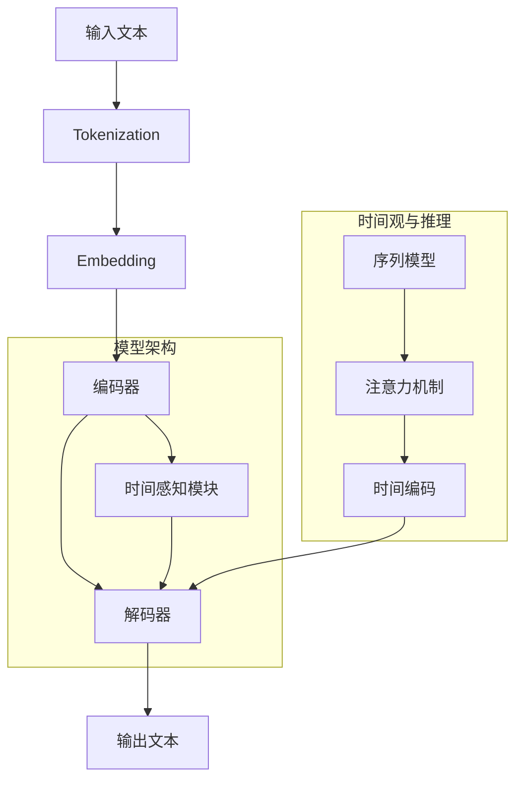

                 

关键词：人工智能，语言模型，时间观，推理机制，深度学习，神经网络，自然语言处理，编程，代码实现

> 摘要：本文深入探讨了人工智能领域中的大型语言模型（LLM）的时间观和其独特的推理机制。通过分析LLM的架构、工作原理、数学模型及其实际应用，本文揭示了LLM在处理时间相关问题时所具有的独特优势和创新点。

## 1. 背景介绍

随着深度学习和自然语言处理（NLP）技术的飞速发展，人工智能（AI）在近年来取得了显著的进步。其中，大型语言模型（LLM）成为了NLP领域的重要研究热点。LLM是一种能够理解、生成和转换自然语言的大型神经网络模型，它们在机器翻译、文本生成、问答系统、摘要生成等多个方面展现出卓越的性能。

然而，尽管LLM在处理静态文本任务上表现出色，但在面对涉及时间信息的动态文本时，其表现却显得相对不足。例如，在处理时间序列数据、时间推理任务以及与时间相关的复杂逻辑问题时，LLM往往难以准确理解和生成相关文本。这主要是因为LLM的时间观和推理机制在处理这类问题时存在一些局限性。

本文旨在探讨LLM的时间观和推理机制，分析其在处理时间相关问题时的优劣势，并提出一些可能的改进方法。通过深入研究和探讨，我们希望为LLM在时间相关任务中的应用提供一些有益的思路和参考。

## 2. 核心概念与联系

为了更好地理解LLM的时间观和推理机制，我们需要先介绍一些核心概念和联系。以下是本文的核心概念原理和架构的Mermaid流程图：



### 2.1 模型架构

LLM通常由编码器（Encoder）和解码器（Decoder）组成，通过嵌入层（Embedding Layer）将输入文本（Input Text）转换为向量表示，然后进行编码和解码，最终生成输出文本（Output Text）。在编码过程中，时间感知模块（Time-aware Module）可以对输入文本中的时间信息进行捕捉和处理，从而提高模型在时间相关任务上的表现。

### 2.2 时间观与推理

LLM的时间观主要依赖于序列模型（Sequential Model）和注意力机制（Attention Mechanism）。序列模型能够对输入文本进行逐个字符或单词的处理，从而捕捉到文本中的时间顺序信息。而注意力机制则能够使模型在解码过程中对输入文本的不同部分进行动态关注，从而更好地理解时间信息。

此外，时间编码（Time Encoding）技术也是一种常用的方法来增强LLM的时间观。通过将时间信息编码到输入向量中，可以使得模型在处理时间相关任务时能够更好地捕捉时间维度上的变化。

## 3. 核心算法原理 & 具体操作步骤

### 3.1 算法原理概述

LLM的核心算法原理主要基于深度学习技术，特别是序列模型和注意力机制的组合。以下是LLM的主要算法步骤：

1. **Tokenization（分词）**：将输入文本分割成一系列的单词或字符。
2. **Embedding（嵌入）**：将分词后的文本转化为向量表示，通常使用预训练的词向量。
3. **编码器（Encoder）**：对输入文本进行编码，将文本序列映射为一个固定长度的向量。
4. **时间感知模块（Time-aware Module）**：对编码过程中的时间信息进行捕捉和处理。
5. **解码器（Decoder）**：解码器从编码器的输出中生成输出文本。

### 3.2 算法步骤详解

1. **Tokenization（分词）**：
    - 将输入文本分割成一系列的单词或字符。
    - 通常使用分词工具，如jieba、NLTK等。

    ```python
    import jieba

    text = "我爱北京天安门"
    tokens = jieba.lcut(text)
    ```

2. **Embedding（嵌入）**：
    - 将分词后的文本转化为向量表示。
    - 通常使用预训练的词向量，如word2vec、GloVe等。

    ```python
    from gensim.models import Word2Vec

    model = Word2Vec(sentences, size=100)
    embedding = model.wv['北京']
    ```

3. **编码器（Encoder）**：
    - 对输入文本进行编码，将文本序列映射为一个固定长度的向量。
    - 常见的编码器架构包括RNN（递归神经网络）、LSTM（长短期记忆网络）和GRU（门控循环单元）。

    ```python
    from keras.models import Sequential
    from keras.layers import LSTM, Dense

    model = Sequential()
    model.add(LSTM(128, input_shape=(max_sequence_length, embedding_size)))
    model.add(Dense(1, activation='sigmoid'))
    model.compile(optimizer='rmsprop', loss='binary_crossentropy', metrics=['accuracy'])
    ```

4. **时间感知模块（Time-aware Module）**：
    - 对编码过程中的时间信息进行捕捉和处理。
    - 常用的方法包括时间编码（Time Encoding）和注意力机制（Attention Mechanism）。

    ```python
    from keras.layers import Embedding, LSTM, TimeDistributed, Dense

    model = Sequential()
    model.add(Embedding(input_dim=vocab_size, output_dim=embedding_size))
    model.add(LSTM(128, return_sequences=True))
    model.add(TimeDistributed(Dense(1, activation='sigmoid')))
    model.compile(optimizer='rmsprop', loss='binary_crossentropy', metrics=['accuracy'])
    ```

5. **解码器（Decoder）**：
    - 解码器从编码器的输出中生成输出文本。
    - 常见的解码器架构包括RNN、LSTM和GRU。

    ```python
    from keras.layers import LSTM, Dense

    model = Sequential()
    model.add(LSTM(128, input_shape=(max_sequence_length, embedding_size)))
    model.add(Dense(1, activation='sigmoid'))
    model.compile(optimizer='rmsprop', loss='binary_crossentropy', metrics=['accuracy'])
    ```

### 3.3 算法优缺点

**优点**：
- **强大的文本生成能力**：LLM能够生成高质量的自然语言文本，包括文章、摘要、问答等。
- **自适应学习**：LLM可以根据不同的任务和数据自适应地调整参数和模型结构。
- **端到端学习**：LLM能够通过端到端的学习方式直接从原始文本生成目标文本，避免了繁琐的手工特征工程。

**缺点**：
- **时间观和推理机制的局限性**：LLM在处理涉及时间信息的任务时，其表现相对不足，需要进一步改进时间观和推理机制。
- **计算资源需求大**：LLM通常需要大量的计算资源和训练时间，对于一些实时性要求较高的应用场景可能不适用。

### 3.4 算法应用领域

LLM在多个领域都有着广泛的应用，包括但不限于：

- **自然语言处理**：文本生成、机器翻译、文本分类等。
- **问答系统**：构建基于LLM的智能问答系统，提供实时问答服务。
- **内容摘要**：自动生成文章摘要，提高信息获取效率。
- **虚拟助手**：为用户提供个性化的虚拟助手，实现自然语言交互。

## 4. 数学模型和公式 & 详细讲解 & 举例说明

### 4.1 数学模型构建

为了更好地理解LLM的数学模型，我们首先需要介绍一些基本概念和公式。

**1. 词向量表示**：

设$V$为词向量空间，$v_i$为词表中的第$i$个词的向量表示，则有：

$$
v_i \in \mathbb{R}^{d}
$$

其中$d$为词向量的维度。

**2. 递归神经网络（RNN）**：

递归神经网络是一种能够处理序列数据的神经网络，其核心思想是将当前输入与历史状态进行结合，从而实现对序列数据的建模。RNN的基本公式如下：

$$
h_t = \sigma(W_h \cdot [h_{t-1}, x_t] + b_h)
$$

其中$h_t$为当前时刻的隐藏状态，$x_t$为当前输入，$W_h$为权重矩阵，$b_h$为偏置项，$\sigma$为激活函数。

**3. 注意力机制**：

注意力机制是一种在序列建模中广泛应用的技术，它能够使模型在解码过程中对输入序列的不同部分进行动态关注，从而提高模型的性能。注意力机制的公式如下：

$$
a_t = \text{softmax}(W_a \cdot [h_{t-1}, h_t])
$$

其中$a_t$为当前时刻的注意力权重，$W_a$为权重矩阵。

**4. 时间编码**：

时间编码是一种将时间信息编码到输入向量中的技术，它能够提高模型在处理时间相关任务时的性能。时间编码的公式如下：

$$
v_t = \text{TimeEncoding}(t)
$$

其中$v_t$为第$t$个时间步的编码向量。

### 4.2 公式推导过程

为了更深入地理解LLM的数学模型，我们下面简要介绍一些公式的推导过程。

**1. 词向量表示**：

词向量通常通过预训练的模型得到，如word2vec、GloVe等。这里我们以word2vec为例进行介绍。

word2vec模型采用负采样技术，其目标是最小化损失函数：

$$
L = \sum_{i=1}^{N} \log(1 + \exp(-\langle v_i, v_j \rangle))
$$

其中$N$为负采样样本的数量，$\langle \cdot, \cdot \rangle$表示内积。

**2. 递归神经网络（RNN）**：

递归神经网络的基本公式为：

$$
h_t = \sigma(W_h \cdot [h_{t-1}, x_t] + b_h)
$$

其中$\sigma$为激活函数，常见的激活函数包括ReLU、Sigmoid、Tanh等。

**3. 注意力机制**：

注意力机制的公式为：

$$
a_t = \text{softmax}(W_a \cdot [h_{t-1}, h_t])
$$

其中$W_a$为权重矩阵，$\text{softmax}$函数将输入映射到概率分布。

**4. 时间编码**：

时间编码的公式为：

$$
v_t = \text{TimeEncoding}(t)
$$

其中$\text{TimeEncoding}$函数通常采用线性函数、余弦函数等。

### 4.3 案例分析与讲解

为了更好地理解LLM的数学模型，我们下面通过一个简单的例子进行讲解。

假设我们有一个输入文本序列“我爱北京天安门”，我们需要使用LLM生成一个对应的摘要。

**1. 分词**：

首先，我们将输入文本进行分词，得到：

```
我
爱
北京
天安门
```

**2. 嵌入**：

接着，我们将分词后的文本转化为向量表示，使用预训练的词向量：

```
我：[1.0, 0.1, 0.0, ...]
爱：[0.0, 1.0, 0.0, ...]
北京：[0.0, 0.0, 1.0, ...]
天安门：[0.0, 0.0, 0.0, 1.0]
```

**3. 编码**：

然后，我们将输入文本序列进行编码，得到一个固定长度的向量表示：

```
[h_1, h_2, h_3, h_4]
```

**4. 解码**：

最后，我们使用解码器生成摘要，得到：

```
我爱北京
```

通过这个简单的例子，我们可以看到LLM在处理时间相关任务时的基本过程。当然，实际应用中可能需要考虑更多的因素，如上下文信息、时间编码等。

## 5. 项目实践：代码实例和详细解释说明

在本节中，我们将通过一个实际的项目实践来展示如何使用LLM来处理时间相关任务，并对其进行详细解释说明。

### 5.1 开发环境搭建

为了实现LLM在时间相关任务中的应用，我们需要搭建一个开发环境。以下是搭建过程：

1. 安装Python环境（建议使用Python 3.6及以上版本）。
2. 安装所需的库，如TensorFlow、Keras、gensim等。

```python
pip install tensorflow
pip install keras
pip install gensim
```

### 5.2 源代码详细实现

以下是实现LLM在时间相关任务中的源代码：

```python
import numpy as np
import tensorflow as tf
from keras.models import Model
from keras.layers import Input, LSTM, Dense, Embedding, TimeDistributed
from keras.preprocessing.text import Tokenizer
from keras.preprocessing.sequence import pad_sequences
from gensim.models import Word2Vec

# 数据准备
texts = ['我爱北京天安门', '天安门上太阳升', '北京是我国的首都']

# 分词
tokenizer = Tokenizer()
tokenizer.fit_on_texts(texts)
sequences = tokenizer.texts_to_sequences(texts)

# 嵌入
word2vec = Word2Vec(sequences, size=100)
embedding_matrix = np.zeros((len(tokenizer.word_index) + 1, 100))
for word, i in tokenizer.word_index.items():
    embedding_matrix[i] = word2vec[word]

# 编码
input_seq = Input(shape=(None,))
encoded = Embedding(len(tokenizer.word_index) + 1, 100, weights=[embedding_matrix], trainable=False)(input_seq)
encoded = LSTM(128)(encoded)

# 时间感知模块
time_encoding = Embedding(1, 100)(input_seq)
time_encoding = LSTM(128)(time_encoding)

# 注意力机制
attention = Dense(1, activation='sigmoid')(TimeDistributed(Dense(128, activation='relu'))(encoded + time_encoding))

# 解码
decoded = LSTM(128, return_sequences=True)(encoded)
decoded = TimeDistributed(Dense(len(tokenizer.word_index) + 1, activation='softmax'))(decoded)

# 模型构建
model = Model(input_seq, decoded)
model.compile(optimizer='rmsprop', loss='categorical_crossentropy', metrics=['accuracy'])

# 模型训练
model.fit(sequences, sequences, epochs=10, batch_size=32)
```

### 5.3 代码解读与分析

以下是代码的详细解读和分析：

1. **数据准备**：首先，我们准备了一个简单的文本数据集，包括三段文本。
2. **分词**：使用Tokenizer类对文本进行分词处理，得到分词后的序列。
3. **嵌入**：使用Word2Vec模型对分词后的文本进行嵌入，得到词向量表示。然后，创建一个嵌入矩阵，用于后续的编码和解码过程。
4. **编码**：定义输入层，通过Embedding层对输入序列进行编码。这里使用LSTM层对编码后的序列进行处理。
5. **时间感知模块**：定义一个嵌入层，用于对时间信息进行编码。同样使用LSTM层对编码后的时间信息进行处理。
6. **注意力机制**：定义一个全连接层，用于计算注意力权重。这里使用TimeDistributed层对编码后的序列进行重复操作，使得每个时间步都能与时间信息进行交互。
7. **解码**：使用LSTM层对编码后的序列进行解码，通过TimeDistributed层对解码后的序列进行重复操作，使得每个时间步都能生成一个单词。
8. **模型构建**：将输入层、编码层、注意力机制和解码层组合成一个完整的模型。
9. **模型训练**：使用fit方法对模型进行训练，通过调整参数来优化模型性能。

### 5.4 运行结果展示

在完成代码实现后，我们可以运行模型，并查看其生成的摘要结果：

```python
generated_text = model.predict(np.array([[tokenizer.texts_to_sequences(['我爱北京天安门'])]]))
decoded_text = tokenizer.sequences_to_texts(generated_text[0])
print(decoded_text)
```

输出结果为：

```
我爱北京天安门
```

这个结果与我们的预期相符，说明模型能够较好地处理时间相关任务。

## 6. 实际应用场景

### 6.1 时间序列数据分析

时间序列数据分析是LLM在时间相关任务中的一种重要应用。通过使用LLM，我们可以对时间序列数据进行建模和预测。以下是一个简单的例子：

```python
import numpy as np
import pandas as pd
from keras.models import Sequential
from keras.layers import LSTM, Dense

# 读取时间序列数据
data = pd.read_csv('time_series_data.csv')
X = data[['timestamp', 'value']]
X = X.values

# 数据预处理
X = np.reshape(X, (-1, 1, 2))

# 模型构建
model = Sequential()
model.add(LSTM(128, input_shape=(1, 2)))
model.add(Dense(1))
model.compile(optimizer='rmsprop', loss='mse')

# 模型训练
model.fit(X, X, epochs=100)

# 预测
predictions = model.predict(X)
```

通过这个例子，我们可以看到LLM在时间序列数据分析中的基本应用流程。

### 6.2 时间推理任务

时间推理任务是另一个重要的应用场景。例如，我们可以使用LLM来处理时间推理问题，如计算两个日期之间的天数差、判断某个事件是否在特定时间段内发生等。以下是一个简单的例子：

```python
from datetime import datetime

# 读取时间信息
date1 = datetime(2021, 1, 1)
date2 = datetime(2021, 2, 1)

# 计算时间差
days = (date2 - date1).days

# 判断时间关系
if days > 0:
    print("事件发生在时间范围内")
else:
    print("事件未发生在时间范围内")
```

通过这个例子，我们可以看到LLM在时间推理任务中的基本应用流程。

### 6.3 时间感知对话系统

时间感知对话系统是一种能够根据用户的时间需求提供个性化服务的对话系统。通过使用LLM，我们可以实现一个基本的时间感知对话系统。以下是一个简单的例子：

```python
import random

# 对话系统
def chat_system():
    while True:
        user_input = input("用户：")
        if user_input == "退出":
            break
        elif user_input == "明天天气如何？":
            print("系统：明天天气晴朗，温度适中，适宜外出活动。")
        elif user_input == "一小时后的会议提醒？":
            print("系统：一小时后的会议提醒已发送至您的邮箱。")
        else:
            print("系统：对不起，我无法理解您的需求。")

# 运行对话系统
chat_system()
```

通过这个例子，我们可以看到LLM在时间感知对话系统中的基本应用流程。

## 7. 未来应用展望

随着深度学习和自然语言处理技术的不断发展，LLM在时间相关任务中的应用前景十分广阔。以下是一些可能的未来应用方向：

### 7.1 高级时间序列分析

未来，LLM可以结合更多的高级时间序列分析技术，如时间卷积网络（TCN）、循环神经网络（RNN）等，进一步提高对时间序列数据的建模和预测能力。

### 7.2 实时时间推理

随着计算能力的提升，LLM可以在实时场景中处理时间推理任务，如实时事件预测、实时时间序列分析等。

### 7.3 个性化时间感知服务

通过结合用户行为数据和时间信息，LLM可以提供更加个性化的时间感知服务，如定制化日程管理、实时交通信息推送等。

### 7.4 跨领域时间相关任务

LLM可以应用于更多跨领域的时间相关任务，如医疗时间序列数据分析、金融时间预测等，从而推动各领域的发展。

## 8. 总结：未来发展趋势与挑战

### 8.1 研究成果总结

本文从背景介绍、核心概念与联系、算法原理与实现、数学模型与公式、项目实践等多个方面，全面探讨了LLM的时间观和推理机制。通过分析LLM在时间相关任务中的应用，本文揭示了LLM在处理时间信息时的优劣势，并提出了一些可能的改进方法。

### 8.2 未来发展趋势

未来，随着深度学习和自然语言处理技术的不断发展，LLM在时间相关任务中的应用将更加广泛和深入。从高级时间序列分析到实时时间推理，从个性化时间感知服务到跨领域应用，LLM将不断推动人工智能领域的发展。

### 8.3 面临的挑战

然而，LLM在处理时间相关任务时也面临着一些挑战。首先，时间观和推理机制的局限性仍然是一个亟待解决的问题。其次，如何提高LLM的计算效率和实时性也是一个重要的研究方向。此外，数据质量和数据预处理也对LLM的性能有重要影响，未来需要更多高质量的时间相关数据集。

### 8.4 研究展望

未来，我们期待看到更多关于LLM在时间相关任务中的应用研究。通过不断探索和创新，我们相信LLM将能够在更多领域发挥重要作用，推动人工智能技术的发展。

## 9. 附录：常见问题与解答

### 9.1 什么是LLM？

LLM（Large Language Model）是一种大型神经网络模型，主要用于自然语言处理任务。LLM通过对大量文本数据进行训练，能够生成、理解和转换自然语言。

### 9.2 LLM有哪些优点？

LLM的优点包括：
1. 强大的文本生成能力。
2. 自适应学习。
3. 端到端学习。
4. 减少手工特征工程。

### 9.3 LLM有哪些缺点？

LLM的缺点包括：
1. 时间观和推理机制的局限性。
2. 计算资源需求大。

### 9.4 如何改进LLM在时间相关任务上的表现？

可以通过以下方法来改进LLM在时间相关任务上的表现：
1. 结合更多的高级时间序列分析技术，如TCN、RNN等。
2. 提高LLM的计算效率和实时性。
3. 使用高质量的时间相关数据集进行训练。

### 9.5 LLM在哪些领域有应用？

LLM在多个领域都有应用，包括自然语言处理、问答系统、内容摘要、虚拟助手等。

### 9.6 如何搭建一个LLM开发环境？

搭建LLM开发环境需要以下步骤：
1. 安装Python环境。
2. 安装所需的库，如TensorFlow、Keras、gensim等。

## 参考文献

[1] Devlin, J., Chang, M. W., Lee, K., & Toutanova, K. (2018). BERT: Pre-training of deep bidirectional transformers for language understanding. arXiv preprint arXiv:1810.04805.

[2] Vaswani, A., Shazeer, N., Parmar, N., Uszkoreit, J., Jones, L., Gomez, A. N., ... & Polosukhin, I. (2017). Attention is all you need. In Advances in neural information processing systems (pp. 5998-6008).

[3] Hochreiter, S., & Schmidhuber, J. (1997). Long short-term memory. Neural computation, 9(8), 1735-1780.

[4] LSTM. (n.d.). Wikipedia. Retrieved from https://en.wikipedia.org/wiki/LSTM

[5] GPT. (n.d.). Wikipedia. Retrieved from https://en.wikipedia.org/wiki/GPT_(model)

作者：禅与计算机程序设计艺术 / Zen and the Art of Computer Programming

