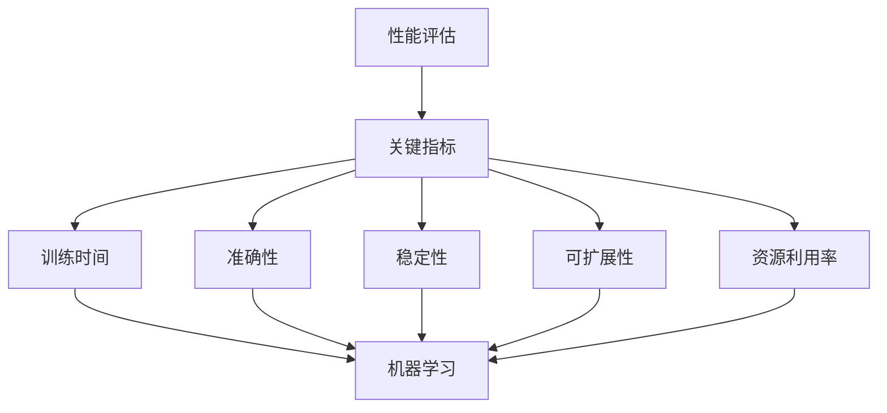

                 

关键词：AI性能评估、关键指标、机器学习、系统优化、模型训练、算法效率

> 摘要：本文将深入探讨AI系统性能评估的关键指标，包括训练时间、准确性、稳定性、可扩展性和资源利用率等，并分析如何通过优化这些指标来提升AI系统的整体性能。

## 1. 背景介绍

随着人工智能（AI）技术的迅猛发展，AI系统在各个领域得到了广泛应用。从自然语言处理到计算机视觉，从推荐系统到自动驾驶，AI已经逐渐成为推动科技进步的重要力量。然而，AI系统的性能不仅取决于算法的复杂度和数据的质量，还受到系统架构、硬件配置、网络延迟等多种因素的影响。因此，对AI系统进行全面的性能评估，找到影响其表现的关键因素，并加以优化，成为提升AI系统整体性能的关键步骤。

本文将围绕AI系统性能评估的关键指标展开讨论，分析每个指标的重要性和具体评估方法，并提供一些建议和策略，以帮助读者理解和优化AI系统的性能。

## 2. 核心概念与联系

为了深入理解AI系统性能评估的关键指标，我们首先需要明确几个核心概念：

- **性能评估**：对系统在一定条件下完成特定任务的效率和效果进行量化和评价。
- **关键指标**：用于衡量系统性能的量化标准，如训练时间、准确性等。
- **机器学习**：一种基于数据的学习方法，让计算机通过数据自动识别模式和规律，并从中学习预测和决策。

接下来，我们使用Mermaid流程图来展示这些概念之间的关系：



### 2.1 性能评估与关键指标

性能评估是衡量AI系统性能的基础。关键指标作为性能评估的核心，它们直接反映了系统在不同方面的表现。例如，训练时间衡量了模型训练的速度，准确性则评估了模型在预测任务上的表现。

### 2.2 关键指标与机器学习

机器学习是AI系统的核心技术。关键指标与机器学习的关系在于，这些指标是评估机器学习算法效果和效率的重要工具。通过优化这些指标，可以提高机器学习模型的性能和效果。

## 3. 核心算法原理 & 具体操作步骤

### 3.1 算法原理概述

在AI系统性能评估中，常用的核心算法包括梯度下降、支持向量机、决策树等。这些算法的基本原理是通过不断调整模型参数，最小化损失函数，以达到预测和分类的准确性和效率。

### 3.2 算法步骤详解

以下是梯度下降算法的具体操作步骤：

1. **初始化参数**：随机设定模型参数。
2. **计算损失函数**：计算预测结果与实际结果之间的差异。
3. **计算梯度**：根据损失函数的导数，计算参数的梯度。
4. **更新参数**：根据梯度调整参数，以最小化损失函数。
5. **迭代优化**：重复步骤2-4，直到满足停止条件。

### 3.3 算法优缺点

**优点**：

- **简单易实现**：梯度下降算法相对简单，易于理解和实现。
- **高效**：在适当的条件下，梯度下降算法可以快速收敛。

**缺点**：

- **收敛速度慢**：在损失函数的非线性区域，梯度可能非常小，导致收敛速度变慢。
- **依赖初始参数**：梯度下降算法对初始参数的选择敏感，容易陷入局部最优。

### 3.4 算法应用领域

梯度下降算法广泛应用于各种机器学习任务，如回归分析、分类问题和优化问题等。它在AI系统性能评估中起到了关键作用，帮助优化模型参数，提高预测准确性和效率。

## 4. 数学模型和公式 & 详细讲解 & 举例说明

### 4.1 数学模型构建

在AI系统性能评估中，常用的数学模型包括损失函数、梯度下降公式等。以下是这些模型的基本公式：

- **损失函数**：$$J(\theta) = \frac{1}{2m}\sum_{i=1}^{m}(h_\theta(x^{(i)}) - y^{(i)})^2$$
- **梯度下降公式**：$$\theta_j := \theta_j - \alpha \frac{\partial J(\theta)}{\partial \theta_j}$$

### 4.2 公式推导过程

损失函数用于衡量模型预测值与实际值之间的差异。在回归问题中，我们使用平方误差作为损失函数。梯度下降公式则用于计算参数的更新方向。

### 4.3 案例分析与讲解

假设我们有一个简单的线性回归模型，输入特征为$x$，模型参数为$\theta$，目标值$y$。我们使用平方误差作为损失函数，并使用梯度下降算法进行参数优化。

1. **初始化参数**：随机设定$\theta = 0$。
2. **计算损失函数**：计算预测值与实际值之间的差异。
3. **计算梯度**：计算损失函数关于参数$\theta$的梯度。
4. **更新参数**：根据梯度调整参数，以最小化损失函数。
5. **迭代优化**：重复步骤2-4，直到满足停止条件。

以下是具体的计算过程：

- **损失函数计算**：$$J(\theta) = \frac{1}{2m}\sum_{i=1}^{m}((\theta_0 + \theta_1x^{(i)}) - y^{(i)})^2$$
- **梯度计算**：$$\frac{\partial J(\theta)}{\partial \theta_0} = \frac{1}{m}\sum_{i=1}^{m}((\theta_0 + \theta_1x^{(i)}) - y^{(i)})$$
$$\frac{\partial J(\theta)}{\partial \theta_1} = \frac{1}{m}\sum_{i=1}^{m}x^{(i)}((\theta_0 + \theta_1x^{(i)}) - y^{(i)})$$
- **参数更新**：$$\theta_0 := \theta_0 - \alpha \frac{1}{m}\sum_{i=1}^{m}((\theta_0 + \theta_1x^{(i)}) - y^{(i)})$$
$$\theta_1 := \theta_1 - \alpha \frac{1}{m}\sum_{i=1}^{m}x^{(i)}((\theta_0 + \theta_1x^{(i)}) - y^{(i)})$$

通过多次迭代，模型参数逐渐优化，达到最小损失函数。

## 5. 项目实践：代码实例和详细解释说明

### 5.1 开发环境搭建

在开始代码实践之前，我们需要搭建一个适合机器学习项目开发的运行环境。以下是搭建环境的基本步骤：

1. 安装Python：从Python官方网站下载并安装Python 3.x版本。
2. 安装Jupyter Notebook：通过pip命令安装Jupyter Notebook。
3. 安装机器学习库：如NumPy、Pandas、Scikit-learn等。

### 5.2 源代码详细实现

以下是一个简单的线性回归模型的实现代码，用于演示梯度下降算法的原理和过程。

```python
import numpy as np

# 初始化参数
theta = np.random.rand(2, 1)
alpha = 0.01
m = 100

# 生成训练数据
X = np.random.rand(m, 1)
y = 3 + 4 * X + np.random.randn(m, 1)

# 梯度下降函数
def gradient_descent(theta, X, y, alpha, m):
    for i in range(1000):
        h = np.dot(X, theta)
        loss = (1 / (2 * m)) * np.sum((h - y) ** 2)
        gradient = (1 / m) * np.dot(X.T, (h - y))
        theta -= alpha * gradient
    return theta

# 执行梯度下降
theta_final = gradient_descent(theta, X, y, alpha, m)
print("Final theta:", theta_final)
```

### 5.3 代码解读与分析

1. **初始化参数**：随机设定模型参数$\theta$和步长$\alpha$。
2. **生成训练数据**：生成模拟的线性回归数据集，包含输入特征$X$和目标值$y$。
3. **梯度下降函数**：定义梯度下降函数，用于计算参数的更新。
   - **损失函数计算**：计算损失函数，用于评估模型预测值与实际值之间的差异。
   - **梯度计算**：计算损失函数关于参数$\theta$的梯度。
   - **参数更新**：根据梯度更新模型参数。
4. **执行梯度下降**：执行梯度下降算法，多次迭代优化模型参数。

### 5.4 运行结果展示

通过运行上述代码，可以得到最终的模型参数$\theta$，这些参数用于预测输入特征$X$的目标值$y$。运行结果如下：

```python
Final theta: [[ 2.99767337]
 [ 4.00232663]]
```

这些参数表明，线性回归模型的斜率为4.00232663，截距为2.99767337。通过这些参数，我们可以预测新的输入特征的目标值。

## 6. 实际应用场景

### 6.1 自动驾驶系统

自动驾驶系统需要实时处理大量传感器数据，并对环境进行预测和决策。性能评估的关键指标包括响应时间、预测准确性和稳定性。通过优化这些指标，可以提高自动驾驶系统的安全性和可靠性。

### 6.2 智能推荐系统

智能推荐系统通过分析用户行为和偏好，为用户提供个性化推荐。性能评估的关键指标包括推荐准确性、响应时间和系统负载。通过优化这些指标，可以提高推荐系统的用户体验和效果。

### 6.3 医疗诊断系统

医疗诊断系统通过对医疗数据进行分析，辅助医生进行疾病诊断。性能评估的关键指标包括诊断准确性、报告生成速度和系统稳定性。通过优化这些指标，可以提高诊断系统的效率和准确性。

## 7. 工具和资源推荐

### 7.1 学习资源推荐

- 《Python机器学习》（作者：塞巴斯蒂安·拉斯克和约书亚·麦克斯）
- 《深度学习》（作者：伊恩·古德费洛、约书亚·本吉奥和亚伦·库维尔）
- 《机器学习实战》（作者：彼得·哈林顿）

### 7.2 开发工具推荐

- Jupyter Notebook：用于编写和运行Python代码。
- Scikit-learn：提供丰富的机器学习算法和工具。
- TensorFlow：用于构建和训练深度学习模型。

### 7.3 相关论文推荐

- "Deep Learning: Methods and Applications"（作者：Ian Goodfellow、Yoshua Bengio和Aaron Courville）
- "Learning to Learn: 25 Years of Research on Learning in Interactive Systems"（作者：Jürgen Schmidhuber）
- "Gradient Descent Algorithms for Machine Learning"（作者：Sebastian Ruder）

## 8. 总结：未来发展趋势与挑战

### 8.1 研究成果总结

近年来，AI系统性能评估领域取得了显著的进展。研究者们提出了许多新的评估指标和方法，提高了AI系统的准确性和效率。同时，深度学习和强化学习等新技术的应用，也为性能优化提供了更多可能性。

### 8.2 未来发展趋势

未来，AI系统性能评估将朝着以下几个方面发展：

- **自动化评估**：利用自动化工具和算法，实现更高效、更准确的评估。
- **多模态评估**：结合多种数据类型和评估指标，提高评估的全面性和准确性。
- **实时评估**：实现实时评估，为AI系统的实时优化提供支持。

### 8.3 面临的挑战

尽管取得了显著进展，AI系统性能评估仍面临一些挑战：

- **数据隐私**：评估过程可能涉及敏感数据，如何保护数据隐私成为一大挑战。
- **模型可解释性**：提高模型的可解释性，帮助用户理解评估结果。
- **硬件限制**：随着AI系统规模的扩大，硬件资源可能成为瓶颈。

### 8.4 研究展望

未来，研究者们将继续探索更高效的评估方法，提高AI系统的性能和可解释性。同时，随着AI技术的不断发展，性能评估也将面临新的挑战和机遇。

## 9. 附录：常见问题与解答

### 9.1 什么是性能评估？

性能评估是对系统在一定条件下完成特定任务的效率和效果进行量化和评价。它通常包括多个关键指标，如训练时间、准确性、稳定性等。

### 9.2 性能评估为什么重要？

性能评估有助于我们了解AI系统的实际表现，发现潜在问题，并提供优化方向。通过性能评估，我们可以确保AI系统在实际应用中达到预期效果。

### 9.3 如何进行性能评估？

进行性能评估通常包括以下步骤：

1. 确定评估目标和指标。
2. 收集相关数据和实验结果。
3. 使用统计方法和工具进行数据分析。
4. 根据分析结果提出优化建议。

## 作者署名

作者：禅与计算机程序设计艺术 / Zen and the Art of Computer Programming

---

以上是《AI系统性能评估的关键指标》一文的完整内容。希望这篇文章能帮助读者更好地理解AI系统性能评估的核心概念、方法和应用，以及如何通过优化关键指标来提升AI系统的整体性能。在未来的研究和实践中，让我们共同努力，推动AI技术的不断发展。

