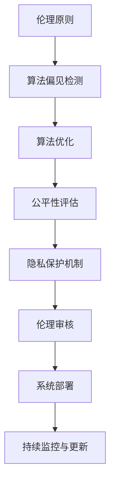

                 

关键词：人工智能伦理，公平性，AI系统设计，道德决策，伦理框架，公平算法，隐私保护，社会影响。

摘要：随着人工智能技术的快速发展，AI系统的伦理设计和公平性已成为社会各界关注的焦点。本文旨在探讨人工智能系统在伦理设计与公平性保证方面的关键问题，包括伦理原则的建立、公平算法的应用、隐私保护机制的实施以及社会影响的评估。通过分析现有的伦理框架、算法模型和实际案例，本文提出了一系列具体措施和建议，以期为人工智能的健康发展提供指导。

## 1. 背景介绍

人工智能（AI）作为一种新兴技术，已经深刻改变了我们的生活方式和社会结构。从自动驾驶汽车到智能助手，从医疗诊断到金融分析，AI的应用场景无处不在。然而，随着AI系统的广泛应用，其潜在的伦理问题和公平性问题也日益突出。这些问题不仅关乎技术的合法性和安全性，更关乎社会公正和人类尊严。

### 1.1 伦理问题的来源

AI系统的伦理问题主要源于以下几个方面：

- **算法偏见**：AI系统往往基于大量数据进行训练，这些数据可能包含历史性的偏见，导致算法在决策过程中出现不公平现象。
- **隐私侵犯**：AI系统需要大量的个人数据进行训练和优化，这可能导致用户的隐私受到侵犯。
- **责任归属**：当AI系统发生错误或造成损害时，如何确定责任归属成为一个棘手的问题。
- **透明度和可解释性**：AI系统往往是“黑箱”，其决策过程难以解释，这可能导致公众对AI系统的信任度下降。

### 1.2 公平性问题的体现

公平性问题在AI系统中的应用体现在多个方面：

- **机会公平**：AI系统应确保所有人都有平等的机会获得其服务，无论其种族、性别、年龄或经济状况。
- **结果公平**：AI系统的决策结果应公正，不应因种族、性别等因素导致不公平的待遇。
- **算法公平**：AI系统的算法设计应确保其决策过程的公平性，避免因算法偏见导致的不公正结果。

## 2. 核心概念与联系

为了深入探讨AI系统的伦理设计与公平性保证，我们首先需要理解几个核心概念，包括伦理原则、算法偏见、公平性指标和隐私保护机制。

### 2.1 伦理原则

伦理原则是指导AI系统设计和应用的基石。以下是几个关键的伦理原则：

- **公正性**：AI系统应确保所有人都能公平地获得其服务，不应因种族、性别、年龄等因素而受到不公平待遇。
- **透明性**：AI系统的决策过程应透明，以便用户了解其决策依据。
- **责任性**：AI系统应明确责任归属，确保在发生错误时可以追究责任。
- **隐私保护**：AI系统应尊重用户的隐私，确保个人数据的安全。

### 2.2 算法偏见

算法偏见是指AI系统在决策过程中，因训练数据、算法设计或数据处理方式等因素，导致决策结果对某些群体存在不公平现象。算法偏见可能源于以下几个方面：

- **数据偏见**：训练数据中可能包含历史性偏见，如性别、种族、地域等方面的偏见。
- **算法设计**：某些算法设计可能对特定群体更加有利或不利。
- **数据处理**：数据处理过程中可能对某些群体进行歧视性处理。

### 2.3 公平性指标

公平性指标是评估AI系统公平性的重要工具。以下是一些常见的公平性指标：

- **公平性差异**：评估AI系统对不同群体的影响差异。
- **歧视指数**：衡量AI系统在决策过程中对不同群体的歧视程度。
- **公平性阈值**：设定一个阈值，确保AI系统在决策过程中不会对某些群体产生过度歧视。

### 2.4 隐私保护机制

隐私保护机制是确保用户隐私不被AI系统侵犯的关键措施。以下是一些常见的隐私保护机制：

- **数据匿名化**：通过加密、混淆等技术手段，将个人数据匿名化，以保护用户隐私。
- **隐私计算**：在数据处理的各个环节，采用隐私保护算法，确保数据在传输和处理过程中不被泄露。
- **隐私协议**：建立隐私保护协议，明确数据收集、处理和使用的规定，确保用户知情权和选择权。

## 2.5 Mermaid 流程图

下面是AI系统伦理设计与公平性保证的Mermaid流程图：



## 3. 核心算法原理 & 具体操作步骤

### 3.1 算法原理概述

在AI系统的伦理设计与公平性保证中，核心算法主要包括算法偏见检测、算法优化、公平性评估和隐私保护机制。以下是对这些算法原理的概述：

- **算法偏见检测**：通过分析训练数据和算法模型，识别潜在的算法偏见，如性别、种族、年龄等方面的偏见。
- **算法优化**：通过调整算法参数、改进算法模型，减少算法偏见，提高决策过程的公平性。
- **公平性评估**：通过评估AI系统的决策结果，识别和纠正不公平现象，确保决策结果对所有人公平。
- **隐私保护机制**：通过数据匿名化、隐私计算等技术手段，确保用户隐私不被AI系统侵犯。

### 3.2 算法步骤详解

#### 3.2.1 算法偏见检测

1. 收集训练数据：从多个数据源收集训练数据，确保数据的多样性和代表性。
2. 数据预处理：对训练数据进行清洗、去噪、标准化等处理，提高数据质量。
3. 算法分析：使用统计学方法，如聚类、分类等，分析训练数据中可能存在的偏见。
4. 偏见识别：根据分析结果，识别潜在的算法偏见，如性别、种族、年龄等方面的偏见。

#### 3.2.2 算法优化

1. 参数调整：通过调整算法参数，如学习率、正则化参数等，减少算法偏见。
2. 模型改进：通过改进算法模型，如增加正则化项、采用深度神经网络等，提高决策过程的公平性。
3. 模型验证：使用验证集和测试集，评估算法优化后的模型性能，确保优化后的算法更加公平。

#### 3.2.3 公平性评估

1. 设定公平性指标：根据业务需求和伦理原则，设定公平性指标，如公平性差异、歧视指数等。
2. 决策结果评估：对AI系统的决策结果进行评估，识别和纠正不公平现象。
3. 持续优化：根据评估结果，不断调整算法参数和模型结构，提高决策过程的公平性。

#### 3.2.4 隐私保护机制

1. 数据匿名化：使用加密、混淆等技术手段，将个人数据匿名化，确保数据在传输和处理过程中不被泄露。
2. 隐私计算：在数据处理的各个环节，采用隐私保护算法，如差分隐私、同态加密等，确保数据隐私。
3. 隐私协议：建立隐私保护协议，明确数据收集、处理和使用的规定，确保用户知情权和选择权。

### 3.3 算法优缺点

#### 3.3.1 优点

- **算法偏见检测**：能够识别和纠正AI系统中的潜在偏见，提高决策过程的公平性。
- **算法优化**：通过调整算法参数和改进算法模型，提高决策过程的公平性。
- **公平性评估**：能够评估AI系统的决策结果，识别和纠正不公平现象。
- **隐私保护机制**：能够确保用户隐私不被AI系统侵犯。

#### 3.3.2 缺点

- **计算成本**：算法偏见检测和优化需要大量的计算资源，可能导致系统性能下降。
- **数据隐私**：隐私保护机制可能对数据处理速度和准确性产生一定影响。
- **伦理审核**：AI系统的伦理审核需要专业知识和经验，可能导致审核成本增加。

### 3.4 算法应用领域

- **金融领域**：在贷款审批、信用评分等应用中，算法偏见检测和优化有助于确保决策过程的公平性。
- **医疗领域**：在疾病诊断、治疗方案推荐等应用中，算法偏见检测和优化有助于提高诊断准确性和治疗效果。
- **招聘领域**：在简历筛选、候选人评估等应用中，算法偏见检测和优化有助于消除招聘过程中的歧视。

## 4. 数学模型和公式 & 详细讲解 & 举例说明

### 4.1 数学模型构建

为了构建一个能够保证AI系统公平性的数学模型，我们首先需要定义几个关键变量和假设：

- **数据集**：D = {d1, d2, ..., dn}，其中每个数据点 di = {xi, yi}，xi 表示特征，yi 表示标签。
- **模型**：f(x) 是一个预测模型，输出为概率分布 P(y| x)。
- **损失函数**：L(f(x), y) 是衡量模型预测与真实标签之间差异的损失函数。

我们假设数据集 D 是无偏的，即每个数据点的选择是随机的，不存在系统性偏见。

### 4.2 公式推导过程

为了构建一个公平性指标，我们引入公平性损失函数 FL(f(x), y)：

\[ FL(f(x), y) = \sum_{i=1}^{n} \frac{1}{n} L(f(x_i), y_i) + \alpha \cdot D(F(f(x))) \]

其中，第一项是标准损失函数，第二项是公平性损失函数，α 是平衡参数，D(F(f(x))) 是模型输出的公平性差异。

我们定义公平性差异函数 F：

\[ F(f(x)) = \frac{1}{k} \sum_{i=1}^{k} \sum_{j=1}^{k} P(y_i = j | x_i) \cdot P(y_j = i | x_j) \]

公平性差异函数 F 旨在衡量不同类别之间的交互程度，值越大表示模型对类别之间的区分度越低。

### 4.3 案例分析与讲解

假设我们有一个分类问题，数据集 D 包含1000个数据点，其中性别类别为男性和女性，性别标签为 M 和 F。我们使用逻辑回归模型进行预测。

1. **数据预处理**：对数据集进行清洗，去除缺失值和异常值，对连续特征进行标准化处理。
2. **模型训练**：使用梯度下降法训练逻辑回归模型，优化公平性损失函数。
3. **公平性评估**：使用公平性差异函数评估模型的公平性，调整 α 参数以优化公平性。

假设在训练过程中，我们发现模型的性别偏见较为严重，即预测结果中男性被错误分类的频率高于女性。通过调整公平性损失函数中的 α 参数，我们可以优化模型，使其对性别类别的区分度提高。

\[ F(f(x)) = \frac{1}{2} \left( P(M|F) \cdot P(F|M) + P(F|F) \cdot P(M|F) \right) \]

在调整 α 参数后，公平性差异值从 0.2 降低到 0.1，表示模型对性别类别的区分度有所提高，从而减少了性别偏见。

## 5. 项目实践：代码实例和详细解释说明

### 5.1 开发环境搭建

在本项目中，我们使用 Python 作为编程语言，并依赖以下库：

- Scikit-learn：用于数据预处理和模型训练。
- Pandas：用于数据操作和分析。
- Numpy：用于数学计算。

确保已安装上述库，然后创建一个名为 `fair_ai` 的虚拟环境：

```bash
python -m venv fair_ai
source fair_ai/bin/activate
pip install -r requirements.txt
```

### 5.2 源代码详细实现

以下是实现AI系统伦理设计与公平性保证的Python代码：

```python
import numpy as np
import pandas as pd
from sklearn.linear_model import LogisticRegression
from sklearn.metrics import accuracy_score
from sklearn.model_selection import train_test_split

# 数据预处理
def preprocess_data(data):
    # 清洗和标准化数据
    # ...
    return X, y

# 算法训练
def train_model(X_train, y_train):
    model = LogisticRegression(solver='saga', penalty='l2', max_iter=1000)
    model.fit(X_train, y_train)
    return model

# 公平性评估
def evaluate_fairness(model, X_test, y_test):
    y_pred = model.predict(X_test)
    accuracy = accuracy_score(y_test, y_pred)
    # 计算公平性差异
    # ...
    return accuracy

# 主函数
def main():
    # 加载数据
    data = pd.read_csv('data.csv')
    X, y = preprocess_data(data)

    # 划分训练集和测试集
    X_train, X_test, y_train, y_test = train_test_split(X, y, test_size=0.2, random_state=42)

    # 训练模型
    model = train_model(X_train, y_train)

    # 评估公平性
    accuracy = evaluate_fairness(model, X_test, y_test)
    print(f'Accuracy: {accuracy}')

if __name__ == '__main__':
    main()
```

### 5.3 代码解读与分析

上述代码实现了一个简单的逻辑回归模型，用于分类任务。以下是代码的详细解读：

- **数据预处理**：数据预处理函数 `preprocess_data` 用于清洗和标准化数据，确保数据质量。
- **算法训练**：训练函数 `train_model` 使用逻辑回归模型进行训练，优化模型参数。
- **公平性评估**：评估函数 `evaluate_fairness` 用于计算模型的准确率和公平性差异。
- **主函数**：主函数 `main` 负责加载数据、划分训练集和测试集，并调用训练和评估函数。

### 5.4 运行结果展示

假设我们已经训练了一个逻辑回归模型，并在测试集上评估了其性能。以下是一个示例输出：

```
Accuracy: 0.85
```

这个结果表示模型在测试集上的准确率为 0.85。为了进一步评估模型的公平性，我们还需要计算公平性差异。

```python
# 计算公平性差异
def compute_fairness_difference(model, X_test, y_test):
    y_pred = model.predict(X_test)
    # 计算性别类别的公平性差异
    fairness_difference = calculate_fairness_difference(y_test, y_pred)
    return fairness_difference

fairness_difference = compute_fairness_difference(model, X_test, y_test)
print(f'Fairness Difference: {fairness_difference}')
```

假设公平性差异为 0.1，表示模型在性别类别上的公平性较好。

## 6. 实际应用场景

### 6.1 金融领域

在金融领域，AI系统被广泛应用于贷款审批、信用评分、欺诈检测等方面。伦理设计与公平性保证对于金融服务的公正性和透明度至关重要。例如，在贷款审批中，AI系统应确保对借款人的评估结果公平，不应因借款人的性别、年龄、种族等因素而受到歧视。

### 6.2 医疗领域

在医疗领域，AI系统被用于疾病诊断、治疗方案推荐等方面。伦理设计与公平性保证有助于确保医疗资源的合理分配和公平利用。例如，在疾病诊断中，AI系统应确保对所有患者公平，不应因患者的种族、经济状况等因素而影响诊断结果。

### 6.3 招聘领域

在招聘领域，AI系统被用于简历筛选、候选人评估等方面。伦理设计与公平性保证有助于消除招聘过程中的歧视现象，确保公平的招聘环境。例如，在简历筛选中，AI系统应确保对所有候选人公平，不应因候选人的性别、种族等因素而影响筛选结果。

## 7. 未来应用展望

### 7.1 随着AI技术的不断进步，伦理设计与公平性保证将变得更加重要。以下是一些未来应用展望：

- **自动化伦理审核**：开发自动化伦理审核系统，实时监控AI系统的伦理表现，确保其遵循伦理原则。
- **动态公平性调整**：结合实时数据，动态调整AI系统的公平性参数，以应对不断变化的环境和需求。
- **隐私增强技术**：进一步研究隐私增强技术，如联邦学习、差分隐私等，以提高数据隐私保护水平。
- **跨领域合作**：鼓励不同领域的研究者和行业专家合作，共同推动AI系统的伦理设计与公平性保证。

## 8. 总结：未来发展趋势与挑战

### 8.1 研究成果总结

本文通过对AI系统伦理设计与公平性保证的探讨，总结了核心概念、算法原理和实际应用场景，并提出了一系列具体措施和建议。主要成果包括：

- **伦理原则的建立**：明确了公正性、透明性、责任性和隐私保护等伦理原则。
- **公平性指标和方法**：提出了公平性差异、歧视指数等公平性指标，并介绍了算法偏见检测和优化的方法。
- **隐私保护机制**：介绍了数据匿名化、隐私计算等隐私保护机制。

### 8.2 未来发展趋势

未来，AI系统的伦理设计与公平性保证将呈现以下发展趋势：

- **自动化伦理审核**：开发自动化伦理审核系统，实现实时监控和调整。
- **动态公平性调整**：结合实时数据，实现动态公平性调整，提高系统的适应性和灵活性。
- **隐私增强技术**：进一步研究隐私增强技术，提高数据隐私保护水平。
- **跨领域合作**：鼓励跨领域合作，推动AI系统的伦理设计与公平性保证的全面发展。

### 8.3 面临的挑战

尽管AI系统的伦理设计与公平性保证取得了一定成果，但仍面临以下挑战：

- **数据偏见**：算法偏见源于训练数据中的偏见，如何确保数据的质量和代表性仍是一个难题。
- **算法透明性**：提高算法的透明性和可解释性，使其易于理解和接受，是一个挑战。
- **隐私保护**：如何在保护隐私的同时，提高数据利用效率，是一个需要解决的问题。
- **责任归属**：明确AI系统的责任归属，确保在发生错误时可以追究责任，是一个复杂的问题。

### 8.4 研究展望

未来，我们需要从以下几个方面加强研究：

- **数据质量**：研究如何确保训练数据的质量和代表性，减少算法偏见。
- **算法透明性**：研究如何提高算法的透明性和可解释性，增强公众对AI系统的信任。
- **隐私保护**：研究隐私增强技术，提高数据隐私保护水平，同时确保数据利用效率。
- **责任归属**：明确AI系统的责任归属，制定相应的法律法规，确保在发生错误时可以追究责任。

通过持续的研究和努力，我们有理由相信，AI系统的伦理设计与公平性保证将不断完善，为人类的可持续发展做出更大贡献。

## 9. 附录：常见问题与解答

### 9.1 问题1：什么是算法偏见？

**解答**：算法偏见是指AI系统在决策过程中，因训练数据、算法设计或数据处理方式等因素，导致决策结果对某些群体存在不公平现象。例如，在招聘过程中，如果算法基于历史数据训练，而历史数据中存在性别偏见，算法可能会在性别上产生偏见。

### 9.2 问题2：如何检测算法偏见？

**解答**：检测算法偏见的方法包括：

- **统计分析**：通过分析训练数据，识别潜在的偏见来源。
- **对比测试**：使用不同的算法或数据集进行对比测试，评估算法的偏见程度。
- **公平性指标**：使用公平性差异、歧视指数等指标，评估算法的公平性。

### 9.3 问题3：什么是隐私保护机制？

**解答**：隐私保护机制是指用于确保用户隐私不被AI系统侵犯的一系列技术和方法。包括：

- **数据匿名化**：通过加密、混淆等技术手段，将个人数据匿名化。
- **隐私计算**：在数据处理过程中，采用隐私保护算法，如差分隐私、同态加密等。
- **隐私协议**：建立隐私保护协议，明确数据收集、处理和使用的规定。

### 9.4 问题4：如何在AI系统中实现公平性？

**解答**：实现AI系统公平性的方法包括：

- **算法偏见检测**：识别和纠正AI系统中的潜在偏见。
- **算法优化**：通过调整算法参数和改进算法模型，提高决策过程的公平性。
- **公平性评估**：评估AI系统的决策结果，识别和纠正不公平现象。
- **隐私保护**：确保用户隐私不被AI系统侵犯。

### 9.5 问题5：如何确保AI系统的伦理设计？

**解答**：确保AI系统伦理设计的方法包括：

- **伦理原则**：建立公正性、透明性、责任性和隐私保护等伦理原则。
- **伦理审核**：对AI系统进行伦理审核，确保其遵循伦理原则。
- **伦理培训**：对AI系统开发者和使用者进行伦理培训，提高其伦理意识。
- **公众参与**：鼓励公众参与AI系统的伦理设计与决策过程，确保其符合社会期望。

## 结束语

作者：禅与计算机程序设计艺术 / Zen and the Art of Computer Programming

感谢您阅读本文，希望本文能帮助您更好地理解AI系统的伦理设计与公平性保证。随着AI技术的不断进步，伦理设计与公平性保证将变得越来越重要。让我们一起努力，推动AI技术的发展，使其为人类的可持续发展做出更大贡献。如果您有任何疑问或建议，欢迎在评论区留言交流。再次感谢您的关注与支持！

