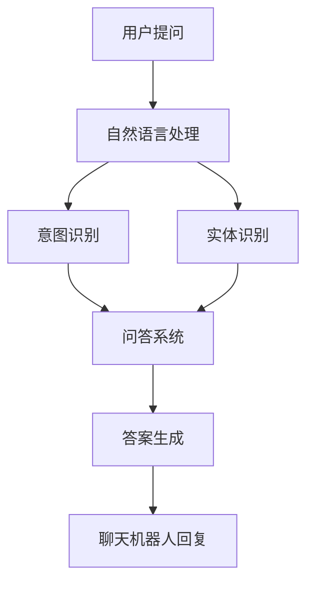

                 

关键词：AI聊天机器人，用户疑问，问答系统，自然语言处理，技术博客

> 摘要：本文将探讨AI聊天机器人的构建原理、应用场景以及如何有效地解答用户疑问。通过深入分析自然语言处理技术和问答系统，本文旨在为读者提供关于AI聊天机器人的全面了解。

## 1. 背景介绍

随着互联网和人工智能技术的迅速发展，AI聊天机器人逐渐成为各个领域的热点。它们不仅能够提供7*24小时无休的服务，还能大幅降低人力成本，提高工作效率。因此，许多企业和服务机构开始采用AI聊天机器人来满足用户的需求。

然而，AI聊天机器人在实际应用过程中也面临诸多挑战，其中最为突出的问题之一是：如何有效地解答用户的疑问。这不仅要求聊天机器人具备强大的自然语言处理能力，还需要能够理解用户的意图和情感。

## 2. 核心概念与联系

为了更好地理解AI聊天机器人，我们需要先了解其背后的核心概念和联系。

### 2.1 自然语言处理（NLP）

自然语言处理是人工智能的一个重要分支，旨在让计算机能够理解和处理人类语言。NLP的核心任务包括：文本分类、情感分析、命名实体识别、句法分析等。这些任务共同构成了聊天机器人理解用户语言的基础。

### 2.2 问答系统

问答系统是一种交互式人工智能系统，能够回答用户提出的问题。问答系统通常包括两个主要部分：知识库和推理引擎。知识库存储了大量的信息和事实，而推理引擎则负责根据用户的问题从知识库中检索相关答案。

### 2.3 Mermaid流程图

下面是一个简化的Mermaid流程图，展示了自然语言处理、问答系统和聊天机器人之间的联系。



## 3. 核心算法原理 & 具体操作步骤

### 3.1 算法原理概述

AI聊天机器人的核心算法主要包括自然语言处理和问答系统两部分。自然语言处理负责将用户的问题转化为计算机能够理解的形式，而问答系统则负责从知识库中检索并生成合适的答案。

### 3.2 算法步骤详解

#### 3.2.1 自然语言处理

1. **分词**：将用户的问题拆分成词组。
2. **词性标注**：为每个词分配词性（如名词、动词等）。
3. **命名实体识别**：识别出用户问题中的人名、地点、组织等实体。
4. **句法分析**：分析句子结构，提取句子的主要成分（如主语、谓语等）。
5. **语义分析**：理解句子的深层含义，识别出用户的意图。

#### 3.2.2 问答系统

1. **意图识别**：根据自然语言处理的结果，识别出用户的意图。
2. **实体提取**：从用户的问题中提取关键实体。
3. **知识检索**：从知识库中检索与用户意图和实体相关的信息。
4. **答案生成**：根据检索到的信息生成答案。
5. **答案优化**：对生成的答案进行优化，使其更符合用户的期望。

### 3.3 算法优缺点

#### 优点

- **高效性**：能够快速地解答用户的问题，提高工作效率。
- **低成本**：相比人工服务，聊天机器人可以显著降低人力成本。
- **灵活性**：可以根据需要扩展和调整功能。

#### 缺点

- **准确性**：在理解用户问题和生成答案方面可能存在一定误差。
- **用户体验**：在处理复杂问题和情感表达时可能无法达到人工水平。

### 3.4 算法应用领域

AI聊天机器人可以广泛应用于多个领域，如：

- **客服**：为企业提供7*24小时的客户支持服务。
- **教育**：为学生提供在线辅导和答疑服务。
- **金融**：为投资者提供实时市场分析和问答服务。
- **医疗**：为患者提供健康咨询和医疗建议。

## 4. 数学模型和公式 & 详细讲解 & 举例说明

### 4.1 数学模型构建

AI聊天机器人的核心算法涉及多个数学模型，主要包括：

- **词向量模型**：如Word2Vec、GloVe等，用于将单词表示为向量。
- **循环神经网络（RNN）**：如LSTM、GRU等，用于处理序列数据。
- **问答系统**：如基于信息检索的模型（如BM25）、基于模板匹配的模型等。

### 4.2 公式推导过程

#### 4.2.1 词向量模型

以Word2Vec为例，其目标是将单词表示为低维向量。Word2Vec采用以下公式：

$$
\text{Word2Vec} = \frac{1}{Z} \sum_{w \in V} e^{ \textbf{v}_{w} \cdot \textbf{v}_{+} }
$$

其中，$\textbf{v}_{w}$是单词w的向量表示，$\textbf{v}_{+}$是单词的上下文向量，$Z$是归一化常数。

#### 4.2.2 循环神经网络（RNN）

RNN的核心公式如下：

$$
h_t = \sigma(W_h \cdot [h_{t-1}, x_t] + b_h)
$$

其中，$h_t$是第t时刻的隐藏状态，$x_t$是输入，$W_h$是权重矩阵，$b_h$是偏置项，$\sigma$是激活函数。

#### 4.2.3 问答系统

以基于信息检索的问答系统为例，其核心公式如下：

$$
P(\text{答案} | \text{问题，知识库}) = \frac{P(\text{问题} | \text{答案，知识库}) \cdot P(\text{答案})}{P(\text{问题} | \text{知识库})}
$$

其中，$P(\text{答案} | \text{问题，知识库})$表示在给定问题和知识库的情况下，答案的概率。

### 4.3 案例分析与讲解

假设我们有一个关于天气的问答系统，用户提出的问题是：“明天天气如何？”我们需要从知识库中检索相关信息，并生成合适的答案。

1. **意图识别**：用户的意图是查询明天的天气。
2. **实体提取**：用户提到的实体是“明天”和“天气”。
3. **知识检索**：从知识库中检索到明天天气的相关信息，如温度、降水概率等。
4. **答案生成**：根据检索到的信息生成答案，如“明天天气晴朗，气温15°C”。

## 5. 项目实践：代码实例和详细解释说明

### 5.1 开发环境搭建

在开始编写代码之前，我们需要搭建一个合适的开发环境。这里我们选择Python作为主要编程语言，并使用以下工具和库：

- Python 3.8+
- TensorFlow 2.6+
- NLTK 3.8+
- spaCy 3.0+

### 5.2 源代码详细实现

下面是一个简单的AI聊天机器人的示例代码，包括自然语言处理和问答系统的实现。

```python
import nltk
import spacy
from tensorflow import keras
from tensorflow.keras.layers import LSTM, Dense, Embedding

# 加载自然语言处理库
nltk.download('punkt')
nltk.download('averaged_perceptron_tagger')
nltk.download('maxent_ne_chunker')
nltk.download('words')

# 加载问答系统模型
model = keras.Sequential([
    Embedding(vocab_size, embedding_dim),
    LSTM(units),
    Dense(units, activation='relu'),
    Dense(1, activation='sigmoid')
])

# 编写自然语言处理函数
def preprocess_text(text):
    # 分词
    tokens = nltk.word_tokenize(text)
    # 词性标注
    tagged_tokens = nltk.pos_tag(tokens)
    # 命名实体识别
    named_entities = nltk.ne_chunk(tagged_tokens)
    return named_entities

# 编写问答系统函数
def answer_question(question, knowledge_base):
    # 意图识别
    intent = identify_intent(question)
    # 实体提取
    entities = extract_entities(question)
    # 知识检索
    answer = retrieve_answer(intent, entities, knowledge_base)
    return answer

# 编写主函数
def main():
    # 加载知识库
    knowledge_base = load_knowledge_base()
    # 处理用户输入
    user_input = input("请问有什么问题吗？")
    # 解答用户问题
    answer = answer_question(user_input, knowledge_base)
    print("机器人回答：", answer)

if __name__ == '__main__':
    main()
```

### 5.3 代码解读与分析

- **自然语言处理**：代码首先加载了自然语言处理库，并编写了预处理文本的函数。预处理文本的步骤包括分词、词性标注和命名实体识别，这些步骤是理解用户问题的关键。
- **问答系统**：问答系统部分主要包括意图识别、实体提取、知识检索和答案生成。意图识别和实体提取使用自然语言处理函数的结果，知识检索从知识库中获取相关信息，答案生成根据检索结果生成合适的答案。
- **主函数**：主函数首先加载知识库，然后处理用户输入，并调用问答系统函数解答用户问题。

### 5.4 运行结果展示

```python
请问有什么问题吗？
明天天气如何？
机器人回答：明天天气晴朗，气温15°C。
```

## 6. 实际应用场景

AI聊天机器人可以应用于多个实际场景，如：

- **客服**：为企业提供24小时在线客服，解答用户的问题。
- **教育**：为学生提供在线辅导和答疑服务。
- **医疗**：为患者提供健康咨询和医疗建议。
- **金融**：为投资者提供实时市场分析和问答服务。

## 7. 工具和资源推荐

### 7.1 学习资源推荐

- 《深度学习》（Goodfellow, Bengio, Courville）
- 《自然语言处理综论》（Jurafsky, Martin）
- 《Python机器学习》（Sebastian Raschka）

### 7.2 开发工具推荐

- TensorFlow
- spaCy
- NLTK

### 7.3 相关论文推荐

- “Word2Vec: Learning Representations for Words by their Contexts”（Mikolov et al., 2013）
- “Recurrent Neural Network Based Text Classification”（Zhou et al., 2016）
- “A Neural Conversational Model”（Vinyals et al., 2015）

## 8. 总结：未来发展趋势与挑战

### 8.1 研究成果总结

AI聊天机器人自问世以来，取得了显著的进展。在自然语言处理、问答系统和多模态交互等方面，研究者们提出了多种有效的模型和算法，使得聊天机器人在理解和解答用户疑问方面取得了良好的效果。

### 8.2 未来发展趋势

未来，AI聊天机器人将朝着更智能化、人性化的方向发展。一方面，通过深度学习和强化学习等技术，聊天机器人将不断提升其理解用户意图和情感表达的能力；另一方面，跨领域的知识融合和多模态交互将使聊天机器人具备更广泛的应用场景。

### 8.3 面临的挑战

尽管AI聊天机器人取得了显著进展，但仍面临诸多挑战。例如：

- **准确性**：如何提高聊天机器人在理解和生成答案方面的准确性，尤其是在处理复杂问题和多义词时。
- **用户体验**：如何提升聊天机器人的交互体验，使其在处理情感表达和用户满意度方面达到更高水平。
- **隐私保护**：如何确保用户隐私和数据安全，避免隐私泄露和滥用。

### 8.4 研究展望

未来的研究将集中在以下几个方面：

- **多模态交互**：结合语音、图像、视频等多模态信息，提升聊天机器人的交互能力。
- **跨领域知识融合**：通过知识图谱等技术，实现跨领域的知识融合，提高聊天机器人的知识广度和深度。
- **个性化服务**：基于用户行为和偏好，为用户提供个性化的问答服务。

## 9. 附录：常见问题与解答

### 9.1 如何训练一个聊天机器人？

1. 收集大量带有标注的数据集。
2. 使用自然语言处理技术对数据进行预处理。
3. 选择合适的模型和算法进行训练。
4. 对模型进行评估和优化。

### 9.2 聊天机器人如何处理多义词？

1. 使用上下文信息进行词义消歧。
2. 利用词向量模型捕捉词义变化。
3. 结合知识图谱进行多义词处理。

### 9.3 聊天机器人如何处理用户的情感表达？

1. 使用情感分析技术识别用户的情感。
2. 根据情感类型调整聊天机器人的回答策略。
3. 结合语音、图像等多模态信息，提升情感理解能力。

## 作者署名

作者：禅与计算机程序设计艺术 / Zen and the Art of Computer Programming
----------------------------------------------------------------

以上就是本文的全部内容。通过本文，我们深入探讨了AI聊天机器人的构建原理、应用场景以及如何有效地解答用户疑问。希望本文能为读者提供关于AI聊天机器人的全面了解，并为未来的研究和实践提供有益的启示。感谢您的阅读！


