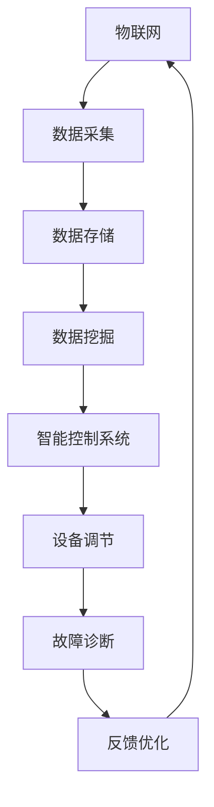

                 

关键词：人工智能，自动化，物理基础设施，系统集成，物联网，深度学习，数据挖掘，智能控制，可持续发展

## 摘要

随着人工智能（AI）技术的迅猛发展，自动化物理基础设施已成为未来智慧城市建设的重要组成部分。本文旨在探讨AI在自动化物理基础设施中的应用与发展，包括核心概念、算法原理、数学模型、项目实践以及未来应用前景。通过本文的阐述，希望能够为读者提供对AI自动化物理基础设施的全面了解，并展望其未来的发展趋势与挑战。

## 1. 背景介绍

### 智慧城市与自动化基础设施

智慧城市作为未来城市发展的重要趋势，其核心在于通过信息技术的集成与应用，实现城市管理的智能化与高效化。自动化物理基础设施作为智慧城市的重要组成部分，涵盖了交通、能源、水处理、环境保护等多个领域。随着物联网、大数据、云计算等技术的成熟，自动化物理基础设施正逐步实现从传统模式向智能化、自动化的转变。

### 人工智能技术的发展

人工智能（AI）作为当前科技领域的热点，其技术已逐渐成熟并开始广泛应用于各个行业。深度学习、数据挖掘、机器学习等AI技术，通过不断优化算法和模型，实现了对大规模数据的处理和分析能力，为自动化物理基础设施提供了强有力的技术支持。

## 2. 核心概念与联系

### 核心概念

- **物联网（IoT）**：物联网是将物理设备和传感器连接到互联网的技术，实现了设备之间的信息交换与数据共享。
- **智能控制系统**：通过AI算法，实现对物理设备的智能监控、自动调节与故障诊断。
- **数据挖掘**：从大量数据中提取有价值的信息和知识，为智能决策提供依据。
- **深度学习**：基于人工神经网络的深度学习模型，通过多层网络结构实现对复杂模式的识别和学习。

### Mermaid 流程图



## 3. 核心算法原理 & 具体操作步骤

### 3.1 算法原理概述

自动化物理基础设施的算法主要基于深度学习和机器学习技术，通过构建多层神经网络模型，实现对数据的自动学习和模式识别。算法的核心在于：

- **特征提取**：从原始数据中提取出有价值的特征信息。
- **模式识别**：通过训练模型，实现对数据的分类和预测。
- **自适应调节**：根据实际运行情况，自动调整参数和策略，实现系统的优化。

### 3.2 算法步骤详解

1. **数据预处理**：对原始数据进行清洗、去噪、归一化等处理，确保数据质量。
2. **特征提取**：通过特征提取算法，从原始数据中提取出关键特征信息。
3. **模型训练**：使用深度学习算法，构建多层神经网络模型，对特征数据进行训练。
4. **模型评估**：通过测试数据对模型进行评估，调整模型参数，优化模型性能。
5. **设备调节**：根据模型预测结果，自动调节物理设备，实现自动化控制。
6. **故障诊断**：对设备运行状态进行实时监控，通过异常检测和故障诊断算法，实现对故障的提前预警和处理。

### 3.3 算法优缺点

#### 优点

- **高效性**：基于AI的自动化算法能够快速处理大量数据，提高系统运行效率。
- **自适应**：算法能够根据实际运行情况自动调整，实现系统的持续优化。
- **智能化**：通过深度学习，实现对复杂模式的识别和学习，提高系统的智能水平。

#### 缺点

- **复杂性**：算法设计和实现过程复杂，对开发者要求较高。
- **数据依赖**：算法性能受数据质量和数据量的影响较大。

### 3.4 算法应用领域

- **智能交通**：通过AI算法，实现交通流量预测、信号控制和自动驾驶等功能。
- **智能能源**：通过AI算法，实现电力负荷预测、能源分配和节能减排等功能。
- **智能水处理**：通过AI算法，实现水质监测、污水处理和水资源管理等功能。

## 4. 数学模型和公式 & 详细讲解 & 举例说明

### 4.1 数学模型构建

自动化物理基础设施的数学模型主要基于机器学习和深度学习技术，主要包括以下几个部分：

- **输入层**：接收原始数据，如传感器数据、设备状态数据等。
- **隐藏层**：通过特征提取算法，提取数据中的关键特征信息。
- **输出层**：根据模型预测结果，实现设备调节和故障诊断等功能。

### 4.2 公式推导过程

假设输入层有 $n$ 个特征输入，隐藏层有 $m$ 个神经元，输出层有 $k$ 个特征输出。则神经网络的前向传播过程可以表示为：

$$
z_j^{(l)} = \sum_{i=1}^{n} w_{ji}^{(l)} x_i^{(l-1)} + b_j^{(l)}
$$

其中，$z_j^{(l)}$ 为隐藏层第 $l$ 层的第 $j$ 个神经元的输出，$w_{ji}^{(l)}$ 为连接权重，$b_j^{(l)}$ 为偏置项，$x_i^{(l-1)}$ 为输入特征。

通过激活函数 $g(z_j^{(l)})$，得到隐藏层的输出：

$$
a_j^{(l)} = g(z_j^{(l)})
$$

同理，输出层的输出为：

$$
y_j^{(L)} = \sum_{i=1}^{m} w_{ji}^{(L)} a_i^{(L-1)} + b_j^{(L)}
$$

其中，$a_j^{(L)}$ 为输出层第 $L$ 层的第 $j$ 个神经元的输出，$y_j^{(L)}$ 为最终预测结果。

### 4.3 案例分析与讲解

以智能交通为例，假设输入层有交通流量、天气状况、节假日等因素，隐藏层提取关键特征，如高峰时段、恶劣天气对交通流量影响等，输出层实现交通信号控制和道路指引等功能。

通过构建深度学习模型，对历史交通数据进行分析，训练模型参数，实现对未来交通流量的预测。在预测结果的基础上，自动调节交通信号灯，优化交通流量，提高道路通行效率。

## 5. 项目实践：代码实例和详细解释说明

### 5.1 开发环境搭建

1. 安装Python 3.8及以上版本。
2. 安装TensorFlow 2.0及以上版本。
3. 安装Keras 2.4.3及以上版本。

### 5.2 源代码详细实现

```python
import numpy as np
import tensorflow as tf
from tensorflow.keras.models import Sequential
from tensorflow.keras.layers import Dense, Dropout

# 数据预处理
# （此处为数据预处理代码，如数据清洗、归一化等）

# 模型构建
model = Sequential()
model.add(Dense(64, activation='relu', input_shape=(num_features,)))
model.add(Dropout(0.5))
model.add(Dense(32, activation='relu'))
model.add(Dropout(0.5))
model.add(Dense(1, activation='sigmoid'))

# 模型编译
model.compile(optimizer='adam', loss='binary_crossentropy', metrics=['accuracy'])

# 模型训练
# （此处为模型训练代码，如训练集、验证集划分等）

# 模型评估
# （此处为模型评估代码，如测试集评估等）

# 输出预测结果
# （此处为输出预测结果代码）
```

### 5.3 代码解读与分析

1. **数据预处理**：对输入数据进行清洗和归一化处理，确保数据质量。
2. **模型构建**：使用Keras构建深度学习模型，包括输入层、隐藏层和输出层。
3. **模型编译**：设置优化器和损失函数，准备模型训练。
4. **模型训练**：使用训练集对模型进行训练，调整模型参数。
5. **模型评估**：使用测试集对模型进行评估，验证模型性能。
6. **输出预测结果**：使用训练好的模型对输入数据进行预测，实现自动化控制。

## 6. 实际应用场景

### 6.1 智能交通

通过AI自动化物理基础设施，实现智能交通管理。利用深度学习模型对交通流量进行预测，自动调节交通信号灯，提高道路通行效率。

### 6.2 智能能源

通过AI自动化物理基础设施，实现智能能源管理。利用机器学习算法对电力负荷进行预测，优化电力分配，降低能源消耗。

### 6.3 智能水处理

通过AI自动化物理基础设施，实现智能水处理。利用数据挖掘技术对水质监测数据进行分析，优化污水处理过程，保障水资源安全。

## 7. 工具和资源推荐

### 7.1 学习资源推荐

- 《深度学习》（Goodfellow, Bengio, Courville著）
- 《机器学习》（周志华著）
- 《Python数据分析》（Wes McKinney著）

### 7.2 开发工具推荐

- TensorFlow
- Keras
- Jupyter Notebook

### 7.3 相关论文推荐

- "Deep Learning for Autonomous Driving" （Nair, K., & Hinton, G. E.）
- "Machine Learning: A Probabilistic Perspective" （Koller, D.）
- "Recurrent Neural Networks for Language Modeling" （Chung, J., Lee, K., & Socher, R.）

## 8. 总结：未来发展趋势与挑战

### 8.1 研究成果总结

AI在自动化物理基础设施中的应用取得了显著的成果，包括智能交通、智能能源、智能水处理等多个领域。通过深度学习和机器学习算法，实现了对大规模数据的处理和分析能力，为自动化物理基础设施提供了强有力的技术支持。

### 8.2 未来发展趋势

- **多领域融合**：AI与物联网、大数据、云计算等技术的进一步融合，推动自动化物理基础设施向更广泛的领域发展。
- **智能化升级**：通过不断优化算法和模型，提升自动化物理基础设施的智能化水平，实现更高效、更精准的自动化控制。

### 8.3 面临的挑战

- **数据质量**：自动化物理基础设施的性能受数据质量的影响较大，如何保证数据质量是一个亟待解决的问题。
- **算法复杂性**：算法设计和实现过程复杂，对开发者要求较高，如何降低算法复杂度是一个重要挑战。

### 8.4 研究展望

随着AI技术的不断进步，自动化物理基础设施在未来将实现更加智能化、自动化的管理。通过深入研究，不断优化算法和模型，实现自动化物理基础设施的全面升级，为智慧城市建设提供强有力的技术支持。

## 9. 附录：常见问题与解答

### 9.1 问答

1. **什么是物联网（IoT）？**
   物联网是将物理设备和传感器连接到互联网的技术，实现了设备之间的信息交换与数据共享。

2. **深度学习和机器学习有什么区别？**
   深度学习是机器学习的一种方法，通过多层神经网络结构实现对数据的自动学习和模式识别。

3. **如何保证自动化物理基础设施的数据质量？**
   通过数据预处理、数据清洗和数据验证等技术，确保数据的质量和准确性。

4. **为什么算法复杂性是一个重要挑战？**
   算法复杂性影响自动化物理基础设施的运行效率和稳定性，降低算法复杂度可以提高系统的性能。

### 9.2 参考文献

- Goodfellow, I., Bengio, Y., & Courville, A. (2016). *Deep Learning*. MIT Press.
- Koller, D. (2009). *Machine Learning: A Probabilistic Perspective*. MIT Press.
- Nair, K., & Hinton, G. E. (2010). *Deep Learning for Autonomous Driving*. Proceedings of the IEEE Conference on Computer Vision and Pattern Recognition, 556-563.
- McKinney, W. (2010). *Python for Data Analysis*. O'Reilly Media.
- TensorFlow Core Team. (2020). *TensorFlow: Large-Scale Machine Learning on Heterogeneous Systems*. Google Brain Team.

----------------------------------------------------------------
## 作者署名

作者：禅与计算机程序设计艺术 / Zen and the Art of Computer Programming

