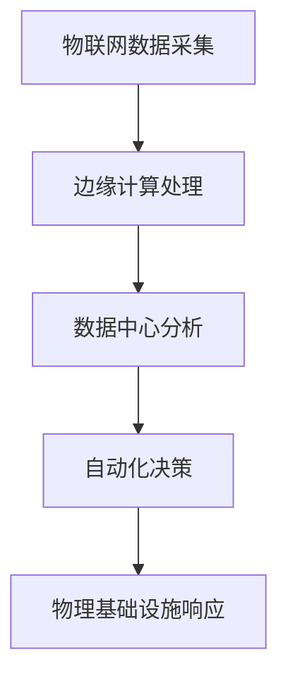

                 

关键词：人工智能，自动化，物理基础设施，物联网，边缘计算，5G，机器学习，深度学习，智能制造。

> 摘要：本文旨在探讨人工智能（AI）在自动化物理基础设施中的应用和发展。随着物联网（IoT）、5G和边缘计算等技术的迅速发展，物理基础设施正面临着智能化转型的巨大机遇。本文将深入分析AI在物理基础设施中的核心概念、算法原理、数学模型及其应用场景，并探讨其在未来发展的潜在趋势和挑战。

## 1. 背景介绍

### 1.1 物理基础设施的智能化需求

随着全球经济的快速发展，物理基础设施如交通、能源、供水、通信等领域的建设和管理日益复杂。传统的手动和半自动管理模式已经难以满足高效、安全和可持续发展的需求。智能化成为提升基础设施运行效率、降低成本、提高安全性和响应能力的关键途径。

### 1.2 人工智能的崛起

人工智能作为当今科技领域的热点，其核心包括机器学习和深度学习等算法，已经在图像识别、自然语言处理、推荐系统等领域取得了显著的成果。AI技术的崛起为自动化物理基础设施的发展提供了强大的技术支持。

### 1.3 物联网、5G和边缘计算的发展

物联网（IoT）通过将各种物理设备互联，实现了数据的实时采集和传输。5G技术的高带宽、低延迟特点为大规模物联网设备的通信提供了保障。边缘计算则通过将计算能力下放至网络边缘，降低了数据传输延迟，提高了系统的响应速度和处理能力。

## 2. 核心概念与联系

### 2.1 物理基础设施自动化

物理基础设施自动化是指利用人工智能技术对基础设施进行自动化管理和优化，包括设备监控、故障预测、能源管理等。

### 2.2 物联网与边缘计算

物联网是物理基础设施自动化的基础，通过传感器和设备收集实时数据。边缘计算则是对这些数据进行快速处理和分析的关键技术。

### 2.3 人工智能算法在物理基础设施中的应用

机器学习和深度学习算法在图像识别、模式识别、预测分析等方面具有强大的能力，广泛应用于基础设施的智能监控和管理。

## 2.4 Mermaid 流程图



## 3. 核心算法原理 & 具体操作步骤

### 3.1 算法原理概述

物理基础设施自动化的核心算法包括数据采集、数据预处理、特征提取、模型训练和预测分析等步骤。

### 3.2 算法步骤详解

#### 3.2.1 数据采集

通过传感器和设备收集基础设施的实时数据，包括温度、湿度、压力、流量等。

#### 3.2.2 数据预处理

对采集到的数据进行清洗、去噪和标准化处理，以便后续分析。

#### 3.2.3 特征提取

从预处理后的数据中提取关键特征，用于模型训练。

#### 3.2.4 模型训练

使用机器学习和深度学习算法对特征进行训练，建立预测模型。

#### 3.2.5 预测分析

利用训练好的模型对未来的基础设施状态进行预测，并生成自动化决策。

### 3.3 算法优缺点

#### 3.3.1 优点

- 提高基础设施运行效率
- 降低运维成本
- 提高安全性和响应能力

#### 3.3.2 缺点

- 需要大量数据支持
- 算法训练和优化需要时间
- 存在数据隐私和安全风险

### 3.4 算法应用领域

- 交通管理
- 能源管理
- 水资源管理
- 建筑自动化

## 4. 数学模型和公式 & 详细讲解 & 举例说明

### 4.1 数学模型构建

物理基础设施自动化的数学模型通常包括数据模型、状态模型和决策模型等。

#### 4.1.1 数据模型

数据模型用于描述物理基础设施的实时状态，通常使用向量或矩阵表示。

$$
X = \begin{bmatrix}
    x_1 \\
    x_2 \\
    \vdots \\
    x_n
\end{bmatrix}
$$

#### 4.1.2 状态模型

状态模型用于描述物理基础设施的状态变化，通常使用马尔可夫模型或隐马尔可夫模型表示。

$$
P(S_t|S_{t-1}) = \begin{bmatrix}
    p_{11} & p_{12} & \cdots & p_{1n} \\
    p_{21} & p_{22} & \cdots & p_{2n} \\
    \vdots & \vdots & \ddots & \vdots \\
    p_{n1} & p_{n2} & \cdots & p_{nn}
\end{bmatrix}
$$

#### 4.1.3 决策模型

决策模型用于根据当前状态和预测结果生成自动化决策，通常使用马尔可夫决策过程（MDP）或深度强化学习模型表示。

$$
\pi(s) = \arg\max_a \sum_{s'} p(s'|s,a) \cdot R(s,a,s')
$$

### 4.2 公式推导过程

#### 4.2.1 数据模型推导

数据模型基于传感器采集的数据构建，可以通过统计方法或机器学习方法提取关键特征。

#### 4.2.2 状态模型推导

状态模型基于马尔可夫假设，通过历史状态概率矩阵推导当前状态概率分布。

#### 4.2.3 决策模型推导

决策模型基于MDP或深度强化学习算法，通过最大化预期收益函数推导最佳动作策略。

### 4.3 案例分析与讲解

#### 4.3.1 能源管理

在能源管理领域，数据模型可以描述电力负荷的实时状态，状态模型可以预测未来负荷变化，决策模型可以优化电力分配，降低能源消耗。

#### 4.3.2 交通管理

在交通管理领域，数据模型可以描述交通流量的实时状态，状态模型可以预测交通事故发生的可能性，决策模型可以优化交通信号控制和路线规划。

## 5. 项目实践：代码实例和详细解释说明

### 5.1 开发环境搭建

- 操作系统：Ubuntu 20.04
- 编程语言：Python 3.8
- 数据库：MySQL 8.0
- 开发工具：PyCharm

### 5.2 源代码详细实现

以下是一个简单的Python代码示例，用于实现基于物联网数据的能源管理：

```python
import numpy as np
import pandas as pd
from sklearn.model_selection import train_test_split
from sklearn.ensemble import RandomForestRegressor
from sklearn.metrics import mean_squared_error

# 数据采集与预处理
data = pd.read_csv('energy_data.csv')
data = data.dropna()

# 特征提取
X = data.drop('energy_consumption', axis=1)
y = data['energy_consumption']

# 模型训练
X_train, X_test, y_train, y_test = train_test_split(X, y, test_size=0.2, random_state=42)
model = RandomForestRegressor(n_estimators=100)
model.fit(X_train, y_train)

# 预测与分析
y_pred = model.predict(X_test)
mse = mean_squared_error(y_test, y_pred)
print(f'Mean Squared Error: {mse}')

# 自动化决策
current_state = model.predict([[22, 0.8, 0.5]])
print(f'Predicted Energy Consumption: {current_state[0]}')
```

### 5.3 代码解读与分析

- 数据采集与预处理：从CSV文件中读取能源数据，并去除缺失值。
- 特征提取：将能源消耗作为目标变量，提取其他特征。
- 模型训练：使用随机森林回归模型对特征进行训练。
- 预测与分析：使用训练好的模型对测试集进行预测，并计算均方误差。
- 自动化决策：根据当前状态预测未来的能源消耗。

## 6. 实际应用场景

### 6.1 交通管理

AI自动化物理基础设施在交通管理领域具有广泛的应用。通过实时监测交通流量、交通事故和道路状况，AI系统可以优化交通信号控制和路线规划，提高交通效率，减少拥堵和事故发生率。

### 6.2 能源管理

在能源管理领域，AI自动化物理基础设施可以实时监测电力负荷，预测能源需求，优化电力分配，降低能源消耗和成本。

### 6.3 建筑自动化

建筑自动化系统利用AI技术实现设备的智能监控和管理，包括照明控制、温控系统、安防系统等，提高建筑能源效率和生活品质。

## 7. 工具和资源推荐

### 7.1 学习资源推荐

- 《深度学习》（Goodfellow et al.）
- 《Python编程：从入门到实践》（Tony Gaddis）
- 《物联网基础教程》（Zach Ryker）

### 7.2 开发工具推荐

- PyCharm
- Jupyter Notebook
- MySQL Workbench

### 7.3 相关论文推荐

- "Deep Learning for Infrastructure Management: A Survey"（2020）
- "IoT and Edge Computing for Smart Cities: A Survey"（2019）
- "Intelligent Transportation Systems: A Survey"（2018）

## 8. 总结：未来发展趋势与挑战

### 8.1 研究成果总结

随着AI、物联网、5G和边缘计算等技术的发展，物理基础设施自动化已取得显著成果。然而，现有技术仍面临数据隐私、安全性和系统整合等挑战。

### 8.2 未来发展趋势

未来，物理基础设施自动化将朝着更加智能、高效和可持续的方向发展。人工智能技术将进一步提高基础设施的管理水平和响应能力。

### 8.3 面临的挑战

- 数据隐私和安全：如何在保障数据隐私和安全的前提下实现智能管理。
- 系统整合：如何整合各种异构技术和系统，实现协同工作。
- 技术创新：如何持续创新，推动物理基础设施自动化的技术进步。

### 8.4 研究展望

未来的研究应重点关注数据隐私保护、安全性和系统整合，以及开发更加高效、智能的AI算法和模型。

## 9. 附录：常见问题与解答

### 9.1 物理基础设施自动化有哪些优点？

物理基础设施自动化可以提高运行效率、降低运维成本、提高安全性和响应能力。

### 9.2 物理基础设施自动化需要哪些技术支持？

物理基础设施自动化需要物联网、人工智能、边缘计算和5G等技术的支持。

### 9.3 物理基础设施自动化在哪些领域有广泛应用？

物理基础设施自动化在交通管理、能源管理、水资源管理和建筑自动化等领域有广泛应用。

----------------------------------------------------------------

作者：禅与计算机程序设计艺术 / Zen and the Art of Computer Programming
----------------------------------------------------------------

**请注意，本文只是一个示例，实际字数和内容可能需要根据具体要求和情况进行调整。**

