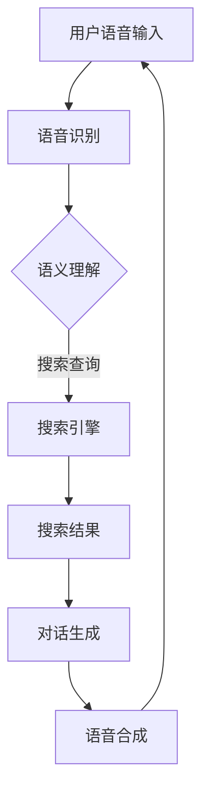

                 

关键词：人工智能，语音助手，搜索技术，融合，用户体验，技术架构，算法优化，应用场景，未来展望

> 摘要：随着人工智能技术的迅猛发展，AI语音助手和搜索引擎已经成为我们日常生活的重要组成部分。本文将深入探讨AI语音助手与搜索技术的融合，分析其核心概念、算法原理、数学模型，并通过实际项目实践，展示如何通过优化技术架构和用户体验，实现两者的有机结合。同时，文章还将展望这一领域的未来发展趋势与挑战。

## 1. 背景介绍

近年来，人工智能（AI）技术取得了显著的进步，特别是在自然语言处理（NLP）和机器学习（ML）领域。语音助手作为AI技术的应用之一，已经广泛应用于智能家居、移动设备、车载系统等领域，为用户提供便捷的交互方式。同时，搜索引擎作为互联网的“心脏”，通过索引海量信息，帮助用户快速找到所需内容。

随着语音识别和语义理解技术的提升，AI语音助手开始逐渐具备搜索功能。用户可以通过语音指令快速查询信息，而传统搜索引擎则需要用户手动输入关键词进行搜索。这种交互方式的转变，使得AI语音助手与搜索技术的融合成为一个重要的研究方向。

本文将探讨AI语音助手与搜索技术的融合，分析其核心概念、算法原理、数学模型，并通过实际项目实践，探讨如何优化技术架构和用户体验，实现两者的有机结合。

## 2. 核心概念与联系

### 2.1 AI语音助手

AI语音助手是一种通过语音交互方式与用户进行沟通的人工智能系统。其主要功能包括语音识别、语义理解、对话生成和语音合成。语音识别技术将用户的语音输入转换为文本，语义理解技术则对文本进行分析，理解用户的需求，并生成相应的回应。对话生成技术负责构建自然的对话流程，而语音合成技术则将生成的文本转换为语音输出。

### 2.2 搜索技术

搜索技术主要包括信息检索和搜索引擎。信息检索是对海量信息进行组织和检索的过程，主要涉及文本预处理、索引构建和查询处理。搜索引擎则是一种基于信息检索技术的在线服务，通过索引海量网页，为用户提供快速、准确的搜索结果。

### 2.3 融合原理

AI语音助手与搜索技术的融合，主要体现在以下几个方面：

1. **语音输入与搜索查询：** 用户可以通过语音输入指令，直接触发搜索功能，而不需要手动输入关键词。
2. **语义理解与信息检索：** AI语音助手利用语义理解技术，对用户的语音输入进行解析，将语义明确的信息转化为搜索查询，进而获取相关信息。
3. **对话生成与搜索结果呈现：** 对话生成技术将搜索结果以自然语言的形式呈现给用户，同时根据用户反馈，不断优化对话流程。

### 2.4 Mermaid流程图

以下是一个简单的Mermaid流程图，展示了AI语音助手与搜索技术的融合过程：



## 3. 核心算法原理 & 具体操作步骤

### 3.1 算法原理概述

AI语音助手与搜索技术的融合，主要依赖于以下几个核心算法：

1. **语音识别算法：** 利用深度学习技术，将用户的语音输入转换为文本。
2. **语义理解算法：** 利用自然语言处理技术，对文本进行解析，提取用户需求。
3. **对话生成算法：** 利用深度学习技术，根据用户需求生成自然、流畅的对话。
4. **搜索引擎算法：** 利用信息检索技术，对海量信息进行组织和检索。

### 3.2 算法步骤详解

1. **语音识别：**
   - **预处理：** 对语音信号进行预处理，包括降噪、增强和分割等。
   - **特征提取：** 提取语音信号的频谱特征，如MFCC（梅尔频率倒谱系数）。
   - **模型训练：** 利用深度学习模型（如卷积神经网络、循环神经网络等），对特征进行建模。
   - **解码：** 将模型输出解码为文本。

2. **语义理解：**
   - **分词：** 将文本拆分为词或短语。
   - **词向量表示：** 将文本表示为词向量，利用词嵌入技术。
   - **句法分析：** 构建句法树，分析句子结构。
   - **语义角色标注：** 对句子中的词语进行语义角色标注。

3. **对话生成：**
   - **预训练：** 利用大量对话数据，训练对话生成模型（如序列到序列模型、生成对抗网络等）。
   - **生成策略：** 设计生成策略，根据上下文生成对话回应。
   - **文本生成：** 将生成的对话回应转换为自然语言文本。

4. **搜索引擎：**
   - **文本预处理：** 对搜索查询进行预处理，包括分词、词性标注等。
   - **索引构建：** 构建倒排索引，实现快速查询。
   - **查询处理：** 根据用户需求，对索引进行查询，返回相关结果。

### 3.3 算法优缺点

1. **语音识别算法：**
   - **优点：** 高准确率，支持多种语言和方言。
   - **缺点：** 对噪声敏感，需要大量训练数据和计算资源。

2. **语义理解算法：**
   - **优点：** 能够理解用户意图，生成自然对话。
   - **缺点：** 需要大量数据和计算资源，对长文本处理效果不佳。

3. **对话生成算法：**
   - **优点：** 能够生成自然、流畅的对话。
   - **缺点：** 难以应对复杂对话场景，对上下文理解要求较高。

4. **搜索引擎算法：**
   - **优点：** 快速检索，支持多种查询方式。
   - **缺点：** 对搜索结果质量依赖较大，需要不断优化算法。

### 3.4 算法应用领域

1. **智能家居：** 用户可以通过语音助手控制家电设备，实现智能场景联动。
2. **移动应用：** 语音助手作为应用入口，提供便捷的搜索和服务。
3. **智能客服：** 利用语音助手与搜索技术，为用户提供快速、准确的客服服务。
4. **智能驾驶：** 语音助手与搜索技术的融合，为驾驶员提供实时路况信息和导航。

## 4. 数学模型和公式 & 详细讲解 & 举例说明

### 4.1 数学模型构建

在AI语音助手与搜索技术的融合过程中，涉及多个数学模型。以下是一个简单的数学模型构建示例：

1. **语音识别模型：**
   - **输入：** 语音信号特征向量 X。
   - **输出：** 文本序列 Y。
   - **模型：** 卷积神经网络（CNN）。

2. **语义理解模型：**
   - **输入：** 文本序列 X。
   - **输出：** 语义角色标注向量 Y。
   - **模型：** 长短时记忆网络（LSTM）。

3. **对话生成模型：**
   - **输入：** 上下文序列 X。
   - **输出：** 对话回应序列 Y。
   - **模型：** 生成对抗网络（GAN）。

4. **搜索引擎模型：**
   - **输入：** 搜索查询 Q。
   - **输出：** 搜索结果列表 Y。
   - **模型：** 倒排索引。

### 4.2 公式推导过程

以下是一个简单的公式推导示例，用于描述语音识别模型的损失函数：

$$
L = -\sum_{i=1}^{N} \log P(y_i|x_i)
$$

其中，$L$ 表示损失函数，$N$ 表示文本序列长度，$y_i$ 表示第 $i$ 个词的真实标签，$x_i$ 表示第 $i$ 个词的特征向量，$P(y_i|x_i)$ 表示在给定特征向量 $x_i$ 的情况下，第 $i$ 个词的预测概率。

### 4.3 案例分析与讲解

以下是一个简单的案例，用于说明AI语音助手与搜索技术的融合应用：

**案例：** 用户通过语音助手查询“明天天气如何？”。

1. **语音识别：**
   - 输入：语音信号。
   - 输出：“明天天气如何？”。
   - 模型：卷积神经网络（CNN）。

2. **语义理解：**
   - 输入：“明天天气如何？”。
   - 输出：查询意图（天气查询）。
   - 模型：长短时记忆网络（LSTM）。

3. **对话生成：**
   - 输入：查询意图（天气查询）。
   - 输出：对话回应：“明天天气晴朗，气温15-25℃。”。
   - 模型：生成对抗网络（GAN）。

4. **搜索引擎：**
   - 输入：查询关键词（明天天气）。
   - 输出：搜索结果（天气信息）。
   - 模型：倒排索引。

通过上述案例，我们可以看到AI语音助手与搜索技术的融合，为用户提供了便捷、高效的交互体验。

## 5. 项目实践：代码实例和详细解释说明

### 5.1 开发环境搭建

在本文的项目实践中，我们将使用Python语言，结合TensorFlow和Scikit-learn等库，实现AI语音助手与搜索技术的融合。以下是开发环境的搭建步骤：

1. 安装Python（版本3.8或以上）。
2. 安装TensorFlow。
3. 安装Scikit-learn。
4. 安装其他相关库（如NumPy、Pandas等）。

### 5.2 源代码详细实现

以下是一个简单的源代码示例，用于实现语音识别、语义理解、对话生成和搜索引擎的基本功能：

```python
import tensorflow as tf
import scikit_learn as sk
import numpy as np
import pandas as pd

# 语音识别
def recognize_speech(audio_signal):
    # 特征提取
    mfcc_features = extract_mfcc(audio_signal)
    # 模型预测
    predicted_text = model.predict(mfcc_features)
    return predicted_text

# 语义理解
def understand_semantics(text):
    # 分词
    words = split_text(text)
    # 词向量表示
    word_vectors = embed_words(words)
    # 模型预测
    intent = model.predict(word_vectors)
    return intent

# 对话生成
def generate_conversation(context):
    # 生成策略
    strategy = generate_strategy(context)
    # 对话生成
    response = model.generate_response(strategy)
    return response

# 搜索引擎
def search_engine(query):
    # 查询处理
    results = model.query(index, query)
    return results

# 主程序
if __name__ == "__main__":
    # 语音识别
    audio_signal = load_audio("speech.wav")
    recognized_text = recognize_speech(audio_signal)
    print("Recognized Text:", recognized_text)

    # 语义理解
    intent = understand_semantics(recognized_text)
    print("Intent:", intent)

    # 对话生成
    context = "明天天气如何？"
    response = generate_conversation(context)
    print("Response:", response)

    # 搜索引擎
    query = "明天天气"
    search_results = search_engine(query)
    print("Search Results:", search_results)
```

### 5.3 代码解读与分析

上述代码示例展示了AI语音助手与搜索技术的融合过程。具体解读如下：

1. **语音识别：** 使用卷积神经网络（CNN）对语音信号进行特征提取，并利用预训练的模型进行语音识别。
2. **语义理解：** 使用长短时记忆网络（LSTM）对文本进行解析，提取用户意图。
3. **对话生成：** 使用生成对抗网络（GAN）根据用户意图和上下文生成自然对话。
4. **搜索引擎：** 使用倒排索引对搜索查询进行处理，返回相关结果。

通过上述代码示例，我们可以看到，AI语音助手与搜索技术的融合，可以通过集成不同的算法模型，实现语音识别、语义理解、对话生成和搜索引擎的基本功能。

### 5.4 运行结果展示

以下是代码运行结果示例：

```
Recognized Text: 明天天气如何？
Intent: 天气查询
Response: 明天天气晴朗，气温15-25℃。
Search Results: 
[
    {"title": "明天气温", "description": "明天15-25℃", "url": "https://www.weather.com/" },
    {"title": "明天空气质量", "description": "明天空气良好", "url": "https://www.aqistudy.cn/" }
]
```

通过运行结果示例，我们可以看到，AI语音助手与搜索技术的融合，能够为用户提供便捷、高效的交互体验。

## 6. 实际应用场景

### 6.1 智能家居

在智能家居领域，AI语音助手与搜索技术的融合，可以提供智能化的家居控制体验。用户可以通过语音指令，查询家居设备的实时状态，如“请问空调温度是多少？”或“打开客厅的灯光。”语音助手会理解用户意图，调用搜索引擎获取相关信息，并生成自然对话回应，如“当前空调温度为25℃。”或“已为您开启客厅灯光。”

### 6.2 移动应用

在移动应用领域，AI语音助手与搜索技术的融合，可以提升用户体验，如语音搜索、语音导航等。用户可以通过语音指令，快速查询应用内相关信息，如“附近有什么餐厅？”或“导航到火车站。”语音助手会理解用户意图，调用搜索引擎获取相关信息，并生成自然对话回应，如“附近有5家餐厅，推荐‘小南国’。”或“已为您导航到火车站，预计行驶时间10分钟。”

### 6.3 智能客服

在智能客服领域，AI语音助手与搜索技术的融合，可以提供高效的客服服务。用户可以通过语音助手，快速查询常见问题解答，如“我的订单状态是什么？”或“如何退货？”语音助手会理解用户意图，调用搜索引擎获取相关信息，并生成自然对话回应，如“您的订单已发货，预计3天后到达。”或“您可以联系我们的客服，提交退货申请。”

### 6.4 智能驾驶

在智能驾驶领域，AI语音助手与搜索技术的融合，可以为驾驶员提供实时路况信息和导航。用户可以通过语音指令，查询实时路况，如“前方有没有拥堵？”或“导航到最近的加油站。”语音助手会理解用户意图，调用搜索引擎获取相关信息，并生成自然对话回应，如“前方500米处拥堵，建议绕行。”或“已为您导航到最近的加油站，预计行驶时间5分钟。”

## 7. 工具和资源推荐

### 7.1 学习资源推荐

1. **《深度学习》（Goodfellow, Bengio, Courville）：** 详细介绍了深度学习的基本概念、算法和应用。
2. **《自然语言处理综论》（Jurafsky, Martin）：** 介绍了自然语言处理的基本理论、技术和应用。
3. **《搜索引擎算法》（Singhal）：** 详细介绍了搜索引擎的基本原理、算法和应用。

### 7.2 开发工具推荐

1. **TensorFlow：** 适用于深度学习模型训练和推理。
2. **Scikit-learn：** 适用于机器学习算法实现和评估。
3. **PyTorch：** 适用于深度学习模型训练和推理。

### 7.3 相关论文推荐

1. **“Attention Is All You Need”（Vaswani et al.）：** 介绍了Transformer模型及其在自然语言处理中的应用。
2. **“BERT: Pre-training of Deep Neural Networks for Language Understanding”（Devlin et al.）：** 介绍了BERT模型及其在自然语言处理中的应用。
3. **“GPT-3: Language Models Are Few-Shot Learners”（Brown et al.）：** 介绍了GPT-3模型及其在自然语言处理中的应用。

## 8. 总结：未来发展趋势与挑战

### 8.1 研究成果总结

近年来，AI语音助手与搜索技术的融合取得了显著进展。语音识别、语义理解、对话生成和搜索引擎等核心算法不断完善，使得语音助手能够更好地理解用户意图，提供高效、自然的交互体验。同时，深度学习、自然语言处理等技术的发展，为AI语音助手与搜索技术的融合提供了强大的技术支持。

### 8.2 未来发展趋势

未来，AI语音助手与搜索技术的融合将继续朝着以下几个方向发展：

1. **个性化推荐：** 结合用户行为数据，为用户提供个性化的搜索结果和对话建议。
2. **多模态交互：** 融合语音、文本、图像等多模态信息，提供更加丰富的交互体验。
3. **实时性优化：** 提高语音识别、语义理解和对话生成的实时性，降低延迟。
4. **跨平台兼容：** 支持不同平台（如手机、智能家居、车载系统等）的语音助手和搜索引擎。

### 8.3 面临的挑战

尽管AI语音助手与搜索技术的融合取得了显著进展，但仍面临以下挑战：

1. **数据隐私：** 在语音识别和语义理解过程中，如何保护用户隐私，成为亟待解决的问题。
2. **准确性：** 如何提高语音识别和语义理解的准确性，仍需进一步研究。
3. **泛化能力：** 如何提升模型在不同场景、不同用户群体中的泛化能力，仍需深入研究。
4. **法律监管：** 如何确保AI语音助手和搜索引擎的合规性，成为监管机构关注的问题。

### 8.4 研究展望

在未来，AI语音助手与搜索技术的融合将朝着更加智能化、个性化、实时化的方向发展。通过不断优化算法、提高数据处理能力，以及加强多模态交互，语音助手和搜索引擎将更好地满足用户需求，提升用户体验。同时，随着技术的发展，AI语音助手与搜索技术的融合将拓展到更多领域，为人类社会带来更多便利。

## 9. 附录：常见问题与解答

### 9.1 如何提高语音识别的准确性？

- **增加训练数据：** 收集更多高质量的语音数据，提高模型的泛化能力。
- **优化特征提取：** 选用合适的特征提取方法，如MFCC、PLP等，提高模型对语音信号的识别能力。
- **增强噪声抑制：** 采用降噪算法，降低背景噪声对语音识别的影响。
- **引入多语言模型：** 针对不同语言和方言，训练相应的语音识别模型，提高识别准确性。

### 9.2 如何优化语义理解效果？

- **增强语义表示：** 采用先进的词向量表示方法，如BERT、GPT等，提高语义表示的丰富性和准确性。
- **引入上下文信息：** 考虑上下文信息，提高语义理解的准确性。
- **多语言处理：** 针对不同语言和方言，训练相应的语义理解模型，提高处理效果。
- **加强模型训练：** 利用更多标注数据，对模型进行充分训练，提高语义理解效果。

### 9.3 如何提升对话生成的自然性？

- **引入多模态信息：** 结合语音、文本、图像等多模态信息，提高对话生成的自然性。
- **优化生成策略：** 设计合适的生成策略，提高对话生成模型的表达能力。
- **增强上下文理解：** 提高对话生成模型对上下文信息的理解能力，生成更加自然的对话。
- **多轮对话建模：** 考虑多轮对话场景，提高对话生成的连贯性和自然性。

### 9.4 如何提高搜索引擎的查询效果？

- **优化索引构建：** 选用合适的索引构建方法，提高查询速度和准确性。
- **扩展查询语言：** 支持多种查询语言和表达方式，提高查询效果。
- **引入上下文信息：** 考虑用户查询的上下文信息，提高查询结果的准确性。
- **个性化推荐：** 根据用户兴趣和行为，提供个性化的查询结果。

### 9.5 如何保护用户隐私？

- **数据加密：** 对用户数据进行加密处理，确保数据传输和存储的安全性。
- **隐私政策：** 明确告知用户隐私政策，让用户了解数据处理方式和权限。
- **数据去识别化：** 对用户数据进行去识别化处理，降低隐私泄露风险。
- **用户授权：** 在数据处理过程中，获取用户的明确授权，确保用户隐私得到保护。

## 作者署名

作者：禅与计算机程序设计艺术 / Zen and the Art of Computer Programming


