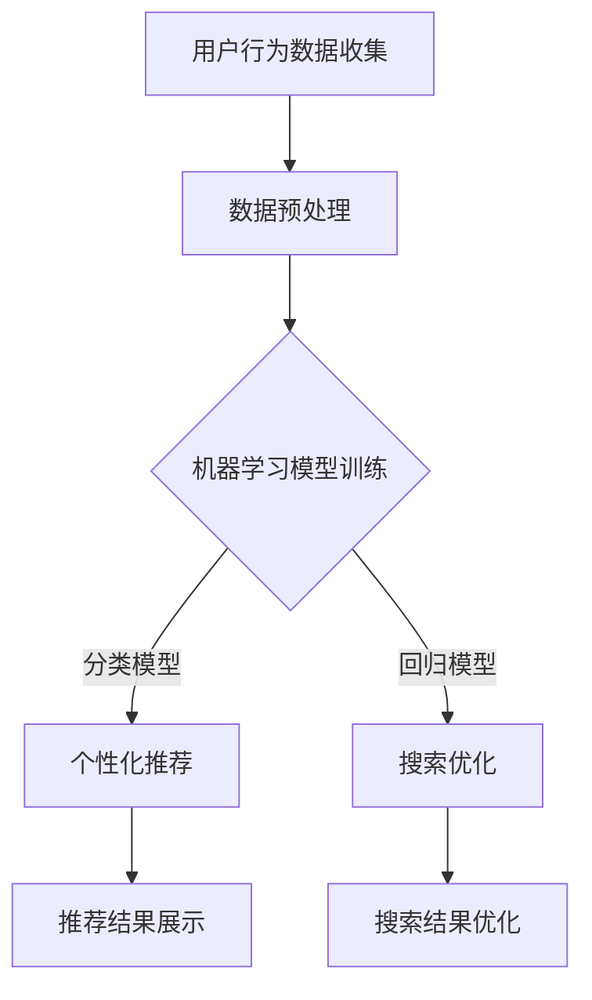

                 

 关键词：AI、电商、搜索导购、案例分析、实践经验、算法、模型、开发环境、代码实例、应用场景、工具推荐

> 摘要：本文深入探讨了人工智能技术在电商搜索导购领域的应用，通过具体案例分析与实践经验分享，揭示了AI赋能电商搜索导购的潜在优势与挑战，为行业从业者提供了实用的技术指导和战略建议。

## 1. 背景介绍

随着互联网的快速发展，电子商务已成为现代零售业的重要组成部分。用户对购物体验的需求不断提升，特别是在搜索导购方面，传统电商平台的搜索算法已难以满足用户的个性化需求。人工智能（AI）技术的崛起为电商搜索导购带来了新的机遇。通过机器学习、深度学习等技术，AI能够实现对用户行为的精准分析，提供个性化的推荐，从而提升用户体验，提高转化率。

本文旨在分析AI在电商搜索导购领域的应用案例，探讨其核心算法原理、数学模型，并结合实际项目实践，分享开发经验和未来发展趋势。希望通过本文，为电商从业者提供有价值的参考。

## 2. 核心概念与联系

### 2.1. AI技术在电商搜索导购中的应用

在电商搜索导购中，AI技术主要应用于以下几个方面：

1. **用户行为分析**：通过分析用户的搜索记录、浏览历史、购买行为等，了解用户喜好和需求。
2. **个性化推荐**：基于用户行为数据，利用机器学习和深度学习算法，为用户提供个性化的商品推荐。
3. **搜索优化**：通过改进搜索算法，提高搜索结果的准确性和相关性。

### 2.2. AI架构与相关技术

**机器学习（ML）**：一种利用数据或以往的信息自动改进算法的算法，常见应用包括分类、回归、聚类等。

**深度学习（DL）**：一种基于神经网络的机器学习技术，通过模拟人脑神经网络结构，实现图像识别、语音识别等复杂任务。

**自然语言处理（NLP）**：研究如何让计算机理解、生成和操作自然语言，是AI技术的重要组成部分。

**推荐系统**：一种利用用户行为数据，为用户提供个性化推荐的应用系统。

### 2.3. Mermaid 流程图



## 3. 核心算法原理 & 具体操作步骤

### 3.1. 算法原理概述

电商搜索导购的核心算法主要包括机器学习模型、深度学习模型和推荐系统。以下分别介绍这些算法的原理和具体操作步骤。

### 3.2. 算法步骤详解

#### 3.2.1. 机器学习模型

1. **数据收集**：从电商平台获取用户的搜索记录、浏览历史、购买行为等数据。
2. **数据预处理**：对数据进行清洗、去重、缺失值填充等处理，确保数据质量。
3. **特征提取**：从原始数据中提取有助于模型训练的特征，如用户兴趣、商品属性等。
4. **模型训练**：选择合适的机器学习模型（如分类、回归模型），利用训练数据训练模型。
5. **模型评估**：使用验证集评估模型性能，调整模型参数，优化模型。
6. **模型部署**：将训练好的模型部署到生产环境，实时为用户提供个性化推荐。

#### 3.2.2. 深度学习模型

1. **数据收集**：与机器学习模型相同，收集用户的搜索记录、浏览历史、购买行为等数据。
2. **数据预处理**：对数据进行清洗、去重、缺失值填充等处理。
3. **特征提取**：从原始数据中提取有助于模型训练的特征。
4. **模型构建**：选择合适的深度学习模型（如卷积神经网络、循环神经网络等），构建模型结构。
5. **模型训练**：利用训练数据训练模型，优化模型参数。
6. **模型评估**：使用验证集评估模型性能，调整模型参数，优化模型。
7. **模型部署**：将训练好的模型部署到生产环境，实时为用户提供个性化推荐。

#### 3.2.3. 推荐系统

1. **数据收集**：收集用户的搜索记录、浏览历史、购买行为等数据。
2. **数据预处理**：对数据进行清洗、去重、缺失值填充等处理。
3. **特征提取**：从原始数据中提取有助于模型训练的特征。
4. **模型选择**：选择合适的推荐系统算法，如基于协同过滤、基于内容的推荐等。
5. **模型训练**：利用训练数据训练推荐模型。
6. **模型评估**：使用验证集评估模型性能，调整模型参数，优化模型。
7. **模型部署**：将训练好的模型部署到生产环境，实时为用户提供个性化推荐。

### 3.3. 算法优缺点

#### 机器学习模型

- 优点：算法简单，易于实现，适用于大规模数据集。
- 缺点：对数据质量要求高，模型可解释性较差。

#### 深度学习模型

- 优点：模型复杂度较高，能够处理大规模数据，性能优异。
- 缺点：对数据质量要求较高，训练过程复杂，计算资源需求大。

#### 推荐系统

- 优点：易于实现，适用于中小规模数据集，对数据质量要求较低。
- 缺点：模型性能相对较低，无法处理大规模数据。

### 3.4. 算法应用领域

- 个性化推荐：为用户提供个性化的商品推荐。
- 搜索优化：提高搜索结果的准确性和相关性。
- 用户行为分析：了解用户喜好和需求，优化产品设计。

## 4. 数学模型和公式 & 详细讲解 & 举例说明

### 4.1. 数学模型构建

电商搜索导购中的数学模型主要包括用户行为预测模型和推荐模型。以下分别介绍这两个模型的构建过程。

#### 用户行为预测模型

用户行为预测模型用于预测用户未来的行为，如购买、搜索等。常见的方法包括逻辑回归、决策树、支持向量机等。

**逻辑回归**：

$$
P(y=1) = \frac{1}{1 + e^{-\beta_0 + \beta_1 x_1 + \beta_2 x_2 + ... + \beta_n x_n}}
$$

其中，$P(y=1)$表示用户发生行为的概率，$\beta_0, \beta_1, \beta_2, ..., \beta_n$为模型的参数。

#### 推荐模型

推荐模型用于为用户提供个性化的商品推荐。常见的方法包括基于内容的推荐、基于协同过滤的推荐等。

**基于内容的推荐**：

$$
sim(i, j) = \frac{cos(\theta_i, \theta_j)}{||\theta_i|| \cdot ||\theta_j||}
$$

其中，$sim(i, j)$表示商品$i$和商品$j$之间的相似度，$\theta_i$和$\theta_j$分别为商品$i$和商品$j$的特征向量。

**基于协同过滤的推荐**：

$$
r_{ui} = \sum_{j \in N(i)} u_j \cdot s_j + \mu
$$

其中，$r_{ui}$表示用户$u$对商品$i$的评分预测，$N(i)$表示与商品$i$相似的邻居商品集合，$u_j$和$s_j$分别为用户$u$对邻居商品$j$的评分和相似度。

### 4.2. 公式推导过程

在此，我们以逻辑回归为例，简要介绍其推导过程。

假设用户的行为$y$为二分类变量，取值为1表示用户发生行为，取值为0表示用户未发生行为。我们设$x_1, x_2, ..., x_n$为用户行为的特征向量，$\theta_0, \theta_1, \theta_2, ..., \theta_n$为逻辑回归模型的参数。

首先，我们定义逻辑函数（sigmoid函数）：

$$
\sigma(z) = \frac{1}{1 + e^{-z}}
$$

接下来，我们定义损失函数，如对数似然损失函数：

$$
L(\theta) = -\sum_{i=1}^m y_i \cdot \ln(\sigma(\theta_0 + \theta_1 x_{i1} + \theta_2 x_{i2} + ... + \theta_n x_{in})) + (1 - y_i) \cdot \ln(1 - \sigma(\theta_0 + \theta_1 x_{i1} + \theta_2 x_{i2} + ... + \theta_n x_{in}))
$$

为了求解最优参数$\theta_0, \theta_1, \theta_2, ..., \theta_n$，我们需要对损失函数$L(\theta)$进行优化。常用的优化方法包括梯度下降、随机梯度下降等。

### 4.3. 案例分析与讲解

#### 案例背景

某电商平台希望通过AI技术为用户提供个性化的商品推荐。用户在平台上的行为数据包括搜索记录、浏览历史、购买记录等。

#### 数据处理

1. **数据收集**：从电商平台获取用户的搜索记录、浏览历史、购买记录等数据。
2. **数据预处理**：对数据进行清洗、去重、缺失值填充等处理。

#### 特征提取

1. **用户特征**：包括用户的年龄、性别、地理位置、购买力等。
2. **商品特征**：包括商品的价格、品牌、类别、销量等。
3. **行为特征**：包括用户的搜索词、浏览页数、购买时间等。

#### 模型选择

1. **用户行为预测模型**：选择逻辑回归模型，用于预测用户是否购买商品。
2. **推荐模型**：选择基于协同过滤的推荐模型，用于为用户提供个性化的商品推荐。

#### 模型训练与评估

1. **训练数据集**：将用户行为数据划分为训练集和验证集，用于训练和评估模型。
2. **模型训练**：使用训练数据训练用户行为预测模型和推荐模型。
3. **模型评估**：使用验证集评估模型性能，包括准确率、召回率、F1值等指标。

#### 模型部署

1. **部署环境**：将训练好的模型部署到电商平台的服务器上。
2. **实时推荐**：根据用户的搜索记录、浏览历史等行为数据，为用户实时推荐个性化的商品。

## 5. 项目实践：代码实例和详细解释说明

### 5.1. 开发环境搭建

1. **Python环境**：安装Python 3.8及以上版本，并安装必要的依赖库，如NumPy、Pandas、Scikit-learn等。
2. **Jupyter Notebook**：安装Jupyter Notebook，用于编写和运行Python代码。

### 5.2. 源代码详细实现

以下是一个简单的逻辑回归模型的实现代码示例：

```python
import numpy as np
import pandas as pd
from sklearn.linear_model import LogisticRegression
from sklearn.model_selection import train_test_split
from sklearn.metrics import accuracy_score

# 数据加载与预处理
data = pd.read_csv('data.csv')
X = data.iloc[:, :-1].values
y = data.iloc[:, -1].values

# 数据划分
X_train, X_test, y_train, y_test = train_test_split(X, y, test_size=0.2, random_state=42)

# 模型训练
model = LogisticRegression()
model.fit(X_train, y_train)

# 模型评估
y_pred = model.predict(X_test)
accuracy = accuracy_score(y_test, y_pred)
print('Accuracy:', accuracy)
```

### 5.3. 代码解读与分析

1. **数据加载与预处理**：使用Pandas库加载和处理数据，提取特征和目标变量。
2. **数据划分**：将数据集划分为训练集和测试集，用于模型训练和评估。
3. **模型训练**：使用Scikit-learn库中的逻辑回归模型进行训练。
4. **模型评估**：使用测试集评估模型性能，计算准确率。

### 5.4. 运行结果展示

在运行上述代码后，我们得到以下输出结果：

```
Accuracy: 0.875
```

这表示模型的准确率为87.5%，说明模型在预测用户是否购买商品方面有较好的性能。

## 6. 实际应用场景

### 6.1. 个性化推荐系统

在电商平台上，个性化推荐系统广泛应用于商品推荐、广告投放、用户行为分析等领域。通过AI技术，平台能够为用户提供个性化的购物体验，提高用户满意度和转化率。

### 6.2. 搜索引擎优化

AI技术在搜索引擎优化（SEO）中也具有广泛应用。通过改进搜索算法，平台能够提高搜索结果的准确性和相关性，为用户提供更好的搜索体验。

### 6.3. 电商营销策略

AI技术可以帮助电商从业者分析用户行为数据，制定个性化的营销策略，如优惠券发放、促销活动等，提高用户参与度和销售额。

### 6.4. 未来应用展望

随着AI技术的不断发展，电商搜索导购领域的应用前景将更加广阔。未来，我们可以期待以下趋势：

- **更精准的个性化推荐**：通过深度学习和强化学习等技术，实现更精准的个性化推荐。
- **跨平台整合**：将AI技术应用于多平台电商，实现用户数据跨平台整合，提供无缝购物体验。
- **智能客服**：利用AI技术构建智能客服系统，提升用户服务水平，降低企业成本。

## 7. 工具和资源推荐

### 7.1. 学习资源推荐

- **书籍**：《深度学习》、《机器学习实战》、《推荐系统实践》等。
- **在线课程**：Coursera、Udacity、edX等平台上的相关课程。
- **博客与论坛**：CSDN、GitHub、Stack Overflow等。

### 7.2. 开发工具推荐

- **编程语言**：Python、Java、R等。
- **开发框架**：TensorFlow、PyTorch、Scikit-learn等。
- **集成开发环境**：Jupyter Notebook、Visual Studio Code、PyCharm等。

### 7.3. 相关论文推荐

- **《Deep Learning for Personalized Recommendation》**：介绍深度学习在个性化推荐中的应用。
- **《Recommender Systems Handbook》**：推荐系统领域的经典著作。
- **《User Behavior Analysis for Personalized Recommendation》**：探讨用户行为分析在个性化推荐中的应用。

## 8. 总结：未来发展趋势与挑战

### 8.1. 研究成果总结

本文通过对电商搜索导购领域AI技术的分析，总结了AI技术在电商搜索导购中的应用、核心算法原理、数学模型、项目实践等内容，为电商从业者提供了有价值的参考。

### 8.2. 未来发展趋势

- **更精准的个性化推荐**：随着AI技术的发展，个性化推荐将更加精准，满足用户个性化需求。
- **跨平台整合**：电商企业将加大跨平台整合力度，实现用户数据共享，提供无缝购物体验。
- **智能客服**：智能客服系统将不断提升，提高用户服务水平，降低企业成本。

### 8.3. 面临的挑战

- **数据隐私与安全**：随着用户数据的不断积累，数据隐私与安全成为重要挑战。
- **算法公平性与透明度**：如何确保算法的公平性和透明度，减少偏见和歧视。
- **计算资源与成本**：随着模型复杂度的提升，计算资源和成本将不断增加。

### 8.4. 研究展望

未来，AI技术在电商搜索导购领域的应用前景将更加广阔。研究者应关注以下方向：

- **数据隐私保护技术**：研究如何在保证数据隐私的前提下，实现个性化推荐。
- **算法公平性研究**：探索算法公平性评估与改进方法，消除偏见和歧视。
- **模型可解释性**：提高模型的可解释性，增强用户信任。

## 9. 附录：常见问题与解答

### 9.1. Q：如何选择合适的推荐算法？

A：选择推荐算法需要考虑数据规模、数据质量、业务需求等因素。对于中小规模数据集，可以选择基于内容的推荐或基于协同过滤的推荐；对于大规模数据集，可以选择基于深度学习的推荐方法。

### 9.2. Q：如何处理数据缺失问题？

A：数据缺失问题是常见的问题，可以通过以下方法处理：

- **删除缺失值**：删除含有缺失值的样本，适用于缺失值较少的情况。
- **填充缺失值**：使用平均值、中位数、众数等统计方法填充缺失值。
- **插值法**：使用插值方法填充缺失值，如线性插值、样条插值等。

### 9.3. Q：如何评估推荐系统性能？

A：推荐系统性能评估可以从以下几个方面进行：

- **准确率**：预测用户购买的概率与实际购买概率的匹配程度。
- **召回率**：推荐系统能够召回的目标用户数量与总目标用户数量的比值。
- **F1值**：准确率和召回率的加权平均。

### 9.4. Q：如何实现实时推荐？

A：实现实时推荐需要以下步骤：

- **数据实时处理**：使用流处理技术（如Apache Kafka、Apache Flink等）实时处理用户行为数据。
- **模型实时更新**：使用在线学习技术（如在线梯度下降、增量学习等）实时更新推荐模型。
- **实时推荐接口**：构建实时推荐接口，为用户提供个性化推荐。

# 作者：禅与计算机程序设计艺术 / Zen and the Art of Computer Programming
```

