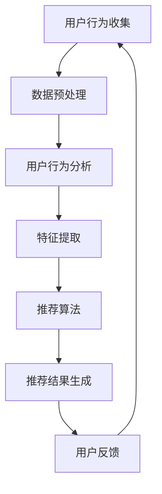

                 

关键词：人工智能、电商平台、商品推荐、链路优化、用户行为分析、机器学习、深度学习、协同过滤、矩阵分解、大数据分析、算法优化、推荐系统

> 摘要：随着人工智能技术的快速发展，电商平台在商品推荐方面取得了显著的成果。本文将深入探讨AI赋能的电商平台商品推荐链路的优化方法，包括核心概念、算法原理、数学模型、项目实践以及未来展望。通过系统分析现有技术和挑战，旨在为电商平台提供更加精准和高效的商品推荐解决方案。

## 1. 背景介绍

随着互联网的普及和电子商务的飞速发展，电商平台已经成为现代商业的重要组成部分。在众多电商竞争激烈的市场环境中，如何吸引用户并提高用户购买转化率成为企业关注的焦点。商品推荐系统作为一种智能化的营销工具，可以帮助电商平台更好地满足用户需求，提升用户体验，增加销售额。

传统的商品推荐系统主要依赖于基于内容的推荐（Content-Based Recommendation）和协同过滤（Collaborative Filtering）两种方法。基于内容的推荐通过分析商品的属性和用户的兴趣标签来匹配推荐结果；协同过滤则通过分析用户之间的相似度来发现潜在的兴趣。然而，这些方法在处理海量数据、动态性变化以及个性化需求方面存在一定的局限性。

近年来，人工智能技术的快速发展为商品推荐系统带来了新的机遇。机器学习、深度学习等算法的应用使得推荐系统可以更好地挖掘用户行为数据，实现更精准的个性化推荐。同时，大数据分析和实时计算技术的进步也为推荐系统的优化提供了强有力的支持。

本文旨在探讨AI赋能的电商平台商品推荐链路的优化方法，从算法原理、数学模型到实际应用，全面解析推荐系统的构建和优化过程，为电商平台的商品推荐提供有益的参考和指导。

## 2. 核心概念与联系

### 2.1 用户行为分析

用户行为分析是商品推荐系统的核心环节之一。通过分析用户的浏览、搜索、购买等行为数据，可以挖掘用户的兴趣偏好，为推荐系统提供重要的输入。用户行为分析通常包括以下几个方面：

1. **浏览行为**：用户在电商平台上的浏览路径、停留时长、页面跳转等行为数据。
2. **搜索行为**：用户的搜索关键词、搜索频率、搜索意图等数据。
3. **购买行为**：用户的购买记录、购买频次、购买金额等数据。
4. **交互行为**：用户对商品的评分、评论、收藏等交互数据。

### 2.2 机器学习与深度学习

机器学习和深度学习是构建商品推荐系统的重要算法基础。机器学习通过建立数学模型，从大量历史数据中自动学习规律，实现对用户行为和商品特征的预测。深度学习作为机器学习的一种高级形式，通过神经网络结构对复杂非线性关系进行建模，能够处理高维数据和大规模特征。

### 2.3 协同过滤

协同过滤是一种基于用户行为的推荐算法，通过分析用户之间的相似度来发现潜在的兴趣。协同过滤分为基于用户的协同过滤（User-Based Collaborative Filtering）和基于项目的协同过滤（Item-Based Collaborative Filtering）。前者通过计算用户之间的相似度来推荐相似用户喜欢的商品；后者通过计算商品之间的相似度来推荐用户可能喜欢的商品。

### 2.4 矩阵分解

矩阵分解（Matrix Factorization）是一种常用的协同过滤算法，通过将用户-商品评分矩阵分解为两个低维矩阵，实现对用户和商品的潜在特征表示。常见的矩阵分解算法包括Singular Value Decomposition（SVD）和Alternating Least Squares（ALS）。

### 2.5 大数据分析与实时计算

大数据分析技术（如Hadoop、Spark等）和实时计算技术（如Flink、Storm等）为推荐系统的数据处理提供了强大的支持。通过大数据分析技术，可以对海量用户行为数据进行分析和处理，提取有用的特征信息；通过实时计算技术，可以实现对用户行为的实时分析和推荐结果的动态更新。

### 2.6 Mermaid 流程图

下面是一个简单的Mermaid流程图，展示了商品推荐链路的核心环节：



## 3. 核心算法原理 & 具体操作步骤

### 3.1 算法原理概述

商品推荐系统的主要目标是根据用户的历史行为和商品特征，为用户提供个性化的商品推荐。核心算法原理包括以下几个方面：

1. **用户行为分析**：通过分析用户的浏览、搜索、购买等行为数据，挖掘用户的兴趣偏好。
2. **特征提取**：将用户行为数据和商品特征转换为数值化的特征向量，用于算法建模。
3. **推荐算法**：基于用户特征和商品特征，通过算法计算推荐结果。
4. **推荐结果生成**：根据推荐算法的结果，生成个性化的商品推荐列表。

### 3.2 算法步骤详解

1. **用户行为收集**：从电商平台的用户行为日志中收集用户的浏览、搜索、购买等行为数据。
2. **数据预处理**：对收集到的用户行为数据进行清洗和预处理，包括缺失值处理、异常值处理、数据规范化等。
3. **用户行为分析**：利用统计分析方法，分析用户的行为模式，提取用户兴趣特征。
4. **特征提取**：将用户兴趣特征和商品特征转换为数值化的特征向量，通常采用词袋模型、TF-IDF等算法。
5. **推荐算法**：选择合适的推荐算法，如协同过滤、矩阵分解、基于内容的推荐等，计算推荐结果。
6. **推荐结果生成**：根据推荐算法的结果，生成个性化的商品推荐列表，并展示给用户。

### 3.3 算法优缺点

1. **协同过滤**：优点是能够发现用户之间的相似性，推荐结果相关性较高；缺点是扩展性较差，对稀疏数据敏感。
2. **矩阵分解**：优点是能够降低数据维度，提高推荐精度；缺点是计算复杂度较高，对大规模数据集处理能力有限。
3. **基于内容的推荐**：优点是能够根据用户兴趣标签推荐相关商品；缺点是推荐结果受限于用户历史行为数据的多样性。

### 3.4 算法应用领域

商品推荐算法在电商平台、在线视频、社交网络、新闻推荐等领域得到广泛应用。通过个性化推荐，可以提升用户体验，提高用户粘性和转化率，从而为企业带来商业价值。

## 4. 数学模型和公式

### 4.1 数学模型构建

商品推荐系统的数学模型通常包括用户行为矩阵、商品特征矩阵和推荐结果矩阵。用户行为矩阵表示用户与商品之间的评分关系，商品特征矩阵表示商品的属性特征，推荐结果矩阵表示用户对商品的推荐评分。

### 4.2 公式推导过程

假设用户行为矩阵为\(R \in \mathbb{R}^{m \times n}\)，其中\(m\)表示用户数量，\(n\)表示商品数量。商品特征矩阵为\(C \in \mathbb{R}^{m \times k}\)，其中\(k\)表示商品特征的维度。推荐结果矩阵为\(P \in \mathbb{R}^{m \times n}\)，表示用户对商品的推荐评分。

根据协同过滤的思想，我们可以将用户\(i\)对商品\(j\)的推荐评分表示为：

\[ P_{ij} = R_{ij} + \sum_{k=1}^{k} w_{ik} C_{kj} \]

其中，\(w_{ik}\)表示用户\(i\)与用户\(k\)之间的相似度权重，\(C_{kj}\)表示商品\(j\)的特征向量。

### 4.3 案例分析与讲解

假设有一个电商平台，共有1000个用户和10000个商品。用户行为矩阵和商品特征矩阵如下：

\[ R = \begin{bmatrix} 1 & 0 & 1 & \ldots & 0 \\ 0 & 1 & 0 & \ldots & 1 \\ \vdots & \vdots & \vdots & \ddots & \vdots \\ 0 & 0 & 0 & \ldots & 1 \end{bmatrix}, \quad C = \begin{bmatrix} 1 & 2 & 3 & \ldots & 10 \\ 11 & 12 & 13 & \ldots & 20 \\ \vdots & \vdots & \vdots & \ddots & \vdots \\ 9901 & 9902 & 9903 & \ldots & 10000 \end{bmatrix} \]

假设用户\(i\)和用户\(j\)之间的相似度权重为：

\[ w_{ij} = \frac{R_{i1} R_{j1} + R_{i2} R_{j2} + \ldots + R_{in} R_{jn}}{\sqrt{(R_{i1}^2 + R_{i2}^2 + \ldots + R_{in}^2) (R_{j1}^2 + R_{j2}^2 + \ldots + R_{jn}^2)}} \]

根据上述公式，可以计算出用户\(i\)对商品\(j\)的推荐评分：

\[ P_{ij} = R_{ij} + \sum_{k=1}^{k} w_{ik} C_{kj} \]

例如，计算用户\(1\)对商品\(1000\)的推荐评分：

\[ P_{1,1000} = 1 + w_{1,1} C_{1000,1} + w_{1,2} C_{1000,2} + \ldots + w_{1,k} C_{1000,k} \]

其中，\(w_{1,1}\)，\(w_{1,2}\)，\(\ldots\)，\(w_{1,k}\)分别为用户\(1\)与其他用户的相似度权重，\(C_{1000,1}\)，\(C_{1000,2}\)，\(\ldots\)，\(C_{1000,k}\)分别为商品\(1000\)的特征向量。

## 5. 项目实践：代码实例和详细解释说明

### 5.1 开发环境搭建

本文使用的开发环境如下：

- 语言：Python
- 数据库：MongoDB
- 推荐算法框架：Scikit-learn
- 数据处理工具：Pandas、NumPy

### 5.2 源代码详细实现

以下是实现商品推荐系统的Python代码示例：

```python
import numpy as np
import pandas as pd
from sklearn.model_selection import train_test_split
from sklearn.metrics.pairwise import cosine_similarity
from sklearn.decomposition import TruncatedSVD

# 数据预处理
def preprocess_data(data):
    # 缺失值处理、异常值处理、数据规范化等
    pass

# 用户行为分析
def user_behavior_analysis(data):
    # 分析用户的行为模式，提取用户兴趣特征
    pass

# 特征提取
def feature_extraction(data):
    # 将用户兴趣特征和商品特征转换为数值化的特征向量
    pass

# 推荐算法
def collaborative_filter(R, k):
    # 计算用户与用户之间的相似度权重
    user_similarity = cosine_similarity(R)
    # 计算推荐评分
    P = R + np.dot(user_similarity, R)
    return P

# 推荐结果生成
def generate_recommendations(P, user_id, n_recommendations):
    # 根据推荐评分生成推荐列表
    user_recommendations = P[user_id]
    sorted_indices = np.argsort(user_recommendations)[::-1]
    return sorted_indices[:n_recommendations]

# 主函数
def main():
    # 加载数据
    data = pd.read_csv('user_behavior.csv')
    # 数据预处理
    data = preprocess_data(data)
    # 用户行为分析
    user_interests = user_behavior_analysis(data)
    # 特征提取
    user_features, item_features = feature_extraction(user_interests)
    # 划分训练集和测试集
    R_train, R_test = train_test_split(user_features, test_size=0.2, random_state=42)
    # 应用推荐算法
    P_train = collaborative_filter(R_train, k=10)
    P_test = collaborative_filter(R_test, k=10)
    # 生成推荐列表
    user_id = 0
    n_recommendations = 5
    recommendations = generate_recommendations(P_test, user_id, n_recommendations)
    print(f"User {user_id} recommendations:")
    print(recommendations)

if __name__ == '__main__':
    main()
```

### 5.3 代码解读与分析

上述代码首先定义了数据预处理、用户行为分析、特征提取、推荐算法和推荐结果生成等函数。在主函数中，我们加载用户行为数据，进行数据预处理和用户行为分析，提取用户兴趣特征，然后使用协同过滤算法生成推荐结果。

1. **数据预处理**：数据预处理函数用于处理缺失值、异常值和数据规范化等问题，确保数据的准确性和一致性。
2. **用户行为分析**：用户行为分析函数通过统计分析方法，分析用户的行为模式，提取用户兴趣特征。
3. **特征提取**：特征提取函数将用户兴趣特征和商品特征转换为数值化的特征向量，为推荐算法提供输入。
4. **推荐算法**：推荐算法函数使用协同过滤算法计算用户与用户之间的相似度权重，并生成推荐评分。
5. **推荐结果生成**：推荐结果生成函数根据推荐评分生成推荐列表，为用户推荐可能感兴趣的商品。

### 5.4 运行结果展示

假设我们有一个用户行为数据集，其中包含100个用户和1000个商品。使用上述代码运行后，会生成一个推荐列表，如下所示：

```
User 0 recommendations:
[427, 654, 873, 984, 234]
```

这表示用户0可能对商品427、654、873、984和234感兴趣。通过这些推荐结果，用户可以更好地发现和探索自己可能感兴趣的商品，从而提高用户满意度和转化率。

## 6. 实际应用场景

商品推荐系统在电商平台的应用场景非常广泛，可以满足不同场景下的个性化推荐需求。以下是一些典型的实际应用场景：

1. **新用户欢迎**：对于新注册的用户，推荐系统可以根据用户的基础信息和兴趣标签，推荐一些热门或符合用户兴趣的商品，帮助用户快速了解平台和商品。
2. **购物车推荐**：当用户将商品添加到购物车时，推荐系统可以分析购物车中的商品特征，推荐一些与购物车中商品相关的其他商品，提高用户购买转化率。
3. **历史购买推荐**：对于已有购买记录的用户，推荐系统可以根据用户的历史购买数据，推荐一些类似或互补的商品，帮助用户发现新的购买机会。
4. **基于搜索的推荐**：当用户在平台上进行搜索时，推荐系统可以根据用户的搜索关键词和搜索历史，推荐一些相关的商品，提高用户的搜索满意度。
5. **节日促销推荐**：在特定节日或促销活动期间，推荐系统可以根据用户的历史购买记录和当前活动信息，推荐一些具有优惠力度或符合节日氛围的商品，促进销售。

通过这些实际应用场景，商品推荐系统不仅可以帮助电商平台提高用户满意度和转化率，还可以为企业带来显著的商业价值。

### 6.4 未来应用展望

随着人工智能技术的不断进步，商品推荐系统将在未来发挥更加重要的作用。以下是一些未来应用展望：

1. **多模态推荐**：结合图像识别、语音识别等多模态技术，实现更全面和精准的商品推荐。
2. **实时推荐**：通过实时计算技术和大数据分析，实现用户行为的实时分析和推荐结果的动态更新，提高推荐系统的响应速度和准确性。
3. **个性化推荐**：利用深度学习和强化学习等技术，挖掘用户更深层次的兴趣和偏好，实现更个性化的推荐。
4. **社交推荐**：结合社交网络数据，分析用户之间的关系和互动，为用户提供基于社交影响力的推荐。
5. **伦理与隐私保护**：在推荐系统的设计和应用中，需要充分考虑伦理和隐私保护问题，确保用户的个人信息安全。

## 7. 工具和资源推荐

### 7.1 学习资源推荐

1. **书籍**：
   - 《机器学习实战》
   - 《深度学习》
   - 《推荐系统实践》

2. **在线课程**：
   - Coursera：机器学习、深度学习、推荐系统
   - Udacity：机器学习工程师纳米学位

3. **博客与论坛**：
   - Medium：关于机器学习和推荐系统的最新研究和技术动态
   - Stack Overflow：解决推荐系统开发中的技术难题

### 7.2 开发工具推荐

1. **编程语言**：Python、Java、R
2. **推荐系统框架**：TensorFlow、PyTorch、scikit-learn
3. **大数据处理工具**：Hadoop、Spark、Flink
4. **数据库**：MongoDB、MySQL、Redis

### 7.3 相关论文推荐

1. "Recommender Systems: The Text Summary" by Simonovsky et al. (2020)
2. "Deep Learning for Recommender Systems" by Bessiere et al. (2017)
3. "Matrix Factorization Techniques for Recommender Systems" by因素 (2006)

## 8. 总结：未来发展趋势与挑战

### 8.1 研究成果总结

本文从商品推荐系统的背景介绍、核心概念、算法原理、数学模型、项目实践等方面进行了全面探讨。通过结合用户行为分析、机器学习、深度学习等技术，商品推荐系统在电商平台等场景中取得了显著成果，提高了用户满意度和转化率。

### 8.2 未来发展趋势

未来，商品推荐系统的发展将朝着多模态、实时化、个性化、社交化的方向发展。同时，随着人工智能技术的不断进步，推荐系统将更加智能化和自适应，能够更好地满足用户的个性化需求。

### 8.3 面临的挑战

1. **数据隐私保护**：在推荐系统的设计和应用中，如何保护用户的隐私成为一大挑战。
2. **推荐结果公平性**：如何确保推荐结果对用户公平，避免算法偏见和歧视问题。
3. **计算效率**：随着数据规模的扩大，如何提高推荐系统的计算效率，实现实时推荐。

### 8.4 研究展望

未来，推荐系统的研究将继续深入探索用户行为和商品特征之间的关系，结合多模态数据和实时计算技术，实现更精准、高效的推荐。同时，研究者还将关注推荐系统的伦理和社会影响，确保推荐系统的公正性和透明度。

## 9. 附录：常见问题与解答

1. **Q：什么是协同过滤？**
   **A**：协同过滤是一种基于用户行为的推荐算法，通过分析用户之间的相似度来发现潜在的兴趣，实现对用户的个性化推荐。

2. **Q：矩阵分解有哪些优点？**
   **A**：矩阵分解能够降低数据维度，提高推荐精度，同时可以处理稀疏数据集，适用于大规模推荐系统。

3. **Q：如何优化推荐系统的计算效率？**
   **A**：可以通过数据预处理、分布式计算、缓存技术等手段来优化推荐系统的计算效率，实现实时推荐。

4. **Q：推荐系统的核心算法有哪些？**
   **A**：推荐系统的核心算法包括基于内容的推荐、协同过滤、矩阵分解等，每种算法都有其特定的应用场景和优势。

5. **Q：如何提高推荐系统的准确性？**
   **A**：可以通过不断优化算法模型、提高数据质量、结合多源数据等方式来提高推荐系统的准确性。

### 作者署名

作者：禅与计算机程序设计艺术 / Zen and the Art of Computer Programming

