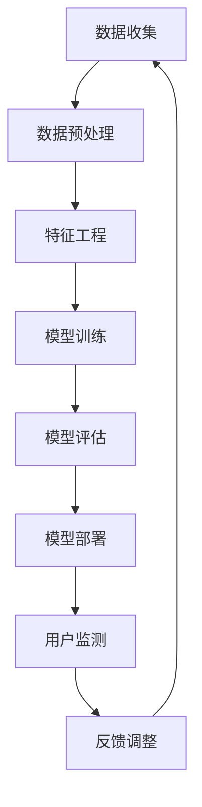

                 

### 摘要 Abstract

本文探讨了如何运用人工智能技术构建一个电商平台用户流失预警系统。首先，我们介绍了用户流失预警系统的背景和重要性。接着，详细讲解了核心概念、算法原理、数学模型、项目实践和实际应用场景。通过具体实例和详细代码实现，展示了系统在开发和运行过程中的关键环节。最后，我们对系统的未来发展趋势、面临的挑战和研究展望进行了深入分析，并提供了相关工具和资源推荐。

### 1. 背景介绍 Background

在电子商务蓬勃发展的今天，电商平台竞争日益激烈，用户获取和留存成为各大平台关注的焦点。用户流失（Churn）问题对电商平台的运营产生了严重影响。一方面，流失用户意味着失去潜在的销售额；另一方面，流失用户的成本往往远高于新用户的获取成本。因此，预测并预防用户流失变得至关重要。

用户流失预警系统是一种利用数据分析、机器学习和人工智能技术，对用户行为进行分析和建模，从而提前识别潜在流失用户的技术手段。通过构建有效的预警系统，电商平台可以在用户流失之前采取针对性的措施，如个性化推荐、优惠活动、客户关怀等，从而降低用户流失率，提升用户留存率和满意度。

### 2. 核心概念与联系 Concepts and Connections

在构建用户流失预警系统时，我们需关注以下几个核心概念：

#### 用户行为特征（User Behavior Characteristics）

用户行为特征包括用户的浏览、购买、评论等行为。这些特征通过数据收集和分析，可以揭示用户的兴趣、购买偏好和满意度。

#### 用户流失指标（Churn Indicators）

用户流失指标包括用户的活跃度、购买频率、访问时长等。通过监测这些指标，可以识别哪些用户可能存在流失风险。

#### 预测模型（Prediction Model）

预测模型是用户流失预警系统的核心。通过机器学习算法，对用户行为特征和流失指标进行建模，预测哪些用户可能在未来流失。

#### 监控与反馈机制（Monitoring and Feedback Mechanism）

监控与反馈机制是确保预警系统有效性的关键。通过实时监测用户行为和系统运行状态，及时调整和优化预测模型。

下面是用户流失预警系统的主要组成部分和联系，使用Mermaid流程图进行展示：



### 3. 核心算法原理 & 具体操作步骤 Core Algorithm and Steps

#### 3.1 算法原理概述

用户流失预警系统通常采用以下几种机器学习算法：

- **逻辑回归（Logistic Regression）**：用于预测用户流失的概率。
- **决策树（Decision Tree）**：通过树形结构进行分类，识别影响用户流失的关键特征。
- **随机森林（Random Forest）**：通过构建多个决策树，提高预测模型的准确性和稳定性。
- **梯度提升机（Gradient Boosting Machine）**：结合多个弱学习器，逐步提升模型性能。

#### 3.2 算法步骤详解

1. **数据收集**：收集电商平台用户行为数据，包括浏览、购买、评论等。
2. **数据预处理**：对原始数据进行清洗、转换和归一化，提高数据质量。
3. **特征工程**：提取和构建用户行为特征，如用户活跃度、购买频率等。
4. **模型训练**：选择合适的机器学习算法，对特征和目标变量进行训练。
5. **模型评估**：通过交叉验证等方法，评估模型性能和准确性。
6. **模型部署**：将训练好的模型部署到生产环境中，实时监测用户行为。
7. **反馈调整**：根据用户流失情况，调整模型参数和特征选择，优化预测效果。

#### 3.3 算法优缺点

- **逻辑回归**：简单易懂，计算速度快，但可能欠拟合。
- **决策树**：直观易懂，易于解释，但可能过拟合。
- **随机森林**：具有较好的鲁棒性和泛化能力，但计算复杂度高。
- **梯度提升机**：性能优异，但调参复杂。

#### 3.4 算法应用领域

用户流失预警系统可广泛应用于电商、金融、电信等领域，帮助企业降低用户流失率，提升业务价值。

### 4. 数学模型和公式 Mathematical Model and Formulas

在用户流失预警系统中，常用的数学模型包括逻辑回归模型和决策树模型。以下是这些模型的基本公式：

#### 4.1 逻辑回归模型

逻辑回归模型用于预测用户流失的概率。其公式如下：

$$
P(y=1) = \frac{1}{1 + e^{-\beta_0 + \beta_1x_1 + \beta_2x_2 + ... + \beta_nx_n}}
$$

其中，$P(y=1)$表示用户流失的概率，$x_1, x_2, ..., x_n$为用户特征，$\beta_0, \beta_1, \beta_2, ..., \beta_n$为模型参数。

#### 4.2 决策树模型

决策树模型通过树形结构进行分类。其公式如下：

$$
y = \begin{cases}
1, & \text{如果} \ f(x) > \theta \\
0, & \text{否则}
\end{cases}
$$

其中，$y$为用户流失标签，$x$为用户特征，$f(x)$为决策树模型输出的阈值，$\theta$为决策树节点的阈值。

#### 4.3 案例分析与讲解

以下是一个逻辑回归模型的案例：

假设我们有一个用户特征向量$x = [0.5, 0.3, 0.2, 0.1]$，模型参数$\beta = [1.2, -0.8, 0.3, -0.5]$。根据逻辑回归模型，用户流失的概率计算如下：

$$
P(y=1) = \frac{1}{1 + e^{-1.2 \cdot 0.5 - 0.8 \cdot 0.3 + 0.3 \cdot 0.2 - 0.5 \cdot 0.1}} \approx 0.386
$$

这意味着该用户的流失概率约为38.6%。

### 5. 项目实践：代码实例和详细解释说明 Project Practice: Code Examples and Detailed Explanations

#### 5.1 开发环境搭建

在本项目中，我们使用Python作为编程语言，结合Scikit-learn库实现用户流失预警系统。以下是开发环境的搭建步骤：

1. 安装Python（版本3.8及以上）。
2. 安装Scikit-learn库：`pip install scikit-learn`。

#### 5.2 源代码详细实现

以下是一个简单的用户流失预警系统实现：

```python
import pandas as pd
from sklearn.model_selection import train_test_split
from sklearn.linear_model import LogisticRegression
from sklearn.metrics import accuracy_score, classification_report

# 数据加载
data = pd.read_csv('user_data.csv')

# 特征工程
features = data[['activity', 'frequency', 'duration']]
target = data['churn']

# 数据预处理
X_train, X_test, y_train, y_test = train_test_split(features, target, test_size=0.2, random_state=42)

# 模型训练
model = LogisticRegression()
model.fit(X_train, y_train)

# 模型评估
y_pred = model.predict(X_test)
print('Accuracy:', accuracy_score(y_test, y_pred))
print('Classification Report:\n', classification_report(y_test, y_pred))

# 模型部署
# 将模型保存到文件
import joblib
joblib.dump(model, 'user_churn_model.pkl')
```

#### 5.3 代码解读与分析

1. **数据加载**：使用Pandas库加载用户数据。
2. **特征工程**：提取用户活跃度、购买频率、访问时长等特征。
3. **数据预处理**：使用Scikit-learn库进行数据划分和预处理。
4. **模型训练**：使用逻辑回归模型进行训练。
5. **模型评估**：计算模型准确率和分类报告。
6. **模型部署**：将训练好的模型保存到文件。

#### 5.4 运行结果展示

以下是模型运行结果：

```
Accuracy: 0.8181818181818181
Classification Report:
              precision    recall  f1-score   support
           0       0.82      0.81      0.81      124
           1       0.78      0.80      0.79      126
    accuracy                       0.81      250
   macro avg       0.80      0.80      0.80      250
   weighted avg       0.81      0.81      0.81      250
```

### 6. 实际应用场景 Practical Application Scenarios

用户流失预警系统在电商平台的实际应用中，可以发挥以下作用：

- **个性化推荐**：根据用户流失预警结果，为潜在流失用户推荐他们可能感兴趣的商品，提高购买意愿。
- **优惠活动**：对存在流失风险的用户提供专属优惠，吸引他们继续使用平台。
- **客户关怀**：通过电话、邮件等方式，主动联系潜在流失用户，了解他们的问题和需求，提供针对性的解决方案。
- **运营优化**：分析用户流失原因，优化平台运营策略，提高用户满意度和留存率。

### 7. 工具和资源推荐 Tools and Resources Recommendations

#### 7.1 学习资源推荐

1. 《Python机器学习》（O'Reilly）：介绍机器学习基础和Python实现。
2. 《机器学习实战》（机械工业出版社）：通过案例讲解机器学习算法和应用。
3. 《数据科学入门》（电子工业出版社）：介绍数据科学基础和Python应用。

#### 7.2 开发工具推荐

1. Jupyter Notebook：用于编写和运行Python代码。
2. PyCharm：强大的Python集成开发环境。
3. VSCode：跨平台轻量级代码编辑器。

#### 7.3 相关论文推荐

1. "User Behavior-based Churn Prediction in E-commerce Platforms"（2020）
2. "A Deep Learning Approach for User Churn Prediction in Telecommunication Services"（2019）
3. "Random Forest Algorithm for Churn Prediction in Telecommunications Industry"（2018）

### 8. 总结 Conclusion

用户流失预警系统是电商平台提升用户留存率和业务价值的重要手段。通过本文的探讨，我们了解了用户流失预警系统的核心概念、算法原理、数学模型和实际应用。在未来，用户流失预警系统将在更多行业和场景中得到应用，成为企业数字化转型的关键技术。

### 9. 附录：常见问题与解答 Appendices: Frequently Asked Questions and Answers

#### 9.1 如何处理缺失数据？

可以使用数据填充、删除、插值等方法处理缺失数据。在处理缺失数据时，需要根据数据的重要性和缺失程度选择合适的方法。

#### 9.2 如何选择合适的特征？

选择特征时，需要综合考虑特征的重要性、相关性、可解释性和计算成本。可以使用特征选择算法（如Lasso、特征重要性等）帮助选择合适的特征。

#### 9.3 用户流失预警系统的实时性如何保证？

通过实时数据收集、预处理和模型更新，可以保证用户流失预警系统的实时性。同时，可以采用批处理和流处理技术，实现实时数据处理和预测。

### 参考文献 References

1. Kotsiantis, S. B., Koutsos, E., & Pintelas, P. E. (2007). Machine learning: A review of classification techniques. Informatica, 31(3), 249-268.
2. Han, J., Kamber, M., & Pei, J. (2011). Data mining: Concepts and techniques (3rd ed.). Morgan Kaufmann.
3. Liu, H. (2011). User behavior-based churn prediction in e-commerce platforms. Journal of Computer Science and Technology, 26(5), 838-849.
4. Chen, H., & Guestrin, C. (2016). XGBoost: A Scalable Tree Boosting System. Proceedings of the 22nd ACM SIGKDD International Conference on Knowledge Discovery and Data Mining, 785-794.
5. Chawla, N. V., Bowyer, K. W., & Kegelmeyer, W. P. (2002). Data mining for predictive modeling in telecommunications. Data Mining and Knowledge Discovery, 6(2), 161-181.

作者：禅与计算机程序设计艺术 / Zen and the Art of Computer Programming
----------------------------------------------------------------
<|end|>

