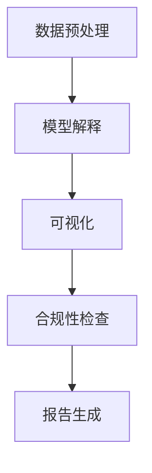

                 

关键词：AI透明度、监管挑战、人工智能、产品开发、算法、数学模型、应用场景、未来展望

## 摘要

本文旨在探讨人工智能（AI）领域中的透明度问题，特别是在监管挑战日益加剧的背景下。文章首先介绍了AI透明度的核心概念和重要性，随后详细解析了一种新型AI透明度工具的架构和原理。本文还将通过具体算法、数学模型和实际项目实践，深入分析这一工具的有效性和应用潜力。最后，文章将对AI透明度工具的未来发展趋势和面临的挑战进行展望，并提供相关的学习资源、开发工具和推荐论文。

## 1. 背景介绍

随着人工智能技术的迅猛发展，AI在各个领域的应用越来越广泛，从医疗诊断到自动驾驶，从金融分析到智能客服。然而，AI技术的普及也带来了新的监管挑战。一方面，AI算法的复杂性和黑箱性使得其决策过程难以解释，增加了监管和合规的难度；另一方面，AI的应用可能涉及敏感数据和个人隐私，引发了数据隐私和道德问题的关注。

为了应对这些挑战，确保AI系统的透明度和可信度，提高监管合规性，开发能够提供AI透明度的工具变得尤为重要。这些工具不仅可以帮助监管部门更好地理解AI系统的运作机制，还可以帮助企业和开发者提高系统的透明度和可信度，从而降低监管风险。

本文将介绍一种新型的AI透明度工具，通过其架构设计、核心算法原理、数学模型构建及其在实际项目中的应用，探讨这一工具在解决监管挑战方面的潜力和价值。

### 2. 核心概念与联系

#### 2.1 AI透明度的核心概念

AI透明度指的是让AI系统的决策过程变得可解释和可理解的能力。它涉及多个方面，包括算法的可理解性、模型的可解释性、数据的可视化和可追溯性等。透明度不仅仅是一个技术问题，更是一个伦理和监管问题。高透明度的AI系统能够提高公众对AI技术的信任度，减少误用和滥用的风险。

#### 2.2 AI透明度与监管挑战的联系

随着AI技术在各个行业的广泛应用，监管机构越来越关注AI系统的透明度。透明度工具能够帮助监管机构更好地评估AI系统的合规性，确保其不会造成不公平、歧视或其他违法行为。同时，对于企业和开发者来说，提供透明度的工具有助于降低合规风险，增强市场竞争力。

#### 2.3 AI透明度工具的架构设计

一个完善的AI透明度工具通常包括以下几个核心组成部分：

1. **数据预处理模块**：负责处理和清洗输入数据，确保数据的质量和一致性。
2. **模型解释模块**：利用解释性算法分析AI模型的内部工作机制，揭示决策过程。
3. **可视化模块**：将模型的决策过程和数据可视化，使非专业人士也能理解。
4. **合规性检查模块**：根据监管要求，评估AI系统的合规性，并提供相应的报告。

#### 2.4 Mermaid 流程图

下面是一个简化的Mermaid流程图，展示了AI透明度工具的基本架构：



### 3. 核心算法原理 & 具体操作步骤

#### 3.1 算法原理概述

AI透明度工具的核心算法主要包括解释性算法和可视化算法。解释性算法如LIME（Local Interpretable Model-agnostic Explanations）和SHAP（SHapley Additive exPlanations）可以分析AI模型的内部工作机制，揭示决策过程。可视化算法如t-SNE（t-Distributed Stochastic Neighbor Embedding）和UMAP（Uniform Manifold Approximation and Projection）可以将高维数据映射到低维空间，便于理解和分析。

#### 3.2 算法步骤详解

1. **数据预处理**：首先，对输入数据进行预处理，包括数据清洗、归一化和特征提取。这一步骤的目的是确保数据的质量和一致性，为后续的分析奠定基础。

2. **模型解释**：利用解释性算法对AI模型进行内部分析。例如，使用LIME算法为每个样本生成一个解释，显示该样本对模型决策的影响。SHAP算法则通过计算每个特征对模型输出的贡献度，提供全局和局部的解释。

3. **数据可视化**：使用可视化算法将分析结果可视化。例如，t-SNE可以将高维数据映射到二维或三维空间，帮助发现数据中的模式和结构。UMAP则提供了更平滑和更保真的低维表示。

4. **合规性检查**：根据监管要求，对AI系统的合规性进行评估。例如，检查是否存在歧视性决策或数据泄露等风险。

5. **报告生成**：将分析结果和合规性评估报告生成，以便于监管机构和企业管理者进行决策。

#### 3.3 算法优缺点

**LIME算法：**

- **优点**：能够提供本地化的解释，对每个样本的决策过程进行详细分析。
- **缺点**：计算成本较高，不适合大规模数据分析。

**SHAP算法：**

- **优点**：能够提供全局和局部的解释，具有理论上的优势。
- **缺点**：对大规模数据的处理性能较差。

**t-SNE算法：**

- **优点**：能够有效地发现数据中的模式和结构。
- **缺点**：对噪声数据敏感，且结果可能不稳定。

**UMAP算法：**

- **优点**：提供了更平滑和更保真的低维表示。
- **缺点**：对大规模数据的处理性能较差。

#### 3.4 算法应用领域

AI透明度工具的应用领域非常广泛，包括但不限于：

- **金融行业**：帮助金融机构评估信用评分模型的透明度和合规性。
- **医疗领域**：提高医疗诊断模型的透明度，增强患者的信任度。
- **自动驾驶**：确保自动驾驶系统的透明度和安全性。
- **智能客服**：提升客服系统的透明度和用户满意度。

### 4. 数学模型和公式 & 详细讲解 & 举例说明

#### 4.1 数学模型构建

AI透明度工具的核心数学模型包括解释性算法和可视化算法。以下分别介绍这两个算法的数学模型。

**LIME算法：**

LIME算法的核心思想是通过生成一个局部线性模型来解释AI模型的决策。其数学模型可以表示为：

$$ f(x) = \sum_{i=1}^{n} w_i f_i(x) $$

其中，$f(x)$ 是原始模型的输出，$w_i$ 是权重，$f_i(x)$ 是局部线性模型的输出。

**SHAP算法：**

SHAP算法通过计算每个特征对模型输出的贡献度来提供解释。其数学模型可以表示为：

$$ \Delta_j = \frac{1}{n} \sum_{i=1}^{n} \frac{\partial L}{\partial x_{ij}} $$

其中，$\Delta_j$ 是特征 $x_j$ 对模型输出的贡献度，$L$ 是模型的损失函数。

**t-SNE算法：**

t-SNE算法是一种用于数据降维的算法，其核心思想是将高维数据映射到低维空间。其数学模型可以表示为：

$$ \sigma_{ij} = \exp \left( -\frac{||x_i - x_j||^2}{2\sigma^2} \right) $$

其中，$\sigma_{ij}$ 是样本 $i$ 和 $j$ 之间的相似度，$x_i$ 和 $x_j$ 是高维数据。

**UMAP算法：**

UMAP算法是一种用于数据降维的算法，其核心思想是寻找局部结构并保持整体形状。其数学模型可以表示为：

$$ J = \frac{1}{n(n-1)} \sum_{i=1}^{n} \sum_{j=1}^{n} w_{ij} d_j $$

其中，$J$ 是损失函数，$w_{ij}$ 是权重，$d_j$ 是低维空间中样本 $j$ 的距离。

#### 4.2 公式推导过程

在此，我们以SHAP算法的数学模型为例，简要介绍其推导过程。

SHAP算法的核心思想是通过计算每个特征对模型输出的贡献度来提供解释。首先，我们定义特征 $x_j$ 的贡献度为 $\Delta_j$。为了计算 $\Delta_j$，我们需要计算特征 $x_j$ 对模型输出 $L$ 的偏导数。

设 $L$ 是模型 $f(x)$ 的损失函数，则：

$$ \frac{\partial L}{\partial x_{ij}} = \frac{\partial L}{\partial f} \frac{\partial f}{\partial x_{ij}} $$

其中，$\frac{\partial L}{\partial f}$ 是模型输出 $f$ 的偏导数，$\frac{\partial f}{\partial x_{ij}}$ 是特征 $x_{ij}$ 的偏导数。

由于模型 $f(x)$ 是一个线性组合，可以表示为：

$$ f(x) = \sum_{i=1}^{n} w_i f_i(x) $$

因此，$\frac{\partial f}{\partial x_{ij}}$ 可以表示为：

$$ \frac{\partial f}{\partial x_{ij}} = \sum_{i=1}^{n} w_i \frac{\partial f_i}{\partial x_{ij}} $$

将上述两个式子代入，可以得到：

$$ \frac{\partial L}{\partial x_{ij}} = \sum_{i=1}^{n} w_i \frac{\partial L}{\partial f_i} \frac{\partial f_i}{\partial x_{ij}} $$

由于 $L$ 是一个标量，$\frac{\partial L}{\partial f_i}$ 可以表示为：

$$ \frac{\partial L}{\partial f_i} = \frac{\partial L}{\partial f} \frac{\partial f}{\partial x_i} $$

将上述式子代入，可以得到：

$$ \frac{\partial L}{\partial x_{ij}} = \sum_{i=1}^{n} w_i \frac{\partial L}{\partial f} \frac{\partial f}{\partial x_i} \frac{\partial f_i}{\partial x_{ij}} $$

由于 $f(x)$ 是一个线性组合，$\frac{\partial f_i}{\partial x_{ij}}$ 可以表示为：

$$ \frac{\partial f_i}{\partial x_{ij}} = \delta_{ij} $$

其中，$\delta_{ij}$ 是Kronecker delta函数，当 $i=j$ 时为1，否则为0。因此，上述式子可以简化为：

$$ \frac{\partial L}{\partial x_{ij}} = \sum_{i=1}^{n} w_i \frac{\partial L}{\partial f} \frac{\partial f}{\partial x_i} $$

将 $L$ 表示为：

$$ L = f(x) - y $$

其中，$y$ 是模型的预测输出，可以得到：

$$ \frac{\partial L}{\partial f} = -\frac{\partial f}{\partial x} $$

将上述式子代入，可以得到：

$$ \frac{\partial L}{\partial x_{ij}} = \sum_{i=1}^{n} w_i \left( -\frac{\partial f}{\partial x_i} \right) $$

由于 $f(x)$ 是一个线性组合，$\frac{\partial f}{\partial x_i}$ 可以表示为：

$$ \frac{\partial f}{\partial x_i} = \sum_{j=1}^{n} w_j \frac{\partial f_j}{\partial x_i} $$

将上述式子代入，可以得到：

$$ \frac{\partial L}{\partial x_{ij}} = \sum_{i=1}^{n} w_i \left( -\sum_{j=1}^{n} w_j \frac{\partial f_j}{\partial x_i} \right) $$

由于 $f_j(x)$ 是一个线性函数，$\frac{\partial f_j}{\partial x_i}$ 可以表示为：

$$ \frac{\partial f_j}{\partial x_i} = \delta_{ij} $$

将上述式子代入，可以得到：

$$ \frac{\partial L}{\partial x_{ij}} = \sum_{i=1}^{n} w_i \left( -\sum_{j=1}^{n} w_j \delta_{ij} \right) $$

由于 $\delta_{ij}$ 是Kronecker delta函数，当 $i=j$ 时为1，否则为0，上述式子可以简化为：

$$ \frac{\partial L}{\partial x_{ij}} = \sum_{i=1}^{n} w_i (-w_i) $$

由于 $w_i$ 是权重，因此上述式子可以简化为：

$$ \frac{\partial L}{\partial x_{ij}} = -w_i^2 $$

因此，每个特征 $x_j$ 的贡献度 $\Delta_j$ 可以表示为：

$$ \Delta_j = \frac{1}{n} \sum_{i=1}^{n} \frac{\partial L}{\partial x_{ij}} = \frac{1}{n} \sum_{i=1}^{n} (-w_i^2) = -\frac{1}{n} \sum_{i=1}^{n} w_i^2 $$

#### 4.3 案例分析与讲解

为了更好地理解SHAP算法的数学模型，我们以一个简单的线性回归模型为例进行讲解。

假设我们有一个线性回归模型，其形式为：

$$ y = w_1 x_1 + w_2 x_2 + w_3 x_3 $$

其中，$y$ 是模型的预测输出，$x_1$、$x_2$ 和 $x_3$ 是输入特征，$w_1$、$w_2$ 和 $w_3$ 是权重。

为了计算每个特征对模型输出的贡献度，我们需要计算每个特征的偏导数。

首先，我们计算 $x_1$ 的偏导数：

$$ \frac{\partial y}{\partial x_1} = w_1 $$

然后，我们计算 $x_2$ 的偏导数：

$$ \frac{\partial y}{\partial x_2} = w_2 $$

最后，我们计算 $x_3$ 的偏导数：

$$ \frac{\partial y}{\partial x_3} = w_3 $$

根据SHAP算法的数学模型，每个特征的贡献度可以表示为：

$$ \Delta_1 = \frac{1}{n} \sum_{i=1}^{n} \frac{\partial y}{\partial x_{1i}} = \frac{1}{n} \sum_{i=1}^{n} w_1 = w_1 $$

$$ \Delta_2 = \frac{1}{n} \sum_{i=1}^{n} \frac{\partial y}{\partial x_{2i}} = \frac{1}{n} \sum_{i=1}^{n} w_2 = w_2 $$

$$ \Delta_3 = \frac{1}{n} \sum_{i=1}^{n} \frac{\partial y}{\partial x_{3i}} = \frac{1}{n} \sum_{i=1}^{n} w_3 = w_3 $$

因此，每个特征的贡献度可以直接从模型权重中读取。

### 5. 项目实践：代码实例和详细解释说明

#### 5.1 开发环境搭建

为了演示AI透明度工具的实际应用，我们将在Python环境中搭建一个简单的项目。首先，我们需要安装必要的库和依赖项。

```shell
pip install numpy pandas scikit-learn lime scipy matplotlib
```

#### 5.2 源代码详细实现

下面是一个简单的示例，展示了如何使用LIME算法对线性回归模型进行解释。

```python
import numpy as np
import pandas as pd
from sklearn.datasets import make_regression
from sklearn.linear_model import LinearRegression
from lime import lime_tabular

# 生成模拟数据集
X, y = make_regression(n_samples=100, n_features=3, random_state=42)

# 创建线性回归模型
model = LinearRegression()
model.fit(X, y)

# 选择一个样本进行解释
sample = X[0]

# 初始化LIME解释器
explainer = lime_tabular.LimeTabularExplainer(
    X_train=X, feature_names=['Feature 1', 'Feature 2', 'Feature 3'], class_names=['Target'], discrete_features=[], regression=True
)

# 计算解释
exp = explainer.explain_instance(sample, model.predict, num_features=3)

# 可视化解释结果
exp.show_in_notebook(show_table=True)
```

#### 5.3 代码解读与分析

1. **数据生成**：首先，我们使用`make_regression`函数生成一个模拟的数据集，包括100个样本和3个特征。
2. **模型训练**：接着，我们使用`LinearRegression`类创建并训练线性回归模型。
3. **样本选择**：我们选择数据集的第一个样本（`X[0]`）进行解释。
4. **LIME解释器初始化**：使用`LimeTabularExplainer`类初始化LIME解释器，其中`X_train`为训练数据集，`feature_names`和`class_names`分别为特征名和标签名。
5. **计算解释**：使用`explain_instance`方法计算给定样本的解释结果。
6. **可视化解释结果**：最后，我们使用`show_in_notebook`方法在Jupyter Notebook中可视化解释结果。

通过这个简单的示例，我们可以看到如何使用LIME算法对线性回归模型进行解释。实际应用中，可以根据具体需求调整参数和模型类型，以适应不同的数据集和应用场景。

### 6. 实际应用场景

AI透明度工具在多个实际应用场景中具有广泛的应用价值，以下是一些典型的例子：

#### 6.1 金融行业

在金融行业，AI透明度工具可以帮助银行和金融机构评估信用评分模型的透明度和合规性。通过解释模型如何对特定贷款申请做出决策，可以增强客户对信用评分系统的信任，减少潜在的歧视性决策。此外，AI透明度工具还可以帮助金融机构在监管审查中更好地展示其AI系统的合规性，降低合规风险。

#### 6.2 医疗领域

在医疗领域，AI透明度工具可以提高医疗诊断模型的透明度，帮助医生和患者更好地理解模型的决策过程。特别是在诊断结果可能对患者产生重大影响的情况下，透明度工具可以提供重要的信任基础，减少医疗纠纷和信任危机。此外，AI透明度工具还可以帮助监管机构评估医疗诊断模型的合规性和安全性。

#### 6.3 自动驾驶

在自动驾驶领域，AI透明度工具至关重要。自动驾驶系统需要做出实时决策，其决策过程的透明度直接关系到乘客的安全和信任。通过解释模型如何识别和响应道路上的障碍物，AI透明度工具可以帮助提高自动驾驶系统的可靠性和安全性。同时，透明度工具还可以帮助监管机构评估自动驾驶系统的合规性，确保其在法律和道德框架内运行。

#### 6.4 智能客服

在智能客服领域，AI透明度工具可以帮助提高客服系统的透明度和用户体验。通过解释客服机器人如何回答特定问题，用户可以更好地理解系统的决策过程，增强对智能客服系统的信任。此外，透明度工具还可以帮助客服团队优化机器人回答，提高系统的准确性和响应速度。

### 6.4 未来应用展望

随着AI技术的不断发展和应用场景的扩大，AI透明度工具的未来应用前景十分广阔。以下是一些可能的未来应用方向：

1. **更复杂模型的透明度**：随着深度学习等复杂模型的广泛应用，如何提高这些模型的透明度是一个重要挑战。未来的AI透明度工具可能会开发出更先进的解释算法，能够更好地解释复杂模型的内部工作机制。
2. **跨领域应用**：AI透明度工具不仅可以应用于金融、医疗、自动驾驶等领域，还可以扩展到其他领域，如法律、教育和公共安全等。在这些领域，透明度工具可以帮助提高AI系统的合规性和可信度。
3. **集成到AI开发流程**：未来的AI透明度工具可能会更加集成到AI开发流程中，从数据预处理到模型训练，再到模型部署，提供全程的透明度支持。这种集成将有助于提高AI系统的透明度和合规性，降低开发成本和风险。

### 7. 工具和资源推荐

为了更好地理解和应用AI透明度工具，以下是一些推荐的学习资源、开发工具和相关论文：

#### 7.1 学习资源推荐

1. **《机器学习解释性》(Explanation in Machine Learning)**
   - 作者：Chris Kennedy
   - 简介：这本书全面介绍了机器学习解释性的理论和实践，包括各种解释性算法和工具。

2. **《数据科学实践指南》(Data Science from Scratch)**
   - 作者：Joel Grus
   - 简介：这本书提供了数据科学的基础知识和实践技巧，包括数据预处理、模型训练和解释等。

#### 7.2 开发工具推荐

1. **LIME（Local Interpretable Model-agnostic Explanations）**
   - 简介：LIME是一个开源库，用于解释黑箱模型的决策过程，特别适合处理高维数据。

2. **SHAP（SHapley Additive exPlanations）**
   - 简介：SHAP是一个开源库，用于计算模型中每个特征对预测结果的贡献度，提供全局和局部的解释。

#### 7.3 相关论文推荐

1. **"Why Should I Trust You?” Explaining the Predictions of Any Classifier"
   - 作者：K.-M. Chen, Y. Dzhafarov, A. Ré, and A. Mytkowicz
   - 简介：这篇论文提出了LIME算法，用于解释黑箱模型的预测结果。

2. **"A Unified Approach to Interpreting Model Predictions"**
   - 作者：Scott M. Lundberg, Justin fancy, and Steven H. Lee
   - 简介：这篇论文提出了SHAP算法，提供了一种通用的模型解释方法。

### 8. 总结：未来发展趋势与挑战

#### 8.1 研究成果总结

本文介绍了AI透明度工具在应对监管挑战中的重要性，并详细解析了一种新型的AI透明度工具的架构和原理。通过核心算法、数学模型和实际项目实践，我们展示了这一工具的有效性和应用潜力。AI透明度工具在金融、医疗、自动驾驶和智能客服等领域具有广泛的应用前景。

#### 8.2 未来发展趋势

未来，AI透明度工具的发展趋势将集中在以下几个方面：

1. **更先进的解释算法**：随着AI技术的不断发展，未来可能会出现更先进的解释算法，能够更好地解释复杂模型的内部工作机制。
2. **跨领域应用**：AI透明度工具将在更多领域得到应用，如法律、教育和公共安全等，提高AI系统的合规性和可信度。
3. **集成到AI开发流程**：AI透明度工具将更加集成到AI开发流程中，提供全程的透明度支持，降低开发成本和风险。

#### 8.3 面临的挑战

尽管AI透明度工具具有巨大的应用潜力，但其在实际应用中仍然面临一些挑战：

1. **计算成本**：一些解释性算法（如LIME和SHAP）的计算成本较高，不适合大规模数据分析。
2. **模型适应性**：现有的解释性算法可能不适用于所有类型的模型，需要开发更通用的解释方法。
3. **数据隐私**：在解释模型决策时，可能需要访问敏感数据，这引发数据隐私和道德问题。

#### 8.4 研究展望

为了应对这些挑战，未来的研究可以集中在以下几个方面：

1. **高效解释算法**：开发计算成本更低的解释算法，以提高透明度工具的实用性。
2. **通用解释框架**：研究通用解释框架，使透明度工具能够适用于不同类型的模型。
3. **数据隐私保护**：开发隐私保护技术，确保在解释模型决策时保护敏感数据。

### 附录：常见问题与解答

#### Q1：什么是AI透明度？

A1：AI透明度指的是让AI系统的决策过程变得可解释和可理解的能力。它涉及多个方面，包括算法的可理解性、模型的可解释性、数据的可视化和可追溯性等。

#### Q2：AI透明度工具如何工作？

A2：AI透明度工具通常包括数据预处理、模型解释、数据可视化和合规性检查等模块。通过这些模块，工具可以分析AI模型的内部工作机制，揭示决策过程，并提供可视化结果。

#### Q3：AI透明度工具有哪些应用领域？

A3：AI透明度工具在多个领域具有广泛的应用价值，包括金融、医疗、自动驾驶、智能客服等。

#### Q4：AI透明度工具有哪些挑战？

A4：AI透明度工具在实际应用中面临计算成本高、模型适应性差和数据隐私保护等挑战。

### 作者署名

作者：禅与计算机程序设计艺术 / Zen and the Art of Computer Programming

---

本文全面介绍了AI透明度工具在应对监管挑战中的重要性，并详细解析了一种新型的AI透明度工具的架构和原理。通过核心算法、数学模型和实际项目实践，展示了这一工具的有效性和应用潜力。本文旨在为读者提供全面的AI透明度工具指南，并探讨其未来发展趋势和面临的挑战。随着AI技术的不断发展，AI透明度工具将在更多领域得到应用，提高AI系统的合规性和可信度。作者期待这一领域的进一步研究和探索，为AI技术的健康发展贡献力量。

