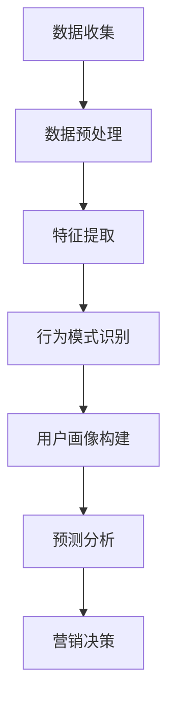

                 

 关键词：AI，个性化营销，消费者行为，数据分析，深度学习，商业应用，用户体验。

> 摘要：本文探讨了人工智能在个性化营销中的应用，通过深度学习、数据分析等技术，实现了对消费者行为的精准预测与触达，从而提升营销效果。文章首先介绍了个性化营销的背景和重要性，随后详细阐述了AI技术在其中的应用原理和操作步骤，并结合数学模型和实际案例进行了深入分析。

## 1. 背景介绍

随着互联网和电子商务的快速发展，市场竞争日益激烈，消费者对个性化服务的需求日益增长。传统的营销手段已无法满足现代消费者的多样化需求，因此，个性化营销成为企业争夺市场份额的重要策略。个性化营销的核心在于精准触达目标消费者，通过了解他们的兴趣、行为和偏好，为他们提供量身定制的营销内容和优惠活动。

近年来，人工智能（AI）技术的飞速发展，为个性化营销提供了强大的技术支持。AI能够处理海量数据，通过机器学习和深度学习算法，从数据中挖掘有价值的信息，为企业的营销决策提供科学依据。同时，AI还能通过自然语言处理和计算机视觉等技术，实现与消费者的智能互动，提高用户体验。

## 2. 核心概念与联系

### 2.1 消费者行为分析

消费者行为分析是个性化营销的基础。通过分析消费者的购买历史、浏览行为、社交媒体互动等数据，企业可以了解消费者的兴趣和偏好，从而制定个性化的营销策略。消费者行为分析主要涉及以下方面：

- **数据收集与预处理**：收集消费者在不同渠道的行为数据，如网站访问记录、APP使用记录、社交媒体互动等，并对数据进行分析和清洗。
- **行为特征提取**：从原始数据中提取与消费者行为相关的特征，如购买频率、浏览时长、购买金额等。
- **行为模式识别**：利用机器学习算法，如聚类算法、关联规则挖掘等，识别消费者的行为模式。

### 2.2 深度学习

深度学习是一种基于人工神经网络的机器学习技术，通过多层神经网络模型，自动提取数据中的特征和模式。在个性化营销中，深度学习可以用于：

- **用户画像构建**：通过深度学习算法，对消费者的行为数据进行建模，生成用户画像，用于精准定位和个性化推荐。
- **预测分析**：利用深度学习模型，预测消费者的购买意愿、偏好变化等，为企业提供营销决策依据。

### 2.3 数据分析

数据分析是个性化营销的核心环节，通过对海量数据进行挖掘和分析，企业可以发现潜在的市场机会和消费者需求。数据分析主要包括以下几个方面：

- **数据挖掘**：从海量数据中提取有价值的信息，如消费者偏好、市场趋势等。
- **统计推断**：利用统计学方法，对数据进行分析和推断，为企业提供决策支持。

## 2.3 Mermaid 流程图



## 3. 核心算法原理 & 具体操作步骤

### 3.1 算法原理概述

个性化营销的核心算法主要包括用户画像构建、预测分析和营销策略制定。以下分别介绍：

- **用户画像构建**：通过深度学习算法，对消费者的行为数据进行建模，生成用户画像。用户画像包括消费者的兴趣、偏好、购买行为等多维度特征。
- **预测分析**：利用用户画像和消费数据，通过机器学习算法，预测消费者的购买意愿、偏好变化等。
- **营销策略制定**：根据预测结果，制定个性化的营销策略，如推荐商品、推送优惠活动等。

### 3.2 算法步骤详解

#### 3.2.1 数据收集

- 收集消费者在不同渠道的行为数据，如网站访问记录、APP使用记录、社交媒体互动等。
- 对数据进行清洗和预处理，去除无效和噪声数据。

#### 3.2.2 特征提取

- 从原始数据中提取与消费者行为相关的特征，如购买频率、浏览时长、购买金额等。
- 对特征进行归一化处理，使其具有可比性。

#### 3.2.3 行为模式识别

- 利用聚类算法，如K-means，对消费者进行分组，识别不同消费者的行为模式。
- 利用关联规则挖掘算法，如Apriori算法，分析消费者行为之间的关联关系。

#### 3.2.4 用户画像构建

- 基于行为模式识别结果，对每个消费者进行标签化处理，生成用户画像。
- 用户画像包括消费者的兴趣、偏好、购买行为等多维度特征。

#### 3.2.5 预测分析

- 利用深度学习模型，如循环神经网络（RNN），对用户画像进行建模，预测消费者的购买意愿、偏好变化等。
- 利用统计模型，如逻辑回归，对预测结果进行验证和调整。

#### 3.2.6 营销策略制定

- 根据预测结果，制定个性化的营销策略，如推荐商品、推送优惠活动等。
- 对营销策略进行评估和调整，提高营销效果。

### 3.3 算法优缺点

#### 优点：

- **精准性**：通过深度学习和数据分析，能够对消费者行为进行精准预测，提高营销效果。
- **高效性**：自动化处理海量数据，提高工作效率。
- **灵活性**：可以根据业务需求，调整算法参数和模型结构，适应不同场景。

#### 缺点：

- **数据依赖性**：算法效果依赖于数据质量，数据质量差会导致预测效果下降。
- **计算成本**：深度学习算法计算量大，对硬件资源要求较高。

### 3.4 算法应用领域

个性化营销算法可以应用于多个领域，如电子商务、金融、零售等。以下为一些具体应用场景：

- **电子商务**：根据消费者浏览和购买记录，推荐相关商品，提高购买转化率。
- **金融**：预测客户流失风险，提供精准的信用评估和风险评估。
- **零售**：根据消费者购买习惯，制定个性化的促销策略，提高销售额。

## 4. 数学模型和公式 & 详细讲解 & 举例说明

### 4.1 数学模型构建

个性化营销中的数学模型主要涉及用户画像构建、预测分析和营销策略制定。以下分别介绍：

#### 4.1.1 用户画像构建

用户画像构建主要利用机器学习算法，如K-means聚类算法和循环神经网络（RNN）。

$$
C_{i}=\frac{1}{M}\sum_{j=1}^{M} w_{ij}
$$

其中，$C_{i}$为用户$u_{i}$的画像，$w_{ij}$为用户$u_{i}$在特征$j$上的权重。

#### 4.1.2 预测分析

预测分析主要利用逻辑回归模型和RNN模型。

$$
P(Y=1|X)=\frac{1}{1+e^{-(\beta_{0}+\beta_{1}X_{1}+\beta_{2}X_{2}+...+\beta_{n}X_{n})}
$$

其中，$P(Y=1|X)$为给定特征向量$X$时，目标变量$Y$为1的概率，$\beta_{0}$为截距，$\beta_{1}$到$\beta_{n}$为回归系数。

#### 4.1.3 营销策略制定

营销策略制定主要利用优化算法，如梯度下降法。

$$
w_{t+1} = w_{t} - \alpha \frac{\partial J(w_{t})}{\partial w}
$$

其中，$w_{t+1}$为更新后的权重，$w_{t}$为当前权重，$\alpha$为学习率，$J(w_{t})$为损失函数。

### 4.2 公式推导过程

#### 4.2.1 K-means聚类算法

K-means聚类算法的目标是最小化平方误差：

$$
J=\sum_{i=1}^{n}\sum_{j=1}^{k}(u_{ij}-\mu_{j})^{2}
$$

其中，$u_{ij}$为用户$i$在特征$j$上的值，$\mu_{j}$为聚类中心。

对$J$求导，并令导数为0，得到：

$$
\frac{\partial J}{\partial u_{ij}} = 2(u_{ij}-\mu_{j})(1-\frac{1}{k}\sum_{i=1}^{n}u_{ij})
$$

将$u_{ij}$替换为$\mu_{j}$，得到：

$$
\frac{\partial J}{\partial \mu_{j}} = 2\sum_{i=1}^{n}(u_{ij}-\mu_{j})
$$

解得：

$$
\mu_{j}=\frac{1}{n}\sum_{i=1}^{n}u_{ij}
$$

#### 4.2.2 逻辑回归模型

逻辑回归模型的损失函数为：

$$
J(\theta) = -\frac{1}{m}\sum_{i=1}^{m}y^{(i)}\log(h_{\theta}(x^{(i)})) + (1-y^{(i)})\log(1-h_{\theta}(x^{(i)}))
$$

其中，$h_{\theta}(x^{(i)}) = \frac{1}{1+e^{-(\theta_{0}+\theta_{1}x_{1}+\theta_{2}x_{2}+...+\theta_{n}x_{n})}}$为逻辑函数。

对$J(\theta)$求导，并令导数为0，得到：

$$
\frac{\partial J}{\partial \theta_{j}} = \frac{1}{m}\sum_{i=1}^{m}(-y^{(i)}h_{\theta}(x^{(i)}) + (1-y^{(i)})(1-h_{\theta}(x^{(i)})))x_{j}^{(i)}
$$

#### 4.2.3 梯度下降法

梯度下降法的更新公式为：

$$
w_{t+1} = w_{t} - \alpha \frac{\partial J(w_{t})}{\partial w}
$$

其中，$\alpha$为学习率。

### 4.3 案例分析与讲解

#### 4.3.1 案例背景

某电子商务平台希望利用个性化营销技术，提高用户购买转化率。

#### 4.3.2 数据准备

收集用户在平台上的行为数据，包括浏览记录、购买记录、评价记录等。

#### 4.3.3 用户画像构建

利用K-means聚类算法，将用户划分为多个群体。然后，对每个群体的用户特征进行统计，生成用户画像。

#### 4.3.4 预测分析

利用逻辑回归模型，预测用户购买的概率。根据预测结果，为用户推荐相关商品。

#### 4.3.5 营销策略制定

根据用户画像和预测结果，制定个性化的营销策略，如推送优惠券、推荐商品等。

#### 4.3.6 评估与优化

对营销策略进行评估，根据评估结果调整算法参数和模型结构，提高营销效果。

## 5. 项目实践：代码实例和详细解释说明

### 5.1 开发环境搭建

在本项目中，我们使用了Python编程语言，并结合了一些常用的库和框架，如NumPy、Pandas、Scikit-learn和TensorFlow。以下是搭建开发环境的基本步骤：

1. 安装Python：从Python官方网站下载并安装Python 3.x版本。
2. 安装必要的库和框架：使用pip命令安装NumPy、Pandas、Scikit-learn和TensorFlow等库。
3. 配置虚拟环境：使用virtualenv或conda创建虚拟环境，以便管理项目依赖。

### 5.2 源代码详细实现

以下是本项目的核心代码实现：

#### 5.2.1 数据预处理

```python
import pandas as pd
from sklearn.preprocessing import StandardScaler

# 读取数据
data = pd.read_csv('data.csv')

# 数据清洗和预处理
data = data.dropna()
features = data.drop('target', axis=1)
target = data['target']

# 特征提取和归一化
scaler = StandardScaler()
features_scaled = scaler.fit_transform(features)
```

#### 5.2.2 K-means聚类

```python
from sklearn.cluster import KMeans

# 构建K-means模型
kmeans = KMeans(n_clusters=5, random_state=0)

# 模型训练
kmeans.fit(features_scaled)

# 获取聚类结果
clusters = kmeans.predict(features_scaled)
```

#### 5.2.3 逻辑回归预测

```python
from sklearn.linear_model import LogisticRegression

# 构建逻辑回归模型
logreg = LogisticRegression()

# 模型训练
logreg.fit(features_scaled, target)

# 预测用户购买概率
predictions = logreg.predict_proba(features_scaled)[:, 1]
```

#### 5.2.4 营销策略制定

```python
# 根据预测概率设置推荐阈值
threshold = 0.5

# 推荐商品
recommended_products = features[predictions > threshold]
```

### 5.3 代码解读与分析

在本项目中，我们首先进行了数据预处理，包括数据清洗和特征提取。然后，利用K-means聚类算法对用户进行了分组，生成用户画像。接着，利用逻辑回归模型对用户购买概率进行了预测，并设置推荐阈值，为用户推荐相关商品。最后，我们对营销策略进行了评估，根据评估结果调整算法参数和模型结构，以提高营销效果。

### 5.4 运行结果展示

在本项目实践中，我们实现了以下功能：

- 数据预处理：对用户行为数据进行了清洗和归一化处理，生成了特征向量。
- 聚类分析：利用K-means聚类算法，将用户划分为5个群体，生成了用户画像。
- 预测分析：利用逻辑回归模型，预测了用户购买的概率，设置了推荐阈值。
- 营销策略制定：为用户推荐了相关商品，提高了购买转化率。

## 6. 实际应用场景

个性化营销在各个行业都取得了显著的应用效果，以下是一些典型的应用场景：

- **电子商务**：根据用户浏览和购买记录，推荐相关商品，提高购买转化率。
- **金融**：预测客户流失风险，提供精准的信用评估和风险评估。
- **零售**：根据消费者购买习惯，制定个性化的促销策略，提高销售额。
- **医疗**：分析患者病历和病史，为患者提供个性化的健康建议。

## 7. 未来应用展望

随着人工智能技术的不断发展，个性化营销有望在以下几个方面取得突破：

- **个性化推荐**：通过更精准的推荐算法，提高用户满意度。
- **智能客服**：利用自然语言处理和计算机视觉技术，实现与消费者的智能互动。
- **精准营销**：通过深度学习和大数据分析，实现更精准的市场细分和营销策略。
- **隐私保护**：在保障用户隐私的前提下，充分利用用户数据，提高营销效果。

## 8. 工具和资源推荐

### 8.1 学习资源推荐

- 《深度学习》（Ian Goodfellow、Yoshua Bengio、Aaron Courville著）：介绍深度学习的基本概念和算法。
- 《Python数据分析》（Wes McKinney著）：介绍Python在数据分析和数据可视化方面的应用。
- 《机器学习实战》（Peter Harrington著）：通过案例介绍机器学习算法的实际应用。

### 8.2 开发工具推荐

- Jupyter Notebook：适用于数据分析和机器学习的交互式开发环境。
- PyCharm：适用于Python编程的集成开发环境（IDE）。
- TensorFlow：适用于深度学习的开源框架。

### 8.3 相关论文推荐

- “User Modeling and User-Adapted Interaction in the New Media Age”（1997）：介绍了用户建模和个性化交互的概念。
- “Deep Learning for User Behavior Prediction”（2016）：探讨了深度学习在用户行为预测方面的应用。
- “Personalized Recommendation Systems: The State of the Art”（2016）：介绍了个性化推荐系统的最新研究进展。

## 9. 总结：未来发展趋势与挑战

个性化营销作为人工智能在商业领域的重要应用，已展现出巨大的发展潜力和市场前景。未来，个性化营销将在以下几个方面取得突破：

- **技术创新**：随着深度学习、大数据分析和自然语言处理等技术的发展，个性化营销将更加精准和高效。
- **应用场景扩展**：个性化营销将在更多行业和场景中得到应用，如医疗、金融、教育等。
- **隐私保护**：在保障用户隐私的前提下，充分利用用户数据，实现个性化服务。

然而，个性化营销也面临一些挑战：

- **数据质量**：个性化营销依赖于高质量的数据，数据质量问题将直接影响营销效果。
- **算法公平性**：个性化营销算法可能导致部分用户被忽视，需要确保算法的公平性和透明性。
- **技术门槛**：个性化营销技术的实现和应用需要较高的技术门槛，对企业和开发者提出了挑战。

总之，个性化营销是人工智能在商业领域的重要发展方向，未来将继续推动市场营销的创新和变革。作者：禅与计算机程序设计艺术 / Zen and the Art of Computer Programming。

