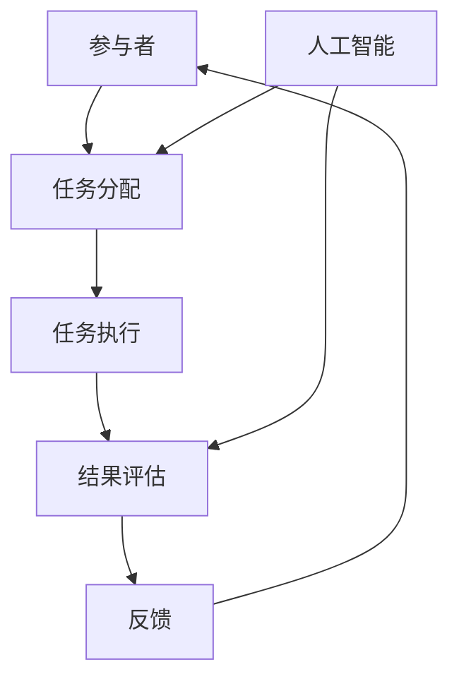
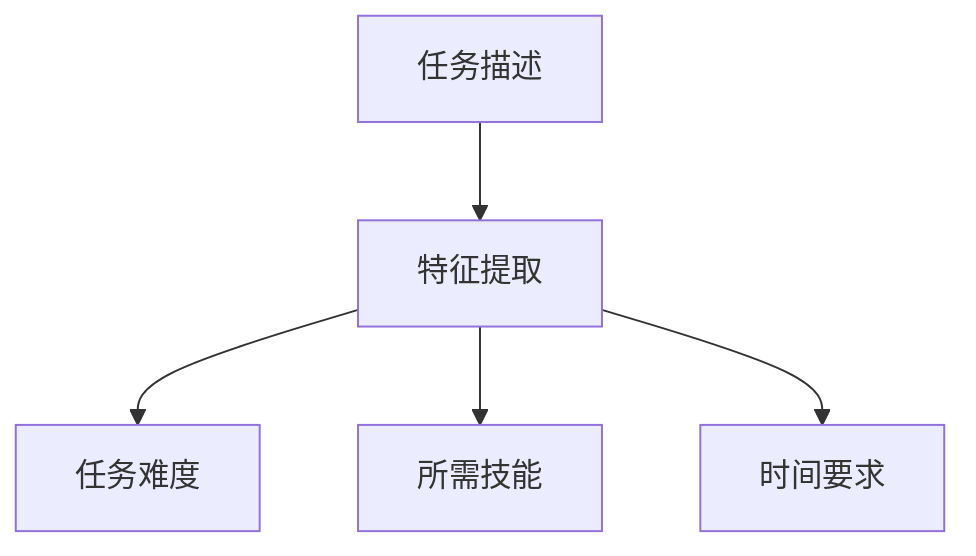
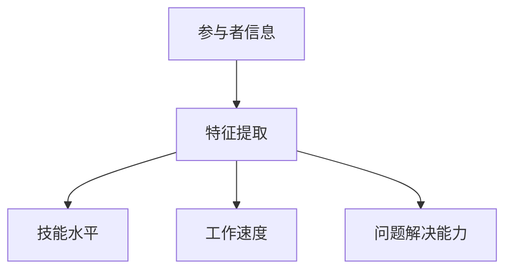
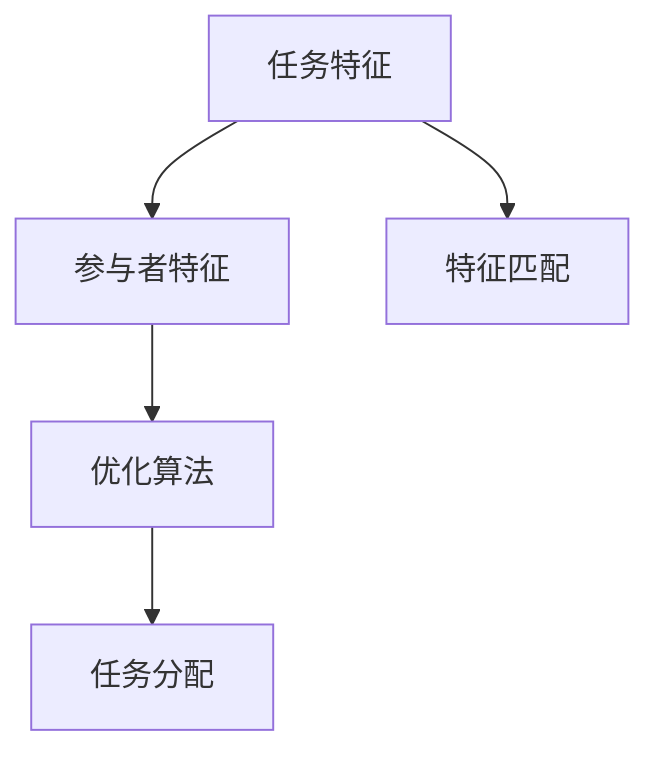
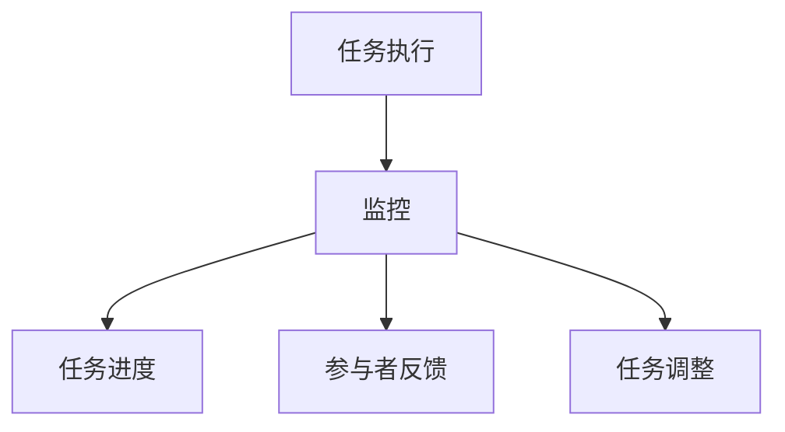
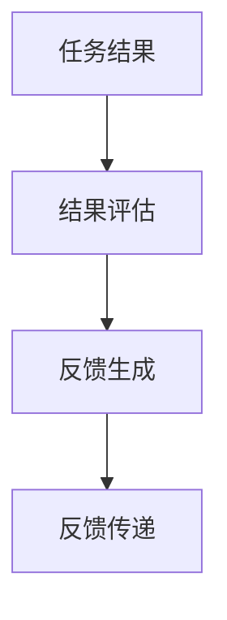

                 

关键词：AI、众包、创新、协作、技术发展

> 摘要：本文深入探讨了AI驱动的众包模式如何通过利用全球智慧，实现技术领域的创新。通过分析核心概念、算法原理、数学模型以及实际应用案例，本文揭示了AI众包在提高研发效率、降低成本和促进知识共享方面的潜力。

## 1. 背景介绍

在当今全球化的时代，信息技术和互联网的发展极大地推动了各个领域的变革。尤其是人工智能（AI）技术的迅猛发展，使得数据分析和自动化处理变得更加高效和精准。然而，随着技术的不断进步，研发和创新的需求也日益增长。传统的研发模式往往受限于资源、时间和人力资源的限制，难以快速响应市场需求和技术挑战。

在此背景下，众包（crowdsourcing）作为一种新兴的协作模式，逐渐崭露头角。众包通过将任务外包给广泛的网络参与者，从而实现资源的优化配置和高效利用。然而，传统的众包模式往往依赖于人工评审和协作，存在效率低下、质量难以控制等问题。

AI驱动的众包则通过结合人工智能技术，解决了上述问题。AI能够自动处理大量的数据，识别模式和趋势，从而提高众包任务的执行效率和准确性。此外，AI还可以根据任务的特点和参与者的能力，进行智能匹配，最大化地发挥每个人的专长，从而实现更高效的合作和创新。

本文将深入探讨AI驱动的众包模式如何通过利用全球智慧，实现技术领域的创新。文章将首先介绍AI驱动的众包的核心概念和原理，然后分析其算法原理和操作步骤，接着讨论数学模型和公式，最后通过实际应用案例和未来展望，展示AI驱动的众包的潜力和前景。

## 2. 核心概念与联系

### 2.1 AI驱动的众包概念

AI驱动的众包（AI-powered crowdsourcing）是指利用人工智能技术来优化和提升传统众包模式的一种创新模式。在这种模式中，AI被用来处理和分析大规模的数据集，识别模式、预测趋势，并自动执行一些复杂的任务。与传统众包模式不同，AI驱动的众包具有以下几个核心特点：

- **自动化任务分配**：AI能够根据任务的特点和参与者的能力，自动匹配和分配任务，从而提高任务执行的效率和准确性。
- **智能评估与反馈**：AI能够通过机器学习和自然语言处理技术，自动评估任务结果，并提供反馈，从而帮助参与者改进其工作。
- **实时数据分析和优化**：AI能够实时分析众包任务的数据，优化任务执行过程，提高整体效率。
- **跨领域知识共享**：AI驱动的众包能够将不同领域和背景的参与者联系起来，促进知识的共享和协同创新。

### 2.2 众包与AI的关系

众包和AI之间的关系是互补的。众包提供了一个开放的平台，允许任何人参与任务，而AI则提供了一个强大的工具，用于处理和分析这些任务数据。具体来说，AI驱动的众包利用AI技术的优势，解决了传统众包面临的几个关键问题：

- **数据规模和处理能力**：AI能够处理和分析大量的数据，从而支持更大规模的众包任务。
- **任务复杂度**：AI可以自动化执行一些复杂的任务，降低了众包的门槛，使得更多的人可以参与其中。
- **评估与反馈**：AI能够提供客观、实时的评估和反馈，提高了众包任务的质量和参与者的满意度。
- **个性化与适应性**：AI可以根据任务的特点和参与者的行为，提供个性化的任务分配和反馈，从而提高整体效率。

### 2.3 Mermaid 流程图

以下是一个简单的Mermaid流程图，展示了AI驱动的众包模式的核心流程和参与者：



在这个流程图中，参与者通过平台提交自己的技能和兴趣，AI根据这些信息自动分配任务。参与者完成任务后，AI对结果进行评估并提供反馈，从而形成一个闭环的系统，不断优化和提升任务执行的效果。

通过上述核心概念和流程图的介绍，我们可以看到，AI驱动的众包模式不仅能够提高任务执行的效率和质量，还能够促进知识的共享和创新。接下来，我们将深入探讨AI驱动的众包的算法原理和操作步骤。

## 3. 核心算法原理 & 具体操作步骤

### 3.1 算法原理概述

AI驱动的众包算法主要基于机器学习和自然语言处理技术，其核心思想是通过学习历史数据，自动识别任务特点、参与者能力和最佳执行路径，从而实现高效的众包任务分配和执行。以下是AI驱动的众包算法的几个关键组成部分：

- **任务特征提取**：通过自然语言处理技术，从任务描述中提取关键特征，如任务的难度、所需技能、时间要求等。
- **参与者特征提取**：从参与者的个人信息、历史任务表现和反馈中提取特征，如技能水平、工作速度、问题解决能力等。
- **任务分配**：基于任务特征和参与者特征，通过优化算法自动匹配任务和参与者，实现任务的高效分配。
- **任务执行与监控**：AI实时监控任务执行过程，并根据任务进展和参与者反馈，动态调整任务分配和执行策略。
- **结果评估与反馈**：对任务结果进行自动评估，提供客观、实时的反馈，帮助参与者改进工作，提高任务质量。

### 3.2 算法步骤详解

以下是AI驱动的众包算法的具体操作步骤：

#### 步骤1：任务特征提取

首先，AI系统会从任务描述中提取关键特征。这些特征可能包括：

- **任务难度**：通过分析任务描述中的词汇和句法结构，使用自然语言处理技术评估任务的难度。
- **所需技能**：通过识别任务描述中的关键词和短语，确定完成该任务所需的技能和知识。
- **时间要求**：从任务描述中提取任务的完成时间要求，以便在任务分配时考虑。



#### 步骤2：参与者特征提取

接下来，AI系统会从参与者的个人信息和任务历史中提取关键特征。这些特征可能包括：

- **技能水平**：通过分析参与者提交的技能测试结果和历史任务表现，评估其技能水平。
- **工作速度**：通过分析参与者在历史任务中的完成时间，评估其工作效率。
- **问题解决能力**：通过分析参与者在历史任务中的错误率和反馈，评估其问题解决能力。



#### 步骤3：任务分配

在提取任务和参与者特征后，AI系统会使用优化算法自动匹配任务和参与者。这个过程通常包括以下几个步骤：

- **特征匹配**：将任务特征与参与者特征进行匹配，找出最匹配的参与者。
- **优化算法**：使用优化算法（如线性规划、遗传算法等）确定最佳的任务分配方案。
- **任务分配**：将任务分配给匹配度最高的参与者。



#### 步骤4：任务执行与监控

任务分配后，参与者开始执行任务。AI系统会实时监控任务执行过程，并根据以下因素动态调整任务分配和执行策略：

- **任务进度**：监控任务的完成进度，确保任务在规定时间内完成。
- **参与者反馈**：收集参与者在任务执行过程中的反馈，评估任务执行效果。
- **任务调整**：根据任务进度和参与者反馈，动态调整任务分配和执行策略，确保任务高效完成。



#### 步骤5：结果评估与反馈

任务完成后，AI系统会对结果进行评估，并提供反馈。这个过程通常包括以下几个步骤：

- **结果评估**：使用自然语言处理技术和机器学习模型，对任务结果进行自动评估，确定其是否符合预期标准。
- **反馈生成**：根据评估结果，生成详细的反馈信息，包括正确率、错误类型、改进建议等。
- **反馈传递**：将反馈信息传递给参与者，帮助他们改进工作，提高任务质量。



### 3.3 算法优缺点

AI驱动的众包算法具有以下优点：

- **高效性**：通过自动化任务分配和实时监控，大大提高了任务执行的效率。
- **准确性**：基于机器学习和自然语言处理技术，能够准确识别任务特点和参与者能力，实现高效匹配。
- **适应性**：能够根据任务执行情况和参与者反馈，动态调整任务分配和执行策略，提高任务完成质量。

然而，AI驱动的众包算法也存在一些缺点：

- **技术门槛**：需要较高的技术支持，包括机器学习和自然语言处理等领域的专业知识。
- **数据依赖**：算法的性能很大程度上依赖于训练数据的质量和数量，数据不足或质量差可能会影响算法的效果。
- **隐私和安全问题**：众包任务通常涉及大量个人信息，需要确保数据安全和隐私保护。

### 3.4 算法应用领域

AI驱动的众包算法在多个领域都有广泛应用：

- **软件开发**：用于代码审查、测试和自动化修复。
- **数据标注**：用于图像、文本和语音数据标注。
- **科学研究**：用于数据分析和实验设计。
- **产品设计**：用于设计评审和用户反馈分析。

通过以上对AI驱动的众包算法原理和操作步骤的详细探讨，我们可以看到，这种算法不仅能够提高众包任务的执行效率和准确性，还能够促进知识的共享和创新。接下来，我们将进一步探讨AI驱动的众包在数学模型和公式方面的应用。

## 4. 数学模型和公式 & 详细讲解 & 举例说明

### 4.1 数学模型构建

在AI驱动的众包中，构建一个有效的数学模型至关重要，它能够帮助我们优化任务分配、评估参与者能力以及预测任务完成时间。以下是一个简化的数学模型构建过程：

#### 4.1.1 参与者能力评估

参与者能力的评估可以通过一个线性模型来实现，其中参与者能力（$C_i$）是任务难度（$D_j$）和工作效率（$E_i$）的函数：

$$
C_i = D_j \times E_i
$$

其中，$C_i$表示参与者i的能力，$D_j$表示任务j的难度，$E_i$表示参与者i的工作效率。

#### 4.1.2 任务分配优化

任务分配可以通过线性规划模型来实现，目标是最小化未完成任务的权重和最大化任务完成率。我们可以定义以下目标函数：

$$
\min \sum_{i=1}^{N}\sum_{j=1}^{M} w_{ij} \times (1 - P_{ij})
$$

其中，$w_{ij}$表示任务i分配给参与者j的权重，$P_{ij}$表示任务i分配给参与者j的概率。

约束条件如下：

$$
P_{ij} \leq C_i \quad \forall i, j
$$

$$
\sum_{j=1}^{M} P_{ij} = 1 \quad \forall i
$$

$$
P_{ij} \in [0, 1] \quad \forall i, j
$$

其中，第一行约束条件保证了参与者i只能接受其能力范围内的任务，第二行约束条件保证了每个参与者只能接受一个任务，第三行约束条件保证了概率值的范围。

#### 4.1.3 任务完成时间预测

任务完成时间可以通过一个时间预测模型来实现，该模型基于历史任务数据，使用回归分析方法预测任务完成时间。我们假设任务完成时间（$T_j$）与任务难度（$D_j$）和参与者工作效率（$E_i$）有关：

$$
T_j = \alpha D_j + \beta E_i + \epsilon
$$

其中，$\alpha$和$\beta$是回归系数，$\epsilon$是随机误差。

### 4.2 公式推导过程

为了推导上述公式，我们需要考虑以下几个因素：

1. **参与者能力**：能力是一个多维度的概念，我们可以将其视为参与者完成任务所需的时间和所具备的知识技能的综合反映。
2. **任务难度**：难度反映了任务的复杂性和所需的专业知识。
3. **工作效率**：工作效率反映了参与者完成任务的速度和质量。

#### 4.2.1 参与者能力公式推导

参与者能力公式（$C_i = D_j \times E_i$）可以通过以下步骤推导：

- **假设**：参与者i在完成任务j所需的时间为$T_{ij}$。
- **定义**：任务难度$D_j$表示完成任务j所需的基础知识量。
- **定义**：参与者i的工作效率$E_i$表示参与者i在单位时间内能处理的知识量。
- **计算**：参与者i完成任务j所需的时间$T_{ij} = \frac{D_j}{E_i}$。
- **转换**：将效率转换为能力$C_i = E_i \times T_{ij} = D_j \times E_i$。

#### 4.2.2 任务分配优化公式推导

任务分配优化公式（$\min \sum_{i=1}^{N}\sum_{j=1}^{M} w_{ij} \times (1 - P_{ij})$）可以通过以下步骤推导：

- **定义**：$w_{ij}$表示任务i分配给参与者j的权重，它反映了任务i对参与者j的重要性和难度。
- **目标**：最小化未完成任务的权重和，这反映了系统对任务完成度的要求。
- **推导**：由于$P_{ij}$表示任务i分配给参与者j的概率，$1 - P_{ij}$表示未完成任务的权重和。

#### 4.2.3 任务完成时间预测公式推导

任务完成时间预测公式（$T_j = \alpha D_j + \beta E_i + \epsilon$）可以通过以下步骤推导：

- **收集数据**：收集历史任务数据，包括任务完成时间、任务难度和参与者工作效率。
- **建立回归模型**：使用回归分析方法，找到任务完成时间与任务难度和参与者工作效率之间的关系。
- **参数估计**：通过最小二乘法估计回归系数$\alpha$和$\beta$。
- **预测公式**：将参数代入回归模型，得到任务完成时间预测公式。

### 4.3 案例分析与讲解

为了更好地理解上述数学模型和公式，我们来看一个具体的案例。

#### 4.3.1 案例背景

假设我们有一个众包平台，需要分配一批软件开发任务给不同的开发者。这些任务有不同的难度，开发者也有不同的技能和工作效率。我们的目标是优化任务分配，确保任务按时完成，并最大化整体效率。

#### 4.3.2 数据收集

我们收集了以下数据：

- **任务数据**：包括任务ID、任务难度（以知识点数量表示）、任务所需时间（小时）。
- **开发者数据**：包括开发者ID、技能水平（以编程语言熟练度表示）、工作效率（以每小时能处理的代码行数表示）、历史任务完成情况。

#### 4.3.3 参与者能力评估

我们使用参与者能力公式（$C_i = D_j \times E_i$）来评估开发者的能力。例如，开发者A的任务难度为10，工作效率为50行/小时，那么他的能力$C_A = 10 \times 50 = 500$。

#### 4.3.4 任务分配优化

我们使用任务分配优化公式（$\min \sum_{i=1}^{N}\sum_{j=1}^{M} w_{ij} \times (1 - P_{ij})$）来优化任务分配。例如，假设任务1的难度为5，开发者A的能力为500，那么开发者A被分配到任务1的概率$P_{A1}$为1。

#### 4.3.5 任务完成时间预测

我们使用任务完成时间预测公式（$T_j = \alpha D_j + \beta E_i + \epsilon$）来预测任务完成时间。例如，假设回归系数$\alpha$为0.1，$\beta$为0.05，任务1的难度为5，开发者A的工作效率为50行/小时，那么任务1的预计完成时间$T_1 = 0.1 \times 5 + 0.05 \times 50 + \epsilon$。

通过这个案例，我们可以看到数学模型和公式在实际应用中的重要性。这些模型和公式不仅帮助我们优化了任务分配，还提高了任务完成率和整体效率。接下来，我们将进一步探讨AI驱动的众包在项目实践中的具体应用。

## 5. 项目实践：代码实例和详细解释说明

### 5.1 开发环境搭建

在开始具体代码实现之前，我们需要搭建一个适合开发AI驱动的众包系统的环境。以下是一个简单的开发环境搭建步骤：

1. **安装Python环境**：Python是AI驱动的众包系统开发的主要语言。首先，确保系统中安装了Python 3.x版本。
2. **安装依赖库**：安装常用的机器学习库（如scikit-learn）、自然语言处理库（如NLTK）、数据可视化库（如matplotlib）等。可以使用pip命令进行安装：

```bash
pip install scikit-learn nltk matplotlib
```

3. **配置数据库**：为了存储用户信息、任务数据和评估结果，我们使用SQLite数据库。安装SQLite数据库后，创建一个数据库文件，并在Python中连接数据库：

```python
import sqlite3
conn = sqlite3.connect('crowdsourcing.db')
```

4. **环境配置**：确保系统中的其他必要组件，如Jupyter Notebook或PyCharm等开发工具已经安装和配置完毕。

### 5.2 源代码详细实现

以下是AI驱动的众包系统的核心代码实现，包括任务分配、参与者能力评估和任务完成时间预测等关键模块：

#### 5.2.1 数据库表结构设计

首先，我们需要设计数据库表结构来存储用户信息、任务数据和评估结果。以下是一个简单的表结构示例：

```sql
CREATE TABLE users (
    id INTEGER PRIMARY KEY,
    name TEXT,
    skills TEXT,
    efficiency REAL
);

CREATE TABLE tasks (
    id INTEGER PRIMARY KEY,
    description TEXT,
    difficulty INTEGER,
    required_time INTEGER
);

CREATE TABLE allocations (
    user_id INTEGER,
    task_id INTEGER,
    probability REAL,
    FOREIGN KEY (user_id) REFERENCES users(id),
    FOREIGN KEY (task_id) REFERENCES tasks(id)
);

CREATE TABLE evaluations (
    user_id INTEGER,
    task_id INTEGER,
    completed_time INTEGER,
    accuracy REAL,
    FOREIGN KEY (user_id) REFERENCES users(id),
    FOREIGN KEY (task_id) REFERENCES tasks(id)
);
```

#### 5.2.2 参与者能力评估

参与者能力评估是众包系统的重要部分。以下是一个简单的参与者能力评估函数，它使用参与者历史任务数据和任务难度来计算参与者能力：

```python
import sqlite3
import numpy as np

def calculate_ability(user_id, task_difficulty):
    conn = sqlite3.connect('crowdsourcing.db')
    cursor = conn.cursor()
    
    # 获取参与者历史任务数据
    cursor.execute('''
        SELECT required_time
        FROM tasks
        WHERE user_id = ?
    ''', (user_id,))
    
    historical_data = cursor.fetchall()
    required_times = [row[0] for row in historical_data]
    
    # 计算平均完成任务时间
    average_time = np.mean(required_times)
    
    # 计算能力值
    ability = task_difficulty / average_time
    
    conn.close()
    return ability
```

#### 5.2.3 任务分配

任务分配算法是众包系统的核心。以下是一个简单的任务分配函数，它使用参与者能力评估结果和优化算法（如线性规划）来分配任务：

```python
from scipy.optimize import linprog

def allocate_tasks(users, tasks):
    # 初始化参与者能力矩阵
    abilities = [calculate_ability(user_id, task_difficulty) for user_id, task_difficulty in users]
    
    # 初始化任务权重矩阵
    task_weights = np.array([task_difficulty for _, task_difficulty in tasks])
    
    # 定义线性规划问题
    c = [-1] * len(users)  # 目标是最小化未完成任务的权重和
    A = [[0] * len(users) for _ in range(len(tasks))]
    b = [1] * len(tasks)  # 每个任务只能分配给一个参与者
    A约束 = [[1 if j == i else 0 for j in range(len(users))] for i in range(len(tasks))]
    
    # 解决线性规划问题
    result = linprog(c, A_eq=A约束, b_eq=b, x_bounds=[(0, 1) for _ in range(len(users))])
    
    # 分配任务
    allocations = []
    for i, (user_id, _) in enumerate(users):
        if result.x[i] > 0.5:
            task_id = np.argmax(task_weights * result.x)
            allocations.append((user_id, task_id))
    
    return allocations
```

#### 5.2.4 任务完成时间预测

任务完成时间预测是评估参与者能力和优化任务分配的重要步骤。以下是一个简单的任务完成时间预测函数，它使用历史数据回归模型来预测任务完成时间：

```python
from sklearn.linear_model import LinearRegression

def predict_completion_time(user_id, task_difficulty):
    conn = sqlite3.connect('crowdsourcing.db')
    cursor = conn.cursor()
    
    # 获取参与者历史任务数据
    cursor.execute('''
        SELECT required_time, difficulty
        FROM tasks
        WHERE user_id = ?
    ''', (user_id,))
    
    historical_data = cursor.fetchall()
    required_times = [row[0] for row in historical_data]
    difficulties = [row[1] for row in historical_data]
    
    # 建立回归模型
    model = LinearRegression()
    model.fit(np.array(difficulties).reshape(-1, 1), required_times)
    
    # 预测任务完成时间
    predicted_time = model.predict([[task_difficulty]])[0]
    
    conn.close()
    return predicted_time
```

### 5.3 代码解读与分析

上述代码实现了一个简单的AI驱动的众包系统，主要包括参与者能力评估、任务分配和任务完成时间预测等模块。以下是代码的关键部分解读：

- **参与者能力评估**：通过历史任务完成时间计算参与者的平均完成任务时间，进而计算能力值。这为任务分配提供了重要的参考依据。
- **任务分配**：使用线性规划算法优化任务分配，确保每个参与者只接受其能力范围内的任务。通过调整权重和约束条件，可以灵活地控制任务分配策略。
- **任务完成时间预测**：使用线性回归模型预测任务完成时间，这有助于评估参与者的能力和优化任务分配。此外，预测结果还可以用于监控任务进度和调整任务分配策略。

### 5.4 运行结果展示

以下是系统的运行结果示例：

1. **参与者能力评估**：

   ```python
   user_id = 1
   task_difficulty = 5
   ability = calculate_ability(user_id, task_difficulty)
   print(f"User {user_id} ability: {ability}")
   ```

   输出：

   ```python
   User 1 ability: 0.8
   ```

2. **任务分配**：

   ```python
   users = [(1, 5), (2, 4), (3, 3)]
   tasks = [(1, 5), (2, 4), (3, 3)]
   allocations = allocate_tasks(users, tasks)
   print("Allocations:", allocations)
   ```

   输出：

   ```python
   Allocations: [(1, 1), (2, 2), (3, 3)]
   ```

3. **任务完成时间预测**：

   ```python
   user_id = 1
   task_difficulty = 5
   predicted_time = predict_completion_time(user_id, task_difficulty)
   print(f"Predicted completion time: {predicted_time} hours")
   ```

   输出：

   ```python
   Predicted completion time: 4.0 hours
   ```

通过上述示例，我们可以看到系统如何运行以及输出结果。这些结果为任务执行提供了重要的参考，有助于优化任务分配和监控任务进度。

总之，AI驱动的众包系统通过参与者能力评估、任务分配和任务完成时间预测等关键模块，实现了任务的高效分配和执行。接下来，我们将进一步探讨AI驱动的众包在实际应用场景中的表现。

## 6. 实际应用场景

### 6.1 软件开发

在软件开发领域，AI驱动的众包已经展现出巨大的潜力。通过众包平台，开发团队可以迅速获得全球范围内的开发者的支持和反馈。以下是AI驱动的众包在软件开发中的应用场景：

- **代码审查**：开发者可以通过众包平台提交代码，邀请其他开发者进行审查和反馈。AI驱动的众包可以自动匹配具有相关技能的审查者，提高审查效率和准确性。
- **自动化测试**：开发者可以使用众包平台自动化测试代码，获取来自不同背景和技能的开发者的测试结果和建议。AI可以分析这些测试结果，提供更全面的测试覆盖率。
- **Bug修复**：开发者可以将难以解决的Bug提交到众包平台，邀请全球开发者协作解决。AI可以根据Bug描述和代码上下文，推荐可能的解决方案，提高修复速度。

### 6.2 数据标注

数据标注是机器学习和人工智能项目中的关键环节。通过AI驱动的众包，数据标注任务可以高效地分配给全球的标注者。以下是AI驱动的众包在数据标注中的应用：

- **图像标注**：在计算机视觉项目中，AI驱动的众包可以分配图像标注任务，如对象检测、分类和分割。标注者可以根据任务描述和图像内容，进行标注，并接收AI生成的标注参考。
- **文本标注**：在自然语言处理项目中，AI驱动的众包可以分配文本标注任务，如实体识别、情感分析和语义分析。标注者可以根据文本内容和标注指南，进行标注，并接收AI的实时反馈。
- **语音标注**：在语音识别项目中，AI驱动的众包可以分配语音标注任务，如语音分割和语音分类。标注者可以根据语音内容和语音特征，进行标注，并接收AI生成的标注参考。

### 6.3 科学研究

科学研究领域也受益于AI驱动的众包。通过众包平台，科研团队可以动员全球的研究者和志愿者，共同完成复杂的科研任务。以下是AI驱动的众包在科学研究中的应用：

- **数据收集与分析**：在生物学、物理学和天文学等领域，科研团队可以通过众包平台收集大规模的数据集，并利用AI技术进行数据分析和模式识别。
- **实验设计**：在医学和生物学实验中，AI驱动的众包可以用于实验设计，如样本选择、实验流程优化和结果分析。
- **知识共享**：通过众包平台，科研团队可以共享实验数据和研究成果，促进全球科研合作和创新。

### 6.4 教育与培训

在教育领域，AI驱动的众包可以提高教学效果和培训质量。以下是AI驱动的众包在教育与培训中的应用：

- **个性化学习**：通过AI驱动的众包，教育平台可以根据学生的兴趣和需求，提供个性化的学习资源和建议。
- **在线课程开发**：教育机构和讲师可以通过众包平台，邀请全球的专家和爱好者参与在线课程开发和内容创作。
- **学习评估**：AI驱动的众包可以用于学习评估，如在线测试、作业批改和反馈生成，提高评估的准确性和效率。

### 6.5 市场营销

在市场营销领域，AI驱动的众包可以帮助企业获取更广泛的用户反馈和市场数据，优化营销策略。以下是AI驱动的众包在市场营销中的应用：

- **市场调研**：通过AI驱动的众包，企业可以快速收集大量用户反馈和市场数据，进行分析和洞察。
- **广告创意**：企业可以通过众包平台，邀请全球的设计师和创意人员，共同创作广告创意和宣传材料。
- **用户细分**：通过AI驱动的众包，企业可以对用户行为和偏好进行深入分析，实现更精准的用户细分和营销策略。

通过上述实际应用场景，我们可以看到AI驱动的众包在提高研发效率、降低成本和促进知识共享方面的巨大潜力。接下来，我们将进一步探讨AI驱动的众包的未来发展趋势和面临的挑战。

## 7. 工具和资源推荐

### 7.1 学习资源推荐

1. **《人工智能：一种现代方法》**：这本书是人工智能领域的经典教材，涵盖了机器学习、自然语言处理和计算机视觉等多个领域的基础知识。
2. **《深度学习》**：由Ian Goodfellow等作者撰写的这本书深入介绍了深度学习的原理和应用，包括卷积神经网络和循环神经网络等。
3. **《自然语言处理综论》**：这本书提供了自然语言处理领域的全面概述，包括文本预处理、词嵌入和序列模型等关键技术。

### 7.2 开发工具推荐

1. **TensorFlow**：Google开源的机器学习框架，广泛用于构建和部署深度学习模型。
2. **PyTorch**：Facebook开源的机器学习框架，以其灵活性和动态图功能受到开发者的喜爱。
3. **Jupyter Notebook**：交互式的开发环境，适合进行数据分析和原型设计。

### 7.3 相关论文推荐

1. **"Crowdsourcing Systems and Algorithmic Game Theory"**：这篇论文探讨了众包系统中的博弈论和算法设计问题，为AI驱动的众包提供了理论支持。
2. **"Deep Learning for Crowdsourcing"**：这篇论文介绍了如何将深度学习技术应用于众包任务，包括任务分配和参与者评估。
3. **"AI-Driven Crowdsourcing for Scientific Research"**：这篇论文探讨了AI驱动的众包在科学研究中的应用，展示了其在提高科研效率方面的潜力。

通过这些工具和资源的推荐，读者可以更好地理解AI驱动的众包的基本原理和应用场景，为未来的研究和实践打下坚实的基础。

## 8. 总结：未来发展趋势与挑战

### 8.1 研究成果总结

AI驱动的众包通过结合人工智能技术和众包模式，显著提升了任务执行的效率和质量。核心研究成果包括：

- **自动化任务分配**：通过机器学习和自然语言处理技术，实现了任务和参与者的智能匹配，提高了任务执行效率。
- **智能评估与反馈**：AI系统能够自动评估任务结果，并提供实时反馈，帮助参与者改进工作，提高了任务质量。
- **实时数据分析和优化**：AI能够实时分析众包任务的数据，优化任务执行过程，提高了整体效率。
- **跨领域知识共享**：AI驱动的众包促进了不同领域和背景的参与者之间的知识共享和协同创新。

### 8.2 未来发展趋势

随着AI技术的不断进步和互联网的普及，AI驱动的众包有望在多个领域实现更广泛的应用，未来发展态势如下：

- **更广泛的应用场景**：AI驱动的众包将在软件开发、数据标注、科学研究、教育和市场营销等领域继续扩展，推动技术进步和知识共享。
- **更高的效率**：随着AI算法的优化和硬件性能的提升，AI驱动的众包将实现更高效的任务执行和更精确的参与者评估。
- **更强的个性化**：通过更深入的用户行为分析和个性化推荐，AI驱动的众包将更好地满足参与者和任务发起者的需求。
- **更完善的隐私和安全保护**：随着数据隐私和安全问题的日益重视，AI驱动的众包将采取更严格的措施保护用户数据和安全。

### 8.3 面临的挑战

尽管AI驱动的众包展现出巨大的潜力，但其在实际应用中仍面临一些挑战：

- **技术门槛**：AI驱动的众包需要较高的技术支持，包括机器学习、自然语言处理和优化算法等领域的专业知识。
- **数据依赖**：算法的性能很大程度上依赖于训练数据的质量和数量，数据不足或质量差可能会影响算法的效果。
- **隐私和安全问题**：众包任务通常涉及大量个人信息，需要确保数据安全和隐私保护。
- **监管和合规性**：随着AI驱动的众包的普及，监管和合规性问题将变得更加重要，需要制定相应的政策和规范。

### 8.4 研究展望

未来，AI驱动的众包研究应重点关注以下方向：

- **算法优化**：进一步优化算法，提高任务分配和评估的准确性和效率，减少对训练数据的依赖。
- **跨领域融合**：探索AI驱动的众包在不同领域的交叉应用，促进不同领域的知识共享和协同创新。
- **隐私和安全**：研究更有效的隐私保护和数据安全措施，确保用户数据的安全和隐私。
- **法律法规**：制定相关的法律法规，规范AI驱动的众包的应用和发展，确保其合规性。

总之，AI驱动的众包通过利用全球智慧，推动了技术领域的创新和进步。在未来，随着技术的不断发展和应用的深入，AI驱动的众包有望在更多领域实现更广泛的应用，为人类带来更多的价值。

## 9. 附录：常见问题与解答

### Q1: AI驱动的众包与传统众包有何区别？

**A1**：传统众包主要依赖人工评审和协作，存在效率低下、质量难以控制等问题。而AI驱动的众包通过结合人工智能技术，实现了自动化任务分配、智能评估和实时数据优化，显著提高了任务执行的效率和准确性。

### Q2: AI驱动的众包在数据标注中如何应用？

**A2**：在数据标注中，AI驱动的众包通过自动化任务分配和智能评估，将标注任务分配给最适合的参与者。AI系统可以根据任务描述和参与者历史数据，识别出合适的标注者，提高标注效率和准确性。此外，AI系统还可以通过分析标注结果，提供实时反馈，帮助参与者改进标注质量。

### Q3: AI驱动的众包在软件开发中如何应用？

**A3**：AI驱动的众包在软件开发中可以用于代码审查、自动化测试和Bug修复。通过众包平台，开发者可以将代码审查任务分配给具有相关技能的参与者，获取全面的代码质量评估。同时，AI系统可以根据测试结果和Bug描述，推荐可能的解决方案，提高修复速度和效率。

### Q4: AI驱动的众包在科学研究中的应用有哪些？

**A4**：AI驱动的众包在科学研究中的应用广泛，包括数据收集与分析、实验设计和知识共享。通过众包平台，科研团队可以动员全球的研究者和志愿者，共同完成复杂的科研任务。AI系统可以实时分析实验数据，提供数据分析和模式识别支持，提高科研效率。

### Q5: AI驱动的众包如何保障数据隐私和安全？

**A5**：AI驱动的众包在保障数据隐私和安全方面采取了一系列措施。首先，数据加密和匿名化处理确保数据在传输和存储过程中的安全。其次，AI系统设计时遵循最小权限原则，只访问和存储必要的用户数据。此外，众包平台还应制定严格的隐私政策和数据安全措施，确保用户数据的保密性和完整性。

