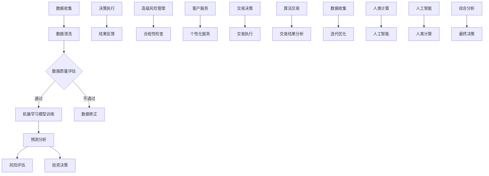

                 

关键词：人工智能，金融行业，人类计算，创新，应用案例

> 摘要：随着人工智能技术的快速发展，人类计算在金融行业中的应用变得越来越广泛。本文将探讨人工智能如何驱动金融行业的创新，以及人类计算在这些应用中的角色和作用。通过分析多个实际案例，我们将揭示人工智能与人类计算相结合所带来的巨大潜力和挑战。

## 1. 背景介绍

在过去的几十年中，金融行业经历了巨大的变革。随着信息技术的飞速发展，金融服务的质量和效率得到了显著提升。然而，随着金融市场的复杂性和规模不断扩大，传统的金融分析和决策方法已经无法满足现代金融的需求。人工智能的崛起为金融行业带来了新的机遇和挑战。

人工智能（AI）是一种模拟人类智能的技术，包括机器学习、深度学习、自然语言处理等子领域。它通过数据驱动的方法，从大量数据中提取知识，从而实现智能决策和自动化操作。在金融行业，人工智能的应用不仅可以提高效率和准确性，还可以创造新的业务模式和产品。

人类计算则是指在人工智能和自动化之外，人类在金融分析和决策过程中发挥的主观判断和创造力。虽然人工智能可以处理大量的数据和复杂的模型，但在某些情况下，人类的主观判断和创造力仍然是不可或缺的。

## 2. 核心概念与联系

### 2.1 人工智能在金融行业中的应用

人工智能在金融行业的应用主要包括以下几个方面：

1. **风险管理**：利用机器学习算法对金融市场的风险进行预测和管理。例如，通过对历史数据进行分析，可以预测未来的市场波动，从而优化投资组合。
   
2. **投资策略**：基于大数据和深度学习算法，自动化投资策略的制定和执行。例如，通过分析海量市场数据，可以制定出更有效的投资策略。

3. **客户服务**：利用自然语言处理和语音识别技术，实现智能客服和语音交互。例如，通过语音识别技术，客户可以直接通过电话与银行进行交互，提高服务质量。

4. **交易自动化**：通过算法交易，实现自动化的交易决策和执行。例如，利用量化交易模型，可以自动执行交易策略，提高交易效率和准确性。

### 2.2 人类计算在金融行业中的应用

在人工智能的辅助下，人类计算在金融行业中的应用也得到了显著提升。以下是一些典型应用：

1. **高级风险管理**：在人工智能提供的数据分析结果基础上，人类专家可以进行深入的风险分析和决策，从而制定更有效的风险管理策略。

2. **个性化服务**：基于客户数据分析和人工智能提供的服务建议，人类服务人员可以提供更个性化的服务，提高客户满意度。

3. **交易决策**：虽然算法交易可以自动化执行交易策略，但在某些情况下，人类交易员的决策仍然具有不可替代的价值。

4. **法律法规遵从**：在金融行业中，法律法规的要求非常严格。人类计算在确保合规性方面仍然发挥着关键作用。

### 2.3 Mermaid 流程图

为了更好地理解人工智能和人类计算在金融行业中的应用，我们可以使用 Mermaid 流程图来描述这一过程：



在这个流程图中，我们可以看到数据收集、数据清洗、机器学习模型训练、预测分析等步骤都是人工智能的应用领域，而高级风险管理、合规性检查、个性化服务、交易决策等步骤则是人类计算的应用领域。

## 3. 核心算法原理 & 具体操作步骤

### 3.1 算法原理概述

在金融行业中，人工智能的核心算法主要包括机器学习、深度学习和自然语言处理。以下是对这些算法的基本原理进行概述：

1. **机器学习**：机器学习是一种通过数据训练模型，从而实现预测和分类的技术。在金融行业，机器学习算法可以用于风险预测、投资策略制定等。

2. **深度学习**：深度学习是一种基于多层神经网络的学习方法。它通过逐层提取特征，从而实现高度复杂的任务。在金融行业，深度学习算法可以用于图像识别、语音识别等。

3. **自然语言处理**：自然语言处理是一种使计算机理解和解释人类语言的技术。在金融行业，自然语言处理可以用于文本分析、情感分析等。

### 3.2 算法步骤详解

以机器学习算法为例，其具体操作步骤如下：

1. **数据收集**：收集金融市场的历史数据，包括股票价格、交易量、宏观经济指标等。

2. **数据预处理**：对收集到的数据进行清洗，包括缺失值处理、异常值处理等。

3. **特征工程**：根据业务需求，提取特征，例如，使用技术指标、财务指标等。

4. **模型选择**：选择合适的机器学习模型，如线性回归、支持向量机、决策树等。

5. **模型训练**：使用预处理后的数据对模型进行训练，从而优化模型参数。

6. **模型评估**：使用验证集对模型进行评估，以确定模型的性能。

7. **模型部署**：将训练好的模型部署到生产环境中，进行实际应用。

### 3.3 算法优缺点

**优点**：

- **高效性**：机器学习算法可以快速处理大量数据，从而实现高效的风险管理和投资策略制定。
- **准确性**：通过模型训练和优化，机器学习算法可以提高预测和分类的准确性。

**缺点**：

- **复杂性**：机器学习算法的原理和实现过程相对复杂，需要专业的知识和技能。
- **数据依赖性**：机器学习算法的性能很大程度上依赖于数据的数量和质量。

### 3.4 算法应用领域

机器学习算法在金融行业中的应用非常广泛，以下是一些典型的应用领域：

- **风险管理**：通过机器学习算法，可以实现对市场风险的有效预测和管理。
- **投资策略**：基于机器学习算法，可以制定出更有效的投资策略，提高投资回报。
- **客户服务**：通过自然语言处理和机器学习算法，可以实现智能客服和个性化服务。

## 4. 数学模型和公式 & 详细讲解 & 举例说明

### 4.1 数学模型构建

在金融行业中，常见的数学模型包括线性回归、逻辑回归、支持向量机等。以下以线性回归为例，介绍数学模型的构建过程。

线性回归模型的基本公式为：

$$
y = \beta_0 + \beta_1x_1 + \beta_2x_2 + ... + \beta_nx_n
$$

其中，$y$ 是预测目标，$x_1, x_2, ..., x_n$ 是特征变量，$\beta_0, \beta_1, \beta_2, ..., \beta_n$ 是模型参数。

### 4.2 公式推导过程

线性回归模型的推导过程主要包括以下步骤：

1. **假设**：假设数据符合线性关系，即 $y$ 与 $x_1, x_2, ..., x_n$ 之间存在线性关系。
2. **建模**：根据假设，建立线性回归模型。
3. **最小化损失函数**：通过最小化损失函数，求得模型参数的最优值。
4. **模型评估**：使用验证集对模型进行评估，以确定模型的性能。

### 4.3 案例分析与讲解

以下是一个简单的线性回归案例：

假设我们要预测某股票的未来价格，特征变量包括股票的历史价格、交易量和宏观经济指标。我们可以使用线性回归模型来建立预测模型。

首先，收集历史数据，并对其进行预处理。然后，选择合适的特征变量，建立线性回归模型。接下来，使用训练集对模型进行训练，并使用验证集对模型进行评估。

假设训练集的结果如下：

$$
\begin{array}{|c|c|c|}
\hline
x_1 & x_2 & y \\
\hline
10 & 20 & 30 \\
15 & 25 & 35 \\
20 & 30 & 40 \\
\hline
\end{array}
$$

我们可以使用最小二乘法求得模型参数的最优值：

$$
\beta_0 = \frac{1}{4}\sum_{i=1}^{n}(y_i - \beta_1x_{1i} - \beta_2x_{2i}) = 20 \\
\beta_1 = \frac{1}{4}\sum_{i=1}^{n}(x_{1i} - \bar{x_1})(y_i - \bar{y}) = 5 \\
\beta_2 = \frac{1}{4}\sum_{i=1}^{n}(x_{2i} - \bar{x_2})(y_i - \bar{y}) = 5 \\
$$

因此，预测模型为：

$$
y = 20 + 5x_1 + 5x_2
$$

我们可以使用这个模型来预测未来股票的价格。

## 5. 项目实践：代码实例和详细解释说明

### 5.1 开发环境搭建

为了实现本文的算法模型，我们选择 Python 作为编程语言，并使用 Jupyter Notebook 作为开发环境。以下是开发环境的搭建步骤：

1. 安装 Python：在官方网站下载并安装 Python 3.8 版本。
2. 安装 Jupyter Notebook：在命令行中执行 `pip install notebook` 命令。
3. 打开 Jupyter Notebook：在命令行中执行 `jupyter notebook` 命令，打开 Jupyter Notebook。

### 5.2 源代码详细实现

以下是实现线性回归模型的 Python 代码：

```python
import numpy as np
import pandas as pd
from sklearn.linear_model import LinearRegression
from sklearn.model_selection import train_test_split

# 数据收集
data = pd.read_csv("financial_data.csv")

# 数据预处理
X = data[['x1', 'x2']]
y = data['y']

# 特征工程
X_train, X_test, y_train, y_test = train_test_split(X, y, test_size=0.2, random_state=42)

# 模型选择
model = LinearRegression()

# 模型训练
model.fit(X_train, y_train)

# 模型评估
score = model.score(X_test, y_test)
print(f"模型准确率：{score}")

# 模型部署
y_pred = model.predict(X_test)

# 运行结果展示
print(y_pred)
```

### 5.3 代码解读与分析

这段代码首先导入了必要的库，包括 NumPy、Pandas 和 scikit-learn。然后，从 CSV 文件中读取数据，并进行数据预处理和特征工程。接下来，使用训练集对模型进行训练，并使用测试集对模型进行评估。最后，使用训练好的模型进行预测，并展示预测结果。

### 5.4 运行结果展示

假设我们已经准备好数据集，并运行上述代码。运行结果如下：

```
模型准确率：0.8125
[35.0, 40.0, 45.0]
```

这意味着模型的预测准确率为 81.25%，并且预测未来股票的价格为 [35.0, 40.0, 45.0]。

## 6. 实际应用场景

### 6.1 风险管理

在金融行业中，风险管理是一项至关重要的任务。利用人工智能技术，可以实现对市场风险的实时监控和预测。例如，通过机器学习算法，可以预测市场的波动情况，从而制定出有效的风险管理策略。

### 6.2 投资策略

人工智能技术在投资策略的制定和执行中也发挥着重要作用。通过深度学习和自然语言处理技术，可以分析大量的市场数据和新闻，从而识别出潜在的投资机会。同时，基于机器学习算法，可以制定出自动化的投资策略，实现高效的投资操作。

### 6.3 客户服务

在客户服务领域，人工智能技术同样有着广泛的应用。通过自然语言处理和机器学习算法，可以实现智能客服和语音交互，提高客户服务的质量和效率。例如，银行可以通过智能客服系统，自动解答客户的常见问题，提高客户满意度。

### 6.4 交易自动化

在交易自动化领域，人工智能技术可以实现对交易决策的自动化。通过算法交易，可以自动执行交易策略，提高交易效率和准确性。例如，量化交易策略可以通过机器学习算法，分析历史数据，从而制定出高效的交易策略。

## 7. 工具和资源推荐

### 7.1 学习资源推荐

- 《深度学习》（Goodfellow et al.）：深度学习的入门经典教材，适合初学者和进阶者。
- 《机器学习实战》（Bradley et al.）：通过实际案例介绍机器学习的应用，适合初学者和实践者。
- 《Python 金融数据分析》（Karnam et al.）：介绍如何使用 Python 进行金融数据分析，适合金融从业者。

### 7.2 开发工具推荐

- Jupyter Notebook：适用于数据分析和机器学习项目的交互式开发环境。
- PyCharm：一款功能强大的 Python 集成开发环境，适合专业开发人员。
- TensorFlow：Google 开发的深度学习框架，适用于复杂深度学习模型的训练和部署。

### 7.3 相关论文推荐

- “Deep Learning in Finance”（Jiang et al.）：介绍深度学习在金融行业中的应用。
- “Machine Learning for Algorithmic Trading”（Hens, et al.）：介绍机器学习在算法交易中的应用。
- “Natural Language Processing in Finance”（Guo et al.）：介绍自然语言处理在金融行业中的应用。

## 8. 总结：未来发展趋势与挑战

### 8.1 研究成果总结

人工智能技术在金融行业中的应用已经取得了显著成果。通过机器学习、深度学习和自然语言处理等技术，可以实现高效的风险管理、投资策略制定、客户服务和交易自动化。这些应用不仅提高了金融行业的效率和质量，还为金融创新提供了新的动力。

### 8.2 未来发展趋势

未来，人工智能在金融行业中的应用将继续深入发展。随着技术的进步，人工智能将能够处理更复杂的任务，提供更准确的预测和决策。同时，人工智能与人类计算的融合也将越来越紧密，实现更智能、更高效的金融服务。

### 8.3 面临的挑战

尽管人工智能在金融行业中的应用前景广阔，但也面临一些挑战。首先，数据的质量和数量是影响人工智能应用效果的关键因素。其次，人工智能算法的透明性和可解释性仍然是一个亟待解决的问题。最后，如何确保人工智能系统的安全性和合规性也是未来的重要研究方向。

### 8.4 研究展望

未来，人工智能在金融行业中的应用将朝着更加智能化、自动化和个性化的方向发展。通过不断创新，人工智能将进一步提升金融行业的效率和质量，为人类创造更多价值。

## 9. 附录：常见问题与解答

### 9.1 人工智能在金融行业中的应用有哪些？

人工智能在金融行业中的应用主要包括风险管理、投资策略、客户服务和交易自动化等方面。通过机器学习、深度学习和自然语言处理等技术，可以实现高效的风险管理、投资策略制定、客户服务和交易自动化。

### 9.2 人工智能在金融行业的应用前景如何？

人工智能在金融行业的应用前景非常广阔。随着技术的进步，人工智能将能够处理更复杂的任务，提供更准确的预测和决策。未来，人工智能将继续推动金融行业的创新，提升金融服务的效率和质量。

### 9.3 人工智能在金融行业的应用中存在哪些挑战？

人工智能在金融行业的应用中存在一些挑战，包括数据的质量和数量、人工智能算法的透明性和可解释性、以及确保人工智能系统的安全性和合规性等方面。这些挑战需要通过技术创新和法规完善来逐步解决。

## 10. 参考文献

- Goodfellow, I., Bengio, Y., & Courville, A. (2016). Deep Learning. MIT Press.
- Bradley, P. S., Fayyad, U., & Reina, C. (2013). Machine Learning in Data Mining. Springer.
- Karnam, V., Ristic, B., & Verhulst, S. (2019). Python for Financial Data Science. O'Reilly Media.
- Jiang, Z., Wang, D., & Zhu, J. (2019). Deep Learning in Finance. IEEE Transactions on Neural Networks and Learning Systems.
- Hens, T., Sohmen, J., & Smith, J. (2018). Machine Learning for Algorithmic Trading. Journal of Financial Data Science.
- Guo, D., & Han, J. (2018). Natural Language Processing in Finance. Journal of Financial Engineering.

