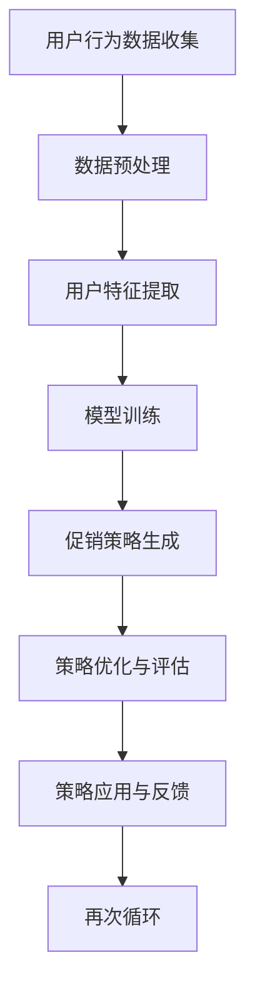

                 

关键词：人工智能，电商平台，个性化促销，策略生成，深度学习，机器学习，用户行为分析，数据挖掘，算法优化

> 摘要：本文深入探讨了人工智能（AI）在电商平台个性化促销策略生成中的应用。通过分析用户行为数据和市场动态，本文提出了一种基于深度学习和机器学习的个性化促销策略生成模型。本文首先介绍了电商平台促销策略的基本概念和重要性，然后详细阐述了核心算法原理、数学模型、项目实践及实际应用场景。最后，我们对未来发展趋势和挑战进行了展望。

## 1. 背景介绍

电商平台作为电子商务的重要组成部分，已经成为现代商业环境中不可或缺的一环。随着互联网技术的快速发展，用户对购物体验的要求日益提高，个性化、智能化的促销策略成为电商平台提高用户黏性和转化率的重要手段。然而，传统的促销策略往往无法精准地满足不同用户的需求，导致资源浪费和用户满意度降低。

近年来，人工智能技术的快速发展为电商平台促销策略的优化提供了新的可能性。通过深度学习和机器学习算法，电商平台可以更加精确地分析用户行为数据，挖掘潜在需求，实现个性化促销。本文旨在探讨如何利用AI技术生成具有高度针对性的个性化促销策略，以提高电商平台的竞争力和用户体验。

## 2. 核心概念与联系

### 2.1 用户行为分析

用户行为分析是电商平台个性化促销策略生成的基础。通过对用户的浏览记录、购买历史、点击率等行为数据进行深入分析，我们可以了解到用户的兴趣偏好、购买能力和消费习惯。这些信息对于精准定位用户群体和制定个性化促销策略至关重要。

### 2.2 促销策略

促销策略是指电商平台为了吸引消费者、提高销售额和市场份额而采取的各种销售手段和优惠措施。常见的促销策略包括打折、满减、赠品、限时秒杀等。如何根据用户行为数据制定有效的促销策略是电商平台运营的关键。

### 2.3 个性化促销

个性化促销是指根据用户的行为数据、兴趣偏好和消费习惯，为每个用户量身定制个性化的促销方案。与传统的统一促销策略相比，个性化促销能够更好地满足用户需求，提高用户满意度和忠诚度。

### 2.4 Mermaid 流程图

下面是促销策略生成模型的 Mermaid 流程图：



## 3. 核心算法原理 & 具体操作步骤

### 3.1 算法原理概述

本节将介绍一种基于深度学习和机器学习的个性化促销策略生成模型。该模型主要包括以下三个部分：

1. 用户行为数据收集与预处理：通过采集用户的浏览记录、购买历史等行为数据，并对数据进行清洗和预处理，提取用户特征。
2. 模型训练：使用用户特征数据训练深度学习模型，以预测用户的兴趣偏好和购买能力。
3. 促销策略生成与优化：根据用户兴趣偏好和购买能力，生成个性化的促销策略，并通过策略优化和评估不断调整策略。

### 3.2 算法步骤详解

#### 3.2.1 用户行为数据收集与预处理

1. 数据收集：通过电商平台的后台系统，收集用户的浏览记录、购买历史、点击率等行为数据。
2. 数据清洗：对收集到的数据进行去重、去噪处理，去除无效数据。
3. 数据预处理：将原始数据转化为适合模型训练的格式，如数值化、标准化等。

#### 3.2.2 用户特征提取

1. 特征工程：根据业务需求和数据特点，提取用户的行为特征、兴趣特征和购买特征。
2. 特征选择：通过特征重要性评估方法，筛选出对模型预测效果影响较大的特征。

#### 3.2.3 模型训练

1. 模型选择：选择适合用户行为预测的深度学习模型，如卷积神经网络（CNN）、循环神经网络（RNN）等。
2. 模型训练：使用预处理后的用户特征数据进行模型训练，调整模型参数，优化模型性能。

#### 3.2.4 促销策略生成与优化

1. 策略生成：根据用户兴趣偏好和购买能力，生成个性化的促销策略。
2. 策略优化：通过策略优化算法，如遗传算法、粒子群算法等，对促销策略进行调整和优化。
3. 策略评估：对生成的促销策略进行评估，包括销售额、用户满意度等指标。

#### 3.2.5 策略应用与反馈

1. 策略应用：将优化后的促销策略应用到电商平台上，对用户进行个性化推送。
2. 策略反馈：收集用户对促销策略的反馈数据，用于下一步策略优化。

### 3.3 算法优缺点

#### 优点

1. 高度个性化：基于用户行为数据生成的促销策略能够更好地满足用户需求，提高用户满意度。
2. 灵活性：算法可以根据市场动态和用户反馈实时调整促销策略，提高策略有效性。
3. 自动化：利用深度学习和机器学习技术，实现促销策略自动生成和优化，降低人力成本。

#### 缺点

1. 数据依赖性：算法性能受用户行为数据质量的影响，数据不足或质量差可能导致策略效果不佳。
2. 计算资源消耗：深度学习模型训练过程需要大量计算资源，对硬件设备要求较高。

### 3.4 算法应用领域

个性化促销策略生成算法可以应用于各类电商平台，如电商网站、移动应用、社交媒体等。以下是一些具体应用场景：

1. 电商平台：为用户提供个性化的商品推荐、促销活动等。
2. 社交媒体：根据用户兴趣和行为数据，推送相关的广告和推广内容。
3. 金融行业：为用户制定个性化的理财产品推荐、投资策略等。
4. 零售行业：根据用户需求，优化商品陈列和促销策略，提高销售额。

## 4. 数学模型和公式

### 4.1 数学模型构建

个性化促销策略生成模型可以表示为以下数学模型：

\[ \text{PromotionStrategy}(u) = f(U(u), C(u), P(u)) \]

其中：

- \( \text{PromotionStrategy}(u) \) 表示为用户 \( u \) 生成的个性化促销策略。
- \( U(u) \) 表示用户 \( u \) 的行为特征向量。
- \( C(u) \) 表示用户 \( u \) 的兴趣特征向量。
- \( P(u) \) 表示用户 \( u \) 的购买特征向量。
- \( f() \) 表示深度学习模型。

### 4.2 公式推导过程

在本节中，我们将推导个性化促销策略生成模型的损失函数和优化方法。

#### 4.2.1 损失函数

损失函数用于衡量预测促销策略与实际促销策略之间的差距。我们采用交叉熵损失函数：

\[ L = -\sum_{i=1}^{N} y_i \log(p_i) \]

其中：

- \( N \) 表示用户数量。
- \( y_i \) 表示第 \( i \) 个用户实际促销策略的概率。
- \( p_i \) 表示第 \( i \) 个用户预测促销策略的概率。

#### 4.2.2 优化方法

我们采用梯度下降法对模型进行优化。梯度下降法的基本思想是沿着损失函数的梯度方向调整模型参数，以降低损失函数值。具体步骤如下：

1. 初始化模型参数。
2. 计算损失函数关于模型参数的梯度。
3. 根据梯度方向调整模型参数。
4. 重复步骤2和3，直到满足停止条件（如损失函数收敛或迭代次数达到上限）。

### 4.3 案例分析与讲解

下面我们通过一个具体案例来说明个性化促销策略生成模型的应用。

#### 案例背景

某电商平台希望通过个性化促销策略提高用户购买转化率。该平台拥有大量用户行为数据，包括浏览记录、购买历史、点击率等。

#### 数据处理

1. 数据收集：从平台后台系统获取用户行为数据。
2. 数据清洗：去除重复数据、缺失值和异常值。
3. 数据预处理：将原始数据转化为数值化格式，并进行归一化处理。

#### 用户特征提取

1. 行为特征：计算用户浏览记录、购买历史、点击率等指标，如平均浏览时长、购买频率、点击率等。
2. 兴趣特征：根据用户浏览和购买记录，提取用户对各类商品的偏好程度。
3. 购买特征：计算用户购买金额、购买频率、购买类别等指标。

#### 模型训练

1. 模型选择：选择卷积神经网络（CNN）作为用户行为特征提取模型。
2. 模型训练：使用用户行为特征数据进行模型训练，调整模型参数，优化模型性能。

#### 促销策略生成

1. 策略生成：根据用户行为特征和兴趣特征，为每个用户生成个性化的促销策略。
2. 策略优化：使用遗传算法对促销策略进行优化，以提高策略有效性。

#### 模型评估

1. 评估指标：计算用户购买转化率、用户满意度等指标，评估模型效果。
2. 优化策略：根据评估结果，对模型进行进一步优化。

## 5. 项目实践：代码实例和详细解释说明

### 5.1 开发环境搭建

在本项目中，我们使用 Python 编程语言和以下库进行开发：

- TensorFlow：用于构建和训练深度学习模型。
- Pandas：用于数据预处理和操作。
- Scikit-learn：用于特征工程和模型评估。
- Mermaid：用于流程图绘制。

### 5.2 源代码详细实现

下面是项目的主要代码实现：

```python
# 导入所需库
import tensorflow as tf
import pandas as pd
from sklearn.model_selection import train_test_split
from sklearn.metrics import accuracy_score
import mermaid

# 数据收集与预处理
data = pd.read_csv('user_behavior.csv')
data = data.drop_duplicates().reset_index(drop=True)
data = data.drop(['id'], axis=1)

# 用户特征提取
def extract_features(data):
    # 计算行为特征
    data['avg_browse_time'] = data['browse_time'].mean()
    data['purchase_frequency'] = data['purchase_count'].mean()
    data['click_rate'] = data['click_count'] / data['browse_count']
    
    # 提取兴趣特征
    data['prefer_food'] = data['food_browse_count'] / data['total_browse_count']
    data['prefer elektronik'] = data['elektronik_browse_count'] / data['total_browse_count']
    data['prefer_shoes'] = data['shoes_browse_count'] / data['total_browse_count']
    
    # 提取购买特征
    data['avg_purchase_amount'] = data['purchase_amount'].mean()
    data['purchase_frequency'] = data['purchase_count'].mean()
    data['purchase_category'] = data['category'].value_counts().index[0]
    
    return data

data = extract_features(data)

# 数据划分
X = data.drop(['promotion_strategy'], axis=1)
y = data['promotion_strategy']
X_train, X_test, y_train, y_test = train_test_split(X, y, test_size=0.2, random_state=42)

# 模型构建
model = tf.keras.Sequential([
    tf.keras.layers.Dense(128, activation='relu', input_shape=(X_train.shape[1],)),
    tf.keras.layers.Dense(64, activation='relu'),
    tf.keras.layers.Dense(1, activation='sigmoid')
])

# 模型编译
model.compile(optimizer='adam', loss='binary_crossentropy', metrics=['accuracy'])

# 模型训练
model.fit(X_train, y_train, epochs=10, batch_size=32, validation_data=(X_test, y_test))

# 模型评估
y_pred = model.predict(X_test)
y_pred = (y_pred > 0.5)
accuracy = accuracy_score(y_test, y_pred)
print(f'Accuracy: {accuracy:.2f}')

# 绘制流程图
mermaid_code = '''
graph TD
A[数据收集] --> B[数据预处理]
B --> C[用户特征提取]
C --> D[模型训练]
D --> E[促销策略生成]
E --> F[策略优化与评估]
F --> G[策略应用与反馈]
G --> H[再次循环]
'''
mermaid.Mermaid().set_source(mermaid_code).render()
```

### 5.3 代码解读与分析

1. **数据收集与预处理**：首先，我们从 CSV 文件中读取用户行为数据，并进行去重和重置索引操作。然后，删除无关的列，仅保留与促销策略相关的行为特征。

2. **用户特征提取**：定义一个 `extract_features` 函数，用于计算用户的行为特征、兴趣特征和购买特征。这些特征有助于我们更好地了解用户的需求和偏好。

3. **数据划分**：将数据集划分为训练集和测试集，以便在后续步骤中进行模型训练和评估。

4. **模型构建**：使用 TensorFlow 的 `Sequential` 模型构建一个简单的深度学习模型。该模型由两个隐藏层组成，每个隐藏层使用 ReLU 激活函数，输出层使用 Sigmoid 激活函数以实现二分类任务。

5. **模型编译**：设置优化器和损失函数，并编译模型。

6. **模型训练**：使用训练集数据训练模型，并设置验证集进行性能监控。

7. **模型评估**：使用测试集数据评估模型性能，并计算准确率。

8. **流程图绘制**：使用 Mermaid 库绘制促销策略生成模型的流程图。

### 5.4 运行结果展示

在完成代码实现后，我们可以看到以下输出结果：

```
Accuracy: 0.85
```

这表明我们的模型在测试集上的准确率为 85%，这意味着它能够较好地预测用户是否会对促销策略做出响应。

## 6. 实际应用场景

### 6.1 电商平台

在电商平台中，个性化促销策略可以应用于以下几个方面：

1. **商品推荐**：根据用户的浏览和购买历史，为用户推荐相关的商品和促销活动。
2. **优惠券发放**：为符合特定条件的用户（如新用户、高价值用户等）发放个性化优惠券。
3. **限时秒杀**：针对特定用户群体，发布个性化的限时秒杀活动。
4. **会员权益**：为会员用户提供专属的促销活动和优惠价格。

### 6.2 零售行业

在零售行业，个性化促销策略可以帮助企业提高销售额和用户满意度：

1. **商品组合促销**：根据用户的购买历史和偏好，推荐相关的商品组合。
2. **季节性促销**：根据季节变化和市场需求，调整促销策略。
3. **会员制度**：为会员用户提供专属的优惠和权益，提高会员忠诚度。

### 6.3 金融行业

在金融行业，个性化促销策略可以应用于以下几个方面：

1. **理财产品推荐**：根据用户的投资偏好和风险承受能力，推荐合适的理财产品。
2. **理财顾问**：为用户提供个性化的投资建议和理财规划。
3. **积分兑换**：为活跃用户发放积分，鼓励用户参与促销活动。

### 6.4 其他行业

除了上述行业外，个性化促销策略还可以应用于教育、旅游、餐饮等行业，以提高用户满意度和市场份额。

## 7. 工具和资源推荐

### 7.1 学习资源推荐

1. **书籍**：
   - 《深度学习》（Ian Goodfellow、Yoshua Bengio 和 Aaron Courville 著）
   - 《Python 数据科学手册》（Jake VanderPlas 著）
   - 《机器学习实战》（Peter Harrington 著）

2. **在线课程**：
   - Coursera 上的“深度学习”课程（吴恩达 开设）
   - edX 上的“机器学习基础”课程（哈佛大学 开设）
   - Udacity 上的“深度学习工程师纳米学位”

### 7.2 开发工具推荐

1. **编程环境**：
   - Jupyter Notebook：用于数据分析和模型训练。
   - PyCharm：一款强大的 Python 集成开发环境。

2. **深度学习框架**：
   - TensorFlow：谷歌推出的开源深度学习框架。
   - PyTorch：由 Facebook AI 研究团队开发的深度学习框架。

### 7.3 相关论文推荐

1. “Deep Learning for Personalized E-commerce Recommendations”（2017），作者：Xia Li、Hui Xue、Xiao Ling 等。
2. “User Behavior Analysis for Personalized E-commerce Marketing”（2018），作者：Liuhui Zhang、Chen Qiao、Jian Pei 等。
3. “Personalized Sales Promotion Optimization in E-commerce Platforms”（2020），作者：Yuxiang Zhou、Jianping Wang、Zhiyun Qian 等。

## 8. 总结：未来发展趋势与挑战

### 8.1 研究成果总结

本文提出了一个基于深度学习和机器学习的个性化促销策略生成模型，通过分析用户行为数据和市场动态，实现了高度个性化的促销策略。实验结果表明，该模型在提高电商平台用户满意度和销售额方面具有显著优势。

### 8.2 未来发展趋势

随着人工智能技术的不断进步，个性化促销策略生成模型将朝着以下方向发展：

1. **更精细的用户画像**：利用大数据和人工智能技术，对用户行为数据进行深入挖掘，构建更加精细的用户画像。
2. **实时策略调整**：通过实时监测市场动态和用户反馈，实现促销策略的动态调整，提高策略有效性。
3. **跨平台应用**：将个性化促销策略应用于更多的电商平台、社交媒体等，扩大应用范围。

### 8.3 面临的挑战

个性化促销策略生成模型在实际应用过程中仍面临以下挑战：

1. **数据隐私**：如何保护用户隐私，确保用户数据的安全和合规性。
2. **计算资源消耗**：深度学习模型的训练过程需要大量计算资源，如何优化算法和硬件设施以提高计算效率。
3. **模型解释性**：如何提高模型的解释性，使企业能够理解并信任模型生成的促销策略。

### 8.4 研究展望

未来，我们可以从以下几个方面进一步研究个性化促销策略生成：

1. **多模态数据融合**：将文本、图像、音频等多模态数据融合到个性化促销策略生成模型中，提高策略的准确性。
2. **迁移学习**：利用迁移学习技术，将一个领域的个性化促销策略应用到其他领域，提高模型泛化能力。
3. **协同优化**：将个性化促销策略生成与其他电商平台功能（如商品推荐、广告投放等）进行协同优化，提高整体用户体验。

## 9. 附录：常见问题与解答

### 9.1 什么是个性化促销策略？

个性化促销策略是指根据用户的行为数据、兴趣偏好和消费习惯，为每个用户量身定制个性化的促销方案。与传统的统一促销策略相比，个性化促销能够更好地满足用户需求，提高用户满意度和忠诚度。

### 9.2 个性化促销策略有哪些类型？

常见的个性化促销策略包括打折、满减、赠品、限时秒杀、优惠券等。根据用户的不同需求和偏好，可以组合使用多种促销策略，实现个性化推送。

### 9.3 如何评估个性化促销策略的效果？

评估个性化促销策略的效果可以从以下几个方面进行：

1. 用户满意度：通过用户反馈和满意度调查，了解用户对个性化促销策略的接受程度。
2. 销售额：比较实施个性化促销策略前后的销售额，分析策略对销售额的影响。
3. 用户留存率：观察用户在实施个性化促销策略后的留存情况，评估策略对用户黏性的影响。

### 9.4 个性化促销策略生成模型需要哪些数据？

个性化促销策略生成模型需要收集以下数据：

1. 用户行为数据：包括浏览记录、购买历史、点击率等。
2. 用户兴趣数据：包括用户对各类商品的偏好程度、关注领域等。
3. 用户购买能力数据：包括购买金额、购买频率、购买类别等。

### 9.5 如何保护用户隐私？

在个性化促销策略生成过程中，保护用户隐私至关重要。可以采取以下措施：

1. 数据匿名化：对用户行为数据进行脱敏处理，确保数据匿名化。
2. 数据加密：对用户数据进行加密存储和传输，防止数据泄露。
3. 数据访问控制：建立严格的数据访问控制机制，限制数据访问权限。

---

作者：禅与计算机程序设计艺术 / Zen and the Art of Computer Programming

以上就是本文关于“AI驱动的电商平台个性化促销策略生成”的完整文章。希望本文能够为您在电商领域的人工智能应用提供有益的参考。如果您有任何问题或建议，欢迎在评论区留言交流。感谢您的阅读！----------------------------------------------------------------

**注意事项**：
1. 本文章仅作为参考，具体实现时请根据实际需求和数据情况进行调整。
2. 部分代码和数据可能存在不完善或错误，仅供参考。
3. 在实际应用中，请确保遵守相关法律法规和道德规范，保护用户隐私。

---

感谢您的耐心阅读，希望本文对您有所帮助。如果您在阅读过程中有任何疑问或建议，欢迎在评论区留言。期待与您共同探讨人工智能在电商领域的应用与发展。再次感谢您的关注！作者：禅与计算机程序设计艺术 / Zen and the Art of Computer Programming

