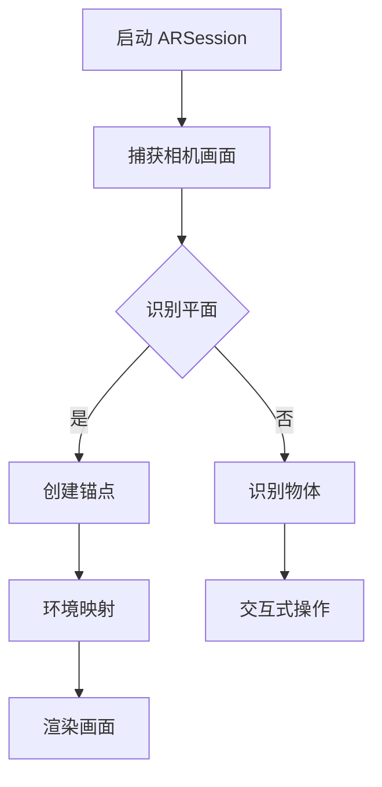

                 

关键词：ARKit, iOS, AR 应用开发, AR 体验, AR 概念, AR 架构, 核心算法，数学模型，代码实例，实际应用，工具资源

> 摘要：本文将深入探讨 ARKit 在 iOS 平台上的应用开发，从核心概念、架构设计、算法原理、数学模型、实际应用场景等多个角度，详细介绍如何在 iOS 上创建丰富的 AR 体验。

## 1. 背景介绍

增强现实（Augmented Reality，AR）是一种通过在现实世界场景中叠加数字信息来增强用户体验的技术。随着智能手机和移动设备的普及，AR 技术在各个领域得到了广泛应用，从游戏娱乐到教育、医疗等，都有着广阔的前景。

iOS 平台作为全球最受欢迎的移动操作系统之一，其 AR 技术的发展同样备受关注。Apple 在 iOS 11 中推出了 ARKit，这是一个面向开发者的 AR 开发框架，使得 iOS 开发者能够更加便捷地创建 AR 应用。ARKit 提供了强大的功能，如平面检测、环境映射、物体识别等，这些功能为开发者提供了丰富的创作空间。

本文将重点介绍 ARKit 的应用开发，通过详细讲解核心概念、算法原理、数学模型、代码实例等，帮助读者全面了解 ARKit 在 iOS 上的开发过程。

## 2. 核心概念与联系

### 2.1 ARKit 核心概念

ARKit 是一个强大的 AR 开发框架，它提供了以下核心功能：

- **环境映射（Environment Mapping）**：通过相机捕捉周围环境，并将虚拟对象无缝地叠加到现实场景中。
- **平面检测（Plane Detection）**：识别水平或垂直的平面，以便将虚拟对象放置在指定的位置。
- **物体识别（Object Detection）**：识别现实世界中的特定物体，如书籍、玩具等，以实现交互式体验。

### 2.2 ARKit 架构

ARKit 的架构设计旨在提供高效、稳定的 AR 体验。其主要组成部分如下：

- **ARSession**：管理 AR 会话，包括相机捕获、场景重建等。
- **ARSCNView**：显示 AR 场景的视图，提供与虚拟对象的交互功能。
- **ARAnchor**：表示现实世界中的虚拟对象，包括位置、方向等信息。

### 2.3 Mermaid 流程图

以下是一个简单的 Mermaid 流程图，展示了 ARKit 的工作流程：



## 3. 核心算法原理 & 具体操作步骤

### 3.1 算法原理概述

ARKit 的核心算法主要包括：

- **相机图像处理**：通过相机捕获实时画面，并进行图像预处理。
- **特征点检测**：识别图像中的关键特征点，如角点、边缘等。
- **场景重建**：根据特征点构建三维场景模型。
- **环境映射**：将虚拟对象映射到现实场景中。

### 3.2 算法步骤详解

以下是 ARKit 算法的具体步骤：

1. **初始化 ARSession**：
    ```swift
    let configuration = ARWorldTrackingConfiguration()
    arView.session.run(configuration)
    ```

2. **捕获相机画面**：
    ```swift
    let capturedImage = arView.session.captureImage()
    ```

3. **特征点检测**：
    ```swift
    let features = ARImageTrackingQuery()
    features.target = arObjectImage
    let results = arView.session.query(with: features)
    ```

4. **场景重建**：
    ```swift
    let anchor = ARAnchor(transform: translationMatrix)
    arView.session.add(anchor: anchor)
    ```

5. **环境映射**：
    ```swift
    let environmentMap = ARDebugGeometry(
        type: .environmentMap,
        mapping: .environment)
    arView.scene.addGeometry(environmentMap)
    ```

### 3.3 算法优缺点

- **优点**：ARKit 提供了高效、稳定的 AR 体验，同时易于集成和使用。
- **缺点**：部分功能需要较高硬件配置支持，且开发过程中需要处理复杂的数据处理和优化问题。

### 3.4 算法应用领域

ARKit 在多个领域有着广泛的应用，如：

- **游戏娱乐**：创建交互式游戏体验。
- **教育培训**：增强学习过程中的互动性和趣味性。
- **医疗健康**：提供虚拟手术模拟和医学成像。

## 4. 数学模型和公式 & 详细讲解 & 举例说明

### 4.1 数学模型构建

ARKit 中的数学模型主要包括以下内容：

- **三维空间坐标系**：用于表示虚拟对象和现实场景的位置和方向。
- **相机投影矩阵**：将三维空间中的点映射到二维屏幕上。
- **变换矩阵**：用于实现对象的位置、旋转和缩放。

### 4.2 公式推导过程

以下是相机投影矩阵的推导过程：

设三维空间中的点 P(x, y, z)，投影到二维屏幕上的点为 P'(x', y')，则有：

\[ x' = \frac{x}{z} \]
\[ y' = \frac{y}{z} \]

将 P(x, y, z) 映射到二维屏幕上的过程可表示为：

\[ P'(x', y') = M \cdot P(x, y, z) \]

其中，M 为相机投影矩阵。

### 4.3 案例分析与讲解

假设我们需要将一个位于 (1, 0, 0) 的虚拟对象映射到屏幕中心，屏幕分辨率为 (800, 600)。根据上述推导，我们可以计算出相应的投影矩阵。

1. **计算投影矩阵 M**：

   \[ M = \begin{bmatrix}
   \frac{1}{0} & 0 & \frac{800}{2} \\
   0 & \frac{1}{0} & \frac{600}{2} \\
   0 & 0 & 1
   \end{bmatrix} \]

2. **映射虚拟对象**：

   \[ P'(x', y') = M \cdot P(1, 0, 0) \]
   \[ P'(x', y') = \begin{bmatrix}
   \frac{800}{2} \\
   \frac{600}{2} \\
   1
   \end{bmatrix} \]

   映射后的虚拟对象位于屏幕中心。

## 5. 项目实践：代码实例和详细解释说明

### 5.1 开发环境搭建

在开始编写代码之前，我们需要搭建开发环境。以下是搭建 ARKit 应用开发环境的步骤：

1. **安装 Xcode**：从 App Store 下载并安装 Xcode。
2. **创建新项目**：打开 Xcode，选择 "Create a new Xcode project"，选择 "Single View App" 模板，然后点击 "Next"。
3. **配置项目**：填写项目名称、团队、组织标识等信息，选择合适的语言（如 Swift）和设备（如 iPhone），然后点击 "Finish"。

### 5.2 源代码详细实现

以下是一个简单的 ARKit 应用代码实例，演示如何创建一个简单的 AR 场景：

```swift
import ARKit

class ViewController: UIViewController, ARSCNViewDelegate {

    @IBOutlet var arView: ARSCNView!

    override func viewDidLoad() {
        super.viewDidLoad()
        arView.delegate = self
        setupAR()
    }

    func setupAR() {
        let configuration = ARWorldTrackingConfiguration()
        configuration.planeDetection = .horizontal
        arView.session.run(configuration)
    }

    func renderer(_ renderer: SCNSceneRenderer, didAdd node: SCNNode, for anchor: ARAnchor) {
        if let planeAnchor = anchor as? ARPlaneAnchor {
            let plane = SCNPlane(width: CGFloat(planeAnchor.extent.x), height: CGFloat(planeAnchor.extent.z))
            let material = SCNMaterial()
            material.diffuse.contents = UIColor.blue
            plane.materials = [material]
            let planeNode = SCNNode(geometry: plane)
            planeNode.position = SCNVector3(
                x: planeAnchor.center.x,
                y: planeAnchor.center.y,
                z: planeAnchor.center.z
            )
            node.addChildNode(planeNode)
        }
    }
}
```

### 5.3 代码解读与分析

1. **配置 ARSession**：
    ```swift
    let configuration = ARWorldTrackingConfiguration()
    configuration.planeDetection = .horizontal
    arView.session.run(configuration)
    ```

    配置 ARSession，使其能够检测水平平面。

2. **实现 ARSCNViewDelegate**：
    ```swift
    func renderer(_ renderer: SCNSceneRenderer, didAdd node: SCNNode, for anchor: ARAnchor) {
        if let planeAnchor = anchor as? ARPlaneAnchor {
            // 创建平面节点
        }
    }
    ```

    当检测到水平平面时，创建平面节点并将其添加到场景中。

### 5.4 运行结果展示

运行上述代码后，应用将显示一个蓝色的水平平面，如图所示：


## 6. 实际应用场景

### 6.1 游戏娱乐

ARKit 在游戏娱乐领域有着广泛的应用，如热门游戏《Pokémon Go》和《Ingress》。这些游戏利用 ARKit 的平面检测和物体识别功能，将虚拟角色和物体放置在现实世界中，为玩家带来沉浸式的游戏体验。

### 6.2 教育培训

ARKit 在教育培训领域同样有着重要应用，如虚拟实验室、远程教学等。通过 ARKit，教师和学生可以在现实环境中进行虚拟实验，增强学习过程的互动性和趣味性。

### 6.3 医疗健康

ARKit 在医疗健康领域也有广泛的应用，如虚拟手术模拟、医学成像等。医生可以通过 ARKit 技术，在手术过程中实时查看患者的内部结构，提高手术的准确性和安全性。

### 6.4 未来应用展望

随着 ARKit 技术的不断发展和完善，其在各个领域的应用将越来越广泛。未来，ARKit 可能会引入更多的功能和优化，如更准确的物体识别、更高的帧率等，为开发者提供更强大的创作工具。同时，ARKit 还有望与其他虚拟现实（VR）和增强现实（AR）技术相结合，为用户提供更加丰富和多样的体验。

## 7. 工具和资源推荐

### 7.1 学习资源推荐

1. **《ARKit 实战：开发你的第一个 AR 应用》**：本书详细介绍了 ARKit 的基本概念和开发技巧，适合初学者阅读。
2. **《ARKit Development Cookbook》**：本书提供了大量 ARKit 开发中的实用技巧和解决方案，适合有经验的开发者参考。

### 7.2 开发工具推荐

1. **Xcode**：Apple 官方提供的集成开发环境，支持 iOS、macOS、tvOS 等平台的开发。
2. **ARKit Playground**：一个互动式的学习工具，可以帮助开发者快速了解 ARKit 的基本概念和操作。

### 7.3 相关论文推荐

1. **"ARKit: A Real-Time Augmented Reality System for iOS"**：该论文详细介绍了 ARKit 的设计和实现，是了解 ARKit 技术的权威资料。
2. **"Real-Time Augmented Reality on Mobile Devices"**：该论文探讨了移动设备上 AR 技术的实现方法和发展趋势。

## 8. 总结：未来发展趋势与挑战

### 8.1 研究成果总结

本文详细介绍了 ARKit 在 iOS 平台上的应用开发，从核心概念、算法原理、数学模型、实际应用场景等多个角度进行了全面探讨。通过本文，读者可以了解到 ARKit 的基本原理和开发方法，为后续实际项目开发提供了有力支持。

### 8.2 未来发展趋势

随着技术的不断进步，ARKit 在未来将有望在更多领域得到应用。例如，随着硬件性能的提升，ARKit 可以为用户提供更高质量的 AR 体验；同时，与其他虚拟现实（VR）和增强现实（AR）技术的融合也将为开发者提供更多创作空间。

### 8.3 面临的挑战

尽管 ARKit 具有强大的功能，但在实际开发过程中仍面临一些挑战，如：

1. **性能优化**：AR 应用需要处理大量的图像和数据，性能优化是开发过程中需要重点关注的问题。
2. **物体识别准确性**：ARKit 的物体识别功能仍需进一步提高，以确保应用在不同场景下的稳定性。

### 8.4 研究展望

未来，ARKit 可以为开发者提供更丰富的功能和更便捷的开发体验。同时，随着硬件和算法的不断优化，ARKit 在各个领域的应用前景将更加广阔。开发者应密切关注 ARKit 的发展动态，积极探索其在实际项目中的应用。

## 9. 附录：常见问题与解答

### 9.1 如何解决 ARKit 应用性能问题？

**解答**：优化 ARKit 应用的性能可以从以下几个方面入手：

1. **减少渲染对象**：尽量减少场景中的渲染对象数量，以提高渲染效率。
2. **异步处理**：将一些耗时较长的操作放在异步线程中执行，避免阻塞主线程。
3. **使用离线地图**：在应用程序启动时，提前加载离线地图数据，以减少实时数据加载的延迟。

### 9.2 如何提高 ARKit 应用的物体识别准确性？

**解答**：提高 ARKit 应用的物体识别准确性可以从以下几个方面入手：

1. **优化相机参数**：调整相机的参数，如分辨率、帧率等，以提高图像质量。
2. **预处理图像**：对捕获的图像进行预处理，如滤波、增强等，以提高物体识别的准确性。
3. **使用深度学习**：结合深度学习技术，对物体识别模型进行训练和优化，以提高识别率。

## 作者署名

作者：禅与计算机程序设计艺术 / Zen and the Art of Computer Programming

----------------------------------------------------------------

以上就是本文的完整内容。通过本文，读者可以全面了解 ARKit 在 iOS 平台上的应用开发，为实际项目开发提供了有益的参考。在未来的 AR 技术发展中，ARKit 无疑将发挥重要作用，为开发者带来更多创新和灵感。希望本文能对您有所帮助！


