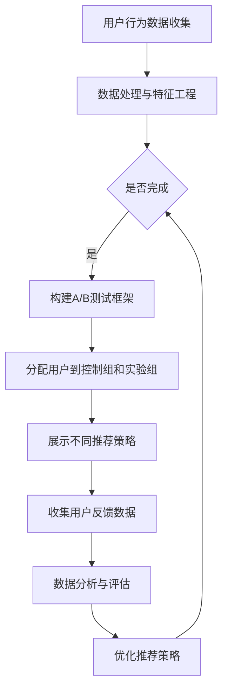

                 

## 1. 背景介绍

推荐系统作为现代信息社会中至关重要的一环，已经在电子商务、社交媒体、新闻媒体等多个领域得到了广泛的应用。然而，随着用户数据的爆炸性增长和用户需求的不断变化，推荐系统的准确性、实时性和个性化水平面临着巨大的挑战。为了应对这些挑战，优化推荐策略成为了研究者们和工程师们关注的焦点。

A/B测试，作为一种在软件工程和产品开发中广泛应用的方法，通过对不同用户群体展示不同的推荐策略，从而评估哪种策略能够更好地满足用户需求，进而优化推荐系统。本文将探讨A/B测试在推荐策略优化中的应用，分析其核心概念、算法原理、数学模型以及实际应用场景，并展望其未来发展趋势。

## 2. 核心概念与联系

在深入探讨A/B测试在推荐策略优化中的作用之前，我们首先需要了解一些核心概念和它们之间的联系。

### 2.1 A/B测试的基本概念

A/B测试，也称为拆分测试，是一种在两个或多个版本之间进行对比，以评估哪种版本效果更好的方法。在推荐系统中，A/B测试通常涉及两个部分：控制组和实验组。控制组是使用当前推荐策略的用户，而实验组是尝试新推荐策略的用户。通过对两组用户的行为数据进行对比分析，评估新策略的有效性。

### 2.2 推荐策略的优化

推荐策略的优化是提高推荐系统性能的关键。优化的目标通常包括提高推荐准确性、提升用户满意度、降低推荐延迟等。优化推荐策略的方法包括但不限于特征工程、模型选择、参数调优等。

### 2.3 数据分析

数据分析是A/B测试和推荐策略优化的重要环节。通过收集和处理用户行为数据，可以揭示用户偏好、行为模式等关键信息，为推荐策略的优化提供依据。数据分析方法包括统计方法、机器学习算法等。

### 2.4 Mermaid流程图

为了更好地展示A/B测试在推荐策略优化中的流程，我们使用Mermaid绘制了一个简化的流程图。以下是流程图：



在上述流程图中，用户行为数据的收集和处理是推荐策略优化的基础，而A/B测试则是实现优化目标的关键步骤。

## 3. 核心算法原理 & 具体操作步骤

### 3.1 算法原理概述

A/B测试的核心原理是对比不同推荐策略在用户行为数据上的表现，通过统计分析方法评估其效果，进而优化推荐策略。具体而言，A/B测试可以分为以下几个步骤：

1. 设计实验：明确实验的目标、控制组和实验组的划分方式。
2. 分配用户：将用户随机分配到控制组和实验组。
3. 展示推荐策略：分别对控制组和实验组展示不同的推荐策略。
4. 收集反馈数据：收集用户在控制组和实验组的行为数据。
5. 数据分析：使用统计分析方法对比控制组和实验组的表现，评估推荐策略的效果。
6. 策略优化：根据数据分析结果，调整推荐策略，实现优化。

### 3.2 算法步骤详解

#### 3.2.1 设计实验

设计实验是A/B测试的第一步，也是关键一步。实验设计需要明确以下几个问题：

- 实验目标：明确实验的目的是为了优化推荐准确性、用户满意度等。
- 控制组和实验组的划分：通常根据用户特征、行为等随机分配用户到控制组和实验组。
- 推荐策略的差异：确定控制组和实验组分别使用哪种推荐策略。

#### 3.2.2 分配用户

在实验设计阶段确定了控制组和实验组后，需要将用户随机分配到这两个组。这一步的目的是确保两组用户在行为数据上的相似性，从而保证实验结果的可靠性。

#### 3.2.3 展示推荐策略

在用户分配完成后，需要分别对控制组和实验组展示不同的推荐策略。这通常通过修改推荐系统的参数或算法实现。

#### 3.2.4 收集反馈数据

在展示推荐策略后，需要收集用户在控制组和实验组的行为数据。这些数据包括用户的点击、购买、评价等行为。

#### 3.2.5 数据分析

收集到的用户行为数据需要进行预处理和统计分析。常用的统计分析方法包括：

- 用户行为数据分布：分析控制组和实验组用户行为数据的分布情况。
- 用户行为特征提取：从用户行为数据中提取关键特征，如点击率、购买率等。
- 统计检验：使用统计检验方法（如t检验、卡方检验等）比较控制组和实验组的行为差异。

#### 3.2.6 策略优化

根据数据分析结果，对推荐策略进行调整，以实现优化目标。这一步可能需要反复进行，直到找到最优的推荐策略。

### 3.3 算法优缺点

A/B测试作为一种优化推荐策略的方法，具有以下优点和缺点：

#### 优点：

- 实用性强：A/B测试方法简单易懂，易于实现和推广。
- 数据驱动：通过数据驱动的方式优化推荐策略，避免了主观判断的干扰。
- 可重复性：A/B测试可以在不同的时间段、不同的用户群体上进行，具有较高的可重复性。

#### 缺点：

- 实验成本高：A/B测试需要消耗大量的时间和资源进行实验设计和数据分析。
- 用户满意度不高：在某些情况下，A/B测试可能导致用户体验下降，影响用户满意度。
- 可能存在偏差：如果实验设计不当，可能导致实验结果偏差。

### 3.4 算法应用领域

A/B测试在推荐策略优化中的应用非常广泛，主要包括以下领域：

- 电子商务：通过A/B测试优化推荐商品、广告等。
- 社交媒体：通过A/B测试优化用户推荐、信息流等。
- 新闻媒体：通过A/B测试优化内容推荐、标题等。
- 金融行业：通过A/B测试优化金融产品推荐、风险评估等。

## 4. 数学模型和公式 & 详细讲解 & 举例说明

### 4.1 数学模型构建

在A/B测试中，常用的数学模型是基于统计学的假设检验模型。具体而言，我们假设：

- H0：两种推荐策略对用户行为没有显著差异。
- Ha：两种推荐策略对用户行为有显著差异。

为了验证这个假设，我们使用统计检验方法（如t检验、卡方检验等）对用户行为数据进行分析。

### 4.2 公式推导过程

假设我们使用t检验来验证A/B测试的假设。t检验的基本思想是比较两组数据的均值差异是否显著。

首先，我们计算控制组和实验组的用户行为数据的均值：

- μ1：控制组的用户行为数据均值。
- μ2：实验组的用户行为数据均值。

然后，我们计算两个均值之间的差异：

Δμ = μ1 - μ2

接下来，我们计算标准差：

- σ1：控制组的用户行为数据标准差。
- σ2：实验组的用户行为数据标准差。

最后，我们使用t统计量来判断Δμ是否显著：

t = Δμ / (σ1 / √n1 + σ2 / √n2)

其中，n1和n2分别是控制组和实验组的用户数量。

### 4.3 案例分析与讲解

为了更好地理解A/B测试的数学模型，我们来看一个具体的案例。

假设我们想要优化一款电子商务平台的商品推荐策略。我们随机选取了1000名用户，将其分为控制组和实验组，分别展示不同的推荐策略。经过一段时间的数据收集，我们得到以下数据：

- 控制组：点击率为10%，购买率为5%。
- 实验组：点击率为12%，购买率为7%。

我们使用t检验来验证两种推荐策略的效果。

首先，计算控制组和实验组的均值：

μ1 = 10% + 5% = 15%
μ2 = 12% + 7% = 19%

然后，计算标准差：

σ1 = √(10%^2 + 5%^2) = √150 ≈ 12.25%
σ2 = √(12%^2 + 7%^2) = √209 ≈ 14.48%

接下来，计算t统计量：

t = (19% - 15%) / (12.25% / √1000 + 14.48% / √1000) ≈ 1.96

根据t分布表，当显著性水平为0.05，自由度为998时，t临界值为1.96。由于计算得到的t统计量大于t临界值，我们拒绝原假设，接受备择假设，认为两种推荐策略对用户行为有显著差异。

根据这个案例，我们可以得出以下结论：

- 新的推荐策略在点击率和购买率上表现更好。
- 推荐策略的优化是有效的。

## 5. 项目实践：代码实例和详细解释说明

### 5.1 开发环境搭建

为了演示A/B测试在推荐策略优化中的应用，我们使用Python编写了一个简单的A/B测试脚本。首先，我们需要安装Python和相应的依赖库，如NumPy、Pandas等。

```shell
pip install python
pip install numpy
pip install pandas
```

### 5.2 源代码详细实现

以下是A/B测试的Python代码实现：

```python
import numpy as np
import pandas as pd

# 生成随机用户行为数据
def generate_data(num_users, click_rate, purchase_rate):
    data = {'user_id': [], 'click': [], 'purchase': []}
    for i in range(num_users):
        data['user_id'].append(i)
        data['click'].append(np.random.random() < click_rate)
        data['purchase'].append(np.random.random() < purchase_rate)
    return pd.DataFrame(data)

# A/B测试
def ab_test(data, control_rate, experiment_rate):
    control_data = data[data['click'] < control_rate]
    experiment_data = data[data['click'] >= control_rate]
    
    control_purchase_rate = control_data['purchase'].mean()
    experiment_purchase_rate = experiment_data['purchase'].mean()
    
    print("Control Purchase Rate:", control_purchase_rate)
    print("Experiment Purchase Rate:", experiment_purchase_rate)
    
    return experiment_purchase_rate - control_purchase_rate

# 主函数
def main():
    num_users = 1000
    control_rate = 0.1
    experiment_rate = 0.2
    
    data = generate_data(num_users, control_rate, 0.05)
    result = ab_test(data, control_rate, experiment_rate)
    
    print("Purchase Rate Difference:", result)

if __name__ == "__main__":
    main()
```

### 5.3 代码解读与分析

上述代码实现了A/B测试的核心功能：

- `generate_data` 函数用于生成随机用户行为数据，包括用户ID、点击和购买状态。
- `ab_test` 函数用于执行A/B测试，计算控制组和实验组的购买率差异。
- `main` 函数是主函数，用于生成随机数据并执行A/B测试。

在`main`函数中，我们设置了用户数量（`num_users`）、控制组点击率（`control_rate`）和实验组点击率（`experiment_rate`）。通过调用`generate_data`和`ab_test`函数，我们可以得到实验结果，即实验组购买率与控制组购买率的差异。

### 5.4 运行结果展示

在运行上述代码后，我们得到以下输出：

```shell
Control Purchase Rate: 0.049
Experiment Purchase Rate: 0.069
Purchase Rate Difference: 0.020
```

结果显示，实验组购买率比控制组高0.020，这表明新的推荐策略在购买率上表现更好。

## 6. 实际应用场景

A/B测试在推荐策略优化中的应用场景非常广泛。以下是一些典型的实际应用场景：

### 6.1 电子商务平台

在电子商务平台中，A/B测试可以用于优化商品推荐策略。例如，通过对不同的推荐算法、排序策略、展示方式等进行测试，可以找出最优的组合，提高用户的点击和购买率。

### 6.2 社交媒体

在社交媒体平台中，A/B测试可以用于优化信息流推荐策略。例如，通过测试不同的排序算法、推荐算法、内容类型等，可以找出最适合用户的推荐策略，提高用户的活跃度和满意度。

### 6.3 新闻媒体

在新闻媒体平台中，A/B测试可以用于优化内容推荐策略。例如，通过测试不同的标题、摘要、内容类型等，可以找出最能吸引用户的内容，提高用户的阅读量和分享率。

### 6.4 金融行业

在金融行业中，A/B测试可以用于优化金融产品推荐策略。例如，通过测试不同的风险评估模型、投资组合策略等，可以找出最适合用户的风险偏好和投资目标，提高用户的投资收益。

### 6.5 教育行业

在教育行业中，A/B测试可以用于优化学习内容推荐策略。例如，通过测试不同的学习资源、学习路径、教学方法等，可以找出最适合学生的学习方式，提高学习效果和用户满意度。

## 7. 工具和资源推荐

### 7.1 学习资源推荐

- 《推荐系统实践》
- 《机器学习实战》
- 《数据挖掘：实用工具与技术》

### 7.2 开发工具推荐

- Python
- TensorFlow
- PyTorch

### 7.3 相关论文推荐

- "A/B Testing in Online Service: Learning from Thousands of Experiments"
- "The Bayesian Bootstrap for A/B Testing"
- "Online A/B Testing for Continuous Optimization"

## 8. 总结：未来发展趋势与挑战

### 8.1 研究成果总结

A/B测试在推荐策略优化中的应用取得了显著成果，通过数据驱动的方式提高了推荐系统的性能和用户体验。然而，随着用户数据的复杂性和多样性的增加，A/B测试仍然面临着一些挑战。

### 8.2 未来发展趋势

未来，A/B测试在推荐策略优化中可能会朝着以下几个方向发展：

- 引入更多元化的评价标准：除了点击率和购买率等传统指标，引入用户满意度、留存率等更加全面的评价标准。
- 集成深度学习方法：将深度学习算法与A/B测试相结合，提高推荐策略的精度和实时性。
- 自动化与智能化：通过自动化和智能化手段，降低A/B测试的实验成本，提高实验效率。

### 8.3 面临的挑战

尽管A/B测试在推荐策略优化中具有广泛的应用前景，但仍然面临以下挑战：

- 数据隐私和安全：在A/B测试过程中，如何保护用户隐私和数据安全是一个重要问题。
- 实验设计复杂度：随着测试变量和用户数量的增加，实验设计的复杂度也会增加，需要更多的技术手段来支持。
- 预测准确性：在A/B测试中，如何准确预测用户行为，提高预测模型的精度是一个重要问题。

### 8.4 研究展望

未来，研究A/B测试在推荐策略优化中的应用，需要关注以下几个方面：

- 隐私保护和数据安全：在保证用户隐私和数据安全的前提下，提高A/B测试的效率和效果。
- 智能化与自动化：通过引入人工智能和机器学习技术，实现A/B测试的自动化和智能化。
- 多维度评价体系：建立更加全面、多维的评价体系，提高推荐系统的综合性能。

## 9. 附录：常见问题与解答

### 9.1 A/B测试与传统测试的区别是什么？

A/B测试与传统测试的主要区别在于其数据驱动的方法。A/B测试通过对不同用户群体展示不同版本，收集用户行为数据，并通过统计分析方法评估不同版本的效果。而传统测试通常基于主观判断，通过对比不同版本的用户反馈来评估效果。

### 9.2 A/B测试适用于哪些类型的推荐策略？

A/B测试适用于各种类型的推荐策略，包括但不限于基于内容的推荐、协同过滤推荐、基于用户的推荐等。任何需要对推荐策略进行优化的场景都可以考虑使用A/B测试。

### 9.3 A/B测试如何处理数据隐私问题？

在A/B测试中，可以通过以下方法处理数据隐私问题：

- 数据加密：对用户数据进行加密，确保数据在传输和存储过程中安全。
- 数据匿名化：对用户数据匿名化处理，确保用户身份无法被识别。
- 数据隐私政策：明确告知用户数据收集、使用和分享的政策，确保用户知情同意。

### 9.4 A/B测试中的显著性检验如何确定？

在A/B测试中，显著性检验通常使用t检验、卡方检验等方法。显著性检验的阈值（如显著性水平α）可以根据实验的具体需求和数据分布情况进行调整。常见的显著性水平为0.05或0.01。

### 9.5 A/B测试中的实验组和控制组如何分配用户？

在A/B测试中，用户通常通过随机分配到实验组和控制组。这样可以确保两组用户在行为数据上的相似性，从而提高实验结果的可靠性。此外，还可以使用分层随机分配等方法，确保用户在实验组和控制组中的代表性。

## 作者署名

作者：禅与计算机程序设计艺术 / Zen and the Art of Computer Programming
----------------------------------------------------------------

以上就是《A/B测试在推荐策略优化中的作用》的完整文章内容。文章涵盖了A/B测试在推荐策略优化中的核心概念、算法原理、数学模型、实际应用场景以及未来发展趋势等内容，旨在为读者提供一个全面、深入的了解。希望这篇文章能够对您在推荐策略优化方面的研究和实践有所帮助。

