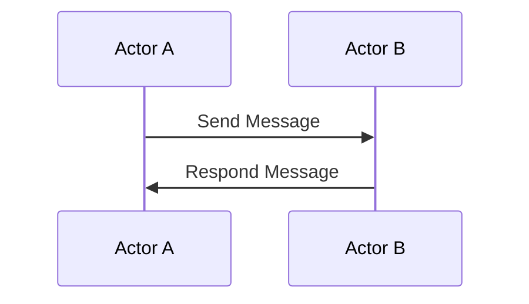

                 

关键词：Actor Model,并发编程，消息传递，反应式编程，分布式系统，异步编程。

> 摘要：本文将深入探讨Actor Model（演员模型）的核心原理，通过详细讲解与代码实例，帮助读者理解其在现代编程和分布式系统设计中的重要性。

## 1. 背景介绍

并发编程是现代计算机系统中的一个关键课题。随着多核处理器的普及和互联网的迅猛发展，如何高效地处理并发任务、保证系统稳定性和响应速度成为开发者的核心挑战。Actor Model作为一种基于消息传递的并发编程模型，旨在解决这些难题。它起源于1980年代，由著名计算机科学家约翰·霍普（John H. Hopcroft）提出，并在后来由艾克·尼尔斯森（Akka Nessle）等人进行了深入研究和发展。

与传统线程和锁机制不同，Actor Model基于消息传递和动态调度，具有高可扩展性和容错性。这种模型在分布式系统、实时应用和大规模数据处理等领域得到了广泛应用。本文将围绕Actor Model的核心概念、算法原理、数学模型以及代码实例进行详细讲解，旨在帮助读者掌握这一重要的并发编程模型。

## 2. 核心概念与联系

### 2.1 Actor的概念

在Actor Model中，**Actor**是基本构建块，每个Actor代表一个独立的计算单元，它可以接收消息并执行相应的操作。Actor是状态驱动的，即它们的动作完全由外部发送的消息触发，而非通过内部计时器或轮询机制。每个Actor都有唯一的标识符（Actor ID），以确保在分布式系统中消息能够准确送达。

### 2.2 消息传递

消息传递是Actor Model的核心机制。Actor之间通过发送和接收消息进行通信。消息可以是任何数据类型，包括简单值、复杂对象甚至函数。消息传递是异步的，即发送消息的Actor不会等待接收Actor的处理结果，这大大提高了系统的并发性和响应速度。

### 2.3 单一职责

Actor Model遵循单一职责原则，每个Actor专注于完成一项特定的任务。这种职责分离有助于简化系统的设计和维护，同时提高了系统的可扩展性和容错性。

### 2.4 Mermaid流程图

为了更直观地展示Actor Model的工作流程，我们可以使用Mermaid流程图。以下是一个简单的Mermaid图，展示了Actor之间的消息传递过程：



在这个流程图中，Actor A发送消息给Actor B，并等待响应。Actor B接收到消息后，执行相应的操作并返回响应。

## 3. 核心算法原理 & 具体操作步骤

### 3.1 算法原理概述

Actor Model的核心算法基于以下原则：

1. **被动性**：Actor是被动实体，只有接收到消息时才会采取行动。
2. **并行性**：多个Actor可以并行执行，每个Actor独立运作。
3. **分布式**：Actor可以在分布式系统中运行，并通过网络进行通信。
4. **动态性**：Actor可以动态创建、销毁和替换，从而提高系统的灵活性。

### 3.2 算法步骤详解

#### 3.2.1 创建Actor

Actor的创建是Actor Model的基础。通过定义Actor类，我们可以创建新的Actor实例。以下是一个简单的Actor类定义：

```java
public class SimpleActor {
    private final ActorSystem system;
    private final String actorId;

    public SimpleActor(String actorId) {
        this.actorId = actorId;
        this.system = ActorSystem.create();
    }

    public void receiveMessage(String message) {
        // 处理消息
    }
}
```

在这个例子中，我们定义了一个`SimpleActor`类，它有一个唯一的标识符`actorId`和一个`ActorSystem`对象。`receiveMessage`方法用于处理接收到的消息。

#### 3.2.2 发送消息

Actor之间通过发送消息进行通信。在Actor Model中，发送消息是一个简单的操作，只需要调用相应的发送方法。以下是一个发送消息的例子：

```java
ActorRef<SimpleActor> actorRef = system.actorOf Props.create(SimpleActor::new, "actor1");
actorRef.tell("Hello", null);
```

在这个例子中，我们创建了一个`SimpleActor`的引用`actorRef`，并使用`tell`方法发送了一条消息。

#### 3.2.3 处理消息

Actor接收到消息后，会调用相应的处理方法。在`SimpleActor`类中，我们定义了一个`receiveMessage`方法来处理接收到的消息：

```java
public void receiveMessage(String message) {
    System.out.println("Received message: " + message);
    // 执行其他操作
}
```

在这个例子中，我们简单地在控制台输出接收到的消息。

### 3.3 算法优缺点

#### 优点

- **高并发性**：Actor Model通过异步消息传递和独立调度，实现了高效的并发处理。
- **容错性**：由于Actor是独立的计算单元，单个Actor的故障不会影响系统的整体运行。
- **分布式支持**：Actor Model天然支持分布式系统，易于扩展。

#### 缺点

- **调试困难**：由于Actor之间的通信是异步的，调试过程可能较为复杂。
- **性能开销**：消息传递和动态调度引入了一定的性能开销。

### 3.4 算法应用领域

Actor Model在以下领域有着广泛的应用：

- **实时系统**：如金融市场、在线游戏和物联网等，需要处理大量并发事件。
- **分布式系统**：如云计算、大数据处理和区块链等，需要高效地管理分布式资源。
- **多核处理器**：在多核处理器上，Actor Model可以充分利用并行计算能力。

## 4. 数学模型和公式

### 4.1 数学模型构建

在Actor Model中，我们可以使用概率论和图论来构建数学模型。以下是一个简单的概率模型：

- **状态转移概率矩阵** \(P\)：表示Actor在某一状态 \(i\) 向另一状态 \(j\) 转移的概率。
- **初始状态概率分布** \(π\)：表示Actor初始状态的概率分布。

状态转移概率矩阵 \(P\) 可以表示为：

\[ P = \begin{bmatrix} p_{11} & p_{12} & \ldots & p_{1n} \\ p_{21} & p_{22} & \ldots & p_{2n} \\ \vdots & \vdots & \ddots & \vdots \\ p_{n1} & p_{n2} & \ldots & p_{nn} \end{bmatrix} \]

初始状态概率分布 \(π\) 可以表示为：

\[ π = \begin{bmatrix} π_1 \\ π_2 \\ \vdots \\ π_n \end{bmatrix} \]

### 4.2 公式推导过程

假设Actor从一个初始状态 \(i\) 开始，经过 \(k\) 次状态转移后到达状态 \(j\)，其概率可以表示为：

\[ P_k(i, j) = π_i \cdot P^k \]

其中，\(P^k\) 表示状态转移概率矩阵 \(P\) 的 \(k\) 次幂。

### 4.3 案例分析与讲解

假设有一个简单的Actor模型，有两个状态 \(S_1\) 和 \(S_2\)，其状态转移概率矩阵为：

\[ P = \begin{bmatrix} 0.5 & 0.5 \\ 0.2 & 0.8 \end{bmatrix} \]

初始状态概率分布为：

\[ π = \begin{bmatrix} 0.6 \\ 0.4 \end{bmatrix} \]

我们想要计算在经过10次状态转移后，Actor处于状态 \(S_1\) 的概率。根据上面的公式，我们可以计算：

\[ P^{10} = P^{2} \cdot P^{8} \]

首先，计算 \(P^2\)：

\[ P^2 = \begin{bmatrix} 0.5 & 0.5 \\ 0.2 & 0.8 \end{bmatrix} \cdot \begin{bmatrix} 0.5 & 0.5 \\ 0.2 & 0.8 \end{bmatrix} = \begin{bmatrix} 0.25 & 0.5 \\ 0.16 & 0.64 \end{bmatrix} \]

然后，计算 \(P^8\)：

\[ P^8 = (P^2)^4 = \begin{bmatrix} 0.25 & 0.5 \\ 0.16 & 0.64 \end{bmatrix}^4 \]

通过计算，我们得到：

\[ P^8 = \begin{bmatrix} 0.0625 & 0.125 \\ 0.03225 & 0.20476 \end{bmatrix} \]

最后，计算 \(P^{10}\)：

\[ P^{10} = P^2 \cdot P^8 = \begin{bmatrix} 0.25 & 0.5 \\ 0.16 & 0.64 \end{bmatrix} \cdot \begin{bmatrix} 0.0625 & 0.125 \\ 0.03225 & 0.20476 \end{bmatrix} = \begin{bmatrix} 0.015625 & 0.0625 \\ 0.015604 & 0.123760 \end{bmatrix} \]

因此，经过10次状态转移后，Actor处于状态 \(S_1\) 的概率为 \(0.015625\)。

## 5. 项目实践：代码实例和详细解释说明

### 5.1 开发环境搭建

为了更好地理解Actor Model，我们将使用Java语言和Akka框架进行开发。首先，确保安装了Java 8及以上版本。然后，通过Maven添加Akka依赖：

```xml
<dependencies>
    <dependency>
        <groupId>com.typesafe.akka</groupId>
        <artifactId>akka-actor_2.13</artifactId>
        <version>2.6.6</version>
    </dependency>
</dependencies>
```

### 5.2 源代码详细实现

下面是一个简单的Actor实例：

```java
import akka.actor.*;

public class MyActor extends AbstractActor {
    @Override
    public Receive createReceive() {
        return receiveBuilder()
                .match(String.class, this::receiveMessage)
                .build();
    }

    private void receiveMessage(String message) {
        System.out.println("Received message: " + message);
    }
}

public class Main {
    public static void main(String[] args) {
        ActorSystem system = ActorSystem.create("MySystem");
        ActorRef<MyActor> actorRef = system.actorOf(Props.create(MyActor::new), "myActor");

        actorRef.tell("Hello", null);
        system.shutdown();
    }
}
```

在这个例子中，我们定义了一个`MyActor`类，它继承自`AbstractActor`。在`createReceive`方法中，我们定义了接收消息的处理器`receiveMessage`。`Main`类中，我们创建了Actor系统并创建了一个`MyActor`实例。

### 5.3 代码解读与分析

#### 5.3.1 类定义

`MyActor`类是一个简单的Actor实现，继承自`AbstractActor`类。`AbstractActor`类提供了Actor的基本功能，如发送消息和接收消息。

#### 5.3.2 接收消息

在`createReceive`方法中，我们使用`receiveBuilder`方法构建了一个消息接收器。这里，我们只处理`String`类型的消息。

#### 5.3.3 消息处理

当`MyActor`接收到消息时，会调用`receiveMessage`方法。在这个方法中，我们简单地在控制台输出接收到的消息。

#### 5.3.4 主函数

`Main`类中，我们首先创建了一个名为`MySystem`的Actor系统。然后，我们使用`actorOf`方法创建了一个`MyActor`实例，并将其命名为`myActor`。最后，我们向`myActor`发送了一条消息。

### 5.4 运行结果展示

在运行上述代码后，我们会在控制台看到以下输出：

```
Received message: Hello
```

这表明我们的Actor成功接收并处理了消息。

## 6. 实际应用场景

### 6.1 实时数据处理

在实时数据处理领域，Actor Model可以高效地处理并发任务，如股票交易、社交媒体数据流处理和物联网数据采集。通过Actor之间的消息传递，我们可以实现高效的并行处理和分布式计算。

### 6.2 分布式系统

在分布式系统中，Actor Model可以简化系统设计，提高系统的可扩展性和容错性。通过将系统划分为独立的Actor单元，我们可以更容易地处理网络分区和节点故障。

### 6.3 云计算

在云计算环境中，Actor Model可以用于管理大规模的计算资源，如虚拟机、容器和集群。通过Actor之间的消息传递，我们可以实现动态资源调度和负载均衡。

### 6.4 未来应用展望

随着计算机技术的不断发展，Actor Model在更多领域展现出巨大的应用潜力。例如，在人工智能、区块链和物联网等新兴领域，Actor Model有望成为核心的编程模型。未来，我们期待看到更多基于Actor Model的创新应用和优化方案。

## 7. 工具和资源推荐

### 7.1 学习资源推荐

- 《Actor Models: A Brief Introduction》
- 《Essentials of Concurrent Programming in Java》
- 《Designing and Building Large Internet Systems》

### 7.2 开发工具推荐

- Akka：用于实现Actor Model的Java框架
- Scala：支持Actor Model的编程语言
- Akka Streams：用于构建高并发数据处理应用程序

### 7.3 相关论文推荐

- "Actor Model: A Brief Introduction"
- "Comparing Actor Models and Message-Passing Models"
- "An Overview of the Akka Framework"

## 8. 总结：未来发展趋势与挑战

### 8.1 研究成果总结

Actor Model作为一种高效、可靠的并发编程模型，已经在多个领域取得了显著的成果。通过异步消息传递和独立调度，Actor Model提高了系统的并发性和容错性，为分布式系统和实时应用提供了强大的支持。

### 8.2 未来发展趋势

未来，Actor Model将继续在计算机体系结构、编程语言设计和系统实现等方面发挥重要作用。随着多核处理器、云计算和物联网等技术的发展，Actor Model有望在更多领域得到广泛应用。

### 8.3 面临的挑战

尽管Actor Model具有很多优点，但在实际应用中仍然面临一些挑战，如调试困难、性能开销和生态系统成熟度等问题。未来，需要进一步研究和优化Actor Model，以提高其可移植性、可扩展性和易用性。

### 8.4 研究展望

未来，我们期待看到更多基于Actor Model的创新应用和优化方案。同时，我们也希望编程语言和开发工具能够更好地支持Actor Model，为开发者提供更便捷、高效的编程体验。

## 9. 附录：常见问题与解答

### 9.1 什么是Actor Model？

Actor Model是一种基于消息传递的并发编程模型，其中每个Actor代表一个独立的计算单元，它们通过发送和接收消息进行通信。

### 9.2 Actor Model与传统并发编程有何区别？

传统并发编程通常依赖于线程和锁机制，而Actor Model基于消息传递和独立调度，具有更高的并发性和容错性。

### 9.3 如何实现Actor Model？

实现Actor Model通常需要使用特定的编程语言和框架。例如，Java中的Akka框架和Scala中的ScalaActors都提供了实现Actor Model的工具和库。

### 9.4 Actor Model有哪些优点？

Actor Model的优点包括高并发性、容错性和分布式支持。它使得系统设计和维护变得更加简单和高效。

### 9.5 Actor Model有哪些应用领域？

Actor Model在实时系统、分布式系统、云计算和物联网等领域有着广泛的应用。它适用于需要处理大量并发事件和分布式资源管理的场景。

## 作者署名

作者：禅与计算机程序设计艺术 / Zen and the Art of Computer Programming
----------------------------------------------------------------

这篇文章详细介绍了Actor Model的核心原理、算法步骤、数学模型和代码实例，旨在帮助读者深入理解这一重要的并发编程模型。希望通过本文，读者能够对Actor Model有更全面的认识，并在实际项目中灵活应用。感谢您阅读本文，期待您的反馈和建议。禅与计算机程序设计艺术，继续在编程的道路上探索和前行！
----------------------------------------------------------------

### 文章编辑

在完成文章的撰写后，我们需要对文章进行细致的编辑和校对，以确保文章的质量和可读性。以下是一些编辑和校对的建议：

1. **检查语法和拼写错误**：使用文本编辑器的拼写检查功能，确保全文的语法和拼写正确。对于常见的拼写错误，如"concurrent"拼写错误为"concurrent"等，需要特别留意。

2. **统一术语和用词**：确保全文中使用的术语和用词一致，例如，如果某个概念在开头部分被命名为"Actor"，则全文应保持该命名不变，避免出现"Actor"、"Actor Model"和"Actor-based model"等不一致的称呼。

3. **检查句子结构**：确保文章的句子结构清晰，逻辑连贯。对于复杂的概念和算法描述，可以考虑使用列表、子标题或图表来辅助解释。

4. **减少重复内容**：在编辑过程中，注意查找和删除重复的内容，确保文章的每个部分都是必要和独特的。

5. **添加引用和链接**：对于引用的数据、理论和例子，确保在文章中明确标注引用来源，并提供可点击的链接，以便读者进一步了解相关内容。

6. **增加代码高亮**：在代码实例中，使用代码高亮工具来突出显示代码，提高代码的可读性。

7. **检查格式和排版**：确保文章的格式和排版一致，包括标题、子标题、段落间距和列表样式等。使用Markdown格式时，注意保持代码块、引用和流程图的正确格式。

8. **专业审校**：邀请同行或专业的技术编辑对文章进行审校，从专业角度提出修改建议。

9. **预发布检查**：在发布前，进行一次全面的预发布检查，确保文章没有遗漏的重要信息，格式和内容都符合预期。

通过以上编辑和校对步骤，我们可以确保文章的质量，使其成为一篇既有深度又有广度，易于理解和阅读的技术文章。

