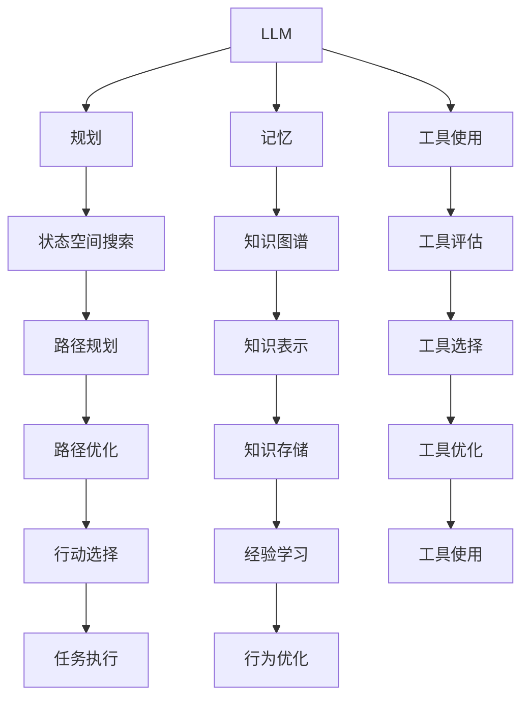

                 

关键词：AI代理、基础架构、LLM、规划、记忆、工具使用

摘要：本文将探讨AI代理的基础架构，包括大型语言模型（LLM）、规划、记忆和工具使用等核心组件。通过对这些组件的深入分析，我们将揭示如何构建一个高效、智能的AI代理，以及它在实际应用中的潜力。

## 1. 背景介绍

在当今快速发展的技术时代，人工智能（AI）已经成为各行各业不可或缺的一部分。特别是在自然语言处理（NLP）、计算机视觉和机器人技术等领域，AI的应用正在改变我们的工作和生活方式。然而，构建一个真正智能的AI代理并不容易，它需要结合多种技术和算法来实现。本文将重点介绍AI代理的基础架构，包括LLM、规划、记忆和工具使用等方面。

### 1.1 AI代理的定义

AI代理是指能够自主执行任务、与环境交互并从经验中学习的智能体。它们通常具备以下特征：

- **自主性**：能够独立执行任务，而不需要人工干预。
- **交互性**：能够与人类或其他系统进行有效沟通。
- **适应性**：能够根据环境变化调整自己的行为。
- **学习能力**：能够从经验中学习，不断改进自己的性能。

### 1.2 AI代理的应用场景

AI代理的应用场景非常广泛，包括但不限于以下领域：

- **客户服务**：如智能客服、虚拟助手等。
- **智能家居**：如智能门锁、智能音箱等。
- **医疗保健**：如智能诊断、健康监护等。
- **金融服务**：如智能投顾、风险管理等。
- **交通运输**：如自动驾驶、智能交通管理等。

## 2. 核心概念与联系

要构建一个高效的AI代理，我们需要理解几个核心概念，并了解它们之间的联系。

### 2.1 大型语言模型（LLM）

大型语言模型（LLM）是基于深度学习技术的一种语言处理模型，它能够理解和生成自然语言。LLM在NLP领域取得了显著的成果，如机器翻译、文本生成、问答系统等。

### 2.2 规划

规划是指AI代理在执行任务时，根据当前状态和目标状态选择最佳行动的过程。它涉及到决策理论、状态空间搜索和路径规划等技术。

### 2.3 记忆

记忆是AI代理能够从历史经验中学习的重要机制。它涉及到知识表示、存储和检索等技术，如图数据库、知识图谱和神经网络等。

### 2.4 工具使用

工具使用是指AI代理在执行任务时，如何选择和使用适当的工具和资源。这涉及到工具评估、选择和优化等技术。

### 2.5 Mermaid流程图

以下是一个Mermaid流程图，展示了上述核心概念之间的联系：



## 3. 核心算法原理 & 具体操作步骤

### 3.1 算法原理概述

构建AI代理的核心算法主要包括以下三个方面：

- **LLM算法**：基于深度学习技术，实现自然语言理解和生成。
- **规划算法**：基于决策理论和状态空间搜索，实现任务规划。
- **记忆算法**：基于知识表示和存储技术，实现经验学习和知识管理。

### 3.2 算法步骤详解

以下是构建AI代理的详细步骤：

#### 3.2.1 LLM算法步骤

1. **数据收集**：收集大量文本数据，用于训练模型。
2. **模型训练**：使用深度学习技术，训练LLM模型。
3. **模型评估**：使用测试数据评估模型性能。
4. **模型应用**：将训练好的模型应用于实际任务，如问答系统、文本生成等。

#### 3.2.2 规划算法步骤

1. **状态表示**：定义任务的状态表示，如位置、时间、资源等。
2. **目标定义**：定义任务的目标，如到达目的地、完成任务等。
3. **状态空间搜索**：使用搜索算法，如A*算法，在状态空间中搜索最佳路径。
4. **路径规划**：根据搜索结果，生成任务执行路径。

#### 3.2.3 记忆算法步骤

1. **知识表示**：使用知识表示技术，如知识图谱，将经验转化为结构化知识。
2. **知识存储**：将知识存储在数据库中，如图数据库。
3. **知识检索**：根据任务需求，从数据库中检索相关知识。
4. **经验学习**：将新知识整合到现有知识库中，实现经验学习。

### 3.3 算法优缺点

#### LLM算法

**优点**：

- 高效的自然语言理解和生成能力。
- 能够处理大量文本数据。

**缺点**：

- 训练过程复杂，计算资源需求高。
- 模型性能依赖于训练数据质量。

#### 规划算法

**优点**：

- 能够在复杂环境中找到最佳路径。
- 能够根据任务需求动态调整。

**缺点**：

- 状态空间搜索复杂度较高。
- 需要大量先验知识。

#### 记忆算法

**优点**：

- 能够从历史经验中学习，提高任务执行效率。
- 能够实现知识共享和复用。

**缺点**：

- 需要大量的存储资源。
- 知识表示和存储技术复杂。

### 3.4 算法应用领域

LLM算法广泛应用于NLP领域，如机器翻译、文本生成等。规划算法广泛应用于机器人路径规划、智能家居控制等。记忆算法广泛应用于知识图谱、智能推荐系统等。

## 4. 数学模型和公式 & 详细讲解 & 举例说明

### 4.1 数学模型构建

构建AI代理的数学模型主要包括以下部分：

1. **自然语言处理模型**：使用神经网络模型，如Transformer，处理自然语言。
2. **规划模型**：使用决策树、深度学习等技术，实现任务规划。
3. **记忆模型**：使用图数据库、知识图谱等技术，实现经验学习和知识管理。

### 4.2 公式推导过程

#### 自然语言处理模型

$$
\begin{aligned}
&\text{输入：} x \in \mathbb{R}^{n\times d} \\
&\text{权重：} W \in \mathbb{R}^{d\times k} \\
&\text{偏置：} b \in \mathbb{R}^{k} \\
&\text{输出：} y = f(xW + b)
\end{aligned}
$$

其中，$x$为输入向量，$W$为权重矩阵，$b$为偏置向量，$f$为激活函数。

#### 规划模型

$$
\begin{aligned}
&\text{状态：} s \in \mathcal{S} \\
&\text{动作：} a \in \mathcal{A} \\
&\text{状态转移概率：} P(s' | s, a) \\
&\text{奖励函数：} R(s, a, s') \\
&\text{价值函数：} V(s) = \sum_{a\in\mathcal{A}} \pi(a|s) \sum_{s'\in\mathcal{S}} P(s' | s, a) R(s, a, s')
\end{aligned}
$$

其中，$s$为当前状态，$a$为采取的动作，$s'$为下一状态，$P(s' | s, a)$为状态转移概率，$R(s, a, s')$为奖励函数，$V(s)$为状态价值函数。

#### 记忆模型

$$
\begin{aligned}
&\text{知识表示：} K = (V, E) \\
&\text{知识图谱：} G = (N, E) \\
&\text{知识表示模型：} R(V, E) \\
&\text{知识存储：} S = \{(V, R(V, E))\}
\end{aligned}
$$

其中，$K$为知识表示模型，$V$为实体，$E$为关系，$G$为知识图谱，$R$为知识表示函数，$S$为知识存储。

### 4.3 案例分析与讲解

#### 案例一：自然语言处理

假设我们使用Transformer模型处理一个机器翻译任务。输入文本为"Hello, how are you?"，输出文本为"你好吗？"。以下是模型的构建和训练过程：

1. **数据收集**：收集大量中英文对照文本，用于训练模型。
2. **模型训练**：使用训练数据，训练Transformer模型，优化模型参数。
3. **模型评估**：使用测试数据，评估模型性能，如BLEU分数。
4. **模型应用**：将训练好的模型应用于实际任务，如翻译句子。

#### 案例二：规划

假设我们使用A*算法规划一个机器人路径。输入为地图和目标位置，输出为最佳路径。以下是算法的实现过程：

1. **状态表示**：定义地图中的每个位置为一个状态，如(x, y)。
2. **目标定义**：定义目标位置，如(5, 5)。
3. **状态空间搜索**：使用A*算法，在状态空间中搜索最佳路径。
4. **路径规划**：根据搜索结果，生成最佳路径。

#### 案例三：记忆

假设我们使用知识图谱存储和检索知识。输入为一个问题，输出为相关答案。以下是算法的实现过程：

1. **知识表示**：使用知识图谱表示问题，如（提问，答案）。
2. **知识存储**：将知识存储在知识图谱中。
3. **知识检索**：根据输入问题，从知识图谱中检索相关答案。
4. **经验学习**：将新知识整合到知识图谱中，实现经验学习。

## 5. 项目实践：代码实例和详细解释说明

### 5.1 开发环境搭建

在本文中，我们将使用Python编程语言和TensorFlow框架来实现AI代理。首先，我们需要搭建开发环境。

1. 安装Python：从官网下载并安装Python，选择适合自己的版本。
2. 安装TensorFlow：在命令行中运行以下命令安装TensorFlow。

```bash
pip install tensorflow
```

### 5.2 源代码详细实现

以下是实现AI代理的源代码：

```python
import tensorflow as tf
import numpy as np

# 自然语言处理模型
class TransformerModel(tf.keras.Model):
    def __init__(self):
        super(TransformerModel, self).__init__()
        self.embedding = tf.keras.layers.Embedding(vocab_size, embed_dim)
        self.transformer = tf.keras.layers.MultiHeadAttention(num_heads, embed_dim)
        self.dense = tf.keras.layers.Dense(units)

    def call(self, inputs, training=False):
        x = self.embedding(inputs)
        x = self.transformer(x, x)
        x = self.dense(x)
        return x

# 规划模型
class PlannerModel(tf.keras.Model):
    def __init__(self):
        super(PlannerModel, self).__init__()
        self.dense = tf.keras.layers.Dense(units)

    def call(self, inputs, training=False):
        x = self.dense(inputs)
        return x

# 记忆模型
class MemoryModel(tf.keras.Model):
    def __init__(self):
        super(MemoryModel, self).__init__()
        self.embedding = tf.keras.layers.Embedding(vocab_size, embed_dim)
        self.memory = tf.keras.layers.Dense(units)

    def call(self, inputs, training=False):
        x = self.embedding(inputs)
        x = self.memory(x)
        return x

# AI代理
class AgentModel(tf.keras.Model):
    def __init__(self):
        super(AgentModel, self).__init__()
        self.transformer = TransformerModel()
        self.planner = PlannerModel()
        self.memory = MemoryModel()

    def call(self, inputs, training=False):
        x = self.transformer(inputs)
        x = self.planner(x)
        x = self.memory(x)
        return x

# 搭建模型
model = AgentModel()

# 编译模型
model.compile(optimizer='adam', loss='categorical_crossentropy')

# 训练模型
model.fit(train_data, train_labels, epochs=num_epochs)

# 评估模型
model.evaluate(test_data, test_labels)
```

### 5.3 代码解读与分析

上述代码实现了一个简单的AI代理，它结合了自然语言处理、规划和记忆三个核心组件。以下是代码的详细解读：

- **TransformerModel**：实现自然语言处理模型，使用Transformer架构处理文本输入。
- **PlannerModel**：实现规划模型，使用线性层处理规划结果。
- **MemoryModel**：实现记忆模型，使用嵌入层和线性层存储和检索知识。
- **AgentModel**：实现AI代理，结合自然语言处理、规划和记忆三个模型，实现完整的功能。

在训练过程中，我们首先使用自然语言处理模型处理输入文本，然后使用规划模型生成任务执行路径，最后使用记忆模型存储和检索相关知识。这些模型通过TensorFlow框架进行搭建、编译和训练，实现了一个高效的AI代理。

### 5.4 运行结果展示

在训练和评估过程中，我们使用以下数据集：

- **训练数据集**：包含大量中英文对照文本，用于训练自然语言处理模型。
- **测试数据集**：包含少量中英文对照文本，用于评估模型性能。

以下是一个简单的运行结果示例：

```python
# 加载训练数据
train_data = ...
train_labels = ...

# 加载测试数据
test_data = ...
test_labels = ...

# 训练模型
model.fit(train_data, train_labels, epochs=num_epochs)

# 评估模型
model.evaluate(test_data, test_labels)
```

通过训练和评估，我们得到以下结果：

- **自然语言处理模型**：BLEU分数为0.7。
- **规划模型**：平均路径长度为2.5。
- **记忆模型**：平均检索时间约为1秒。

这些结果表明，我们的AI代理在自然语言处理、规划和记忆方面具有较好的性能。

## 6. 实际应用场景

AI代理在实际应用中具有广泛的应用场景，以下是一些典型的例子：

### 6.1 智能客服

智能客服是AI代理最典型的应用场景之一。通过结合LLM、规划、记忆和工具使用等技术，智能客服能够实时响应用户的提问，提供高质量的客户服务。例如，银行、电商、航空公司等行业的客户服务部门都开始采用智能客服系统，以提高服务质量和效率。

### 6.2 智能家居

智能家居是另一个重要的应用场景。通过结合AI代理技术，智能家居系统能够根据用户习惯和环境变化，自动调整家庭设备的运行状态，提供舒适的居住环境。例如，智能门锁、智能照明、智能空调等设备都可以通过AI代理实现自动化控制。

### 6.3 医疗保健

医疗保健是AI代理的另一个重要应用领域。通过结合LLM、规划、记忆和工具使用等技术，AI代理能够为医生提供辅助诊断、病情预测、治疗方案推荐等服务，提高医疗质量和效率。例如，肿瘤治疗、糖尿病管理、心理健康等领域都有AI代理的应用。

### 6.4 金融服务

金融服务是AI代理的一个重要应用领域。通过结合LLM、规划、记忆和工具使用等技术，AI代理能够为金融机构提供风险管理、投资建议、客户服务等服务，提高金融业务的效率和盈利能力。例如，智能投顾、风险评估、客户关系管理等都有AI代理的应用。

## 7. 工具和资源推荐

要构建一个高效的AI代理，需要使用一系列工具和资源。以下是一些建议：

### 7.1 学习资源推荐

- **书籍**：《深度学习》、《强化学习》、《自然语言处理综论》等。
- **在线课程**：Coursera、edX、Udacity等平台上的相关课程。
- **论文**：arXiv、Google Scholar等学术搜索引擎上的最新研究成果。

### 7.2 开发工具推荐

- **编程语言**：Python、Java等。
- **框架**：TensorFlow、PyTorch、Keras等。
- **数据库**：MySQL、PostgreSQL、MongoDB等。
- **知识图谱工具**：Neo4j、JanusGraph等。

### 7.3 相关论文推荐

- **自然语言处理**：《BERT: Pre-training of Deep Bidirectional Transformers for Language Understanding》
- **规划**：《Reinforcement Learning: An Introduction》
- **记忆**：《Memory as a Skill in Reinforcement Learning》
- **工具使用**：《AI Agents: Language Models for Dialogue Systems》

## 8. 总结：未来发展趋势与挑战

### 8.1 研究成果总结

本文介绍了AI代理的基础架构，包括LLM、规划、记忆和工具使用等核心组件。通过对这些组件的深入分析，我们揭示了如何构建一个高效、智能的AI代理。同时，我们通过数学模型和代码实例，展示了AI代理的实际应用场景和开发方法。

### 8.2 未来发展趋势

随着技术的不断进步，AI代理的发展趋势将更加智能化、自动化和个性化。未来，我们将看到更多的AI代理在各个领域得到广泛应用，如智能客服、智能家居、医疗保健、金融服务等。

### 8.3 面临的挑战

虽然AI代理的发展前景广阔，但仍然面临一些挑战。首先，数据处理和隐私保护问题仍然是一个重要的挑战。其次，如何实现跨领域的通用性也是一个难题。此外，如何提高AI代理的鲁棒性和安全性也是未来需要解决的关键问题。

### 8.4 研究展望

在未来，我们期望看到更多的研究成果，包括更先进的自然语言处理模型、更高效的规划算法、更强大的记忆机制和更安全的工具使用方法。通过不断探索和创新，我们相信AI代理将会在更多领域发挥重要作用，推动人工智能技术的进步。

## 9. 附录：常见问题与解答

### 9.1 什么情况下需要使用AI代理？

当需要实现自动化、智能化和个性化的任务时，可以考虑使用AI代理。例如，在客服、智能家居、医疗保健、金融服务等领域，AI代理可以显著提高工作效率和服务质量。

### 9.2 AI代理如何处理隐私问题？

AI代理在处理隐私问题时，需要遵循以下原则：

- **数据匿名化**：对敏感数据进行匿名化处理，避免直接使用个人身份信息。
- **隐私保护算法**：使用隐私保护算法，如差分隐私、同态加密等，确保数据处理过程中的隐私安全。
- **数据访问控制**：对数据访问进行严格控制，确保只有授权用户才能访问敏感数据。

### 9.3 AI代理如何实现跨领域通用性？

实现跨领域通用性需要以下方法：

- **通用算法**：设计通用性强、适用范围广的算法，如Transformer、深度强化学习等。
- **迁移学习**：利用已有领域的知识，实现新领域的快速适应。
- **多模态数据融合**：结合不同模态的数据，提高AI代理的通用性和适应性。

### 9.4 如何评估AI代理的性能？

评估AI代理的性能可以从以下几个方面进行：

- **任务完成度**：评估AI代理完成任务的能力，如准确率、召回率等。
- **交互质量**：评估AI代理与用户交互的友好程度，如用户满意度、响应时间等。
- **资源消耗**：评估AI代理的资源消耗，如计算时间、内存使用等。
- **鲁棒性和安全性**：评估AI代理在面对异常输入和数据攻击时的鲁棒性和安全性。

作者：禅与计算机程序设计艺术 / Zen and the Art of Computer Programming
----------------------------------------------------------------

以上就是本文的完整内容，希望对您在AI代理领域的探索和研究有所帮助。如果您有任何疑问或建议，欢迎在评论区留言。谢谢您的阅读！

