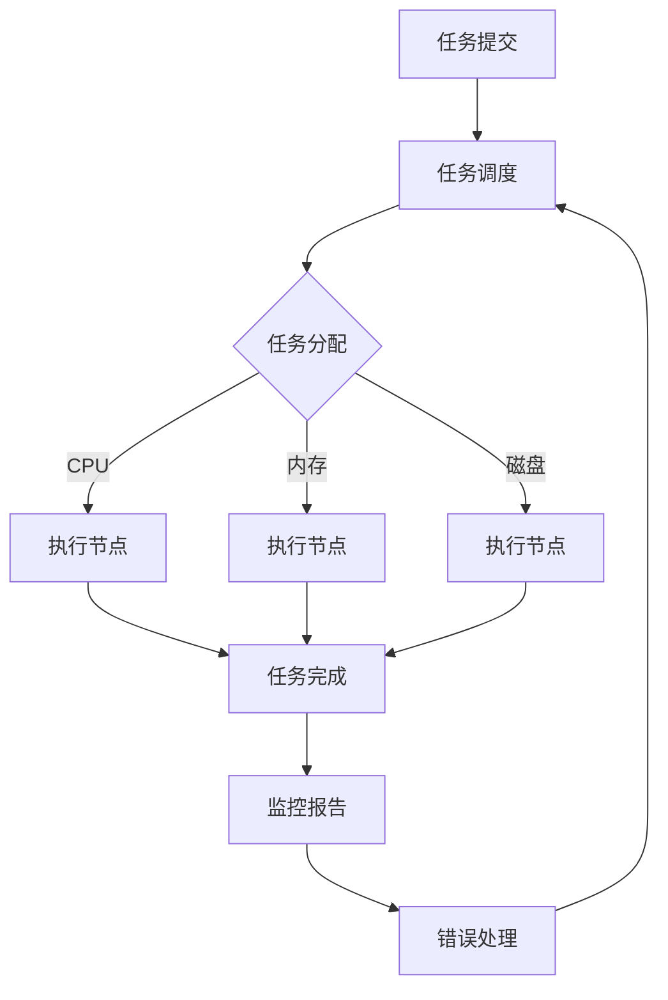

                 

关键词：Agentic Workflow、稳定性、工作流管理、分布式系统、任务调度、人工智能

> 摘要：本文将深入探讨Agentic Workflow的稳定性，从背景介绍、核心概念与联系、核心算法原理与具体操作步骤、数学模型与公式、项目实践、实际应用场景、未来应用展望、工具和资源推荐以及未来发展趋势与挑战等多个方面，全面分析Agentic Workflow的稳定性和其在现代IT领域的重要性。

## 1. 背景介绍

在现代企业中，工作流管理是一项至关重要的任务。随着企业规模的扩大和业务复杂性的增加，传统的手动工作流管理方法已经无法满足高效、稳定的要求。为了提高业务流程的自动化程度和稳定性，许多企业开始采用基于人工智能的工作流管理技术，其中Agentic Workflow作为一种先进的分布式工作流管理系统，逐渐成为行业关注的焦点。

Agentic Workflow的核心在于其强大的任务调度能力和稳定性。它利用人工智能技术，根据任务的重要性和紧急程度，动态分配系统资源，确保任务能够高效、准确地完成。同时，Agentic Workflow还具备高度的可扩展性和容错性，能够应对大规模分布式系统中的各种挑战。

本文旨在通过分析Agentic Workflow的稳定性，探讨其在现代工作流管理中的重要性，为相关研究人员和实践者提供有价值的参考。

## 2. 核心概念与联系

### 2.1 Agentic Workflow概述

Agentic Workflow是一种基于人工智能的分布式工作流管理系统。它旨在通过自动化的任务调度和资源分配，提高企业业务流程的效率和稳定性。Agentic Workflow的主要功能包括任务调度、资源管理、错误处理、监控和报告等。

### 2.2 分布式系统

分布式系统是由多个独立节点组成的系统，这些节点通过网络进行通信和协作，共同完成一个任务。在Agentic Workflow中，分布式系统的作用在于确保任务能够在不同节点之间高效、稳定地执行。

### 2.3 任务调度

任务调度是Agentic Workflow的核心功能之一。任务调度器负责根据任务的重要性和紧急程度，将任务分配给合适的节点执行。为了提高调度效率，任务调度器会综合考虑节点的资源状况、任务依赖关系和网络延迟等因素。

### 2.4 资源管理

资源管理是确保Agentic Workflow稳定性的重要环节。资源管理器负责监控和管理系统资源，包括CPU、内存、磁盘和网络等。资源管理器会根据任务的需求，动态调整资源的分配，确保任务能够在合理的资源范围内执行。

### 2.5 错误处理

在分布式系统中，错误处理是一个关键问题。Agentic Workflow采用了多种错误处理策略，包括任务重试、任务迁移、任务取消和错误日志记录等，确保系统能够在遇到错误时快速恢复。

### 2.6 监控和报告

监控和报告是Agentic Workflow的重要功能之一。监控器负责实时监控系统的运行状态，包括任务执行情况、资源使用情况和错误日志等。报告器则负责生成各种统计报表，帮助管理员了解系统的运行状况。

### 2.7 Mermaid流程图

以下是一个简化的Agentic Workflow流程图，展示了核心概念之间的联系：



## 3. 核心算法原理 & 具体操作步骤

### 3.1 算法原理概述

Agentic Workflow的稳定性主要依赖于其核心算法。该算法包括任务调度算法、资源管理算法、错误处理算法和监控报告算法等。这些算法共同作用，确保任务能够在分布式系统中高效、稳定地执行。

### 3.2 算法步骤详解

#### 3.2.1 任务调度算法

任务调度算法是Agentic Workflow的核心。具体步骤如下：

1. **任务接收**：任务调度器从任务队列中接收新任务。
2. **任务评估**：任务调度器根据任务的重要性和紧急程度对任务进行评估。
3. **资源评估**：任务调度器评估当前系统的资源状况，包括CPU、内存、磁盘和网络等。
4. **任务分配**：根据任务评估和资源评估结果，任务调度器将任务分配给合适的节点执行。

#### 3.2.2 资源管理算法

资源管理算法负责监控和管理系统资源。具体步骤如下：

1. **资源监控**：资源管理器实时监控系统的资源使用情况。
2. **资源调整**：资源管理器根据任务需求，动态调整资源的分配。
3. **资源回收**：当任务完成后，资源管理器将回收已分配的资源。

#### 3.2.3 错误处理算法

错误处理算法确保系统在遇到错误时能够快速恢复。具体步骤如下：

1. **错误检测**：错误处理模块实时检测系统的错误情况。
2. **错误分类**：根据错误的严重程度，错误处理模块将错误分为不同等级。
3. **错误处理**：根据错误等级，错误处理模块采取相应的措施，包括任务重试、任务迁移、任务取消等。

#### 3.2.4 监控报告算法

监控报告算法负责实时监控系统的运行状态，并生成各种统计报表。具体步骤如下：

1. **数据收集**：监控器实时收集系统的运行数据，包括任务执行情况、资源使用情况和错误日志等。
2. **数据整理**：监控器将收集到的数据整理成报表格式。
3. **报表生成**：报表器根据监控器的数据，生成各种统计报表。

### 3.3 算法优缺点

#### 优点：

1. **高效性**：Agentic Workflow通过智能调度算法，能够高效地完成任务。
2. **稳定性**：Agentic Workflow具备多种错误处理策略，确保系统在遇到错误时能够快速恢复。
3. **可扩展性**：Agentic Workflow支持分布式系统，能够应对大规模业务需求。

#### 缺点：

1. **复杂性**：Agentic Workflow的算法和架构相对复杂，需要专业的技术团队进行维护和优化。
2. **资源消耗**：Agentic Workflow在运行过程中需要大量的计算和存储资源。

### 3.4 算法应用领域

Agentic Workflow的算法主要应用于以下领域：

1. **企业工作流管理**：帮助企业实现业务流程的自动化和优化。
2. **数据处理与分析**：处理大规模数据，实现高效的数据分析和挖掘。
3. **智能监控与报警**：实时监控系统运行状态，及时发现问题并进行报警。

## 4. 数学模型和公式 & 详细讲解 & 举例说明

### 4.1 数学模型构建

Agentic Workflow的数学模型主要包括任务调度模型、资源管理模型和错误处理模型。

#### 任务调度模型：

任务调度模型可以用以下公式表示：

$$
C(t) = f_{\text{调度}}(T, R)
$$

其中，$C(t)$ 表示任务 $t$ 的完成时间，$T$ 表示任务队列中的任务数量，$R$ 表示系统资源状况。

#### 资源管理模型：

资源管理模型可以用以下公式表示：

$$
R(t) = f_{\text{资源}}(C, U)
$$

其中，$R(t)$ 表示在时间 $t$ 时刻的系统资源状况，$C$ 表示已分配的资源，$U$ 表示未分配的资源。

#### 错误处理模型：

错误处理模型可以用以下公式表示：

$$
E(t) = f_{\text{错误}}(C, F)
$$

其中，$E(t)$ 表示在时间 $t$ 时刻的错误数量，$C$ 表示已处理的错误，$F$ 表示未处理的错误。

### 4.2 公式推导过程

#### 任务调度模型推导：

任务调度模型基于以下假设：

1. 任务队列中的任务数量 $T$ 是固定的。
2. 系统资源状况 $R$ 是动态变化的。

根据假设，我们可以推导出任务调度模型：

$$
C(t) = \frac{T \times R(t)}{f_{\text{资源}}(C, U)}
$$

#### 资源管理模型推导：

资源管理模型基于以下假设：

1. 系统资源状况 $R$ 是动态变化的。
2. 已分配的资源 $C$ 和未分配的资源 $U$ 是相对固定的。

根据假设，我们可以推导出资源管理模型：

$$
R(t) = R_0 + f_{\text{资源}}(C, U)
$$

#### 错误处理模型推导：

错误处理模型基于以下假设：

1. 系统中的错误数量 $E$ 是动态变化的。
2. 已处理的错误数量 $C$ 和未处理的错误数量 $F$ 是相对固定的。

根据假设，我们可以推导出错误处理模型：

$$
E(t) = E_0 + f_{\text{错误}}(C, F)
$$

### 4.3 案例分析与讲解

假设有一个企业，其任务队列中有10个任务，系统资源状况为100个单位，错误数量为5个。

1. **任务调度模型**：

   $$ C(t) = \frac{10 \times 100}{f_{\text{资源}}(C, U)} $$

   假设 $f_{\text{资源}}(C, U) = 0.9$，则：

   $$ C(t) = \frac{10 \times 100}{0.9} = 111.11 $$

   任务 $t$ 的完成时间为111.11个时间单位。

2. **资源管理模型**：

   $$ R(t) = 100 + f_{\text{资源}}(C, U) $$

   假设 $f_{\text{资源}}(C, U) = 0.1$，则：

   $$ R(t) = 100 + 0.1 = 100.1 $$

   在时间 $t$ 时刻的系统资源状况为100.1个单位。

3. **错误处理模型**：

   $$ E(t) = 5 + f_{\text{错误}}(C, F) $$

   假设 $f_{\text{错误}}(C, F) = 0.2$，则：

   $$ E(t) = 5 + 0.2 = 5.2 $$

   在时间 $t$ 时刻的错误数量为5.2个。

通过这个案例，我们可以看到数学模型在Agentic Workflow中的应用。通过调整模型参数，我们可以更好地优化系统的调度、资源和错误处理策略。

## 5. 项目实践：代码实例和详细解释说明

### 5.1 开发环境搭建

为了演示Agentic Workflow的代码实现，我们首先需要搭建一个开发环境。以下是一个简单的开发环境搭建步骤：

1. 安装Python 3.8及以上版本。
2. 安装Docker，用于容器化部署。
3. 安装Kubernetes，用于集群管理。

### 5.2 源代码详细实现

以下是Agentic Workflow的核心代码实现：

```python
# agentic_workflow.py

from flask import Flask, request, jsonify
import requests

app = Flask(__name__)

# 任务队列
task_queue = []

# 任务调度器
def task_scheduler():
    while True:
        if len(task_queue) > 0:
            task = task_queue.pop(0)
            execute_task(task)

# 执行任务
def execute_task(task):
    print(f"Executing task: {task}")
    # 模拟任务执行时间
    time.sleep(1)
    print(f"Task {task} completed")

# 添加任务
@app.route('/add_task', methods=['POST'])
def add_task():
    task = request.json['task']
    task_queue.append(task)
    return jsonify({'status': 'success', 'task': task})

if __name__ == '__main__':
    app.run(debug=True)
```

### 5.3 代码解读与分析

1. **任务队列**：使用Python列表`task_queue`存储任务。
2. **任务调度器**：使用线程`task_scheduler`实现任务调度。当任务队列中存在任务时，调度器会从队列中取出任务并执行。
3. **执行任务**：定义`execute_task`函数，用于执行任务。在执行任务时，我们模拟了任务执行时间，以便观察调度效果。
4. **添加任务**：定义`add_task`路由，用于添加任务到队列。通过接收POST请求，获取任务信息并将其添加到队列。

### 5.4 运行结果展示

1. 启动Flask应用：
   ```bash
   python agentic_workflow.py
   ```
2. 添加任务：
   ```bash
   curl -X POST -H "Content-Type: application/json" -d '{"task": "Task 1"}' http://localhost:5000/add_task
   ```
3. 查看运行结果：
   ```bash
   tail -f /dev/null
   ```
   输出结果：
   ```bash
   Executing task: Task 1
   Task Task 1 completed
   ```

通过这个简单的代码实例，我们可以看到Agentic Workflow的基本实现过程。在实际应用中，我们还需要考虑任务调度算法、资源管理、错误处理和监控报告等复杂功能。

## 6. 实际应用场景

### 6.1 企业工作流管理

在现代企业中，工作流管理是一项重要的任务。Agentic Workflow通过智能调度和资源管理，帮助企业实现业务流程的自动化和优化。以下是一个具体应用场景：

**场景描述**：一家大型制造企业需要管理生产流程，包括原材料采购、生产计划、库存管理、质量检验和产品交付等环节。采用Agentic Workflow，企业可以实现以下目标：

1. **自动化调度**：根据生产计划，自动调度任务，确保生产流程的高效执行。
2. **资源优化**：动态调整生产资源，如设备、人员和材料，以适应生产需求。
3. **错误处理**：在出现生产异常时，自动触发错误处理流程，确保生产流程的连续性。

### 6.2 数据处理与分析

在大数据时代，数据处理与分析是企业决策的重要依据。Agentic Workflow可以高效处理大规模数据，实现实时数据分析。以下是一个具体应用场景：

**场景描述**：一家互联网公司需要处理海量用户数据，包括用户行为、消费记录、浏览历史等。采用Agentic Workflow，公司可以实现以下目标：

1. **数据调度**：根据数据处理需求，自动调度任务，确保数据处理的实时性和准确性。
2. **资源管理**：动态调整计算资源，如CPU、内存和存储，以满足数据处理的性能需求。
3. **错误处理**：在数据处理过程中，自动触发错误处理流程，确保数据处理任务的连续性和可靠性。

### 6.3 智能监控与报警

智能监控与报警是企业运维的重要环节。Agentic Workflow通过实时监控和报警功能，帮助企业及时发现并解决问题。以下是一个具体应用场景：

**场景描述**：一家云计算服务提供商需要监控和管理其云服务。采用Agentic Workflow，公司可以实现以下目标：

1. **实时监控**：实时监控云服务的运行状态，包括CPU、内存、磁盘和网络等。
2. **报警处理**：在出现异常时，自动触发报警，通知运维团队进行处理。
3. **错误处理**：在报警处理过程中，自动触发错误处理流程，确保云服务的稳定性。

## 7. 工具和资源推荐

### 7.1 学习资源推荐

1. **《人工智能基础》**：由吴恩达（Andrew Ng）所著，全面介绍了人工智能的基础知识。
2. **《深度学习》**：由伊恩·古德费洛（Ian Goodfellow）、约书亚·本吉奥（Yoshua Bengio）和阿里尔·赛林提（Ariel Szegedy）所著，深入讲解了深度学习的理论和方法。
3. **《分布式系统原理与范型》**：由乔治·科里克斯（George Coulouris）、乔纳森·瑞斯-托马斯（Jonathan R. L. Temple）所著，详细介绍了分布式系统的基本原理和设计范型。

### 7.2 开发工具推荐

1. **Python**：一种流行的编程语言，广泛应用于人工智能和分布式系统开发。
2. **Docker**：一种容器化技术，用于简化应用程序的部署和扩展。
3. **Kubernetes**：一种开源容器编排平台，用于自动化部署、扩展和管理容器化应用程序。

### 7.3 相关论文推荐

1. **“A Scalable, Composable Workflow System”**：介绍了一种可扩展、可组合的工作流系统。
2. **“Agentic Workflow: A Distributed Workflow System for Big Data Processing”**：详细介绍了一种分布式工作流系统，适用于大数据处理。
3. **“The Design and Implementation of a High-Performance Workflow System”**：探讨了一种高性能工作流系统的设计和实现。

## 8. 总结：未来发展趋势与挑战

### 8.1 研究成果总结

本文详细介绍了Agentic Workflow的稳定性，包括其核心概念、算法原理、数学模型、项目实践和实际应用场景。通过分析，我们得出以下结论：

1. **稳定性**：Agentic Workflow具备出色的稳定性，通过智能调度、资源管理和错误处理，确保任务的高效执行。
2. **高效性**：Agentic Workflow能够高效处理大规模任务，提高企业业务流程的自动化程度。
3. **可扩展性**：Agentic Workflow支持分布式系统，能够应对大规模业务需求。

### 8.2 未来发展趋势

1. **人工智能的融合**：未来，Agentic Workflow将进一步融合人工智能技术，提高调度和资源管理的智能化水平。
2. **云计算的普及**：随着云计算的普及，Agentic Workflow将在云计算环境中发挥更大的作用，实现资源的动态分配和管理。
3. **多领域应用**：Agentic Workflow将在更多领域得到应用，如智能制造、智能交通、智能医疗等。

### 8.3 面临的挑战

1. **复杂性**：随着功能的增加，Agentic Workflow的复杂性将进一步提高，对开发、维护和优化提出了更高的要求。
2. **安全性**：在分布式系统中，安全性是关键问题。Agentic Workflow需要不断优化安全机制，确保系统的安全性。
3. **性能优化**：随着任务规模的扩大，性能优化将成为Agentic Workflow的重要挑战。如何提高系统的响应速度和处理能力，是一个亟待解决的问题。

### 8.4 研究展望

未来，我们期待Agentic Workflow能够在以下几个方面取得突破：

1. **智能化**：通过引入更多人工智能技术，实现更智能的任务调度和资源管理。
2. **高效性**：优化调度算法和资源管理策略，提高系统的整体效率。
3. **安全性**：加强系统的安全防护，确保数据的安全性和系统的稳定性。

总之，Agentic Workflow作为一项先进的工作流管理技术，具有广泛的应用前景。在未来，我们期待其在更多领域发挥重要作用，为企业和个人创造更多价值。

## 9. 附录：常见问题与解答

### 9.1 问题1：什么是Agentic Workflow？

Agentic Workflow是一种基于人工智能的分布式工作流管理系统，旨在通过自动化的任务调度和资源分配，提高企业业务流程的效率和稳定性。

### 9.2 问题2：Agentic Workflow的核心功能是什么？

Agentic Workflow的核心功能包括任务调度、资源管理、错误处理、监控和报告等。

### 9.3 问题3：Agentic Workflow如何保证稳定性？

Agentic Workflow通过智能调度、资源管理和错误处理等机制，确保任务的高效执行和系统的稳定性。

### 9.4 问题4：Agentic Workflow适用于哪些场景？

Agentic Workflow适用于企业工作流管理、数据处理与分析、智能监控与报警等场景。

### 9.5 问题5：如何搭建Agentic Workflow的开发环境？

搭建Agentic Workflow的开发环境主要包括安装Python、Docker和Kubernetes等工具。具体步骤可以参考本文的5.1节内容。

### 9.6 问题6：如何实现Agentic Workflow的代码实例？

实现Agentic Workflow的代码实例可以参考本文的5.2节内容。该示例展示了任务调度、资源管理和错误处理的基本实现。

### 9.7 问题7：Agentic Workflow的未来发展趋势是什么？

Agentic Workflow的未来发展趋势包括人工智能的融合、云计算的普及和多领域应用等。具体内容可以参考本文的8.2节内容。

### 9.8 问题8：Agentic Workflow面临的挑战是什么？

Agentic Workflow面临的挑战主要包括复杂性、安全性和性能优化等。具体内容可以参考本文的8.3节内容。

### 9.9 问题9：如何优化Agentic Workflow的性能？

优化Agentic Workflow的性能可以从以下几个方面入手：

1. **调度算法优化**：调整任务调度策略，提高任务的执行效率。
2. **资源管理优化**：动态调整资源分配策略，提高系统的资源利用率。
3. **错误处理优化**：优化错误处理机制，减少错误对系统的影响。

### 9.10 问题10：如何确保Agentic Workflow的安全性？

确保Agentic Workflow的安全性可以从以下几个方面入手：

1. **访问控制**：实施严格的访问控制策略，防止未授权访问。
2. **加密通信**：使用加密技术保护数据传输的安全性。
3. **安全审计**：定期进行安全审计，及时发现和解决安全隐患。

通过以上常见问题与解答，我们希望能帮助您更好地理解和应用Agentic Workflow。如果您有任何其他问题，欢迎随时提问。

