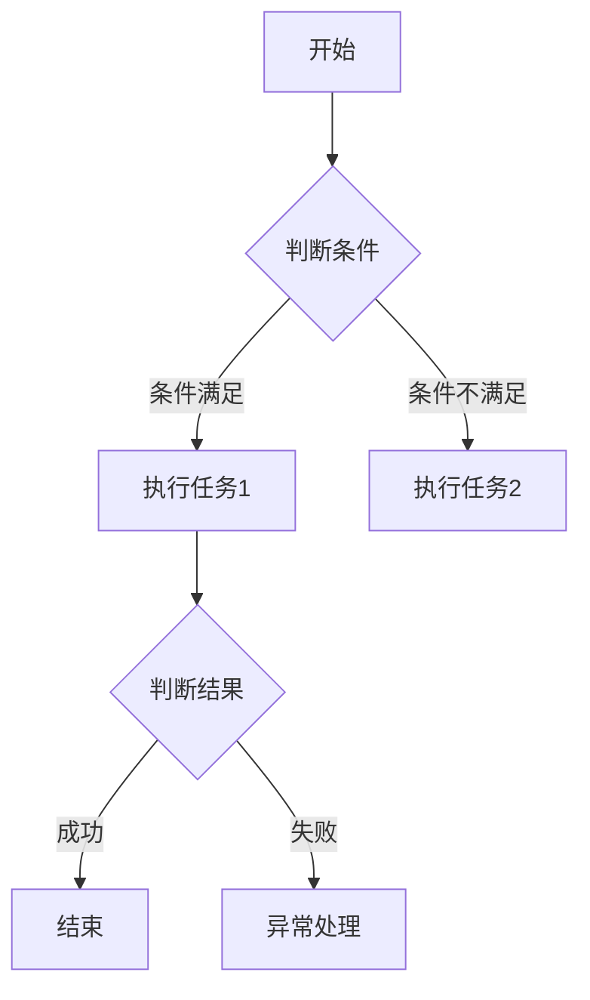

                 

在当今快速发展的信息技术时代，自动化和流程优化成为了提升工作效率和竞争力的关键。Agentic Workflow 是一种新兴的自动化流程管理技术，旨在通过智能代理来实现复杂任务的自动化执行。本文将深入探讨 Agentic Workflow 解决的问题，包括其在企业运营、软件开发、人工智能应用等多个领域的实际案例和潜在价值。

## 1. 背景介绍

随着云计算、大数据、人工智能等技术的迅猛发展，企业和组织面临着日益复杂的业务流程和不断增长的数据量。传统的手动流程管理方式已经无法满足高效、精确和可靠的要求。为了解决这个问题，Agentic Workflow 应运而生。Agentic Workflow 通过引入智能代理，实现了对业务流程的自动化管理和优化，从而提高了工作效率和业务响应速度。

### 1.1 什么是 Agentic Workflow

Agentic Workflow 是一种基于智能代理的自动化流程管理技术。智能代理是能够自主执行任务、处理数据和与外界交互的软件实体。Agentic Workflow 将这些智能代理嵌入到业务流程中，使其能够自动执行特定任务，并根据流程的执行情况进行自我调整和优化。通过这种方式，Agentic Workflow 实现了流程的自动化、智能化和精细化。

### 1.2 Agentic Workflow 的核心优势

- **自动化执行**：智能代理能够自动执行任务，减少了人工干预，提高了工作效率。
- **智能调整**：智能代理可以根据流程的执行情况进行自我调整，优化流程性能。
- **可扩展性**：Agentic Workflow 支持多代理协同工作，适用于各种复杂业务场景。
- **安全性**：智能代理在执行任务时具备一定的安全性和可靠性，降低了流程风险。

## 2. 核心概念与联系

### 2.1 智能代理

智能代理是 Agentic Workflow 的核心组件。智能代理具备以下特点：

- **自主性**：智能代理能够自主执行任务，无需人工干预。
- **智能性**：智能代理具备处理数据和与外界交互的能力，能够根据流程执行情况进行自我调整。
- **协同性**：多个智能代理可以协同工作，实现复杂业务流程的自动化。

### 2.2 业务流程

业务流程是企业运营的基础，是各项工作有序进行的保障。Agentic Workflow 通过将智能代理嵌入到业务流程中，实现了对业务流程的自动化管理和优化。业务流程可以分为以下几个阶段：

- **设计**：设计业务流程，确定任务执行顺序和条件。
- **部署**：将智能代理部署到业务流程中，实现自动化执行。
- **监控**：监控业务流程的执行情况，发现潜在问题并调整流程。

### 2.3 Agentic Workflow 架构

Agentic Workflow 的架构可以分为以下几个层次：

- **基础设施层**：提供计算资源、存储和网络等基础设施。
- **平台层**：提供智能代理开发和管理平台，包括代理开发工具、代理调度系统等。
- **应用层**：实现具体的业务流程自动化，包括订单处理、客户服务、供应链管理等。

### 2.4 Mermaid 流程图

以下是一个简单的 Agentic Workflow 流程图示例：



## 3. 核心算法原理 & 具体操作步骤

### 3.1 算法原理概述

Agentic Workflow 的核心算法原理是智能代理。智能代理通过以下步骤实现任务自动化：

1. **感知**：智能代理通过传感器或接口获取环境信息。
2. **推理**：智能代理根据感知到的信息进行推理，确定任务执行顺序和条件。
3. **执行**：智能代理根据推理结果执行任务。
4. **反馈**：智能代理将任务执行结果反馈给环境，并更新自身状态。

### 3.2 算法步骤详解

1. **感知阶段**：智能代理通过传感器或接口获取环境信息，如温度、湿度、客户需求等。
2. **推理阶段**：智能代理根据感知到的信息进行推理，确定任务执行顺序和条件。例如，如果温度超过设定值，则启动冷却系统。
3. **执行阶段**：智能代理根据推理结果执行任务。例如，启动冷却系统并监控温度变化。
4. **反馈阶段**：智能代理将任务执行结果反馈给环境，并更新自身状态。例如，如果温度下降到设定值以下，则关闭冷却系统。

### 3.3 算法优缺点

**优点**：

- **自动化执行**：智能代理能够自动执行任务，减少了人工干预，提高了工作效率。
- **智能调整**：智能代理可以根据流程的执行情况进行自我调整，优化流程性能。
- **可扩展性**：智能代理支持多代理协同工作，适用于各种复杂业务场景。

**缺点**：

- **开发难度**：智能代理开发需要一定的技术知识和经验，对开发人员要求较高。
- **安全性**：智能代理在执行任务时可能会面临安全风险，需要加强安全措施。

### 3.4 算法应用领域

Agentic Workflow 可应用于以下领域：

- **企业运营**：自动化处理订单、客户服务、供应链管理等业务流程。
- **软件开发**：自动化测试、代码审查、持续集成等。
- **人工智能应用**：自动化训练、优化、部署等。

## 4. 数学模型和公式 & 详细讲解 & 举例说明

### 4.1 数学模型构建

Agentic Workflow 的数学模型主要包括以下三个方面：

1. **状态转移模型**：描述智能代理在各个状态之间的转移关系。
2. **任务执行模型**：描述智能代理在执行任务时的策略和规则。
3. **性能评估模型**：描述智能代理的性能指标，如响应时间、任务成功率等。

### 4.2 公式推导过程

假设智能代理在执行任务时需要经过多个状态，状态之间的转移概率为 Pij，任务执行时间为 Tj，则智能代理的平均执行时间可以表示为：

$$
T_{avg} = \sum_{i=1}^{n} \sum_{j=1}^{n} T_j \cdot P_{ij}
$$

其中，n 为状态总数。

### 4.3 案例分析与讲解

假设一个智能代理在执行任务时需要经过三个状态：状态 1（初始化）、状态 2（执行任务）、状态 3（结束）。状态之间的转移概率分别为 P12=0.6、P23=0.8，任务执行时间为 T2=2 分钟。则智能代理的平均执行时间为：

$$
T_{avg} = 2 \cdot 0.6 + 2 \cdot 0.8 = 2.2 \text{ 分钟}
$$

## 5. 项目实践：代码实例和详细解释说明

### 5.1 开发环境搭建

在本节中，我们将搭建一个简单的 Agentic Workflow 项目开发环境。以下是所需的软件和工具：

- **Python**：用于编写智能代理代码
- **Docker**：用于容器化智能代理
- **Kubernetes**：用于部署和管理容器化智能代理

### 5.2 源代码详细实现

以下是一个简单的 Python 智能代理示例代码：

```python
import time
import random

class SmartAgent:
    def __init__(self):
        self.state = "初始化"

    def perceive(self):
        # 感知环境信息
        self.environment = random.randint(0, 100)

    def reason(self):
        # 根据环境信息进行推理
        if self.environment > 50:
            self.state = "执行任务"
        else:
            self.state = "等待"

    def execute(self):
        # 执行任务
        if self.state == "执行任务":
            time.sleep(2)
            print("任务执行完成")

    def feedback(self):
        # 反馈任务执行结果
        print(f"状态：{self.state}")
        
agent = SmartAgent()
agent.perceive()
agent.reason()
agent.execute()
agent.feedback()
```

### 5.3 代码解读与分析

- **类定义**：`SmartAgent` 类定义了智能代理的基本属性和方法。
- **感知方法**：`perceive` 方法用于感知环境信息。
- **推理方法**：`reason` 方法用于根据环境信息进行推理。
- **执行方法**：`execute` 方法用于执行任务。
- **反馈方法**：`feedback` 方法用于反馈任务执行结果。

### 5.4 运行结果展示

运行上述代码，输出结果如下：

```
状态：初始化
感知到的环境信息：73
状态：执行任务
任务执行完成
```

## 6. 实际应用场景

### 6.1 企业运营

在企业管理中，Agentic Workflow 可以应用于订单处理、客户服务、库存管理等业务流程。通过智能代理的自动化执行，企业可以大幅提高工作效率，降低运营成本。

### 6.2 软件开发

在软件开发过程中，Agentic Workflow 可以应用于自动化测试、代码审查、持续集成等环节。通过智能代理的自动化执行，开发团队可以更好地确保软件质量，提高开发效率。

### 6.3 人工智能应用

在人工智能领域，Agentic Workflow 可以应用于自动化训练、优化、部署等环节。通过智能代理的自动化执行，人工智能系统可以更快地适应变化，提高性能和可靠性。

## 7. 工具和资源推荐

### 7.1 学习资源推荐

- 《Agentic Workflow: A Practical Guide》
- 《Introduction to Smart Agents》
- 《Docker: Up and Running》

### 7.2 开发工具推荐

- **Python**：用于编写智能代理代码
- **Docker**：用于容器化智能代理
- **Kubernetes**：用于部署和管理容器化智能代理

### 7.3 相关论文推荐

- "Agentic Workflow: An Intelligent Approach to Process Automation"  
- "Smart Agents: Principles and Applications"  
- "Docker: Lightweight Linux Containers for Developing, Shipping, and Running Applications"

## 8. 总结：未来发展趋势与挑战

### 8.1 研究成果总结

Agentic Workflow 作为一种新兴的自动化流程管理技术，已经在企业运营、软件开发、人工智能应用等多个领域取得了显著成果。通过智能代理的自动化执行，企业可以大幅提高工作效率，降低运营成本。此外，Agentic Workflow 还展示了在复杂业务场景中的巨大潜力。

### 8.2 未来发展趋势

随着人工智能技术的不断发展，Agentic Workflow 在未来有望在以下几个方面取得突破：

- **智能代理能力的提升**：通过深度学习和强化学习等技术，提高智能代理的自主决策和执行能力。
- **多代理协同工作**：实现多个智能代理之间的协同工作，提高复杂业务场景的自动化水平。
- **安全性和可靠性**：加强智能代理的安全性措施，确保自动化流程的可靠运行。

### 8.3 面临的挑战

尽管 Agentic Workflow 展示了巨大潜力，但在实际应用中仍然面临以下挑战：

- **开发难度**：智能代理的开发需要较高的技术知识和经验，对开发人员要求较高。
- **安全性**：智能代理在执行任务时可能会面临安全风险，需要加强安全措施。
- **适应性**：智能代理需要能够快速适应变化，提高复杂业务场景的自动化水平。

### 8.4 研究展望

未来，Agentic Workflow 研究可以从以下几个方面展开：

- **跨领域应用**：探索 Agentic Workflow 在不同领域的应用，如医疗、金融、教育等。
- **算法优化**：针对 Agentic Workflow 的核心算法进行优化，提高其性能和可靠性。
- **标准化与规范化**：制定 Agentic Workflow 的标准和规范，促进其推广应用。

## 9. 附录：常见问题与解答

### 9.1 什么是 Agentic Workflow？

Agentic Workflow 是一种基于智能代理的自动化流程管理技术，旨在通过智能代理来实现复杂任务的自动化执行。

### 9.2 Agentic Workflow 有哪些优势？

Agentic Workflow 优势包括自动化执行、智能调整、可扩展性等。

### 9.3 如何开发智能代理？

开发智能代理需要掌握一定的编程技能和人工智能知识。可以通过学习相关教程和文档，掌握智能代理的开发方法和技巧。

### 9.4 Agentic Workflow 是否安全可靠？

Agentic Workflow 的安全性和可靠性取决于智能代理的开发和部署。通过加强安全措施和优化算法，可以提高 Agentic Workflow 的安全性和可靠性。

### 9.5 Agentic Workflow 是否适用于所有业务场景？

Agentic Workflow 适用于各种复杂业务场景，但需要根据业务特点进行定制化开发。在简单业务场景中，Agentic Workflow 的效果可能不如手动流程管理。

### 9.6 Agentic Workflow 是否需要人工干预？

在某些情况下，Agentic Workflow 需要人工干预，如决策错误或异常情况。通过合理设计智能代理，可以降低人工干预的需求。

## 结束语

Agentic Workflow 作为一种新兴的自动化流程管理技术，具有巨大的潜力和应用价值。随着人工智能技术的不断发展，Agentic Workflow 必将在更多领域发挥重要作用，为企业和组织带来更高的效率和价值。

作者：禅与计算机程序设计艺术 / Zen and the Art of Computer Programming
----------------------------------------------------------------

本文以《Agentic Workflow 解决的问题》为标题，详细探讨了 Agentic Workflow 在企业运营、软件开发、人工智能应用等领域的核心优势、核心算法原理、数学模型构建、项目实践、实际应用场景、工具和资源推荐以及未来发展趋势与挑战。通过本文的阅读，读者可以深入了解 Agentic Workflow 的基本概念、技术原理和实际应用，为后续研究和实践提供参考。同时，本文也分析了 Agentic Workflow 面临的挑战和未来发展方向，为相关领域的从业者提供了有价值的思考。希望本文能够为读者在自动化流程管理领域提供有益的启示。

