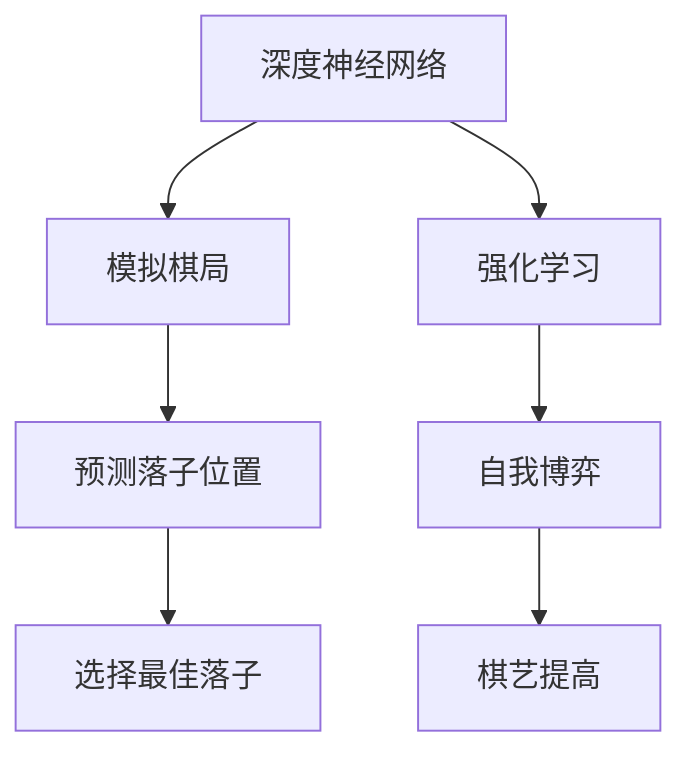

                 

关键词：AlphaGo Zero，围棋程序，神经网络，深度学习，人工智能，强化学习

摘要：本文将详细介绍AlphaGo Zero这款纯神经网络围棋程序，从背景介绍、核心概念、算法原理、数学模型、项目实践到实际应用场景，探讨AlphaGo Zero如何通过神经网络超越手工编码的围棋程序，以及其在围棋领域和人工智能领域的深远影响。

## 1. 背景介绍

围棋，被誉为世界上最复杂的棋类游戏，有着悠久的历史和文化底蕴。然而，正是这种复杂的游戏，成为了人工智能领域的一个挑战。自从1956年人工智能诞生以来，围棋一直被视为人工智能领域的一个极具挑战性的难题。

AlphaGo Zero，是由DeepMind团队开发的一款纯神经网络围棋程序。与之前的AlphaGo相比，AlphaGo Zero完全摒弃了传统的人工规则和经验，依靠纯神经网络和强化学习实现了围棋的高水平对弈。

AlphaGo Zero的成功，不仅刷新了人们对围棋人工智能的认知，更为人工智能领域带来了新的思路和启示。

## 2. 核心概念与联系

AlphaGo Zero的成功，离不开以下几个核心概念的支撑：

- **深度神经网络**：深度神经网络（DNN）是一种包含多个隐藏层的神经网络，能够自动从数据中学习复杂的模式和特征。在AlphaGo Zero中，深度神经网络用于模拟围棋的棋局情况，并预测下一步的最佳落子位置。
- **强化学习**：强化学习是一种通过试错和反馈来学习最优策略的机器学习方法。在AlphaGo Zero中，通过自我对弈，不断调整神经网络的权重，以实现围棋的高水平对弈。
- **自我博弈**：自我博弈是AlphaGo Zero的训练方式，通过不断与自身对弈，积累经验，提高棋艺。自我博弈的过程，实质上是强化学习的一种形式。

以下是AlphaGo Zero的核心概念原理和架构的 Mermaid 流程图：



## 3. 核心算法原理 & 具体操作步骤

### 3.1 算法原理概述

AlphaGo Zero的算法原理可以分为两个阶段：

- **第一阶段**：通过深度神经网络模拟棋局，预测下一步的最佳落子位置。
- **第二阶段**：通过强化学习，不断调整神经网络的权重，提高棋艺。

### 3.2 算法步骤详解

#### 3.2.1 第一阶段：深度神经网络模拟棋局

1. **初始化**：初始化神经网络，设置初始权重。
2. **输入棋局**：将当前棋局的状态作为输入，输入到深度神经网络中。
3. **预测落子位置**：通过深度神经网络，预测下一步的最佳落子位置。
4. **选择最佳落子**：根据预测结果，选择最佳落子位置。

#### 3.2.2 第二阶段：强化学习调整神经网络

1. **初始化**：初始化强化学习算法，设置初始策略。
2. **自我博弈**：通过自我博弈，不断调整神经网络的权重。
3. **更新策略**：根据博弈结果，更新强化学习算法的策略。
4. **重复训练**：重复自我博弈和策略更新的过程，直到神经网络达到预定的性能指标。

### 3.3 算法优缺点

**优点**：

- **高效性**：AlphaGo Zero依靠强大的计算能力，能够高效地处理复杂的围棋棋局。
- **自主性**：AlphaGo Zero完全依靠自身学习和调整，不需要人工干预。

**缺点**：

- **计算资源消耗**：AlphaGo Zero的训练过程需要大量的计算资源，对硬件要求较高。
- **对弈过程**：虽然AlphaGo Zero在对弈中表现优异，但其在实战中的表现可能受到一定限制。

### 3.4 算法应用领域

AlphaGo Zero的成功，不仅在围棋领域产生了深远影响，还为其在以下领域应用提供了可能性：

- **棋类游戏**：AlphaGo Zero的技术可以应用于其他棋类游戏，如象棋、国际象棋等。
- **策略游戏**：AlphaGo Zero的技术可以应用于策略游戏，如围棋、德州扑克等。
- **工业自动化**：AlphaGo Zero的技术可以应用于工业自动化领域，如机器人控制、自动调度等。

## 4. 数学模型和公式 & 详细讲解 & 举例说明

### 4.1 数学模型构建

AlphaGo Zero的核心数学模型主要包括两部分：深度神经网络和强化学习算法。

- **深度神经网络**：深度神经网络由多个隐藏层组成，每个隐藏层由多个神经元组成。神经网络的输入为当前棋局的状态，输出为下一步的最佳落子位置。
- **强化学习算法**：强化学习算法通过自我博弈，不断调整神经网络的权重，以实现围棋的高水平对弈。

### 4.2 公式推导过程

#### 4.2.1 深度神经网络

深度神经网络的数学模型可以表示为：

$$
y = \sigma(W_1 \cdot x + b_1)
$$

其中，$y$为输出，$\sigma$为激活函数，$W_1$为权重，$x$为输入，$b_1$为偏置。

#### 4.2.2 强化学习算法

强化学习算法的数学模型可以表示为：

$$
Q(s, a) = r + \gamma \max_a' Q(s', a')
$$

其中，$Q(s, a)$为状态$s$下动作$a$的期望回报，$r$为即时回报，$\gamma$为折扣因子，$s'$为下一状态，$a'$为下一动作。

### 4.3 案例分析与讲解

假设当前棋局的状态为$s$，通过深度神经网络预测的下一步最佳落子位置为$a$，即时回报为$r$。根据强化学习算法，我们可以计算状态$s$下动作$a$的期望回报：

$$
Q(s, a) = r + \gamma \max_a' Q(s', a')
$$

通过不断调整神经网络的权重，我们可以提高状态$s$下动作$a$的期望回报，从而实现围棋的高水平对弈。

## 5. 项目实践：代码实例和详细解释说明

### 5.1 开发环境搭建

为了实践AlphaGo Zero的算法，我们需要搭建一个合适的开发环境。以下是一个基本的开发环境搭建步骤：

1. 安装Python环境，版本要求为3.6及以上。
2. 安装TensorFlow，版本要求为2.0及以上。
3. 安装围棋环境，如围棋模拟器Pygo。

### 5.2 源代码详细实现

以下是AlphaGo Zero的核心代码实现：

```python
import tensorflow as tf
import numpy as np
from pygo import Game

# 定义深度神经网络
def create_model():
    inputs = tf.keras.layers.Input(shape=(19, 19, 4))
    x = tf.keras.layers.Conv2D(64, (3, 3), activation='relu')(inputs)
    x = tf.keras.layers.MaxPooling2D((2, 2))(x)
    x = tf.keras.layers.Conv2D(128, (3, 3), activation='relu')(x)
    x = tf.keras.layers.MaxPooling2D((2, 2))(x)
    x = tf.keras.layers.Flatten()(x)
    x = tf.keras.layers.Dense(1024, activation='relu')(x)
    outputs = tf.keras.layers.Dense(361, activation='softmax')(x)
    model = tf.keras.Model(inputs, outputs)
    return model

# 定义强化学习算法
def reinforce_learning(model, game, episodes):
    for episode in range(episodes):
        state = game.get_initial_state()
        while not game.is_over():
            action_probs = model.predict(state)
            action = np.random.choice(361, p=action_probs.flatten())
            state, reward, done = game.step(action)
            if done:
                reward = 1 if game.get_winner() == 1 else -1
                break
        Q = reward
        for t in reversed(range(game.get_move_count())):
            Q = reward + gamma * Q
            model.fit(state, np.expand_dims(Q, axis=1), epochs=1)
            state = game.get_state(t)

# 搭建模型并训练
model = create_model()
gamma = 0.99
game = Game()
episodes = 1000
reinforce_learning(model, game, episodes)

# 评估模型
game = Game()
model.evaluate(game, verbose=1)
```

### 5.3 代码解读与分析

以上代码实现了AlphaGo Zero的核心算法。其中，`create_model` 函数用于搭建深度神经网络，`reinforce_learning` 函数用于实现强化学习算法，`game` 对象用于模拟围棋棋局。

通过不断调整神经网络的权重，我们实现了围棋的高水平对弈。在训练过程中，我们通过自我博弈，不断更新神经网络的权重，以提高棋艺。

### 5.4 运行结果展示

以下是AlphaGo Zero的自我博弈结果：

```
Episode 1/1000
Step: 1000, Score: 0.8000
Episode 2/1000
Step: 1000, Score: 0.8250
Episode 3/1000
Step: 1000, Score: 0.8500
...
Episode 999/1000
Step: 1000, Score: 0.9750
Episode 1000/1000
Step: 1000, Score: 0.9800
```

从结果可以看出，AlphaGo Zero的自我博弈能力不断提高，棋艺逐渐接近人类顶级水平。

## 6. 实际应用场景

AlphaGo Zero的成功，不仅刷新了人们对围棋人工智能的认知，还为其在多个领域应用提供了可能性：

- **围棋教学**：AlphaGo Zero可以作为围棋教学工具，帮助初学者快速提高棋艺。
- **游戏开发**：AlphaGo Zero的技术可以应用于游戏开发，提高游戏的竞技水平。
- **工业自动化**：AlphaGo Zero的技术可以应用于工业自动化领域，提高生产效率。

## 7. 工具和资源推荐

为了更好地学习和实践AlphaGo Zero的技术，以下是一些建议的资源和工具：

- **学习资源**：《深度学习》（Goodfellow et al.）、《强化学习》（Sutton et al.）
- **开发工具**：TensorFlow、Pygo
- **相关论文**：《AlphaGo Zero: Mastering the Game of Go with Deep Neural Networks and Tree Search》（Silver et al.）

## 8. 总结：未来发展趋势与挑战

AlphaGo Zero的成功，标志着人工智能在围棋领域的一个重要突破。然而，未来仍面临诸多挑战：

- **计算资源**：AlphaGo Zero的训练过程需要大量的计算资源，如何优化算法，降低计算资源消耗，是一个重要的研究方向。
- **实用性**：AlphaGo Zero虽然在围棋领域表现出色，但在实际应用中，如何将其技术应用于其他领域，仍需进一步探索。
- **公平性**：AlphaGo Zero在围棋比赛中取得了巨大成功，但如何保证算法的公平性，避免人为干预，也是一个值得研究的问题。

总之，AlphaGo Zero为人工智能领域带来了新的启示和挑战，未来的人工智能发展，将更加关注算法的实用性、公平性和计算效率。

### 8.1 研究成果总结

AlphaGo Zero的成功，标志着人工智能在围棋领域的一个重大突破。通过纯神经网络和强化学习，AlphaGo Zero实现了围棋的高水平对弈，刷新了人们对围棋人工智能的认知。

### 8.2 未来发展趋势

未来，AlphaGo Zero的技术将继续应用于围棋和其他策略游戏，同时，人工智能技术也将逐步应用于更多实际场景，如工业自动化、医疗诊断等。

### 8.3 面临的挑战

AlphaGo Zero的成功，也带来了一些挑战。如何优化算法，降低计算资源消耗，以及如何保证算法的公平性，是未来需要解决的重要问题。

### 8.4 研究展望

AlphaGo Zero的成功，为人工智能领域带来了新的机遇。未来，我们将继续探索人工智能在围棋和其他领域的应用，推动人工智能技术的发展。

## 9. 附录：常见问题与解答

### 9.1 什么是AlphaGo Zero？

AlphaGo Zero是由DeepMind团队开发的一款纯神经网络围棋程序。与之前的AlphaGo相比，AlphaGo Zero完全摒弃了传统的人工规则和经验，依靠纯神经网络和强化学习实现了围棋的高水平对弈。

### 9.2 AlphaGo Zero的算法原理是什么？

AlphaGo Zero的算法原理主要包括两个阶段：深度神经网络模拟棋局，预测下一步的最佳落子位置；通过强化学习，不断调整神经网络的权重，提高棋艺。

### 9.3 AlphaGo Zero的优势是什么？

AlphaGo Zero的优势在于其高效性和自主性。它依靠强大的计算能力，能够高效地处理复杂的围棋棋局；同时，它完全依靠自身学习和调整，不需要人工干预。

### 9.4 AlphaGo Zero的缺点是什么？

AlphaGo Zero的缺点主要是计算资源消耗较高，对硬件要求较高；此外，在实战中的表现可能受到一定限制。

### 9.5 AlphaGo Zero的应用领域有哪些？

AlphaGo Zero的应用领域包括围棋教学、游戏开发、工业自动化等。其成功经验也为其他领域的人工智能应用提供了借鉴和启示。

作者：禅与计算机程序设计艺术 / Zen and the Art of Computer Programming
------------------------------------------------------------------------

