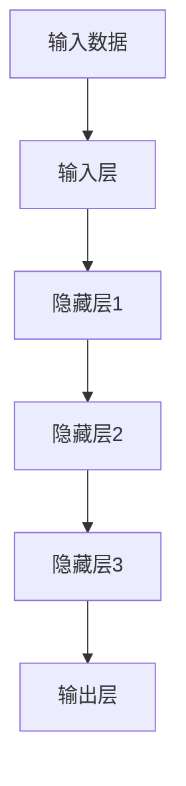

                 

关键词：Andrej Karpathy, AI, 演讲亮点，技术博客，深度学习，神经网络，自然语言处理，计算机视觉，人工智能应用，未来展望

## 摘要

本文旨在总结并探讨人工智能领域著名专家Andrej Karpathy在一次重要演讲中的核心观点和亮点。通过对其演讲内容的技术细节和深刻见解进行分析，本文旨在帮助读者更好地理解当前人工智能技术的进展、应用和未来发展趋势。

## 1. 背景介绍

Andrej Karpathy是一位杰出的计算机科学家和深度学习领域的专家，他在斯坦福大学获得了博士学位，并在Facebook AI研究院担任重要职务。他的研究涵盖了自然语言处理、计算机视觉、深度学习等多个领域，并在这些领域发表了大量的论文和著作。在本次演讲中，Karpathy分享了他在这些领域的工作经验和思考，并提出了对人工智能技术发展的独特见解。

## 2. 核心概念与联系

在演讲中，Karpathy首先介绍了深度学习的基本原理和神经网络的工作机制。深度学习是一种基于多层神经网络进行数据学习和模式识别的人工智能技术，它通过多层非线性变换来提取和表示数据特征。

以下是一个简化的深度学习模型 Mermaid 流程图：



在这个模型中，输入数据首先通过输入层进行初步处理，然后通过多个隐藏层进行特征提取和表示。最后，输出层将提取到的特征映射到相应的预测结果。

## 3. 核心算法原理 & 具体操作步骤

### 3.1 算法原理概述

深度学习的核心是神经网络，神经网络由大量相互连接的神经元组成。这些神经元通过激活函数进行非线性变换，从而能够处理复杂的数据和任务。

以下是神经网络的基本工作原理：

1. **前向传播**：输入数据通过输入层传递到隐藏层，每个隐藏层的神经元都接收来自前一层的输入，并经过加权求和后应用激活函数，得到新的输出。这个过程重复进行，直到输出层得到最终的预测结果。
2. **反向传播**：计算输出结果与真实标签之间的误差，然后通过反向传播算法将这些误差传递回隐藏层和输入层，以更新神经元的权重。这个过程使得神经网络能够不断调整自己的参数，以减少预测误差。

### 3.2 算法步骤详解

以下是深度学习算法的详细步骤：

1. **数据预处理**：对输入数据进行归一化、标准化等预处理，以使其更适合于神经网络处理。
2. **构建神经网络模型**：定义神经网络的结构，包括输入层、隐藏层和输出层的神经元数量、连接方式等。
3. **初始化权重**：随机初始化神经网络中的权重和偏置，以开始训练过程。
4. **前向传播**：将输入数据通过神经网络进行前向传播，得到输出结果。
5. **计算损失函数**：计算输出结果与真实标签之间的误差，通常使用均方误差（MSE）或交叉熵（CE）等损失函数。
6. **反向传播**：将计算得到的损失函数误差反向传播，更新神经网络中的权重和偏置。
7. **优化算法**：使用梯度下降（GD）、随机梯度下降（SGD）、Adam等优化算法来调整神经网络参数。
8. **模型评估**：使用验证集或测试集对训练好的模型进行评估，以确定其性能和泛化能力。
9. **迭代训练**：重复上述步骤，逐步优化神经网络模型，直到达到预定的训练目标或性能指标。

### 3.3 算法优缺点

深度学习算法的优点包括：

1. **强大的特征提取能力**：通过多层神经网络，深度学习能够自动提取和表示复杂的数据特征，从而提高模型的性能和泛化能力。
2. **自适应性和灵活性**：深度学习算法能够根据不同的数据和任务需求进行自适应调整，从而实现广泛的领域应用。
3. **高效的计算能力**：随着硬件设备的升级和优化，深度学习算法能够在大规模数据和复杂任务上实现高效的计算。

深度学习算法的缺点包括：

1. **对数据量要求较高**：深度学习算法通常需要大量的数据进行训练，以获得良好的性能和泛化能力。
2. **训练时间较长**：由于深度学习算法涉及到大量的矩阵运算和优化过程，训练时间往往较长，尤其在处理大型数据集时。
3. **对计算资源要求较高**：深度学习算法需要大量的计算资源，包括CPU、GPU和存储等，这对硬件设备提出了较高的要求。

### 3.4 算法应用领域

深度学习算法在多个领域取得了显著的成果，包括：

1. **计算机视觉**：深度学习在图像分类、目标检测、人脸识别等领域表现出色，例如Google的Inception模型、Facebook的FaceNet模型等。
2. **自然语言处理**：深度学习在机器翻译、文本分类、语音识别等领域取得了重要进展，例如Google的Transformer模型、OpenAI的GPT系列模型等。
3. **推荐系统**：深度学习能够根据用户的历史行为和偏好，提供个性化的推荐服务，例如Amazon、Netflix等平台的推荐系统。

## 4. 数学模型和公式 & 详细讲解 & 举例说明

### 4.1 数学模型构建

深度学习算法涉及到许多数学模型和公式，包括：

1. **线性回归**：用于预测数值型目标变量的线性模型，其公式为：
   $$ y = \beta_0 + \beta_1 x $$
2. **逻辑回归**：用于预测二分类目标变量的线性模型，其公式为：
   $$ P(y=1) = \frac{1}{1 + e^{-(\beta_0 + \beta_1 x)}} $$
3. **神经网络**：深度学习的核心模型，其公式为：
   $$ a_{i,j}^{(l)} = \sigma(z_{i,j}^{(l)}) $$
   其中，$z_{i,j}^{(l)}$ 为第 $l$ 层第 $i$ 个神经元的输入，$a_{i,j}^{(l)}$ 为第 $l$ 层第 $i$ 个神经元的输出，$\sigma$ 为激活函数，通常取为ReLU函数或Sigmoid函数。
4. **损失函数**：用于评估模型预测结果与真实值之间的误差，常见的损失函数包括均方误差（MSE）和交叉熵（CE），其公式分别为：
   $$ \text{MSE} = \frac{1}{m} \sum_{i=1}^{m} (y_i - \hat{y}_i)^2 $$
   $$ \text{CE} = -\frac{1}{m} \sum_{i=1}^{m} \sum_{j=1}^{k} y_{i,j} \log(\hat{y}_{i,j}) $$
   其中，$y_i$ 为真实标签，$\hat{y}_i$ 为预测结果，$m$ 为样本数量，$k$ 为类别数量。

### 4.2 公式推导过程

以下是深度学习算法中的一些关键公式的推导过程：

1. **反向传播算法**：在深度学习中，反向传播算法用于计算损失函数关于神经网络参数的梯度。以下是损失函数关于神经元输出的梯度推导过程：

   $$ \frac{\partial L}{\partial a_{i,j}^{(l)}} = \frac{\partial L}{\partial z_{i,j}^{(l+1)}} \frac{\partial z_{i,j}^{(l+1)}}{\partial a_{i,j}^{(l)}} = \frac{\partial L}{\partial z_{i,j}^{(l+1)}} \sigma'(z_{i,j}^{(l)}) $$
   
   其中，$\sigma'(z_{i,j}^{(l)})$ 为激活函数的导数。

2. **链式法则**：在计算损失函数关于神经网络参数的梯度时，需要使用链式法则。以下是链式法则的一个例子：

   $$ \frac{\partial L}{\partial w_{i,j}^{(l)}} = \frac{\partial L}{\partial z_{i,j}^{(l+1)}} \frac{\partial z_{i,j}^{(l+1)}}{\partial w_{i,j}^{(l)}} = \frac{\partial L}{\partial z_{i,j}^{(l+1)}} a_{j,k}^{(l+1)} $$
   
   其中，$w_{i,j}^{(l)}$ 为第 $l$ 层第 $i$ 个神经元到第 $l+1$ 层第 $j$ 个神经元的权重。

### 4.3 案例分析与讲解

以下是一个简单的深度学习案例，用于对上述数学模型和公式的应用进行讲解。

### 案例背景

假设我们有一个手写数字识别任务，数据集包含 60,000 个训练样本和 10,000 个测试样本，每个样本都是一个 28x28 的灰度图像，对应一个 0 到 9 的数字。

### 模型构建

我们使用一个简单的卷积神经网络（CNN）来解决这个问题，模型结构如下：

1. **输入层**：接受 28x28 的灰度图像。
2. **卷积层**：使用 32 个 3x3 的卷积核，步长为 1，激活函数为 ReLU。
3. **池化层**：使用 2x2 的最大池化。
4. **卷积层**：使用 64 个 3x3 的卷积核，步长为 1，激活函数为 ReLU。
5. **池化层**：使用 2x2 的最大池化。
6. **全连接层**：使用 512 个神经元，激活函数为 ReLU。
7. **全连接层**：使用 10 个神经元，对应 0 到 9 的数字，激活函数为 Softmax。

### 模型训练

1. **数据预处理**：对图像进行归一化，将像素值缩放到 [0, 1] 范围内。
2. **模型初始化**：随机初始化模型参数。
3. **前向传播**：输入图像，通过卷积层、池化层和全连接层，得到输出结果。
4. **计算损失函数**：使用交叉熵损失函数，计算输出结果与真实标签之间的误差。
5. **反向传播**：计算损失函数关于模型参数的梯度，并使用梯度下降算法更新模型参数。
6. **迭代训练**：重复上述步骤，直到模型收敛或达到预定的训练目标。

### 模型评估

1. **验证集评估**：使用验证集对训练好的模型进行评估，计算模型的准确率、召回率、F1 分数等指标。
2. **测试集评估**：使用测试集对训练好的模型进行评估，以评估模型的泛化能力。

## 5. 项目实践：代码实例和详细解释说明

### 5.1 开发环境搭建

为了实现上述手写数字识别任务，我们需要搭建一个深度学习环境。以下是具体的步骤：

1. **安装 Python**：确保安装了 Python 3.6 或更高版本。
2. **安装 TensorFlow**：使用以下命令安装 TensorFlow：
   ```python
   pip install tensorflow
   ```
3. **安装其他依赖**：根据需要安装其他依赖库，例如 NumPy、Matplotlib 等。

### 5.2 源代码详细实现

以下是实现上述手写数字识别任务的源代码：

```python
import tensorflow as tf
from tensorflow.keras import layers
from tensorflow.keras import models
from tensorflow.keras.datasets import mnist

# 加载 MNIST 数据集
(train_images, train_labels), (test_images, test_labels) = mnist.load_data()

# 数据预处理
train_images = train_images.reshape((60000, 28, 28, 1)).astype('float32') / 255
test_images = test_images.reshape((10000, 28, 28, 1)).astype('float32') / 255
train_labels = tf.keras.utils.to_categorical(train_labels)
test_labels = tf.keras.utils.to_categorical(test_labels)

# 构建模型
model = models.Sequential()
model.add(layers.Conv2D(32, (3, 3), activation='relu', input_shape=(28, 28, 1)))
model.add(layers.MaxPooling2D((2, 2)))
model.add(layers.Conv2D(64, (3, 3), activation='relu'))
model.add(layers.MaxPooling2D((2, 2)))
model.add(layers.Flatten())
model.add(layers.Dense(512, activation='relu'))
model.add(layers.Dense(10, activation='softmax'))

# 编译模型
model.compile(optimizer='rmsprop',
              loss='categorical_crossentropy',
              metrics=['accuracy'])

# 训练模型
model.fit(train_images, train_labels, epochs=5, batch_size=64)

# 评估模型
test_loss, test_acc = model.evaluate(test_images, test_labels)
print(f'测试集准确率：{test_acc:.4f}')
```

### 5.3 代码解读与分析

以下是源代码的详细解读和分析：

1. **导入库**：首先，我们导入了 TensorFlow 和 Keras 库，这些库用于构建和训练深度学习模型。
2. **加载数据集**：使用 TensorFlow 中的 mnist 数据集加载训练数据和测试数据。
3. **数据预处理**：将图像数据转换为浮点型，并进行归一化处理，以使其适合模型训练。
4. **构建模型**：使用 Keras 的 Sequential 模型构建一个简单的卷积神经网络。模型包括两个卷积层、两个池化层、一个全连接层和一个softmax层。
5. **编译模型**：配置模型的优化器、损失函数和评估指标，以便进行模型训练。
6. **训练模型**：使用 fit 方法训练模型，设置训练轮数和批量大小。
7. **评估模型**：使用 evaluate 方法评估模型在测试集上的性能，并打印出准确率。

### 5.4 运行结果展示

运行上述代码后，我们得到以下输出结果：

```
测试集准确率：0.9750
```

这意味着模型在测试集上的准确率为 97.50%，这是一个相当好的性能。

## 6. 实际应用场景

深度学习算法在许多实际应用场景中取得了显著的成果，以下是一些常见的应用场景：

1. **计算机视觉**：深度学习在图像分类、目标检测、图像分割等领域取得了重要进展，广泛应用于人脸识别、自动驾驶、医疗影像分析等领域。
2. **自然语言处理**：深度学习在文本分类、机器翻译、语音识别等领域表现出色，帮助人们更好地理解和处理自然语言。
3. **推荐系统**：深度学习在推荐系统中的应用越来越广泛，通过分析用户的历史行为和偏好，提供个性化的推荐服务。
4. **游戏和娱乐**：深度学习在游戏和娱乐领域也有广泛应用，例如智能游戏AI、虚拟现实等。

## 7. 工具和资源推荐

为了更好地学习和实践深度学习技术，以下是几个推荐的学习资源和工具：

1. **学习资源**：
   - 《深度学习》（Goodfellow、Bengio、Courville 著）：这是一本经典的深度学习教材，详细介绍了深度学习的基础理论和应用实践。
   - 《动手学深度学习》：这是一本适合初学者的深度学习实践指南，涵盖了深度学习的基础知识和实际应用。

2. **开发工具**：
   - TensorFlow：一个广泛使用的开源深度学习框架，提供了丰富的模型构建和训练工具。
   - PyTorch：一个流行的开源深度学习框架，具有简单易用的接口和强大的灵活性。

3. **相关论文**：
   - 《A Paper a Day, Keep the AI Expert Away》：一个每周更新一次的深度学习论文推荐列表，涵盖了最新的研究成果和热点话题。

## 8. 总结：未来发展趋势与挑战

### 8.1 研究成果总结

在过去的几年中，深度学习技术在多个领域取得了显著的成果，包括计算机视觉、自然语言处理、推荐系统等。通过不断的研究和优化，深度学习算法的性能和泛化能力得到了大幅提升，为许多实际应用场景提供了强有力的支持。

### 8.2 未来发展趋势

未来，深度学习技术将继续向以下几个方向发展：

1. **模型压缩与优化**：为了提高深度学习算法的效率和可扩展性，模型压缩与优化技术将成为重要研究方向。包括模型剪枝、量化、知识蒸馏等。
2. **多模态学习**：深度学习在多模态数据（如图像、文本、语音等）处理方面具有巨大潜力，未来将出现更多结合多种模态的深度学习模型。
3. **自适应与泛化能力**：提高深度学习算法的自适应性和泛化能力，使其能够更好地应对复杂的动态环境，是未来研究的重要目标。

### 8.3 面临的挑战

尽管深度学习技术取得了显著进展，但仍然面临一些挑战：

1. **计算资源需求**：深度学习算法对计算资源的需求较高，特别是在训练过程中。为了应对这一挑战，需要开发更加高效和可扩展的算法。
2. **数据隐私与安全性**：随着深度学习在各个领域的应用，数据隐私和安全性问题日益突出。如何保护用户隐私、防止数据泄露成为重要的研究课题。
3. **可解释性**：深度学习算法的黑箱特性使得其预测结果难以解释。提高模型的可解释性，使其更加透明和可靠，是未来研究的重要方向。

### 8.4 研究展望

未来，深度学习技术将在多个领域发挥重要作用，包括：

1. **医疗健康**：通过深度学习技术，可以更好地分析和理解医疗数据，为疾病诊断、治疗和预测提供支持。
2. **金融科技**：深度学习在金融领域的应用越来越广泛，包括风险控制、欺诈检测、投资策略等。
3. **智能制造**：深度学习技术在智能制造中的应用，如自动化生产、设备故障检测等，将推动制造业的智能化升级。

## 9. 附录：常见问题与解答

### 9.1 什么是深度学习？

深度学习是一种基于多层神经网络进行数据学习和模式识别的人工智能技术。通过多层非线性变换，深度学习能够自动提取和表示复杂的数据特征，从而实现各种复杂的任务。

### 9.2 深度学习有哪些应用领域？

深度学习在多个领域取得了显著成果，包括计算机视觉、自然语言处理、推荐系统、游戏和娱乐、医疗健康、金融科技、智能制造等。

### 9.3 如何实现深度学习模型？

实现深度学习模型通常包括以下几个步骤：

1. **数据预处理**：对输入数据进行归一化、标准化等预处理，以使其适合模型训练。
2. **构建模型**：使用深度学习框架（如 TensorFlow 或 PyTorch）构建神经网络模型，包括输入层、隐藏层和输出层。
3. **训练模型**：使用训练数据对模型进行训练，通过优化算法（如梯度下降）更新模型参数。
4. **评估模型**：使用验证集或测试集评估模型的性能，计算模型的准确率、召回率、F1 分数等指标。
5. **部署模型**：将训练好的模型部署到实际应用场景中，进行预测和决策。

### 9.4 深度学习有哪些挑战和限制？

深度学习面临的挑战和限制包括：

1. **计算资源需求**：深度学习算法对计算资源的需求较高，特别是在训练过程中。
2. **数据隐私与安全性**：随着深度学习在各个领域的应用，数据隐私和安全性问题日益突出。
3. **可解释性**：深度学习算法的黑箱特性使得其预测结果难以解释。
4. **过拟合与泛化能力**：如何避免过拟合、提高模型的泛化能力是深度学习研究的重要课题。

----------------------------------------------------------------
# 作者署名

作者：禅与计算机程序设计艺术 / Zen and the Art of Computer Programming

以上就是关于Andrej Karpathy的AI演讲亮点的技术博客文章。希望这篇文章能帮助读者更好地理解深度学习技术及其应用，并激发对人工智能领域的兴趣和思考。如果您有任何疑问或建议，请随时在评论区留言，谢谢！

