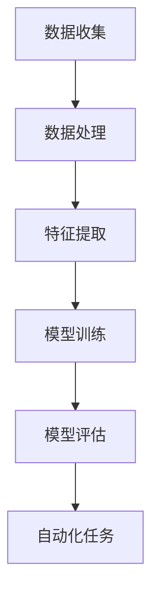
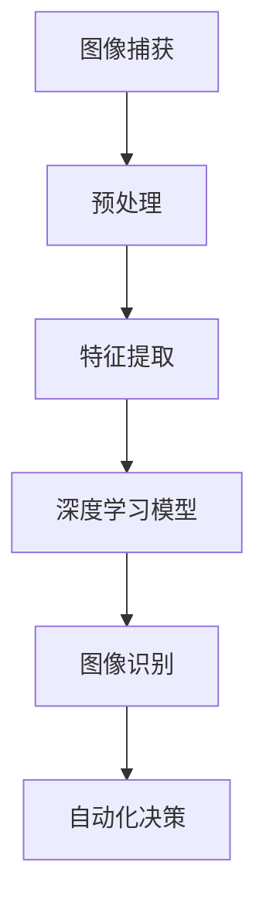
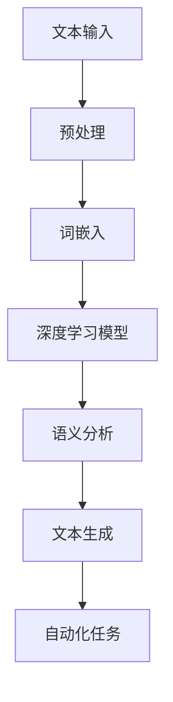

                 

关键词：Andrej Karpathy，自动化，深度学习，计算机视觉，自然语言处理，算法原理，数学模型，代码实例，应用场景，未来展望。

> 摘要：本文将深入探讨Andrej Karpathy在其研究领域内对自动化的见解，包括深度学习、计算机视觉和自然语言处理等方面。通过对其核心概念、算法原理、数学模型的详细讲解，以及实际项目实践和未来应用场景的展望，本文旨在为读者提供一个全面而深入的理解。

## 1. 背景介绍

Andrej Karpathy是一位杰出的计算机科学家和人工智能研究者，以其在深度学习和自然语言处理领域的卓越贡献而闻名。他目前是OpenAI的首席科学家，也是著名的深度学习教科书《深度学习》（Deep Learning）的合著者之一。Karpathy的研究重点在于如何通过深度学习技术实现自动化，从而在图像识别、文本生成、机器翻译等任务上取得突破。

在本文中，我们将探讨Andrej Karpathy在自动化领域的核心见解，分析其研究的算法原理、数学模型，并提供实际的代码实例和应用场景。通过这一系列的探讨，我们将对自动化技术有一个更加全面和深入的认识。

## 2. 核心概念与联系

### 2.1 深度学习与自动化

深度学习是自动化领域的重要推动力量。它通过多层神经网络对大量数据进行学习，从而实现复杂的模式识别和决策。Andrej Karpathy在其研究中指出，深度学习的关键在于其自适应性，能够从数据中自动提取特征，并通过层层抽象提高模型的泛化能力。

以下是深度学习与自动化之间的Mermaid流程图：



### 2.2 计算机视觉与自动化

计算机视觉是自动化技术的关键应用领域之一。通过深度学习算法，计算机可以自动识别和理解图像中的内容。Karpathy的研究重点在于如何利用深度学习提高计算机视觉系统的性能和准确性。

以下是计算机视觉与自动化之间的Mermaid流程图：



### 2.3 自然语言处理与自动化

自然语言处理（NLP）是自动化技术的另一个重要领域。通过深度学习，计算机可以理解和生成自然语言，从而实现自动化文本处理。Karpathy的研究集中在如何通过深度学习技术提高NLP系统的性能，包括文本分类、机器翻译和文本生成。

以下是自然语言处理与自动化之间的Mermaid流程图：



## 3. 核心算法原理 & 具体操作步骤

### 3.1 算法原理概述

Andrej Karpathy在自动化研究中主要采用深度学习算法，其中最核心的是卷积神经网络（CNN）和循环神经网络（RNN）。CNN擅长处理图像数据，通过卷积层提取图像特征；而RNN则擅长处理序列数据，如文本和语音。

### 3.2 算法步骤详解

#### 3.2.1 CNN算法步骤

1. **数据预处理**：对图像进行归一化、裁剪等处理，以便于输入到网络中。
2. **卷积层**：通过卷积操作提取图像特征。
3. **池化层**：对卷积层输出的特征进行下采样，减少计算量和参数数量。
4. **全连接层**：将卷积层和池化层输出的特征进行整合，形成最终的分类结果。

#### 3.2.2 RNN算法步骤

1. **嵌入层**：将文本中的词语转换为向量表示。
2. **RNN层**：对输入的词语向量进行处理，通过隐藏状态实现序列建模。
3. **输出层**：将RNN输出的隐藏状态映射到输出结果，如分类或文本生成。

### 3.3 算法优缺点

CNN在图像识别任务上具有显著的性能优势，能够处理高维度的图像数据；但其在处理长序列数据时存在局限性。RNN则能够处理长序列数据，但在处理变长序列时性能不稳定，容易产生梯度消失或爆炸问题。

### 3.4 算法应用领域

CNN广泛应用于计算机视觉领域，如图像分类、目标检测和图像生成；RNN则在自然语言处理领域具有广泛的应用，如文本分类、机器翻译和语音识别。

## 4. 数学模型和公式 & 详细讲解 & 举例说明

### 4.1 数学模型构建

CNN的数学模型主要包括卷积操作、激活函数、池化操作和全连接层。以下为CNN的数学模型构建：

```latex
输入图像：X \in R^{h \times w \times c}
卷积核：K \in R^{k \times k \times c}
偏置：b \in R
激活函数：\sigma
卷积操作：H = \sigma(K \cdot X + b)
池化操作：P = \text{Pooling}(H)
全连接层：Y = W \cdot P + b'
```

RNN的数学模型主要包括嵌入层、RNN层和输出层。以下为RNN的数学模型构建：

```latex
嵌入层：E = \text{Embedding}(W_e, X)
RNN层：h_t = \text{RNN}(h_{t-1}, E_t)
输出层：Y = \text{Output}(h_T)
```

### 4.2 公式推导过程

以CNN为例，卷积操作的推导过程如下：

$$
\begin{aligned}
H &= \sigma(K \cdot X + b) \\
&= \sigma((K_1 \cdot X_1) + (K_2 \cdot X_2) + \ldots + (K_c \cdot X_c) + b) \\
&= \sigma(\sum_{i=1}^{c} K_i \cdot X_i + b)
\end{aligned}
$$

其中，$K_i$表示第$i$个卷积核，$X_i$表示输入图像的第$i$个通道。

### 4.3 案例分析与讲解

以下为一个简单的CNN模型在图像分类任务中的应用案例：

```python
import tensorflow as tf
from tensorflow.keras import layers

model = tf.keras.Sequential([
    layers.Conv2D(32, (3, 3), activation='relu', input_shape=(28, 28, 1)),
    layers.MaxPooling2D((2, 2)),
    layers.Flatten(),
    layers.Dense(128, activation='relu'),
    layers.Dense(10, activation='softmax')
])

model.compile(optimizer='adam',
              loss='sparse_categorical_crossentropy',
              metrics=['accuracy'])

model.fit(train_images, train_labels, epochs=5)
```

该模型由一个卷积层、一个池化层、一个全连接层和一个输出层组成。训练数据通过fit方法进行训练，最终实现图像分类任务。

## 5. 项目实践：代码实例和详细解释说明

### 5.1 开发环境搭建

在开始项目实践之前，需要搭建一个合适的开发环境。本文使用Python和TensorFlow作为开发工具。

```bash
pip install tensorflow
```

### 5.2 源代码详细实现

以下是一个简单的CNN模型在图像分类任务中的实现：

```python
import tensorflow as tf
from tensorflow.keras import layers

# 数据集加载
mnist = tf.keras.datasets.mnist
(train_images, train_labels), (test_images, test_labels) = mnist.load_data()

# 数据预处理
train_images = train_images / 255.0
test_images = test_images / 255.0

# 构建模型
model = tf.keras.Sequential([
    layers.Conv2D(32, (3, 3), activation='relu', input_shape=(28, 28, 1)),
    layers.MaxPooling2D((2, 2)),
    layers.Flatten(),
    layers.Dense(128, activation='relu'),
    layers.Dense(10, activation='softmax')
])

# 编译模型
model.compile(optimizer='adam',
              loss='sparse_categorical_crossentropy',
              metrics=['accuracy'])

# 训练模型
model.fit(train_images, train_labels, epochs=5)

# 评估模型
test_loss, test_acc = model.evaluate(test_images, test_labels)
print(f"Test accuracy: {test_acc}")
```

### 5.3 代码解读与分析

1. **数据集加载**：使用TensorFlow的内置函数加载MNIST数据集。
2. **数据预处理**：将图像数据归一化至[0, 1]范围内，便于模型训练。
3. **模型构建**：使用Sequential模型构建一个简单的CNN模型，包括卷积层、池化层、全连接层和输出层。
4. **编译模型**：设置优化器、损失函数和评估指标。
5. **训练模型**：使用fit函数进行模型训练。
6. **评估模型**：使用evaluate函数评估模型在测试集上的性能。

### 5.4 运行结果展示

运行上述代码后，可以得到训练集和测试集的准确率。在实际运行过程中，模型的准确率可能因数据集和训练过程的不同而有所差异。

## 6. 实际应用场景

Andrej Karpathy的研究成果在多个实际应用场景中取得了显著成效。以下是一些典型应用场景：

### 6.1 计算机视觉

在计算机视觉领域，深度学习算法已经广泛应用于图像识别、目标检测和图像生成等领域。例如，在自动驾驶技术中，深度学习算法用于实时识别道路上的车辆、行人、交通标志等目标，从而实现自动驾驶功能。

### 6.2 自然语言处理

在自然语言处理领域，深度学习算法在文本分类、机器翻译和语音识别等方面取得了突破性进展。例如，在社交媒体文本分析中，深度学习算法可以自动识别和分类用户发表的文本，从而实现情感分析和热点话题追踪。

### 6.3 医疗健康

在医疗健康领域，深度学习算法在医学图像分析、疾病诊断和治疗规划等方面具有巨大潜力。例如，深度学习算法可以自动识别医学图像中的病变区域，从而提高疾病诊断的准确性和效率。

## 7. 工具和资源推荐

### 7.1 学习资源推荐

1. 《深度学习》（Deep Learning）—— Ian Goodfellow、Yoshua Bengio、Aaron Courville 著
2. 《Python深度学习》（Deep Learning with Python）—— Fran\*\*\*ois Chollet 著
3. 《自然语言处理实战》（Natural Language Processing with Python）—— Steven Bird、Ewan Klein、Edward Loper 著

### 7.2 开发工具推荐

1. TensorFlow
2. PyTorch
3. Keras

### 7.3 相关论文推荐

1. "A Theoretical Framework for Back-Propagation" —— David E. Rumelhart、Geoffrey E. Hinton、Rajesh N. McClelland
2. "Deep Learning" —— Ian Goodfellow、Yoshua Bengio、Aaron Courville
3. "Effective Approaches to Attention-based Neural Machine Translation" —— Minh-Thang Luong、Hannaneh Hajishirzi、Christopher D. Manning

## 8. 总结：未来发展趋势与挑战

### 8.1 研究成果总结

Andrej Karpathy在深度学习、计算机视觉和自然语言处理等领域取得了卓越的研究成果，推动了自动化技术的快速发展。其研究成果不仅在学术领域引起了广泛关注，也在实际应用中取得了显著成效。

### 8.2 未来发展趋势

未来，自动化技术将在更多领域得到应用，如自动驾驶、智能医疗、智能语音等。随着计算能力的提升和算法的优化，自动化技术的性能将不断提高，为人类带来更多便利。

### 8.3 面临的挑战

尽管自动化技术发展迅速，但仍面临一些挑战，如数据隐私、算法透明度和可解释性等。如何解决这些挑战，实现自动化技术的可持续发展，是未来研究的重要方向。

### 8.4 研究展望

随着人工智能技术的不断发展，自动化技术将在更多领域得到应用。未来，我们将见证自动化技术为人类生活带来的巨大变革，同时也将面临一系列伦理和社会问题。如何在发展自动化技术的同时，确保其安全、可靠和可持续，将是未来研究的重要课题。

## 9. 附录：常见问题与解答

### 9.1 什么是深度学习？

深度学习是一种人工智能方法，通过多层神经网络对大量数据进行学习，从而实现复杂的模式识别和决策。

### 9.2 深度学习有哪些应用领域？

深度学习在计算机视觉、自然语言处理、语音识别、医学图像分析等领域具有广泛的应用。

### 9.3 什么是卷积神经网络（CNN）？

卷积神经网络是一种用于处理图像数据的神经网络，通过卷积操作提取图像特征，从而实现图像分类和识别。

### 9.4 什么是循环神经网络（RNN）？

循环神经网络是一种用于处理序列数据的神经网络，通过隐藏状态实现序列建模，从而实现文本分类、机器翻译和语音识别等任务。

---

作者：禅与计算机程序设计艺术 / Zen and the Art of Computer Programming

