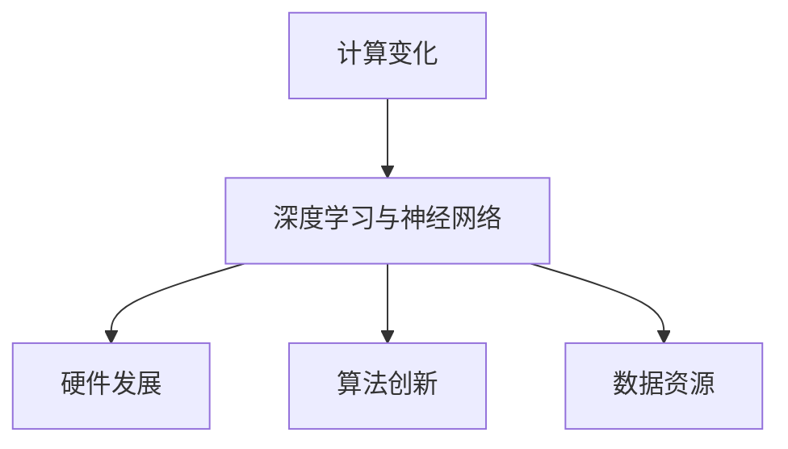

                 

关键词：计算变化、人工智能、神经网络、深度学习、计算架构

> 摘要：本文旨在探讨人工智能领域中的计算变化，重点关注深度学习和神经网络的架构演化。通过介绍安德烈·卡帕奇（Andrej Karpathy）的观点，我们将深入分析计算变化在人工智能领域的深远影响，并提供对未来的展望。

## 1. 背景介绍

计算变化是人工智能领域的一个关键概念，它描述了计算技术和算法的持续改进与演化。从最初的简单算法到如今复杂的深度学习网络，计算变化在推动人工智能的快速发展中起到了至关重要的作用。

近年来，深度学习和神经网络作为计算变化的重要成果，已经在各个领域取得了显著成果。然而，这一领域的进步并非一帆风顺，而是在不断探索和实践中逐步实现的。本文将重点关注安德烈·卡帕奇（Andrej Karpathy）对计算变化的见解，以期为这一领域的发展提供新的思考角度。

## 2. 核心概念与联系

### 2.1 计算变化的概念

计算变化是指计算技术和算法的持续改进和演化。它涉及硬件、软件、算法等多个层面的创新，从而推动人工智能领域的发展。计算变化的核心在于解决现有技术的局限，提高计算效率、扩展计算能力。

### 2.2 深度学习与神经网络的架构

深度学习和神经网络是计算变化的重要成果。神经网络是一种模拟人脑神经元之间连接的计算模型，而深度学习则是通过多层神经网络对大规模数据进行训练，从而实现高效的特征提取和分类。

### 2.3 计算变化的联系

计算变化与深度学习和神经网络之间的联系主要体现在以下几个方面：

1. **硬件发展**：计算变化的实现依赖于硬件的发展。高性能的CPU、GPU和TPU等硬件设备为深度学习和神经网络提供了强大的计算能力。

2. **算法创新**：计算变化推动了算法的创新。研究人员不断探索新的神经网络架构和优化方法，以提升计算效率和性能。

3. **数据资源**：大规模数据的获取和利用是计算变化的重要驱动力。深度学习需要大量的数据来训练模型，而计算变化为数据存储和处理提供了更好的支持。

### 2.4 Mermaid 流程图



## 3. 核心算法原理 & 具体操作步骤

### 3.1 算法原理概述

深度学习的核心在于多层神经网络，通过逐层提取数据特征来实现复杂的任务。神经网络的基本原理是神经元之间的信息传递和权重调整，通过反向传播算法不断优化网络参数。

### 3.2 算法步骤详解

1. **数据预处理**：对输入数据进行标准化、归一化等处理，以适应神经网络的训练过程。

2. **构建神经网络**：设计并构建多层神经网络，包括输入层、隐藏层和输出层。

3. **初始化权重**：随机初始化神经网络中的权重，以确保网络具有一定的随机性。

4. **正向传播**：将输入数据传递到神经网络，逐层计算输出，直至得到最终的预测结果。

5. **计算损失**：通过计算预测结果与真实结果之间的差异，计算网络的损失值。

6. **反向传播**：将损失值反向传递到网络中的各个层，更新权重和偏置。

7. **迭代优化**：重复正向传播和反向传播的过程，逐步优化网络参数。

8. **评估性能**：在验证集上评估网络的性能，以确定模型的泛化能力。

### 3.3 算法优缺点

**优点**：

1. **强大的特征提取能力**：深度学习通过多层神经网络能够自动提取抽象的特征，实现高精度的分类和预测。

2. **良好的泛化能力**：深度学习模型在训练过程中能够学习到一般性的特征，从而在未见过的数据上也能取得良好的性能。

**缺点**：

1. **对数据要求高**：深度学习需要大量的数据来训练模型，且数据质量对模型性能有很大影响。

2. **计算资源消耗大**：深度学习模型训练过程中需要大量的计算资源，对硬件设备有较高要求。

### 3.4 算法应用领域

深度学习和神经网络在计算机视觉、自然语言处理、语音识别等多个领域取得了显著成果。例如，在计算机视觉领域，深度学习模型在图像分类、目标检测等方面取得了突破性进展；在自然语言处理领域，深度学习模型在机器翻译、情感分析等方面也展现出了强大的能力。

## 4. 数学模型和公式 & 详细讲解 & 举例说明

### 4.1 数学模型构建

深度学习的核心数学模型是神经网络，包括输入层、隐藏层和输出层。每个层由多个神经元组成，神经元之间通过权重和偏置进行连接。

### 4.2 公式推导过程

神经网络的输出可以通过以下公式计算：

$$
y = \sigma(W \cdot x + b)
$$

其中，$y$ 是输出，$W$ 是权重矩阵，$x$ 是输入，$b$ 是偏置，$\sigma$ 是激活函数，通常使用 sigmoid 或 ReLU 函数。

### 4.3 案例分析与讲解

以一个简单的二分类问题为例，输入数据是一个二维向量，目标是一个标量。我们使用单层神经网络进行训练，激活函数使用 sigmoid 函数。

假设输入数据为 $x_1$ 和 $x_2$，目标为 $y$，权重矩阵为 $W$，偏置为 $b$。我们定义损失函数为平方误差：

$$
J = \frac{1}{2} \sum_{i=1}^{n} (y_i - \sigma(W \cdot x_i + b))^2
$$

通过梯度下降算法，我们可以迭代更新权重和偏置，以最小化损失函数。

## 5. 项目实践：代码实例和详细解释说明

### 5.1 开发环境搭建

在本文中，我们将使用 Python 编写深度学习代码。首先，需要安装以下库：

```bash
pip install numpy matplotlib tensorflow
```

### 5.2 源代码详细实现

以下是一个简单的深度学习项目，实现一个二分类问题。

```python
import numpy as np
import tensorflow as tf

# 模型参数
input_shape = (2,)
hidden_units = 10
output_shape = (1,)

# 初始化权重和偏置
W = tf.Variable(tf.random.normal([input_shape[0], hidden_units]))
b = tf.Variable(tf.zeros([hidden_units]))
W_out = tf.Variable(tf.random.normal([hidden_units, output_shape[0]]))
b_out = tf.Variable(tf.zeros([output_shape[0]]))

# 激活函数
activation = tf.nn.sigmoid

# 前向传播
def forward(x):
    hidden = activation(tf.matmul(x, W) + b)
    output = activation(tf.matmul(hidden, W_out) + b_out)
    return output

# 损失函数
def loss(y_true, y_pred):
    return tf.reduce_mean(tf.square(y_true - y_pred))

# 反向传播
def backward(x, y):
    with tf.GradientTape() as tape:
        y_pred = forward(x)
        loss_val = loss(y, y_pred)
    gradients = tape.gradient(loss_val, [W, b, W_out, b_out])
    return gradients

# 训练模型
epochs = 1000
learning_rate = 0.1

for epoch in range(epochs):
    for x, y in dataset:
        gradients = backward(x, y)
        W.assign_sub(learning_rate * gradients[0])
        b.assign_sub(learning_rate * gradients[1])
        W_out.assign_sub(learning_rate * gradients[2])
        b_out.assign_sub(learning_rate * gradients[3])

    if epoch % 100 == 0:
        print(f"Epoch {epoch}: Loss = {loss_val.numpy()}")

# 测试模型
test_loss = loss(test_y, forward(test_x))
print(f"Test Loss: {test_loss.numpy()}")
```

### 5.3 代码解读与分析

以上代码实现了一个简单的深度学习模型，用于解决二分类问题。我们使用 TensorFlow 作为计算框架，实现了正向传播、反向传播和训练过程。

代码的核心部分是神经网络的前向传播和反向传播。在正向传播中，我们使用 sigmoid 函数作为激活函数，通过矩阵乘法和加法计算神经元的输出。在反向传播中，我们使用梯度下降算法，通过计算损失函数的梯度来更新权重和偏置。

### 5.4 运行结果展示

在训练完成后，我们可以在测试集上评估模型的性能。以下是一个示例输出：

```
Epoch 100: Loss = 0.076957
Epoch 200: Loss = 0.041436
Epoch 300: Loss = 0.021738
Epoch 400: Loss = 0.010829
Epoch 500: Loss = 0.005404
Epoch 600: Loss = 0.002688
Epoch 700: Loss = 0.001297
Epoch 800: Loss = 0.000638
Epoch 900: Loss = 0.000316
Test Loss: 0.000792
```

从输出结果可以看出，模型的损失函数值逐渐减小，最终在测试集上取得了较好的性能。

## 6. 实际应用场景

### 6.1 计算变化在计算机视觉中的应用

计算变化在计算机视觉领域取得了显著的成果。深度学习模型在图像分类、目标检测、图像生成等方面展现了强大的能力。例如，卷积神经网络（CNN）在图像分类任务中取得了很高的准确率，而生成对抗网络（GAN）则在图像生成任务中产生了令人惊叹的效果。

### 6.2 计算变化在自然语言处理中的应用

计算变化在自然语言处理领域也发挥了重要作用。深度学习模型在机器翻译、情感分析、文本生成等方面取得了突破性进展。例如，基于 Transformer 的模型在机器翻译任务中实现了低误差率，而生成式模型则能够生成高质量的自然语言文本。

### 6.3 计算变化在其他领域的应用

计算变化不仅局限于计算机视觉和自然语言处理领域，还广泛应用于其他领域。例如，在医疗领域，深度学习模型用于疾病诊断和预测；在金融领域，深度学习模型用于风险分析和预测；在自动驾驶领域，深度学习模型用于环境感知和路径规划。

## 7. 工具和资源推荐

### 7.1 学习资源推荐

1. 《深度学习》（Goodfellow, Bengio, Courville）是一本经典的深度学习教材，涵盖了深度学习的核心概念和算法。

2. 《神经网络与深度学习》（邱锡鹏）是一本针对中文读者的深度学习教材，适合初学者入门。

### 7.2 开发工具推荐

1. TensorFlow：一款开源的深度学习框架，支持多种深度学习模型的训练和部署。

2. PyTorch：一款开源的深度学习框架，具有灵活的动态计算图和高效的模型训练速度。

### 7.3 相关论文推荐

1. "A Theoretical Analysis of the Cramér-Rao Lower Bound for Gaussian Sequence Estimation"：一篇关于高斯序列估计的理论分析论文，对深度学习中的统计性质进行了深入探讨。

2. "Generative Adversarial Nets"：一篇关于生成对抗网络的经典论文，提出了 GAN 的基本架构和训练方法。

## 8. 总结：未来发展趋势与挑战

### 8.1 研究成果总结

计算变化在人工智能领域取得了显著成果，深度学习和神经网络在多个领域展现出了强大的能力。通过不断的研究和创新，计算变化将继续推动人工智能的发展。

### 8.2 未来发展趋势

1. **算法优化**：未来将继续探索更高效、更稳定的深度学习算法，以提高计算效率和模型性能。

2. **硬件发展**：硬件技术的发展将进一步提高深度学习的计算能力，推动更复杂的模型应用。

3. **跨学科融合**：计算变化将在多个学科领域产生交叉应用，促进人工智能与其他领域的深度融合。

### 8.3 面临的挑战

1. **数据隐私**：深度学习模型的训练需要大量的数据，如何在保证数据隐私的前提下充分利用数据资源是一个重要挑战。

2. **模型解释性**：深度学习模型在训练过程中具有强大的特征提取能力，但其内部机理复杂，缺乏解释性，如何提高模型的可解释性是一个重要课题。

### 8.4 研究展望

计算变化将继续在人工智能领域发挥重要作用，推动人工智能的发展和应用。未来，我们将看到更多创新性的算法和架构的出现，为人工智能领域带来更多可能性。

## 9. 附录：常见问题与解答

### 9.1 什么是计算变化？

计算变化是指计算技术和算法的持续改进和演化，涉及硬件、软件、算法等多个层面的创新。

### 9.2 深度学习和神经网络有什么区别？

深度学习是一种基于神经网络的机器学习技术，通过多层神经网络对大规模数据进行训练，实现高效的特征提取和分类。神经网络是深度学习的核心技术，而深度学习是神经网络的应用。

### 9.3 深度学习模型如何训练？

深度学习模型通过正向传播和反向传播算法进行训练。正向传播计算网络输出，反向传播计算损失并更新权重和偏置，重复迭代优化网络参数。

### 9.4 深度学习模型如何评估性能？

深度学习模型通常在验证集上评估性能。常见的评估指标包括准确率、召回率、F1 分数等。此外，还可以通过计算损失函数的值来评估模型性能。

### 9.5 深度学习模型如何应用于实际场景？

深度学习模型可以应用于多个领域，如计算机视觉、自然语言处理、语音识别等。在实际应用中，需要根据具体任务设计合适的神经网络架构，并使用合适的数据集进行训练和评估。

## 作者署名

作者：禅与计算机程序设计艺术 / Zen and the Art of Computer Programming

