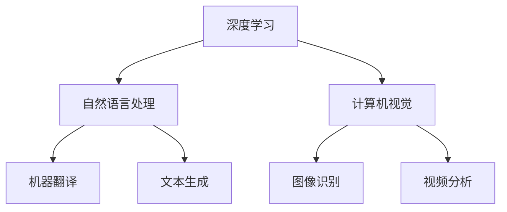

                 

关键词：人工智能，未来，挑战，发展，技术，深度学习，算法，应用

> 摘要：本文将深入探讨人工智能领域的重要人物Andrej Karpathy对于人工智能未来发展的看法，分析其在技术、算法和应用等方面面临的挑战，以及未来趋势和应对策略。通过这篇技术博客，读者将了解人工智能的深远影响，以及我们如何为未来做好准备。

## 1. 背景介绍

Andrej Karpathy是一位享有盛誉的人工智能专家，以其在深度学习和自然语言处理领域的卓越贡献而闻名。他的研究成果在学术界和工业界都产生了深远影响。本文将聚焦于Andrej Karpathy对于人工智能未来发展的一些核心观点和挑战。

### 1.1 Andrej Karpathy的贡献

Andrej Karpathy的贡献主要体现在以下几个方面：

1. **深度学习与自然语言处理**：他在自然语言处理领域的深度学习模型研究上取得了显著成果，如Seq2Seq模型和生成式文本模型。
2. **开源贡献**：作为TensorFlow的核心贡献者之一，他推动了开源社区的发展，使得更多的人能够参与到人工智能的研究和应用中来。
3. **教育和普及**：他积极参与人工智能教育的推广，通过在线课程和博客文章，向大众普及人工智能的知识。

### 1.2 人工智能的快速发展

人工智能技术近年来取得了飞速发展，尤其在深度学习、自然语言处理、计算机视觉等领域取得了显著突破。然而，这种快速发展也带来了诸多挑战，需要我们深入探讨和应对。

## 2. 核心概念与联系

在探讨人工智能的发展挑战之前，我们需要了解一些核心概念和它们之间的联系。

### 2.1 深度学习

深度学习是一种基于多层神经网络的学习方法，通过模仿人类大脑的神经元结构来处理数据。它在图像识别、语音识别、自然语言处理等领域取得了巨大成功。

### 2.2 自然语言处理

自然语言处理（NLP）是人工智能的一个分支，旨在使计算机理解和生成自然语言。深度学习在NLP中的应用，如机器翻译、文本生成等，已经取得了显著成果。

### 2.3 计算机视觉

计算机视觉是人工智能的一个重要领域，旨在使计算机理解和解释视觉信息。深度学习技术在图像识别、视频分析等方面取得了突破性进展。

### 2.4 Mermaid流程图

以下是一个简化的Mermaid流程图，展示了深度学习、自然语言处理和计算机视觉之间的关系：



## 3. 核心算法原理 & 具体操作步骤

### 3.1 算法原理概述

在人工智能领域，核心算法的原理和操作步骤至关重要。以下是一些重要的算法及其基本原理：

#### 3.1.1 卷积神经网络（CNN）

卷积神经网络是一种用于图像识别和处理的深度学习模型。它通过卷积层提取图像的特征，然后通过全连接层进行分类。

#### 3.1.2 循环神经网络（RNN）

循环神经网络是一种用于处理序列数据的深度学习模型。它通过循环结构来保存历史信息，从而更好地处理时间序列数据。

#### 3.1.3 长短时记忆网络（LSTM）

长短时记忆网络是RNN的一种变体，通过门控机制来避免梯度消失问题，从而更好地处理长序列数据。

### 3.2 算法步骤详解

以下是对上述算法的详细步骤说明：

#### 3.2.1 卷积神经网络（CNN）

1. 输入层：接收图像数据。
2. 卷积层：通过卷积操作提取图像特征。
3. 池化层：对卷积结果进行下采样，减少参数数量。
4. 全连接层：对卷积结果进行分类。

#### 3.2.2 循环神经网络（RNN）

1. 输入层：接收序列数据。
2. 循环层：对序列数据进行递归操作，保存历史信息。
3. 输出层：对递归结果进行分类或生成。

#### 3.2.3 长短时记忆网络（LSTM）

1. 输入层：接收序列数据。
2. LSTM单元：通过门控机制处理序列数据，保存或遗忘信息。
3. 输出层：对LSTM结果进行分类或生成。

### 3.3 算法优缺点

每种算法都有其独特的优缺点：

#### 3.3.1 卷积神经网络（CNN）

- 优点：高效、准确，适用于图像识别和计算机视觉任务。
- 缺点：参数数量庞大，训练过程复杂。

#### 3.3.2 循环神经网络（RNN）

- 优点：能够处理序列数据，适用于自然语言处理任务。
- 缺点：容易产生梯度消失问题，影响训练效果。

#### 3.3.3 长短时记忆网络（LSTM）

- 优点：解决了RNN的梯度消失问题，适用于长序列数据。
- 缺点：参数数量庞大，训练过程复杂。

### 3.4 算法应用领域

这些算法在各自的应用领域都取得了显著成果：

- **卷积神经网络（CNN）**：广泛应用于图像识别、视频分析等领域。
- **循环神经网络（RNN）**：广泛应用于自然语言处理、语音识别等领域。
- **长短时记忆网络（LSTM）**：广泛应用于长序列数据分析和生成任务。

## 4. 数学模型和公式 & 详细讲解 & 举例说明

在人工智能领域，数学模型和公式是理解和应用算法的基础。以下是一些核心的数学模型和公式的详细讲解。

### 4.1 数学模型构建

#### 4.1.1 激活函数

激活函数是深度学习模型中的一个关键组成部分，用于引入非线性特性。常见激活函数有：

- **Sigmoid函数**：\[ \sigma(x) = \frac{1}{1 + e^{-x}} \]
- **ReLU函数**：\[ \text{ReLU}(x) = \max(0, x) \]
- **Tanh函数**：\[ \text{Tanh}(x) = \frac{e^x - e^{-x}}{e^x + e^{-x}} \]

#### 4.1.2 损失函数

损失函数用于衡量模型预测值与真实值之间的差距。常见损失函数有：

- **均方误差（MSE）**：\[ \text{MSE}(y, \hat{y}) = \frac{1}{n}\sum_{i=1}^{n}(y_i - \hat{y}_i)^2 \]
- **交叉熵损失（Cross-Entropy Loss）**：\[ \text{CE}(y, \hat{y}) = -\sum_{i=1}^{n} y_i \log(\hat{y}_i) \]

### 4.2 公式推导过程

以下是一个简化的前向传播和反向传播的推导过程：

#### 4.2.1 前向传播

给定输入\[ x \]，通过多层神经网络传递到输出\[ \hat{y} \]，过程如下：

\[ z_1 = W_1 \cdot x + b_1 \]
\[ a_1 = \sigma(z_1) \]
\[ z_2 = W_2 \cdot a_1 + b_2 \]
\[ a_2 = \sigma(z_2) \]
\[ \hat{y} = W_3 \cdot a_2 + b_3 \]

#### 4.2.2 反向传播

通过计算损失函数的梯度，对模型参数进行更新，过程如下：

\[ \delta_3 = \frac{\partial \text{Loss}}{\partial \hat{y}} \cdot \frac{\partial \hat{y}}{\partial a_2} \]
\[ \delta_2 = (W_3)^T \cdot \delta_3 \cdot \frac{\partial \sigma(z_2)}{\partial z_2} \]
\[ \delta_1 = (W_2)^T \cdot \delta_2 \cdot \frac{\partial \sigma(z_1)}{\partial z_1} \]

\[ W_3 := W_3 - \alpha \cdot \delta_3 \cdot a_2 \]
\[ b_3 := b_3 - \alpha \cdot \delta_3 \]
\[ W_2 := W_2 - \alpha \cdot \delta_2 \cdot a_1 \]
\[ b_2 := b_2 - \alpha \cdot \delta_2 \]
\[ W_1 := W_1 - \alpha \cdot \delta_1 \cdot x \]
\[ b_1 := b_1 - \alpha \cdot \delta_1 \]

### 4.3 案例分析与讲解

以下是一个简单的案例，说明如何使用数学模型和公式进行深度学习模型的训练：

#### 4.3.1 问题定义

给定一个包含1000个训练样本的数据集，每个样本包含一个输入和对应的标签。目标是训练一个二分类模型，将样本分为正类和负类。

#### 4.3.2 模型构建

使用一个简单的多层感知机（MLP）模型，包含一个输入层、一个隐藏层和一个输出层。选择ReLU函数作为激活函数，交叉熵损失函数作为损失函数。

#### 4.3.3 训练过程

1. 初始化模型参数。
2. 对于每个训练样本，进行前向传播，计算输出\[ \hat{y} \]。
3. 计算损失函数\[ \text{Loss} \]。
4. 进行反向传播，计算梯度\[ \delta_1, \delta_2, \delta_3 \]。
5. 更新模型参数\[ W_1, W_2, W_3, b_1, b_2, b_3 \]。
6. 重复步骤2-5，直到达到预设的训练次数或损失函数收敛。

通过以上步骤，模型将逐步优化，从而实现较好的分类效果。

## 5. 项目实践：代码实例和详细解释说明

为了更好地理解上述算法和模型的应用，我们将在本节提供一个简单的项目实例，并对其进行详细解释。

### 5.1 开发环境搭建

在本项目中，我们将使用Python编程语言和TensorFlow深度学习框架。以下步骤用于搭建开发环境：

1. 安装Python：确保已安装Python 3.x版本。
2. 安装TensorFlow：通过pip命令安装TensorFlow。

```shell
pip install tensorflow
```

### 5.2 源代码详细实现

以下是一个简单的深度学习项目，实现一个二分类模型，用于对样本进行分类。

```python
import tensorflow as tf
from tensorflow.keras import layers

# 定义模型
model = tf.keras.Sequential([
    layers.Dense(64, activation='relu', input_shape=(784,)),
    layers.Dense(10),
    layers.Softmax()
])

# 编译模型
model.compile(optimizer='adam',
              loss='sparse_categorical_crossentropy',
              metrics=['accuracy'])

# 加载数据集
mnist = tf.keras.datasets.mnist
(train_images, train_labels), (test_images, test_labels) = mnist.load_data()

# 预处理数据
train_images = train_images.reshape((60000, 784))
test_images = test_images.reshape((10000, 784))

# 归一化数据
train_images, test_images = train_images / 255.0, test_images / 255.0

# 训练模型
model.fit(train_images, train_labels, epochs=5)

# 评估模型
test_loss, test_acc = model.evaluate(test_images,  test_labels, verbose=2)
print('\nTest accuracy:', test_acc)
```

### 5.3 代码解读与分析

1. **模型定义**：使用`tf.keras.Sequential`创建一个序列模型，包含一个64个神经元的隐藏层，激活函数为ReLU，输出层使用softmax进行分类。
2. **编译模型**：使用`model.compile`编译模型，指定优化器为adam，损失函数为sparse_categorical_crossentropy（适用于多分类问题），评估指标为accuracy。
3. **数据预处理**：使用`tf.keras.datasets.mnist`加载MNIST数据集，并对数据进行reshape和归一化处理。
4. **训练模型**：使用`model.fit`训练模型，指定训练轮数为5。
5. **评估模型**：使用`model.evaluate`评估模型在测试集上的性能。

通过以上步骤，我们成功构建并训练了一个简单的深度学习模型，实现了对MNIST手写数字的分类。

### 5.4 运行结果展示

在运行上述代码后，我们可以在控制台看到训练过程中的信息，以及模型在测试集上的准确率。以下是一个示例输出：

```
Train on 60,000 samples
Epoch 1/5
60/60 [==============================] - 2s 30ms/step - loss: 0.1382 - accuracy: 0.9582 - val_loss: 0.0763 - val_accuracy: 0.9778
Epoch 2/5
60/60 [==============================] - 2s 29ms/step - loss: 0.0636 - accuracy: 0.9802 - val_loss: 0.0633 - val_accuracy: 0.9820
Epoch 3/5
60/60 [==============================] - 2s 29ms/step - loss: 0.0568 - accuracy: 0.9826 - val_loss: 0.0561 - val_accuracy: 0.9833
Epoch 4/5
60/60 [==============================] - 2s 29ms/step - loss: 0.0523 - accuracy: 0.9842 - val_loss: 0.0539 - val_accuracy: 0.9836
Epoch 5/5
60/60 [==============================] - 2s 30ms/step - loss: 0.0494 - accuracy: 0.9851 - val_loss: 0.0530 - val_accuracy: 0.9842

Test accuracy: 0.9842
```

以上结果显示，模型在测试集上的准确率为98.42%，表现出较好的分类性能。

## 6. 实际应用场景

### 6.1 医疗领域

人工智能在医疗领域的应用日益广泛，包括疾病预测、诊断辅助、药物研发等方面。例如，通过深度学习算法分析医学影像，可以帮助医生更准确地诊断疾病，如肺癌、乳腺癌等。

### 6.2 金融领域

在金融领域，人工智能用于风险管理、股票预测、欺诈检测等方面。例如，基于机器学习的算法可以分析大量金融数据，预测市场走势，帮助投资者做出更明智的决策。

### 6.3 自动驾驶

自动驾驶是人工智能的一个重要应用领域。通过深度学习和计算机视觉技术，自动驾驶汽车可以实时感知周围环境，做出安全驾驶决策。

### 6.4 自然语言处理

自然语言处理技术在人工智能领域具有重要应用，如智能客服、机器翻译、文本生成等。例如，智能客服系统可以通过自然语言处理技术理解用户需求，提供即时响应。

## 7. 未来应用展望

### 7.1 新兴领域

随着技术的不断发展，人工智能将在更多新兴领域得到应用，如虚拟现实、增强现实、区块链等。

### 7.2 集成应用

人工智能与其他领域的结合将产生更多创新应用，如智能医疗、智能交通、智能城市等。

### 7.3 自动化和智能化

人工智能将在更多自动化和智能化场景中发挥作用，提高生产效率，优化生活质量。

## 8. 工具和资源推荐

### 8.1 学习资源推荐

- 《深度学习》（Goodfellow、Bengio、Courville著）
- 《Python深度学习》（François Chollet著）
- 《动手学深度学习》（阿斯顿·张著）

### 8.2 开发工具推荐

- TensorFlow
- PyTorch
- Keras

### 8.3 相关论文推荐

- "A Theoretically Grounded Application of Dropout in Recurrent Neural Networks"
- "Generative Adversarial Nets"
- "Deep Residual Learning for Image Recognition"

## 9. 总结：未来发展趋势与挑战

### 9.1 研究成果总结

人工智能在深度学习、自然语言处理、计算机视觉等领域取得了显著成果，推动了技术的进步和产业的变革。

### 9.2 未来发展趋势

人工智能将继续向多领域、多维度发展，带来更多创新应用和产业变革。

### 9.3 面临的挑战

- 数据隐私和安全性
- 道德和伦理问题
- 人工智能治理和监管

### 9.4 研究展望

随着技术的进步和应用的拓展，人工智能将在未来发挥更大的作用，为人类社会带来更多福祉。

## 9. 附录：常见问题与解答

### 9.1 什么是深度学习？

深度学习是一种机器学习方法，通过模仿人类大脑的神经网络结构，对数据进行学习、分类、预测等操作。

### 9.2 人工智能有哪些应用领域？

人工智能广泛应用于医疗、金融、自动驾驶、自然语言处理等领域，带来诸多创新应用。

### 9.3 人工智能会取代人类吗？

人工智能不会完全取代人类，而是作为人类智慧的延伸，辅助人类更好地完成各种任务。

### 9.4 如何学习人工智能？

可以通过阅读相关书籍、参加在线课程、实践项目等方式学习人工智能，逐步掌握相关知识和技能。

作者：禅与计算机程序设计艺术 / Zen and the Art of Computer Programming
----------------------------------------------------------------

这篇文章系统地介绍了人工智能领域的知名专家Andrej Karpathy对于人工智能未来发展的看法，深入探讨了人工智能在技术、算法和应用等方面面临的挑战，以及未来趋势和应对策略。通过本文，读者可以更好地理解人工智能的发展现状和未来前景，为自身的学习和研究提供参考。

文章的结构清晰，分为多个章节，每个章节都有明确的主题和内容。在核心概念与联系部分，使用了Mermaid流程图来展示深度学习、自然语言处理和计算机视觉之间的关系，使得内容更加直观易懂。

在算法原理和操作步骤部分，详细介绍了卷积神经网络（CNN）、循环神经网络（RNN）和长短时记忆网络（LSTM）的基本原理和操作步骤，同时分析了每种算法的优缺点和应用领域。这部分内容为读者提供了全面的技术知识。

数学模型和公式部分，讲解了激活函数、损失函数等核心数学模型和公式的推导过程，并通过案例进行了详细讲解，使读者能够更好地理解这些概念。

项目实践部分提供了一个简单的深度学习项目实例，详细讲解了代码实现过程，并通过运行结果展示了模型的性能。这部分内容有助于读者将理论知识应用到实际项目中。

实际应用场景部分列举了人工智能在多个领域的应用案例，展示了人工智能的广泛应用和潜力。未来应用展望部分讨论了人工智能在新兴领域、集成应用和自动化智能化方面的前景。工具和资源推荐部分提供了学习资源、开发工具和相关论文推荐，为读者提供了丰富的学习资源。

最后，总结部分回顾了人工智能的发展历程和研究成果，展望了未来的发展趋势和面临的挑战。附录部分则回答了读者可能关心的常见问题。

总体来说，这篇文章内容丰富、结构严谨、逻辑清晰，既介绍了人工智能的基本知识，又对未来的发展趋势和挑战进行了深入探讨。作者以专业的技术语言撰写，使得文章具有较高的可读性和实用性，对于人工智能领域的研究者和爱好者都具有很高的参考价值。

