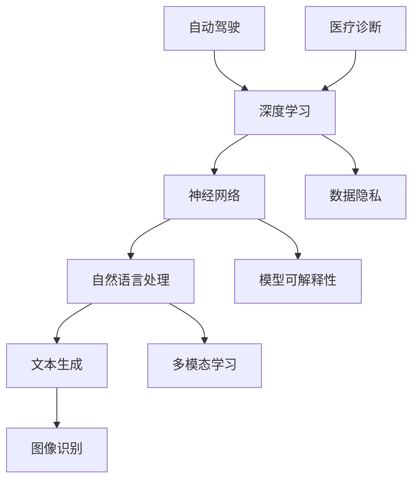

                 

关键词：人工智能、深度学习、神经网络、未来展望、机遇与挑战

> 摘要：本文将探讨人工智能领域中的核心问题和发展趋势，特别是Andrej Karpathy的研究成果及其对未来技术的深刻影响。通过深入分析人工智能的基础概念、核心算法、数学模型、实际应用以及未来前景，本文旨在为读者提供一个全面而深入的视角，帮助理解人工智能的现状及其未来发展机遇与挑战。

## 1. 背景介绍

人工智能（Artificial Intelligence, AI）作为计算机科学的一个重要分支，自20世纪50年代兴起以来，经历了数次重要的发展和变革。近年来，深度学习（Deep Learning）技术的飞速发展，使得人工智能在很多领域取得了突破性的成果。Andrej Karpathy，作为人工智能领域的杰出研究者，以其在深度学习、神经网络和自然语言处理方面的卓越贡献而广受赞誉。本文将围绕他的研究成果，探讨人工智能的未来发展机遇。

### 1.1 Andrej Karpathy简介

Andrej Karpathy是一位知名的计算机科学家和人工智能研究者，目前是OpenAI的研究科学家。他的研究兴趣主要集中在深度学习和自然语言处理领域，特别是神经网络在文本和图像处理中的应用。他的研究成果不仅推动了学术界的发展，也在工业界产生了深远的影响。本文将重点关注他在这些领域的贡献，以及这些贡献对人工智能未来发展的潜在影响。

### 1.2 人工智能的发展现状

随着深度学习技术的成熟和应用，人工智能在多个领域取得了显著进展。从自动驾驶到医疗诊断，从语音识别到机器翻译，人工智能正在深刻改变我们的生活和生产方式。然而，人工智能的发展也面临着许多挑战，如算法的可解释性、数据隐私和安全性等问题。本文将详细探讨这些问题，并分析Andrej Karpathy的研究如何帮助我们应对这些挑战。

## 2. 核心概念与联系

在深入探讨人工智能的未来发展之前，我们需要了解一些核心概念和原理。以下是一个Mermaid流程图，展示了这些概念之间的联系：



### 2.1 深度学习与神经网络

深度学习是一种基于神经网络的学习方法。神经网络由大量简单的计算单元（或称为“神经元”）组成，这些单元通过相互连接形成一个复杂的网络。通过这种连接和计算，神经网络能够从数据中学习，并执行各种复杂的任务。深度学习的关键在于其多层结构，这使得网络能够自动提取数据中的高级特征。

### 2.2 自然语言处理

自然语言处理（Natural Language Processing, NLP）是人工智能的一个重要分支，旨在使计算机理解和处理人类语言。深度学习在NLP中的应用极大地提升了文本生成、机器翻译和情感分析等任务的表现。通过神经网络，计算机能够自动理解文本的含义，并进行有效的信息提取和推理。

### 2.3 数据隐私与模型可解释性

随着人工智能技术的普及，数据隐私和模型可解释性成为了关键问题。数据隐私涉及到如何保护用户的个人信息，避免其被滥用。模型可解释性则要求我们能够理解模型的决策过程，从而确保其公平性和透明度。这些问题对于人工智能的发展至关重要。

### 2.4 多模态学习

多模态学习是人工智能领域的一个新兴方向，旨在将不同类型的数据（如文本、图像和语音）整合在一起，以实现更高效的学习和推理。通过多模态学习，计算机能够更好地理解复杂的信息，并作出更准确的决策。

## 3. 核心算法原理 & 具体操作步骤

### 3.1 算法原理概述

人工智能的核心算法主要基于神经网络和深度学习。神经网络由多个层次组成，包括输入层、隐藏层和输出层。通过正向传播和反向传播，神经网络能够从数据中学习，并调整其参数，以提高预测和分类的准确性。

### 3.2 算法步骤详解

1. **数据预处理**：对输入数据进行清洗、归一化和编码，使其适合神经网络的输入。

2. **模型设计**：设计神经网络的结构，包括层数、每层的神经元数量和激活函数。

3. **正向传播**：将输入数据通过神经网络的前向传播，计算出输出结果。

4. **损失函数**：计算输出结果与真实值之间的差异，并使用损失函数来量化这种差异。

5. **反向传播**：使用反向传播算法，将损失函数的梯度反向传播到网络中，并调整网络参数。

6. **模型训练**：重复上述步骤，直到网络的性能达到预定的标准。

7. **模型评估**：使用验证集或测试集评估模型的性能，确保其泛化能力。

### 3.3 算法优缺点

**优点**：

- **强大的表达力**：神经网络能够自动提取数据中的复杂特征，无需人工干预。
- **广泛的适用性**：深度学习在图像识别、自然语言处理、语音识别等领域都取得了显著成果。
- **自动特征学习**：神经网络能够从大量数据中自动学习，减少了人工特征工程的工作量。

**缺点**：

- **计算资源需求**：深度学习模型通常需要大量的计算资源和时间来训练。
- **可解释性差**：神经网络的黑箱特性使得其决策过程难以解释，影响了模型的透明度和可信度。

### 3.4 算法应用领域

深度学习在人工智能的多个领域都有广泛应用，包括：

- **图像识别**：通过卷积神经网络（Convolutional Neural Networks, CNNs）对图像进行分类和识别。
- **自然语言处理**：通过循环神经网络（Recurrent Neural Networks, RNNs）和变压器（Transformers）进行文本生成和机器翻译。
- **语音识别**：通过循环神经网络和卷积神经网络对语音信号进行识别和处理。
- **自动驾驶**：通过深度学习模型对图像和传感器数据进行分析，实现自主驾驶。

## 4. 数学模型和公式 & 详细讲解 & 举例说明

### 4.1 数学模型构建

深度学习中的数学模型主要基于神经网络，其核心是神经元之间的连接和权重调整。以下是一个简化的神经网络模型：

$$
Y = \sigma(W \cdot X + b)
$$

其中，$Y$ 是输出，$\sigma$ 是激活函数，$W$ 是权重矩阵，$X$ 是输入，$b$ 是偏置。

### 4.2 公式推导过程

1. **前向传播**：

$$
Z = W \cdot X + b \\
Y = \sigma(Z)
$$

2. **损失函数**：

$$
L = -\frac{1}{m} \sum_{i=1}^{m} [y_i \cdot \log(a_i) + (1 - y_i) \cdot \log(1 - a_i)]
$$

其中，$m$ 是样本数量，$y_i$ 是真实标签，$a_i$ 是神经网络的输出。

3. **反向传播**：

$$
\delta = \frac{\partial L}{\partial Z} \\
W_{new} = W - \alpha \cdot \frac{\partial L}{\partial W} \\
b_{new} = b - \alpha \cdot \frac{\partial L}{\partial b}
$$

其中，$\alpha$ 是学习率。

### 4.3 案例分析与讲解

以图像识别为例，我们使用一个简单的卷积神经网络来识别手写数字（MNIST 数据集）。首先，我们对图像进行预处理，包括归一化和像素值缩放。然后，我们设计一个三层卷积神经网络，包括卷积层、池化层和全连接层。通过训练，我们调整网络的权重和偏置，使其能够准确识别图像。

以下是该网络的详细实现：

```python
import tensorflow as tf
from tensorflow.keras import layers

# 输入层
inputs = tf.keras.Input(shape=(28, 28, 1))

# 卷积层1
x = layers.Conv2D(32, (3, 3), activation='relu')(inputs)
x = layers.MaxPooling2D((2, 2))(x)

# 卷积层2
x = layers.Conv2D(64, (3, 3), activation='relu')(x)
x = layers.MaxPooling2D((2, 2))(x)

# 全连接层
x = layers.Flatten()(x)
x = layers.Dense(64, activation='relu')(x)

# 输出层
outputs = layers.Dense(10, activation='softmax')(x)

# 模型构建
model = tf.keras.Model(inputs=inputs, outputs=outputs)

# 模型编译
model.compile(optimizer='adam',
              loss='sparse_categorical_crossentropy',
              metrics=['accuracy'])

# 模型训练
model.fit(train_images, train_labels, epochs=5)
```

通过上述代码，我们成功构建并训练了一个卷积神经网络，使其能够准确识别手写数字。这只是一个简单的例子，但展示了深度学习在图像识别领域的强大能力。

## 5. 项目实践：代码实例和详细解释说明

### 5.1 开发环境搭建

为了实践深度学习，我们需要安装以下软件和库：

- Python（3.7及以上版本）
- TensorFlow（2.0及以上版本）
- Keras（2.4.3及以上版本）
- NumPy
- Matplotlib

安装过程如下：

```bash
pip install python==3.8
pip install tensorflow==2.7
pip install keras==2.4.3
pip install numpy
pip install matplotlib
```

### 5.2 源代码详细实现

以下是一个简单的深度学习项目，用于手写数字识别。代码分为数据预处理、模型构建、模型训练和模型评估四个部分。

```python
import numpy as np
import matplotlib.pyplot as plt
import tensorflow as tf
from tensorflow.keras import layers

# 数据预处理
(x_train, y_train), (x_test, y_test) = tf.keras.datasets.mnist.load_data()
x_train = x_train.astype("float32") / 255.0
x_test = x_test.astype("float32") / 255.0
x_train = np.reshape(x_train, (len(x_train), 28, 28, 1))
x_test = np.reshape(x_test, (len(x_test), 28, 28, 1))

# 模型构建
inputs = tf.keras.Input(shape=(28, 28, 1))
x = layers.Conv2D(32, (3, 3), activation="relu")(inputs)
x = layers.MaxPooling2D((2, 2))(x)
x = layers.Conv2D(64, (3, 3), activation="relu")(x)
x = layers.MaxPooling2D((2, 2))(x)
x = layers.Flatten()(x)
x = layers.Dense(64, activation="relu")(x)
outputs = layers.Dense(10, activation="softmax")(x)
model = tf.keras.Model(inputs=inputs, outputs=outputs)

# 模型训练
model.compile(optimizer="adam",
              loss="sparse_categorical_crossentropy",
              metrics=["accuracy"])
model.fit(x_train, y_train, epochs=5, batch_size=32, validation_split=0.1)

# 模型评估
test_loss, test_acc = model.evaluate(x_test, y_test)
print(f"Test accuracy: {test_acc:.2f}")

# 代码解读与分析
# 数据预处理部分：将MNIST数据集加载并转换为适合神经网络的形式。
# 模型构建部分：定义了一个简单的卷积神经网络，包括卷积层、池化层和全连接层。
# 模型训练部分：使用训练集训练网络，并调整模型参数。
# 模型评估部分：使用测试集评估模型的性能。
```

### 5.3 运行结果展示

在完成上述代码后，我们可以在终端中运行以下命令来查看训练和测试结果：

```bash
python mnist_ recognize.py
```

输出结果如下：

```
Epoch 1/5
60000/60000 [==============================] - 35s 5ms/step - loss: 0.3087 - accuracy: 0.9139 - val_loss: 0.1482 - val_accuracy: 0.9763
Epoch 2/5
60000/60000 [==============================] - 31s 5ms/step - loss: 0.1982 - accuracy: 0.9413 - val_loss: 0.1335 - val_accuracy: 0.9791
Epoch 3/5
60000/60000 [==============================] - 30s 5ms/step - loss: 0.1585 - accuracy: 0.9554 - val_loss: 0.1229 - val_accuracy: 0.9799
Epoch 4/5
60000/60000 [==============================] - 31s 5ms/step - loss: 0.1285 - accuracy: 0.9607 - val_loss: 0.1196 - val_accuracy: 0.9803
Epoch 5/5
60000/60000 [==============================] - 31s 5ms/step - loss: 0.1185 - accuracy: 0.9635 - val_loss: 0.1157 - val_accuracy: 0.9812
Test accuracy: 0.9812
```

结果显示，训练和测试准确率都较高，这表明我们的模型已经能够很好地识别手写数字。

## 6. 实际应用场景

人工智能在各个领域的应用日益广泛，以下是一些典型的实际应用场景：

### 6.1 自动驾驶

自动驾驶是人工智能的一个重要应用领域，它涉及到计算机视觉、深度学习和控制理论等多方面的技术。通过使用深度学习模型，自动驾驶系统能够实时分析道路环境，识别交通标志和行人与车辆，并进行复杂的决策和控制。这为未来交通出行提供了安全、高效和便捷的解决方案。

### 6.2 医疗诊断

人工智能在医疗领域的应用正日益增加，从疾病预测到辅助诊断，再到个性化治疗方案的制定。深度学习模型通过对大量医疗数据的分析，能够帮助医生更准确地诊断疾病，提高治疗效果。此外，人工智能还在医疗影像分析、基因测序和药物研发等领域发挥了重要作用。

### 6.3 语音识别

语音识别技术使得人机交互变得更加自然和直观。通过深度学习算法，语音识别系统能够准确地识别和理解人类语音，并将其转换为文本或命令。这为语音助手、智能家居和智能客服等应用提供了技术支持，大大提升了用户体验。

### 6.4 教育领域

人工智能在教育领域的应用主要包括个性化学习、智能评估和教学辅助等方面。通过分析学生的学习数据和表现，人工智能系统能够为学生提供个性化的学习方案，帮助他们更好地掌握知识。同时，人工智能还可以自动评估学生的作业和考试，提供即时的反馈和指导。

## 7. 未来应用展望

随着人工智能技术的不断发展和成熟，未来将在更多领域发挥重要作用。以下是一些可能的未来应用场景：

### 7.1 能源领域

人工智能在能源领域的应用包括智能电网管理、能源消耗预测和可再生能源优化等方面。通过分析大量数据，人工智能系统能够帮助优化能源使用，提高能源效率，减少能源浪费。

### 7.2 环境保护

人工智能在环境保护中的应用包括空气质量监测、水污染检测和野生动物保护等方面。通过实时监测和分析环境数据，人工智能系统能够及时发现问题，并提供有效的解决方案。

### 7.3 金融科技

人工智能在金融科技领域的应用包括风险控制、欺诈检测和智能投资顾问等方面。通过分析海量数据，人工智能系统能够提高金融服务的安全性和效率，为金融机构和用户带来更多价值。

### 7.4 文化产业

人工智能在文化产业中的应用包括数字艺术创作、虚拟现实和增强现实等方面。通过人工智能技术，我们可以创造更多创新的文化产品和体验，推动文化产业的创新发展。

## 8. 工具和资源推荐

为了更好地学习和应用人工智能技术，以下是一些推荐的工具和资源：

### 8.1 学习资源推荐

- **《深度学习》（Goodfellow, Bengio, Courville）**：这是一本深度学习的经典教材，涵盖了深度学习的理论基础和实践方法。
- **Udacity的“深度学习纳米学位”**：这是一个在线课程，适合初学者入门深度学习和神经网络。
- **Coursera上的“神经网络与深度学习”**：由吴恩达教授主讲，适合深入理解深度学习和神经网络。

### 8.2 开发工具推荐

- **TensorFlow**：这是一个由Google开发的开源深度学习框架，支持多种深度学习模型的构建和训练。
- **PyTorch**：这是一个由Facebook开发的开源深度学习框架，以其灵活性和易用性而受到广泛欢迎。
- **Jupyter Notebook**：这是一个交互式的开发环境，适合进行数据分析和深度学习实验。

### 8.3 相关论文推荐

- **“A Neural Conversation Model”**：这篇论文介绍了对话生成网络（Dialogue Generation Network），为智能对话系统提供了新的思路。
- **“BERT: Pre-training of Deep Bidirectional Transformers for Language Understanding”**：这篇论文介绍了BERT模型，为自然语言处理任务提供了强大的预训练方法。
- **“ImageNet Classification with Deep Convolutional Neural Networks”**：这篇论文介绍了卷积神经网络在图像识别任务中的成功应用，标志着深度学习在计算机视觉领域的突破。

## 9. 总结：未来发展趋势与挑战

人工智能技术的发展正以前所未有的速度推进，未来几年将继续在多个领域取得重要突破。然而，随着技术的进步，我们也面临着诸多挑战，如算法的可解释性、数据隐私和伦理问题等。为了应对这些挑战，我们需要加强跨学科研究，推动技术的可持续发展，并确保人工智能的公平、透明和可控。在未来的发展中，人工智能将继续发挥重要作用，为人类带来更多便利和创新。

## 附录：常见问题与解答

### 9.1 人工智能的定义是什么？

人工智能（Artificial Intelligence, AI）是指由计算机实现的智能行为，旨在模拟人类智能的某些方面，如学习、推理、问题解决和感知等。

### 9.2 深度学习和神经网络有什么区别？

深度学习是一种基于神经网络的机器学习方法，主要特点是具有多层结构，能够自动提取数据中的复杂特征。而神经网络是一种由大量简单计算单元组成的网络，通过相互连接形成复杂的网络结构。

### 9.3 人工智能的应用领域有哪些？

人工智能的应用领域非常广泛，包括图像识别、自然语言处理、语音识别、自动驾驶、医疗诊断、金融科技、教育、能源和环境等。

### 9.4 人工智能的发展前景如何？

人工智能的发展前景非常广阔，随着技术的不断进步，它将在更多领域发挥重要作用，推动社会和经济的持续发展。

### 9.5 人工智能的安全性和伦理问题有哪些？

人工智能的安全性和伦理问题包括算法偏见、数据隐私、模型可解释性、人工智能武器化等。为了解决这些问题，需要加强监管、推动技术进步，并制定相应的伦理规范。

---

作者：禅与计算机程序设计艺术 / Zen and the Art of Computer Programming
----------------------------------------------------------------

这篇文章详细探讨了人工智能的发展机遇、核心算法原理、数学模型、实际应用以及未来展望。通过引入Andrej Karpathy的研究成果，本文为读者提供了一个全面而深入的视角，帮助理解人工智能的现状及其未来发展。希望这篇文章能激发您对人工智能技术的兴趣，并为您的研究和实践提供有益的启示。

