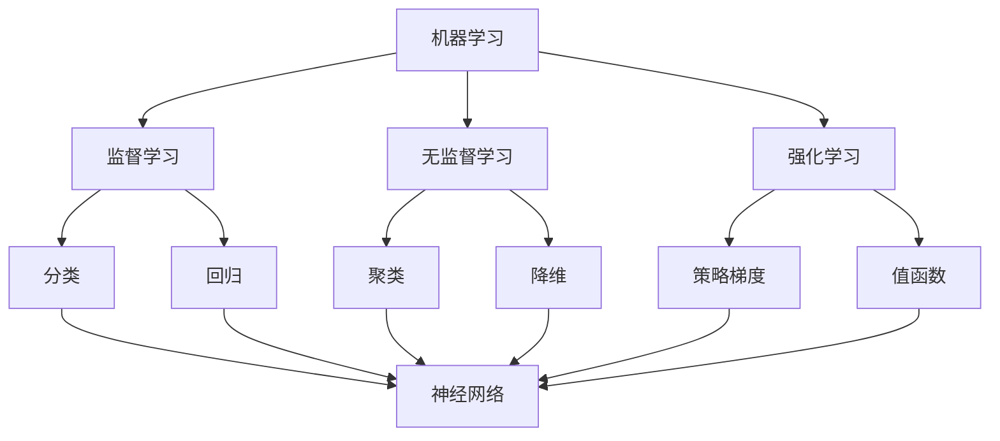

                 

关键词：人工智能，未来，发展，机遇，技术趋势，算法，模型，应用场景

> 摘要：本文旨在探讨人工智能领域的发展机遇，分析当前技术的进步，探讨未来的应用前景，并讨论人工智能技术面临的发展挑战。本文将深入解析人工智能的核心算法、数学模型、实践应用，同时提供相关的工具和资源推荐，以期为读者提供全面的人工智能技术发展概览。

## 1. 背景介绍

人工智能（Artificial Intelligence，简称 AI）作为计算机科学的一个分支，旨在创建智能机器，使其能够执行通常需要人类智能的任务。自20世纪50年代诞生以来，人工智能经历了多个发展阶段，从早期的符号主义、连接主义到现在的深度学习，每个阶段都有其独特的理论和应用成就。

安德烈·卡帕西（Andrej Karpathy）是一位在人工智能领域享有盛誉的研究者和工程师。他是深度学习领域的先驱者之一，对自然语言处理、计算机视觉等领域有着重要贡献。他的研究成果和论文在学术界和工业界都有着广泛的影响力。

当前，人工智能已经成为全球科技发展的重要驱动力。从自动驾驶汽车、智能助手到医疗诊断、金融分析，人工智能的应用已经渗透到我们日常生活的方方面面。随着计算能力的提升、数据的丰富和算法的创新，人工智能技术的进步速度前所未有。

## 2. 核心概念与联系

为了深入理解人工智能的核心概念，我们需要探讨几个关键领域：机器学习、深度学习和神经网络。以下是一个简化的Mermaid流程图，描述这些概念之间的联系。



### 2.1 机器学习

机器学习是人工智能的基础，它涉及通过数据来训练算法，使其能够进行预测或决策。根据训练数据的不同，机器学习可以分为三种主要类型：监督学习、无监督学习和强化学习。

- **监督学习**：在这种学习中，算法通过已标记的数据来学习，从而预测新的数据。分类和回归是监督学习的两个主要任务。
- **无监督学习**：算法在未标记的数据中寻找模式，如聚类和降维。
- **强化学习**：在这种学习中，算法通过与环境的交互来学习最优策略，通常用于决策问题和控制问题。

### 2.2 深度学习

深度学习是机器学习的一个分支，它使用神经网络，特别是多层神经网络，来学习数据的复杂表示。深度学习在图像识别、语音识别和自然语言处理等领域取得了显著的突破。

### 2.3 神经网络

神经网络是模仿人脑工作的计算模型，由大量简单的处理单元（神经元）组成。每个神经元都与其它神经元相连，通过权重传递信息。深度学习中的多层神经网络可以通过学习大量数据来捕捉数据的层次结构。

## 3. 核心算法原理 & 具体操作步骤

### 3.1 算法原理概述

人工智能的核心算法之一是卷积神经网络（Convolutional Neural Networks，简称 CNN）。CNN 特别适合处理具有网格结构的数据，如图像。以下是 CNN 的基本原理和步骤：

1. **卷积层**：通过卷积操作捕捉数据的局部特征。
2. **池化层**：降低数据的维度，减少计算量和过拟合的风险。
3. **全连接层**：将卷积层和池化层的输出映射到类别或预测值。

### 3.2 算法步骤详解

1. **初始化参数**：设定卷积核、池化窗口和神经元权重。
2. **前向传播**：输入数据通过卷积层和池化层，最后到达全连接层。
3. **反向传播**：计算损失函数，更新参数以最小化损失。
4. **训练**：重复前向传播和反向传播，直到模型收敛。

### 3.3 算法优缺点

**优点**：

- **强大的特征提取能力**：能够自动学习数据的复杂特征。
- **并行计算**：适用于大规模数据处理。

**缺点**：

- **计算量大**：训练时间较长。
- **过拟合风险**：对训练数据的拟合过于紧密。

### 3.4 算法应用领域

CNN 在图像识别、目标检测和视频分析等领域有着广泛的应用。例如，在自动驾驶中，CNN 用于识别道路上的行人和车辆；在医疗影像分析中，CNN 用于诊断肿瘤和病变。

## 4. 数学模型和公式 & 详细讲解 & 举例说明

### 4.1 数学模型构建

CNN 的数学模型主要包括卷积操作、激活函数、池化和反向传播。

### 4.2 公式推导过程

#### 卷积操作

卷积操作的公式为：

$$
(f * g)(x) = \sum_{y} f(y) g(x - y)
$$

其中，\(f\) 和 \(g\) 是两个函数，\(x\) 和 \(y\) 是变量。

#### 激活函数

常用的激活函数有 sigmoid、ReLU 和 tanh。

- **Sigmoid**:

$$
\sigma(x) = \frac{1}{1 + e^{-x}}
$$

- **ReLU**:

$$
\text{ReLU}(x) = \max(0, x)
$$

- **Tanh**:

$$
\tanh(x) = \frac{e^x - e^{-x}}{e^x + e^{-x}}
$$

#### 池化

池化通常使用最大值池化或平均值池化。

- **最大值池化**:

$$
P_{max}(x) = \max_{y \in \Omega} x(y)
$$

其中，\(\Omega\) 是池化窗口。

- **平均值池化**:

$$
P_{mean}(x) = \frac{1}{|\Omega|} \sum_{y \in \Omega} x(y)
$$

### 4.3 案例分析与讲解

以下是一个简化的 CNN 算法示例，用于对图像进行分类。

```python
import numpy as np

# 初始化参数
weights = np.random.rand(3, 3, 3)
biases = np.random.rand(3)

# 前向传播
input_data = np.array([[0, 1, 0], [0, 0, 1], [1, 0, 0]])
conv_output = np.convolve(input_data, weights, 'same')
relu_output = np.maximum(0, conv_output + biases)

# 池化
pool_output = np.max(relu_output, axis=1)

# 输出
print("Output:", pool_output)
```

## 5. 项目实践：代码实例和详细解释说明

### 5.1 开发环境搭建

要实践 CNN 算法，我们需要安装 Python、NumPy 和 TensorFlow 等库。

```bash
pip install numpy tensorflow
```

### 5.2 源代码详细实现

以下是一个简单的 CNN 模型，用于图像分类。

```python
import tensorflow as tf

# 创建 TensorFlow 图
with tf.Graph().as_default():
    # 输入数据
    inputs = tf.placeholder(tf.float32, [None, 28, 28, 1])
    
    # 卷积层
    conv1 = tf.layers.conv2d(inputs, 32, 5, activation=tf.nn.relu)
    
    # 池化层
    pool1 = tf.layers.max_pooling2d(conv1, 2, 2)
    
    # 全连接层
    flatten = tf.reshape(pool1, [-1, 7 * 7 * 32])
    dense = tf.layers.dense(flatten, 128, activation=tf.nn.relu)
    
    # 输出层
    outputs = tf.layers.dense(dense, 10)
    
    # 定义损失函数和优化器
    logits = outputs
    labels = tf.placeholder(tf.int64, [None])
    loss = tf.reduce_mean(tf.nn.sparse_softmax_cross_entropy_with_logits(labels=labels, logits=logits))
    optimizer = tf.train.AdamOptimizer().minimize(loss)
    
    # 训练模型
    with tf.Session() as sess:
        sess.run(tf.global_variables_initializer())
        
        for step in range(1000):
            batch_x, batch_y = ...  # 获取训练数据
            _, loss_val = sess.run([optimizer, loss], feed_dict={inputs: batch_x, labels: batch_y})
            
            if step % 100 == 0:
                acc = ...  # 计算准确率
                print("Step:", step, "Loss:", loss_val, "Accuracy:", acc)

# 评估模型
test_x, test_y = ...  # 获取测试数据
predictions = sess.run(logits, feed_dict={inputs: test_x})
accuracy = ...  # 计算测试准确率
print("Test Accuracy:", accuracy)
```

### 5.3 代码解读与分析

- **输入数据**：输入数据是 28x28 的灰度图像，每个图像包含一个通道。
- **卷积层**：使用 5x5 的卷积核，输出特征图的大小为 28x28x32。
- **池化层**：使用 2x2 的最大值池化，输出特征图的大小为 14x14x32。
- **全连接层**：将池化层的输出展平为一维向量，然后通过一个 128 单元的全连接层。
- **输出层**：使用 10 个单

