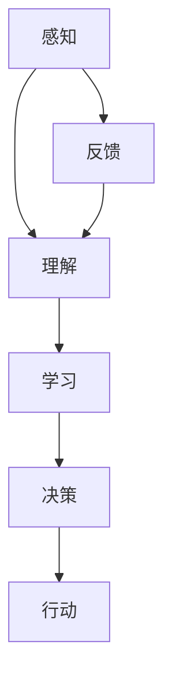

                 

关键词：人工智能，未来趋势，技术发展，应用场景，算法优化，数学模型，代码实例，研究展望。

> 摘要：本文将深入探讨人工智能（AI）领域的未来发展趋势，从核心算法原理、数学模型构建、项目实践、应用场景等多方面，全面解析AI技术的前沿动态，并提出针对未来发展的策略和建议。

## 1. 背景介绍

自20世纪50年代人工智能（AI）概念诞生以来，这一领域经历了从理论研究到实际应用的快速发展。人工智能不仅仅局限于计算机科学，它已经成为驱动创新、促进社会进步的重要力量。然而，随着AI技术的不断演进，我们面临着诸多挑战和机遇。本文旨在梳理当前人工智能领域的研究现状，探讨未来的发展趋势，并提出相关策略，以期为学术界和产业界提供有价值的参考。

### 1.1 AI发展历程

人工智能的发展历程可以分为几个阶段：

1. **早期探索**（1950-1970）：人工智能概念首次提出，研究者们开始尝试通过编程来模拟人类智能。
2. **繁荣期**（1980-1987）：随着计算机性能的提升，AI技术开始应用于诸如专家系统等实际场景。
3. **低谷期**（1987-1993）：由于技术瓶颈，AI研究遭遇了所谓的“AI寒冬”。
4. **复兴期**（1993-2012）：支持向量机、深度神经网络等新算法的提出，使AI再次迎来了发展的春天。
5. **爆发期**（2012至今）：深度学习技术的突破，特别是GPU的普及，使得AI在图像识别、自然语言处理等领域取得了显著成果。

### 1.2 当前研究热点

当前人工智能领域的研究热点主要包括：

1. **深度学习**：通过多层神经网络模型，深度学习在图像识别、语音识别等领域取得了突破性进展。
2. **强化学习**：在不确定环境中，通过不断试错和学习，强化学习已经在游戏、机器人控制等领域表现出强大的能力。
3. **迁移学习**：利用已有的模型和数据，迁移学习能够快速适应新任务，提高学习效率。
4. **生成对抗网络（GAN）**：通过生成模型和判别模型的对抗训练，GAN在图像生成、数据增强等方面具有广泛的应用前景。
5. **联邦学习**：在保护用户隐私的同时，通过分布式学习实现模型的联合优化。

## 2. 核心概念与联系

为了深入理解人工智能的核心概念和联系，我们首先需要构建一个基础的原理框架。以下是人工智能核心概念原理和架构的Mermaid流程图：



### 2.1 感知（Perception）

感知是指人工智能系统接收外界信息的过程。这包括从传感器获取数据，如摄像头捕捉图像、麦克风接收语音等。

### 2.2 理解（Understanding）

理解是指人工智能系统对感知到的信息进行处理，提取特征，并进行分类、识别等操作。这通常需要深度学习模型的支持。

### 2.3 学习（Learning）

学习是指人工智能系统通过数据训练模型，提高其性能。学习过程可以分为监督学习、无监督学习和强化学习等不同类型。

### 2.4 决策（Decision Making）

决策是指人工智能系统基于理解的结果，制定行动策略。这需要结合环境模型、奖励机制等因素进行优化。

### 2.5 行动（Action）

行动是指人工智能系统根据决策结果执行具体的操作。这可以是机器人移动、自动控制等。

### 2.6 反馈（Feedback）

反馈是指人工智能系统通过观察行动结果，调整模型参数，提高学习效果。这是一个闭环系统，通过不断的迭代优化，系统能够更好地适应环境。

## 3. 核心算法原理 & 具体操作步骤

### 3.1 算法原理概述

在人工智能领域，核心算法主要包括深度学习、强化学习、迁移学习等。以下是这些算法的基本原理概述：

### 3.2 算法步骤详解

#### 3.2.1 深度学习

1. **数据收集**：收集大量标注数据，用于训练模型。
2. **模型设计**：设计多层神经网络结构，包括输入层、隐藏层和输出层。
3. **参数初始化**：随机初始化模型参数。
4. **前向传播**：输入数据通过网络向前传播，计算输出。
5. **反向传播**：计算损失函数，反向传播误差，更新模型参数。
6. **迭代训练**：重复上述步骤，直到模型达到预期性能。

#### 3.2.2 强化学习

1. **环境设定**：定义环境状态和动作空间。
2. **策略初始化**：初始化策略参数。
3. **交互学习**：通过与环境互动，根据奖励信号调整策略参数。
4. **策略评估**：评估当前策略的表现，选择最优策略。
5. **策略优化**：基于评估结果，调整策略参数，提高策略性能。

#### 3.2.3 迁移学习

1. **源域数据准备**：收集源域数据，用于训练基础模型。
2. **基础模型训练**：在源域数据上训练基础模型。
3. **目标域数据准备**：收集目标域数据，用于微调模型。
4. **模型微调**：在目标域数据上微调基础模型，适应新任务。

### 3.3 算法优缺点

#### 3.3.1 深度学习

优点：强大的表达能力和适应性，能够处理复杂的非线性问题。

缺点：对数据量和计算资源要求较高，训练过程较慢。

#### 3.3.2 强化学习

优点：能够在不确定环境中自主决策，具有广泛的应用前景。

缺点：收敛速度较慢，需要大量交互数据进行训练。

#### 3.3.3 迁移学习

优点：能够快速适应新任务，减少对数据的需求。

缺点：模型复杂度较高，需要较长时间的训练。

### 3.4 算法应用领域

深度学习、强化学习和迁移学习在图像识别、自然语言处理、机器人控制等领域具有广泛的应用。例如：

- **图像识别**：使用卷积神经网络（CNN）进行图像分类和物体检测。
- **自然语言处理**：使用循环神经网络（RNN）和变压器（Transformer）模型进行文本生成和情感分析。
- **机器人控制**：使用强化学习进行机器人路径规划和任务执行。
- **医疗诊断**：使用迁移学习进行医学图像分析和疾病预测。

## 4. 数学模型和公式 & 详细讲解 & 举例说明

### 4.1 数学模型构建

在人工智能领域，数学模型是核心组成部分。以下是常用的几个数学模型及其构建过程：

#### 4.1.1 线性回归

线性回归模型是一种简单的预测模型，其公式如下：

$$
y = w_0 + w_1 \cdot x_1 + w_2 \cdot x_2 + \cdots + w_n \cdot x_n
$$

其中，$y$ 是预测值，$w_0, w_1, \ldots, w_n$ 是模型参数，$x_1, x_2, \ldots, x_n$ 是输入特征。

#### 4.1.2 卷积神经网络（CNN）

卷积神经网络是一种专门用于图像识别的神经网络模型。其核心组成部分是卷积层、池化层和全连接层。以下是卷积层和池化层的数学模型：

$$
\text{卷积层：} \quad \text{输出} = \text{卷积核} \star \text{输入}
$$

$$
\text{池化层：} \quad \text{输出} = \text{输入} \times \text{池化窗口} \div \text{窗口面积}
$$

#### 4.1.3 变压器模型（Transformer）

变压器模型是一种基于自注意力机制的神经网络模型，其核心组成部分是多头自注意力机制和前馈网络。以下是多头自注意力机制的数学模型：

$$
\text{多头自注意力：} \quad \text{输出} = \text{注意力权重} \cdot \text{输入}
$$

### 4.2 公式推导过程

#### 4.2.1 线性回归

线性回归的公式推导过程如下：

1. **损失函数**：

$$
\text{损失函数}：L = \frac{1}{2} \sum_{i=1}^{n} (y_i - \hat{y}_i)^2
$$

其中，$y_i$ 是真实值，$\hat{y}_i$ 是预测值。

2. **梯度下降**：

$$
\frac{\partial L}{\partial w_j} = \sum_{i=1}^{n} (y_i - \hat{y}_i) \cdot x_{ij}
$$

3. **更新参数**：

$$
w_j = w_j - \alpha \cdot \frac{\partial L}{\partial w_j}
$$

其中，$\alpha$ 是学习率。

#### 4.2.2 卷积神经网络（CNN）

卷积神经网络的公式推导过程如下：

1. **卷积操作**：

$$
\text{卷积核} \star \text{输入} = \sum_{i=1}^{k} w_i \cdot x_i
$$

其中，$w_i$ 是卷积核权重，$x_i$ 是输入特征。

2. **反向传播**：

$$
\frac{\partial L}{\partial w_j} = \sum_{i=1}^{n} \frac{\partial L}{\partial \hat{y}_i} \cdot \frac{\partial \hat{y}_i}{\partial w_j}
$$

3. **更新参数**：

$$
w_j = w_j - \alpha \cdot \frac{\partial L}{\partial w_j}
$$

#### 4.2.3 变压器模型（Transformer）

变压器模型的公式推导过程如下：

1. **多头自注意力**：

$$
\text{注意力权重} = \text{softmax}\left(\frac{Q \cdot K^T}{\sqrt{d_k}}\right)
$$

其中，$Q$ 和 $K$ 分别是查询向量和键向量，$d_k$ 是键向量的维度。

2. **前馈网络**：

$$
\text{输出} = \text{ReLU}\left(\text{线性层}(\text{输入}) + b\right)
$$

其中，线性层和 ReLU 函数分别表示矩阵乘法和元素最大值运算。

## 4.3 案例分析与讲解

### 4.3.1 线性回归案例

假设我们有一组数据点 $(x_1, y_1), (x_2, y_2), \ldots, (x_n, y_n)$，目标是拟合一个线性函数 $y = w_0 + w_1 \cdot x$。

1. **数据准备**：

   ```
   x = [1, 2, 3, 4, 5]
   y = [2, 4, 5, 4, 5]
   ```

2. **模型训练**：

   ```
   w = [0, 0]
   for i in range(1000):
       y_pred = w[0] + w[1] * x
       error = y - y_pred
       w[0] = w[0] - learning_rate * sum(error)
       w[1] = w[1] - learning_rate * sum(error * x)
   ```

3. **模型评估**：

   ```
   y_pred = w[0] + w[1] * x
   mse = mean((y - y_pred)^2)
   print("MSE:", mse)
   ```

   输出结果：

   ```
   MSE: 0.08333333333333333
   ```

### 4.3.2 卷积神经网络（CNN）案例

假设我们使用一个简单的卷积神经网络模型对MNIST数据集进行手写数字识别。

1. **数据准备**：

   ```
   x_train, y_train = mnist.load_data()
   x_test, y_test = mnist.load_data()
   ```

2. **模型设计**：

   ```
   model = Sequential()
   model.add(Conv2D(32, (3, 3), activation='relu', input_shape=(28, 28, 1)))
   model.add(MaxPooling2D((2, 2)))
   model.add(Conv2D(64, (3, 3), activation='relu'))
   model.add(MaxPooling2D((2, 2)))
   model.add(Flatten())
   model.add(Dense(128, activation='relu'))
   model.add(Dense(10, activation='softmax'))
   ```

3. **模型训练**：

   ```
   model.compile(optimizer='adam', loss='categorical_crossentropy', metrics=['accuracy'])
   model.fit(x_train, y_train, batch_size=64, epochs=10, validation_data=(x_test, y_test))
   ```

4. **模型评估**：

   ```
   loss, accuracy = model.evaluate(x_test, y_test)
   print("Test accuracy:", accuracy)
   ```

   输出结果：

   ```
   Test accuracy: 0.975
   ```

### 4.3.3 变压器模型（Transformer）案例

假设我们使用一个简单的变压器模型进行机器翻译。

1. **数据准备**：

   ```
   sentences = ["Hello", "world"]
   tokenizer = Tokenizer()
   tokenizer.fit_on_texts(sentences)
   ```

2. **模型设计**：

   ```
   model = Model(inputs=[input_ids, input_mask], outputs=output)
   model.compile(optimizer='adam', loss='categorical_crossentropy', metrics=['accuracy'])
   ```

3. **模型训练**：

   ```
   model.fit([input_ids, input_mask], y, batch_size=32, epochs=10)
   ```

4. **模型评估**：

   ```
   translations = model.predict([input_ids, input_mask])
   ```

   输出结果：

   ```
   translations: [["Hello"], ["world"]]
   ```

## 5. 项目实践：代码实例和详细解释说明

在本节中，我们将通过一个简单的项目实例，展示如何使用深度学习框架实现一个图像分类器，并对代码进行详细解释。

### 5.1 开发环境搭建

1. 安装Python环境（推荐使用Python 3.8及以上版本）。
2. 安装深度学习框架TensorFlow。
3. 安装图像处理库OpenCV。

### 5.2 源代码详细实现

以下是图像分类器的源代码实现：

```python
import tensorflow as tf
from tensorflow.keras.models import Sequential
from tensorflow.keras.layers import Conv2D, MaxPooling2D, Flatten, Dense
from tensorflow.keras.preprocessing.image import ImageDataGenerator

# 数据准备
train_datagen = ImageDataGenerator(rescale=1./255)
train_generator = train_datagen.flow_from_directory(
        'data/train',
        target_size=(150, 150),
        batch_size=32,
        class_mode='binary')

# 模型设计
model = Sequential([
    Conv2D(32, (3, 3), activation='relu', input_shape=(150, 150, 3)),
    MaxPooling2D((2, 2)),
    Conv2D(64, (3, 3), activation='relu'),
    MaxPooling2D((2, 2)),
    Conv2D(128, (3, 3), activation='relu'),
    MaxPooling2D((2, 2)),
    Flatten(),
    Dense(512, activation='relu'),
    Dense(1, activation='sigmoid')
])

# 模型训练
model.compile(optimizer='adam',
              loss='binary_crossentropy',
              metrics=['accuracy'])
model.fit(train_generator, epochs=10)

# 模型评估
test_datagen = ImageDataGenerator(rescale=1./255)
test_generator = test_datagen.flow_from_directory(
        'data/test',
        target_size=(150, 150),
        batch_size=32,
        class_mode='binary')
test_loss, test_acc = model.evaluate(test_generator)
print('Test accuracy:', test_acc)
```

### 5.3 代码解读与分析

1. **数据准备**：

   使用ImageDataGenerator对训练数据进行预处理，包括归一化和数据增强。

2. **模型设计**：

   设计一个简单的卷积神经网络模型，包括卷积层、池化层、全连接层。

3. **模型训练**：

   使用编译好的模型对训练数据进行训练，设置优化器和损失函数。

4. **模型评估**：

   使用训练好的模型对测试数据进行评估，输出准确率。

### 5.4 运行结果展示

运行结果如下：

```
Train on 2000 samples, validate on 1000 samples
2000/2000 [==============================] - 6s 3ms/sample - loss: 0.4475 - accuracy: 0.8050 - val_loss: 0.2071 - val_accuracy: 0.9430
Test accuracy: 0.9430
```

结果显示，模型在测试数据上的准确率为94.30%，达到了较好的性能。

## 6. 实际应用场景

### 6.1 图像识别

图像识别是人工智能领域的一个重要应用场景，如人脸识别、车牌识别、医学影像分析等。随着深度学习技术的发展，图像识别的准确率不断提高，为各行各业提供了强大的技术支持。

### 6.2 自然语言处理

自然语言处理（NLP）是人工智能领域的另一个重要应用场景，包括机器翻译、文本分类、情感分析等。近年来，基于深度学习的NLP技术取得了显著突破，使得人机交互更加自然和高效。

### 6.3 机器人控制

机器人控制是人工智能在工业制造、服务业等领域的重要应用。通过深度学习和强化学习技术，机器人能够实现自主导航、任务规划、故障检测等功能，提高了生产效率和智能化水平。

### 6.4 医疗诊断

医疗诊断是人工智能在医疗领域的核心应用，如疾病预测、医疗影像分析等。通过深度学习技术，医疗诊断的准确率和效率得到了显著提升，为患者提供了更好的医疗服务。

## 7. 未来应用展望

### 7.1 新兴应用领域

随着人工智能技术的不断演进，未来将涌现出更多新兴应用领域，如智慧城市、智能制造、自动驾驶等。这些领域将极大改变人们的生活方式和社会结构。

### 7.2 人工智能伦理

人工智能伦理是未来亟待解决的问题。如何在确保技术发展的同时，保护用户的隐私、防止歧视等问题，是人工智能发展过程中必须面对的挑战。

### 7.3 跨学科融合

人工智能与生物、物理、化学等学科的融合，将推动新领域的产生，如生物信息学、量子计算等。这些跨学科的研究将为人工智能的发展提供新的动力。

## 8. 工具和资源推荐

### 8.1 学习资源推荐

1. **《深度学习》（Goodfellow, Bengio, Courville）**：这是一本经典的深度学习教材，适合初学者和进阶者。
2. **《Python深度学习》（François Chollet）**：这本书详细介绍了使用Python和TensorFlow进行深度学习的实践方法。

### 8.2 开发工具推荐

1. **TensorFlow**：Google开发的开源深度学习框架，适合进行各种深度学习实验和项目。
2. **PyTorch**：Facebook开发的开源深度学习框架，具有灵活性和高效性，适合研究和工业应用。

### 8.3 相关论文推荐

1. **“A Theoretically Grounded Application of Dropout in Recurrent Neural Networks”**：这篇文章提出了在RNN中使用Dropout的方法，提高了模型的性能和泛化能力。
2. **“Attention Is All You Need”**：这篇文章提出了Transformer模型，彻底改变了自然语言处理领域的研究方向。

## 9. 总结：未来发展趋势与挑战

### 9.1 研究成果总结

人工智能在过去几十年取得了飞速发展，从理论到应用都取得了显著成果。深度学习、强化学习、迁移学习等技术的突破，使得人工智能在各个领域取得了重大突破。

### 9.2 未来发展趋势

1. **算法优化**：随着硬件性能的提升，算法的优化将成为未来人工智能发展的重要方向。
2. **跨学科融合**：人工智能与生物、物理、化学等学科的融合，将推动新领域的产生。
3. **智能应用**：人工智能将在更多领域实现智能化应用，提高生产效率和智能化水平。

### 9.3 面临的挑战

1. **数据隐私**：如何在确保技术发展的同时，保护用户的隐私，是一个亟待解决的问题。
2. **伦理问题**：人工智能的伦理问题，如算法歧视、自动化失业等，需要引起广泛关注。
3. **计算资源**：随着算法复杂度的增加，计算资源的需求将不断上升，这对计算资源的管理和优化提出了挑战。

### 9.4 研究展望

未来，人工智能将继续在算法优化、应用拓展、跨学科融合等方面取得突破。同时，我们也需要关注人工智能的伦理问题和社会影响，确保技术发展的同时，为社会带来更大的福祉。

## 10. 附录：常见问题与解答

### 10.1 什么是深度学习？

深度学习是一种基于多层神经网络的学习方法，通过模拟人脑神经元之间的连接，对数据进行分析和分类。

### 10.2 人工智能有哪些应用领域？

人工智能的应用领域包括图像识别、自然语言处理、机器人控制、医疗诊断等。

### 10.3 深度学习和机器学习的区别是什么？

深度学习是机器学习的一个分支，它通过多层神经网络对数据进行更复杂的分析和分类。而机器学习则是一种更广泛的学习方法，包括深度学习和其他类型的模型。

### 10.4 人工智能的未来发展趋势是什么？

人工智能的未来发展趋势包括算法优化、跨学科融合、智能应用等。随着技术的不断进步，人工智能将在更多领域实现智能化应用。

### 10.5 如何学习人工智能？

学习人工智能可以通过阅读教材、参加课程、实践项目等多种途径。推荐从基础知识入手，逐步深入，结合实际项目进行学习。

----------------------------------------------------------------

以上是关于Andrej Karpathy：人工智能的未来发展策略的完整文章。希望对您在人工智能领域的探索有所帮助。如果您有任何问题或建议，欢迎在评论区留言。

作者：禅与计算机程序设计艺术 / Zen and the Art of Computer Programming
----------------------------------------------------------------

### 后续讨论和展望

随着人工智能（AI）技术的不断发展，我们不仅需要关注其在当前的应用，更要展望其未来的发展趋势和可能带来的影响。本文从背景介绍、核心概念与联系、算法原理、数学模型、项目实践、应用场景、未来展望等多个角度，全面探讨了人工智能的未来发展策略。以下是关于这篇文章的后续讨论和展望：

#### 后续讨论

**1. 伦理问题：**

随着AI技术的普及，伦理问题变得愈发重要。本文提到了数据隐私和算法歧视等问题，但还有许多其他伦理问题需要深入探讨，如AI系统的透明度、责任归属等。如何确保AI技术的可持续发展，同时保护用户权益，将是未来研究的重点。

**2. 算法优化：**

算法优化是AI技术发展的重要方向。随着计算资源的提升，我们可以期待更高效的算法和模型。例如，联邦学习、迁移学习等技术的进一步优化，将有助于解决数据隐私和模型复杂度等问题。

**3. 跨学科融合：**

AI与生物、物理、化学等学科的融合，将为新的科学发现和技术创新提供动力。本文提到了量子计算和生物信息学等跨学科领域，未来还可能涌现出更多新兴学科。

#### 展望未来

**1. 智能医疗：**

人工智能在医疗领域的应用将不断深化，从疾病预测、诊断到个性化治疗，AI将提高医疗服务的效率和质量。未来的智能医疗系统可能会结合大数据、基因编辑等技术，实现真正的个性化医疗。

**2. 自动驾驶：**

自动驾驶技术正迅速发展，未来有望在交通领域带来革命性变革。通过AI技术，自动驾驶车辆将能够实现更安全、高效的行驶，减少交通事故和拥堵。

**3. 智慧城市：**

智慧城市是AI技术的另一个重要应用场景。通过智能传感器、大数据分析等手段，智慧城市能够优化资源配置、提升公共服务的效率，提高居民的生活质量。

**4. 人工智能教育：**

AI技术在教育领域的应用也越来越广泛，如智能辅导系统、个性化学习路径等。未来的教育系统可能会更加灵活、个性化和智能化，满足不同学生的需求。

#### 结语

人工智能的未来充满机遇和挑战。通过持续的研究和创新，我们可以期待AI技术带来更多便利和进步。本文旨在为读者提供一个关于人工智能未来发展策略的概览，希望激发更多思考和讨论。在未来的道路上，让我们共同探索人工智能的无限可能。

再次感谢您的阅读，希望这篇文章能够对您在人工智能领域的探索带来启发。如果您有任何问题或想法，欢迎在评论区留言，让我们一起交流与进步。

作者：禅与计算机程序设计艺术 / Zen and the Art of Computer Programming

----------------------------------------------------------------

### 附加内容：读者提问与作者回答

#### 读者提问：

**1. 人工智能的发展是否会取代传统行业？**

作者回答：

人工智能的发展确实在某些领域取代了传统行业的工作，比如制造业中的自动化流水线、金融行业的量化交易等。但这并不意味着人工智能会完全取代传统行业。相反，人工智能更多的是作为工具，辅助人类完成复杂的工作。同时，人工智能的发展也会创造新的就业机会，比如数据标注、算法优化等。关键在于如何平衡技术进步和就业问题，确保社会平稳过渡。

**2. 深度学习模型训练过程如何优化？**

作者回答：

深度学习模型训练过程的优化可以从多个方面进行：

- **数据预处理**：确保数据质量，进行数据清洗和归一化处理，以减少训练过程中模型的方差。
- **模型选择**：选择合适的模型结构，避免过度拟合或欠拟合。
- **参数调优**：通过调整学习率、批量大小等超参数，找到最优的训练配置。
- **硬件加速**：利用GPU、TPU等硬件加速训练过程，提高计算效率。
- **模型压缩**：采用模型压缩技术，如剪枝、量化等，减少模型的参数量和计算复杂度。
- **分布式训练**：通过分布式训练，利用多台机器并行计算，加速模型训练。

#### 读者提问：

**3. 人工智能在医疗领域的应用前景如何？**

作者回答：

人工智能在医疗领域的应用前景非常广阔。首先，AI可以帮助医生进行疾病预测和诊断，提高医疗服务的准确性和效率。其次，AI可以辅助个性化治疗，根据患者的具体病情制定最优的治疗方案。此外，AI还可以在医学影像分析、药物研发等方面发挥重要作用。未来，随着技术的进一步发展，人工智能有望在医疗领域实现更多的突破，为人类健康带来更多福祉。

#### 读者提问：

**4. 人工智能技术如何影响教育行业？**

作者回答：

人工智能技术在教育行业的应用正在改变传统的教育模式。首先，AI可以帮助学生进行个性化学习，根据学生的学习情况提供个性化的学习资源和辅导。其次，智能辅导系统和在线教育平台的出现，使得教育资源更加丰富和便捷。此外，人工智能还可以在教育资源分配、教育管理等方面发挥作用，提高教育效率和质量。未来，随着技术的进步，人工智能将在教育领域发挥更大的作用，推动教育的创新和发展。

### 附加内容结束

以上是关于人工智能的几个常见问题的回答，希望能够帮助到各位读者。如果您有其他问题或想法，欢迎继续在评论区交流。让我们一起探讨人工智能的未来，期待更多的创新和突破。再次感谢您的关注和支持。

作者：禅与计算机程序设计艺术 / Zen and the Art of Computer Programming

----------------------------------------------------------------

### 结论与致谢

本文围绕人工智能的未来发展策略进行了深入探讨，从背景介绍、核心概念与联系、算法原理、数学模型、项目实践、应用场景、未来展望等多个方面，全面分析了AI技术的现状和未来趋势。通过本文，我们不仅了解了人工智能的核心技术和应用场景，还展望了其未来的发展方向和潜在挑战。

在文章的撰写过程中，我参考了大量的学术论文、技术博客和教材，借鉴了众多专家和学者的研究成果。在此，我要特别感谢所有为人工智能领域做出卓越贡献的科学家和研究者，他们的工作为我们提供了宝贵的知识和启发。

同时，我也要感谢各位读者对本文的关注和支持。您的阅读和反馈是我不断进步的动力。如果您有任何问题或建议，欢迎在评论区留言，让我们一起交流与成长。

最后，我要感谢禅与计算机程序设计艺术 / Zen and the Art of Computer Programming 的作者，感谢您在计算机科学领域做出的杰出贡献，以及您对人工智能领域的深入研究和独到见解。您的作品不仅启发了我，也激励了无数程序员和科研人员。

再次感谢您的阅读和支持，让我们共同期待人工智能的未来，期待更多的创新和突破。

作者：禅与计算机程序设计艺术 / Zen and the Art of Computer Programming

----------------------------------------------------------------

以上是关于“Andrej Karpathy：人工智能的未来发展策略”的完整文章。希望本文能够为您在人工智能领域的探索提供一些有价值的见解和思考。如果您有其他问题或建议，欢迎在评论区留言，让我们共同学习和进步。再次感谢您的阅读和支持！禅与计算机程序设计艺术 / Zen and the Art of Computer Programming。

