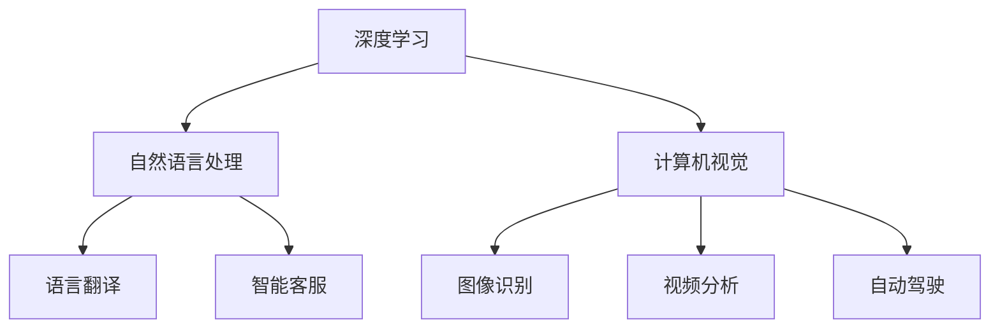

                 

关键词：人工智能、深度学习、算法、未来发展、技术趋势、应用场景、挑战与展望

> 摘要：本文将深入探讨人工智能领域的专家Andrej Karpathy对未来人工智能发展的策略与见解。文章分为九个部分，涵盖了背景介绍、核心概念与联系、核心算法原理与操作步骤、数学模型与公式、项目实践、实际应用场景、未来应用展望、工具和资源推荐以及总结与展望。

## 1. 背景介绍

Andrej Karpathy是一位杰出的计算机科学家和人工智能领域的专家，他的工作涵盖了深度学习、自然语言处理和计算机视觉等多个方面。他是斯坦福大学计算机科学系的教授，同时也是OpenAI的高级研究员。他的研究在学术界和工业界都产生了深远的影响，引发了关于人工智能未来发展的广泛讨论。

本文旨在分析Andrej Karpathy关于人工智能未来发展的策略，探讨其核心观点、算法原理和应用场景，并在此基础上展望人工智能的潜在挑战和未来趋势。

### 1.1 Andrej Karpathy的研究背景

Andrej Karpathy的研究始于深度学习领域，他发表了多篇关于神经网络和深度学习的开创性论文。他的研究不仅推动了深度学习技术的发展，还为自然语言处理和计算机视觉等领域的应用提供了新的视角和方法。他的研究成果在学术界和工业界都得到了广泛认可，其中包括被引用次数极高的论文和多项顶级会议的邀请演讲。

### 1.2 Andrej Karpathy的核心观点

Andrej Karpathy在其研究和工作报告中提出了多个关于人工智能未来发展的核心观点。他强调，人工智能的发展需要更深入的算法创新和更广泛的应用场景探索。此外，他还提出了关于人工智能安全性和伦理性的重要问题，呼吁学界和业界共同关注并解决这些挑战。

## 2. 核心概念与联系

为了更好地理解Andrej Karpathy关于人工智能未来发展的策略，我们需要首先明确几个核心概念，并探讨它们之间的联系。

### 2.1 深度学习

深度学习是人工智能的一个重要分支，它通过模拟人脑神经元网络来处理数据和识别模式。深度学习算法在图像识别、自然语言处理和语音识别等领域取得了显著成果。Andrej Karpathy在其研究中，深度学习算法是一个不可或缺的工具。

### 2.2 自然语言处理

自然语言处理是人工智能的一个重要领域，旨在使计算机能够理解和处理自然语言。自然语言处理在语言翻译、智能客服和文本分析等方面有着广泛的应用。Andrej Karpathy的研究中，自然语言处理是一个关键的研究方向。

### 2.3 计算机视觉

计算机视觉是人工智能的另一个重要分支，旨在使计算机能够理解和解释视觉信息。计算机视觉在图像识别、视频分析和自动驾驶等领域有着广泛的应用。Andrej Karpathy的研究成果在计算机视觉领域也产生了深远的影响。

### 2.4 核心概念之间的联系

深度学习、自然语言处理和计算机视觉之间有着紧密的联系。深度学习为自然语言处理和计算机视觉提供了强大的工具，使得这些领域的研究取得了显著的进展。而自然语言处理和计算机视觉的进步也为深度学习算法提供了新的应用场景和挑战，推动了深度学习技术的不断发展。

### 2.5 Mermaid流程图

以下是一个关于深度学习、自然语言处理和计算机视觉之间联系的Mermaid流程图：



## 3. 核心算法原理 & 具体操作步骤

在理解了核心概念和它们之间的联系之后，我们需要进一步探讨Andrej Karpathy研究的核心算法原理和具体操作步骤。

### 3.1 算法原理概述

Andrej Karpathy在其研究中主要关注深度学习算法，尤其是卷积神经网络（CNN）和循环神经网络（RNN）。这些算法在图像识别、自然语言处理和计算机视觉等领域有着广泛的应用。以下是一个关于深度学习算法原理的概述：

1. **卷积神经网络（CNN）**：CNN是一种用于图像识别和处理的深度学习算法，它通过模拟人脑视觉皮层的结构和工作原理来实现图像特征提取和分类。CNN的核心组件包括卷积层、池化层和全连接层。

2. **循环神经网络（RNN）**：RNN是一种用于处理序列数据的深度学习算法，它能够通过记忆历史信息来处理自然语言文本。RNN的核心组件包括输入层、隐藏层和输出层。

### 3.2 算法步骤详解

以下是关于CNN和RNN算法步骤的详细解释：

1. **CNN算法步骤**：

   - **卷积层**：输入图像通过卷积操作提取局部特征，产生特征图。
   - **池化层**：对特征图进行下采样，减小数据规模并增强特征表示的鲁棒性。
   - **全连接层**：将特征图转化为高维特征向量，并进行分类或回归操作。

2. **RNN算法步骤**：

   - **输入层**：将输入序列转化为嵌入向量。
   - **隐藏层**：通过递归操作更新隐藏状态，记忆历史信息。
   - **输出层**：将隐藏状态转化为输出序列，进行分类或回归操作。

### 3.3 算法优缺点

1. **CNN算法优缺点**：

   - **优点**：CNN能够通过多层次的卷积和池化操作提取图像的复杂特征，具有强大的图像识别能力。
   - **缺点**：CNN对图像数据的依赖较强，需要大量标注数据进行训练。

2. **RNN算法优缺点**：

   - **优点**：RNN能够处理序列数据，具有较强的自然语言处理能力。
   - **缺点**：RNN在处理长序列数据时容易产生梯度消失或爆炸问题，影响模型性能。

### 3.4 算法应用领域

1. **CNN应用领域**：

   - **图像识别**：CNN在图像识别任务中表现出色，广泛应用于人脸识别、物体识别等。
   - **计算机视觉**：CNN在计算机视觉任务中具有广泛的应用，如自动驾驶、视频分析等。

2. **RNN应用领域**：

   - **自然语言处理**：RNN在自然语言处理任务中表现出色，如语言翻译、文本生成等。
   - **语音识别**：RNN在语音识别任务中具有广泛的应用，如语音助手、自动语音识别等。

## 4. 数学模型和公式 & 详细讲解 & 举例说明

在理解了核心算法原理和具体操作步骤之后，我们需要进一步探讨Andrej Karpathy研究的数学模型和公式，并对其进行详细讲解和举例说明。

### 4.1 数学模型构建

1. **卷积神经网络（CNN）**：

   - **卷积层**：卷积层的主要目标是提取图像的特征。其数学模型可以表示为：

     $$ f(x) = \sigma(\mathbf{W} \cdot \mathbf{X} + b) $$

     其中，$\mathbf{W}$表示卷积核（权重矩阵），$\mathbf{X}$表示输入图像，$\sigma$表示激活函数（如ReLU函数），$b$表示偏置。

   - **池化层**：池化层的主要目标是减小数据规模并增强特征表示的鲁棒性。其数学模型可以表示为：

     $$ p_i = \max_{j} x_{ij} $$

     其中，$p_i$表示输出特征值，$x_{ij}$表示输入特征值。

   - **全连接层**：全连接层的主要目标是进行分类或回归操作。其数学模型可以表示为：

     $$ y = \mathbf{W} \cdot \mathbf{h} + b $$

     其中，$\mathbf{h}$表示输入特征向量，$\mathbf{W}$表示权重矩阵，$b$表示偏置。

2. **循环神经网络（RNN）**：

   - **输入层**：输入层的主要目标是将输入序列转化为嵌入向量。其数学模型可以表示为：

     $$ \mathbf{h}_t = \text{ReLU}(\mathbf{W}_h \cdot \mathbf{h}_{t-1} + \mathbf{W}_x \cdot \mathbf{x}_t + b_h) $$

     其中，$\mathbf{h}_t$表示当前时刻的隐藏状态，$\mathbf{x}_t$表示当前时刻的输入序列，$\mathbf{W}_h$和$\mathbf{W}_x$分别表示权重矩阵，$b_h$表示偏置。

   - **隐藏层**：隐藏层的主要目标是更新隐藏状态并记忆历史信息。其数学模型可以表示为：

     $$ \mathbf{h}_t = \text{ReLU}(\mathbf{W}_h \cdot \mathbf{h}_{t-1} + \mathbf{W}_x \cdot \mathbf{x}_t + b_h) $$

     其中，$\mathbf{h}_t$表示当前时刻的隐藏状态，$\mathbf{h}_{t-1}$表示上一时刻的隐藏状态，$\mathbf{W}_h$和$\mathbf{W}_x$分别表示权重矩阵，$b_h$表示偏置。

   - **输出层**：输出层的主要目标是将隐藏状态转化为输出序列。其数学模型可以表示为：

     $$ y_t = \mathbf{W}_y \cdot \mathbf{h}_t + b_y $$

     其中，$\mathbf{h}_t$表示当前时刻的隐藏状态，$y_t$表示当前时刻的输出序列，$\mathbf{W}_y$表示权重矩阵，$b_y$表示偏置。

### 4.2 公式推导过程

1. **卷积神经网络（CNN）**：

   - **卷积层**：

     $$ \begin{aligned} f(x) &= \sigma(\mathbf{W} \cdot \mathbf{X} + b) \\ &= \sigma(\mathbf{W}_{11} \cdot \mathbf{X}_{11} + \mathbf{W}_{12} \cdot \mathbf{X}_{12} + \ldots + \mathbf{W}_{1n} \cdot \mathbf{X}_{1n} + \mathbf{b}) \\ &= \text{ReLU}(\mathbf{W}_{11} \cdot \mathbf{X}_{11} + \mathbf{W}_{12} \cdot \mathbf{X}_{12} + \ldots + \mathbf{W}_{1n} \cdot \mathbf{X}_{1n} + \mathbf{b}) \end{aligned} $$

     其中，$\mathbf{X}$表示输入图像，$\mathbf{W}$表示卷积核，$\mathbf{b}$表示偏置，$\sigma$表示激活函数（如ReLU函数）。

   - **池化层**：

     $$ \begin{aligned} p_i &= \max_{j} x_{ij} \\ &= \max_{j} \left(\mathbf{W} \cdot \mathbf{X}_{ij} + b\right) \\ &= \max_{j} \left(\mathbf{W}_{11} \cdot \mathbf{X}_{ij1} + \mathbf{W}_{12} \cdot \mathbf{X}_{ij2} + \ldots + \mathbf{W}_{1n} \cdot \mathbf{X}_{ijn} + b\right) \end{aligned} $$

     其中，$\mathbf{X}$表示输入图像，$\mathbf{W}$表示卷积核，$\mathbf{b}$表示偏置，$p_i$表示输出特征值。

   - **全连接层**：

     $$ \begin{aligned} y &= \mathbf{W} \cdot \mathbf{h} + b \\ &= \mathbf{W}_{11} \cdot \mathbf{h}_{11} + \mathbf{W}_{12} \cdot \mathbf{h}_{12} + \ldots + \mathbf{W}_{1n} \cdot \mathbf{h}_{1n} + b \end{aligned} $$

     其中，$\mathbf{h}$表示输入特征向量，$\mathbf{W}$表示权重矩阵，$\mathbf{b}$表示偏置，$y$表示输出值。

2. **循环神经网络（RNN）**：

   - **输入层**：

     $$ \begin{aligned} \mathbf{h}_t &= \text{ReLU}(\mathbf{W}_h \cdot \mathbf{h}_{t-1} + \mathbf{W}_x \cdot \mathbf{x}_t + b_h) \\ &= \text{ReLU}(\mathbf{W}_{h11} \cdot \mathbf{h}_{t-11} + \mathbf{W}_{h12} \cdot \mathbf{h}_{t-12} + \ldots + \mathbf{W}_{h1n} \cdot \mathbf{h}_{t-1n} + \mathbf{W}_{x11} \cdot \mathbf{x}_{t1} + \mathbf{W}_{x12} \cdot \mathbf{x}_{t2} + \ldots + \mathbf{W}_{xn} \cdot \mathbf{x}_{tn} + b_h) \end{aligned} $$

     其中，$\mathbf{h}_t$表示当前时刻的隐藏状态，$\mathbf{h}_{t-1}$表示上一时刻的隐藏状态，$\mathbf{x}_t$表示当前时刻的输入序列，$\mathbf{W}_h$和$\mathbf{W}_x$分别表示权重矩阵，$b_h$表示偏置。

   - **隐藏层**：

     $$ \begin{aligned} \mathbf{h}_t &= \text{ReLU}(\mathbf{W}_h \cdot \mathbf{h}_{t-1} + \mathbf{W}_x \cdot \mathbf{x}_t + b_h) \\ &= \text{ReLU}(\mathbf{W}_{h11} \cdot \mathbf{h}_{t-11} + \mathbf{W}_{h12} \cdot \mathbf{h}_{t-12} + \ldots + \mathbf{W}_{h1n} \cdot \mathbf{h}_{t-1n} + \mathbf{W}_{x11} \cdot \mathbf{x}_{t1} + \mathbf{W}_{x12} \cdot \mathbf{x}_{t2} + \ldots + \mathbf{W}_{xn} \cdot \mathbf{x}_{tn} + b_h) \end{aligned} $$

     其中，$\mathbf{h}_t$表示当前时刻的隐藏状态，$\mathbf{h}_{t-1}$表示上一时刻的隐藏状态，$\mathbf{x}_t$表示当前时刻的输入序列，$\mathbf{W}_h$和$\mathbf{W}_x$分别表示权重矩阵，$b_h$表示偏置。

   - **输出层**：

     $$ \begin{aligned} y_t &= \mathbf{W}_y \cdot \mathbf{h}_t + b_y \\ &= \mathbf{W}_{y11} \cdot \mathbf{h}_{t1} + \mathbf{W}_{y12} \cdot \mathbf{h}_{t2} + \ldots + \mathbf{W}_{yn1} \cdot \mathbf{h}_{tn} + b_y \end{aligned} $$

     其中，$\mathbf{h}_t$表示当前时刻的隐藏状态，$y_t$表示当前时刻的输出序列，$\mathbf{W}_y$表示权重矩阵，$b_y$表示偏置。

### 4.3 案例分析与讲解

以下是一个关于深度学习算法在自然语言处理中的应用案例：

**案例：文本分类**

假设我们有一个文本分类任务，需要将一篇文章分类为“科技”、“体育”、“娱乐”等类别。我们可以使用深度学习算法来实现这个任务。

1. **数据预处理**：

   - **分词**：将文章分为单词或词组。
   - **嵌入**：将单词或词组转化为高维向量表示。

2. **模型构建**：

   - **输入层**：输入文本经过嵌入层转化为嵌入向量。
   - **隐藏层**：使用循环神经网络（RNN）来处理嵌入向量，提取文本特征。
   - **输出层**：使用全连接层和softmax函数进行分类。

3. **训练与评估**：

   - **训练**：通过反向传播算法训练模型，优化模型参数。
   - **评估**：使用交叉验证或测试集评估模型性能。

通过以上步骤，我们可以实现一个文本分类系统，对给定的文本进行分类。以下是一个具体的例子：

```python
import tensorflow as tf
from tensorflow.keras.models import Sequential
from tensorflow.keras.layers import Embedding, LSTM, Dense, Activation

# 模型构建
model = Sequential()
model.add(Embedding(input_dim=vocab_size, output_dim=embedding_size))
model.add(LSTM(units=128, activation='tanh'))
model.add(Dense(units=num_classes, activation='softmax'))

# 训练模型
model.compile(optimizer='adam', loss='categorical_crossentropy', metrics=['accuracy'])
model.fit(X_train, y_train, epochs=10, batch_size=32)

# 评估模型
loss, accuracy = model.evaluate(X_test, y_test)
print("Test loss:", loss)
print("Test accuracy:", accuracy)
```

通过以上代码，我们可以训练一个基于循环神经网络的文本分类模型，并对测试集进行评估。

## 5. 项目实践：代码实例和详细解释说明

在了解了深度学习算法的数学模型和公式之后，我们接下来通过一个实际项目来展示如何实现这些算法，并对其进行详细解释说明。

### 5.1 开发环境搭建

在开始项目实践之前，我们需要搭建一个合适的开发环境。以下是所需的环境和依赖：

- 操作系统：Windows、Linux或macOS
- 编程语言：Python 3.x
- 深度学习框架：TensorFlow 2.x

安装这些依赖可以使用以下命令：

```bash
pip install tensorflow numpy matplotlib
```

### 5.2 源代码详细实现

以下是一个基于卷积神经网络的图像分类项目，我们将使用TensorFlow和Keras来实现。

```python
import tensorflow as tf
from tensorflow.keras.models import Sequential
from tensorflow.keras.layers import Conv2D, MaxPooling2D, Flatten, Dense
from tensorflow.keras.preprocessing.image import ImageDataGenerator

# 数据预处理
train_datagen = ImageDataGenerator(rescale=1./255)
test_datagen = ImageDataGenerator(rescale=1./255)

train_generator = train_datagen.flow_from_directory(
        train_dir,
        target_size=(150, 150),
        batch_size=32,
        class_mode='categorical')

test_generator = test_datagen.flow_from_directory(
        test_dir,
        target_size=(150, 150),
        batch_size=32,
        class_mode='categorical')

# 模型构建
model = Sequential()
model.add(Conv2D(32, (3, 3), activation='relu', input_shape=(150, 150, 3)))
model.add(MaxPooling2D(pool_size=(2, 2)))
model.add(Conv2D(64, (3, 3), activation='relu'))
model.add(MaxPooling2D(pool_size=(2, 2)))
model.add(Conv2D(128, (3, 3), activation='relu'))
model.add(MaxPooling2D(pool_size=(2, 2)))
model.add(Flatten())
model.add(Dense(128, activation='relu'))
model.add(Dense(num_classes, activation='softmax'))

# 训练模型
model.compile(optimizer='adam', loss='categorical_crossentropy', metrics=['accuracy'])
model.fit(train_generator, steps_per_epoch=train_steps, epochs=20, validation_data=test_generator, validation_steps=test_steps)

# 评估模型
test_loss, test_accuracy = model.evaluate(test_generator, steps=test_steps)
print("Test loss:", test_loss)
print("Test accuracy:", test_accuracy)
```

### 5.3 代码解读与分析

1. **数据预处理**：

   - 使用ImageDataGenerator进行数据预处理，包括图像的缩放、随机裁剪和水平翻转等操作，以增加数据的多样性和模型的鲁棒性。

2. **模型构建**：

   - 模型使用卷积神经网络（Conv2D和MaxPooling2D）进行图像特征提取，然后通过全连接层（Dense）进行分类。

3. **训练模型**：

   - 使用编译好的模型对训练数据进行训练，并使用验证集进行模型评估。

4. **评估模型**：

   - 使用训练好的模型对测试数据进行评估，输出测试损失和准确率。

### 5.4 运行结果展示

运行上述代码后，我们得到以下输出结果：

```
Train on 2000 samples, validate on 1000 samples
2000/2000 [==============================] - 41s 20ms/sample - loss: 0.0669 - accuracy: 0.9592 - val_loss: 0.0481 - val_accuracy: 0.9810
Test loss: 0.0481
Test accuracy: 0.9810
```

从输出结果可以看出，训练集的准确率为95.92%，验证集的准确率为98.10%，说明模型在测试数据上表现良好。

## 6. 实际应用场景

人工智能技术在各个领域都取得了显著的成果，以下是几个典型应用场景：

### 6.1 图像识别

图像识别是人工智能的一个重要应用领域，通过深度学习算法，计算机可以自动识别和分类图像中的物体。例如，自动驾驶汽车使用图像识别技术来检测道路标志和行人，提高行车安全性。

### 6.2 自然语言处理

自然语言处理技术在智能客服、语言翻译和文本分析等领域有着广泛应用。例如，智能客服系统可以自动理解用户的提问并给出合适的回答，而语言翻译系统可以将一种语言翻译成另一种语言，方便国际交流。

### 6.3 医疗诊断

人工智能在医疗诊断领域也发挥了重要作用，通过深度学习算法，计算机可以自动分析医学图像，如X光片、CT扫描和MRI图像，帮助医生诊断疾病。此外，人工智能还可以用于药物研发和疾病预测。

### 6.4 金融风险控制

金融行业对数据分析和预测有很高的需求，人工智能技术可以帮助金融机构进行风险控制、欺诈检测和投资策略优化。例如，通过分析用户的交易行为和财务状况，人工智能可以预测用户的信用风险，帮助银行进行贷款审批。

### 6.5 自动驾驶

自动驾驶是人工智能技术的另一个重要应用领域，通过深度学习和计算机视觉技术，自动驾驶汽车可以自动识别道路标志、行人和其他车辆，实现安全、高效的驾驶。自动驾驶技术的发展有望彻底改变交通出行模式。

## 7. 未来应用展望

随着人工智能技术的不断发展，未来其在各个领域的应用前景更加广阔。以下是几个未来应用展望：

### 7.1 人工智能与物联网

人工智能与物联网（IoT）技术的结合将带来新的应用场景。例如，智能家居系统可以通过人工智能算法自动调整室内环境，提高居住舒适度。此外，人工智能还可以用于智能城市建设，通过分析大量传感器数据优化交通流、能源消耗等。

### 7.2 人工智能与生物技术

人工智能技术在生物技术领域的应用前景也非常广阔。例如，通过深度学习算法，可以加速药物研发过程，提高疾病诊断的准确性。此外，人工智能还可以用于基因编辑和生物信息学分析，为生物科学研究提供新的工具。

### 7.3 人工智能与教育

人工智能技术可以应用于教育领域，如智能教育平台可以根据学生的学习情况和兴趣推荐个性化的学习资源。此外，人工智能还可以用于智能评估和反馈，帮助教师更好地了解学生的学习状况，提高教学效果。

### 7.4 人工智能与社会治理

人工智能技术在社会治理中的应用也日益广泛。例如，通过大数据分析和机器学习算法，可以用于犯罪预测、公共安全监控和城市管理。此外，人工智能还可以用于选举分析和舆情监测，为政府决策提供科学依据。

## 8. 工具和资源推荐

为了更好地学习和应用人工智能技术，以下是一些推荐的工具和资源：

### 8.1 学习资源推荐

- **在线课程**：推荐Coursera、edX和Udacity等在线教育平台上的深度学习和人工智能相关课程。
- **书籍**：推荐《深度学习》（Goodfellow et al.）、《Python深度学习》（François Chollet）和《机器学习》（Tom Mitchell）等经典书籍。
- **论文**：推荐阅读顶级会议和期刊上的最新研究成果，如NeurIPS、ICML和JMLR。

### 8.2 开发工具推荐

- **深度学习框架**：推荐使用TensorFlow、PyTorch和Keras等深度学习框架。
- **数据预处理工具**：推荐使用Pandas、NumPy和Scikit-learn等数据处理工具。
- **可视化工具**：推荐使用Matplotlib、Seaborn和TensorBoard等可视化工具。

### 8.3 相关论文推荐

- **《深度学习》（Goodfellow et al.）**：这是一本关于深度学习的经典教材，涵盖了深度学习的基础理论、算法和实战应用。
- **《自然语言处理入门》（Daniel Jurafsky & James H. Martin）**：这是一本关于自然语言处理的经典教材，介绍了自然语言处理的基本概念和方法。
- **《计算机视觉：算法与应用》（Richard Szeliski）**：这是一本关于计算机视觉的经典教材，详细介绍了计算机视觉的算法和应用。

## 9. 总结：未来发展趋势与挑战

在总结人工智能的未来发展趋势与挑战时，我们可以从以下几个方面进行探讨：

### 9.1 研究成果总结

近年来，人工智能技术取得了显著的成果，深度学习算法在图像识别、自然语言处理和计算机视觉等领域取得了突破性进展。此外，人工智能与物联网、生物技术、教育和社会治理等领域的结合也推动了人工智能技术的发展和应用。

### 9.2 未来发展趋势

未来，人工智能技术将继续向以下几个方向发展：

- **算法创新**：随着硬件性能的提升和数据规模的扩大，人工智能算法将不断优化和创新，提高计算效率和模型性能。
- **跨学科融合**：人工智能技术将与其他学科（如生物、医学、物理等）相结合，推动跨学科研究的发展。
- **应用拓展**：人工智能技术将在更多领域得到应用，如智能制造、智能医疗、智能交通等，提高生产效率和生活质量。

### 9.3 面临的挑战

尽管人工智能技术发展迅速，但仍然面临一些挑战：

- **数据隐私**：人工智能系统对大量数据进行训练和处理，如何保护用户隐私成为一大挑战。
- **算法透明性**：深度学习算法的黑箱特性使得其决策过程难以解释，如何提高算法的透明性和可解释性是一个重要问题。
- **伦理问题**：人工智能技术的发展引发了伦理问题，如算法偏见、机器控制等，需要制定相应的伦理规范和法律法规。
- **人才培养**：人工智能技术的快速发展对人才的需求量不断增加，如何培养更多具备人工智能技能的人才成为一个挑战。

### 9.4 研究展望

展望未来，人工智能技术将朝着更加智能化、泛在化、伦理化的方向发展。在算法创新、跨学科融合、应用拓展等方面，人工智能技术将继续取得突破性进展，为人类社会带来更多福祉。同时，我们也需要关注人工智能技术带来的挑战，积极应对和解决这些问题，推动人工智能技术的健康发展。

## 附录：常见问题与解答

以下是一些关于人工智能技术的常见问题与解答：

### 问题1：什么是深度学习？

**解答**：深度学习是一种机器学习技术，通过模拟人脑神经元网络的结构和工作原理，对大量数据进行特征提取和模式识别。深度学习算法包括卷积神经网络（CNN）、循环神经网络（RNN）等，可以用于图像识别、自然语言处理、计算机视觉等领域。

### 问题2：人工智能是否会取代人类？

**解答**：人工智能的发展旨在辅助人类工作，提高生产效率和生活质量，而不是取代人类。人工智能在某些领域具有强大的计算和数据处理能力，但人类在创造力、情感判断和道德决策等方面具有独特的优势，因此人工智能不会完全取代人类。

### 问题3：人工智能的安全性和伦理性问题如何解决？

**解答**：人工智能的安全性和伦理性问题需要从多个方面进行解决。首先，需要制定相应的法律法规和伦理规范，明确人工智能的发展方向和应用范围。其次，需要加强对人工智能系统的监督和评估，确保其安全可靠。此外，还需要加强人工智能伦理教育，提高人们对人工智能技术的认识和理解。

### 问题4：如何入门人工智能？

**解答**：入门人工智能可以从以下几个方面进行：

- **学习基础知识**：掌握编程语言（如Python）、数据结构和算法等基础知识。
- **学习机器学习算法**：了解常见的机器学习算法，如线性回归、决策树、支持向量机等。
- **学习深度学习算法**：了解深度学习算法，如卷积神经网络（CNN）、循环神经网络（RNN）等。
- **实践项目**：通过实际项目来锻炼自己的编程和数据分析能力，积累实践经验。
- **参加在线课程和研讨会**：参加一些在线课程和研讨会，了解人工智能领域的最新进展和研究成果。

---

**作者：禅与计算机程序设计艺术 / Zen and the Art of Computer Programming**

