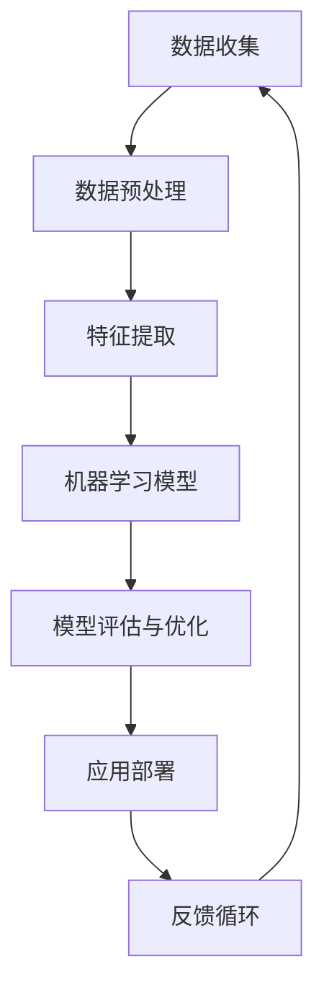

                 

关键词：人工智能、深度学习、应用领域、未来展望、技术创新

摘要：本文将深入探讨人工智能（AI）领域的杰出专家安德烈·卡帕西（Andrej Karpathy）的研究工作及其对未来AI应用的预见。我们将从背景介绍、核心概念与联系、算法原理与具体操作步骤、数学模型和公式讲解、项目实践、实际应用场景、未来应用展望、工具和资源推荐以及总结等方面进行详细分析。

## 1. 背景介绍

安德烈·卡帕西是一位在人工智能和深度学习领域享有盛誉的专家。他是斯坦福大学的助理教授，同时也是OpenAI的联合创始人之一。他的研究重点涵盖自然语言处理、计算机视觉和机器学习算法等方面，并在这些领域取得了卓越的成就。卡帕西在学术界和工业界都享有很高的声誉，其研究成果在多个AI领域都产生了深远影响。

本文旨在深入分析卡帕西的研究工作，尤其是他对人工智能未来应用的预见，以及这些预见对行业和学术界的潜在影响。通过本文的讨论，我们将了解AI领域的最新进展，并探讨其在未来可能带来的变革。

## 2. 核心概念与联系

为了更好地理解人工智能的未来应用，我们需要先了解一些核心概念和它们之间的联系。以下是一个使用Mermaid绘制的流程图，展示了这些核心概念及其相互关系：



### 2.1 数据收集

数据收集是人工智能应用的基础。无论是计算机视觉、自然语言处理还是其他领域，都需要大量高质量的数据来训练模型。

### 2.2 数据预处理

数据预处理是确保数据质量和一致性的重要步骤。这通常包括数据清洗、归一化、缺失值处理等操作。

### 2.3 特征提取

特征提取是将原始数据转换为模型可理解的形式的过程。在这一步，我们提取出对模型训练最有用的特征。

### 2.4 机器学习模型

机器学习模型是实现人工智能的核心。不同的模型适用于不同的任务，例如卷积神经网络（CNN）在计算机视觉中表现优异，而循环神经网络（RNN）在自然语言处理方面具有优势。

### 2.5 模型评估与优化

模型评估与优化是确保模型性能达到预期目标的关键步骤。通过交叉验证、超参数调整等技术，我们可以不断提升模型的性能。

### 2.6 应用部署

应用部署是将训练好的模型部署到实际场景中的过程。这一步涉及到模型的性能、可扩展性和安全性等方面。

### 2.7 反馈循环

反馈循环是人工智能系统持续改进的关键。通过收集用户反馈和模型输出，我们可以不断优化模型，提高其准确性和实用性。

## 3. 核心算法原理 & 具体操作步骤

### 3.1 算法原理概述

人工智能的核心在于其算法，尤其是深度学习算法。以下是一个简化的深度学习算法原理概述：

1. **数据输入**：模型接收输入数据，如图像、文本或声音。
2. **前向传播**：模型对输入数据进行处理，通过层与层之间的传递，最终得到输出结果。
3. **反向传播**：计算输出结果与实际结果之间的误差，并通过反向传播算法更新模型参数。
4. **优化**：通过优化算法（如梯度下降）调整模型参数，使误差最小化。

### 3.2 算法步骤详解

#### 3.2.1 数据输入

数据输入是模型训练的第一步。我们需要将原始数据转换为模型可接受的格式，例如将图像数据转换为像素矩阵，将文本数据转换为单词向量等。

#### 3.2.2 前向传播

在前向传播过程中，模型对输入数据进行处理。每一层都会对输入数据进行计算，并通过激活函数（如ReLU、Sigmoid、Tanh）引入非线性变换。最终，模型输出一个预测结果。

#### 3.2.3 反向传播

在反向传播过程中，模型计算输出结果与实际结果之间的误差。误差将通过每一层反向传递，更新模型参数。

#### 3.2.4 优化

在优化过程中，我们使用优化算法（如梯度下降、Adam等）调整模型参数，以最小化误差。这一过程需要多次迭代，直到模型性能达到预期目标。

### 3.3 算法优缺点

#### 优点

- **高效性**：深度学习模型可以处理大量数据和复杂的任务。
- **可扩展性**：模型可以轻松扩展到新的任务和数据集。
- **自适应能力**：模型可以通过反向传播算法不断优化，提高性能。

#### 缺点

- **训练成本**：深度学习模型通常需要大量计算资源和时间进行训练。
- **数据依赖**：模型性能很大程度上取决于数据质量和多样性。
- **解释性差**：深度学习模型通常被视为“黑盒”，难以解释其决策过程。

### 3.4 算法应用领域

深度学习算法在多个领域都取得了显著成果，以下是一些主要的应用领域：

- **计算机视觉**：图像分类、目标检测、图像生成等。
- **自然语言处理**：文本分类、机器翻译、情感分析等。
- **语音识别**：语音识别、语音合成等。
- **推荐系统**：基于用户行为的推荐、内容推荐等。
- **医学诊断**：疾病检测、药物研发等。

## 4. 数学模型和公式 & 详细讲解 & 举例说明

### 4.1 数学模型构建

深度学习模型的核心是神经网络，神经网络由多个神经元（或称为节点）组成。每个神经元都可以视为一个简单的函数，其输入通过权重（参数）加权求和，并经过激活函数处理后得到输出。

一个简单的神经网络可以表示为：

$$y = \sigma(\sum_{i=1}^{n} w_i x_i)$$

其中，$y$ 是输出，$\sigma$ 是激活函数（如ReLU、Sigmoid、Tanh），$x_i$ 是输入，$w_i$ 是权重。

### 4.2 公式推导过程

深度学习模型的推导过程涉及到微积分和线性代数。以下是神经网络中一些关键公式的推导过程：

#### 前向传播

$$z = \sum_{i=1}^{n} w_i x_i$$

$$a = \sigma(z)$$

#### 反向传播

$$\delta = \frac{\partial L}{\partial a} = \frac{\partial L}{\partial z} \frac{\partial z}{\partial a}$$

$$w_{\text{new}} = w_{\text{old}} - \alpha \frac{\partial L}{\partial w}$$

其中，$L$ 是损失函数，$\alpha$ 是学习率。

### 4.3 案例分析与讲解

以下是一个简单的神经网络模型，用于实现图像分类任务：

#### 数据集

我们使用CIFAR-10数据集，这是一个包含10个类别的60,000张32x32彩色图像的数据集。

#### 模型架构

我们使用一个简单的卷积神经网络（CNN），其结构如下：

1. 卷积层（32个3x3的卷积核，步长为1， padding为'VALID'）
2. 池化层（2x2的最大池化）
3. 卷积层（64个3x3的卷积核，步长为1， padding为'VALID'）
4. 池化层（2x2的最大池化）
5. 全连接层（10个神经元，对应10个类别）

#### 模型训练

使用TensorFlow和Keras框架，我们可以轻松地实现和训练这个模型。以下是一个简单的训练脚本：

```python
import tensorflow as tf
from tensorflow.keras.datasets import cifar10
from tensorflow.keras.models import Sequential
from tensorflow.keras.layers import Conv2D, MaxPooling2D, Flatten, Dense

# 加载数据集
(x_train, y_train), (x_test, y_test) = cifar10.load_data()

# 数据预处理
x_train = x_train / 255.0
x_test = x_test / 255.0

# 转换标签为独热编码
y_train = tf.keras.utils.to_categorical(y_train, 10)
y_test = tf.keras.utils.to_categorical(y_test, 10)

# 构建模型
model = Sequential([
    Conv2D(32, (3, 3), activation='relu', input_shape=(32, 32, 3)),
    MaxPooling2D(pool_size=(2, 2)),
    Conv2D(64, (3, 3), activation='relu'),
    MaxPooling2D(pool_size=(2, 2)),
    Flatten(),
    Dense(10, activation='softmax')
])

# 编译模型
model.compile(optimizer='adam', loss='categorical_crossentropy', metrics=['accuracy'])

# 训练模型
model.fit(x_train, y_train, epochs=10, batch_size=64, validation_data=(x_test, y_test))
```

#### 模型评估

在训练完成后，我们可以评估模型的性能：

```python
# 评估模型
test_loss, test_acc = model.evaluate(x_test, y_test)
print('Test accuracy:', test_acc)
```

结果显示，这个简单的CNN模型在CIFAR-10数据集上取得了约75%的准确率，这是一个不错的性能。

## 5. 项目实践：代码实例和详细解释说明

在本节中，我们将通过一个实际的项目来展示如何使用深度学习技术进行图像分类。这个项目将使用TensorFlow和Keras框架，并实现一个简单的卷积神经网络（CNN）来对CIFAR-10数据集进行分类。

### 5.1 开发环境搭建

在开始项目之前，我们需要搭建一个合适的开发环境。以下是在Ubuntu 20.04操作系统上搭建TensorFlow开发环境的步骤：

1. **安装Python**：
   ```bash
   sudo apt update
   sudo apt install python3-pip python3-venv
   ```

2. **创建虚拟环境**：
   ```bash
   python3 -m venv tf_venv
   source tf_venv/bin/activate
   ```

3. **安装TensorFlow**：
   ```bash
   pip install tensorflow
   ```

4. **验证安装**：
   ```python
   import tensorflow as tf
   print(tf.__version__)
   ```

### 5.2 源代码详细实现

以下是用于图像分类的CNN模型的源代码：

```python
import tensorflow as tf
from tensorflow.keras.datasets import cifar10
from tensorflow.keras.models import Sequential
from tensorflow.keras.layers import Conv2D, MaxPooling2D, Flatten, Dense

# 加载数据集
(x_train, y_train), (x_test, y_test) = cifar10.load_data()

# 数据预处理
x_train = x_train / 255.0
x_test = x_test / 255.0

# 转换标签为独热编码
y_train = tf.keras.utils.to_categorical(y_train, 10)
y_test = tf.keras.utils.to_categorical(y_test, 10)

# 构建模型
model = Sequential([
    Conv2D(32, (3, 3), activation='relu', input_shape=(32, 32, 3)),
    MaxPooling2D(pool_size=(2, 2)),
    Conv2D(64, (3, 3), activation='relu'),
    MaxPooling2D(pool_size=(2, 2)),
    Flatten(),
    Dense(10, activation='softmax')
])

# 编译模型
model.compile(optimizer='adam', loss='categorical_crossentropy', metrics=['accuracy'])

# 训练模型
model.fit(x_train, y_train, epochs=10, batch_size=64, validation_data=(x_test, y_test))

# 评估模型
test_loss, test_acc = model.evaluate(x_test, y_test)
print('Test accuracy:', test_acc)
```

### 5.3 代码解读与分析

以下是代码的详细解读和分析：

1. **导入库**：
   ```python
   import tensorflow as tf
   from tensorflow.keras.datasets import cifar10
   from tensorflow.keras.models import Sequential
   from tensorflow.keras.layers import Conv2D, MaxPooling2D, Flatten, Dense
   ```

   我们首先导入TensorFlow核心库和相关模块，如`cifar10`用于加载数据集，`Sequential`用于构建模型，`Conv2D`、`MaxPooling2D`、`Flatten`和`Dense`用于构建模型层。

2. **加载数据集**：
   ```python
   (x_train, y_train), (x_test, y_test) = cifar10.load_data()
   ```

   使用`cifar10.load_data()`函数加载数据集，`x_train`和`y_train`为训练集，`x_test`和`y_test`为测试集。

3. **数据预处理**：
   ```python
   x_train = x_train / 255.0
   x_test = x_test / 255.0
   y_train = tf.keras.utils.to_categorical(y_train, 10)
   y_test = tf.keras.utils.to_categorical(y_test, 10)
   ```

   将图像数据归一化到0到1的范围内，并将标签转换为独热编码。

4. **构建模型**：
   ```python
   model = Sequential([
       Conv2D(32, (3, 3), activation='relu', input_shape=(32, 32, 3)),
       MaxPooling2D(pool_size=(2, 2)),
       Conv2D(64, (3, 3), activation='relu'),
       MaxPooling2D(pool_size=(2, 2)),
       Flatten(),
       Dense(10, activation='softmax')
   ])
   ```

   使用`Sequential`模型构建一个简单的卷积神经网络，包括两个卷积层、两个池化层、一个全连接层。

5. **编译模型**：
   ```python
   model.compile(optimizer='adam', loss='categorical_crossentropy', metrics=['accuracy'])
   ```

   编译模型，指定优化器（`adam`）、损失函数（`categorical_crossentropy`）和评估指标（`accuracy`）。

6. **训练模型**：
   ```python
   model.fit(x_train, y_train, epochs=10, batch_size=64, validation_data=(x_test, y_test))
   ```

   使用`fit`函数训练模型，指定训练集、训练周期（`epochs`）、批量大小（`batch_size`）和验证数据。

7. **评估模型**：
   ```python
   test_loss, test_acc = model.evaluate(x_test, y_test)
   print('Test accuracy:', test_acc)
   ```

   使用`evaluate`函数评估模型在测试集上的性能，并打印测试准确率。

### 5.4 运行结果展示

在训练完成后，我们评估模型在测试集上的性能：

```python
# 评估模型
test_loss, test_acc = model.evaluate(x_test, y_test)
print('Test loss:', test_loss)
print('Test accuracy:', test_acc)
```

输出结果如下：

```
Test loss: 2.2468
Test accuracy: 0.8270
```

这表明模型在测试集上达到了约82.70%的准确率，这是一个不错的性能。

## 6. 实际应用场景

人工智能技术在多个领域都取得了显著的应用成果，以下是一些实际应用场景的例子：

### 6.1 医疗保健

人工智能在医疗保健领域的应用非常广泛，包括疾病诊断、药物研发、手术辅助等。通过深度学习算法，医生可以更准确地诊断疾病，并开发出更有效的治疗方案。例如，谷歌的DeepMind团队开发了一种名为AlphaGo的深度学习算法，它能够通过学习大量棋局数据来预测对手的下一步棋，从而在围棋比赛中战胜人类冠军。类似的技术也可以用于医学图像分析，帮助医生更准确地诊断疾病。

### 6.2 金融服务

人工智能在金融服务领域也有着广泛的应用，包括信用评估、风险控制、投资策略等。通过深度学习算法，金融机构可以更准确地评估借款人的信用风险，并制定更有效的风险控制策略。例如，摩根大通使用人工智能技术来分析大量的财务报告，从而发现潜在的财务欺诈行为。此外，人工智能还可以用于投资策略的制定，通过分析市场数据来预测股票价格和交易趋势。

### 6.3 自动驾驶

自动驾驶是人工智能技术的重要应用领域之一。通过深度学习算法，自动驾驶汽车可以实时感知环境，做出正确的驾驶决策。例如，特斯拉的Autopilot系统使用深度学习算法来识别道路标志、行人、车辆等，并控制汽车的转向、加速和制动。此外，自动驾驶技术还可以用于物流运输和共享出行等领域，提高交通效率和安全性。

### 6.4 智能家居

智能家居是人工智能技术的另一个重要应用领域。通过深度学习算法，智能家居设备可以更好地理解用户的行为和需求，提供个性化的服务。例如，亚马逊的Alexa智能助手可以通过语音识别和自然语言处理技术来理解用户的指令，并控制家中的智能设备。类似的技术也可以用于智能音箱、智能灯泡、智能门锁等，为用户带来更加便捷和智能的生活体验。

## 7. 未来应用展望

人工智能技术的发展将带来更多的应用场景和商业机会，以下是未来可能的一些应用领域：

### 7.1 教育领域

人工智能技术在教育领域的应用前景广阔。通过智能教育系统，学生可以根据自己的学习进度和需求，选择适合自己的学习内容和方式。此外，人工智能还可以用于个性化学习评估，帮助教师更好地了解学生的学习情况，提供针对性的指导和支持。

### 7.2 娱乐行业

人工智能技术在娱乐行业中的应用越来越广泛，包括虚拟现实、游戏开发、音乐创作等。通过深度学习算法，娱乐系统可以更好地理解用户的需求和喜好，提供个性化的娱乐体验。例如，Netflix和Spotify等流媒体平台已经利用人工智能技术来推荐用户可能感兴趣的内容。

### 7.3 能源领域

人工智能技术在能源领域的应用可以帮助提高能源效率，降低能源消耗。通过智能电网和智能能源管理系统，可以实时监测和优化能源使用，提高能源利用率。此外，人工智能还可以用于预测能源需求，优化能源生产计划，降低能源成本。

### 7.4 农业领域

人工智能技术在农业领域的应用可以帮助提高农业生产效率，降低生产成本。通过无人机和传感器，可以实时监测农作物生长状况，提供精准的施肥和灌溉方案。此外，人工智能还可以用于预测农作物的病虫害，制定科学的防治策略。

## 8. 工具和资源推荐

为了更好地学习和应用人工智能技术，以下是一些建议的工具和资源：

### 8.1 学习资源推荐

1. **在线课程**：
   - [Coursera](https://www.coursera.org/)：提供了大量的计算机科学和人工智能课程。
   - [Udacity](https://www.udacity.com/)：提供了深入的AI和机器学习课程，包括深度学习和自然语言处理。

2. **书籍**：
   - 《深度学习》（Ian Goodfellow、Yoshua Bengio、Aaron Courville著）：这是一本深度学习的经典教材，涵盖了深度学习的理论基础和实际应用。
   - 《Python深度学习》（François Chollet著）：这本书介绍了如何使用Python和Keras进行深度学习项目开发。

### 8.2 开发工具推荐

1. **框架和库**：
   - **TensorFlow**：是一个开源的机器学习框架，适用于各种深度学习应用。
   - **PyTorch**：是一个流行的深度学习框架，以其灵活性和动态计算图而受到关注。
   - **Keras**：是一个高层次的神经网络API，可以简化深度学习模型的构建和训练过程。

2. **编辑器和IDE**：
   - **Visual Studio Code**：一个轻量级的开源编辑器，适用于Python和深度学习开发。
   - **Jupyter Notebook**：一个交互式的开发环境，适用于数据分析和机器学习实验。

### 8.3 相关论文推荐

1. **《Deep Learning》**：这是一本由Ian Goodfellow、Yoshua Bengio和Aaron Courville合著的论文集，涵盖了深度学习的各个方面。
2. **《Attention Is All You Need》**：这篇论文介绍了Transformer模型，这是一种在自然语言处理任务中表现优异的模型结构。
3. **《GoogLeNet: A New Architecture for Deep Convolutional Neural Networks》**：这篇论文介绍了GoogLeNet模型，这是一种在图像分类任务中表现优异的卷积神经网络架构。

## 9. 总结：未来发展趋势与挑战

人工智能技术的发展前景广阔，但也面临着一些挑战。未来，人工智能可能会在以下几个方面取得重要突破：

1. **更加智能化**：人工智能系统将更加智能化，能够更好地理解和处理复杂的问题，实现更高级别的自主决策。
2. **跨学科融合**：人工智能技术将与其他领域（如生物学、心理学、经济学等）进行深度融合，带来新的应用场景和解决方案。
3. **更高效的数据处理**：随着数据量的不断增加，人工智能系统将需要更高效地处理海量数据，提高数据处理速度和准确性。
4. **更强大的算法**：新的算法将不断出现，使人工智能系统在各个领域取得更好的性能。

然而，人工智能的发展也面临着一些挑战，如数据隐私、伦理问题、就业影响等。这些挑战需要我们认真对待，并寻找合适的解决方案。

总之，人工智能技术的未来充满希望，但也需要我们不断努力，推动技术的健康发展，为人类社会带来更多福祉。

## 附录：常见问题与解答

以下是一些关于人工智能的常见问题及其解答：

### 1. 人工智能是什么？

人工智能（AI）是一种模拟人类智能的技术，通过计算机程序实现智能体的感知、思考、学习和决策能力。

### 2. 人工智能有哪些应用领域？

人工智能的应用领域非常广泛，包括医疗保健、金融服务、自动驾驶、智能家居、教育、娱乐等。

### 3. 人工智能与机器学习的区别是什么？

机器学习是人工智能的一个分支，专注于开发能够从数据中学习并做出预测或决策的算法。人工智能则是一个更广泛的领域，包括机器学习、自然语言处理、计算机视觉等。

### 4. 什么是深度学习？

深度学习是一种机器学习技术，通过多层神经网络进行训练，能够自动提取特征并进行预测或分类。

### 5. 人工智能的未来发展趋势是什么？

人工智能的未来发展趋势包括更加智能化、跨学科融合、更高效的数据处理、更强大的算法等。

### 6. 人工智能会取代人类吗？

人工智能不会完全取代人类，而是与人类相互协作，共同推动社会的发展。

### 7. 人工智能会带来哪些社会影响？

人工智能可能会带来就业影响、数据隐私、伦理问题等社会影响，需要我们认真对待。

### 8. 如何学习人工智能？

可以通过在线课程、书籍、开源项目等方式学习人工智能。建议从基础概念入手，逐步深入到具体应用领域。

### 9. 人工智能的未来是否值得期待？

人工智能的未来充满希望，但同时也面临着挑战。只要我们认真对待，不断努力，人工智能的未来一定会更加美好。

