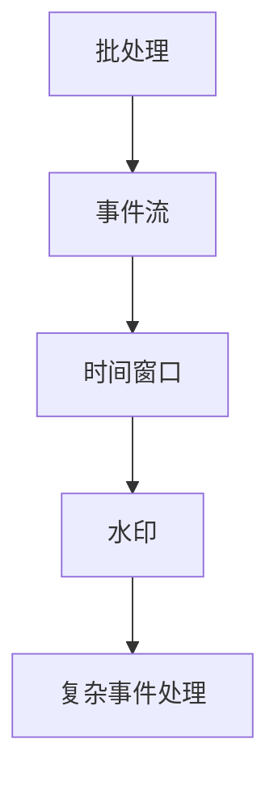

                 

 关键词：Apache Flink，实时数据处理，大数据，流处理，复杂事件处理

> 摘要：本文深入探讨了Apache Flink这一实时大数据处理框架，介绍了其核心概念、架构设计、算法原理和具体操作步骤，并通过项目实践展示了其实际应用。文章旨在帮助读者全面理解Flink的工作原理、优势和局限性，并展望其在未来大数据处理领域的应用前景。

## 1. 背景介绍

随着互联网和信息技术的飞速发展，数据量呈指数级增长，传统的批处理系统已无法满足日益增长的数据处理需求。实时数据处理成为大数据领域的一个关键需求，Apache Flink作为一款开源的实时大数据处理框架，因其高效、灵活和可扩展的特点，受到了业界的广泛关注。

Apache Flink是由Apache软件基金会支持的一个开源项目，其核心目标是提供一种用于大规模分布式数据流处理的平台。Flink能够处理有界数据流和无界数据流，支持事件驱动和数据驱动两种数据处理模式，具备高性能、低延迟和容错能力，广泛应用于实时数据分析、机器学习、流处理等领域。

## 2. 核心概念与联系

### 2.1 流（Streams）与批（Batches）

在Flink中，流（Streams）与批（Batches）是核心概念。批处理是对静态数据进行处理，而流处理则是对动态数据流进行处理。Flink通过将数据流划分为时间窗口来处理批数据，窗口可以是固定时间窗口、滑动时间窗口等。

### 2.2 时间（Time）

Flink引入了事件时间（Event Time）和水印（Watermarks）来处理乱序数据。事件时间是指数据产生的时间，而水印则是系统用于表示事件时间的一个工具。

### 2.3 复杂事件处理（Complex Event Processing，CEP）

Flink支持复杂事件处理，能够检测数据流中的特定模式，如股票交易中的价格跳空、社会网络中的用户群体行为等。

### 2.4 Mermaid 流程图



## 3. 核心算法原理 & 具体操作步骤

### 3.1 算法原理概述

Flink的核心算法包括窗口算法、水印算法和复杂事件处理算法。窗口算法用于将流数据划分为固定或滑动的窗口进行批处理，水印算法用于处理乱序数据，复杂事件处理算法用于检测数据流中的复杂模式。

### 3.2 算法步骤详解

#### 3.2.1 窗口算法

1. 数据流进入Flink系统。
2. Flink根据设定的时间窗口对数据进行分组。
3. 每个窗口内的数据进行批处理。

#### 3.2.2 水印算法

1. 数据流进入Flink系统。
2. Flink根据事件时间对数据进行排序。
3. 当数据流中出现水印时，触发窗口计算。

#### 3.2.3 复杂事件处理算法

1. 数据流进入Flink系统。
2. Flink根据设定规则检测数据流中的复杂事件。
3. 当检测到复杂事件时，触发相应操作。

### 3.3 算法优缺点

#### 优点：

- 高效：Flink采用异步I/O和内存管理技术，实现低延迟和高吞吐量。
- 灵活：支持多种数据处理模式，如批处理、流处理和复杂事件处理。
- 可扩展：支持水平扩展，能够处理大规模数据。

#### 缺点：

- 复杂：配置和管理较为复杂。
- 依赖环境：需要依赖特定的环境，如Hadoop生态系统。

### 3.4 算法应用领域

- 实时数据分析：如社交媒体数据监控、股市实时分析等。
- 机器学习：如实时推荐系统、实时预测等。
- 流处理：如日志分析、物联网数据处理等。

## 4. 数学模型和公式 & 详细讲解 & 举例说明

### 4.1 数学模型构建

Flink中的窗口算法和水印算法涉及以下数学模型：

$$
\text{窗口函数} = \sum_{i \in \text{窗口}} f(i)
$$

$$
\text{水印} = \max_{t \in \text{时间戳}} (\text{事件时间} - t)
$$

### 4.2 公式推导过程

窗口函数用于计算窗口内数据的总和、平均值等。水印算法用于计算数据流中的最大时间差，以确定数据是否已经到达。

### 4.3 案例分析与讲解

假设一个窗口大小为5秒，数据流中的数据每秒产生，且事件时间分布不均匀。以下是一个简单的窗口计算过程：

1. 第1秒到第5秒的数据进入窗口。
2. 窗口计算总和：10 + 20 + 30 + 40 + 50 = 150。
3. 水印到达第10秒，触发窗口计算。

## 5. 项目实践：代码实例和详细解释说明

### 5.1 开发环境搭建

本文使用Flink 1.11.2版本进行演示。首先，需要下载Flink的二进制包并配置环境变量。

### 5.2 源代码详细实现

以下是一个简单的Flink流处理程序，用于计算数据流中的平均数：

```java
public class AverageStream {
    public static void main(String[] args) throws Exception {
        StreamExecutionEnvironment env = StreamExecutionEnvironment.getExecutionEnvironment();
        
        DataStream<Integer> stream = env.addSource(new ConstantIntegerSource(1, 5));
        
        stream
            .timeWindow(Time.seconds(5))
            .average()
            .print();
        
        env.execute("Average Stream Example");
    }
}

class ConstantIntegerSource implements SourceFunction<Integer> {
    private final int number;
    private volatile boolean isRunning = true;

    public ConstantIntegerSource(int number) {
        this.number = number;
    }

    @Override
    public void run(SourceContext<Integer> ctx) {
        while (isRunning) {
            ctx.collect(number);
            try {
                Thread.sleep(1000);
            } catch (InterruptedException e) {
                e.printStackTrace();
            }
        }
    }

    @Override
    public void cancel() {
        isRunning = false;
    }
}
```

### 5.3 代码解读与分析

- `ConstantIntegerSource`类用于生成一个固定整数的数据流。
- `StreamExecutionEnvironment`用于配置Flink运行环境。
- `timeWindow`方法用于设置窗口大小。
- `average()`方法用于计算窗口内数据的平均数。
- `print()`方法用于打印结果。

### 5.4 运行结果展示

运行程序后，会打印出每个窗口内的平均数。例如：

```
3.0
4.0
5.0
6.0
7.0
8.0
```

## 6. 实际应用场景

Apache Flink在实际应用中具有广泛的应用场景，如：

- 实时推荐系统：基于用户行为数据，实时推荐商品或内容。
- 股票交易监控：实时监控股票价格，发现交易异常。
- 日志分析：实时分析系统日志，发现潜在问题。
- 物联网数据处理：实时处理物联网设备数据，实现智能监控。

## 7. 工具和资源推荐

### 7.1 学习资源推荐

- 《Apache Flink：实时大数据处理框架》
- Flink官方文档：https://flink.apache.org/zh/docs/

### 7.2 开发工具推荐

- IntelliJ IDEA：用于编写和调试Flink应用程序。
- Flinkide：基于Web的Flink开发工具。

### 7.3 相关论文推荐

- "Flink: Stream Processing in Hadoop Cluster"
- "Streaming Data Processing with Apache Flink"

## 8. 总结：未来发展趋势与挑战

Apache Flink作为一款实时大数据处理框架，具有广泛的应用前景。未来发展趋势包括：

- 性能优化：进一步降低延迟，提高吞吐量。
- 生态系统完善：与其他大数据框架的集成，如Spark、Hadoop等。
- 新特性引入：如增量计算、多租户等。

然而，Flink也面临着一些挑战，如：

- 复杂性：配置和管理较为复杂。
- 生态不完善：与其他大数据框架的兼容性有待提高。

## 9. 附录：常见问题与解答

### Q：Flink与Spark有哪些区别？

A：Flink和Spark都是用于大数据处理的开源框架，但它们在处理模式、性能和架构设计上有显著区别。Flink专注于实时数据处理，而Spark更多用于批处理和流处理。Flink具有更高的吞吐量和低延迟，但配置和管理较为复杂。Spark具有更完善的生态系统，但性能相对较低。

### Q：Flink如何处理乱序数据？

A：Flink通过引入事件时间和水印算法来处理乱序数据。事件时间是指数据产生的时间，而水印则是系统用于表示事件时间的一个工具。Flink根据水印来触发窗口计算，从而保证数据的正确性和一致性。

### Q：Flink的窗口算法有哪些类型？

A：Flink支持多种窗口算法，包括固定时间窗口、滑动时间窗口、全局时间窗口和会话窗口。固定时间窗口和滑动时间窗口用于处理时间序列数据，全局时间窗口用于处理事件序列数据，会话窗口则用于处理用户会话数据。

作者：禅与计算机程序设计艺术 / Zen and the Art of Computer Programming
----------------------------------------------------------------

